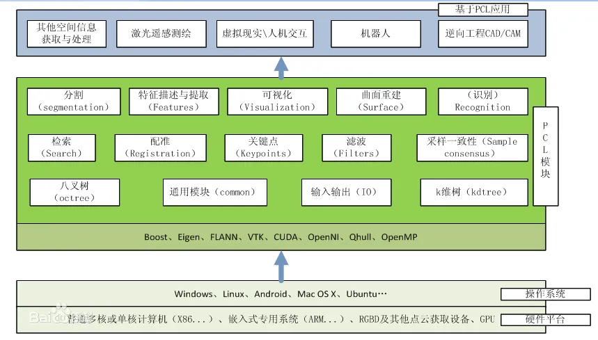
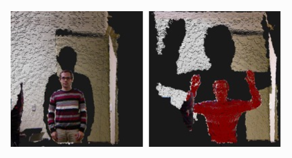

# 1、简介

- `PCL` 架构图如图

  

  对于3D点云处理来说， `PCL` 完全是一个模块化的现代C+ + 模板库。

  其基于以下第三方库：`Boost `、`Eigen` 、`FLANN `、`VTK` 、`CUDA `、`OpenNI `、`QHull `

  实现点云相关的**获取、滤波、分割、配准、检索、特征提取、识别、追踪、曲面重建、可视化**等。

- `PCL` 中的所有模块和算法都是通过 `Boost` 共享指针来传送数据，因而避免了多次复制系统中已存在的数据的需要。

- 从算法的角度， `PCL`是指纳入了多种操作点云数据的**三维处理算法，其中包括过滤、特征估计、表面重建、模型拟合和分割、定位搜索**等。

- 在`PCL`中一个处理管道的**基本接口程序**如下:

  1. **创建处理对象〈例如过滤、特征估计、分割等) **
  2. **使用set lnput Cloud 通过输入点云数据，处理模块**
  3. **设置算法相关参数**
  4. **调用计算(或过滤、分割等〉得到输出.**


# 2、安装

1. 安装依赖

   ```bash
   sudo apt-get update  
   sudo apt-get install git build-essential linux-libc-dev
   sudo apt-get install cmake cmake-gui
   sudo apt-get install libusb-1.0-0-dev libusb-dev libudev-dev
   sudo apt-get install mpi-default-dev openmpi-bin openmpi-common 
   sudo apt-get install libflann-* libflann-dev
   sudo apt-get install libeigen3-dev
   sudo apt-get install libboost-all-dev
   sudo apt-get install libvtk7.1-qt libvtk7.1 libvtk7-qt-dev
   sudo apt-get install libqhull* libgtest-dev
   sudo apt-get install freeglut3-dev pkg-config
   sudo apt-get install libxmu-dev libxi-dev
   sudo apt-get install mono-complete
   sudo apt-get install openjdk-8-jdk openjdk-8-jre
   ```

2. 下载 PCL 源码

   [github链接](https://github.com/PointCloudLibrary/pcl/releases)

   > 下载其中的 `Source code(tar.gz) `

   解压

   ```
   tar -zxvf pcl-pcl-1.14.1.tar.gz
   ```

3. 编译安装

   ```bash
   cd pcl-pcl-1.14.1
   mkdir build
   cd build
   cmake -DCMAKE_BUILD_TYPE=None -DCMAKE_INSTALL_PREFIX=/usr \ -DBUILD_GPU=ON-DBUILD_apps=ON -DBUILD_examples=ON \ -DCMAKE_INSTALL_PREFIX=/usr .. 
   make -j8
   sudo make install  
   ```

4. 安装 `pcl-viewer`

   ```bash
   sudo apt install pcl-tools
   ```

   - 关于 `pcl-viewer`

     - 查看点云文件

       ```bash
       pcl_viewer test.pcd
       ```

       输出

       ```bash
       2024-11-02 15:48:10.978 (   0.003s) [        D0FDE880] vtkContextDevice2D.cxx:32    WARN| Error: no override found for 'vtkContextDevice2D'.
       The viewer window provides interactive commands; for help, press 'h' or 'H' from within the window.
       > Loading example.pcd [PCLVisualizer::setUseVbos] Has no effect when OpenGL version is ≥ 2
       [done, 194.224 ms : 397 points]
       Available dimensions: x y z
       ```

     - 按下 `h` 查看帮助

       ```bash
       | Help:
       -------
                 p, P   : switch to a point-based representation
                 w, W   : switch to a wireframe-based representation (where available)
                 s, S   : switch to a surface-based representation (where available)
       
                 j, J   : take a .PNG snapshot of the current window view
                 c, C   : display current camera/window parameters
                 f, F   : fly to point mode
       
                 e, E   : exit the interactor
                 q, Q   : stop and call VTK's TerminateApp
       
                  +/-   : increment/decrement overall point size
            +/- [+ ALT] : zoom in/out 
       
                 g, G   : display scale grid (on/off)
                 u, U   : display lookup table (on/off)
       
           o, O         : switch between perspective/parallel projection (default = perspective)
           r, R [+ ALT] : reset camera [to viewpoint = {0, 0, 0} -> center_{x, y, z}]
           CTRL + s, S  : save camera parameters
           CTRL + r, R  : restore camera parameters
       
           ALT + s, S   : turn stereo mode on/off
           ALT + f, F   : switch between maximized window mode and original size
       
                 l, L           : list all available geometric and color handlers for the current actor map
           ALT + 0..9 [+ CTRL]  : switch between different geometric handlers (where available)
                 0..9 [+ CTRL]  : switch between different color handlers (where available)
       
           SHIFT + left click   : select a point (start with -use_point_picking)
       
                 x, X   : toggle rubber band selection mode for left mouse button
       ```

     - 查看点云坐标

       ```bash
       pcl_viewer test.pcd -use_point_picking
       ```

       > 按住 `shift` 选择点，在界面选择点云后，会在终端输出点云坐标

     - 启用 `xyz` 轴

       ```bash
       pcl_viewer test.pcd -ax 5 #5表示轴的放大倍数
       ```

     - 一次打开多个点云文件

       - 不同窗口

         ```bash
          pcl_viewer -multiview 1 pig1.pcd pig2.pcd test.pcd
         ```

       - 同一窗口

         ```bash
          pcl_viewer pig1.pcd pig2.pcd test.pcd
         ```

       

# 3、创建demo

> （验证一下有没有安装成功）

1. 新建工作区

   ```bash
   mkdir pcl_demo
   ```

2. 创建文件

   `pcl_demo.cpp`

   ```cpp
   #include <iostream>                // 引入标准输入输出流库，用于输出消息
   #include <pcl/io/pcd_io.h>         // 引入 PCL 的 PCD 输入输出库，用于读取和写入 PCD 文件
   #include <pcl/point_types.h>       // 引入 PCL 的点类型库，定义不同的点云数据结构
   
   int main() {
       // 定义一个 PointCloud 对象，使用 pcl::PointXYZ 作为点的类型。
       // pcl::PointXYZ 表示一个三维点，包含 x、y 和 z 坐标。
       pcl::PointCloud<pcl::PointXYZ> cloud;
   
       // 填充点云数据
       cloud.width = 5;               // 设置点云的宽度，这里表示每行的点数
       cloud.height = 1;              // 设置点云的高度，这里表示只有一行
       cloud.is_dense = false;        // 表示点云可能存在无效点，为 false 表示点云不是密集的
       cloud.resize(cloud.width * cloud.height); // 调整点云的大小，分配内存以存储所有点
   
       // 使用循环填充点云中的每个点
       for (auto& point : cloud) {
           // 为每个点生成随机坐标，并将结果赋值给点云的点
           // rand() 函数生成一个随机数，这里范围从 0 到 1024
           point.x = 1024 * rand() / (RAND_MAX + 1.0f);  // x 坐标
           point.y = 1024 * rand() / (RAND_MAX + 1.0f);  // y 坐标
           point.z = 1024 * rand() / (RAND_MAX + 1.0f);  // z 坐标
       }
   
       // 将生成的点云数据保存到名为 "test_pcd.pcd" 的 PCD 文件中，使用 ASCII 格式。
       pcl::io::savePCDFileASCII("test_pcd.pcd", cloud);
   
       // 输出保存的点的数量到标准错误流
       std::cerr << "Saved " << cloud.size() << " data points to test_pcd.pcd." << std::endl;
   
       // 遍历点云数据，输出每个点的坐标到标准错误流
       for (const auto& point : cloud) {
           // 输出每个点的 x、y、z 坐标
           std::cerr << "    " << point.x << " " << point.y << " " << point.z << std::endl;
       }
   
       return 0;   // 主程序返回 0，表示程序正常结束
   }
   
   ```

   `CMakeLists.txt`

   ```cmake
   cmake_minimum_required(VERSION 2.6 FATAL_ERROR)
   project(MY_GRAND_PROJECT)
   find_package(PCL 1.3 REQUIRED)
   include_directories(${PCL_INCLUDE_DIRS})
   link_directories(${PCL_LIBRARY_DIRS})
   add_definitions(${PCL_DEFINITIONS})
   add_executable(pcl_demo pcl_demo.cpp)
   target_link_libraries(pcl_demo ${PCL_LIBRARIES})
   ```

3. 编译

   ```bash
   mkdir build
   cd build
   cmake ..
   make -j8
   ```

4. 运行

   ```bash
   ./pcl_demo
   ```

   输出

   ```bash
   Saved 5 data points to test_pcd.pcd.
       0.352222 -0.151883 -0.106395
       -0.397406 -0.473106 0.292602
       -0.731898 0.667105 0.441304
       -0.734766 0.854581 -0.0361733
       -0.4607 -0.277468 -0.916762
   ```

   `test_pcd.pcd`

   ```python
   # .PCD v0.7 - Point Cloud Data file format
   VERSION 0.7								# 版本号
   FIELDS x y z							# 指定每个点的维度
   SIZE 4 4 4								# 每一维度的大小
   TYPE F F F								# 每一维度的数据类型
   COUNT 1 1 1								# 每一维度包含的元素数目
   WIDTH 5									# 宽
   HEIGHT 1								# 高
   VIEWPOINT 0 0 0 1 0 0 0					# 指定点云的获取视点（平移xyz + 四元数wxyz）
   POINTS 5								# 点云总数 = WIDTH*HEIGHT
   DATA ascii								# 指定点云数据的数据类型（可选 ascii 、二进制）
   0.35222197 -0.15188313 -0.10639524
   -0.3974061 -0.47310591 0.29260206
   -0.73189831 0.66710472 0.44130373
   -0.73476553 0.85458088 -0.036173344
   -0.46070004 -0.2774682 -0.91676188
   
   ```

   

5. 使用 `pcl_viewer` 查看点云文件

   ```bash
   pcl_viewer test_pcd.pcd
   ```

   经过放大后可看到

   


# 4、Common 模块

- 概述
  - `pcl_common`库包含大多数 PCL 库使用的通用数据结构和方法
  - 核心数据结构包括 PointCloud 类和用于表示点、表面法线、RGB 颜色值、特征描述符等的多种点类型。
  - 它还包含用于计算距离/范数、均值和协方差、角度转换、几何变换等的众多函数。

- 头文件
  - `angles.h`：定义了标准的 C 接口的**角度计算**函数
  - `centriod.h`：定义了**中心点的估算**以及**协方差矩阵**的计算
  - `common.h`：标准的C以及C++类，**是其他common 函数的父类**
  - `distance.h`：定义标准的C接口用于**计算距离**
  - `file_io.h`：定义了一些**文件读写**的功能。
  - `random.h`：定义一些**随机点云生成**的函数
  - `geometry.h`：定义一些**基本的几何功能**的函数
  - `intersection.h：` 定义**线、面等相交**的函数
  - `norm.h`：定义了标准的C方法**计算矩阵的正则化**
  - `time.h`：定义了**时间计算**的函数
  - `Point_types.h`：定义了所有 `PCL` 实现的**点云的数据结构的类型**


- 主要函数

  ```cpp
  pcl::rad2deg(float alpha)
  //从弧度到角度
  
  pcl::deg2rad(float aipha)
  //从角度到弧度
  
  pcl::normAngle(float alpha)
  //正则化角度在（-PI，PI）之间
  
  pcl::compute3DCentroid (const pcl::PointCloud< PointT > &cloud, Eigen::Matrix< Scalar, 4, 1 > &centroid)
  //计算给定一群点的3D中心点，并且返回一个三维向量
  
  pcl::computeCovarianceMatrix (const pcl::PointCloud< PointT > &cloud, const Eigen::Matrix< Scalar, 4, 1 > &centroid, Eigen::Matrix< Scalar, 3, 3 > &covariance_matrix)
  //计算给定的三维点云的协方差矩阵。
  
  
  pcl::computeMeanAndCovarianceMatrix (const pcl::PointCloud< PointT > &cloud, Eigen::Matrix< Scalar, 3, 3 > &covariance_matrix, Eigen::Matrix< Scalar, 4, 1 > &centroid)
  //计算正则化的3*3的协方差矩阵以及给定点云数据的中心点
  
  pcl::demeanPointCloud (const pcl::PointCloud< PointT > &cloud_in, const Eigen::Matrix< Scalar, 4, 1 > &centroid, pcl::PointCloud< PointT > &cloud_out)
      
  
  pcl::computeNDCentroid (const pcl::PointCloud< PointT > &cloud, Eigen::Matrix< Scalar, Eigen::Dynamic, 1 > &centroid)
  //利用一组点的指数对其进行一般的、通用的nD中心估计。
  
  
  pcl::getAngle3D (const Eigen::Vector4f &v1, const Eigen::Vector4f &v2, const bool in_degree=false)
  //计算两个向量之间的角度
  
  
  pcl::getMeanStd (const std::vector< float > &values, double &mean, double &stddev)
  //同时计算给定点云数据的均值和标准方差
  
  
  pcl::getPointsInBox (const pcl::PointCloud< PointT > &cloud, Eigen::Vector4f &min_pt, Eigen::Vector4f &max_pt, std::vector< int > &indices)
  //在给定边界的情况下，获取一组位于框中的点
  
  
  pcl::getMaxDistance (const pcl::PointCloud< PointT > &cloud, const Eigen::Vector4f &pivot_pt, Eigen::Vector4f &max_pt)
  //给定点云数据中点与点之间的最大距离的值
  
  
  pcl::getMinMax3D (const pcl::PointCloud< PointT > &cloud, PointT &min_pt, PointT &max_pt)
  //获取给定点云中的在XYZ轴上的最大和最小值
  
  
  pcl::getCircumcircleRadius (const PointT &pa, const PointT &pb, const PointT &pc)
  //计算由三个点pa、pb和pc构成的三角形的外接圆半径。
  
  
  pcl::getMinMax (const PointT &histogram, int len, float &min_p, float &max_p)
  //获取点直方图上的最小值和最大值。
  
  
  pcl::calculatePolygonArea (const pcl::PointCloud< PointT > &polygon)
  //根据给定的多边形的点云计算多边形的面积
  
  
  pcl::copyPoint (const PointInT &point_in, PointOutT &point_out)
  //从Point_in把字段数据赋值到Point_out
  
  
  pcl::lineToLineSegment (const Eigen::VectorXf &line_a, const Eigen::VectorXf &line_b, Eigen::Vector4f &pt1_seg, Eigen::Vector4f &pt2_seg)
  //获取两条三维直线之间的最短三维线段
  
  
  pcl::sqrPointToLineDistance (const Eigen::Vector4f &pt, const Eigen::Vector4f &line_pt, const Eigen::Vector4f &line_dir)
  //获取点到线的平方距离（由点和方向表示）
  
  
  pcl::getMaxSegment (const pcl::PointCloud< PointT > &cloud, PointT &pmin, PointT &pmax)
  //在给定的一组点中获得最大分段，并返回最小和最大点。
  
  
  pcl::eigen22 (const Matrix &mat, typename Matrix::Scalar &eigenvalue, Vector &eigenvector)
  //确定最小特征值及其对应的特征向量
  
  
  pcl::computeCorrespondingEigenVector (const Matrix &mat, const typename Matrix::Scalar &eigenvalue, Vector &eigenvector)
  //确定对称半正定输入矩阵给定特征值对应的特征向量
  
  
  pcl::eigen33 (const Matrix &mat, typename Matrix::Scalar &eigenvalue, Vector &eigenvector)
  //确定对称半正定输入矩阵最小特征值的特征向量和特征值
  
  
  pcl::invert2x2 (const Matrix &matrix, Matrix &inverse)
  //计算2x2矩阵的逆。
  
  
  pcl::invert3x3SymMatrix (const Matrix &matrix, Matrix &inverse)
  //计算3x3对称矩阵的逆。
  
  
  pcl::determinant3x3Matrix (const Matrix &matrix)
  //计算3x3矩阵的行列式
  
  
  pcl::getTransFromUnitVectorsZY (const Eigen::Vector3f &z_axis, const Eigen::Vector3f &y_direction, Eigen::Affine3f &transformation)
  //获得唯一 的3D旋转，将Z轴旋转成（0，0，1）Y轴旋转成（0,1,0）并且两个轴是正交的。
  
  
  pcl::getTransformationFromTwoUnitVectorsAndOrigin (const Eigen::Vector3f &y_direction, const Eigen::Vector3f &z_axis, const Eigen::Vector3f &origin, Eigen::Affine3f &transformation)
  //得到将origin转化为（0，0，0）的变换，并将Z轴旋转成（0，0，1）和Y方向（0，1，0）
  
  
  pcl::getEulerAngles (const Eigen::Transform< Scalar, 3, Eigen::Affine > &t, Scalar &roll, Scalar &pitch, Scalar &yaw)
  //从给定的变换矩阵中提取欧拉角
  
  
  pcl::getTranslationAndEulerAngles (const Eigen::Transform< Scalar, 3, Eigen::Affine > &t, Scalar &x, Scalar &y, Scalar &z, Scalar &roll, Scalar &pitch, Scalar &yaw)
  //给定的转换中，提取XYZ以及欧拉角
  
  
  pcl::getTransformation (float x, float y, float z, float roll, float pitch, float yaw)
  //从给定的平移和欧拉角创建转换矩阵
  
  
  pcl::saveBinary (const Eigen::MatrixBase< Derived > &matrix, std::ostream &file)
  //保存或者写矩阵到一个输出流中
  
  
  pcl::loadBinary (Eigen::MatrixBase< Derived > const &matrix, std::istream &file)
  //从输入流中读取矩阵
  
  
  pcl::lineWithLineIntersection (const Eigen::VectorXf &line_a, const Eigen::VectorXf &line_b, Eigen::Vector4f &point, double sqr_eps=1e-4)
  //获取空间中两条三维直线作为三维点的交点。
  
  
  pcl::getFieldIndex (const pcl::PCLPointCloud2 &cloud, const std::string &field_name)
  //获取指定字段的索引（即维度/通道）
  
  
  pcl::getFieldsList (const pcl::PointCloud< PointT > &cloud)
  //获取给定点云中所有可用字段的列表
  
  
  pcl::getFieldSize (const int datatype)
  //获取特定字段数据类型的大小（字节）。
  
  
  pcl::concatenatePointCloud (const pcl::PCLPointCloud2 &cloud1, const pcl::PCLPointCloud2 &cloud2, pcl::PCLPointCloud2 &cloud_out)
  //连接 pcl::PCLPointCloud2类型的点云字段
  ```

  


## `pcl/common/angle.h`

>  `pcl/common/angles.h` 定义了与角度计算相关的标准 C 方法，主要用于在计算机视觉和点云处理等领域中涉及到的角度转换及规范化。
>

### ① 主要内容
- 该文件定义了一些常用的角度转换及规范化函数，包括：

1. 弧度转度数
2. 度数转弧度
3. 角度规范化


### ② 主要功能

- 该头文件中的功能主要是方便开发者进行角度的单位转换和规范化，避免因角度单位不一致导致的计算错误。


### ③ 函数和类的详细说明

###### 1. `rad2deg(float alpha)`
将弧度转换为度数。

- **参数**: 
  - `alpha`: 输入角度，单位为弧度（`float` 类型）。
  
- **返回值**: 
  - 返回转换后的角度，单位为度数（`float` 类型）。

###### 2. `deg2rad(float alpha)`
将度数转换为弧度。

- **参数**: 
  - `alpha`: 输入角度，单位为度（`float` 类型）。
  
- **返回值**: 
  - 返回转换后的角度，单位为弧度（`float` 类型）。

###### 3. `rad2deg(double alpha)`
将弧度转换为度数。

- **参数**: 
  - `alpha`: 输入角度，单位为弧度（`double` 类型）。
  
- **返回值**: 
  - 返回转换后的角度，单位为度数（`double` 类型）。

###### 4. `deg2rad(double alpha)`
将度数转换为弧度。

- **参数**: 
  - `alpha`: 输入角度，单位为度（`double` 类型）。
  
- **返回值**: 
  - 返回转换后的角度，单位为弧度（`double` 类型）。

###### 5. `normAngle(float alpha)`
将角度标准化到 (-π, π] 的范围内。

- **参数**: 
  - `alpha`: 输入角度，单位为弧度（`float` 类型）。
  
- **返回值**: 
  - 返回标准化后的角度，单位为弧度（`float` 类型）。


### ④示例代码

```cpp
#include <iostream>
#include <pcl/common/angles.h> // 包含角度计算的头文件

int main() {
    float angle_degrees = 180.0f; // 定义一个角度，单位为度
    float angle_radians = pcl::deg2rad(angle_degrees); // 将度数转换为弧度

    std::cout << angle_degrees << " degrees is " 
              << angle_radians << " radians." << std::endl;

    angle_radians = 3.14159265f; // 定义一个角度，单位为弧度
    angle_degrees = pcl::rad2deg(angle_radians); // 将弧度转换为度数

    std::cout << angle_radians << " radians is " 
              << angle_degrees << " degrees." << std::endl;

    // 测试角度规范化
    float angle_to_normalize = 4.0f * 3.14159265f; // 超过 2*PI 的值
    float normalized_angle = pcl::normAngle(angle_to_normalize); // 规范化角度

    std::cout << "Normalized angle: " 
              << normalized_angle << " radians." << std::endl;

    return 0; // 返回成功
}
```


## `pcl/common/centroid.h`中的ND和OBB部分

> `pcl/common/centroid.h`是PCL库中的一个头文件，提供了与点云的质心估计和协方差矩阵计算相关的功能。在此头文件中，ND（n维）和OBB（有向边界框）部分为用户提供了计算点云的质心及其有向边界框的功能，这在点云分析和处理过程中具有重要的应用。

### ① 主要内容

- **ND质心估计**：实现了对n维点云的质心计算，适用于不同维度的点数据。
- **OBB计算**：提供了计算点云的有向边界框，包括质心、边界框的中心、尺寸和旋转矩阵。


### ② 主要功能与实际用途

- **计算n维质心**：
  - **用途**：用于获取点云的平衡点（质心），这是许多几何计算的基础，例如物体定位、姿态估计等。

- **计算有向边界框（OBB）**：
  - **用途**：OBB提供了点云的外部轮廓，可以用于目标检测、碰撞检测和物体分类等任务。根据OBB的旋转矩阵，可以容易地在三维空间中进行可视化。


### ③ 函数和类的详细说明

###### 1. `computeCentroidAndOBB`

- **功能**：计算点云的质心和OBB的相关信息。
- **参数**：
  - `cloud`: 输入的点云。
  - `centroid`: 输出的质心（XYZ坐标）。
  - `obb_center`: OBB的中心位置。
  - `obb_dimensions`: OBB的尺寸（宽、高、深）。
  - `obb_rotational_matrix`: OBB的旋转矩阵。
- **返回值**：有效点的数量。

通过OBB的旋转矩阵（`obb_rotational_matrix`），可以得出OBB相对于世界坐标系的方向，并通过OBB的中心和尺寸在3D中进行可视化。

###### 2. `NdCentroidFunctor`

- **功能**：用于n维质心的估计，作为functor（函数对象）。
- **构造函数**：接受一个点（`PointT`）和一个质心向量。
- **操作符**：用于更新质心，每次调用都会检查当前维度的值是否为有限数。

这使得在处理复杂的点云数据时，可以灵活地计算不同维度的质心。

###### 3. `computeNDCentroid`

- **功能**：通用的n维质心计算，支持使用给定点的索引。
- **参数**：
  - `cloud`: 输入的点云。
  - `indices`: 需要使用的点的索引。
  - `centroid`: 输出的质心。
- **返回值**：有效点的数量。


### ④ 示例代码

```cpp
#include <iostream>
#include <pcl/io/pcd_io.h> // 用于读取PCD文件
#include <pcl/point_cloud.h>
#include <pcl/common/centroid.h>
#include <pcl/visualization/cloud_viewer.h>

int main() {
    // 创建点云对象并读取点云数据
    pcl::PointCloud<pcl::PointXYZ> cloud;
    if (pcl::io::loadPCDFile("example.pcd", cloud) == -1) {
        std::cerr << "无法读取文件" << std::endl;
        return -1;
    }

    // 输出点云大小
    std::cout << "点云包含 " << cloud.points.size() << " 点。" << std::endl;

    // 计算质心
    Eigen::Vector4f centroid;
    Eigen::Vector4f obb_center;
    Eigen::Vector3f obb_dimensions;
    Eigen::Matrix3f obb_rotational_matrix;

    unsigned int valid_points = pcl::computeCentroidAndOBB(cloud, centroid, obb_center, obb_dimensions, obb_rotational_matrix);
    
    // 输出质心和OBB信息
    std::cout << "质心: [" << centroid.transpose() << "]" << std::endl;
    std::cout << "OBB中心: [" << obb_center.transpose() << "]" << std::endl;
    std::cout << "OBB尺寸: [" << obb_dimensions.transpose() << "]" << std::endl;

    // 使用可视化工具展示点云和OBB
    pcl::visualization::CloudViewer viewer("Point Cloud Viewer");
    viewer.showCloud(cloud.makeShared());

    // 添加OBB视图（添加Cube）
    Eigen::Vector3f position(obb_center(0), obb_center(1), obb_center(2));
    Eigen::Quaternionf quat(obb_rotational_matrix);
    viewer.addCube(position, quat, obb_dimensions(0), obb_dimensions(1), obb_dimensions(2), "OBB");

    while (!viewer.wasStopped()) {
        // 循环直到窗口关闭
    }

    return 0; // 返回成功
}
```


## `pcl/common/centroid.h`

> `pcl/common/centroid.h` 是用于计算点云几何特性的方法集合，主要涉及到中心点（质心）的估算和协方差矩阵的计算。这些计算是许多点云处理算法（如点云配准、分割和滤波等）的基础。

### ① 主要内容

- 质心计算：用于计算点云中点的平均位置（即质心）。
- 协方差矩阵计算：用于衡量点云中点与质心间的分布特征。
  - **特征提取**:
    - 协方差矩阵反映了点云中各个方向的变化程度。通过计算协方差矩阵，可以提取主要方向特征。例如，点云数据的主方向可以通过计算协方差矩阵的特征向量得到，这在物体识别和分类中非常有用。
  - **主成分分析 (PCA)**:
    - 协方差矩阵是主成分分析中的核心工具。通过对点云的协方差矩阵进行特征值分解，可以获取点云的主成分。这对于简化数据表示、降维以及发现点云的最优表达方向是非常有益的。
  - **计算点云的形状特征**:
    - 协方差矩阵的特征值可以用来推断点云的几何形状。例如，可以用来估计点云的扁平度或是否更接近于线性特征体或面特征体。
  - **点云配准**:
    - 在点云配准任务中，协方差矩阵用于估算点云的匹配质量。通过比较点云之间的协方差矩阵，可以更好地进行点对点的匹配，实现不同点云数据的对齐和融合。
  - **分割与聚类**:
    - 协方差矩阵反映点云在空间中的分布特性，可以用于开发基于点云形状和分布的分割和聚类方法。通过分析协方差矩阵，能够识别和分离不同特性、不同方向的点群。
  - **噪声估计与滤波**:
    - 通过分析协方差矩阵可以识别噪声的方向和影响程度，从而帮助设计算法来消除点云中的噪声数据。

- 去中心化点云：将点云转化为去中心化的表现形式。
- Oriented Bounding Box (OBB) 计算：用于获取点云的方向包围盒。


### ② 主要功能

- 计算点云或其子集（通过索引选择）的三维质心。
- 计算点云或子集的 3x3 协方差矩阵，既包括非归一化也包括归一化形式。
- 去除点云中的质心以得到零均值数据。
- 计算点云的包围盒及主成分分析轴，使能与点云相关的几何变换。


### ③ 函数和类的详细说明

###### 1. `compute3DCentroid` 重载函数

计算点云质心，支持直接通过点云或通过索引访问点云。

- **参数**: 
  - `cloud`: 输入的点云（常量引用）。
  - `indices`: 选择要计算的点的索引。
  - `centroid`: 输出的质心，作为 4D 向量（便于与 4x4 矩阵相乘）。

- **返回值**: 
  - 有效点的数量。如果返回值是0，则说明质心无效。

###### 2. `computeCovarianceMatrix` 重载函数

计算点云的 3x3 协方差矩阵。

- **参数**: 
  - `cloud`: 输入的点云。
  - `indices`: 可选，计算时用到的点的索引。
  - `centroid`: 需要事先计算好的质心。
  - `covariance_matrix`: 输出协方差矩阵。

- **返回值**: 
  - 用于计算协方差矩阵的有效点数量。

###### 3. `demeanPointCloud` 重载函数

减去质心，产生去均值化的点云。

- **参数**: 
  - `cloud_in`: 输入的点云。
  - `centroid`: 质心。
  - `cloud_out`: 输出处理后的点云或对应的 Eigen 矩阵。

###### 4. `CentroidPoint` 类

用于动态增加点并在需要时计算质心。该类可以适应各种点类型。

- **方法**:
  - `add(const PointT& point)`: 添加一个新点进行累积计算。
  - `get(PointOutT& point) const`: 计算并返回当前质心。


### ④ 示例代码

以下代码演示如何使用 `pcl/common/centroid.h` 中的功能，以计算点云的质心和协方差矩阵，并展示给出结果。

```cpp
#include <iostream>
#include <pcl/point_types.h>
#include <pcl/io/pcd_io.h>
#include <pcl/common/centroid.h>
#include <pcl/visualization/pcl_visualizer.h>
#include <Eigen/Dense>

int main() {
    // 屏蔽警告
    vtkObject::GlobalWarningDisplayOff();
    // 创建 PCL 可视化工具
    pcl::visualization::PCLVisualizer viewer("3D viewer");
    viewer.setBackgroundColor(0, 0, 0); // 设置背景颜色为黑色

    // 定义点云对象并加载点云数据
    pcl::PointCloud<pcl::PointXYZ>::Ptr cloud(new pcl::PointCloud<pcl::PointXYZ>);
    if (pcl::io::loadPCDFile<pcl::PointXYZ>("scans.pcd", *cloud) == -1) {
        PCL_ERROR("无法读取文件 scans.pcd\n");
        return -1;
    }

    // 显示加载的点云
    viewer.addPointCloud<pcl::PointXYZ>(cloud, "示例点云");

    // 计算点云的质心
    Eigen::Vector4f centroid;
    pcl::compute3DCentroid(*cloud, centroid);
    std::cout << "计算的质心: " << centroid.head<3>().transpose() << std::endl;

    // 计算协方差矩阵
    Eigen::Matrix3f covariance_matrix;
    pcl::computeCovarianceMatrix(*cloud, centroid, covariance_matrix);
    std::cout << "协方差矩阵: \n" << covariance_matrix << std::endl;

    // 在 Viewer 中可视化质心
    pcl::PointXYZ centroid_point(centroid(0), centroid(1), centroid(2));
    viewer.addSphere(centroid_point, 0.1, 1.0, 0.0, 0.0, "质心球体");

    // 运行视觉化工具
    std::cout << "按 'q' 键退出视窗。" << std::endl;
    while (!viewer.wasStopped()) {
        viewer.spinOnce(100); // 迭代100ms以节约CPU
    }

    return 0;
}
```


## `pcl/common/common.h`

> `pcl/common/common.h` 定义了一些标准的C方法和C++类，这些方法和类在点云处理中的常见操作中被广泛使用。

### ① 主要内容

- 该文件包含了多种与点云处理相关的计算函数和方法，包括：
  - 计算两3D向量间的最小夹角
  - 计算点云中的最大距离
  - 计算给定点云的最小和最大边界
  - 计算直径及多边形的面积
  - 计算均值、中位数和标准差等统计量


### ② 主要功能

- 该头文件的功能主要是提供多种常用的几何、统计和计算功能，方便开发者进行高效的点云处理与分析，这些功能常用于三维重建、物体识别和场景理解等任务。


### ③ 函数和类的详细说明

###### 1. `getAngle3D(const Eigen::Vector4f &v1, const Eigen::Vector4f &v2, const bool in_degree = false)`

计算两3D向量之间的夹角。

- **参数**: 
  - `v1`: 第一个3D向量（`Eigen::Vector4f`类型）。
  - `v2`: 第二个3D向量（`Eigen::Vector4f`类型）。
  - `in_degree`: 返回结果是以度为单位还是弧度（`bool`类型，默认为弧度）。

- **返回值**: 
  - 返回两向量之间的夹角（`double`类型）。

###### 2. `getMaxDistance(const pcl::PointCloud<PointT> &cloud, const Eigen::Vector4f &pivot_pt, Eigen::Vector4f &max_pt)`

获取点云中距离给定点（pivot_pt）最远的点。

- **参数**: 
  - `cloud`: 点云数据（`pcl::PointCloud<PointT>`类型）。
  - `pivot_pt`: 用于计算距离的参考点（`Eigen::Vector4f`类型）。
  - `max_pt`: 输出最远的点（`Eigen::Vector4f`类型）。

###### 3. `getMinMax3D(const pcl::PointCloud<PointT> &cloud, Eigen::Vector4f &min_pt, Eigen::Vector4f &max_pt)`

获取点云在3个维度（x-y-z）上的最小和最大值。

- **参数**: 
  - `cloud`: 点云数据（`pcl::PointCloud<PointT>`类型）。
  - `min_pt`: 输出的最小边界（`Eigen::Vector4f`类型）。
  - `max_pt`: 输出的最大边界（`Eigen::Vector4f`类型）。

###### 4. `calculatePolygonArea(const pcl::PointCloud<PointT> &polygon)`

计算由点云构成的多边形的面积。

- **参数**: 
  - `polygon`: 包含定义多边形的顶点的点云（`pcl::PointCloud<PointT>`类型）。
- **返回值**: 
  - 返回多边形的面积（`float`类型）。


### ④ 示例代码

```cpp
#include <iostream>
#include <pcl/io/pcd_io.h>           // 用于读取 PCD 文件
#include <pcl/common/file_io.h>      // 包含文件输入输出操作相关的方法
#include <vector>
#include <string>
#include <filesystem>


int main() {

    std::string directory = "."; // 当前目录
    std::vector<std::string> pcd_files; // 用于存储找到的 PCD 文件

    // 获取当前目录中的所有 .pcd 文件
    pcl::getAllPcdFilesInDirectory(directory, pcd_files);
    
    // 输出找到的 PCD 文件
    std::cout << "在目录 \"" << directory << "\" 中找到的 PCD 文件：" << std::endl;
    for (const auto& file : pcd_files) {
        std::cout << file << std::endl;

        // 去掉路径，输出文件名
        std::string filename = pcl::getFilenameWithoutPath(file);
        std::cout << "文件名（去路径）: " << filename << std::endl;

        // 去掉扩展名，输出文件名
        std::string filename_no_ext = pcl::getFilenameWithoutExtension(file);
        std::cout << "文件名（去扩展名）: " << filename_no_ext << std::endl;

        // 获取文件扩展名并输出
        std::string file_ext = pcl::getFileExtension(file);
        std::cout << "文件扩展名: " << file_ext << std::endl;
    }

    // 示例：读取第一个 PCD 文件（如果存在）
    if (!pcd_files.empty()) {
        pcl::PointCloud<pcl::PointXYZ> cloud; // 创建点云对象
        if (pcl::io::loadPCDFile<pcl::PointXYZ>(pcd_files[0], cloud) == -1) {
            std::cerr << "无法读取文件 " << pcd_files[0] << std::endl;
            return -1;
        }

        std::cout << "点云包含 " << cloud.points.size() << " 点。" << std::endl;
    } else {
        std::cout << "没有找到任何 PCD 文件。" << std::endl;
    }

    return 0; // 返回成功
}
```


## `pcl/common/distances.h`

> `pcl/common/distances.h` 定义了与距离计算相关的标准 C 方法，主要包括两点之间的距离计算以及线段和点的距离等，在点云处理和计算机视觉领域得到了广泛应用。

### ① 主要内容

- 该文件定义了一些常用的距离计算函数，包括：
  1. 计算线段之间的最短距离。
  2. 计算点到线的平方距离。
  3. 计算点云中两点之间的最大距离。
  4. 计算两点之间的欧几里得距离和平方距离。


### ② 主要功能

- 该头文件中的功能主要是方便开发者进行各种距离的计算，以增强点云的处理能力，并提高算法的计算效率。同时，通过功能的模块化，提升了代码的可复用性。


### ③ 函数和类的详细说明

###### 1. `lineToLineSegment`

- **功能**: 计算两条3D线段之间的最短线段。
- **参数**:
  - `line_a`: 第一个线段的系数（起点，方向）。
  - `line_b`: 第二个线段的系数（起点，方向）。
  - `pt1_seg`: 输出的第一个线段的端点。
  - `pt2_seg`: 输出的第二个线段的端点。

###### 2. `sqrPointToLineDistance`

- **功能**: 计算点到一条线的平方距离。
- **参数**:
  - `pt`: 输入点。
  - `line_pt`: 线上的一点（注意：确保 `line_pt[3] = 0`）。
  - `line_dir`: 线的方向。

###### 3. `getMaxSegment`

- **功能**: 在给定点云中获取最大线段，并返回最小和最大点。
- **参数**:
  - `cloud`: 输入的点云数据集。
  - `pmin`: 输出的最小点坐标。
  - `pmax`: 输出的最大点坐标。
- **返回值**: 返回线段的长度。

###### 4. `squaredEuclideanDistance`

- **功能**: 计算两点之间的平方欧几里得距离。
- **参数**:
  - `p1`: 第一个点。
  - `p2`: 第二个点。

###### 5. `euclideanDistance`

- **功能**: 计算两点之间的欧几里得距离。
- **参数**:
  - `p1`: 第一个点。
  - `p2`: 第二个点。


### ④ 示例代码

```cpp
#include <iostream>
#include <pcl/io/pcd_io.h> // 包含用于读取PCD文件的库
#include <pcl/point_types.h> // 包含点类型的定义
#include <pcl/common/distances.h> // 包含距离计算的头文件
#include <pcl/visualization/cloud_viewer.h> // 用于可视化点云

int main() {
    // 屏蔽VTK警告
    vtkObject::GlobalWarningDisplayOff();

    pcl::PointCloud<pcl::PointXYZ> cloud; // 创建点云对象
    if (pcl::io::loadPCDFile("example.pcd", cloud) == -1) {
        std::cerr << "无法加载点云文件！" << std::endl;
        return -1;
    }

    std::cout << "点云大小: " << cloud.size() << std::endl;

    // 找到最大线段
    pcl::PointXYZ pmin, pmax;
    double max_length = pcl::getMaxSegment(cloud, pmin, pmax);
    std::cout << "最大线段长度: " << max_length << std::endl;
    std::cout << "最小点坐标: (" << pmin.x << ", " << pmin.y << ", " << pmin.z << ")" << std::endl;
    std::cout << "最大点坐标: (" << pmax.x << ", " << pmax.y << ", " << pmax.z << ")" << std::endl;

    // 可视化最大线段
    pcl::visualization::CloudViewer viewer("点云可视化");
    viewer.showCloud(cloud.makeShared());
    
    // 计算某个点到线的平方距离
    pcl::PointXYZ line_pt(0, 0, 0); // 线上的一个点
    pcl::PointXYZ line_dir(1, 1, 0); // 线的方向
    pcl::PointXYZ test_pt(1, 2, 1); // 要测试的点
    double squared_distance = pcl::sqrPointToLineDistance(test_pt.getVector4fMap(), line_pt.getVector4fMap(), line_dir.getVector4fMap());
    std::cout << "点到线的平方距离: " << squared_distance << std::endl;

    // 计算两点之间的欧几里得距离
    pcl::PointXYZ point1(1, 1, 1);
    pcl::PointXYZ point2(4, 5, 6);
    float euclidean_dist = pcl::euclideanDistance(point1, point2);
    std::cout << "两点之间的欧几里得距离: " << euclidean_dist << std::endl;

    while (!viewer.wasStopped()) {
        // 让可视化持续运行
    }

    return 0; // 返回成功
}
```


## `pcl/common/file_io.h`

> `pcl/common/file_io.h`  提供了一些用于读取和写入文件的辅助函数，特别是针对点云数据的操作。

### ① 主要内容

- 该文件包含了以下主要功能：
  - 查找特定目录下的所有 `.pcd` 文件，并返回一个排序后的文件名列表；
  - 获取文件名而去掉文件路径；
  - 获取文件名而去掉文件扩展名；
  - 获取文件的扩展名。


### ② 主要功能

- 本头文件的功能主要是为了简化文件操作，便于用户在处理点云时能够快速地获取文件信息。这对用户在进行点云数据的管理和读取时十分有用。


### ③ 函数和类的详细说明

###### 1. `getAllPcdFilesInDirectory(const std::string& directory, std::vector<std::string>& file_names)`

查找给定目录下的所有 `.pcd` 文件，并将它们的名字以排序形式返回。

- **参数**:
  - `directory`: 要搜索的目录路径（`std::string`类型）。
  - `file_names`: 输出的 `.pcd` 文件名列表（`std::vector<std::string>`类型）。

###### 2. `getFilenameWithoutPath(const std::string& input)`

从给定的字符串（包括完整路径）中移除路径，仅返回文件名。

- **参数**:
  - `input`: 完整路径的输入文件名（`std::string`类型）。
- **返回值**:
  - 返回去掉路径后的文件名（`std::string`类型）。

###### 3. `getFilenameWithoutExtension(const std::string& input)`

从给定的文件名（包含扩展名）中移除扩展名，返回不带扩展名的文件名。

- **参数**:
  - `input`: 包含文件扩展名的输入文件名（`std::string`类型）。
- **返回值**:
  - 返回去掉扩展名后的文件名（`std::string`类型）。

###### 4. `getFileExtension(const std::string& input)`

从给定的字符串中获取文件扩展名。

- **参数**:
  - `input`: 输入文件名（`std::string`类型）。
- **返回值**:
  - 返回文件扩展名（`std::string`类型）。


### ④ 示例代码

```cpp
#include <iostream>
#include <pcl/io/pcd_io.h>           // 用于读取 PCD 文件
#include <pcl/common/file_io.h>      // 包含文件输入输出操作相关的方法
#include <vector>
#include <string>
#include <filesystem>


int main() {

    std::string directory = "."; // 当前目录
    std::vector<std::string> pcd_files; // 用于存储找到的 PCD 文件

    // 获取当前目录中的所有 .pcd 文件
    pcl::getAllPcdFilesInDirectory(directory, pcd_files);
    
    // 输出找到的 PCD 文件
    std::cout << "在目录 \"" << directory << "\" 中找到的 PCD 文件：" << std::endl;
    for (const auto& file : pcd_files) {
        std::cout << file << std::endl;

        // 去掉路径，输出文件名
        std::string filename = pcl::getFilenameWithoutPath(file);
        std::cout << "文件名（去路径）: " << filename << std::endl;

        // 去掉扩展名，输出文件名
        std::string filename_no_ext = pcl::getFilenameWithoutExtension(file);
        std::cout << "文件名（去扩展名）: " << filename_no_ext << std::endl;

        // 获取文件扩展名并输出
        std::string file_ext = pcl::getFileExtension(file);
        std::cout << "文件扩展名: " << file_ext << std::endl;
    }

    // 示例：读取第一个 PCD 文件（如果存在）
    if (!pcd_files.empty()) {
        pcl::PointCloud<pcl::PointXYZ> cloud; // 创建点云对象
        if (pcl::io::loadPCDFile<pcl::PointXYZ>(pcd_files[0], cloud) == -1) {
            std::cerr << "无法读取文件 " << pcd_files[0] << std::endl;
            return -1;
        }

        std::cout << "点云包含 " << cloud.points.size() << " 点。" << std::endl;
    } else {
        std::cout << "没有找到任何 PCD 文件。" << std::endl;
    }

    return 0; // 返回成功
}
```


## `pcl/common/random.h`

> `pcl/common/random.h` 提供了均匀分布和正态分布的随机数生成器。这些功能对于点云处理中的随机抽样、扰动生成等操作非常有用。

### ① 主要内容

- 该文件包含：
  - **均匀分布**的随机数生成器（`UniformGenerator`类），可以从指定范围内生成均匀分布的随机数。
  - **正态分布**的随机数生成器（`NormalGenerator`类），可以从正态分布中生成随机数。
  - 针对不同数据类型的特殊化处理，包括整数和浮点数。


### ② 主要功能

- 生成均匀分布和正态分布的随机数，支持对范围、均值和标准差的灵活设置。
- 可以使用自定义的种子值来控制随机数生成器，以便于结果的可重现性。


### ③ 函数和类的详细说明

###### 1. `UniformGenerator`

- **构造函数**：
  - `UniformGenerator(T min = 0, T max = 1, std::uint32_t seed = -1)`：指定生成随机数的范围和种子值。
  - `UniformGenerator(const Parameters& parameters)`：通过参数结构体初始化生成器。

- **成员函数**：
  - `void setSeed(std::uint32_t seed)`：更改随机数生成器的种子值。
  - `void setParameters(T min, T max, std::uint32_t seed = -1)`：设置随机数生成的范围和种子。
  - `void setParameters(const Parameters& parameters)`：通过参数结构体设置生成器参数。
  - `const Parameters& getParameters()`：获取当前的生成器参数。
  - `T run()`：生成并返回范围内的随机数。

###### 2. `NormalGenerator`

- **构造函数**：
  - `NormalGenerator(T mean = 0, T sigma = 1, std::uint32_t seed = -1)`：指定生成随机数的均值、标准差和种子值。
  - `NormalGenerator(const Parameters& parameters)`：通过参数结构体初始化生成器。

- **成员函数**：
  - `void setSeed(std::uint32_t seed)`：更改随机数生成器的种子值。
  - `void setParameters(T mean, T sigma, std::uint32_t seed = -1)`：设置随机数生成的均值和标准差。
  - `void setParameters(const Parameters& parameters)`：通过参数结构体设置生成器参数。
  - `const Parameters& getParameters()`：获取当前的生成器参数。
  - `T run()`：生成并返回正态分布下的随机数。


### ④ 示例代码

```cpp
#include <iostream>
#include <pcl/common/random.h>
#include <pcl/io/pcd_io.h> // 用于读取PCD文件
#include <pcl/point_cloud.h>
#include <pcl/visualization/cloud_viewer.h> // 包含可视化云的头文件

int main() {
    // 关闭VTK警告
    vtkObject::GlobalWarningDisplayOff();

    // 初始化均匀分布随机生成器
    pcl::common::UniformGenerator<float> uniform_generator(0.0f, 1.0f); // 生成范围在 [0, 1] 的浮点数
    std::cout << "均匀分布随机数: " << uniform_generator.run() << std::endl;

    // 初始化正态分布随机生成器
    pcl::common::NormalGenerator<float> normal_generator(0.0f, 1.0f); // 均值为0，标准差为1
    std::cout << "正态分布随机数: " << normal_generator.run() << std::endl;

    // 读取点云数据
    pcl::PointCloud<pcl::PointXYZ> cloud;
    if (pcl::io::loadPCDFile("scans.pcd", cloud) == -1) {
        std::cerr << "无法读取文件" << std::endl;
        return -1;
    }

    // 使用随机数对点云的坐标进行扰动
    for (auto& point : cloud.points) {
        // 从均匀分布中生成扰动值
        float x_offset = uniform_generator.run() * 1.1f; // 扰动范围 0.1
        float y_offset = uniform_generator.run() * 1.1f; 
        float z_offset = uniform_generator.run() * 1.1f; 

        point.x += x_offset; // 添加扰动
        point.y += y_offset;
        point.z += z_offset;
    }

    std::cout << "点云包含 " << cloud.points.size() << " 点，经过扰动后坐标已更新。" << std::endl;

    // 创建可视化对象
    pcl::visualization::CloudViewer viewer("点云可视化");

    // 将扰动后的点云添加到可视化窗口
    viewer.showCloud(cloud.makeShared());

    // 保持窗口开启直到退出
    while (!viewer.wasStopped()) {
        // 等待可视化
    }

    return 0; // 返回成功
}

```


## `pcl/common/geometry.h`

> `pcl/common/geometry.h` 定义了一些常用的几何函数和实用工具函数，用于点云处理中的几何计算。

### ① 主要内容

- 该文件包含了多个用于点之间距离计算、点在平面上的投影、单位向量计算以及生成正交随机向量的函数，这些都是点云几何处理的基础。


### ② 主要功能

- **计算点间距离**：计算两点之间的欧几里得距离和平方距离，可用于度量点云中点的相对位置。
- **点在平面上的投影**：得到一个点在由法向量和原点定义的平面上的投影，广泛应用于点云对齐和特征提取。
- **单位向量计算**：计算从平面原点到投影点的单位向量，便于方向分析和相似性度量。
- **生成正交随机向量**：生成与给定轴正交的随机单位向量，适用于随机采样和数据扩展。


### ③ 函数和类的详细说明

###### 1. `distance(const PointT& p1, const PointT& p2)`

计算两个点之间的欧几里得距离。

- **返回值**: 返回两个点之间的距离（`float`类型）。

###### 2. `squaredDistance(const PointT& p1, const PointT& p2)`

计算两个点之间的平方距离。

- **返回值**: 返回两个点之间的平方距离（`float`类型）。

###### 3. `project(const PointT& point, const PointT& plane_origin, const NormalT& plane_normal, PointT& projected)`

将一个点投影到一个平面上。

- **参数**:
  - `point`: 需要投影的点。
  - `plane_origin`: 平面的原点。
  - `plane_normal`: 平面的法向量。
  - `projected`: 输出投影后的点。

###### 4. `project(const Eigen::Vector3f& point, const Eigen::Vector3f& plane_origin, const Eigen::Vector3f& plane_normal, Eigen::Vector3f& projected)`

将一个点投影到一个平面上（Eigen版本）。

- **参数**: 同上。

###### 5. `projectedAsUnitVector(Eigen::Vector3f const &point, Eigen::Vector3f const &plane_origin, Eigen::Vector3f const &plane_normal)`

获取从平面原点到点投影后的单位向量。

- **返回值**: 返回单位向量（`Eigen::Vector3f`类型）。

###### 6. `randomOrthogonalAxis(Eigen::Vector3f const &axis)`

生成一个与给定轴正交的随机单位向量。

- **返回值**: 返回正交单位向量（`Eigen::Vector3f`类型）。


### ④ 示例代码

```cpp
#include <iostream>
#include <pcl/io/pcd_io.h>  // 用于读取PCD文件
#include <pcl/point_cloud.h>
#include <pcl/common/geometry.h>  // 包含几何计算函数
#include <pcl/console/print.h> // 用于打印警告信息
#include <Eigen/Core>

int main() {
    // 读取点云数据
    pcl::PointCloud<pcl::PointXYZ> cloud;
    if (pcl::io::loadPCDFile("example.pcd", cloud) == -1) {
        std::cerr << "无法读取点云文件" << std::endl;
        return -1;
    }

    std::cout << "点云包含 " << cloud.points.size() << " 个点。" << std::endl;

    // 计算最近两个点的距离
    float dist = pcl::geometry::distance(cloud.points[0], cloud.points[1]);
    std::cout << "点 1 和 点 2 之间的欧几里得距离: " << dist << std::endl;

    // 计算最近两个点的平方距离
    float squared_dist = pcl::geometry::squaredDistance(cloud.points[0], cloud.points[1]);
    std::cout << "点 1 和 点 2 之间的平方距离: " << squared_dist << std::endl;

    // 进行平面投影
    Eigen::Vector3f plane_origin(0.0, 0.0, 0.0);
    Eigen::Vector3f plane_normal(0.0, 0.0, 1.0); // Z轴作为平面法向量
    Eigen::Vector3f projected_point;
    pcl::geometry::project(cloud.points[0].getVector3fMap(), plane_origin, plane_normal, projected_point);
    std::cout << "点 1 在平面上的投影坐标: [" << projected_point.transpose() << "]" << std::endl;

    // 计算投影的单位向量
    Eigen::Vector3f unit_vector = pcl::geometry::projectedAsUnitVector(cloud.points[0].getVector3fMap(), plane_origin, plane_normal);
    std::cout << "从平面原点到投影点的单位向量: [" << unit_vector.transpose() << "]" << std::endl;

    // 生成一个正交随机单位向量
    Eigen::Vector3f random_orthogonal_vector = pcl::geometry::randomOrthogonalAxis(Eigen::Vector3f(0.0, 0.0, 1.0));
    std::cout << "与Z轴正交的随机单位向量: [" << random_orthogonal_vector.transpose() << "]" << std::endl;

    return 0; // 返回成功
}
```


## `pcl/common/intersections.h`

> `pcl/common/intersections.h` 定义了一些用于计算三维空间中线和平面之间交点和交线的函数。这些功能在计算机视觉、机器人导航及三维建模等领域应用广泛。

### ① 主要内容

- 该文件定义了多种与三维线条和平面的交点、交线计算相关的函数，包括：
  - 计算两条线的交点。
  - 计算两平面的交线。
  - 计算三个平面的交点。


### ② 主要功能

- 该头文件的主要功能是提供用于计算线和平面交点的功能，这在很多应用中都非常有必要，比如：
  - 物体重叠检测：通过计算线和平面之间的交点，判断物体是否重叠。
  - 几何建模：在构建三维模型时，确定元素的相交关系。
  - 机器人路径规划：通过这些计算帮助机器人找到最佳路径，避免碰撞。


### ③ 函数和类的详细说明

###### 1. `lineWithLineIntersection(const Eigen::VectorXf &line_a, const Eigen::VectorXf &line_b, Eigen::Vector4f &point, double sqr_eps = 1e-4)`

计算两条线的交点。

- **参数**: 
  - `line_a`: 第一条线的系数（点和方向）。
  - `line_b`: 第二条线的系数（点和方向）。
  - `point`: 输出计算得到的交点（`Eigen::Vector4f`类型）。
  - `sqr_eps`: 最大容许的平方距离（默认值为1e-4）。

- **返回值**: 
  - 如果成功，则返回`true`，否则返回`false`。

###### 2. `planeWithPlaneIntersection(const Eigen::Vector4f &plane_a, const Eigen::Vector4f &plane_b, Eigen::VectorXf &line, double angular_tolerance = 0.1)`

计算两平面的交线。

- **参数**:
  - `plane_a`和`plane_b`: 两个平面的系数（形式为ax + by + cz + d = 0）。
  - `line`: 输出交线的参数（动态向量）。
  - `angular_tolerance`: 角度容差（以弧度为单位）。

- **返回值**: 
  - 如果成功，则返回`true`，否则返回`false`。

###### 3. `threePlanesIntersection(const Eigen::Vector4f &plane_a, const Eigen::Vector4f &plane_b, const Eigen::Vector4f &plane_c, Eigen::Vector3f &intersection_point, double determinant_tolerance = 1e-6)`

计算三个平面的交点。

- **参数**:
  - `plane_a`、`plane_b`和`plane_c`: 三个平面的系数（形式为ax + by + cz + d = 0）。
  - `intersection_point`: 输出交点的坐标（`Eigen::Vector3f`类型）。
  - `determinant_tolerance`: 确定平面是否平行的容差。

- **返回值**: 
  - 如果成功，则返回`true`，否则返回`false`。


### ④ 示例代码

```cpp
#include <iostream>
#include <pcl/io/pcd_io.h> // 用于读取PCD文件
#include <pcl/common/intersections.h> // 引入交点计算的头文件
#include <pcl/point_cloud.h>

int main() {

    // 定义两条线的系数（点和方向）
    Eigen::VectorXf line_a(6);
    line_a << 1.0, 2.0, 3.0, 0.0, 1.0, 0.0; // 线 A 的点 (1,2,3) 和方向 (0,1,0)

    Eigen::VectorXf line_b(6);
    line_b << 1.0, 2.0, 1.0, 1.0, 0.0, 0.0; // 线 B 的点 (1,2,1) 和方向 (1,0,0)

    Eigen::Vector4f intersection_point;

    // 计算两条线的交点
    if (pcl::lineWithLineIntersection(line_a, line_b, intersection_point)) {
        std::cout << "线的交点: (" << intersection_point[0] << ", " << intersection_point[1] << ", " << intersection_point[2] << ")" << std::endl;
    } else {
        std::cout << "线不相交。" << std::endl;
    }

    // 定义两个平面的系数
    Eigen::Vector4f plane_a(1.0, 1.0, 1.0, -5.0); // 平面 A: x + y + z - 5 = 0
    Eigen::Vector4f plane_b(1.0, -1.0, 1.0, -1.0); // 平面 B: x - y + z - 1 = 0

    Eigen::VectorXf line_of_intersection;

    // 计算两平面的交线
    if (pcl::planeWithPlaneIntersection(plane_a, plane_b, line_of_intersection)) {
        std::cout << "平面的交线参数: ";
        for (int i = 0; i < line_of_intersection.size(); ++i) {
            std::cout << line_of_intersection[i] << " ";
        }
        std::cout << std::endl;
    } else {
        std::cout << "平面没有交线（可能平行）。" << std::endl;
    }

    // 定义三条平面的系数
    Eigen::Vector4f plane_c(1.0, 2.0, -1.0, -3.0); // 平面 C: x + 2y - z - 3 = 0

    Eigen::Vector3f intersection_of_planes;

    // 计算三条平面的交点
    if (pcl::threePlanesIntersection(plane_a, plane_b, plane_c, intersection_of_planes)) {
        std::cout << "三条平面的交点: (" << intersection_of_planes[0] << ", "
                  << intersection_of_planes[1] << ", " << intersection_of_planes[2] << ")" << std::endl;
    } else {
        std::cout << "平面不交或者并行。" << std::endl;
    }

    return 0; // 返回成功
}
```


## `pcl/common/norms.h`

> `pcl/common/norms.h` 定义了多种计算不同范数的标准 C++ 方法。这些方法对于在点云处理及其它应用中，进行点的距离计算、相似性度量等操作非常重要。

### ① 主要内容

- 该文件包含了多种范数的计算函数，包括：
  - L1 范数
  - 平方 L2 范数
  - L2 范数
  - L∞ 范数
  - JM 范数
  - B 范数
  - 子线性范数
  - CS 范数
  - DIV 范数
  - PF 范数
  - K 范数
  - KL 范数
  - HIK 范数


### ② 主要功能

- 该头文件的功能主要是提供不同类型范数的计算工具，具体功能说明如下：
  - **L1、L2、L∞ 范数**：用于计算点之间的距离，可用于聚类、分类等任务。
  - **JM、B、子线性、CS、DIV、PF、K 范数**：用于特定的数学分析和机器学习应用中，有助于优化算法。
  - **KL 范数**：计算两个概率密度函数之间的差异，广泛应用于信息论。
  - **HIK 范数**：用于高维空间中的数据相似性计算，适合于模式识别等应用。


### ③ 函数和类的详细说明

- **`selectNorm(FloatVectorT A, FloatVectorT B, int dim, NormType norm_type)`**
  - 根据给定的范数类型计算点之间的范数。
  - **参数**:
    - `A`: 第一个点（向量）。
    - `B`: 第二个点（向量）。
    - `dim`: 向量的维数（整数）。
    - `norm_type`: 范数类型（`NormType`）。
  - **返回值**: 计算后的范数（浮点数）。

- **`L1_Norm(FloatVectorT A, FloatVectorT B, int dim)`**
  - 计算 L1 范数，即曼哈顿距离。

- **`L2_Norm_SQR(FloatVectorT A, FloatVectorT B, int dim)`**
  - 计算平方 L2 范数（即欧几里得距离的平方）。

- **`L2_Norm(FloatVectorT A, FloatVectorT B, int dim)`**
  - 计算 L2 范数（即欧几里得距离）。

- **`Linf_Norm(FloatVectorT A, FloatVectorT B, int dim)`**
  - 计算 L∞ 范数，即 Chebyshev 距离。

- **`JM_Norm(FloatVectorT A, FloatVectorT B, int dim)`**
  - 计算 JM 范数。

- **`B_Norm(FloatVectorT A, FloatVectorT B, int dim)`**
  - 计算 B 范数。

- **`Sublinear_Norm(FloatVectorT A, FloatVectorT B, int dim)`**
  - 计算子线性范数。

- **`CS_Norm(FloatVectorT A, FloatVectorT B, int dim)`**
  - 计算 CS 范数。

- **`Div_Norm(FloatVectorT A, FloatVectorT B, int dim)`**
  - 计算 DIV 范数。

- **`PF_Norm(FloatVectorT A, FloatVectorT B, int dim, float P1, float P2)`**
  - 计算 PF 范数，支持两个参数。

- **`K_Norm(FloatVectorT A, FloatVectorT B, int dim, float P1, float P2)`**
  - 计算 K 范数，支持两个参数。

- **`KL_Norm(FloatVectorT A, FloatVectorT B, int dim)`**
  - 计算 KL 散度，常用于概率分布比较。

- **`HIK_Norm(FloatVectorT A, FloatVectorT B, int dim)`**
  - 计算 HIK 范数。


### ④ 示例代码

下面的代码展示了如何使用这些范数计算函数，读取点云数据并计算不同的范数值。

```cpp
#include <iostream>
#include <pcl/io/pcd_io.h> // 用于读取 PCD 文件
#include <pcl/point_cloud.h>
#include <pcl/common/norms.h>

int main() {
    // 创建一个点云对象并读取点云数据
    pcl::PointCloud<pcl::PointXYZ> cloud;
    if (pcl::io::loadPCDFile("example.pcd", cloud) == -1) {
        std::cerr << "无法读取文件" << std::endl;
        return -1;
    }

    std::cout << "点云包含 " << cloud.points.size() << " 点。" << std::endl;

    // 取前两个点进行范数计算
    if (cloud.points.size() < 2) {
        std::cerr << "点云数据点不足，无法进行计算。" << std::endl;
        return -1;
    }

    pcl::PointXYZ A = cloud.points[0];
    pcl::PointXYZ B = cloud.points[1];

    // 计算 L1 范数
    float l1_norm = pcl::L1_Norm(A.data, B.data, 3);
    std::cout << "L1 范数: " << l1_norm << std::endl;

    // 计算平方 L2 范数
    float l2_sqr_norm = pcl::L2_Norm_SQR(A.data, B.data, 3);
    std::cout << "平方 L2 范数: " << l2_sqr_norm << std::endl;

    // 计算 L2 范数
    float l2_norm = pcl::L2_Norm(A.data, B.data, 3);
    std::cout << "L2 范数: " << l2_norm << std::endl;

    // 计算 L∞ 范数
    float linf_norm = pcl::Linf_Norm(A.data, B.data, 3);
    std::cout << "L∞ 范数: " << linf_norm << std::endl;

    return 0; // 返回成功
}
```


## `pcl/common/time.h`

> `pcl/common/time.h`  提供了一些用于测量代码执行时间的工具，帮助用户对代码的性能进行分析和优化。

### ① 主要内容

该文件包含以下内容：
- 用于创建简单计时器的 `StopWatch` 类
- 用于在作用域内测量时间的 `ScopeTime` 类
- 用于计算事件频率的 `EventFrequency` 类
- 一些帮助函数和宏定义，以方便用户进行时间测量


### ② 主要功能

- `StopWatch`：提供简单的计时功能，能够获取从创建时开始经过的毫秒或秒数。可用于简单的时间测量，帮助分析代码块的执行时间。
  
- `copeTime`：在作用域内测量时间，通过 C++ 的构造和析构函数自动处理计时和输出，非常适合用于测量函数耗时，方便开发者进行性能分析。
  
- `ventFrequency`：跟踪某一事件的发生频率，比如每秒发生了多少次，可以用于性能检测、统计分析等场合。
  
- `getTime()`：获取自纪元以来的时间，方便进行时间戳记录。
  
- `DO_EVERY、DO_EVERY_TS`：用于条件性执行代码，基于时间间隔进行触发，适合用在需要定期执行任务的场合。


### ③ 函数和类的详细说明

###### 1. `StopWatch`
- **构造函数**：`StopWatch()` 
  - 默认构造函数。

- **成员函数**：
  - `double getTime() const`：获取自上次重置以来经过的毫秒数。
  - `double getTimeSeconds() const`：获取自上次重置以来经过的秒数。
  - `void reset()`：重置计时器，开始新的计时。

###### 2. `ScopeTime`
- **构造函数**：`ScopeTime(const std::string &title = "")` 
  - 通过给定标题初始化作用域计时器。

- **析构函数**：`~ScopeTime()` 
  - 输出计时结果，包括标题和经过的时间。

###### 3. `EventFrequency`
- **构造函数**：`EventFrequency(std::size_t window_size = 30)` 
  - 初始化事件频率测量器，可以设置考虑的事件数量窗口。

- **成员函数**：
  - `void event()`：通知事件发生，记录当前时间。
  - `double getFrequency() const`：获取事件发生的估计频率。
  - `void reset()`：重置事件频率计算。

###### 4. 函数和宏定义
- **`double getTime()`**：获取当前时间的秒数。
- **`DO_EVERY(secs, code)`**：如果距离上次执行已经过了指定的秒数，则执行给定的代码。


### ④ 示例代码

```cpp
#include <iostream>
#include <pcl/common/time.h> // 使用时间测量工具头文件

// 定义一个模拟任务的函数
void simulateTask() {
    // 模拟一些复杂计算
    for (volatile int i = 0; i < 1e6; ++i);
}

int main() {
    pcl::ScopeTime scopeTime("整个任务");

    // 测量整个程序的运行时间
    {
        pcl::ScopeTime t1("任务1");
        simulateTask(); // 执行任务1
    }

    {
        pcl::ScopeTime t2("任务2");
        simulateTask(); // 执行任务2
    }

    // 使用事件频率检测
    pcl::EventFrequency eventFrequency;
    for (int i = 0; i < 100; ++i) {
        eventFrequency.event();  // 记录一次事件
        pcl::DO_EVERY(1, std::cout << "事件频率: " << eventFrequency.getFrequency() << " Hz" << std::endl);
        simulateTask(); // 再次模拟任务
    }

    return 0; // 返回成功
}
```


## `pcl/point_types.h`

`pcl/point_types.h`是点云库（PCL）中的一个重要头文件，定义了所有PCL实现的点类型结构（PointT）。这些结构为各种点云数据提供了统一的类型，便于在点云处理和分析中使用不同种类的点（如带颜色、强度、法线等属性的点）。

### ① 主要内容

- 该文件定义了多个结构（struct），每个结构对应不同类型的点。常见的类型包括：
  - `PointXYZ`：包含坐标x、y和z的三维点。
  - `PointXYZI`：在`PointXYZ`的基础上，添加强度信息。
  - `PointXYZRGB`：在`PointXYZ`的基础上，添加RGB颜色信息。
  - `PointXYZRGBA`：在`PointXYZRGB`的基础上，增加透明度信息。
  - `PointNormal`：包含三维坐标和法线信息的点。
  - 还有其他结构，例如用于表示边界、特征描述子等的类型。


### ② 主要功能

- 该头文件的主要功能是定义点类型，以适应不同的点云数据需求，使得算法和功能模块可以统一处理不同类型的点。实际用途包括：
  - 在三维重构、物体识别等过程中使用不同数据类型的点。
  - 提供丰富的点特性，使得点云处理算法能够更灵活、准确。
  - 结合视觉信息和几何信息进行高级点云分析。


### ③ 函数和类的详细说明

- 各种结构的详细说明，其中每个结构代表不同的点类型：

###### 1. `struct PointXYZ`
包含`float x, y, z`：
- **成员**: 
  - `x`, `y`, `z`: 三维空间中的坐标。

###### 2. `struct PointXYZI`
包含`float x, y, z, intensity`：
- **成员**: 
  - `intensity`: 点的强度值（用于光照或激光强度）。

###### 3. `struct PointXYZRGB`
包含`float x, y, z, rgb`：
- **成员**: 
  - `rgb`: RGB颜色值。

###### 4. `struct PointNormal`
包含`float x, y, z; float normal[3], curvature`：
- **成员**: 
  - `normal`: 法向量。
  - `curvature`: 曲率值。

###### 5. `struct PointSurfel`
包含`float x, y, z, normal[3], rgba, radius, confidence, curvature`：
- **成员**: 
  - `rgba`: 颜色和透明度。
  - `radius`: 点的半径。
  - `confidence`: 点的置信度值。


### ④ 示例代码

```cpp
#include <iostream>
#include <pcl/io/pcd_io.h> // 用于读取PCD文件
#include <pcl/point_types.h> // 包含点类型定义
#include <pcl/point_cloud.h> // 用于点云数据结构

int main() {
    // 加载点云数据
    pcl::PointCloud<pcl::PointXYZRGB> cloud; // 使用带颜色的点类型
    if (pcl::io::loadPCDFile("example.pcd", cloud) == -1) {
        std::cerr << "无法读取文件" << std::endl; // 文件读取失败
        return -1;
    }

    // 输出点云基本信息
    std::cout << "点云包含 " << cloud.points.size() << " 点。" << std::endl;

    // 遍历点云并输出每个点的坐标和颜色信息
    for (const auto& point : cloud.points) {
        std::cout << "点坐标: (" << point.x << ", " << point.y << ", " << point.z << ")";
        std::cout << " 颜色(RGB): (" 
                  << ((point.rgb >> 16) & 0xff) << ", "  // R
                  << ((point.rgb >> 8) & 0xff) << ", "   // G
                  << (point.rgb & 0xff) << ")" << std::endl; // B
    }

    return 0; // 返回成功
}
```

------


# 5、KdTree 模块

> [算法介绍](https://www.joinquant.com/view/community/detail/dd60bd4e89761b916fe36dc4d14bb272)
>
> [详细图解](https://zhuanlan.zhihu.com/p/23966698)
>
> [视频讲解](https://www.bilibili.com/video/BV1YK411T7oe/?f)
>
> [官方教程-如何用KdTree来搜索](https://pcl.readthedocs.io/projects/tutorials/en/latest/kdtree_search.html#kdtree-search)

## `pcl/kdtree/kdtree.h`

> `pcl/kdtree/kdtree.h` 定义了KD树（K-Dimensional Tree）基础类的接口。
>
> KD树是一种用于多维空间数据的组织和搜索的高效数据结构，常用于点云数据中的邻域搜索。

### ① 主要内容

- 类 `KdTree` 模板实现，其中 `PointT` 表示点的类型。
- 提供了一系列方法用于设置输入点云、搜索k近邻和半径内点、设置和获取相关参数等。
- 支持自定义点表示方法，以便能够对不同类型的点数据进行有效的处理。


### ② 主要功能

1. **设置输入点云**:
   - 功能: 允许用户指定要用于搜索的点云及其索引。
   - 用途: 通过输入特定的点云数据，来提高搜索的效率。

2. **k近邻搜索**:
   - 功能: 提供 `nearestKSearch` 方法，允许用户查找给定查询点的k个最近邻。
   - 用途: 在物体识别、点云分割等任务中，需要高效查找最近邻点以进行后续处理。

3. **半径搜索**:
   - 功能: 提供 `radiusSearch` 方法，查找在给定半径内的所有邻居点。
   - 用途: 当需要查找某个特定区域内的点时，该功能非常重要，例如在物体跟踪和环境建模中。

4. **配置搜索参数**:
   - 功能: 允许用户设置搜索的精度（epsilon）和最小邻居数量（min_pts），并获取当前设置。
   - 用途: 用户可以根据具体需求调整参数，以优化搜索结果。

5. **获取输入点云和索引**:
   - 功能: 提供方法获取当前使用的点云和点索引的指针。
   - 用途: 用户能够检查当前设置的点云和索引，便于调试和优化。


### ③ 函数和类的详细说明

- `KdTree(bool sorted)`: 构造函数，可以选择是否排序最近邻结果。
  
- `void setInputCloud(const PointCloudConstPtr &cloud, const IndicesConstPtr &indices)` 设置输入点云和对应索引。

- `int nearestKSearch(const PointT &p_q, unsigned int k, Indices &k_indices, std::vector<float> &k_sqr_distances) const`: 查找给定点的k个最近邻点。

- `int radiusSearch(const PointT &p_q, double radius, Indices &k_indices, std::vector<float> &k_sqr_distances, unsigned int max_nn = 0) const`: 查找给定点在指定半径内的所有邻居点。

- `void setEpsilon(float eps`: 设置搜索精度。

- `float getEpsilon() const`: 获取当前搜索精度。

- `void setMinPts(int min_pts)`: 设置最小邻居点数。

- `nt getMinPts() const`: 获取最小邻居点数。


### ④ 示例代码

```cpp
#include <iostream>
#include <pcl/io/pcd_io.h> // 用于读取PCD文件
#include <pcl/point_types.h>
#include <pcl/kdtree/kdtree_flann.h> // 引入 FLANN KD树实现
#include <pcl/console/print.h>
#include <pcl/visualization/pcl_visualizer.h> // 用于可视化
#include <vector>

int main() {
    // 关闭VTK警告
    vtkObject::GlobalWarningDisplayOff();

    // 创建一个点云对象并读取点云数据
    pcl::PointCloud<pcl::PointXYZ>::Ptr cloud(new pcl::PointCloud<pcl::PointXYZ>);
    if (pcl::io::loadPCDFile("scans.pcd", *cloud) == -1) {
        std::cerr << "无法读取文件" << std::endl;
        return -1;
    }

    std::cout << "点云包含 " << cloud->points.size() << " 点。" << std::endl;

    // 创建KD树对象，使用FLANN的实现
    pcl::KdTreeFLANN<pcl::PointXYZ> kd_tree;
    kd_tree.setInputCloud(cloud); // 设置输入点云

    // 定义查询点
    pcl::PointXYZ query_point(1.0, 1.0, 1.0); // 假设我们要查询这个点
    unsigned int k = 5; // 查找5个最近邻
    std::vector<int> k_indices(k); // 存储邻居的索引
    std::vector<float> k_sqr_distances(k); // 存储邻居的平方距离

    // 进行k邻居搜索
    int num_neighbors = kd_tree.nearestKSearch(query_point, k, k_indices, k_sqr_distances);

    std::cout << "查询点 (" << query_point.x << ", " << query_point.y << ", " << query_point.z << ") 的 "
              << num_neighbors << " 个最近邻：" << std::endl;

    for (size_t i = 0; i < num_neighbors; ++i) {
        std::cout << "索引: " << k_indices[i] << "，距离: " << std::sqrt(k_sqr_distances[i]) << std::endl;
    }

    // 创建可视化窗口
    pcl::visualization::PCLVisualizer viewer("PCL Visualizer");
    viewer.setBackgroundColor(0, 0, 0); // 设置背景为黑色
    viewer.addPointCloud(cloud, "sample cloud"); // 添加点云

    // 添加查询点到可视化
    viewer.addSphere(query_point, 0.005, 1.0, 0.0, 0.0, "query point");
    
    // 为每个最近邻添加标记并在可视化中显示连接线
    for (size_t i = 0; i < num_neighbors; ++i) {
        pcl::PointXYZ neighbor_point = cloud->points[k_indices[i]];
        viewer.addSphere(neighbor_point, 0.005, 0.0, 0.0, 1.0, "neighbor_" + std::to_string(i)); // 红色邻居点
        viewer.addLine(query_point, neighbor_point, 0.0, 1.0, 0.0, "line_" + std::to_string(i)); // 绿色连接线
    }

    viewer.addCoordinateSystem(0.1); // 添加坐标系
    viewer.initCameraParameters(); // 初始化摄像机参数

    // 循环直到用户关闭窗口
    while (!viewer.wasStopped()) {
        viewer.spinOnce(100); // 每100ms刷新一次窗口
    }

    return 0; // 返回成功
}

```

------


# 6、Octree 模块

> [官方教程-点云压缩](https://pcl.readthedocs.io/projects/tutorials/en/latest/compression.html#octree-compression)
>
> [官方教程-空间分区和搜索](https://pcl.readthedocs.io/projects/tutorials/en/latest/octree.html#octree-search)
>
> [官方教程-无组织点云数据的空间变化检测](https://pcl.readthedocs.io/projects/tutorials/en/latest/octree_change.html#octree-change-detection)


## 1、点云压缩

### ① 概述

- 点云由描述三维点的庞大数据集组成，这些数据集与距离、颜色、法线等附加信息相关
- 它们可以以高速率创建，因此占用大量内存资源。一旦点云必须通过速率受限的通信信道存储或传输，压缩此类数据的方法就会变得非常有趣。
- 点云库提供点云压缩功能。它允许编码所有类型的点云，包括“无组织”点云，这些点云的特点是不存在点参考、点大小、分辨率、密度和/或点顺序不同。
- 底层八叉树数据结构能够有效地合并来自多个来源的点云数据。


#### `pcl/io/octree_point_cloud_compression.h`

> `pcl/io/octree_point_cloud_compression.h` 提供了一种利用八叉树（Octree）数据结构对点云数据进行压缩和解压缩的功能。该方法实现了有损压缩，适用于存储和传输大规模三维点云数据。

###### ① 主要内容

- 该文件实现了点云压缩类 `OctreePointCloudCompression`，封装了与八叉树相关的压缩和解压缩功能，包括：
  - 对点云数据进行有效的有损压缩。
  - 支持不同的压缩配置文件。
  - 集成颜色编码和点编码的功能。


###### ② 主要功能

- **点云压缩**：能够将原始的点云数据压缩为体积更小的数据，从而节省存储空间和带宽。适用于需要高效存储和传输点云数据的场景，比如无人驾驶、三维扫描等领域。
- **点云解压缩**：将压缩后的数据恢复为点云，方便后续的处理与分析。
- **颜色编码**：支持对颜色信息的编码，保持颜色数据的完整性。
- **可视化压缩统计信息**：为用户提供压缩过程中的统计数据，帮助评估压缩效果。


###### ③ 函数和类的详细说明

1. `OctreePointCloudCompression()`

构造函数，用于创建点云压缩对象，并进行初始化。

- 参数:
  - `compressionProfile_arg`: 压缩配置文件。
  - `showStatistics_arg`: 是否显示压缩统计信息。
  - `pointResolution_arg`: 点坐标的精确度。
  - `octreeResolution_arg`: 八叉树的分辨率。
  - `doVoxelGridDownDownSampling_arg`: 是否进行体素网格过滤。
  - `iFrameRate_arg`: i帧编码率。
  - `doColorEncoding_arg`: 是否启用颜色编码。
  - `colorBitResolution_arg`: 颜色的位深度。

2. `encodePointCloud()`

将输入的点云数据压缩并写入输出流。

- 参数:
  - `cloud_arg`: 要压缩的点云。
  - `compressed_tree_data_out_arg`: 输出的压缩数据流。

3. `decodePointCloud()`

从输入的压缩数据流中解压缩出点云数据。

- 参数:
  - `compressed_tree_data_in_arg`: 包含压缩数据的输入流。
  - `cloud_arg`: 解压缩后的点云数据。

4. `setOutputCloud()`

设置输出点云数据的指针。

- 参数:
  - `cloud_arg`: 指向输出点云的智能指针。

5. `getOutputCloud()`

获取压缩后的输出点云数据指针。

- 返回值:
  - 返回指向点云输出的智能指针。


### ② 压缩本地点云

```cpp
#include <pcl/point_cloud.h>
#include <pcl/point_types.h>
#include <pcl/io/pcd_io.h>
#include <pcl/visualization/cloud_viewer.h>
#include <pcl/compression/octree_pointcloud_compression.h>

int main() {
    // 屏蔽VTK警告
    vtkObject::GlobalWarningDisplayOff();

    // 读取点云数据
    pcl::PointCloud<pcl::PointXYZ>::Ptr cloud(new pcl::PointCloud<pcl::PointXYZ>);
    if (pcl::io::loadPCDFile<pcl::PointXYZ>("scans2.pcd", *cloud) == -1) {
        PCL_ERROR("Couldn't read file example.pcd \n");
        return (-1);
    }

    // 压缩配置
    pcl::io::compression_Profiles_e profile = pcl::io::MED_RES_OFFLINE_COMPRESSION_WITHOUT_COLOR;
    pcl::io::OctreePointCloudCompression<pcl::PointXYZ> compressor(profile, true);

    // 压缩点云
    std::stringstream compressedData;
    compressor.encodePointCloud(cloud, compressedData);

    // 解压缩点云
    pcl::PointCloud<pcl::PointXYZ>::Ptr decompressedCloud(new pcl::PointCloud<pcl::PointXYZ>);
    compressor.decodePointCloud(compressedData, decompressedCloud);

    // 可视化解压缩后的点云
    pcl::visualization::PCLVisualizer viewer("Decompressed Point Cloud");
    viewer.addPointCloud<pcl::PointXYZ>(decompressedCloud, "sample cloud");
    viewer.setPointCloudRenderingProperties(pcl::visualization::PCL_VISUALIZER_COLOR, 0.0, 1.0, 0.0, "sample cloud"); // 设置为绿色


    while (!viewer.wasStopped()) {
        viewer.spinOnce(); // 更新可视化
    }

    return 0;
}
```


### ③ 压缩 OpenNI 从设备抓取的点云

```cpp
#include <pcl/point_cloud.h>  // 引入PCL点云类的头文件
#include <pcl/point_types.h>  // 引入PCL点类型定义的头文件
#include <pcl/io/openni_grabber.h>  // 引入OpenNI的抓取器，用于获取点云数据
#include <pcl/visualization/cloud_viewer.h>  // 引入用于可视化点云的Viewer类
#include <pcl/compression/octree_pointcloud_compression.h>  // 引入Octree点云压缩的头文件
#include <stdio.h>  // C标准输入输出库
#include <sstream>  // C++字符串流库，用于处理字符串
#include <stdlib.h> // C标准库

#ifdef WIN32  // 如果是Windows系统
# define sleep(x) Sleep((x)*1000)  // 定义sleep函数，将秒转换为毫秒
#endif

// 定义一个简单的OpenNI查看器类
class SimpleOpenNIViewer
{
public:
  // 构造函数，初始化viewer
  SimpleOpenNIViewer () :
    viewer (" Point Cloud Compression Example")  // 设置Viewer窗口的标题
  {
  }

  // 点云回调函数
  void cloud_cb_ (const pcl::PointCloud<pcl::PointXYZRGBA>::ConstPtr &cloud)
  {
    if (!viewer.wasStopped ())  // 检查Viewer是否已关闭
    {
      // 创建字符串流用于存储压缩后的点云数据
      std::stringstream compressedData;

      // 创建一个新的点云输出对象
      pcl::PointCloud<pcl::PointXYZRGBA>::Ptr cloudOut (new pcl::PointCloud<pcl::PointXYZRGBA> ());

      // 压缩点云数据
      PointCloudEncoder->encodePointCloud (cloud, compressedData);

      // 解压缩点云数据
      PointCloudDecoder->decodePointCloud (compressedData, cloudOut);

      // 显示解压缩后的点云
      viewer.showCloud (cloudOut);
    }
  }

  // 运行函数
  void run ()
  {
    bool showStatistics = true;  // 指示是否显示统计信息

    // 设置压缩配置文件
    pcl::io::compression_Profiles_e compressionProfile = pcl::io::MED_RES_ONLINE_COMPRESSION_WITH_COLOR;

    // 创建点云压缩实例（编码和解码使用同一路径）
    PointCloudEncoder = new pcl::io::OctreePointCloudCompression<pcl::PointXYZRGBA> (compressionProfile, showStatistics);
    PointCloudDecoder = new pcl::io::OctreePointCloudCompression<pcl::PointXYZRGBA> ();

    // 创建OpenNI设备的抓取器
    pcl::Grabber* interface = new pcl::OpenNIGrabber ();

    // 将成员函数作为回调函数
    std::function<void(const pcl::PointCloud<pcl::PointXYZRGBA>::ConstPtr&)> f =
      [this] (const pcl::PointCloud<pcl::PointXYZRGBA>::ConstPtr& cloud) { cloud_cb_ (cloud); };

    // 连接回调函数到所需信号，这里是一个带有颜色值的点云
    boost::signals2::connection c = interface->registerCallback (f);

    // 启动抓取器以开始接收点云
    interface->start ();

    // 主循环，直到用户关闭Viewer
    while (!viewer.wasStopped ())
    {
      sleep (1);  // 等待1秒
    }

    // 停止抓取器
    interface->stop ();

    // 删除点云压缩实例
    delete (PointCloudEncoder);
    delete (PointCloudDecoder);
  }

  // 创建一个可视化查看器
  pcl::visualization::CloudViewer viewer;

  // 创建点云编码和解码的指针
  pcl::io::OctreePointCloudCompression<pcl::PointXYZRGBA>* PointCloudEncoder;  // 编码器
  pcl::io::OctreePointCloudCompression<pcl::PointXYZRGBA>* PointCloudDecoder;  // 解码器
};

// 程序主入口
int main ()
{
  SimpleOpenNIViewer v;  // 创建一个SimpleOpenNIViewer对象
  v.run ();  // 运行Viewer

  return (0);  // 返回0以表示程序正常结束
}

```


### ④ 压缩配置：

- 压缩配置文件定义 PCL 点云编码器的参数集。它们针对从 OpenNI 抓取器检索到的常见点云的压缩进行了优化。

- 请注意，解码器不需要参数化，因为它会检测并采用编码期间使用的配置。以下压缩配置文件可用：

> - **LOW_RES_ONLINE_COMPRESSION_WITHOUT_COLOR** 1立方厘米分辨率，无颜色，快速在线编码
> - **LOW_RES_ONLINE_COMPRESSION_WITH_COLOR** 1立方厘米分辨率，彩色，快速在线编码
> - **MED_RES_ONLINE_COMPRESSION_WITHOUT_COLOR** 5立方毫米分辨率，无颜色，快速在线编码
> - **MED_RES_ONLINE_COMPRESSION_WITH_COLOR** 5 立方毫米分辨率，彩色，快速在线编码
> - **HIGH_RES_ONLINE_COMPRESSION_WITHOUT_COLOR** 1立方毫米分辨率，无颜色，快速在线编码
> - **HIGH_RES_ONLINE_COMPRESSION_WITH_COLOR** 1立方毫米分辨率，彩色，快速在线编码
> - **LOW_RES_OFFLINE_COMPRESSION_WITHOUT_COLOR** 1立方厘米分辨率，无色彩，高效离线编码
> - **LOW_RES_OFFLINE_COMPRESSION_WITH_COLOR** 1立方厘米分辨率，彩色，高效离线编码
> - **MED_RES_OFFLINE_COMPRESSION_WITHOUT_COLOR** 5立方毫米分辨率，无颜色，高效离线编码
> - **MED_RES_OFFLINE_COMPRESSION_WITH_COLOR** 5立方毫米分辨率，彩色，高效离线编码
> - **HIGH_RES_OFFLINE_COMPRESSION_WITHOUT_COLOR** 1立方毫米分辨率，无色彩，高效离线编码
> - **HIGH_RES_OFFLINE_COMPRESSION_WITH_COLOR** 1立方毫米分辨率，彩色，高效离线编码
> - **MANUAL_CONFIGURATION**允许手动配置高级参数化


### ⑤ 高级参数化：

- 为了能够完全访问所有与压缩相关的参数，`OctreePointCloudCompression` 类的构造函数可以使用其他压缩参数进行初始化。

- 请注意，要启用高级参数化，需要将 `compressionProfile_arg` 参数设置为 **MANUAL_CONFIGURATION**。

```cpp
OctreePointCloudCompression (compression_Profiles_e compressionProfile = MED_RES_ONLINE_COMPRESSION_WITH_COLOR,
                             bool showStatistics = false,
                             const double pointResolution = 0.001,
                             const double octreeResolution = 0.01,
                             bool doVoxelGridDownDownSampling = false,
                             const unsigned int iFrameRate = 100,
                             bool doColorEncoding_arg = true,
                            const unsigned char colorBitResolution_arg = 6) :
```

高级参数化的解释如下：

> - **compressionProfile_arg**：此参数应设置为**MANUAL_CONFIGURATION**以启用高级参数化。
> - **showStatistics_arg**：将压缩相关的统计数据打印到标准输出。
> - **pointResolution_arg**：定义点坐标的编码精度。此参数应设置为低于传感器噪声的值。
> - **octreeResolution_arg**：此参数定义部署的八叉树的体素大小。较低的体素分辨率可以实现更快的压缩，但压缩性能会降低。这可以在高帧/更新率和压缩效率之间实现权衡。
> - **doVoxelGridDownDownSampling_arg**：如果激活，则仅对分层八叉树数据结构进行编码。解码器在体素中心生成点。这样，点云在压缩过程中会下采样，同时实现高压缩性能。
> - **iFrameRate_arg**：点云压缩方案对点云进行差分编码。通过这种方式，传入点云与先前编码的点云之间的差异被编码，以实现最大的压缩性能。iFrameRate_arg 允许指定流中的帧速率，传入点云在此速率下**不**进行差分编码（类似于视频编码中的 I/P 帧）。
> - **doColorEncoding_arg**：此选项启用颜色分量编码。
> - **colorBitResolution_arg**：此参数定义要编码的每个颜色分量的位数。


### ⑥ 命令行工具

- `pcl apps` 组件包含用于点云压缩和流式传输的命令行工具：
- 只需执行 `./pcl_openni_octree_compression -?` 即可查看完整的选项列表（注意：屏幕上的输出可能不同）：

```bash
PCL point cloud stream compression

usage: ./pcl_openni_octree_compression [mode] [profile] [parameters]

I/O:
    -f file  : file name

file compression mode:
    -x: encode point cloud stream to file
    -d: decode from file and display point cloud stream

network streaming mode:
    -s       : start server on localhost
    -c host  : connect to server and display decoded cloud stream

optional compression profile:
    -p profile : select compression profile:
                   -"lowC"  Low resolution with color
                   -"lowNC" Low resolution without color
                   -"medC" Medium resolution with color
                   -"medNC" Medium resolution without color
                   -"highC" High resolution with color
                   -"highNC" High resolution without color

optional compression parameters:
    -r prec  : point precision
    -o prec  : octree voxel size
    -v       : enable voxel-grid downsampling
    -a       : enable color coding
    -i rate  : i-frame rate
    -b bits  : bits/color component
    -t       : output statistics
    -e       : show input cloud during encoding

example:
    ./pcl_openni_octree_compression -x -p highC -t -f pc_compressed.pcc
```

- 为了通过 TCP/IP 传输压缩点云，您可以用以下命令启动服务器：

  ```bash
  ./pcl_openni_octree_compression -s
  ```

  

- 它将在端口 6666 上监听传入连接。现在使用以下命令启动客户端：

  ```bash
  ./pcl_openni_octree_compression -c SERVER_NAME
  ```

  - 远程捕获的点云将在点云查看器中本地显示。


## 2、空间分区和搜索

### ① 概述

- 八叉树是一种基于树的数据结构，用于管理稀疏的 3-D 数据
- 每个内部节点恰好有八个子节点
- 可实现 “使用体素搜索邻域”、“K 近邻搜索”和“半径邻域搜索”


#### `pcl/octree/octree_pointcloud_search.h`

> `pcl/octree/octree_pointcloud_search.h` 核心是基于八叉树（Octree）结构的多种搜索功能。这些功能对于高效处理和分析大规模三维点云数据至关重要。

###### ① 主要内容

- 该文件定义了 `OctreePointCloudSearch` 类，它是对点云进行空间查询的一个重要工具。
- 包含了邻居搜索（最近邻、半径搜索等）和体素搜索等方法。
- 提供了与八叉树相关的基本操作，如初始化、添加节点、查询邻居等。


###### ② 主要功能

- **体素搜索**（`voxelSearch`）：在给定的三维点附近查找点云的邻居。这对于需要寻找空间中对象的相关点时非常有用。
- **k最近邻搜索**（`nearestKSearch`）：寻找指定点的k个最近邻，广泛应用于聚类和分类任务中。
- **半径搜索**（`radiusSearch`）：查找在给定半径内的所有邻近点，可以用于找到物体周围的点，帮助进行后续分析。
- **射线交集搜索**（`getIntersectedVoxelCenters` 和 `getIntersectedVoxelIndices`）：根据射线与体素的交集来获取相关的点或中心，适用于特定的渲染或物体检测任务。
- **箱体搜索**（`boxSearch`）：查找在给定矩形区域内的点，可以用于确定一个区域内的点的快速访问。


###### ③ 函数和类的详细说明

1. **`voxelSearch(const PointT& point, Indices& point_idx_data)`**
   - 搜索与给定点对应的体素，返回邻域点的索引。
2. **`nearestKSearch(const PointCloud& cloud, uindex_t  index, uindex_t k, Indices& k_indices, std::vector<float>& k_sqr_distances)`**
   - 从点云中找到指定点的k个最近邻。
3. **`radiusSearch(const PointCloud& cloud, uindex_t  index, double radius, Indices& k_indices,  std::vector<float>& k_sqr_distances)`**
   - 查找在给定半径内的所有邻近点，并返回它们的索引和距离。
4. **`getIntersectedVoxelCenters(Eigen::Vector3f origin, Eigen::Vector3f direction, AlignedPointTVector& voxel_center_list)`**
   - 获取射线与体素相交的中心点列表。
5. **`boxSearch(const Eigen::Vector3f& min_pt, const Eigen::Vector3f& max_pt, Indices& k_indices)`**
   - 查找在给定矩形搜索区域内的所有点的索引。


### ② 代码示例

```cpp
#include <pcl/point_cloud.h>             // 引入PCL的点云类头文件
#include <pcl/octree/octree_search.h>    // 引入PCL的Octree搜索功能头文件
#include <pcl/io/pcd_io.h>               // 引入PCL的用于读写PCD文件的IO头文件
#include <pcl/common/centroid.h>         // 引入PCL的点云质心计算头文件
#include <pcl/common/common.h>
#include <pcl/visualization/cloud_viewer.h>
#include <iostream>                      // 引入标准输入输出库
#include <vector>                        // 引入STL的向量库
#include <ctime>                         // 引入C时间处理库，用于生成随机数
#include <pcl/console/parse.h>

// // 自定义函数：计算点云的最小和最大点
// void getMinMaxFromPointCloud(const pcl::PointCloud<pcl::PointXYZ>::ConstPtr &cloud,
//                               pcl::PointXYZ &min_pt, pcl::PointXYZ &max_pt) {
//     // 初始化最小和最大点
//     min_pt.x = min_pt.y = min_pt.z = std::numeric_limits<float>::max();
//     max_pt.x = max_pt.y = max_pt.z = -std::numeric_limits<float>::max();

//     // 遍历点云，查找最小和最大点
//     for (const auto &point : cloud->points) {
//         if (point.x < min_pt.x) min_pt.x = point.x;
//         if (point.y < min_pt.y) min_pt.y = point.y;
//         if (point.z < min_pt.z) min_pt.z = point.z;

//         if (point.x > max_pt.x) max_pt.x = point.x;
//         if (point.y > max_pt.y) max_pt.y = point.y;
//         if (point.z > max_pt.z) max_pt.z = point.z;
//     }
// }

int main(int argc, char **argv)
{
    // 屏蔽VTK警告
    vtkObject::GlobalWarningDisplayOff();

    srand(static_cast<unsigned int>(time(NULL))); // 用当前时间设置随机数种子，以产生不同的随机数序列

    // 读取点云数据
    pcl::PointCloud<pcl::PointXYZ>::Ptr cloud(new pcl::PointCloud<pcl::PointXYZ>); // 创建一个点云指针，存储点云数据

    if (pcl::io::loadPCDFile<pcl::PointXYZ>("example.pcd", *cloud) == -1) // 从PCD文件加载点云数据
    {
        PCL_ERROR("Couldn't read file scans2.pcd \n"); // 如果读取失败，打印错误信息
        return (-1); // 退出程序
    }

    // 计算点云的质心
    Eigen::Vector4f centroid; // 存储质心坐标
    pcl::compute3DCentroid(*cloud, centroid); // 计算点云的质心
    std::cout << "质心坐标: (" << centroid[0] << ", " << centroid[1] << ", " << centroid[2] << ")" << std::endl;

    /******************************************
    创建一个八叉树实例，并用其分辨率进行初始化。
    该八叉树在其叶节点内保留一个点索引向量。
    分辨率参数描述最低八叉树级别上最小体素的长度。
    
    	分辨率的意义：
			分辨率实际上决定了八叉树的细化程度，分辨率越小，体素越小，八叉树的层次越多。
			反之，分辨率大，体素大，树的层次就少。
			分辨率是八叉树在构造过程中一个非常重要的参数，影响树的深度、大小、以及能够有效管理和查询的数据数量。
			
    因此，八叉树的深度是分辨率以及点云的空间维度的函数。
    如果知道点云的边界框，则应使用 defineBoundingBox 方法将其分配给八叉树
    ******************************************/
    float resolution = 128.0f; // 定义八叉树的分辨率
    pcl::octree::OctreePointCloudSearch<pcl::PointXYZ> octree(resolution); // 创建八叉树搜索对象
    
    // 定义八叉树的边界，使用点云的有向包围盒
    pcl::PointXYZ min_pt, max_pt; // 最小和最大点
    pcl::getMinMax3D(*cloud, min_pt, max_pt);
    //getMinMaxFromPointCloud(cloud, min_pt, max_pt); // 计算点云的最小点和最大点
    octree.defineBoundingBox(min_pt.x, min_pt.y, min_pt.z, max_pt.x, max_pt.y, max_pt.z); // 设置八叉树的边界
    
    octree.setInputCloud(cloud); // 将读取的点云设置为输入
    octree.addPointsFromInputCloud(); // 将点云数据添加到八叉树中

    pcl::PointCloud<pcl::PointXYZ>::Ptr searchCloud(new pcl::PointCloud<pcl::PointXYZ>);
    // 随机生成一个搜索点，确保在点云范围内
    pcl::PointXYZ searchPoint; // 创建一个搜索点对象
    searchPoint.x = min_pt.x + (max_pt.x - min_pt.x) * rand() / RAND_MAX; // 生成随机的x坐标在点云范围内
    searchPoint.y = min_pt.y + (max_pt.y - min_pt.y) * rand() / RAND_MAX; // 生成随机的y坐标在点云范围内
    searchPoint.z = min_pt.z + (max_pt.z - min_pt.z) * rand() / RAND_MAX; // 生成随机的z坐标在点云范围内
    searchCloud->push_back(searchPoint);

    pcl::visualization::PointCloudColorHandlerCustom<pcl::PointXYZ> originColorHandler(cloud, 255, 255, 255);
    pcl::visualization::PointCloudColorHandlerCustom<pcl::PointXYZ> searchColorHandler(searchCloud, 0, 255, 0);
 
    pcl::visualization::PCLVisualizer viewer("PCL Viewer");
    viewer.setBackgroundColor(0.1176, 0.1176, 0.2353);
    viewer.addPointCloud<pcl::PointXYZ>(cloud, originColorHandler, "cloud");
    viewer.addPointCloud<pcl::PointXYZ>(searchCloud, searchColorHandler, "search_cloud");
    viewer.setPointCloudRenderingProperties(pcl::visualization::PCL_VISUALIZER_POINT_SIZE, 5, "search_cloud");

    /*************
     以上为准备工作
    **************/
    
    // 第一个操作： “使用体素搜索邻域”
    std::vector<int> pointIdxVec; // 存储邻近点的索引
    if (octree.voxelSearch(searchPoint, pointIdxVec)) // 在八叉树中查找搜索点的邻域
    {
        std::cout << "Neighbors within voxel search at (" << searchPoint.x
                  << " " << searchPoint.y
                  << " " << searchPoint.z << ")" << std::endl; // 输出找到的邻域点的位置

        // 遍历并打印找到的邻近点的坐标
        for (std::size_t i = 0; i < pointIdxVec.size(); ++i){
            std::cout << "    " << (*cloud)[pointIdxVec[i]].x
                      << " " << (*cloud)[pointIdxVec[i]].y
                      << " " << (*cloud)[pointIdxVec[i]].z << std::endl;

            // 可视化
             if (pcl::console::find_argument(argc, argv, "-1") >= 0){
                pcl::PointXYZ targetpoint((*cloud)[pointIdxVec[i]].x, (*cloud)[pointIdxVec[i]].y, (*cloud)[pointIdxVec[i]].z);
                pcl::PointXYZ originPoint(0.0, 0.0, 0.0);
                viewer.addLine(searchPoint, targetpoint, "line"+std::to_string(i));  // 添加从原点到搜索点的线段
                viewer.setShapeRenderingProperties(pcl::visualization::PCL_VISUALIZER_COLOR, 1, 1, 0.2784, "line"+std::to_string(i));
             }
            
        }
            
    }
    else
    {
        std::cout << "没有找到邻近点。" << std::endl; // 如果没有找到邻近点，给出提示
    }

    if (pcl::console::find_argument(argc, argv, "-1") >= 0){
        while (!viewer.wasStopped()) {
            viewer.spinOnce();
        }
        return 0;
    }

    
    // 第二个操作：K近邻搜索
    int K = 10; // 设置要寻找的最近邻数量
    std::vector<int> pointIdxNKNSearch;         // 存储K近邻点的索引
    std::vector<float> pointNKNSquaredDistance; // 存储K近邻点的平方距离
    std::cout << "K nearest neighbor search at (" << searchPoint.x
              << " " << searchPoint.y
              << " " << searchPoint.z
              << ") with K=" << K << std::endl; // 输出搜索点的坐标和K值

    if (octree.nearestKSearch(searchPoint, K, pointIdxNKNSearch, pointNKNSquaredDistance) > 0) // 进行K近邻搜索
    {
        // 遍历并打印找到的K近邻点的坐标和对应的平方距离
        for (std::size_t i = 0; i < pointIdxNKNSearch.size(); ++i){
            std::cout << "    " << (*cloud)[pointIdxNKNSearch[i]].x
                      << " " << (*cloud)[pointIdxNKNSearch[i]].y
                      << " " << (*cloud)[pointIdxNKNSearch[i]].z
                      << " (squared distance: " << pointNKNSquaredDistance[i] << ")" << std::endl;

            // 可视化
            if (pcl::console::find_argument(argc, argv, "-2") >= 0){
                pcl::PointXYZ targetpoint((*cloud)[pointIdxNKNSearch[i]].x, (*cloud)[pointIdxNKNSearch[i]].y, (*cloud)[pointIdxNKNSearch[i]].z);
                pcl::PointXYZ originPoint(0.0, 0.0, 0.0);
                viewer.addLine(searchPoint, targetpoint, "line"+std::to_string(i));  // 添加从原点到搜索点的线段
                viewer.setShapeRenderingProperties(pcl::visualization::PCL_VISUALIZER_COLOR, 1, 1, 0.2784, "line"+std::to_string(i));
            }
        }
    }
    else
    {
        std::cout << "没有找到K近邻点。" << std::endl; // 如果没有找到K近邻点，给出提示
    }

    if (pcl::console::find_argument(argc, argv, "-2") >= 0){
        while (!viewer.wasStopped()) {
            viewer.spinOnce();
        }
        return 0;
    }


    // 第三个操作：半径邻域搜索
    std::vector<int> pointIdxRadiusSearch;              // 存储半径搜索的邻近点索引
    std::vector<float> pointRadiusSquaredDistance;      // 存储半径邻近点的平方距离
    //float radius = (max_pt.x - min_pt.x) / 4; // 随机生成一个半径，设置为边界的一半
    float radius = 0.03;
    std::cout << "Neighbors within radius search at (" << searchPoint.x
              << " " << searchPoint.y
              << " " << searchPoint.z
              << ") with radius=" << radius << std::endl; // 输出搜索点的坐标和半径

    if (octree.radiusSearch(searchPoint, radius, pointIdxRadiusSearch, pointRadiusSquaredDistance) > 0) // 在八叉树中进行半径搜索
    {   
        // 遍历并打印找到的半径邻近点的坐标和对应的平方距离
        for (std::size_t i = 0; i < pointIdxRadiusSearch.size(); ++i){
            std::cout << "    " << (*cloud)[pointIdxRadiusSearch[i]].x
                      << " " << (*cloud)[pointIdxRadiusSearch[i]].y
                      << " " << (*cloud)[pointIdxRadiusSearch[i]].z
                      << " (squared distance: " << pointRadiusSquaredDistance[i] << ")" << std::endl;

            // 可视化
            if (pcl::console::find_argument(argc, argv, "-3") >= 0){
                pcl::PointXYZ targetpoint((*cloud)[pointIdxRadiusSearch[i]].x, (*cloud)[pointIdxRadiusSearch[i]].y, (*cloud)[pointIdxRadiusSearch[i]].z);
                pcl::PointXYZ originPoint(0.0, 0.0, 0.0);
                viewer.addLine(searchPoint, targetpoint, "line"+std::to_string(i));  // 添加从原点到搜索点的线段
                viewer.setShapeRenderingProperties(pcl::visualization::PCL_VISUALIZER_COLOR, 1, 1, 0.2784, "line"+std::to_string(i));
            }
        }
    }
    else
    {
        std::cout << "没有找到半径邻近点。" << std::endl; // 如果没有找到半径邻近点，给出提示
    }

    if (pcl::console::find_argument(argc, argv, "-3") >= 0){
        while (!viewer.wasStopped()) {
            viewer.spinOnce(); 
        }
        return 0;
    }

    return 0; // 返回0以表示程序正常结束
}


```

- 运行以上代码

  - 运行体素近邻搜索

    ```bash
    ./Octree_spatialPartitioning_Search -1
    ```

  - 运行 K近邻搜索

    ```bash
    ./Octree_spatialPartitioning_Search -2
    ```

  - 运行 半径邻域搜索

    ```bash
    ./Octree_spatialPartitioning_Search -3
    ```

    

### ③ 补充

- PCL 八叉树组件提供了几种八叉树类型。它们之间的区别主要在于各自的叶节点特征。

  - **OctreePointCloudPointVector（等同于 OctreePointCloud）**:
    - 这种八叉树会在每个叶节点上保存一个**点索引列表**。换句话说，每个叶节点不仅可以记录某个区域的数据，还能存储该区域内所有点的索引。这种方法适用于需要存储和访问所有点数据的场景。

  - **OctreePointCloudSinglePoint**:
    - 这种八叉树在每个叶节点上**只保存一个点索引**。它只记录最新的、分配给该叶节点的点的索引。适合那些只关心最后一个添加到特定区域的点的应用。

  - **OctreePointCloudOccupancy**:
    - 这种八叉树在叶节点上**不存储任何点信息**。相反，它仅用于检查某个空间区域是否被占据。这种类型特别适合那些对空间占用感兴趣的应用，比如机器人避障或环境监测。

  - **OctreePointCloudDensity**:
    - 这种八叉树会计算每个叶节点内的点的数量（即**密度**）。这样，您可以查询特定区域内有多少个点，从而了解该区域的点云密度。这在分析点云数据时非常有用，特别是在大规模数据集中


- 如果需要更快地构建八叉树，PCL还提供了一个**双缓冲实现**（Octree2BufBase类）：
  - 这种实现会在内存中保留两个并行的八叉树结构，这样可以在进行空间变化检测时提高速度。
  - 双缓冲实现减少了在构建八叉树过程中的内存分配和释放操作，因此会更高效。


- 所有的八叉树实现都支持数据**序列化和反序列化**。

  - **序列化**是将八叉树的结构和数据转换为一种可存储或传输的格式（例如保存到文件）。

  - **反序列化**是将这种格式的数据重新转换为八叉树结构。这使得八叉树可以在不同的会话之间保持一致性。


### ④ KdTree和Octree

#### 1、数据结构概述

- k-d 树（k-d Tree）

  - **定义**: k-d 树是一种用于组织k维空间数据的二叉树结构。每个节点代表一个k维空间中的点，并通过在不同维度上进行切分来递归地划分空间。

  - **空间划分**: 在每个节点，选择一个维度（通常按循环顺序）并根据该维度的值将空间划分为两个子空间（例如，对于2D，使用x或y轴进行划分）。

  - **特点**:
    - 二叉树，每个内部节点有两个子节点。
    - 切分平面与数据集的当前维度相关。
    - 切分策略通常基于中位数，以平衡树的高度。


- 八叉树（Octree）

  - **定义**: 八叉树是一种用于3D空间的树状数据结构，通过将空间递归地划分为八个子立方体（八个子空间）。

  - **空间划分**: 在每个节点，将当前立方体沿x、y、z轴各自切分一次，生成八个子立方体。

  - **特点**:
    - 每个节点最多有八个子节点。
    - 主要用于三维空间分割。
    - 自然适用于空间中点的均匀或近似均匀分布。


#### 2、k近邻搜索（k-NN Search）中的表现

- 查询效率

  - **k-d 树**:
    - **优点**:
      - 通常在低维（如2D、3D）空间中表现出色，查询效率接近O(log n)。
      - 对于k-NN查询，能够快速剪枝不相关的子树，提高查询速度。
    - **缺点**:
      - 随着维度的增加，性能下降（所谓的“维度灾难”）。
      - 对于非常不均匀分布的数据，可能导致树的不平衡，影响查询效率。


  - **八叉树**:
    - **优点**:
      - 适用于3D空间，特别是当点云在空间中分布相对均匀时，查询效率较高。
      - 结构简单，易于实现和并行化。
    - **缺点**:
      - 对于点分布极不均匀的情况，树的深度可能会增加，导致查询效率下降。
      - 在低维（例如2D）空间中不如k-d 树高效。


- 构建和维护成本

  - **k-d 树**:
    - **构建成本**: 通常需要O(n log n)时间，通过递归地选择切分维度并划分数据集。
    - **动态性**: 插入和删除操作较为复杂，通常需要重新构建树或进行复杂的平衡调整。


  - **八叉树**:
    - **构建成本**: 类似于k-d 树，在均匀分布的情况下，构建成本也是O(n log n)。
    - **动态性**: 相对容易实现动态插入和删除，适合需要频繁更新的应用场景。


- 存储和内存占用

  - **k-d 树**:
    - 每个节点存储一个点和切分维度的信息，相对较节省内存。
    - 二叉结构导致内存占用较为紧凑。


  - **八叉树**:
    - 每个节点可以有多达八个子节点，可能导致更多的指针存储，增加内存开销。
    - 对于稀疏数据，可能会浪费较多内存。


#### 3、适用场景对比

- k-d 树适用场景

  - **低维空间**（通常2D或3D）的点云数据。

  - **静态数据集**，即点集在构建后不频繁修改。

  - 需要**快速k-NN搜索**和**范围查询**的应用，如最近邻分类、物体识别等。


- 八叉树适用场景

  - **3D空间**中处理较大且分布均匀的点云数据。

  - 需要**空间分割**和**层次化管理**的应用，如碰撞检测、空间索引、渲染优化等。

  - **动态数据集**，需要频繁插入或删除点。


#### 4、PCL（Point Cloud Library）中的实现

- PCL库中分别提供了k-d 树和八叉树的实现，开发者可根据具体需求选择合适的数据结构：

  - **k-d 树**:
    - 使用 `pcl::KdTreeFLANN` 实现，基于FLANN库，适合高效的k-NN搜索。
    - 适用于需要快速近邻搜索的应用，如点云配准、特征匹配等。


  - **八叉树**:
    - 使用 `pcl::octree::OctreePointCloudSearch` 实现，提供基于空间分割的查询。
    - 适用于空间索引和管理，特别是在需要分层次处理点云时。


- 使用差异说明

  - **构建方式**:
    - k-d 树通过 `setInputCloud` 方法构建树结构，并使用FLANN优化查询。
    - 八叉树通过指定分辨率构建树，调用 `addPointsFromInputCloud` 来填充树。


  - **查询操作**:
    - k-d 树的 `nearestKSearch` 方法直接接受查询点并返回最近邻。
    - 八叉树同样提供 `nearestKSearch` 方法，但内部实现基于八叉树的空间分割。


- **性能**:
  
  - 对于均匀分布且位于低维空间的点云，k-d 树通常具有更快的查询速度。
  - 在需要基于空间层次进行管理或处理大规模3D数据时，八叉树可能更为合适。
  
  - **查询速度**:
    - **k-d 树**在低维空间中的k-NN查询通常更快，特别是在数据分布相对均匀且树平衡良好的情况下。
    - **八叉树**在处理大规模3D点云数据时，尤其在需要分层次处理或并行化时，表现良好。
  
  
  - **树构建时间**:
    - 两者的树构建时间大致相当，但具体取决于实现细节和数据分布。
    
  - **内存占用**:
    - **k-d 树**由于是二叉结构，通常比八叉树节省内存。
    - **八叉树**由于每个节点可能有八个子节点，内存开销较大，尤其是在高深度树的情况下。
  
  
  - **灵活性和扩展性**:
    - **八叉树**更适合动态数据集，支持高效的插入和删除操作。
    - **k-d 树**在动态操作中较为复杂，通常更适合静态数据集。
  


#### 5、根据具体需求选择合适的数据结构：

- **使用k-d 树的场景**:
  - 需要高效的k-NN搜索和范围查询。
  - 数据维度较低（如2D、3D）。
  - 点云数据相对静态，不需要频繁更新。


- **使用八叉树的场景**:
  - 处理大规模3D点云数据，尤其在游戏开发、碰撞检测、3D重建等领域。
  - 需要空间的层次化管理和快速的区域查询。
  - 点云数据动态变化，需要高效的插入和删除。

- **结合使用**
  - 在实际应用中，开发者也可以结合使用k-d 树和八叉树，根据任务的不同部分选择最合适的数据结构。
  - 例如，可以使用八叉树进行大范围的空间分割和初步过滤，再在每个子空间内使用k-d 树进行精细的k-NN搜索，从而兼顾查询速度和空间管理的效率。


- **k-d 树**和**八叉树**各有优劣，在不同的应用场景中表现出不同的性能和适用性。
- **k-d 树**更适合低维、静态和均匀分布的数据集，提供高效的k-NN和范围查询。
- **八叉树**则更适合处理大规模、动态且空间分布较均匀的3D数据，便于空间分割和层次化管理。
- 在PCL等点云处理库中，根据具体需求灵活选择和组合使用这两种数据结构，可以更有效地完成各种点云处理任务。


## 3、无组织点云数据的空间变化检测

### ① 概述 

- 多个无组织点云之间的点云的大小、分辨率、密度和点顺序可能有所不同。
- 通过递归比较八叉树的树结构，可以识别由体素配置差异表示的空间变化。
- 使用 pcl 八叉树“双缓冲”技术，能够随着时间的推移高效地处理多个点云。


#### `pcl/octree/octree_pointcloud_change_detector.h`

> `pcl/octree/octree_pointcloud_change_detector.h`主要用于基于八叉树（Octree）实现点云的变化检测。这种检测对于动态场景分析、物体跟踪等应用非常重要。

###### ① 主要内容

- 该文件定义了`OctreePointCloudChangeDetector`类，旨在生成点云的八叉树结构，并检测新出现的叶子节点。
- 通过八叉树的结构，可以对点云进行高效的空间划分和查询。


###### ② 主要功能

- **变化检测**: 能够识别点云中新增的叶子节点，这对于动态环境中的点云更新非常有用，比如实时物体跟踪或场景重建。
- **高效存储和检索**: 通过八叉树的结构，实现零复制方式的点云处理，节省内存并提高处理速度。
- **定制化解析**: 可以根据具体需求设置叶子节点中的最小点数要求，从而定制所需的点云变化检测精度。


###### ③ 函数和类的详细说明

1. `OctreePointCloudChangeDetector(const double resolution_arg)`

构造函数，用于初始化八叉树点云变化检测器。

- **参数:**
  - `resolution_arg`: 八叉树在最低层级的分辨率，用于确定每个体素（Voxel）的大小。

2. `std::size_t getPointIndicesFromNewVoxels(Indices& indicesVector_arg, const uindex_t minPointsPerLeaf_arg = 0)`

获取所有新出现的叶节点中点的索引。

- **参数**:
  - `indicesVector_arg`: 用于存储结果的整数索引向量。
  - `minPointsPerLeaf_arg`: 叶节点中最小点数的需求值，只有当叶节点中的点数大于或等于此值时，才会被序列化（默认为0）。
- **返回值**: 返回新获得的点索引的数量。


### ② 代码示例

```cpp
#include <pcl/point_cloud.h> // 引入PCL的点云类头文件
#include <pcl/octree/octree_pointcloud_changedetector.h> // 引入用于点云变化检测的八叉树类头文件
#include <iostream> // 引入标准输入输出库
#include <vector> // 引入STL的向量库
#include <ctime> // 引入C时间处理库，用于生成随机数

int main() // 主函数入口
{
    srand((unsigned int)time(NULL)); // 用当前时间设置随机数种子，以产生不同的随机数序列

    // 八叉树分辨率 - 八叉树体素的边长
    float resolution = 32.0f;

    // 实例化基于八叉树的点云变化检测类
    pcl::octree::OctreePointCloudChangeDetector<pcl::PointXYZ> octree(resolution);

    // 创建一个新的点云指针，存储第一组点云数据
    pcl::PointCloud<pcl::PointXYZ>::Ptr cloudA(new pcl::PointCloud<pcl::PointXYZ>);

    // 为cloudA生成点云数据
    cloudA->width = 128; // 设置点云宽度为128
    cloudA->height = 1; // 设置点云高度为1
    cloudA->points.resize(cloudA->width * cloudA->height); // 根据宽高大小调整点的数量

    // 使用循环生成随机点坐标并填充到cloudA中
    for (std::size_t i = 0; i < cloudA->size(); ++i)
    {
        (*cloudA)[i].x = 64.0f * rand() / (RAND_MAX + 1.0f); // 生成随机的x坐标
        (*cloudA)[i].y = 64.0f * rand() / (RAND_MAX + 1.0f); // 生成随机的y坐标
        (*cloudA)[i].z = 64.0f * rand() / (RAND_MAX + 1.0f); // 生成随机的z坐标
    }

    // 将cloudA的点添加到八叉树中
    octree.setInputCloud(cloudA); // 设置八叉树的输入点云为cloudA
    octree.addPointsFromInputCloud(); // 将点云数据添加到八叉树

    // 切换八叉树缓冲区：重置八叉树，但保持先前树结构在内存中
    octree.switchBuffers();

    // 创建一个新的点云指针，存储第二组点云数据
    pcl::PointCloud<pcl::PointXYZ>::Ptr cloudB(new pcl::PointCloud<pcl::PointXYZ>);

    // 为cloudB生成点云数据
    cloudB->width = 128; // 设置点云宽度为128
    cloudB->height = 1; // 设置点云高度为1
    cloudB->points.resize(cloudB->width * cloudB->height); // 根据宽高大小调整点的数量

    // 使用循环生成随机点坐标并填充到cloudB中
    for (std::size_t i = 0; i < cloudB->size(); ++i)
    {
        (*cloudB)[i].x = 64.0f * rand() / (RAND_MAX + 1.0f); // 生成随机的x坐标
        (*cloudB)[i].y = 64.0f * rand() / (RAND_MAX + 1.0f); // 生成随机的y坐标
        (*cloudB)[i].z = 64.0f * rand() / (RAND_MAX + 1.0f); // 生成随机的z坐标
    }

    // 将cloudB的点添加到八叉树中
    octree.setInputCloud(cloudB); // 设置八叉树的输入点云为cloudB
    octree.addPointsFromInputCloud(); // 将点云数据添加到八叉树

    std::vector<int> newPointIdxVector; // 存储新增点的索引向量

    // 从新八叉树体素中获取在之前缓冲区中不存在的点索引
    octree.getPointIndicesFromNewVoxels(newPointIdxVector);

    // 输出新增的点信息
    std::cout << "从getPointIndicesFromNewVoxels获得的输出:" << std::endl;

    // 遍历并打印新增点的索引和坐标
    for (std::size_t i = 0; i < newPointIdxVector.size(); ++i)
    {
        std::cout << i << "# 索引:" << newPointIdxVector[i]
                  << "  点坐标:" << (*cloudB)[newPointIdxVector[i]].x << " "
                  << (*cloudB)[newPointIdxVector[i]].y << " "
                  << (*cloudB)[newPointIdxVector[i]].z << std::endl;
    }

    return 0; // 返回0以表示程序正常结束
}

```


### ③ OpenNI 变化查看器

- pcl 可视化组件包含一个 openNI 变化检测器示例。它显示从 OpenNI 接口抓取的点云，并以红色显示检测到的空间变化。

- 只需执行：

  ```bash
  cd visualization/tools
  ./openni_change_viewer
  ```

  - 即可看到：

    


# 7、Search 模块

> `pcl/search`库是PCL（点云库）的一部分，提供了多种方法用于邻近点搜索的实现，这些方法根据不同的数据结构进行优化。

## ① 主要内容

该库的主要功能包括：

- 实现了使用不同数据结构的最近邻搜索方法：
  - kd-trees（通过 `libpcl_kdtree`）
  - octrees（通过 `libpcl_octree`）
  - 粗暴搜索（`brute force`）
  - 针对有序数据集的专用搜索（例如，来自飞行时间（Time-Of-Flight）相机或立体相机的点云）


## ② 类的介绍

1. **`class pcl::search::BruteForce<PointT>`**  
   实现简单的粗暴搜索算法。  
   - **用途**: 在小规模点云中或对性能要求不高的情况下使用，提供最简单的邻近点搜索方法。

2. **`class pcl::search::FlannSearch<PointT, FlannDistance>`**  
   `FlannSearch`是一个通用的FLANN包装类，用于支持新的搜索接口。  
   - **用途**: 使用FLANN库进行高效的K近邻搜索，适用于大规模点云数据。

3. **`class pcl::search::KdTree<PointT, Tree>`**  
   `KdTree`是一个包装类，继承于`pcl::KdTree`类，用于通过KdTree结构执行搜索功能。  
   - **用途**: 提供快速的邻近点查找，适合多维空间的数据。

4. **`class pcl::search::Octree<PointT, LeafTWrap, BranchTWrap, OctreeT>`**  
   `Octree`是一个包装类，基于`pcl::octree::Octree`结构实现了最近邻搜索操作。  
   - **用途**: 支持大规模三维空间数据的搜索，能够快速找到邻近点。

5. **`class pcl::search::OrganizedNeighbor<PointT>`**  
   OrganizedNeighbor类用于优化有序可投影点云的最近邻搜索（例如来自飞行时间或立体相机的数据）。  
   - **用途**: 在有序的点云（如图像数据）中执行更为高效的邻近点搜索，尤其适合处理矩形网格数据。

6. **`class pcl::search::Search<PointT>`**  
   通用的搜索类，作为其他具体搜索类的基类。  
   - **用途**: 提供一个统一的接口，易于扩展自定义搜索方式。


## ③ 示例代码

```cpp
#include <iostream>
#include <pcl/io/pcd_io.h>  // 用于读取PCD文件
#include <pcl/point_types.h>
#include <pcl/search/kdtree.h>
#include <pcl/search/octree.h>
#include <pcl/search/brute_force.h>
#include <pcl/search/flann_search.h>
#include <pcl/visualization/pcl_visualizer.h>
#include <pcl/console/parse.h>  // 用于命令行参数解析
#include <vector>

void visualizeSearchResults(const pcl::PointCloud<pcl::PointXYZ>::ConstPtr& cloud, const std::vector<int>& indices) {
    // 屏蔽VTK警告
    vtkObject::GlobalWarningDisplayOff();
    pcl::visualization::PCLVisualizer viewer("3D Viewer");
    viewer.setBackgroundColor(0, 0, 0);
    viewer.addPointCloud<pcl::PointXYZ>(cloud, "cloud");

    // 标记最近邻点
    for (size_t i = 0; i < indices.size(); ++i) {
        std::stringstream ss;
        ss << "point" << i;
        viewer.addSphere(cloud->points[indices[i]], 0.005, 1.0, 0.0, 0.0, ss.str()); // 以红色球体标记搜索到的点
    }

    viewer.addText("Red spheres represent nearest neighbors", 10, 10, "text", 0);
    viewer.spin();
}

int main(int argc, char** argv) {
    
    // 命令行参数解析
    int algorithm = 1; // 默认选择KdTree
    int k = 5;         // 默认查找5个邻近点
    std::vector<float> search_point_vec;

    // 解析命令行参数
    pcl::console::parse_argument(argc, argv, "-algorithm", algorithm);
    pcl::console::parse_argument(argc, argv, "-k", k);

    // 加载点云数据
    pcl::PointCloud<pcl::PointXYZ>::Ptr cloud(new pcl::PointCloud<pcl::PointXYZ>);
    if (pcl::io::loadPCDFile("scans1.pcd", *cloud) == -1) {
        std::cerr << "无法读取文件" << std::endl;
        return -1;
    }

    // 解析查询点坐标参数
    if (pcl::console::find_argument(argc, argv, "-point") != -1) {
        int point_index = pcl::console::find_argument(argc, argv, "-point");
        if (point_index + 3 <= argc) { // 确保有足够的参数
            search_point_vec.push_back(std::stof(argv[point_index + 1]));
            search_point_vec.push_back(std::stof(argv[point_index + 2]));
            search_point_vec.push_back(std::stof(argv[point_index + 3]));
        } else {
            std::cerr << "必须提供查询点坐标，格式: -point x y z" << std::endl;
            return -1;
        }
    } else {
        search_point_vec.push_back((* cloud)[0].x);
        search_point_vec.push_back((* cloud)[0].y);
        search_point_vec.push_back((* cloud)[0].z);
    }
    
    std::cout << "点云包含 " << cloud->size() << " 点。" << std::endl;

    pcl::PointXYZ search_point(search_point_vec[0], search_point_vec[1], search_point_vec[2]);
    std::cout << "查询点: (" << search_point.x << ", " << search_point.y << ", " << search_point.z << ")" << std::endl;

    // 选择搜索算法
    std::vector<int> indices;
    std::vector<float> distances;

    switch (algorithm) {
        case 1: // KdTree
        {
            pcl::search::KdTree<pcl::PointXYZ> kdtree;
            kdtree.setInputCloud(cloud);
            kdtree.nearestKSearch(search_point, k, indices, distances);
            std::cout << "KdTree 最近邻:" << std::endl;
            break;
        }
        case 2: // Octree
        {
            pcl::search::Octree<pcl::PointXYZ> octree(0.1);
            octree.setInputCloud(cloud);
            octree.nearestKSearch(search_point, k, indices, distances);
            std::cout << "Octree 最近邻:" << std::endl;
            break;
        }
        case 3: // BruteForce
        {
            pcl::search::BruteForce<pcl::PointXYZ> brute_force;
            brute_force.setInputCloud(cloud);
            brute_force.nearestKSearch(search_point, k, indices, distances);
            std::cout << "BruteForce 最近邻:" << std::endl;
            break;
        }
        case 4: // FLANN
        {
            pcl::search::FlannSearch<pcl::PointXYZ> flann_search;
            flann_search.setInputCloud(cloud);
            flann_search.nearestKSearch(search_point, k, indices, distances);
            std::cout << "FLANN 最近邻:" << std::endl;
            break;
        }

        default:
            std::cerr << "选择的算法无效！" << std::endl;
            return -1;
    }

    // 输出和可视化搜索结果
    for (size_t i = 0; i < indices.size(); ++i) {
        std::cout << "点索引: " << indices[i] << "，距离: " << distances[i] << std::endl;
    }

    // 可视化最近邻
    visualizeSearchResults(cloud, indices);

    return 0; // 返回成功
}

```

运行以上代码（`-algorithm` ：选择算法；`-k` ：搜索数量； `-point`：搜索点坐标）

- 运行 `KdTree`

  ```bash
  ./Search_function -algorithm 4 
  ```

- 运行 `Octree`

  ```bash
  ./Search_function -algorithm 4 
  ```

- 运行 `BruteForce`

  ```bash
  ./Search_function -algorithm 4 
  ```

- 运行 `FLANN` 

  ```bash
  ./Search_function -algorithm 4 
  ```

  


# 8、Sample Consensus 模块

> [官方教程-如何使用随机采样一致性算法模块](https://pcl.readthedocs.io/projects/tutorials/en/master/random_sample_consensus.html#random-sample-consensus)
>
> [其他随机采样一致性算法教程（含有另一个demo）](https://robot.czxy.com/docs/pcl/chapter02/RANSAC/)

- 概述

  - `PCL` 中以随机采样一致性算法( `RANSAC` ) 为核心，实现了五种类似于`RANSAC` 的随机参数估计算法

    - 随机采样一致性估计（RANSAC ) 
    - 最大似然一致性估计 （MLESAC ) 
    - 最小中值方差一致性估计 ( LMEDS )
  - 利用 `RANSAC` 可以实现点云分割，目前 `PCL` 中支持的几何模型分割有 空间平面、直线、二维或三维圆、圆球、锥体等 。 根据设定的不同的几个模型，估计对应的几何参数模型的参数，在一定容许的范围内分割出在模型上的点云。
  - `RANSAC` 的另一应用就是点云的配准对的剔除。

- `pcl_sample_consensus`库包含了

  - 样本一致性（SAmple Consensus，简称SAC）方法，如RANSAC

    - SAC_RANSAC：随机样本一致性。
    - SAC_LMEDS：最小中位数平方。
    - SAC_MSAC：M-估计器样本一致性。
    - SAC_RRANSAC：随机化RANSAC。
    - SAC_RMSAC：随机化MSAC。
    - SAC_MLESAC：最大似然估计样本一致性。
    - SAC_PROSAC：渐进样本一致性。

  - 多种模型，例如平面和圆柱体。

    - SACMODEL_PLANE：用于确定平面模型，平面的四个系数是其Hessian法线形式。
    - SACMODEL_LINE：用于确定线模型，线的六个系数由线上的一点和线的方向确定。
    - SACMODEL_CIRCLE2D：用于确定平面上的2D圆，圆的三个系数由其中心和半径确定。
    - SACMODEL_CIRCLE3D：用于确定平面上的3D圆，圆的七个系数由其中心、半径和法线确定。
    - SACMODEL_SPHERE：用于确定球体模型，球体的四个系数由其3D中心和半径确定。
    - SACMODEL_CYLINDER：用于确定圆柱体模型，圆柱体的七个系数由其轴线上的一点、轴线方向和半径确定。
    - SACMODEL_CONE：用于确定圆锥体模型，圆锥体的七个系数由其顶点、轴线方向和开口角度确定。
    - SACMODEL_TORUS：尚未实现。
    - SACMODEL_PARALLEL_LINE：用于确定与给定轴平行的线。
    - SACMODEL_PERPENDICULAR_PLANE：用于确定与用户指定轴垂直的平面。
    - SACMODEL_PARALLEL_LINES：尚未实现。
    - SACMODEL_NORMAL_PLANE：使用额外的表面法线约束来确定平面模型。
    - SACMODEL_NORMAL_SPHERE：类似于SACMODEL_SPHERE，但有额外的表面法线约束。
    - SACMODEL_PARALLEL_PLANE：用于确定与用户指定轴平行的平面。
    - SACMODEL_NORMAL_PARALLEL_PLANE：定义了一个3D平面分割模型，使用额外的表面法线约束。
    - SACMODEL_STICK：用于3D棒状物分割。
    - SACMODEL_ELLIPSE3D：用于确定平面上的3D椭圆，椭圆的十一个系数由其中心和半径确定。

  - 这些方法和模型可以自由组合，用于在点云中检测特定模型及其参数。（需要用的直接 `#include` 相应的头文件）

    - 例如

      ```cpp
      #include <pcl/sample_consensus/ransac.h>     // 引入 RANSAC 算法
      #include <pcl/sample_consensus/sac_model_plane.h> // 引入平面模型
      #include <pcl/sample_consensus/sac_model_sphere.h> // 引入球体模型
      ```


## RANSAC

### ① 概念

- `RANSAC`全称为随机采样一致性，它是一种迭代方法，用于从包含异常值的一组数据中估计数学模型的参数。

- `RANSAC` 算法假设我们查看的所有数据都由正常值和异常值组成。

  - 正常值可以用具有特定参数值集的模型来解释，而异常值在任何情况下都不适合该模型。
  - 另一个必要的假设是，存在一种可以从数据中最佳地估计所选模型参数的程序。

- 方法

  - `RANSAC` 算法的输入是一组观测数据值、一个可以解释或拟合观测值的参数化模型以及一些置信度参数。

  - `RANSAC `通过迭代选择原始数据的随机子集来实现其目标。这些数据是假设的内点，然后按如下方式测试此假设：

  > 1. *模型与假设的内点相拟合，即模型的所有自由参数都是从内点重建的。*
  > 2. *然后根据拟合模型测试所有其他数据，如果某个点与估计的模型非常吻合，则也将其视为假设的内点。*
  > 3. *如果有足够多的点被归类为假设内点，则估计的模型相当好。*
  > 4. *该模型是根据所有假设内点重新估计的，因为它只是根据初始的一组假设内点进行估计的。*
  > 5. *最后，通过估计内点相对于模型的误差来评估模型。*

  - 此过程重复固定次数，每次都会产生一个模型（由于太少点被归类为内点而被拒绝）或一个改进模型以及相应的误差测量。在后一种情况下，如果改进模型的误差低于上次保存的模型，我们将保留改进模型。

- 特点

  - `RANSAC` 的优点：

    - 它能够对模型参数进行稳健估计，即，即使数据集中存在大量异常值，它也能以高精度估计参数。

  - `RANSAC`  的缺点：

    - 计算这些参数所需的时间没有上限。当计算的迭代次数有限时，获得的解决方案可能不是最优的，甚至可能不是与数据很好地拟合的解决方案。通过计算更多的迭代次数，可以增加生成合理模型的可能性。

    - `RANSAC` 需要设置特定于问题的阈值。
      - 当模型具有明显的物理意义时，这个阈值还比较容易设定；
      - 但是若模型比较抽象时，阈值就不那么容易设定了。
      - 而且固定阈值不适用于样本动态变化的应用
    - `RANSAC` 只能为特定数据集估计一个模型。
      - 对于任何单模型方法，当存在两个（或更多）模型时，`RANSAC` 可能无法找到任何一个。


### ② 代码示例

```cpp
#include <iostream>                          // 引入输入输出流库
#include <thread>                            // 引入线程库
#include <pcl/console/parse.h>              // 引入命令行解析功能
#include <pcl/point_cloud.h>                // 引入点云类型
#include <pcl/common/io.h>                  // 用于点云的输入输出功能
#include <pcl/point_types.h>                 // 定义点云中使用的点类型
#include <pcl/sample_consensus/ransac.h>     // 引入 RANSAC 算法
#include <pcl/sample_consensus/sac_model_plane.h> // 引入平面模型
#include <pcl/sample_consensus/sac_model_sphere.h> // 引入球体模型
#include <pcl/visualization/pcl_visualizer.h> // 包含可视化工具
#include <pcl/io/pcd_io.h>                  // 用于点云文件的读写

int main(int argc, char **argv)            // 主函数，接受命令行参数
{
    // 创建两个指向点云的智能指针，指向 PointXYZ 类型的点云
    pcl::PointCloud<pcl::PointXYZ>::Ptr cloud(new pcl::PointCloud<pcl::PointXYZ>);
    pcl::PointCloud<pcl::PointXYZ>::Ptr final(new pcl::PointCloud<pcl::PointXYZ>);

    // 初始化点云的宽度和高度
    cloud->width = 500;                     // 点云宽度（点的数量）
    cloud->height = 1;                      // 点云高度（通常为1）
    cloud->is_dense = false;                // 设置点云是否稠密
    cloud->points.resize(cloud->width * cloud->height); // 根据宽度和高度调整点的数量

    // 使用循环填充点云中的每个点
    for (pcl::index_t i = 0; i < static_cast<pcl::index_t>(cloud->size()); ++i)
    {
        // 根据命令行参数选择点的生成方式
        if (pcl::console::find_argument(argc, argv, "-s") >= 0 || pcl::console::find_argument(argc, argv, "-sf") >= 0)
        {
            // 为点提供随机坐标
            (*cloud)[i].x = 1024 * rand() / (RAND_MAX + 1.0);
            (*cloud)[i].y = 1024 * rand() / (RAND_MAX + 1.0);

            // 使用不同的规则生成 z 坐标，形成不同的形状
            if (i % 5 == 0)                      // 每5个点生成一次随机 z
                (*cloud)[i].z = 1024 * rand() / (RAND_MAX + 1.0);
            else if (i % 2 == 0)                 // 偶数点在单位球内生成
                (*cloud)[i].z = sqrt(1 - ((*cloud)[i].x * (*cloud)[i].x) - ((*cloud)[i].y * (*cloud)[i].y));
            else                                  // 奇数点在单位球下半部分生成
                (*cloud)[i].z = -sqrt(1 - ((*cloud)[i].x * (*cloud)[i].x) - ((*cloud)[i].y * (*cloud)[i].y));
        }
        else
        {
            // 另一种方式生成点云
            (*cloud)[i].x = 1024 * rand() / (RAND_MAX + 1.0);
            (*cloud)[i].y = 1024 * rand() / (RAND_MAX + 1.0);

            // 交替生成 z 坐标
            if (i % 2 == 0)
                (*cloud)[i].z = 1024 * rand() / (RAND_MAX + 1.0);
            else
                (*cloud)[i].z = -1 * ((*cloud)[i].x + (*cloud)[i].y); // 使用线性方程生成 z
        }
    }

    // 存储内点的索引
    std::vector<int> inliers;

    // 创建球体和平面模型的样本一致性模型
    pcl::SampleConsensusModelSphere<pcl::PointXYZ>::Ptr model_s(new pcl::SampleConsensusModelSphere<pcl::PointXYZ>(cloud));
    pcl::SampleConsensusModelPlane<pcl::PointXYZ>::Ptr model_p(new pcl::SampleConsensusModelPlane<pcl::PointXYZ>(cloud));

    // 根据命令行参数选择使用的模型
    if (pcl::console::find_argument(argc, argv, "-f") >= 0)
    {
        // 如果命令行参数包含 -f，则使用 RANSAC 对平面进行建模
        pcl::RandomSampleConsensus<pcl::PointXYZ> ransac(model_p);
        ransac.setDistanceThreshold(.01);      // 设置距离阈值
        ransac.computeModel();                  // 计算模型
        ransac.getInliers(inliers);             // 获取内点
    }
    else if (pcl::console::find_argument(argc, argv, "-sf") >= 0)
    {
        // 如果命令行参数包含 -sf，则使用 RANSAC 对球体进行建模
        pcl::RandomSampleConsensus<pcl::PointXYZ> ransac(model_s);
        ransac.setDistanceThreshold(.01);      // 设置距离阈值
        ransac.computeModel();                  // 计算模型
        ransac.getInliers(inliers);             // 获取内点
    }

    // 将内点从 cloud 拷贝到 final
    pcl::copyPointCloud(*cloud, inliers, *final);
    
    // 创建一个可视化窗口
    pcl::visualization::PCLVisualizer::Ptr viewer(new pcl::visualization::PCLVisualizer("3D Viewer"));
    viewer->setBackgroundColor(0, 0, 0);     // 设置背景颜色为黑色
    viewer->addPointCloud<pcl::PointXYZ>(cloud, "sample cloud"); // 添加原始点云
    viewer->setPointCloudRenderingProperties(pcl::visualization::PCL_VISUALIZER_POINT_SIZE, 3, "sample cloud"); // 设置点大小
    
    // 如果有内点，则添加 final 点云并设置其渲染属性
    if (pcl::console::find_argument(argc, argv, "-f") >= 0 || pcl::console::find_argument(argc, argv, "-sf") >= 0){
        viewer->addPointCloud<pcl::PointXYZ>(final, "final cloud"); // 添加内点云
        viewer->setPointCloudRenderingProperties(pcl::visualization::PCL_VISUALIZER_POINT_SIZE, 3, "final cloud"); // 设置点大小
        viewer->setPointCloudRenderingProperties(pcl::visualization::PCL_VISUALIZER_COLOR, 0.0, 1.0, 0.0, "final cloud"); // 设置颜色为绿色
    }
        
    // 进入循环，直到窗口被关闭
    while (!viewer->wasStopped())
    {
        viewer->spinOnce(100);                 // 更新可视化
    }
    return 0;                                  // 返回0表示程序正常结束
}

```

运行以上代码

- 显示初始点云

  ```bash
  ./Octree_spatialPartitioning_Search
  ```

- 随机估算对应平面模型，存储估计的内点

  ```bash
  ./Octree_spatialPartitioning_Search -f
  ```

- 随机估算对应的圆球模型，存储估计的内点

  ```bash
  ./Octree_spatialPartitioning_Search -sf
  ```


# 9、Range Image 模块

> [官方教程-如何从点云创建深度图像](https://pcl.readthedocs.io/projects/tutorials/en/master/range_image_creation.html#range-image-creation)
>
> [官方教程-如何从深度图中提取边界](https://pcl.readthedocs.io/projects/tutorials/en/master/range_image_border_extraction.html#range-image-border-extraction)


## `pcl/range_image/range_image.h`

> `pcl/range_image/range_image.h`  提供了处理特定视角下捕获的3D场景的功能，尤其适用于范围图像的创建和管理。可用于从点云创建深度图像并提取边界

### ① 主要内容

- `RangeImage` 类是基于 `pcl/PointCloud` 的扩展，能够处理包含每个点的范围信息（如深度）的点云数据。
- 该类提供了多种方法，用于从输入的点云创建深度图像、计算各种属性（如法线、表面变化、角度等）和处理图像裁剪等功能。


### ② 主要功能

1. **创建深度图像**：
   - 从点云生成深度图像，为后续的3D重建、场景分析等提供基础。
2. **获取法线和表面信息**：
   - 计算给定范围图像中点的法线和表面变化，用于表面特征提取。
3. **图像裁剪和子图像提取**：
   - 通过裁剪图像可以提取出感兴趣区域，有助于后续的分析或者操作。
4. **观察角度和影响角度的计算**：
   - 计算每个点的观察角度和影响角度，帮助理解场景的几何信息。
5. **获取传感器位置和坐标变换**：
   - 获取传感器的位置信息以及坐标变换，为空间计算提供便利。


### ③ 函数和类的详细说明

1. **`RangeImage` 类**：
   - 继承自 `pcl::PointCloud<PointWithRange>`，每个点都会携带深度信息。
2. **`createFromPointCloud()`**：
   - 从给定点云数据生成深度图像（重载版本可指定角度分辨率和传感器位姿）。
3. **`getNormal()`**：
   - 输入点的邻域，计算法线，用于表面分析。
4. **`getImpactAngle()`**：
   - 计算两点之间的影响角，可用于分析交互影响。
5. **`cropImage()`**：
   - 裁剪出包含实际范围读取的最小图像区域，有效去除不必要的部分。


## `pcl/features/range_image_border_extractor.h`

> `pcl/features/range_image_border_extractor.h` 旨在从范围图像中提取障碍物的边缘，也就是从前景到背景的转变位置。这一功能在各种立体视觉和机器人导航应用中非常有用。

### ① 主要内容

- 该文件包含了关于障碍物边缘提取的类和相关的结构体，包括：
  - `RangeImageBorderExtractor`类：用于提取障碍物边缘的主要功能实现。
  - `LocalSurface`结构体：包含与局部表面相关的信息。
  - `ShadowBorderIndices`结构体：存储与障碍物边缘对应的阴影边界的索引。
  - `Parameters`结构体：包含该类使用的参数。


### ② 主要功能

- **障碍物边缘提取**：通过范围图像数据识别和提取出障碍物的边缘，适用于机器人路径规划、三维重建等应用。
- **局部表面分析**：提取点云中每个点的局部表面特性，包括法向量、均值等，有助于理解点云的几何特性。
- **边界分类**：为每个边缘点提供评分，区分不同类型的边缘和表面变化。
- **视觉化方向**：计算和提取每个边缘的方向信息，为边缘的后续处理和可视化提供支持。


### ③ 函数和类的详细说明

###### 1. `RangeImageBorderExtractor`

该类主要用于从范围图像中提取障碍物边缘。

- **构造函数**:
  - `RangeImageBorderExtractor(const RangeImage* range_image=nullptr)`: 初始化一个边缘提取器，默认情况下不指向任何范围图像。
- **主要方法**:
  - `void compute(PointCloudOut& output)`: 重写基类的计算方法，执行边缘提取并将结果存储在输出点云中。
  - `void setRangeImage(const RangeImage* range_image)`: 设置范围图像数据源。
  - `float* getAnglesImageForBorderDirections()`: 获取边缘方向的角度图像。
  - `ShadowBorderIndices** getShadowBorderInformations()`: 获取阴影边界信息。

###### 2. `LocalSurface`

包含与点相关的局部表面特征信息。

###### 3. `Parameters`

包含各种参数用于调整边缘提取的行为。


## `pcl/visualization/range_image_visualizer.h`

> `pcl/visualization/range_image_visualizer.h`  专门用于显示范围图像以及与之相关的边缘信息。对于处理三维数据和需要对点云进行可视化的应用，特别是在机器人技术和计算机视觉领域，这个模块非常重要。

### ① 主要内容

- **RangeImageVisualizer 类**：该类用于可视化范围图像，包括显示检测到的边缘。
- **方法和功能**：提供了多种静态方法和实例方法来创建并展示不同类型的图像，包括范围图像、角度图像、兴趣点图像等。


### ② 主要功能

- **范围图像可视化**：通过 `showRangeImage` 方法，可以将范围图像呈现出来，以便对点云数据进行可视化。
- **边缘可视化**：使用 `visualizeBorders` 方法，将障碍物边缘与背景边缘进行不同颜色的标记，有助于理解场景中物体的轮廓。
- **兴趣点高亮**：通过 `getInterestPointsWidget` 方法可以高亮显示范围图像中的兴趣点，帮助用户关注重要的数据区域。
- **角度图像可视化**：提供功能以可视化角度值，如 `getAnglesWidget` 和 `getHalfAnglesWidget`。


### ③ 函数和类的详细说明

###### 1. `RangeImageVisualizer`

- **构造函数**:
  - `RangeImageVisualizer(const std::string& name="Range Image")`: 创建一个可视化器，默认名称为“Range Image”。
- **析构函数**:
  - `~RangeImageVisualizer()`: 析构函数，用于释放资源。
- **主要方法**:
  - `static RangeImageVisualizer* getRangeImageWidget(const  pcl::RangeImage& range_image, float min_value, float max_value, bool grayscale, const std::string& name)`: 获取范围图像的可视化窗口。
  - `void visualizeBorders(const pcl::RangeImage& range_image,  float min_value, float max_value, bool grayscale, const  pcl::PointCloud<pcl::BorderDescription>& border_descriptions)`: 可视化范围图像及其边缘。
  - `static RangeImageVisualizer* getAnglesWidget(const  pcl::RangeImage& range_image, float* angles_image, const  std::string& name)`: 获取角度图像的可视化窗口。
  - `void showRangeImage(const pcl::RangeImage& range_image,  float min_value = -std::numeric_limits<float>::infinity(), float  max_value = std::numeric_limits<float>::infinity(), bool grayscale = false)`: 显示给定的范围图像。


## 示例代码

```cpp
#include <iostream>                                    // 引入标准输入输出库
#include <pcl/range_image/range_image.h>               // 引入PCL的RangeImage类，用于处理深度图像
#include <pcl/io/pcd_io.h>                             // 引入PCL的IO模块，用于读取和写入PCD文件
#include <pcl/visualization/range_image_visualizer.h>  // 引入深度图像可视化器
#include <pcl/visualization/pcl_visualizer.h>          // 引入PCL可视化模块
#include <pcl/features/range_image_border_extractor.h> // 引入深度图像边界提取器
#include <pcl/console/parse.h>                         // 引入命令行解析工具
#include <pcl/common/file_io.h>                        // 文件输入输出函数，包含getFilenameWithoutExtension

typedef pcl::PointXYZ PointType; // 定义点云中的点类型，使用PCL中的PointXYZ类型

// --------------------
// --------参数--------
// --------------------

float angular_resolution = 0.5f;                                                   // 设置角分辨率，默认值为0.5度
pcl::RangeImage::CoordinateFrame coordinate_frame = pcl::RangeImage::CAMERA_FRAME; // 设置坐标系，默认使用摄像头坐标系
bool setUnseenToMaxRange = false;                                                  // 初始化设置未见点的处理为不设置最大值

// --------------
// -----帮助------
// --------------

void printUsage(const char *progName) // 用于输出帮助信息的函数
{
    std::cout << "\n\nUsage: " << progName << " [options] <scene.pcd>\n\n" // 打印程序使用说明
              << "Options:\n"
              << "-------------------------------------------\n"
              << "-r <float>   angular resolution in degrees (default " << angular_resolution << ")\n" // 分辨率参数
              << "-c <int>     coordinate frame (default " << (int)coordinate_frame << ")\n"           // 坐标系参数
              << "-m           Treat all unseen points to max range\n"                                 // 处理未见点的flag
              << "-h           this help\n"                                                            // 显示帮助信息
              << "\n\n";
}


int main(int argc, char **argv) // 主函数
{
    // 屏蔽VTK警告
    vtkObject::GlobalWarningDisplayOff();
    // --------------------------------------
    // ------------转述命令行参数--------------
    // --------------------------------------

    if (pcl::console::find_argument(argc, argv, "-h") >= 0) // 检查是否有-h参数
    {
        printUsage(argv[0]); // 打印用法信息
        return 0;            // 退出程序
    }

    if (pcl::console::find_argument(argc, argv, "-m") >= 0) // 检查是否有-m参数
    {
        setUnseenToMaxRange = true;                                                       // 设置未见点为最大值
        std::cout << "Setting unseen values in range image to maximum range readings.\n"; // 输出设置结果
    }

    int tmp_coordinate_frame;                                             // 临时变量用于存放坐标系
    if (pcl::console::parse(argc, argv, "-c", tmp_coordinate_frame) >= 0) // 解析坐标系参数
    {
        coordinate_frame = pcl::RangeImage::CoordinateFrame(tmp_coordinate_frame); // 设置坐标系
        std::cout << "Using coordinate frame " << (int)coordinate_frame << ".\n";  // 输出当前坐标系
    }

    if (pcl::console::parse(argc, argv, "-r", angular_resolution) >= 0)                  // 解析角分辨率参数
        std::cout << "Setting angular resolution to " << angular_resolution << "deg.\n"; // 输出当前分辨率
    angular_resolution = pcl::deg2rad(angular_resolution);                               // 将角度转换为弧度

    // ------------------------------------------------------------------
    // -------------读取 pcd 文件 或 生成点云图（如果未提供pcd文件）-----------
    // ------------------------------------------------------------------

    pcl::PointCloud<PointType>::Ptr point_cloud_ptr(new pcl::PointCloud<PointType>);                        // 创建点云指针
    pcl::PointCloud<PointType> &point_cloud = *point_cloud_ptr;                                             // 解引用指针
    pcl::PointCloud<pcl::PointWithViewpoint> far_ranges;                                                    // 声明远方深度点云
    Eigen::Affine3f scene_sensor_pose(Eigen::Affine3f::Identity());                                         // 声明世界坐标系和传感器坐标系变换
    std::vector<int> pcd_filename_indices = pcl::console::parse_file_extension_argument(argc, argv, "pcd"); // 解析输入的PCD文件参数

    if (!pcd_filename_indices.empty()) // 如果提供了PCD文件
    {
        std::string filename = argv[pcd_filename_indices[0]];  // 获取文件名
        if (pcl::io::loadPCDFile(filename, point_cloud) == -1) // 读取点云数据
        {
            std::cout << "Was not able to open file \"" << filename << "\".\n"; // 输出错误信息
            printUsage(argv[0]);                                                // 打印用法信息
            return 0;                                                           // 退出程序
        }

        // 设置传感器姿态
        scene_sensor_pose = Eigen::Affine3f(Eigen::Translation3f(point_cloud.sensor_origin_[0],
                                                                 point_cloud.sensor_origin_[1],
                                                                 point_cloud.sensor_origin_[2])) *
                            Eigen::Affine3f(point_cloud.sensor_orientation_);

        // 尝试读取远方深度文件
        std::string far_ranges_filename = pcl::getFilenameWithoutExtension(filename) + "_far_ranges.pcd";
        if (pcl::io::loadPCDFile(far_ranges_filename.c_str(), far_ranges) == -1)                 // 读取对应的远方深度文件
            std::cout << "Far ranges file \"" << far_ranges_filename << "\" does not exists.\n"; // 输出错误信息
    }
    else // 如果没有提供PCD文件
    {
        std::cout << "\nNo *.pcd file given => Generating example point cloud.\n\n"; // 输出信息，生成示例点云
        for (float x = -0.5f; x <= 0.5f; x += 0.01f)                                 // 在x轴上生成点
        {
            for (float y = -0.5f; y <= 0.5f; y += 0.01f) // 在y轴上生成点
            {
                PointType point; // 声明点
                point.x = x;     // 设置点坐标
                point.y = y;
                point.z = 2.0f - y;           // 计算z坐标
                point_cloud.push_back(point); // 将点添加到点云中
            }
        }
        point_cloud.width = point_cloud.size();
        point_cloud.height = 1; // 设置点云的宽度和高度
    }


    // -----------------------------------------------
    // ---------------从点云生成深度图-------------------
    // -----------------------------------------------

    float noise_level = 0.0; // 噪声水平设置
    float min_range = 0.0f;  // 最小深度设置
    int border_size = 1;     // 边界大小设置

    pcl::RangeImage::Ptr range_image_ptr(new pcl::RangeImage); // 创建深度图像指针
    pcl::RangeImage &range_image = *range_image_ptr;           // 解引用指针
    // 使用点云生成深度图像
    range_image.createFromPointCloud(point_cloud, angular_resolution, pcl::deg2rad(360.0f), pcl::deg2rad(180.0f),
                                     scene_sensor_pose, coordinate_frame, noise_level, min_range, border_size);

    range_image.integrateFarRanges(far_ranges); // 整合远方深度数据
    if (setUnseenToMaxRange)
        range_image.setUnseenToMaxRange(); // 如果设置为最大深度，调用相应函数

    // --------------------------------------------
    // ------------------可视化---------------------
    // --------------------------------------------

    pcl::visualization::PCLVisualizer viewer("3D Viewer");                                                           // 创建3D可视化窗口
    viewer.setBackgroundColor(1, 1, 1);                                                                              // 设置背景颜色为白色
    viewer.addCoordinateSystem(1.0f, "global");                                                                      // 添加坐标系
    pcl::visualization::PointCloudColorHandlerCustom<PointType> point_cloud_color_handler(point_cloud_ptr, 0, 0, 0); // 自定义颜色处理器，设置点云颜色为黑色
    viewer.addPointCloud(point_cloud_ptr, point_cloud_color_handler, "original point cloud");                        // 添加原始点云

    // -------------------------
    // ---------提取边界---------
    // -------------------------

    pcl::RangeImageBorderExtractor border_extractor(&range_image); // 创建边界提取器
    pcl::PointCloud<pcl::BorderDescription> border_descriptions;   // 存储边界描述信息
    border_extractor.compute(border_descriptions);                 // 执行边界提取

    // ----------------------------------
    // -----Show points in 3D viewer-----
    // ----------------------------------

    pcl::PointCloud<pcl::PointWithRange>::Ptr border_points_ptr(new pcl::PointCloud<pcl::PointWithRange>), // 边界点云指针
        veil_points_ptr(new pcl::PointCloud<pcl::PointWithRange>),                                         // 遮蔽点云指针
        shadow_points_ptr(new pcl::PointCloud<pcl::PointWithRange>);                                       // 阴影点云指针
    pcl::PointCloud<pcl::PointWithRange> &border_points = *border_points_ptr,                              // 解引用以便使用
        &veil_points = *veil_points_ptr,
                                         &shadow_points = *shadow_points_ptr;

    for (int y = 0; y < (int)range_image.height; ++y) // 遍历深度图像的每一行
    {
        for (int x = 0; x < (int)range_image.width; ++x) // 遍历每一列
        {
            // 根据提取的边界描述信息，分类点到相应的点云中
            if (border_descriptions[y * range_image.width + x].traits[pcl::BORDER_TRAIT__OBSTACLE_BORDER])
                border_points.push_back(range_image[y * range_image.width + x]); // 边界点
            if (border_descriptions[y * range_image.width + x].traits[pcl::BORDER_TRAIT__VEIL_POINT])
                veil_points.push_back(range_image[y * range_image.width + x]); // 遮蔽点
            if (border_descriptions[y * range_image.width + x].traits[pcl::BORDER_TRAIT__SHADOW_BORDER])
                shadow_points.push_back(range_image[y * range_image.width + x]); // 阴影点
        }
    }

    pcl::visualization::PointCloudColorHandlerCustom<pcl::PointWithRange> border_points_color_handler(border_points_ptr, 0, 255, 0); // 为边界点设置颜色为绿色
    viewer.addPointCloud<pcl::PointWithRange>(border_points_ptr, border_points_color_handler, "border points");                      // 添加边界点到可视化
    viewer.setPointCloudRenderingProperties(pcl::visualization::PCL_VISUALIZER_POINT_SIZE, 3, "border points");                      // 设置点大小

    pcl::visualization::PointCloudColorHandlerCustom<pcl::PointWithRange> veil_points_color_handler(veil_points_ptr, 255, 0, 0); // 为遮蔽点设置为红色
    viewer.addPointCloud<pcl::PointWithRange>(veil_points_ptr, veil_points_color_handler, "veil points");                        // 添加遮蔽点到可视化
    viewer.setPointCloudRenderingProperties(pcl::visualization::PCL_VISUALIZER_POINT_SIZE, 3, "veil points");                    // 设置点大小

    pcl::visualization::PointCloudColorHandlerCustom<pcl::PointWithRange> shadow_points_color_handler(shadow_points_ptr, 0, 255, 255); // 为阴影点设置为青色
    viewer.addPointCloud<pcl::PointWithRange>(shadow_points_ptr, shadow_points_color_handler, "shadow points");                        // 添加阴影点到可视化
    viewer.setPointCloudRenderingProperties(pcl::visualization::PCL_VISUALIZER_POINT_SIZE, 3, "shadow points");                        // 设置点大小

    //-------------------------------------
    // -----Show points on range image-----
    // ------------------------------------

    pcl::visualization::RangeImageVisualizer *range_image_borders_widget = NULL; // 声明深度图像边界可视化器指针
    range_image_borders_widget =
        pcl::visualization::RangeImageVisualizer::getRangeImageBordersWidget(range_image, -std::numeric_limits<float>::infinity(), std::numeric_limits<float>::infinity(), false,
                                                                             border_descriptions, "Range image with borders"); // 显示具有边界的深度图像

    // -------------------------------------

    //--------------------
    // -----Main loop-----
    //--------------------

    while (!viewer.wasStopped()) // 当窗口未关闭时
    {
        range_image_borders_widget->spinOnce(); // 更新深度图像
        viewer.spinOnce();                      // 更新3D可视化
        pcl_sleep(0.01);                        // 小睡一会，为更新留出时间
    }
}

```

- 要提取边界信息，重要的是要区分**未观察到的图像点**和**应该观察到但超出传感器范围的点**。后者通常用来标记边界，而未观察到的点通常不标记边界。因此，最好可以提供这些测量信息。如果无法提供超出这些应该观察到的传感器范围的点，则可以使用setUnseenToMaxRange函数，将那些点设置为最大深度（本例添加-m参数）。


# 10、Tracking 模块


# 11、I/O 模块


# 12、Filtering 模块

> [官方教程-使用 PassThrough 过滤器过滤 PointCloud](https://pcl.readthedocs.io/projects/tutorials/en/master/passthrough.html)
>
> [官方教程-使用 VoxelGrid 过滤器对 PointCloud 进行下采样](https://pcl.readthedocs.io/projects/tutorials/en/master/voxel_grid.html#voxelgrid)

- 需要滤波的情况
  - 点云数据密度不规则需要平滑
  - 因为遮挡等问题造成离群点需要去除
  - 大量数据需要进行下采样
  -  噪声数据需要去除
- PCL点云格式分为有序点云和无序点云
  - **针对有序点云提供了双边滤波、高斯滤波、中值滤波等**
  - **针对无序点云提供了体素栅格、随机采样等。**


## 1、PassThrough 过滤器

### `pcl/filters/passthrough.h`

> `pcl/filters/passthrough.h` 提供了一种用于点云数据过滤的机制，允许开发者根据特定字段的取值范围来筛选点云中的点（沿指定维度执行简单的过滤 - 即截止给定用户范围之内或之外的值。）

#### ① 主要内容

- `PassThrough`类是本文件的核心，它允许根据点的某一特定字段进行过滤。主要内容包括：
  - 筛选通过的点（即在给定范围内的点）。
  - 收集被移除的点的索引。
  - 对特定字段名如`x`、`y`、`z`等进行操作。
  - 提供了多种设置和获取过滤条件的方法。


#### ② 主要功能

- 该头文件的功能主要是点云数据的过滤，具体用途包括：
  - **按字段过滤**：可以根据点云中某一特定字段（例如`x`、`y`或`z`坐标）设置值的范围，过滤掉不符合条件的点。在三维重建、物体识别等应用中，有助于去除噪声和不必要的数据。
  - **获取被移除的点索引**：方便后续对被过滤点的分析或处理。
  - **支持点云数据的逐层处理**：开发者可以连续设置多个过滤条件，使得数据处理更加灵活。


#### ③ 函数和类的详细说明

###### 1. `PassThrough(bool extract_removed_indices = false)`

构造函数，用于创建`PassThrough`过滤器实例。

- 参数:
  - `extract_removed_indices`: 是否提取被移除点的索引（默认为`false`）。

###### 2. `setFilterFieldName(const std::string &field_name)`

设置用于过滤的字段名称。

- 参数:
  - `field_name`: 过滤所用字段的名称（如`x`、`y`、`z`）。

###### 3. `setFilterLimits(const float &limit_min, const float &limit_max)`

设置过滤字段的数值限制。

- 参数:
  - `limit_min`: 允许的最小字段值。
  - `limit_max`: 允许的最大字段值。

###### 4. `getRemovedIndices()`

获取被移除的点的索引数组。

- **返回值**: 被移除点的索引（如存在）。

###### 5. `setNegative(bool negative)`

设置过滤器的行为，指定是否保留符合过滤条件的点。

- 参数:
  - `negative`: 如果设置为`true`，则过滤器将返回所有不在指定条件内的点（即移除符合条件的点），否则（默认`false`）保留符合条件的点。

###### 6. `filter (PointCloud &output)`

- 对输入的点云数据应用过滤器，并将结果存储到输出点云中。
  - 参数:
    - `output`: 该参数是一个类型为 `PointCloud` 的引用，表示过滤操作的结果存储位置。过滤器将在这个点云对象中填充符合过滤条件的点。


#### ④ 示例代码

```cpp
#include <iostream> // 包含输入输出流的头文件
#include <pcl/point_types.h> // 包含点类型的定义
#include <pcl/io/pcd_io.h> // 包含点云数据读写的接口
#include <pcl/filters/passthrough.h> // 包含PassThrough过滤器的定义
#include <pcl/visualization/cloud_viewer.h> // 包含点云可视化接口
#include <pcl/console/parse.h> // 包含命令行参数解析的库

int main(int argc, char** argv)
{
    vtkObject::GlobalWarningDisplayOff(); // 禁用VTK的全局警告显示

    // 创建一个新的点云智能指针对象，用于存储从PCD文件加载的点云数据
    pcl::PointCloud<pcl::PointXYZ>::Ptr cloud(new pcl::PointCloud<pcl::PointXYZ>);
    
    // 加载点云数据，检查文件是否成功打开
    if (pcl::io::loadPCDFile("scans1.pcd", *cloud) == -1) // 从文件"scans1.pcd"加载点云
    {
        std::cerr << "无法读取文件 scans1.pcd" << std::endl; // 输出错误信息
        return -1; // 返回错误代码
    }
    
    // 创建一个新的点云智能指针对象，用于存储过滤后的点云数据
    pcl::PointCloud<pcl::PointXYZ>::Ptr cloud_filtered(new pcl::PointCloud<pcl::PointXYZ>);
    
    // 创建一个 PassThrough 过滤器对象
    pcl::PassThrough<pcl::PointXYZ> pass; // 定义过滤器
    // pass.setNegative(true); // 设置为 true，保留范围内的点
    
    // 设置输入点云为原始点云
    pass.setInputCloud(cloud); // 指定要过滤的输入点云
    pass.setFilterFieldName("z"); // 设置要过滤的字段（这里是 z 坐标）
    pass.setFilterLimits(0.0, 1.0); // 设置 z 坐标的过滤范围为 0.0 到 1.0
    
    // 执行过滤，将结果存储到 cloud_filtered
    pass.filter(*cloud_filtered); // 过滤操作，更新 filtered cloud

    // 对过滤后的点云重复设置过滤器，并进行 x 字段的过滤
    pass.setInputCloud(cloud_filtered); // 设置最新的输入点云为过滤后的点云
    pass.setFilterFieldName("x"); // 设置要过滤的字段为 x 坐标
    pass.setFilterLimits(-0.5, 0.5); // 设置 x 坐标的过滤范围为 -0.5 到 0.5

    // 执行过滤，将结果再次存储到 cloud_filtered
    pass.filter(*cloud_filtered); // 过滤操作，更新 filtered cloud

    // 重复设置过滤器，对 y 字段进行过滤
    pass.setInputCloud(cloud_filtered); // 使用变换后的点云
    pass.setFilterFieldName("y"); // 设置要过滤的字段为 y 坐标
    pass.setFilterLimits(-0.5, 0.5); // 设置 y 坐标的过滤范围为 -0.5 到 0.5
    
    // 执行过滤
    pass.filter(*cloud_filtered); // 过滤操作，更新 filtered cloud

    // 解析命令行参数，获取用户指定的模式
    int mode = 2; // 默认模式为2
    pcl::console::parse_argument(argc, argv, "-mode", mode); // 获取用户输入的模式

    // 启动可视化窗口
    pcl::visualization::PCLVisualizer viewer("PointCloud Viewer"); // 创建可视化窗口，名为 “PointCloud Viewer”
    
    // 根据用户输入的模式选择显示的内容
    if (mode == 1) // 如果模式为1
    {
        viewer.addPointCloud<pcl::PointXYZ>(cloud, "original cloud"); // 显示原始点云
        std::cout << "正在显示原始点云..." << std::endl; // 输出提示信息
    }
    else if (mode == 2) // 如果模式为2
    {
        viewer.addPointCloud<pcl::PointXYZ>(cloud, "original cloud"); // 显示原始点云
        viewer.setPointCloudRenderingProperties(pcl::visualization::PCL_VISUALIZER_POINT_SIZE, 1, "original cloud"); // 设置原始点云的点大小

        viewer.addPointCloud<pcl::PointXYZ>(cloud_filtered, "filtered cloud"); // 显示过滤后的点云
        viewer.setPointCloudRenderingProperties(pcl::visualization::PCL_VISUALIZER_POINT_SIZE, 3, "filtered cloud"); // 设置过滤后点云的点大小
        viewer.setPointCloudRenderingProperties(pcl::visualization::PCL_VISUALIZER_COLOR, 0.0, 1.0, 0.0, "filtered cloud"); // 设置过滤后点云的颜色为绿色
        std::cout << "正在显示过滤后的点云..." << std::endl; // 输出提示信息
    }
    else // 如果输入的参数不是1或2
    {
        std::cerr << "无效参数! 使用 -mode 1 来显示原始点云或 -mode 2 来显示过滤后的点云。" << std::endl; // 输出错误信息
        return -1; // 返回错误代码
    }

    // 设置点云的背景颜色和添加坐标系
    viewer.setBackgroundColor(0.0, 0.0, 0.0); // 设置背景为黑色
    viewer.addCoordinateSystem(1.0); // 添加坐标系，长度为1.0
    viewer.initCameraParameters(); // 初始化相机参数

    // 循环直至用户关闭窗口
    while (!viewer.wasStopped()) // 检查窗口是否关闭
    {
        viewer.spinOnce(100); // 每100毫秒刷新一次视图
    }

    return 0; // 返回成功完成标志
}

```


## 2、UniformSampling

###### 1. **算法原理**

- **基本思路**: `UniformSampling` 是基于距离的采样方法。它以均匀的方式从点云中选择点，即以一定的距离间隔在点云中抽取点。该算法不依赖于空间的划分，而是直接根据点之间的距离选择一定数量的点。
- **处理方式**: 在保证点之间的最小距离的前提下，均匀地抽样点，从而使得抽样后的点云在空间中分布均匀。

###### 2. **优点**

- **均匀分布**: 能够确保抽样后的点云在空间中均匀分布，适合用于需要特定点密度的应用。
- **简单易用**: 只需设置最小距离参数，算法实现相对简单。

###### 3. **适用场景**

- **特征提取**: 当涉及到特征匹配或几何处理的任务时，均匀采样可以帮助获取更均匀和稠密的样本。
- **视觉重建**: 在计算机视觉中，需要对场景进行均匀抽样以实现不同的视角观察。

## 3、VoxelGrid 过滤器

### ① 介绍

#### VoxelGrid

###### 1. **算法原理**

- **基本思路**: `VoxelGrid` 使用体素网格的方法。它在三维空间中构造一个网格（类似于分隔成小立方体的空间），并将每个体素内的点减少为这个体素的质心（或某种统计量，如平均值）。这种方法通过将空间划分为均匀的立方体（体素）来进行下采样。
- **处理方式**: 所有落入同一个体素内的点被替换为体素的中心点，从而减少总点数。

###### 2. **优点**

- **保留表面形状**: 通过使用质心来代表体素内的点，`VoxelGrid` 通常能较好地保留点云的表面形状。
- **灵活性**: 用户可以设置体素的大小，根据需要对点云进行适应性下采样。

###### 3. **适用场景**

- **自动驾驶、机器人导航**: 需要高保真度和距离的信息，`VoxelGrid` 是一种适合的选择。
- **大型点云数据处理**: 当需要在大型点云上快速下采样时，体素网格提供了高效的处理方式。


### ② 示例代码

```cpp
#include <iostream> // 包含输入输出流的头文件
#include <pcl/io/pcd_io.h> // 包含PCD文件读写的接口
#include <pcl/point_types.h> // 包含点云中点类型的定义
#include <pcl/filters/voxel_grid.h> // 包含体素网格滤波器的定义
#include <pcl/visualization/cloud_viewer.h> // 包含点云可视化接口
#include <pcl/console/parse.h> // 包含命令行参数解析的库
int main(int argc, char** argv) {
    vtkObject::GlobalWarningDisplayOff(); // 禁用VTK的全局警告显示

    // 创建一个新的点云智能指针对象，用于存储从PCD文件加载的点云数据
    pcl::PointCloud<pcl::PointXYZ>::Ptr cloud(new pcl::PointCloud<pcl::PointXYZ>);
    pcl::PointCloud<pcl::PointXYZ>::Ptr cloud_filtered(new pcl::PointCloud<pcl::PointXYZ>);
    
    // 加载点云数据，检查文件是否成功打开
    if (pcl::io::loadPCDFile("scans1.pcd", *cloud) == -1) // 从文件"scans1.pcd"加载点云
    {
        std::cerr << "无法读取文件 scans1.pcd" << std::endl; // 输出错误信息
        return -1; // 返回错误代码
    }
    std::cout << "原始点云数目" << cloud->size() << std::endl; // 输出提示信息
    // 创建体素网格滤波器对象
    pcl::VoxelGrid<pcl::PointXYZ> voxel; // 声明滤波器对象

    // 设置输入点云
    voxel.setInputCloud(cloud); // 给滤波器设置输入点云

    float size = 0.05f;
    pcl::console::parse_argument(argc, argv, "-size", size); // 获取用户输入的模式
    // 设置滤波器的叶子大小，控制体素的大小
    voxel.setLeafSize(size, size, size); // 设置每个体素的大小为 1cm x 1cm x 1cm

    // 执行过滤操作，将结果存储到 cloud_filtered
    voxel.filter(*cloud_filtered); // 执行体素网格滤波，并将结果写入 cloud_filtered
    std::cout << "过滤后点云数目" << cloud_filtered->size() << std::endl; // 输出提示信息
    // 解析命令行参数，获取用户指定的模式
    int mode = 2; // 默认模式为2
    pcl::console::parse_argument(argc, argv, "-mode", mode); // 获取用户输入的模式

   // 启动可视化窗口
    pcl::visualization::PCLVisualizer viewer("PointCloud Viewer"); // 创建可视化窗口，名为 “PointCloud Viewer”
    
    // 根据用户输入的模式选择显示的内容
    if (mode == 1) // 如果模式为1
    {
        viewer.addPointCloud<pcl::PointXYZ>(cloud, "original cloud"); // 显示原始点云
        viewer.setPointCloudRenderingProperties(pcl::visualization::PCL_VISUALIZER_POINT_SIZE, 1, "filtered cloud"); // 设置过滤后点云的点大小
        std::cout << "正在显示原始点云..." << std::endl; // 输出提示信息
    }
    else if (mode == 2) // 如果模式为2
    {
        viewer.addPointCloud<pcl::PointXYZ>(cloud_filtered, "filtered cloud"); // 显示过滤后的点云
        viewer.setPointCloudRenderingProperties(pcl::visualization::PCL_VISUALIZER_POINT_SIZE, 1, "filtered cloud"); // 设置过滤后点云的点大小
        viewer.setPointCloudRenderingProperties(pcl::visualization::PCL_VISUALIZER_COLOR, 0.0, 1.0, 0.0, "filtered cloud"); // 设置过滤后点云的颜色为绿色
        std::cout << "正在显示过滤后的点云..." << std::endl; // 输出提示信息
    }
    else // 如果输入的参数不是1或2
    {
        std::cerr << "无效参数! 使用 -mode 1 来显示原始点云或 -mode 2 来显示过滤后的点云。" << std::endl; // 输出错误信息
        return -1; // 返回错误代码
    }

     // 设置点云的背景颜色和添加坐标系
    viewer.setBackgroundColor(0.0, 0.0, 0.0); // 设置背景为黑色
    viewer.addCoordinateSystem(1.0); // 添加坐标系，长度为1.0


    // 循环直至用户关闭窗口
    while (!viewer.wasStopped()) // 检查窗口是否关闭
    {
        viewer.spinOnce(100); // 每100毫秒刷新一次视图
    }

    return (0); // 返回程序成功执行的状态
}

```


## 3、StatisticalOutlierRemoval 过滤器

## 4、使用参数模型投影点

## 5、从点云中提取索引

## 6、使用条件或 RadiusOutlier 移除异常值


# 13、Features 模块


# 14、Surface 模块


# 15、Segmentation 模块


# 16、Recognition 模块


# 17、Registration 模块


# 18、Visualization 模块


# 19、Keypoints 模块


# 20、报错总结

