# 滤波器

## 一、滤波器概述

### 1、滤波的概念及其基本原理

#### ① 滤波的概念

- 传统：消除或减弱干扰噪声，提取有用信号的过程（滤除噪声）

- 现代：从原始信号中获取目标信息的过程（信号波形检测，参数估计等）

  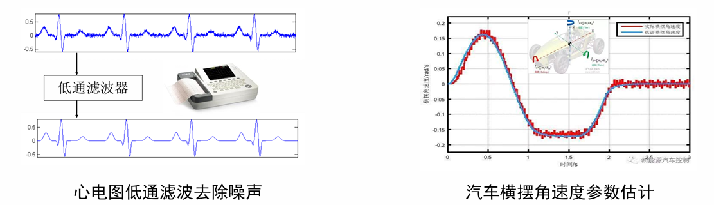

  

#### ② 滤波器的基本原理

- 根据有用信号与噪声信号的不同特性，实现二者的有效分离，从而消除或减弱噪声，提取有用信号
- 从系统的角度看，滤波器是在时域具有冲激响应 $ℎ(𝑡)$ 或脉冲响应 $ℎ(𝑛)$ 的可实现的线性时不变系统

### 2、滤波器的分类

- 经典滤波器

  - 假定输入信号中的有用信号和希望去掉的信号具有不同的频带
  - 通过设计具有合适频率特性的滤波器，去掉无用的信号
  - 当有用信号和无用信号的频谱相互重叠时，无能为力

  > 分类一：构成滤波器的元件性质
  >
  > - 无源滤波器：无源元件如电阻、电容、电感等
  > - 有源滤波器：有源器件如运算放大电路等（需要能量源）
  >
  > 分类二：滤波器所处理的信号性质
  >
  > - 模拟滤波器
  >   $$
  >   y(t)=h(t)*x(t)\\
  >   Y(\omega)=H(\omega)X(\omega)
  >   $$
  >
  > - 数字滤波器
  >   $$
  >   y(n)=h(n)*x(n)\\
  >   Y(\Omega)=H(\Omega)X(\Omega)
  >   $$
  >   
  >
  > 分类三：滤波器幅频特性的通带与阻带范围
  >
  > - 低通滤波器
  > - 高通滤波器
  > - 带通滤波器
  > - 带阻滤波器
  > - 全通滤波器

  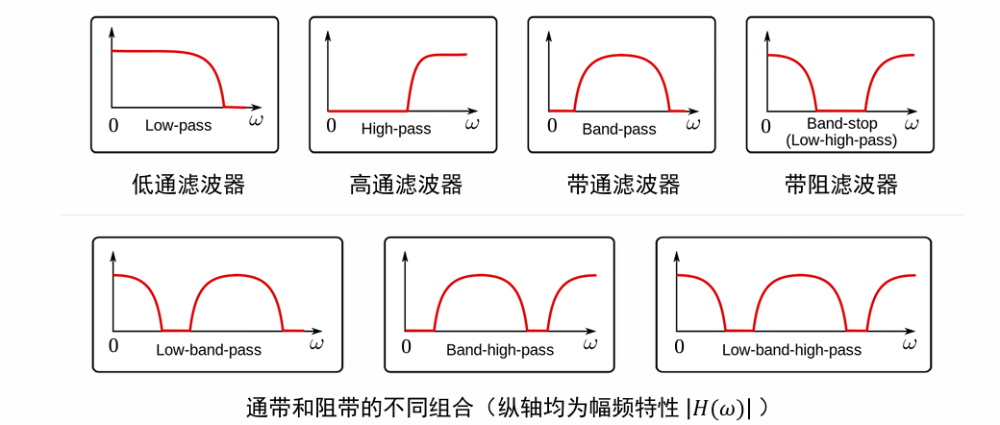

- 现代滤波器

  - 从含有噪声的信号（数据序列）中估计出信号的某些特征或信号本身
  - 当信号被估计出来后，它将比原信号具有更高的信噪比
  - 信号和噪声都视为实际信号

### 3、滤波器的技术指标

- 物理可实现性

  - 理想低通滤波器是非因果的，物理不可实现
  - 其矩形幅频特性亦如此，实际中不能实现从一个频带到另一个频带之间的突变
  - 允许滤波器的幅频特性在通带和阻带有一定的衰减范围，且幅频特性在这一范围内允许有起伏
  - 在通带和阻带之间有一定的过渡带

  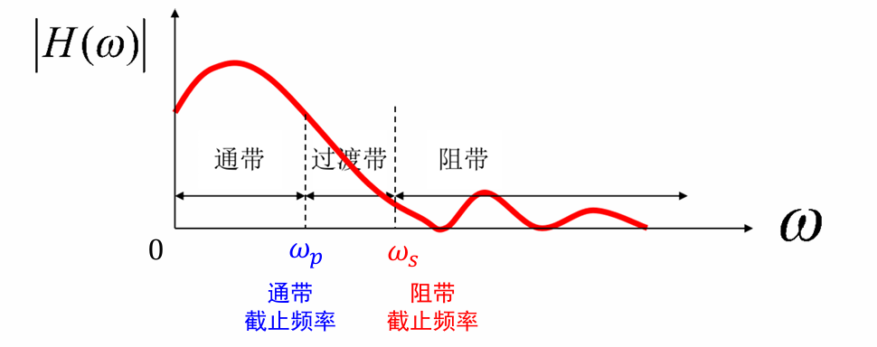

- 技术指标

  - 中心频率 $\omega_0$ ：滤波器通带、阻带截止频率的几何平均值
    $$
    \omega_0=\sqrt{\omega_p\cdot\omega_s}
    $$

  - 通带波动 $\Delta_\alpha$ ：在滤波器的通带内，频率特性曲线的最大峰值与谷值之差

  - 相移 $\phi$ ：某一特定频率的信号通过滤波器时，其在滤波器的输入和输出端的相位之差

  - 群延迟 $\tau_g$ ：又称为“包络延迟”，用相移 $𝜙$ 对于频率的变化率来衡量
    $$
    \tau_g=-\frac{d\phi_(\omega)}{d\omega}
    $$

    - 对于实际滤波器，$\tau_g$ 通常为正值

  - 衰减函数 $\alpha$ ：又称衰耗特性或工作损耗，单位是分贝（dB）
    $$
    \alpha=20\lg{\frac{H(0)}{H(\omega)}}=-20\lg{|H(\omega)|}=-10\lg|H(\omega)|^2
    $$

    - 通带衰减函数
      $$
      \alpha_p=20\lg{\frac{H(0)}{H(\omega_p)}}=-20\lg{|H(\omega_p)|}
      $$

    > 工程上，设计低通滤波器时，通常取幅值下降 $3dB$ 时所对应的频率值 $𝜔_{3𝑑𝐵}$​ 作为通带截止频率，即
    > $$
    > \omega_p=\omega_{3dB}
    > $$
    > 此时：$\alpha_p=3dB$

    - 阻带衰减函数
      $$
      \alpha_s=20\lg{\frac{H(0)}{H(\omega_s)}}=-20\lg{|H(\omega_s)|}
      $$

> - 通常认为，当信号的功率谱密度 $|𝐻(𝜔)|^2$ 降到它峰值的一半时，频率谐波对整体的影响就可以忽略
>
> - 对于频率特性为 $|𝐻(𝜔)|$ 的因果滤波器，设 $|𝐻(𝜔)|$ 的峰值为 $1$ ，则半功率点对应 $|𝐻(𝜔)|^2=\dfrac12$​ 
>   $$
>   20\lg{|H(\omega_s)|}=-3dB
>   $$
>
>   - 此时通带即是 $|𝐻(\omega)|$ 从 $0dB$ 的峰值点下降到不小于 $-3dB$ 的频率 $𝜔$ 的集合 
>   - 注意：“一半”是以功率角度来定义的

## 二、模拟滤波器

### 1、设计模拟滤波器的方法（综合设计法）

1. 根据给定的频率响应特性寻求一种可实现的有理函数 $𝐻(𝑠)$，即模拟滤波器的系统函数（传递函数）

   - 逼近

     - 根据给定的性能指标——通带和阻带的工作损耗，如通带衰减 $𝛼_𝑝$、 阻带衰减 $𝛼_𝑠$，根据频率特性的幅度平方函数 $|𝐻(𝜔)|^2$ 求系统函数 $𝐻(𝑠)$

     - 可以选定若干种典型的 $𝐻(𝑠)$ 来逼近理想滤波器（巴特沃思滤波器，切比雪夫滤波器等）

2. 由选定的 $𝐻(𝑠)$ 实现二端口网络（滤波器）电路结构和参数值

> > > $$
> > > H(\omega)=H(j\omega)=H^*(-j\omega)\\
> > > |𝐻(𝜔)|^2\bigg|_{j\omega=s}=H(j\omega)H(-j\omega)\bigg|_{j\omega=s}=H(s)H(-s)
> > > $$
>
> - $|𝐻(𝜔)|^2$ 零点、极点对称分布，一半属于 $𝐻(𝑠)$，另一半属于 $𝐻(-𝑠)$
>
> - 根据 $𝐻(𝑠)$ 的可实现条件和 $𝐻(𝑠),\ 𝐻(−𝑠)$的零、极点分布，将给定的幅度平方函数以 $−𝑠^2$ 代替 $𝜔^2$，确定 $𝐻(𝑠)$ 与 $𝐻 (−𝑠)$ 的零、极点
>
>   - $𝐻(𝑠)$ 的极点必须位于 $𝑠$ 的左半平面，$𝐻(−𝑠)$ 的极点必须位于 $𝑠$ 的右半平面
>
>   - 零点选取取决于所设计滤波器是否为最小相位系统（在一定的幅频特性下，相移最小的系统）
>
>     - 若是最小相位系统：$𝐻(𝑠)$ 的所有零点也应分布在左半平面或 $𝑗𝜔$ 轴上
>
>     - 若是非最小相位系统：零点位置与稳定性无关，可任意选取
>
>     - 若有零点在 $𝑗𝜔$ 轴上：根据 $𝐻(𝑠)$ 的系数为实数，在 $𝑗𝜔$ 轴上的零点必须是偶阶重零点，此时，要把轴上的零点平分给 $𝐻(𝑠)$ 与 $𝐻(-𝑠)$ 

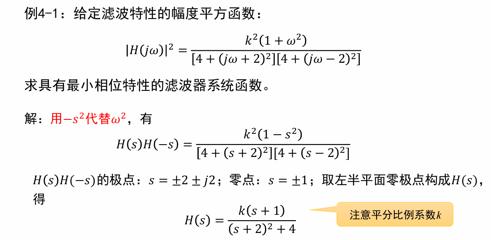

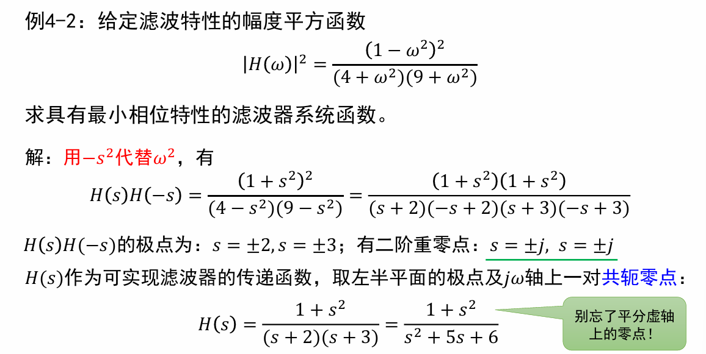

### 2、巴特沃斯低通滤波器

#### ① 幅频特性模平方（幅度二次方函数）

$$
|H(\omega)|^2=\dfrac1{1+\bigg(\dfrac{\omega}{\omega_c}\bigg)^{2n}}
$$

- $n$ ：滤波器的阶数
- $\omega_c$ ：滤波器的截止频率
  - 当 $\omega=\omega_c$ 时， $|H(\omega)|^2=\dfrac12$，此时对应的是滤波器的 $3dB$ 点

#### ② 巴特沃斯低通滤波器的幅频特性

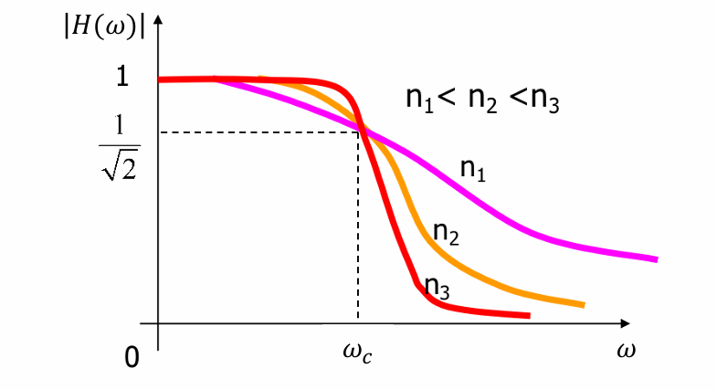

- 最大平坦性
  - 在 $\omega=0$ 附近的范围内非常比值，逼近理想滤波器
- 频响曲线的单调下降特性
- 随着阶数 $n$ 增加，通带幅频特性变平坦，阻带幅频特性衰减加快，过渡带变窄
  - 更趋于理想低通特性
- 当 $\omega>\omega_c$ 后，曲线近似以 $20n\ dB/\text{倍频程}$ 速度下降
- 具有良好的相频特性，在通带内没有起伏，接近直线

#### ③ 巴特沃斯低通滤波器的零极点分布

$H(s)$ 和 $H(-s)$ 的全部极点：
$$
s_k=j\omega_c(-1)^{\frac1{2n}}=\omega_ce^{j[\frac{2k-1}{2n}\pi+\frac\pi2]}
$$
​	其中：$k = 1，2，\ldots，2n$

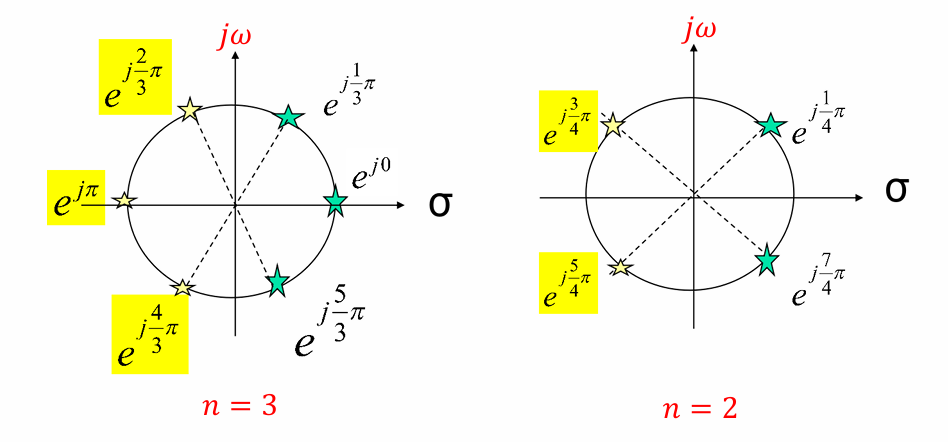

> - $𝐻(𝑠)𝐻(−𝑠)$ 的 $2𝑛$ 个极点以 $\dfrac\pi n$ 为间隔均匀分布在半径为 $𝜔_𝑐$ 的圆上,这个圆称为巴特沃思圆
> - 所有极点以 $𝑗𝜔$ 轴为对称轴呈对称分布，$𝑗𝜔$ 轴上没有极点
> - $𝑛$ 为奇数时，有两个极点分布在 $𝑠=±𝜔_𝑐$的实轴上
> - $𝑛$ 为偶数时，实轴上没有极点。所有复数极点两两呈共轭对称分布

#### ④ 巴特沃斯低通滤波器的传递函数

$$
H(s)=\dfrac{\omega_c^n}{\Pi_{k=1}^n(s-s_k)}
$$

- 取全部左半平面的极点为 $H(s)$ 的极点
- 分子取 $\omega_c^n$ 保证 $|H(s)|_{s=0}=1$

> - 对于不同的截止频率 $\omega_c$，得到的同一阶次巴特沃斯低通滤波器的传递函数也有所不同
> - 为了使滤波器的设计更有通用性，需要将频率进行归一化处理

- 选择截止频率 $\omega_c$ 作为参考频率，$H(s)$ 的分子、分母各除以 $\omega_c^n$，并令归一化复频率 $\bar s = \dfrac s{\omega_c}$

   - 当阶数 $n$ 为偶数时
     $$
     H(\bar s)=\dfrac1{\Pi_{k=1}^{\frac n2}\big(\bar s^2 -2\cos(\frac{2k-1}{2n}2\pi +\frac \pi 2)\bar s+1\big)}
     $$

   - 当阶数 $n$ 为奇数时
     $$
     H(\bar s)=\dfrac1{\Pi_{k=1}^{\frac {n-1}2}\big(\bar s + 1\big)\big(\bar s^2 -2\cos(\frac{2k-1}{2n}2\pi +\frac \pi 2)\bar s+1\big)}
     $$

- 归一化频率的各阶巴特沃斯多项式

  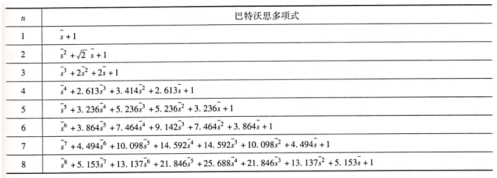

#### ⑤ 巴特沃斯低通滤波器的阶次确定

- 在工程中常用衰减函数来描述滤波器的幅频特性
  $$
  \alpha=-20\lg|H(\omega)|=-20\lg\bigg[\dfrac{1}{\sqrt{1+\bigg(\dfrac{\omega}{\omega_c}\bigg)^{2n}}}\bigg]=10\lg\bigg[1+\bigg(\dfrac{\omega}{\omega_c}\bigg)^{2n}\bigg]
  $$
  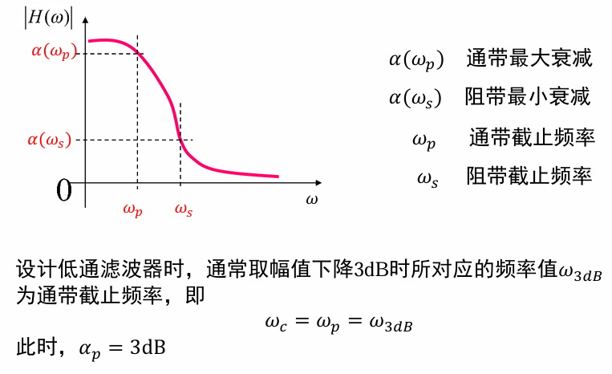

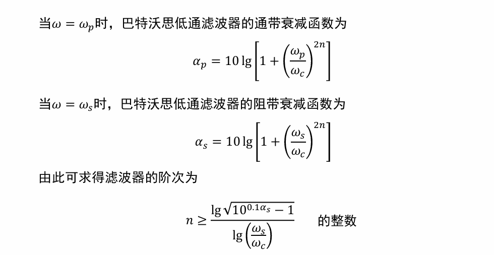

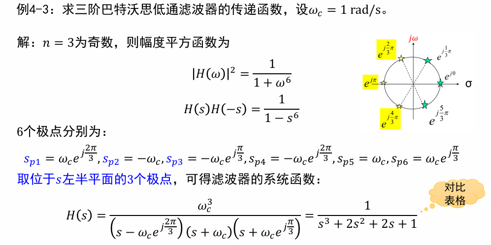

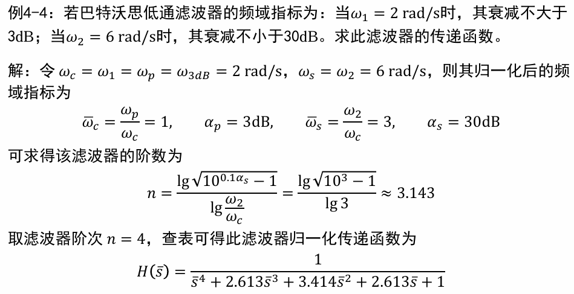

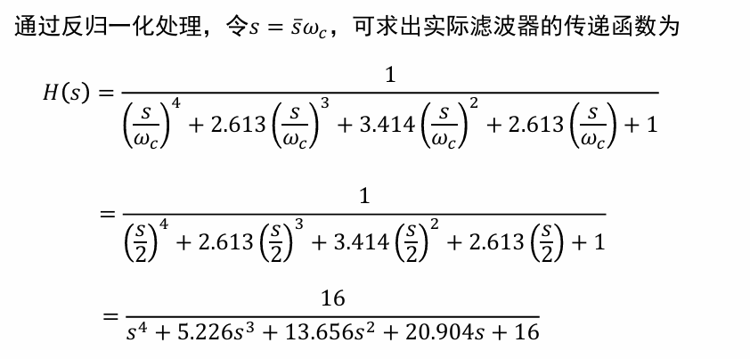

## 三、数字滤波器

### 1、概述

- 借助于数字器件和一定的数值计算方法，对输入信号的波形或频谱进行加工、处理、改变输入信号，从而去掉信号中的无用成分，保留有用成分

- 分类

  - 频率响应的通带特性
    - 低通、高通、带通、带阻
  - 冲激响应的时间特性
    - 无限冲激响应（IIR）
    - 有限冲激响应（FIR）
  - 数字滤波器的构成方式
    - 递归型、非递归型、用 FFT 实现的

- 原理

  - 用 LTI 离散系统表示数字滤波器
    $$
    y(n)+\sum_{k=1}^Na_ky(n-k)=\sum_{k=0}^Nb_kx(n-k)
    $$

  - 传递函数
    $$
    H(z)=\frac{Y(z)}{X(z)}=\frac{b_0+b_1z^{-1}+\cdots+b_Mz^{-M}}{1+a_1z^{-1}+\cdots+a_Nz^{-N}}=\dfrac{\sum_{i=0}^Mb_iz^{-i}}{1+\sum_{i=1}^Na_iz{-i}}
    $$

- 构成

  - 若分母上的系数 $a_i=0$，则为有限冲激响应（FIR）滤波器
    $$
    H(z)=\sum_{i=0}^Mb_iz^{-i}
    $$

    $$
    h(n)=b_0\delta(n)+b_1\delta(n-1)+\cdots +b_M\delta(n-M)
    $$

    - 单位脉冲响应的时间长度是有限的，最多有 $M+1$ 项
    - $H(z)$ 只有单极点 $z=0$ ，在单位圆内，FIR 滤波器总是稳定的

  - 若至少有一个 $a_i$ 的值不为 $0$ ，并且分母至少存在一个根不为分子所抵消，则为无限冲激响应（IIR）滤波器
    $$
    H(z)=\frac{b_0}{1-z^{-1}}=b_0(1+z^{-1}+z^{-2}+\cdots)
    $$

    $$
    h(n)=b_0[\delta(n)+\delta(n-1)+\cdots]=b_0u(n)
    $$

    

### 2、无限冲激响应（IIR）数字滤波器

#### ① 设计流程

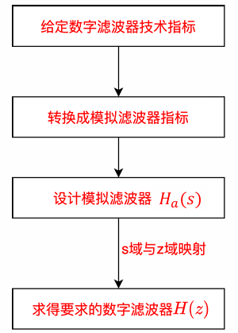

#### ② 由s平面到z平面的映射

- 条件
  - 为了保证模拟和数字滤波器频率特性的相互对应关系，$𝑠$ 平面的复频率轴必须映射到 $𝑧$ 平面的单位圆上
  - 为了保持模拟和数字滤波器的稳定性，必须要求 $𝑠$ 平面的左半平面映射到 $𝑧$ 平面的单位圆以内

#### ③ 冲激响应不变法

- 遵循规则

  - 使数字滤波器的单位脉冲响应 $ℎ(n)$ 等于所参照的模拟滤波器的单位冲激响应 $ℎ_𝑎(𝑛)$​ 的采样值（此时得到的是有限值）
    $$
    h(n)=h_a(t)\bigg|_{t=nT}
    $$

- 设计思路

  - 根据技术指标确定模拟滤波器 $𝐻_𝑎(𝑠)$

  - 对 $𝐻_𝑎(𝑠)$ 取拉普拉斯反变换求冲激响应 $ℎ_𝑎(𝑡)$

  - 由冲激响应不变的原则，对 $ℎ_𝑎(𝑡)$ 以 $𝑇$ 为采样周期，采样得到 $ℎ(𝑛)$

  - 求 $ℎ(𝑛)$ 的 $𝑍 $ 变换，求出数字滤波器 $𝐻(z)$

    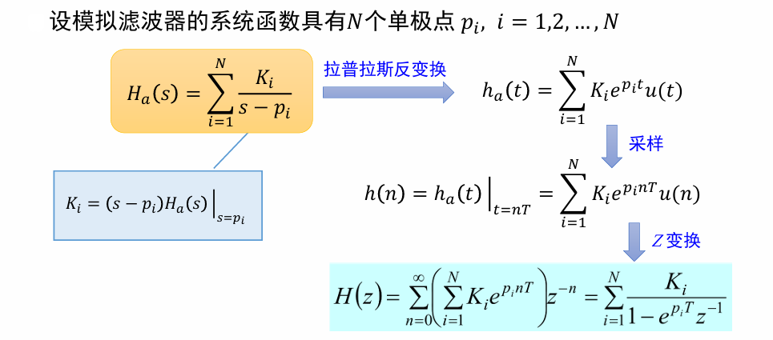

- 从 s 平面到 z 平面的映射

  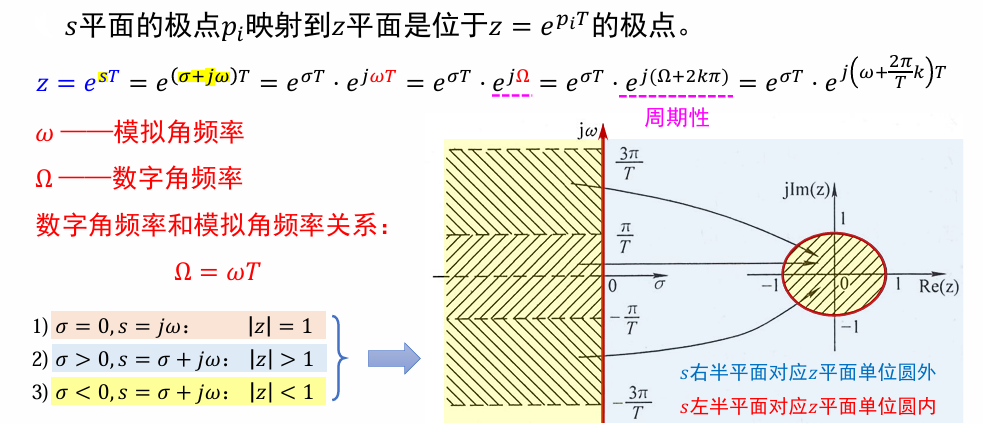

  - 当 $𝜎$ 不变，$𝜔$ 以 $\dfrac{2𝜋}{T}$ 整数倍改变时，映射值不变，也就是将 $𝑠$ 平面沿着 $𝑗𝜔$ 轴分割成为一条条宽度为 $\dfrac{2𝜋}{T}$ 的水平带，每条水平带都按照前面分析的关系，重叠映射成整个 𝒛 平面

- $H_a(s)$ 和 $H(z)$ 的对应关系

  - 冲激采样后的信号 = 原信号 x 冲激函数串

    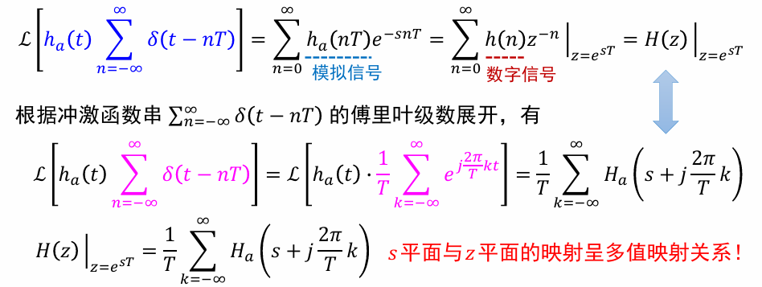

> - 模拟滤波器和数字滤波器之间的频率变换是线性关系，即 $Ω=𝜔𝑇$
>
> - 具有较好的时域逼近特性，可以很好地逼近模拟滤波器冲激响应
>
> - s平面与z平面映射的多值性容易造成频谱混叠现象

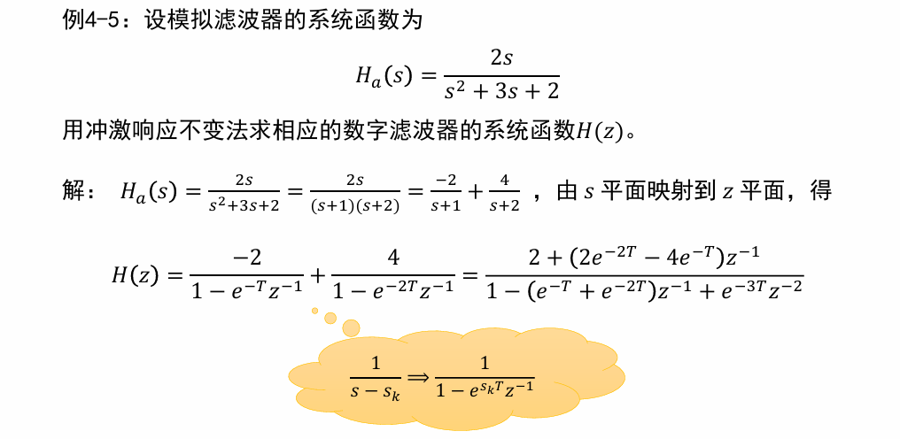

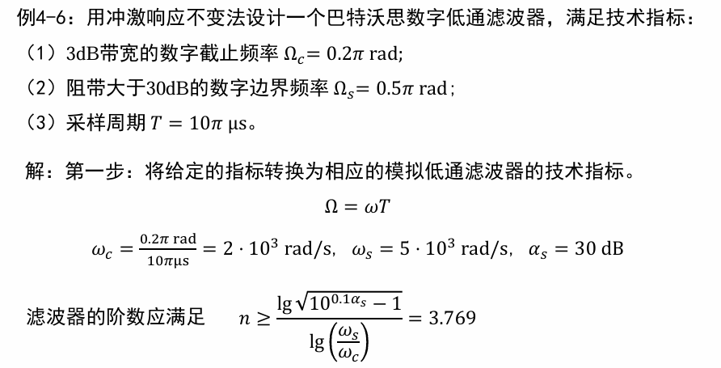

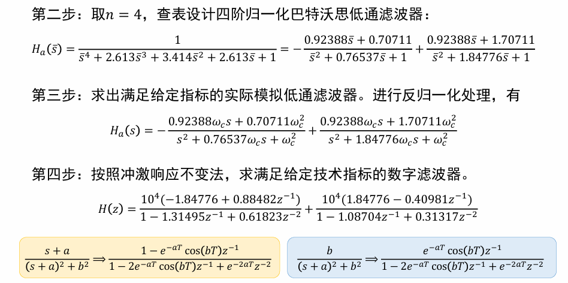

#### ④ 双线性变换法

- 原理
  - 利用微分方程表示为差分方程
- 目标
  - 把 𝑠 域 $𝜔$ 从 $0$ 到 $±∞$ 的分布压缩至 $0$ 到 $±𝜋$ 之间，这样变换到 𝑧 域就不会出现周期重复，即可构成单值映射

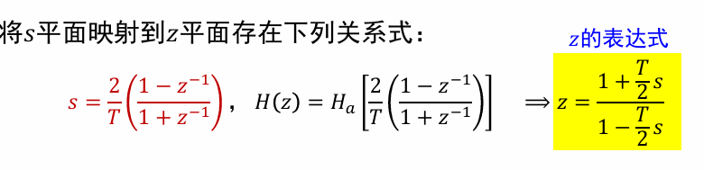

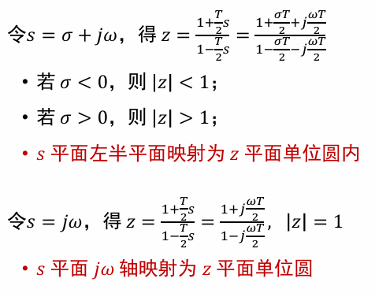

> - 双线性变换是从 𝑠 平面到 𝑧 平面一一对应的映射关系
> - 双线性变换将 𝑠 平面虚轴唯一地映射到 𝑧 平面的单位圆，保证了 $𝐻(𝑧)$ 的频率响应能模仿 $𝐻_𝑎(𝑠)$ 的频率响应，避免了频率响应混叠现象
> - 双线性变换将 𝑠 左半平面全部映射到 𝑧 平面单位圆内，将 𝑠 右半平面全部映射到 𝑧 平面的单位圆外，保证了 $𝐻(𝑧)$ 和 $𝐻_𝑎(𝑠)$ 相比，其稳定性不发生变化

- 数字频率 $\Omega$ 和模拟频率 $\omega$ 的关系

  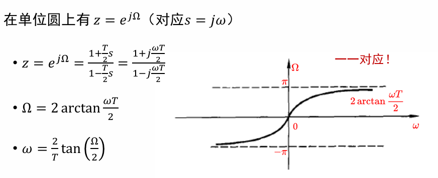

- 频率预畸变

  - 在冲激响应不变法中，模拟频率与数字频率之间的关系是线性关系
    $$
    \Omega=\omega T
    $$

  - 在双线性变换法中，模拟频率与数字频率的关系是非线性关系
    $$
    \omega=\frac2T\tan\frac\Omega2
    $$

  > 模拟频率与数字频率间的非线性关系是双线性变换的缺点，会使数字滤波器与模拟滤波器在频率响应与频率的对应关系上发生畸变

  - 矫正方式

    - 先对模拟滤波器的临界频率加以畸变，使其通过双线性变换后正好映射为需要的频率
      1. 设所求的数字滤波器的通带和阻带的截止频率分别为 $Ω_𝑝$ 和 $\Omega_s$
      2. 按照式 $\omega=\dfrac2T\tan\dfrac\Omega2$  求出对应的模拟滤波器的临界频率 $𝜔_𝑝$ 和 $𝜔_𝑠$, 然后模拟滤波器就按照这两个预畸变的频率 $𝜔_𝑝$ 和 $𝜔_𝑠$ 来设计

    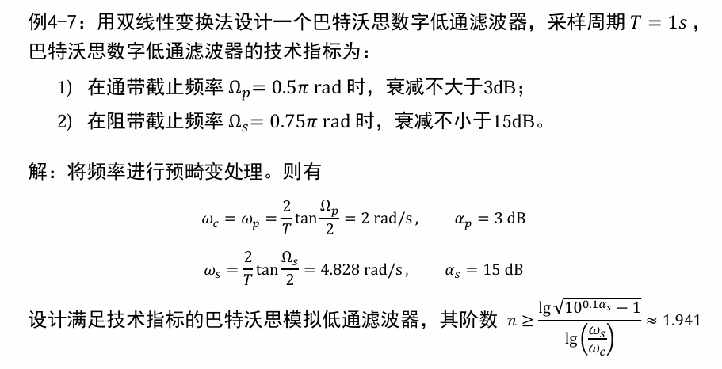

    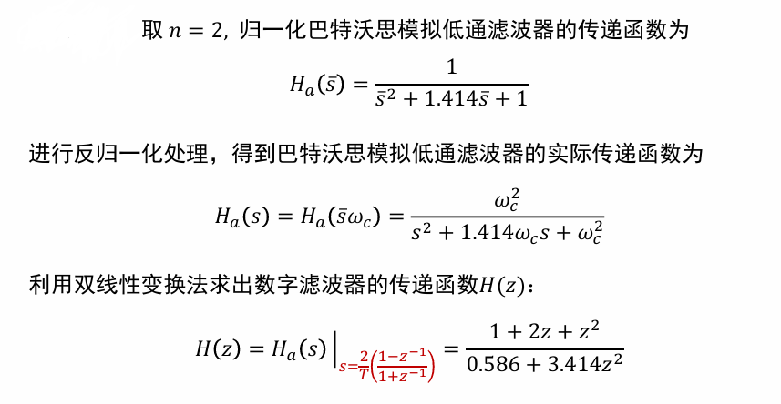

- 信号流图

  - 直接型

  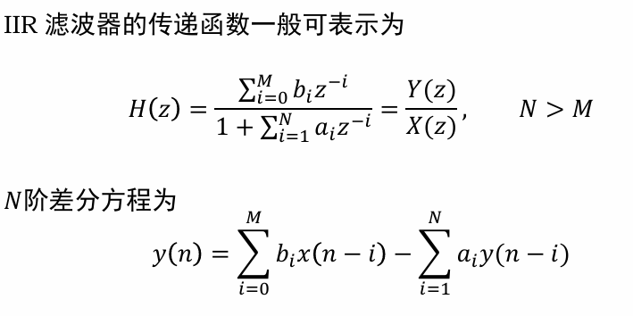

  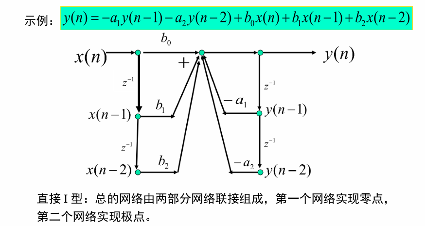

  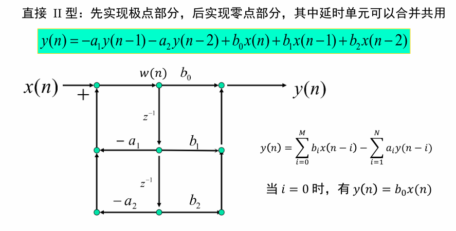

  - 级联型（串联型）

    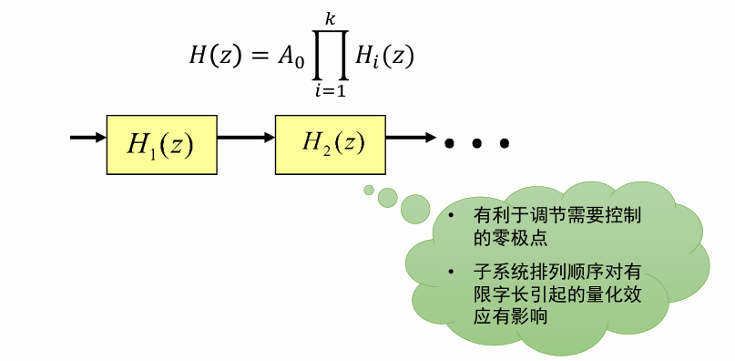

    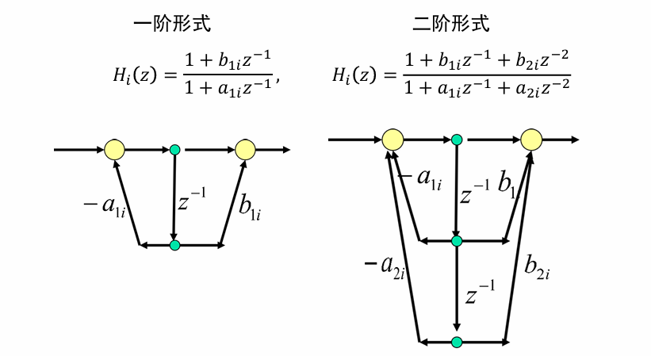

  - 并联型

    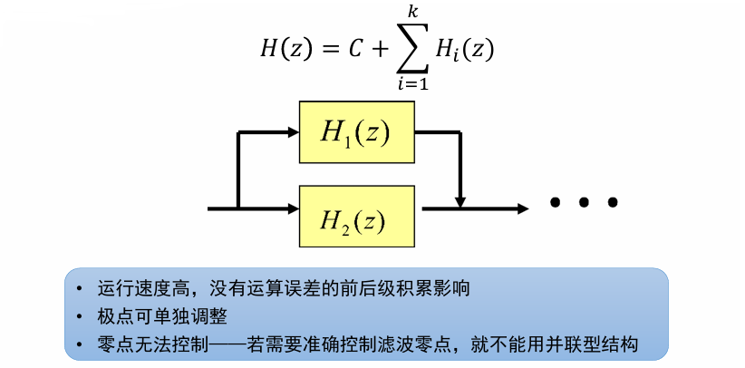

    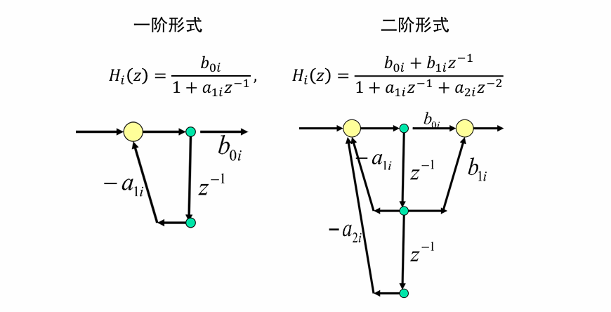

### 3、有限冲激响应（FIR）数字滤波器
