# 离散信号分析

## 一、信号的采样和恢复

### 1、离散信号与采样信号

- 离散信号
  - 在时间上是离散的，只在某些不连续的规定时刻给出信号的瞬时值
  - 产生方式：连续时间信号的采样或者本身就是离散信号
- 采样信号
  - 利用采样脉冲序列 $p(t)$ 从连续信号 $f(t)$ 中抽取一系列的离散样值
  - 时域通常用 $f_s(t)$ 表示（sampling），频域通常用 $f_p(t)$ 表示（period）

### 2、采样过程

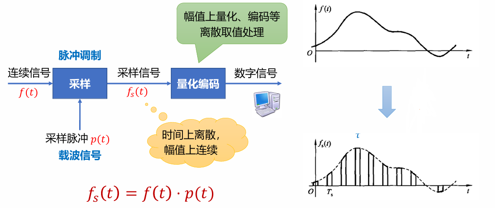

#### 时域采样

- 采样周期 $T_s$，采样角频率 $\omega_s=\frac{2\pi}{T_s}\\$
  $$
  \begin{align}
  F_s(\omega)&=\mathcal{F}[f_s(t)]\\
  &=\mathcal F [f(t)\cdot p(t)]\\
  &=\frac1{2\pi}F(\omega)*P(\omega)\\
  &=\frac1{2\pi}F(\omega)*\sum_{n=-\infty}^{\infty}2\pi P_n\delta(\omega-n\omega_s)\\
  &=\sum_{n=-\infty}^{\infty}P_nF(\omega-n\omega_s)\\\\
  \text{其中：}P_n&=\frac1{T_s}\int_{-\frac{T_s}2}^{\frac{T_s}2}p(t)e^{-jn\omega_st}dt
  \end{align}
  $$

  - 在频域上，以 $\omega_s$ 为周期进行周期延拓

##### ① 矩形脉冲采样

- 傅里叶系数 $P_n$
  $$
  P_n=\frac1{T_s}\int_{-\frac{T_s}2}^{\frac{T_s}2}p(t)e^{-jn\omega_st}dt=\frac{E\tau}{T_s}\mathcal {Sa}(\frac{n\omega_s\tau}2)
  $$

- 采样信号 $F_s(\omega)$
  $$
  F_s(\omega)=\frac{E\tau}{T_s}\sum_{n=-\infty}^{\infty}\mathcal {Sa}(\frac{n\omega_s\tau}2)F(\omega-\omega_s)
  $$

  - $F(\omega)$ 在以 $\omega_s$ 为周期的延拓过程中，幅度以 $\mathcal{Sa}(\frac{n\omega_s\tau}2)\\$ 作为包络函数的规律变化

##### ② 冲激采样（理想采样）

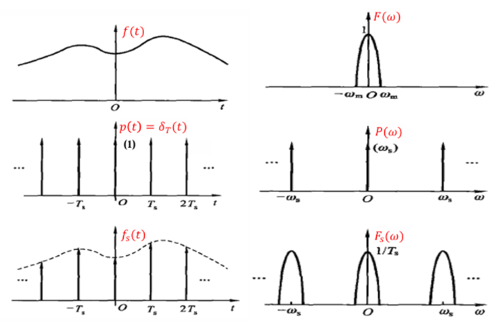

- 周期单位冲激序列 $\delta_T(t)$
  $$
  \delta_T(t)=\sum_{n=-\infty}^{\infty}\delta(t-nT_s)
  $$

  - 可直接求采样信号 $f_s(t)$
    $$
    f_s(t)=f(t)p(t)=f(t)\sum_{n=-\infty}^{\infty}\delta(t-nT_s)=\sum_{n=-\infty}^{\infty}f(nT_s)\delta(t-nT_s)
    $$

- 傅里叶系数 $P_n$
  $$
  P_n=\frac1{T_s}\int_{-\frac{T_s}2}^{\frac{T_s}2}p(t)e^{-jn\omega_st}dt=\frac1{T_s}
  $$

- 采样信号 $F_s(\omega)$​
  $$
  F_s(\omega)=\sum_{n=-\infty}^{\infty}P_nF(\omega-n\omega_s)=\frac1{T_s}\sum_{n=-\infty}^{\infty}F(\omega-n\omega_s)
  $$

  - 原连续信号的频谱 $F(\omega)$ 以 $\omega_s$ 为周期重复（等幅）
  - 频谱的幅度乘上了一个常数 $\frac1{T_s}\\$

- 例：求周期矩形信号经冲激采样后，所得采样信号的频谱

  - 单矩形脉冲的频谱密度函数 $\implies$ 周期矩形（脉冲）信号的傅里叶系数
    $$
    \begin{align}
    F(\omega)
    &=2\pi\sum_{m=-\infty}^{\infty}F_m\delta(\omega-m\omega_1)\\
    &=2\pi\sum_{m=-\infty}^{\infty}\bigg(\frac 1{T_1}F_0(\omega)\bigg|_{\omega=m\omega_1}\delta(\omega-m\omega_1)\bigg)\\
    &=2\pi\sum_{m=-\infty}^{\infty}\bigg(\frac {E\tau}{T_1}\mathcal{Sa}(\frac{m\omega_1\tau}2)\delta(\omega-m\omega_1)\bigg)\\
    \end{align}
    $$

  - 采样信号 $F_s(\omega)$
    $$
    \begin{align}
    F_s(\omega)
    &=\frac 1{T_s}\sum_{n=-\infty}^{\infty}F(\omega-n\omega_s)\\
    &=\frac{2\pi}{T_s}\sum_{n=-\infty}^{\infty}\sum_{m=-\infty}^{\infty}\bigg(\frac {E\tau}{T_1}\mathcal{Sa}(\frac{m\omega_1\tau}2)\delta(\omega-m\omega_1-n\omega_s)\bigg)\\
    &=\frac {E\tau\omega_s}{T_1}\sum_{n=-\infty}^{\infty}\sum_{m=-\infty}^{\infty}\bigg(\mathcal{Sa}(\frac{m\omega_1\tau}2)\delta(\omega-m\omega_1-n\omega_s)\bigg)\\
    \end{align}
    $$
    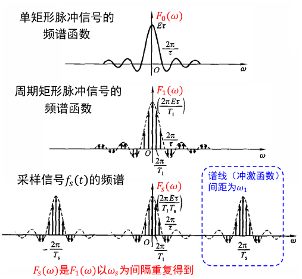

    

##### ③ 时域采样定理

- 对于频谱受限、频率为 $f_m$ 的信号 $f(t)$，如果其频谱只占据 $(-\omega_m,\  +\omega_m)$ 的范围，则信号 $f(t)$ 可以用等间隔的采样值唯一地表示，而采样间隔（奈奎斯特间隔） $T_s$ 满足
  $$
  T_s\leq\frac1{2f_m}=\frac{\pi}{\omega_m}
  $$

  - 其中：$\omega_m=2\pi f_m$

  - 即最低采样频率为 $2f_m$（或奈奎斯特频率 $\omega_s=2\omega_m$）

> - 频谱受限（Spectrum Limited）是指信号的频谱在某个有限的频率范围内非零，而在该范围之外的频率成分可以忽略不计或为零。换句话说，信号的频谱只存在于某个特定的带宽内，而超出这个带宽的频谱密度为零或非常小。
>
>   - **定义**：
>
>      - 一个信号 $x(t)$ 是频谱受限的，如果存在一个有限的频率 $\omega_m$，使得该信号的傅里叶变换（频谱密度函数）$X(j\omega)$ 在频率范围 $|\omega| > \omega_m$ 时为零或可以忽略不计。这里的 $\omega_m$ 称为信号的最大截止频率或带宽。
>
>   - **物理意义**：
>      - 频谱受限信号的频谱能量集中在某个有限的频率范围内，这使得信号在传输过程中可以通过滤波器来限制带宽，减少干扰和噪声的影响。
>      - 在通信系统中，信号通常被设计为频谱受限的，以便在有限的频谱资源内高效传输多个信号。
>
>      - 一个频谱受限的信号波形不可能在很短时间内产生独立的、实质的变化，其最高变化速度收到最高频率分量 $\omega_m$ 的限制
>
>   

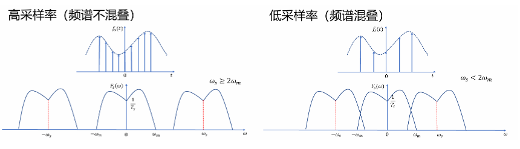

#### 频域采样

采样间隔 $\omega_0$
$$
\begin{align}
f_p(t)&=\mathcal{F}^{-1}[F_p(\omega)]\\
&=\mathcal F^{-1} [F(\omega)\cdot \delta_{\omega}(\omega)]\\
&=\mathcal F^{-1} [F(\omega)\cdot \sum_{k=-\infty}^{\infty}\delta(\omega-k\omega_0)]\\
&= f(t)*\mathcal F^{-1} [\sum_{k=-\infty}^{\infty}\delta(\omega-k\omega_0)]\\
&= f(t)*\frac{1}{\omega_0}\delta_T(t)\\
&=\frac1{\omega_0}\sum_{k=-\infty}^{\infty}f(t-kT_0)
\end{align}
$$

- 在时域上，以 $T_s$ 为周期进行周期重复

- 求 $\delta_{\omega}(\omega)$ 的傅里叶逆变换
  $$
  \mathcal F[\delta_T(t)]=\sum_{k=-\infty}^{\infty}\omega_0\delta(\omega-k\omega_0)\implies \delta_{\omega}(\omega)=\sum_{k=-\infty}^{\infty}\delta(\omega-k\omega_0)=\frac1{\omega_0}\mathcal F[\delta_T(t)]
  $$

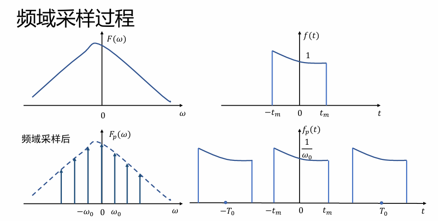

- 原频谱对应的时域信号 $f(t)$ 以 $T_0$ 为周期重复（等幅）
- 频谱的幅度乘上了一个常数 $\frac1{\omega_0}\\$

#####  频域采样定理

- 对于时间受限、周期为 $t_m$ 的信号 $f(t)$，如果其只占据 $(-t_m,\  +t_m)$ 的范围，则信号 $f(t)$ 可以用等间隔的采样值唯一地表示，而采样频率间隔 $\omega_s$ 满足
  $$
  \omega_s\leq\frac1{2t_m}
  $$

### 3、信号的恢复

- **取主频带**
  $$
  F(\omega)=F_S(\omega)\cdot H(\omega)
  $$
  其中：$H(\omega)$ 为窗函数
  $$
  H(\omega)=
  \begin{cases}
  T_s\qquad&|\omega|\leq \omega_c\\
  0\qquad&|\omega| > \omega_c\\
  \end{cases}
  $$

  - $\omega_c = \omega_m = \dfrac {\omega_s}2$

  - 求时域表达式（傅里叶变换的对偶性）
    $$
    \mathcal F[H(t)]=2\pi\mathcal{Sa}\big(\frac{\omega_s\omega}2\big)\implies h(\omega)=\frac1{2\pi}\mathcal F[H(-t)]=\mathcal{Sa}\big(\frac{\omega_s\omega}2\big)\implies h(t)=\mathcal{Sa}\big(\frac{\omega_st}2\big)
    $$

- 由时域卷积定理得 **恢复连续时间信号的内插公式**
  $$
  \begin{align}
  f(t)
  &=f_s(t)*h(t)\\
  &=\bigg(\sum_{n=-\infty}^{\infty}f(nT_s)\delta(t-nT_s)\bigg)*\mathcal{Sa}\big(\frac{\omega_st}2\big)\\
  &=\sum_{n=-\infty}^{\infty}f(nT_s)\mathcal{Sa}\big(\frac{\omega_s}2(t-nT_s)\big)
  \end{align}
  $$

  - 只要 $𝑓(𝑡)$ 是带限的，而采样频率满足香农定理，可以实现信号的真正重建

> - 采样频率的选择
>   - 为了保留原连续信号某一频率分量的全部信息，至少对该频率分量一个周期采样两次
>   - 对于快变信号，要提高采样频率
>   - 采样频率过高会增加计算机内存的占用量，也造成采样过程不稳定
>   - 对于不是带限的信号，在采样前采用抗混叠滤波器，把不需要或者不重要的高频成分滤除
> - 其他说明
>   - 实际中的冲激采样和滤波器都是非理想的，在信号的采样和恢 过程中，抗混叠滤波、采样、模/数转换、数/模转换、解采样等环节都可能存在误差，导致信号出现失真
>   - 时域采样定理要求 $𝜔_𝑠≥2𝜔_𝑚$，工程上：采样频率 > 10×信号频率

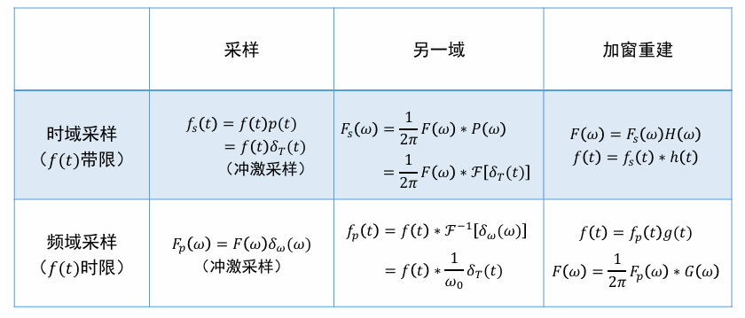

## 二、离散信号的时域描述和运算

### 1、离散信号的描述 —— 序列

> - 无论是采样得到的离散信号，还是客观事物给出的离散信号，只要给出函数值的离散时刻是等间隔的，都可以用序列 $x(n)$ 来表示
>
> - $n$ 是各函数值在序列中出现的序号，对应序号 $𝑛$ 的函数值通常称为在第 $𝑛$ 个点的“样值”
>
> - 通常用 $x(n)$ 定义在整个定义域内的一组有序数列的集合 $\{x(n)\}$ 表示一个离散信号，$𝑥(n)$ 仅对 $n$ 的整数值才有定义
>
> - 离散信号的能量定义为
>   $$
>   W=\sum_{n=-\infty}^{\infty}|x(n)|^2
>   $$

#### ① 表示方法

- 有序数列的集合
  $$
  \{x(n)\}=\{\ldots,0,1,2,3,4,3,2,1,0,\ldots\}
  $$

  - $n=0$ 时对应其中的 $4$

- 闭式表达式
  $$
  x(n)=
  \begin{cases}
  4-|n|\qquad&|n|\leq3\\
  0\qquad&|n|>3
  \end{cases}
  $$

- 图形表示法

  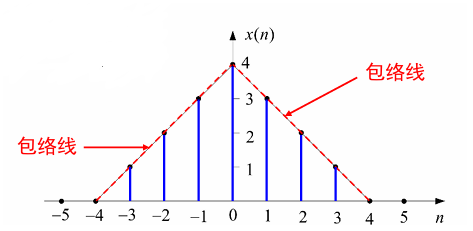

#### ② 常用的典型离散信号（序列）

- 单位脉冲序列（单位样值信号）
  $$
  \delta(n)=
  \begin{cases}
  1\qquad&n=0\\
  0\qquad&n\neq0
  \end{cases}
  $$

  - 满足 $\sum_{n=-\infty}^{\infty}\delta(n)=1\\$

  - 取样特性
    $$
    x(n)\delta(n)=x(0)\delta(n)\\
    \sum_{n=-\infty}^{\infty}x(n)\delta(n-n_0)=x(n_0)
    $$

    - 表示任意序列
      $$
      x(n)=\sum_{k=-\infty}^{\infty}x(k)\delta(n-k)
      $$

- 单位阶跃序列
  $$
  u(n)=
  \begin{cases}
  1\qquad&n\geq0\\
  0\qquad&n<0
  \end{cases}
  $$

  - 在 $n=0$ 处有定义

  - 与 $\delta(n)$ 的关系
    $$
    \delta(n)=u(n)-u(n-1)\\
    u(n)=\sum_{k=0}^{\infty}\delta(n-k)
    $$

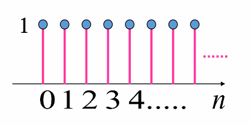

- 矩形序列
  $$
  R_N(n)=
  \begin{cases}
  1\qquad0\leq n\leq N-1\\
  0
  \end{cases}
  $$

  - 与 $\delta(n)、u(n)$​ 的关系
    $$
    \begin{align}
    R_N(n)&=u(n)-u(n-N)\\
    &=\delta(n)+\delta(n-1)+\cdots+\delta(n-(N-1))
    \end{align}
    $$
    

- 斜边序列
  $$
  R(n)=nu(n)
  $$
  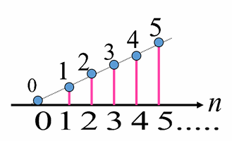
  $$
  r(n)=n^2u(n)
  $$
  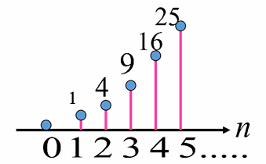

  

- 实指数序列（单边指数序列）
  $$
  x(n)=a^nu(n)
  $$
  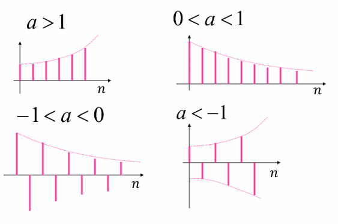

  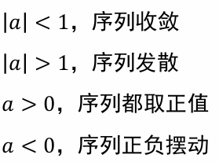

- 正弦型序列
  $$
  x(n)=A\sin(n\Omega_0+\phi)
  $$
  其中：$\Omega_0$ 表示数字角频率 rad，$\phi$ 为正弦序列的初始相角

  - 可理解为从连续时间正弦信号经采样得到，此时有
    $$
    \Omega_0=\omega_0T_s=\frac{\omega_0}{f_s}\\
    x(t)=A\sin\omega_0t\implies x(n)=x(nT_s)=A\sin(n\omega_0T_s)
    $$

  - 与连续时间正弦信号的区别

    - 时移与相移

      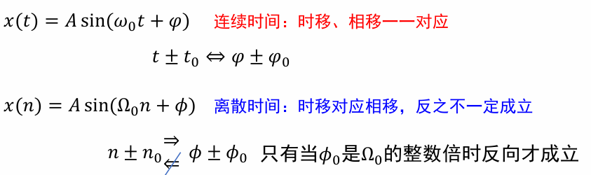

      > 对于连续时间正弦信号 $x(t) = A \sin(ω_0 t + φ )$
      >
      >   * **时移与相移的关系**：时移与相移之间存在一一对应的关系，
      >     * 当时间上产生正负 $t_0$ 的时移时，对应的相位也会产生正负 $φ_0$ 的相移，可表示为 $t ± t_0 ⇔ \phi ± \phi_0 $。
      >     * 若信号 $x(t) = A \sin(ω_0 t + \phi )$ 发生了一个时移 $t_0$
      >     * 那么新的信号 $x(t ± t_0) = A \sin(ω_0 (t ± t_0) + \phi ) = A \sin(ω_0 t + ω_0 t_0 ± \phi )$，此时相移 $\phi_0 = ω_0 t_0$
      >     * 可以看出时移和相移之间是一一对应的
      >
      >
      > 对于离散时间正弦序列 $x(n) = A \sin(Ω_0 n + \phi )$
      >
      >   * **时移与相移的关系**：时移对应相移，但相移不一定对应时移，只有当相移 $\phi_0$ 是 $Ω_0$ 的整数倍时，相移才对应时移
      >     * $n ± n_0 \rarr \phi ± \phi_0$，但 $\phi ± \phi_0 \not\rarr n ± n_0$（只有当 $\phi_0$ 为 $Ω_0$ 的整数倍时反向才成立 ）
      >     * 若信号 $x(n) = A \sin(Ω_0 n + \phi )$ 发生了一个时移 $n_0$ 
      >     * 那么新的信号 $x(n ± n_0) = A \sin(Ω_0 (n ± n_0) + \phi ) = A \sin(Ω_0 n ± Ω_0 n_0 + \phi )$，这里相移为 $±Ω_0 n_0$
      >     * 所以时移 $n_0$ 对应相移 $±Ω_0 n_0$。但若给定一个相移 $\phi_0$，只有当 $\phi_0 = Ω_0 n_0$ 时，才能找到对应的时移 $n_0$，否则反向不成立
      >
      >

    - 周期性

      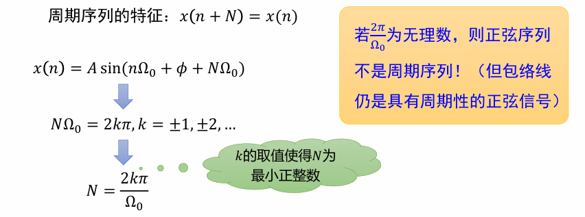

      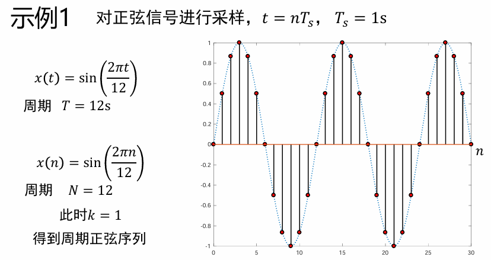

      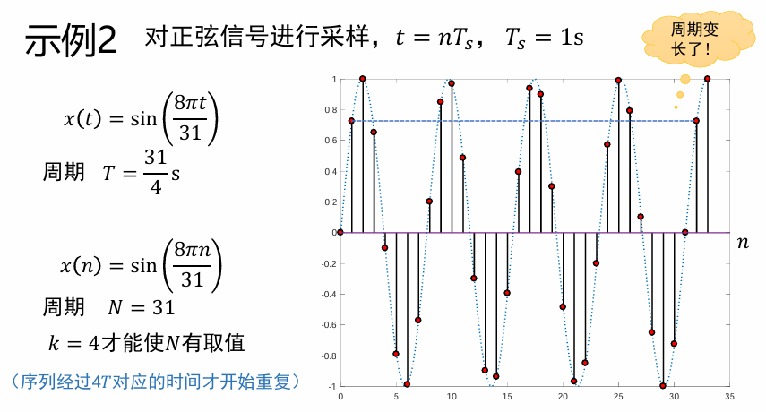

      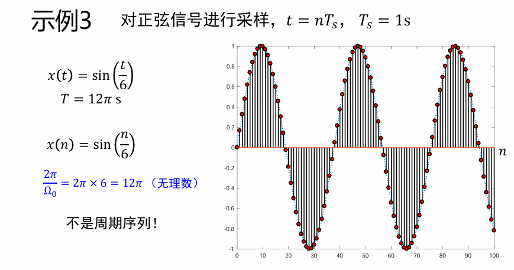

    - 数字频率

      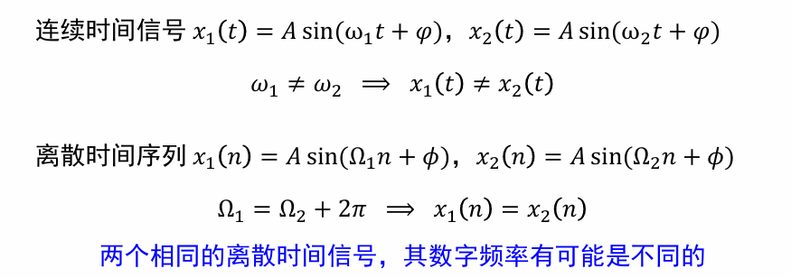

      

- 复指数序列
  $$
  x(n)=e^{(\sigma+j\Omega_0)n}=e^{\sigma n}(\cos\Omega_0n+j\sin\Omega_0 n)=|x(n)|e^{j\arg[x(n)]}
  $$
  
- 任意离散序列
  $$
  x(n)=\sum_{m=-\infty}^{\infty}x(m)\delta(n-m)
  $$
  

### 2、离散信号的时域运算

#### ① 平移和翻转

- 左加右减

#### ② 和、积

#### ③ 累加

$$
y(n)=\sum_{k=-\infty}^nx(k)
$$

#### ④ 差分

- 前向差分
  $$
  \Delta x(n)=x(n+1)-x(n)
  $$

- 后向差分
  $$
  \nabla x(n)=x(n)-x(n-1)=\Delta x(n-1)
  $$

#### ⑤ 时间尺度（比例）变换

- 对某序列 $x(n)$，其时间尺度变换序列为 $x(mn)$ 或 $x(n/m)$，其中 $m$ 为正整数

> 设 $m=2$
>
> - $x(2n)$ 不是像连续信号那样将 $𝑥(𝑛)$ 序列简单地在时间轴上按比例地压缩为原来的一半，而是采样频率降低为原来的一半，即从 $𝑥(𝑛)$ 中每隔 $2$ 点取 $1$ 点。
>   - 若 $x(n)=x(t)\bigg|_{t=nT_s}\\$
>   - 则：
>     -  $x(n)=x(t)\bigg|_{t=2nT_s}\\$
>     - $x(\frac n2)\\$ 表示采样间隔由 $T$ 变成了 $\frac T2\\$ ，是 $x(n)$ 的插值序列

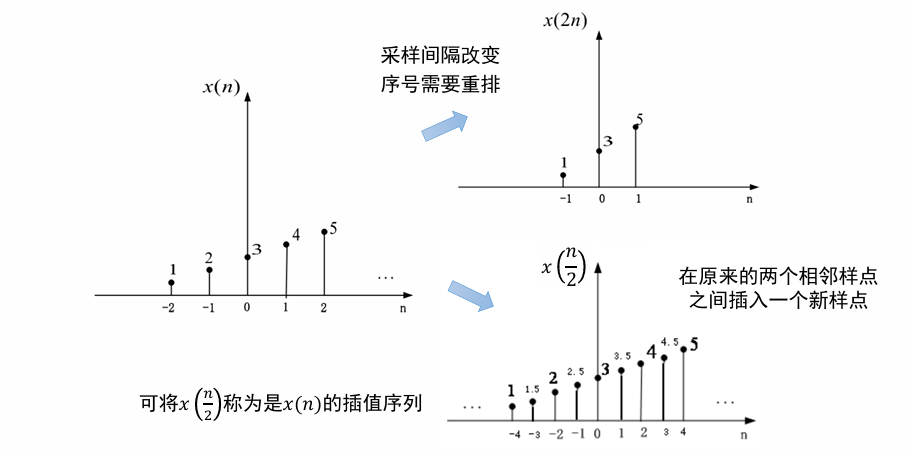

#### ⑥ 卷积和

$$
y(n)=x(n)*h(n)=\sum_{m=-\infty}^\infty x(m)h(n-m)
$$

- 图解法

  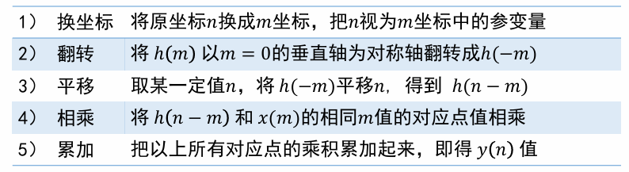

  

- 列表法

  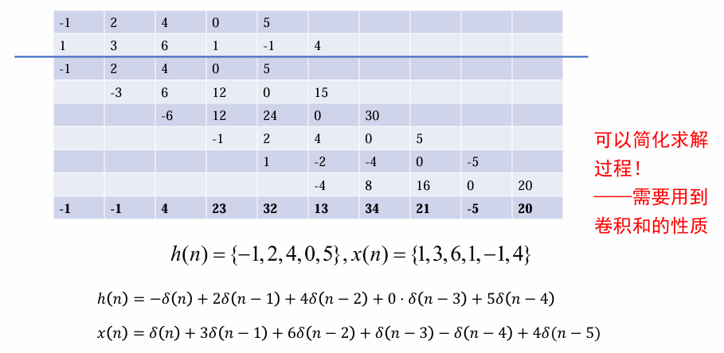

- 性质

  

## 三、离散信号的频域分析

### 1、离散傅里叶级数 (DFS)

#### ① 正变换：周期序列 $x(n)\implies DFS$ 系数 $X(k\Omega_0)$ （离散频谱函数）

$$
DFS[x(n)]=X(k\Omega_0)=\frac1N\sum_{n=<N>}x(n)e^{-jk\Omega_0n}
$$

#### ② 反变换：$DFS$ 系数 $X(k\Omega_0) \implies$ 周期序列 $x(n)$ （时间函数）

$$
IDFS[X(k\Omega_0)]=x(n)=\sum_{k=<N>}X(k\Omega_0)e^{jk\Omega_0n}
$$

> 对于周期序列 $x_p(n)$ ，如有限长序列 $x(n)$ 的周期延拓，求其 DFS 时，需要取其主值序列 $0\leq n\leq N-1$

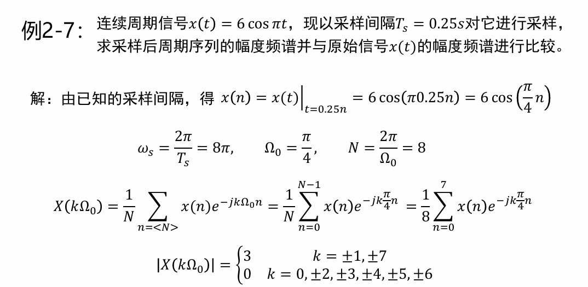

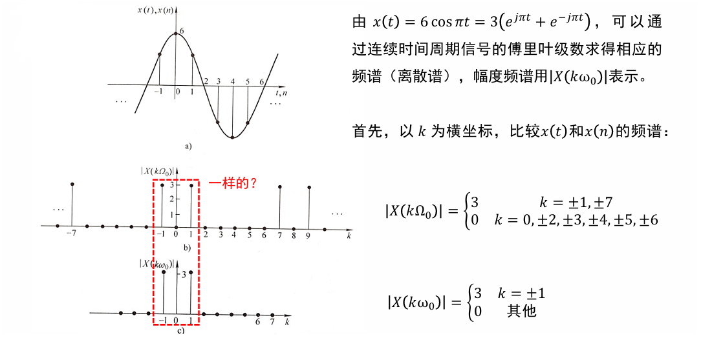

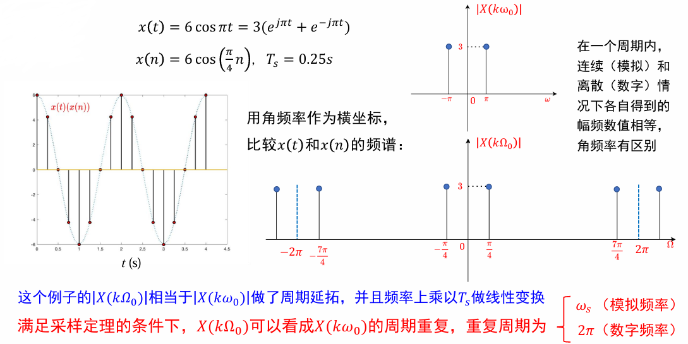

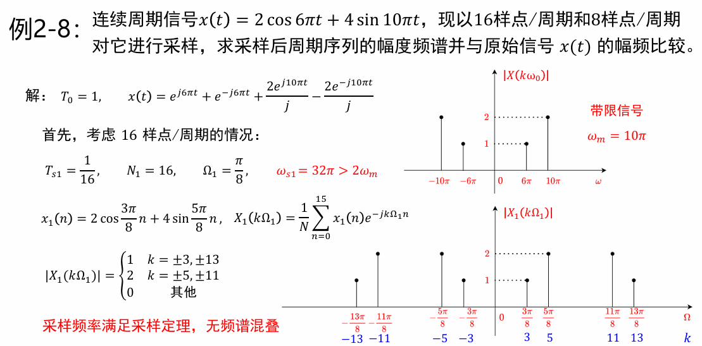

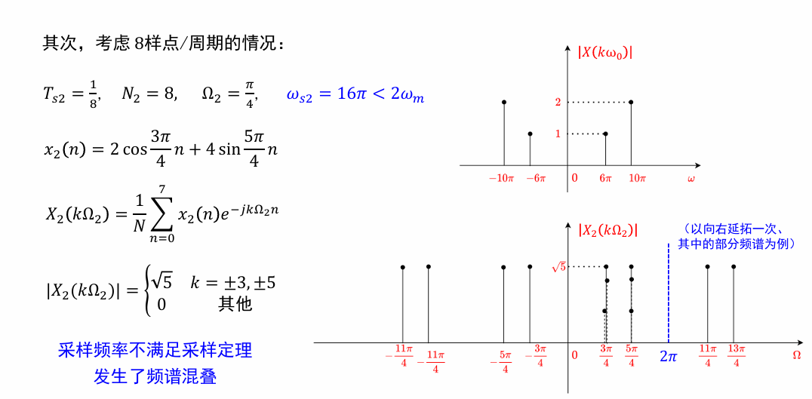

> **结论**
>
> - 连续时间周期信号的频谱 $𝑋(𝑘𝜔_0)$ 是具有谐波性的离散非周期序列
> - 离散时间周期信号的频谱 $𝑋(𝑘Ω_0)$ 是具有谐波性的离散周期序列
> - $𝑋(𝑘Ω_0)$ 可以看作是 $𝑋(𝑘𝜔_0)$ 的近似式，近似程度与采样周期有关
>   - 在满足采样定理条件下，可以通过截取任一个周期的样点 $𝑥(𝑛) →𝑋 (𝑘Ω_0) →𝑋(𝑘𝜔_0)$
>   - 在不满足采样定理条件下，$𝑋(𝑘Ω_0)$ 出现频谱混叠，不能准确表示 $𝑋(𝑘𝜔_0)$；在误差允许的情况下，可以利用一个周期的 $𝑋(𝑘Ω_0)$ 近似 $𝑋(𝑘𝜔_0)$
>   - 为减小近似误差，应尽可能地提高采样频率

#### ③ DFS 主要性质

- 线性性质

  

- 周期卷积定理

  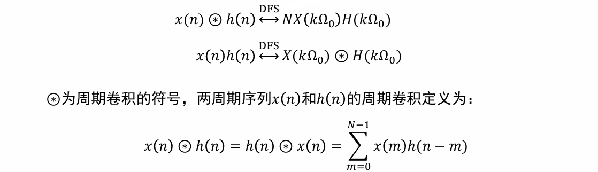

- 复共轭

  

- 位移性质

  

- 帕斯瓦尔定理

  

### 2、离散时间傅里叶变换 （DTFT)

#### ① 正变换：周期序列 $x(n)\implies$ 频谱密度函数 $X(\Omega)$ 或 $X(e^{j\Omega})$

$$
DTFT[x(n)]=X(\Omega)=\sum_{n=-\infty}^{\infty}x(n)e^{-j\Omega n}
$$

#### ② 反变换：频谱密度函数 $X(\Omega) \implies$ 周期序列 $x(n)$ （时间函数）

$$
IDTFT[X(\Omega)]=x(n)=\frac1{2\pi}\int_0^{2\pi}X(\Omega)e^{j\Omega n}d\Omega=\frac1{2\pi}\int_{-\pi}^{\pi}X(\Omega)e^{j\Omega n}d\Omega
$$

> - 对于周期 $N$ 无穷大的情形， DFS 系数 $X(k\Omega_0)$ 正比于频谱密度函数 $X(\Omega)$ 的个样本值
>   $$
>   X(k\Omega_0)=\frac1NX(\Omega)
>   $$
>
> - 频谱密度函数 $X(\Omega)$ 的周期为 $2\pi$
>
> - 当 $𝑥(𝑛)$ 为无限长序列时，为了保证和式收敛，要求 $𝑥(𝑛)$​ 是绝对可和的，即
>   $$
>   \sum_{n=-\infty}^{\infty}|x(n)|<\infty
>   $$
>
>   - 或该序列能量有限，即
>     $$
>     \sum_{n=-\infty}^{\infty}|x(n)|^2<\infty
>     $$
>
> - 重要变换对（使用等比数列求和公式推得）
>   $$
>   x_1(n)=a^nu(n)\qquad|a|<1\\
>   X_1(\Omega)=\frac1{1-ae^{-j\Omega}}\qquad \ \ \ \ \ \ \ 
>   $$
>
>   $$
>   x_2(n)=-a^nu(-n-1)\qquad|a|>1\\
>   X_2(\Omega)=\frac1{1-ae^{-j\Omega}}\qquad \ \ \ \ \ \ \
>   $$
>
> - $DTFT$、$DFS$ 与 $CTFT$ 的关系
>
>   - $DTFT$ 与 $DFS$
>     - $DTFT$ 是 $DFS$ 当 $𝑁 →∞$ 时情况
>     - 共同点
>       - 时域都是离散的，在频域频谱都是周期的
>     - 不同点
>       - 周期序列的频谱通过 $DFS$ 求解，是离散的、具有谐波性，$𝑋(𝑘Ω_0)$ 是谐波的复振幅，宜于计算机计算
>       - 非周期序列的频谱通过 $DTFT$ 求解，是连续的、不具有谐波性，$𝑋(Ω)$ 表示频谱密度，不利于计算机的计算或分析
>   - $DTFT$ 与 $CTFT$
>     - 共同点
>       - 信号在时域波形均为非周期，频域均为频谱密度函数（连续频谱）
>     - 不同点
>       - $DTFT$ 得到的 $𝑋(Ω)$ 是周期性的，$CTFT$ 得到的 $𝑋(𝜔)$ 为非周期的。

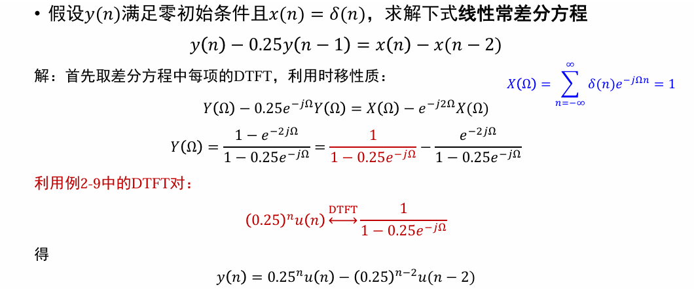

#### ③ 主要性质

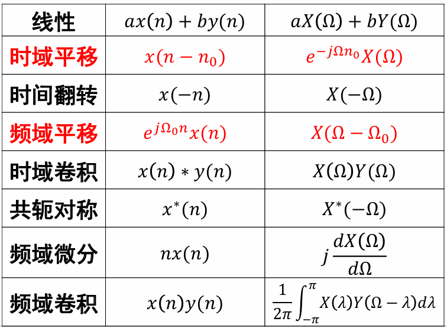

### 3、离散傅里叶变换（DFT）

#### ① 正变换：周期序列 $x(n)\implies$  $X(k)$ （ $X(\Omega)$ 在数字频域主值的取样序列）

$$
DFT[x(n)]=X(k)=\sum_{n=0}^{N-1}x(n)e^{-jk\frac{2\pi}N n}\qquad k=0,1,\ldots,N-1
$$

#### ② 反变换：频谱密度函数 $X(\Omega) \implies$ 周期序列 $x(n)$ （时间函数）

$$
IDFT[X(k)]=x(n)=\frac1{N}\sum_{k=0}^{N-1}X(k)e^{jk\frac{2\pi}N n}\qquad n=0,1,\ldots,N-1
$$

#### ③ 矩阵形式

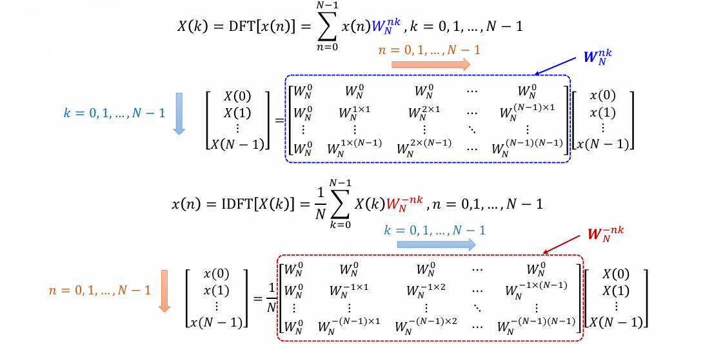

> - 正交性
>   $$
>   \frac1N\sum_{k=0}^{N-1}W_N^{nk}(W_N^{mk})^*=\frac1N\sum_{k=0}^{N-1}W_N^{(n-m)k}=
>   \begin{cases}
>   1\qquad n-m=\mathcal{l}N\\
>   0\qquad n-m\ne\mathcal{l}N
>   \end{cases}
>   $$
>
> - 周期性
>   $$
>   W^{r+mN}_N=W_N^r
>   $$
>
> - 对称性
>   $$
>   W_N^{r+\frac N2}=-W_N^r
>   $$
>
> - 可约性
>   $$
>   W_N^{rn}=W^n_{\frac N{r'}}\qquad W_{rN}^{rn}=W_N^n
>   $$
>
> - 指数周期
>   $$
>   W_N^0=1\qquad W_N^N=1\qquad W_N^{\frac N2}=-1\qquad W_N^{\frac N4}=-j
>   $$
>   

- 两个矩阵均为 $N\times N$ 的对称矩阵

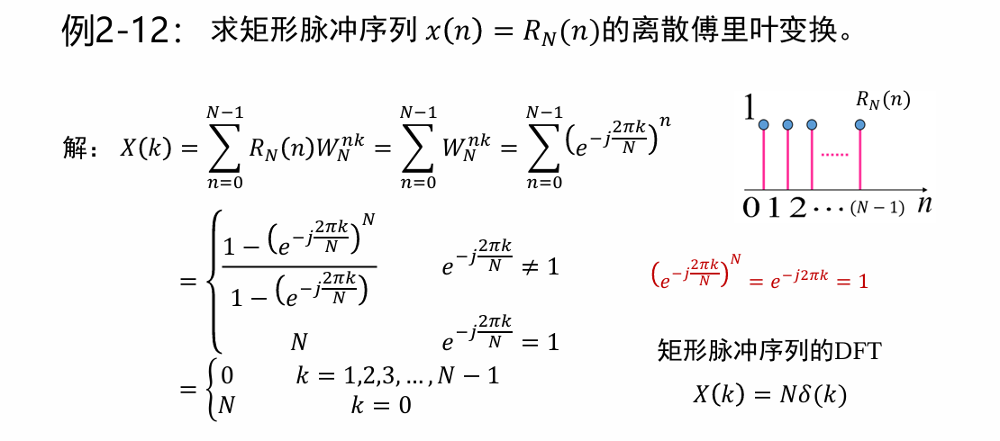

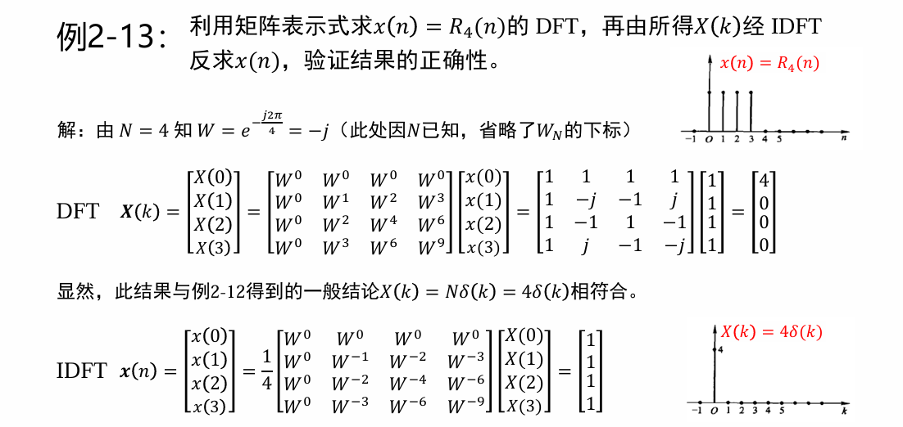

#### ④ 主要性质

- 线性性质

  

  - 两个序列长度要相同，若不同，则长度短的序列要补零

- 奇偶虚实性

  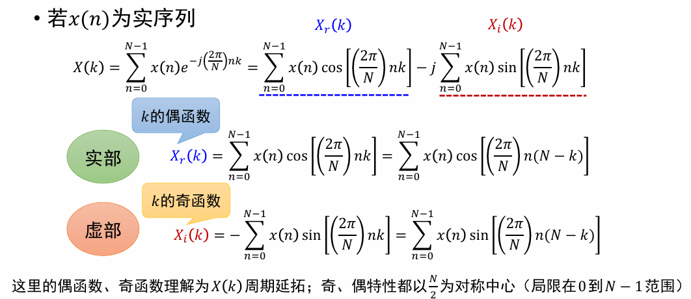

  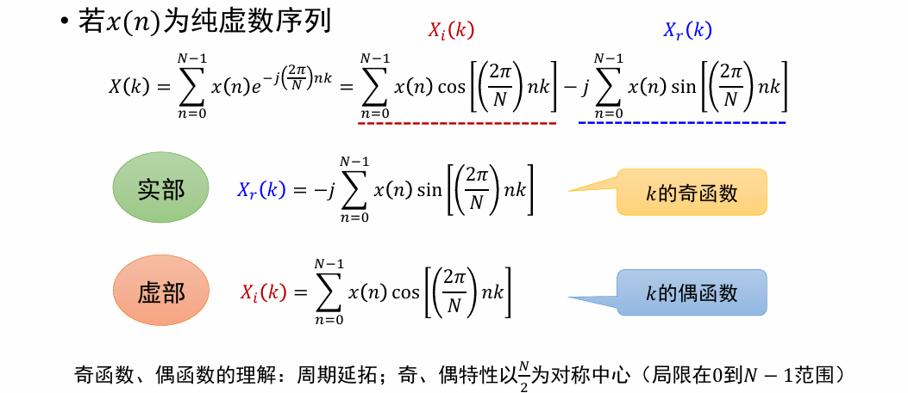

  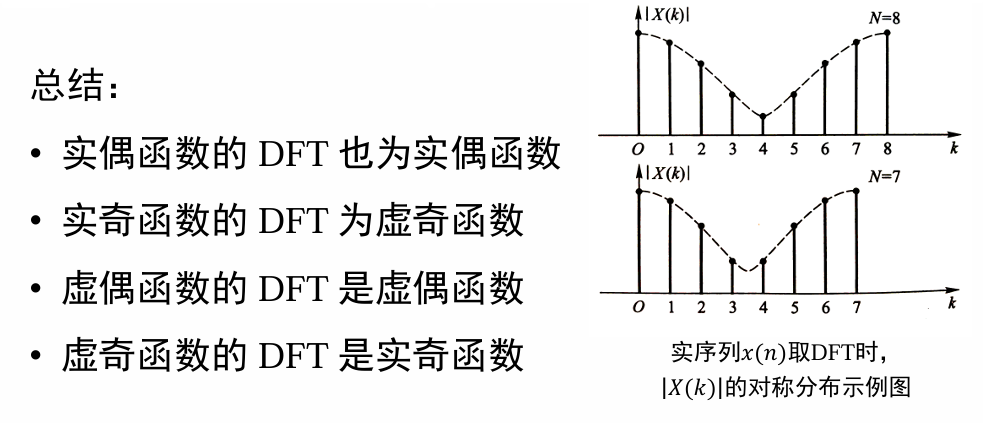

- 圆周移位性质

  - 概念
    $$
    x\big((n-m)_N\big)R_N(n)
    $$

    1. 周期延拓
       $$
       x_p(n)=x\big((n)\big)_N\\
       x(n)=x_p(n)R_N(n)
       $$

    2. 移位 $m$

    3. 取主值 $0\leq n\leq N-1$

  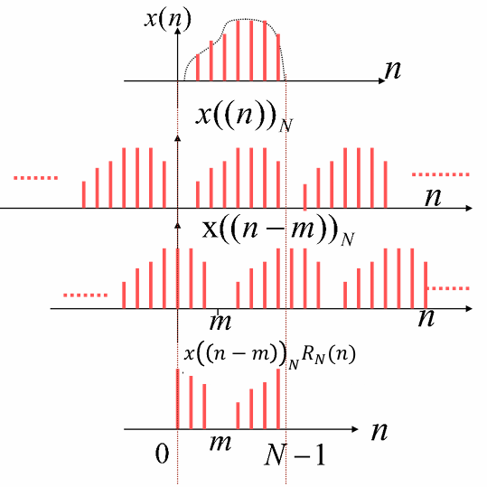

  - 性质

    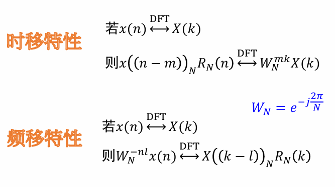

- 圆周卷积性质

  - 时域

  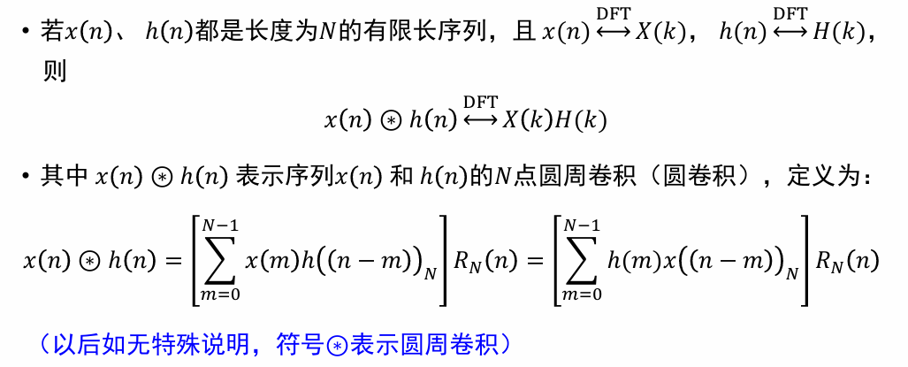

  - 频域

    

  - 例题

    

    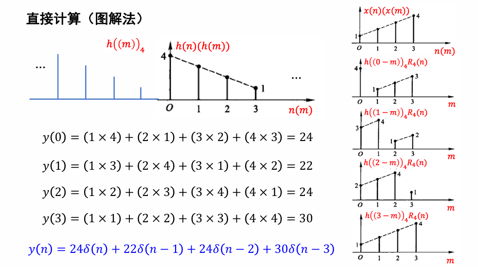

    > 圆周卷积 $VS$ 线性卷积
    >
    > - 两种卷积的结果不同
    >
    >   - 线性卷积在序列右移过程中，左端依次留出为零值的空位
    >   - 而圆周卷积过程中，同样的序列右移，会将右移值循环回序列的左端
    >
    > - 设序列 $𝑥(𝑛) $, $ ℎ(𝑛)$（长度分别为 $𝑁$, $𝑀$），则其线性卷积长度为 $𝑁+ 𝑀−1$
    >
    > - 如果把序列 $𝑥(n)$, $ℎ(𝑛)$（长度分别为 $𝑁$, $𝑀$）都适当地补零值，两序列补零以后的长度 $𝐿$​ 满足
    >   $$
    >   L\geq N+M-1
    >   $$
    >
    >   - 则它们的 $𝐿$ 点圆周卷积与线性卷积结果相同

  

## 四、快速傅里叶变换及应用

- 由 $W_N$ 的可约性
  $$
  W_N^{rn}=W^n_{\frac N{r'}}\qquad W_{rN}^{rn}=W_N^n
  $$

  - 可将 $N$ 点 DFT 分解为 $2$ 组 DFT 运算，然后再取和，从而降低计算量

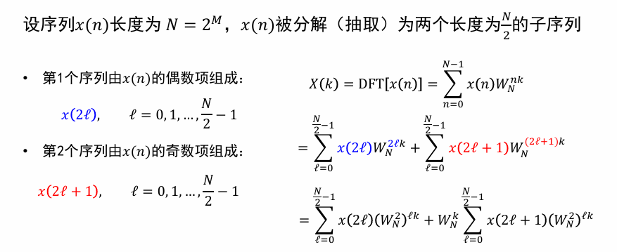

### 1、基 2FFT 算法（Cooley-Tukey 算法) 的基本思路

- 对应 $X(k)$ 的前 $\dfrac N2$ 点： 

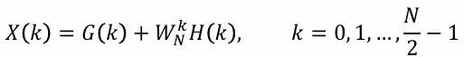

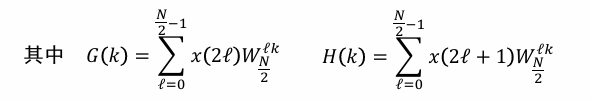

- 对应 $X(k)$ 的后 $\dfrac N2$​ 点： 
  $$
  X(k+\frac N2)=G(k+\frac N2)+W_N^{k+\frac N2}H(k+\frac N2)=G(k)-W_N^kH(k)\qquad k=0,1,\ldots,\frac N2-1
  $$

- 以 $N=4$ 为例

  - 原 DFT 矩阵形式

    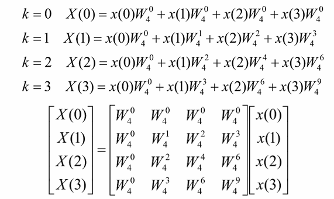

  - 根据 2FFT 公式改写，并按奇偶排列

    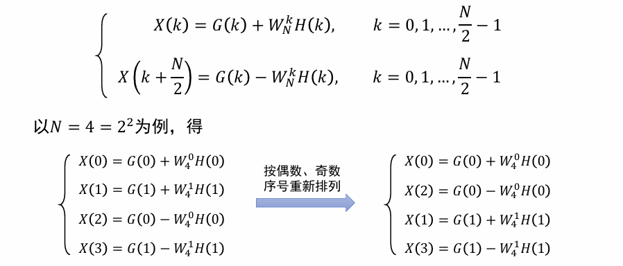

  - 代入 $G(k)、H(k)$ 公式，并转化为蝶形运算单元

    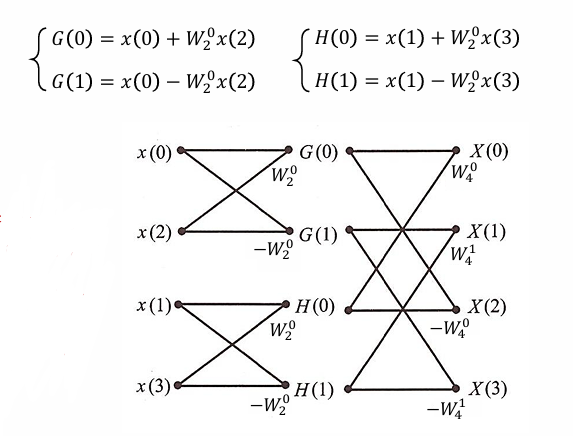

  - 拓展到 $N=8$

    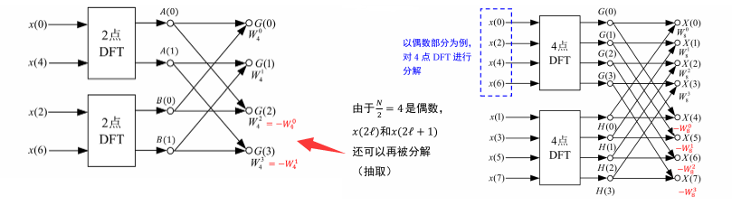

    - 合并

      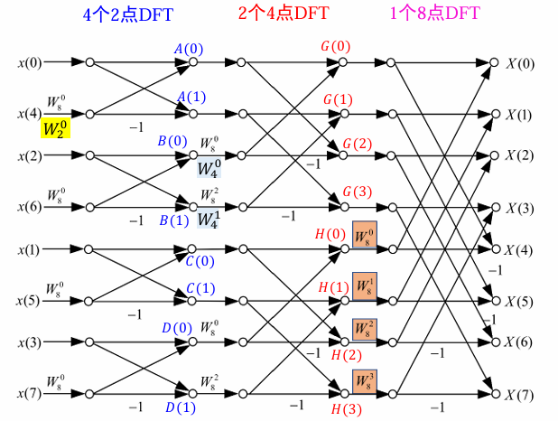

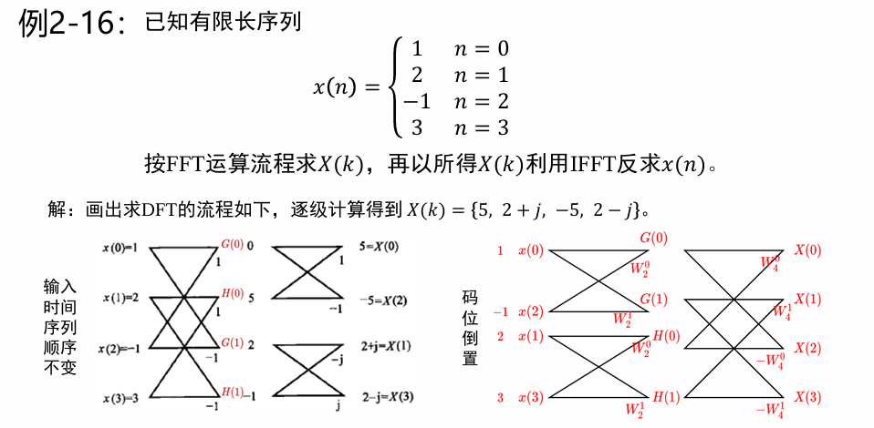

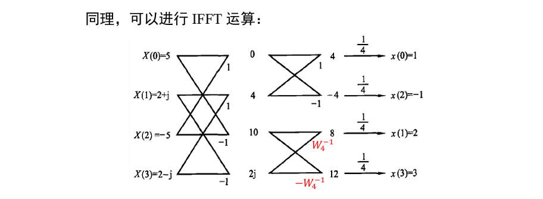

### 2、FFT 的应用（ DFT 的应用 ）

#### ① 注意事项

- 信号离散化时，采样频率要满足奈奎斯特频率

- 在基2FFT算法中，$𝑁$ 一定是 $2$的整数次幂，若不是，则需要给序列补上若干个零，凑成 $2$ 的整数次幂

- 频率分辨率

  - DFT 中，谱线间的最小间隔（单位为 $Hz$ 或 $ rad$ ），等于信号的基波频率 $𝑓_0$(或 $Ω_0$ ），$𝑓_0$ 越小则频率分辨率越高

  - 对于通过采样频率 $𝑓_𝑠$ 得到的、长度为 $ 𝑁$​ 的数据序列，频率分辨率为
    $$
    f_0=\frac 1{NT_s}=\frac{f_s}N
    $$

#### ② 求线性卷积

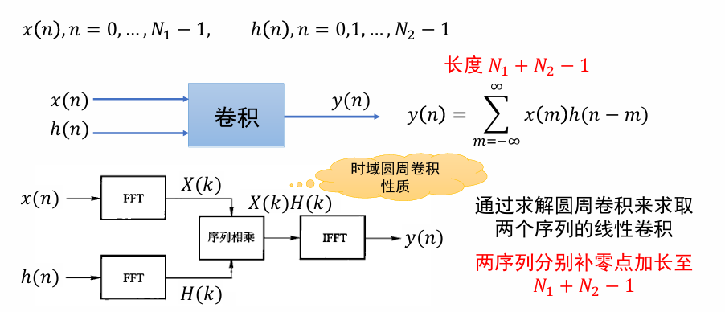

> - 在一般的数字滤波器中，由 $ℎ(𝑛)$ 求 $𝐻(𝑘)$ 这一步是预先设计好的，数据已置于存储器之中，实际只需要两个FFT的计算 
> - 两序列长度接近或相等时，随着序列长度 $𝑁$ 的增大，圆卷积比线性卷积复杂度降低越多
> - 若一个序列较短，而另一序列很长时，可采用分段卷积的方法

#### ③ 连续时间信号分析的逼近

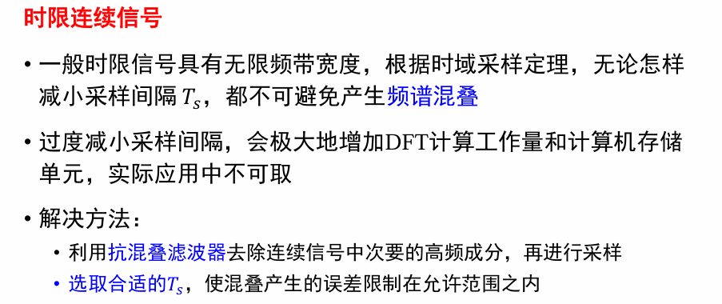

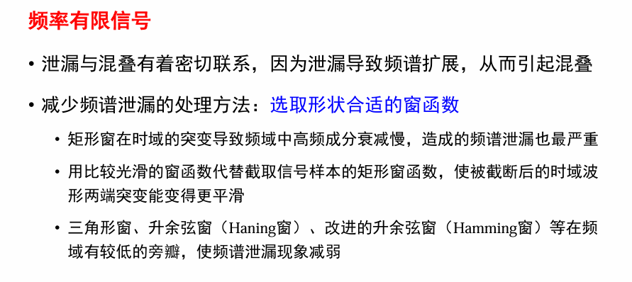

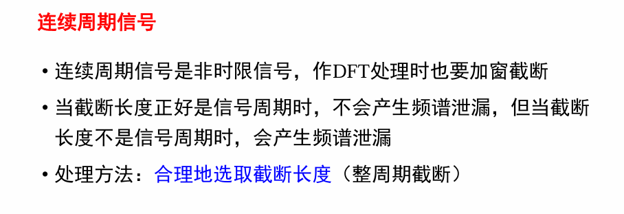

## 五、离散信号的 Z 域分析

### 1、离散信号的 Z 变换

> - 增长型的离散信号 $𝑥(𝑛)$ 的傅里叶变换是不收敛的
> - 为了满足收敛条件，类似拉普拉斯变换，将 $𝑥(𝑛)$ 乘以一衰减的实指数信号 $𝑟^{−𝑛}\ (𝑟>1)$，使信号 $𝑥(𝑛)𝑟^{–𝑛}$ 满足收敛条件

#### ① 正变换

$$
X(z)=\sum_{n=-\infty}^\infty x(n)z^{-n}
$$

#### ② 逆变换

$$
x(n)=\frac 1{2\pi j}\oint_CX(z)\cdot z^{n-1}dz
$$

- 以 $𝑟$ 为半径、以原点为中心的封闭圆周上沿逆时针方向的围线积分

#### ③ 单边 Z 变换

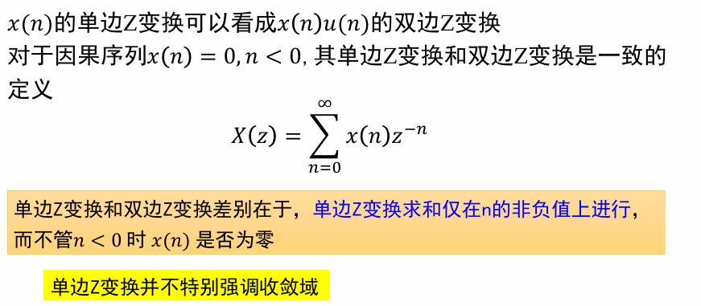

#### ④ Z 变换和 Laplace 变换的关系

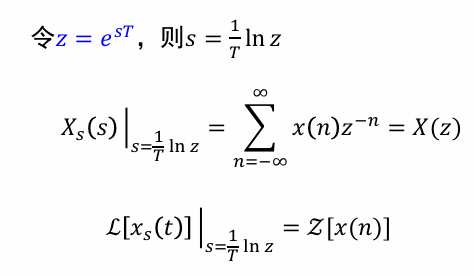

> 序列的Z变换可以看作：产生序列的理想冲激采样信号的拉普拉斯变换进行 $z=𝑒^{𝑠𝑇}$ 映射的结果，由复变量 s 平面映射到复变量 z 平面

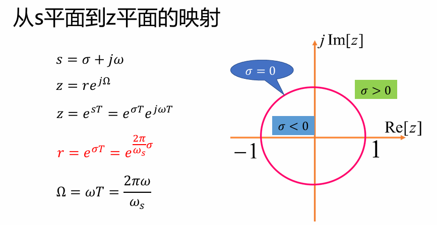

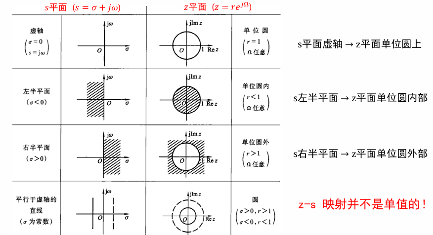

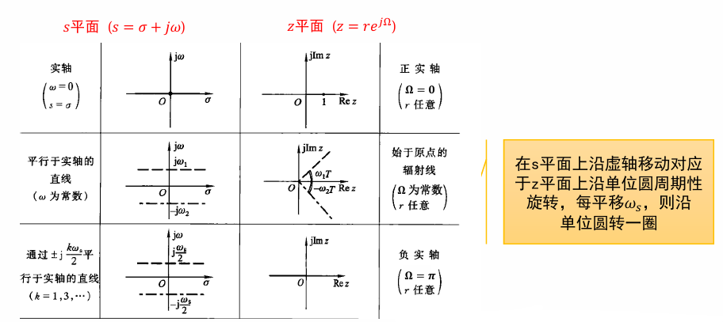

#### ⑤  Z 变换和 DTFT 的关系

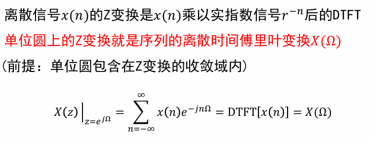

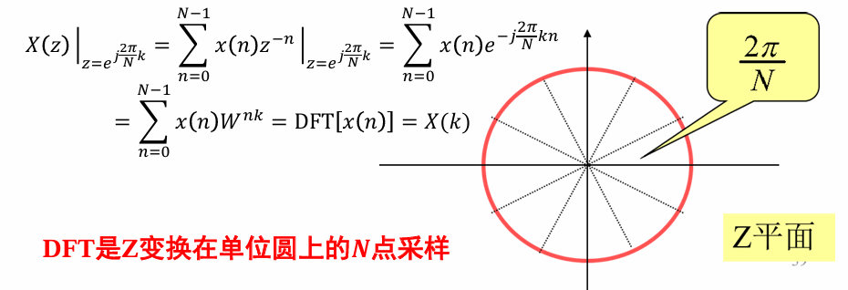

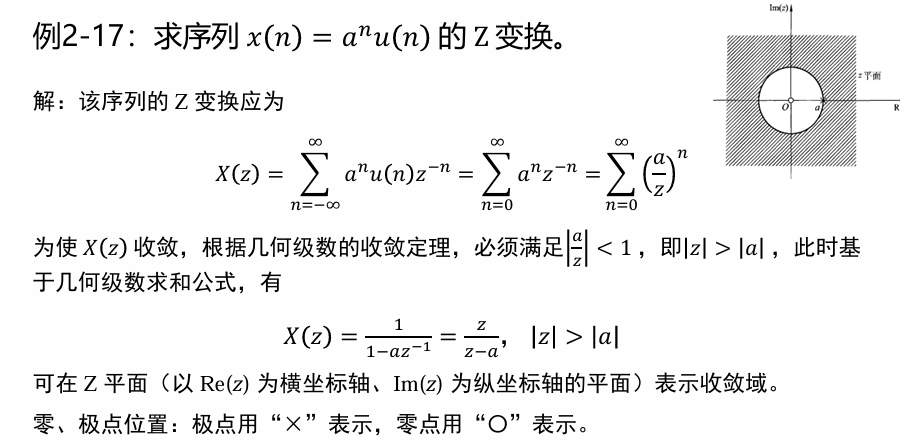

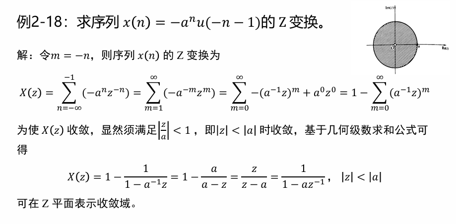

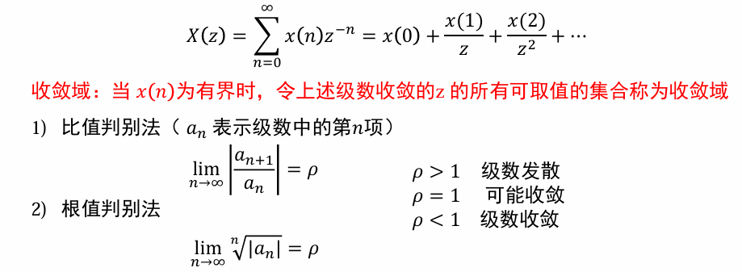
