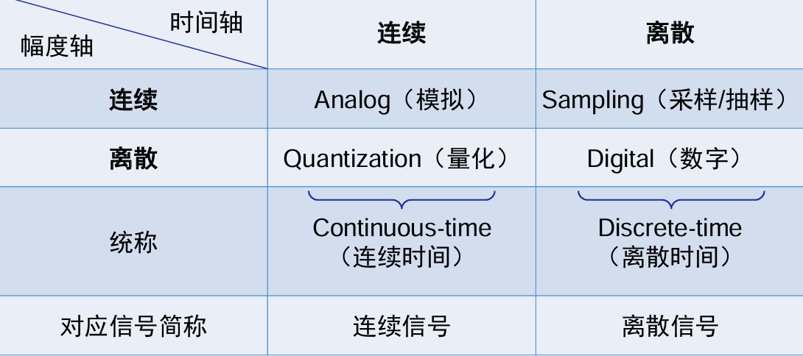
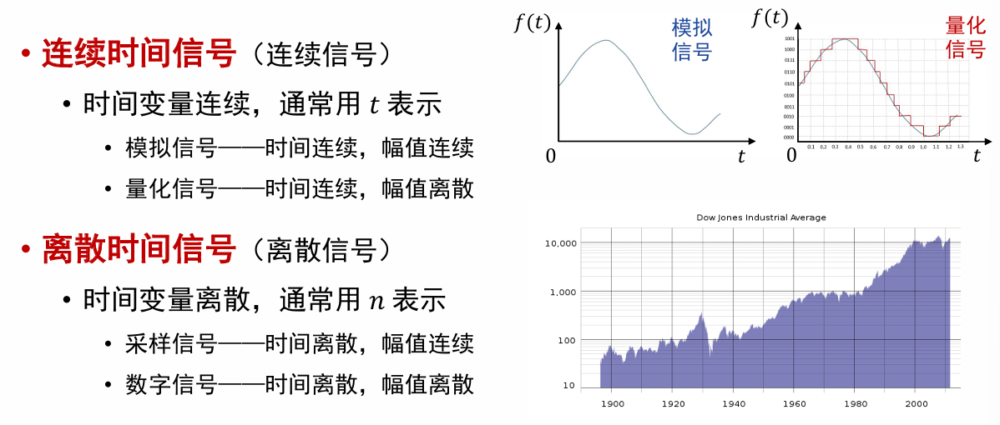
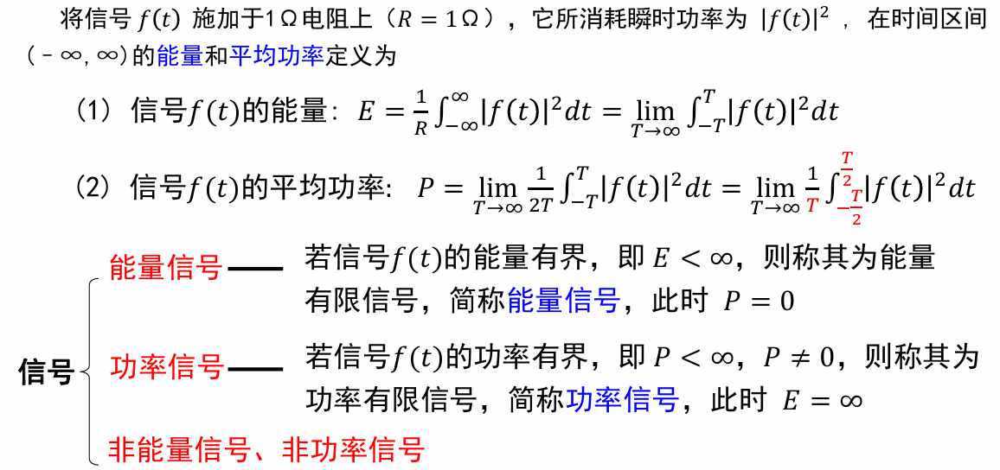
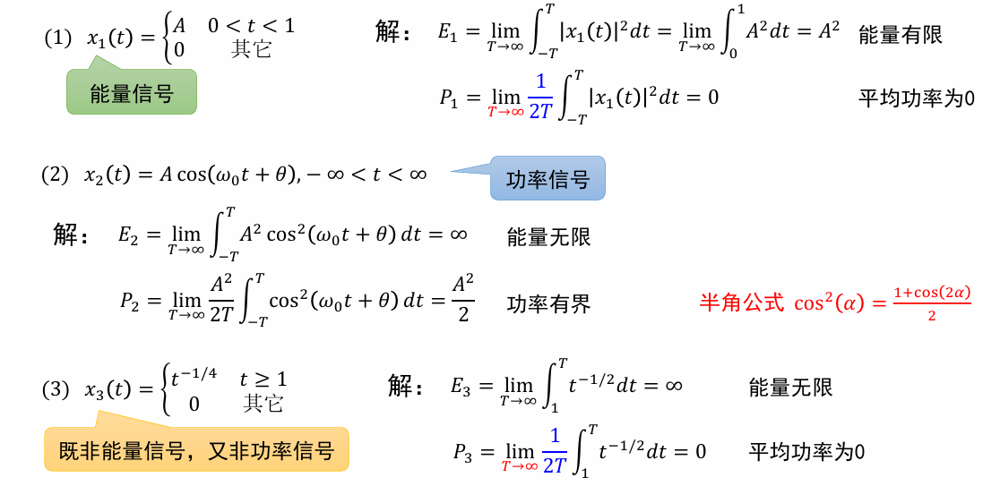
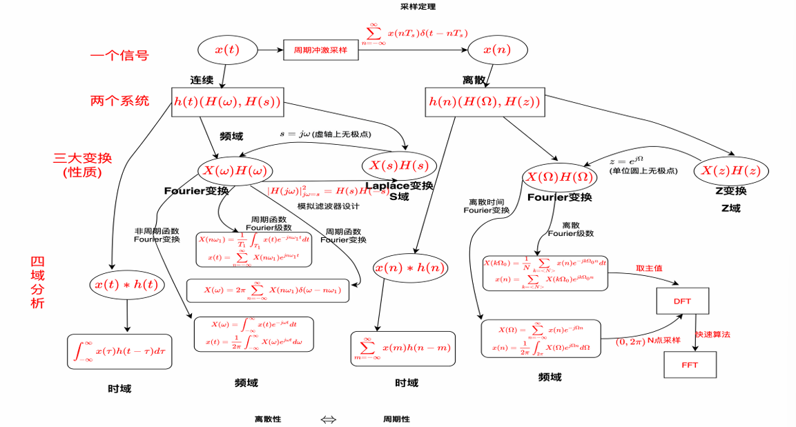

# 绪论

## 分类

### 按信号的时间特性

### 按时间函数特性

- 连续时间信号在自变量的连续值上都有定义
- 离散时间信号仅在自变量的整数值上有意义

### ⭐按周期性

- 周期信号：$f(t) = \sin(2t)+\cos(3t)$
- 非周期性信号：$f(t)=\cos(2t)+\sin(\pi t)$

### ⭐按能量特点

- eg.

## 主要内容

- 一个信号：确定性信号
- 二个系统：连续系统、离散系统
- 三大变换：傅里叶变换、拉普拉斯变换、Z变换
- 四域分析：时域分析、频域分析、S域分析、Z域分析

