# 连续信号分析

## 一、连续信号的时域描述

### 1、普通信号

#### ① 正弦信号

$$
f(t)=K\sin(\omega t +\theta)
\tag 1
$$

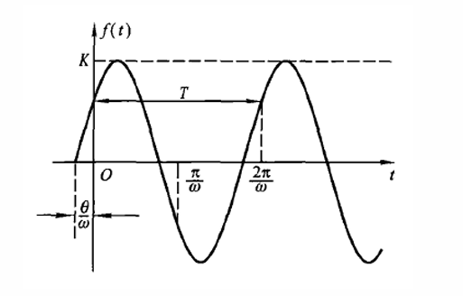

> - 若一个正弦信号的频率 $f_1$ 是另一个正弦信号频率 $f_0$ 的整数倍
>   $$
>   f_1=nf_0
>   $$
>
>   - 则合成信号是频率为 $f_0$ 的非正弦周期信号（基波+一系列谐波）
>
> - 2 个正弦信号相加，若他们的周期之比为有理数，则结果仍是周期信号，且周期是二者周期的最小公倍数
>
>   - $g(t)=\cos2t+\sin\pi t$ 为非周期信号
>

#### ② 指数信号

$$
f(t)=Ke^{at}\tag 2
$$

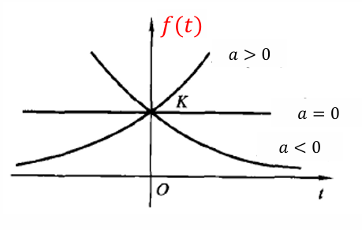

#### ③ 复指数信号

$$
f(t)=Ke^{st}=Ke^{\sigma t}e^{j\omega t}=Ke^{\sigma t}(\cos\omega t+j\sin\omega t)\tag3
$$

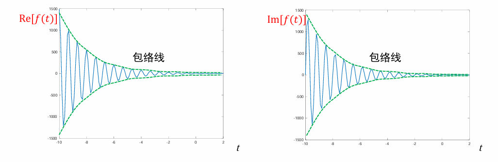

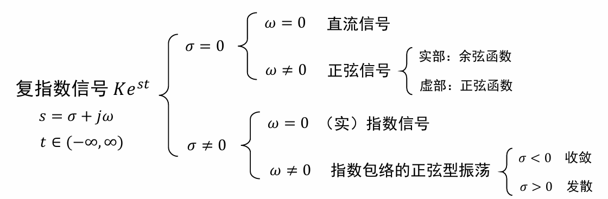

> 复指数信号为复函数，不可能实际产生

### 2、奇异信号

> 特殊的连续信号：本身或导数有不连续点

#### ① 单位斜坡信号

$$
r(t)=
\begin{cases}
t \quad t\geq0\\
0 \quad t<0
\end{cases}
\tag 4
$$

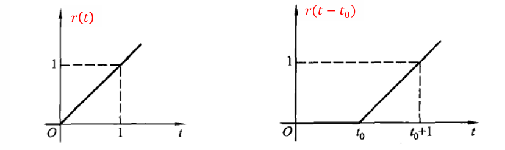

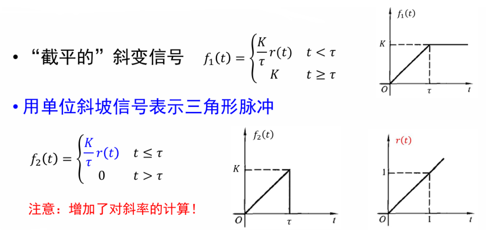

#### ② 单位阶跃信号

$$
u(t)=\frac{dr(t)}{dt}=
\begin{cases}
1 \quad t>0\\
0 \quad t<0
\end{cases}
\tag 5
$$

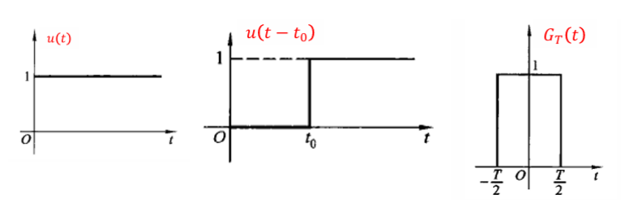
$$
G_T(t)=u(t+\frac T2)-u(t-\frac T2)\tag 6
$$

#### ③ 单位冲激信号

$$
\delta(t)=\frac{du(t)}{dt}=0\qquad t\neq0\\
\int_{-\infty}^{\infty}\delta(t)dt=1
\tag 7
$$

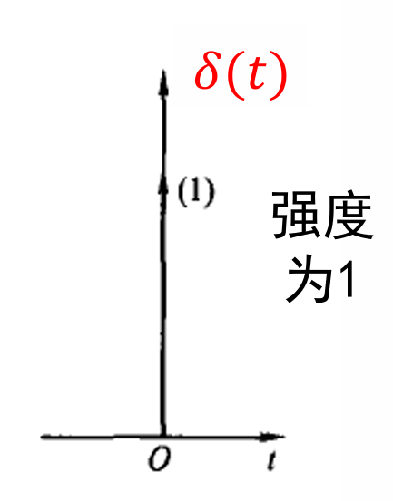

###### 性质

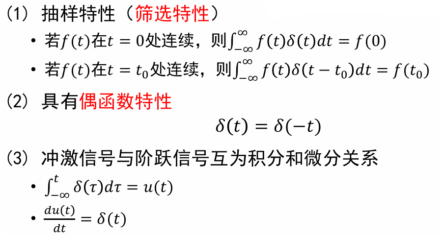

#### ④ 单位冲激偶信号

$$
\delta'(t)=\frac{d\delta(t)}{dt}
$$

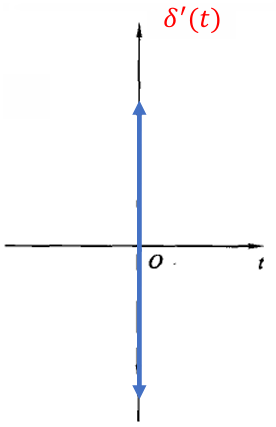

###### 性质

## 二、连续信号的时域运算

### 1、基本运算

#### ① 尺度变换

- 幅度尺寸变换：$f_2(t)=af_1(t)$
- 时间尺寸变换：$f_2(t)=f_1(at)$

#### ② 翻转

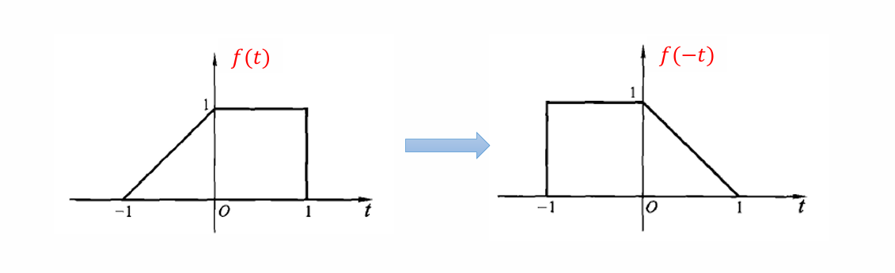

#### ③ 平移

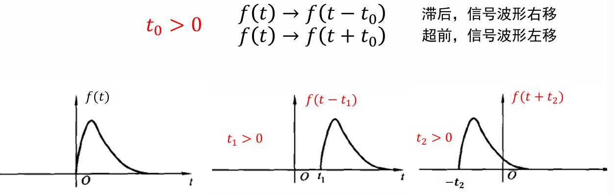

###  2、叠加和相乘

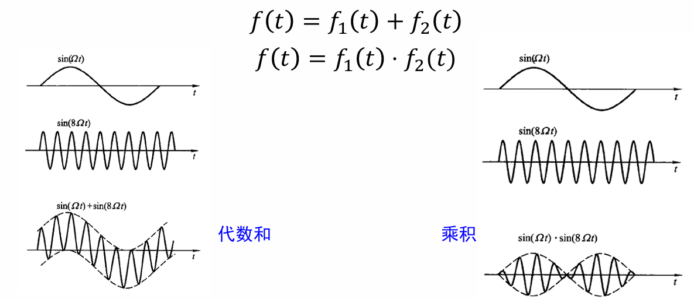

### 3、微分和积分

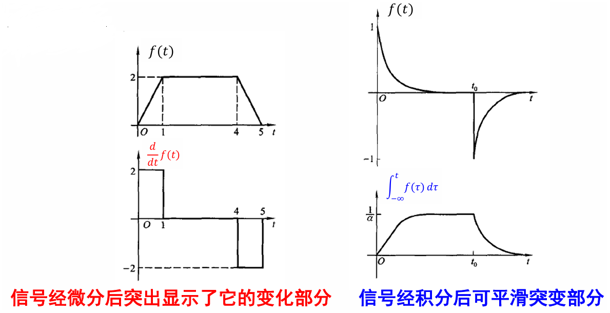

### 4、卷积运算及性质

$$
x_1(t)* x_2(t)=\int_{-\infty}^{\infty}x_2(\tau)x_1(t-\tau)d\tau=\int_{-\infty}^{\infty}x_1(\tau)x_2(t-\tau)d\tau
$$

#### 图解法步骤

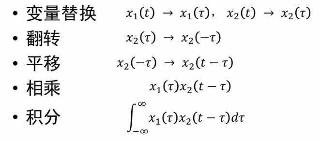

##### 例题

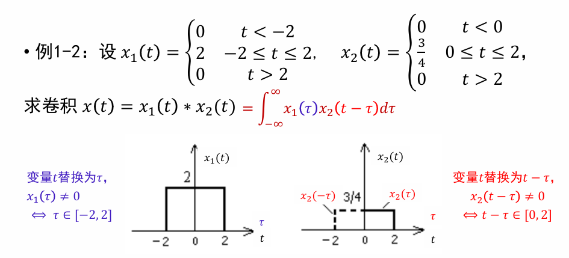

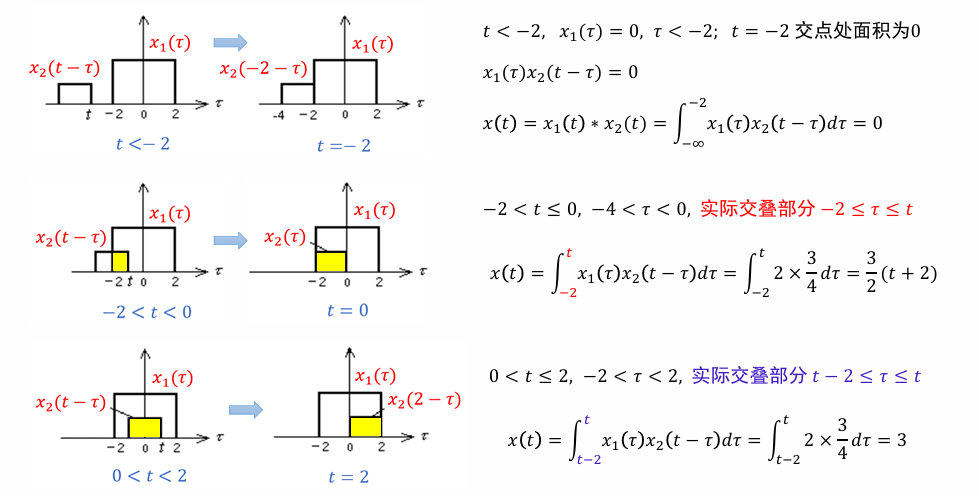

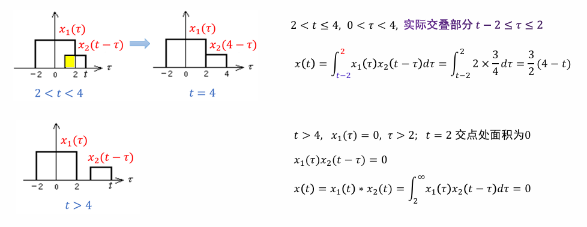

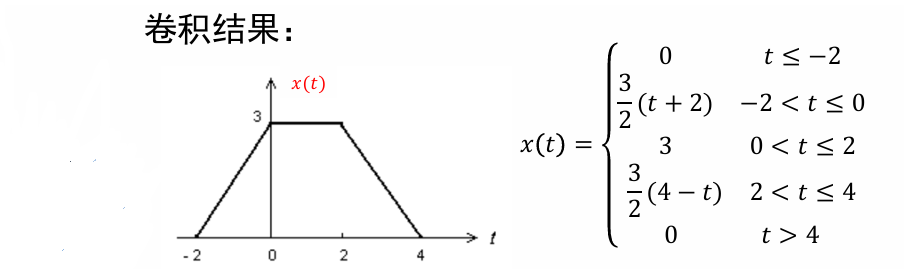

- 卷积结果所占有的时宽等于两个函数各自时宽的总和

> #### 拓展解释
>
> - 卷积实质上是对信号进行滤波，通过两个函数的运算得到一个新的函数
> - 在物理上，卷积可代表某种系统对某个物理量或输入的调制或污染
> - 在应用中，可以通过卷积，把一些非光滑的函数或算子光滑化
> - 离散卷积在数字图像处理中将会经常用到
>

#### 性质

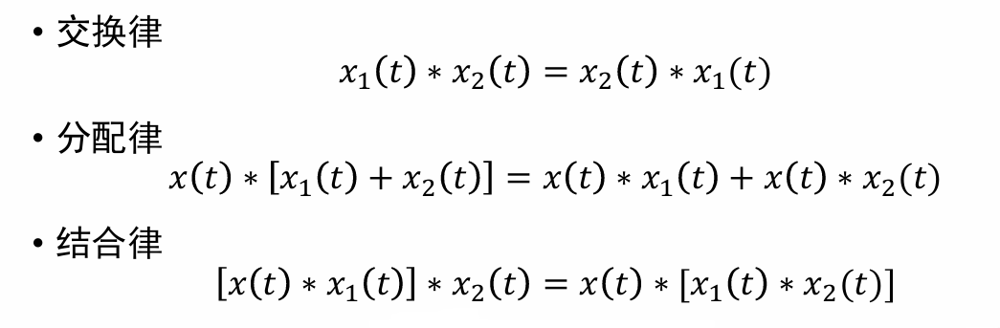

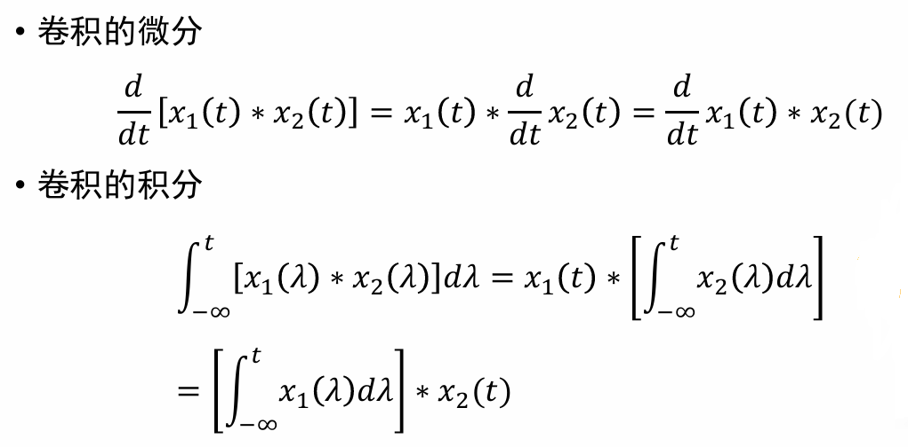

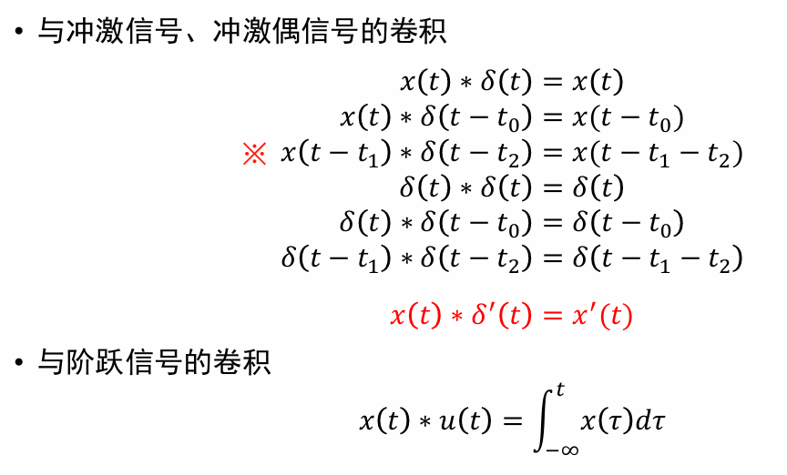

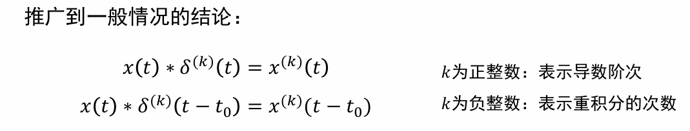

### 5、连续信号的时域分解

- 复杂信号分解成一些简单信号或基本信号
  - 直流+交流：$f(t)=f_D+f_A(t)$
  - 偶+奇： $f(t)=f_e(t)+f_o(t)$
  - 冲激函数之和：$f(t)=f(t)*\delta(t)$

- 正交分解

  - 向量空间中：$A=\sum_{i=1}^nC_iv_i$

    - $C_i=\frac{<A,V_i>}{<V_i,V_i>}\\$

  - 拓展到函数空间（可看作无限维向量）

    - 引入希尔伯特空间

      - 函数内积
        $$
        <f,g>=\int_{t_1}^{t_2}f(t)g(t)dt
        $$

        - 积分范围取决于具体问题

        - 正交定义
          $$
          <f,g>=\int_{t_1}^{t_2}f(t)g(t)dt=0
          $$

          - 称 $f(x)$ 与 $g(x)$ 在 $(t_1,t_2)$ 内正交

      - 长度定义（范数）
        $$
        ||f||=\sqrt{<f,f>}=\sqrt{\int_{t_1}^{t_2}[f(t)]^2dt}
        $$

    - 正交函数集
      $$
      <f_i,f_j>=\int_{t_1}^{t_2}f_i(t)f_j(t)dt=
      \begin{cases}
      0\qquad\ i\neq j \\
      k_i\qquad i=j
      \end{cases}
      $$

      - 称 $\{f_1(t),\ f_2(t),\ ...\ ,\ f_n(t)\}$ 为 $(t_1,t_2)$ 内的正交函数集

      - 完备正交函数集

        - 不存在非零函数 $\phi(t)\notin\{f_1(t),\ f_2(t),\ ...\ ,\ f_n(t)\}$，使得 $\int_{t_1}^{t_2}\phi(t)f_i(t)dt=0\quad i=1,2,…,n$

      - 常见的完备正交函数集

        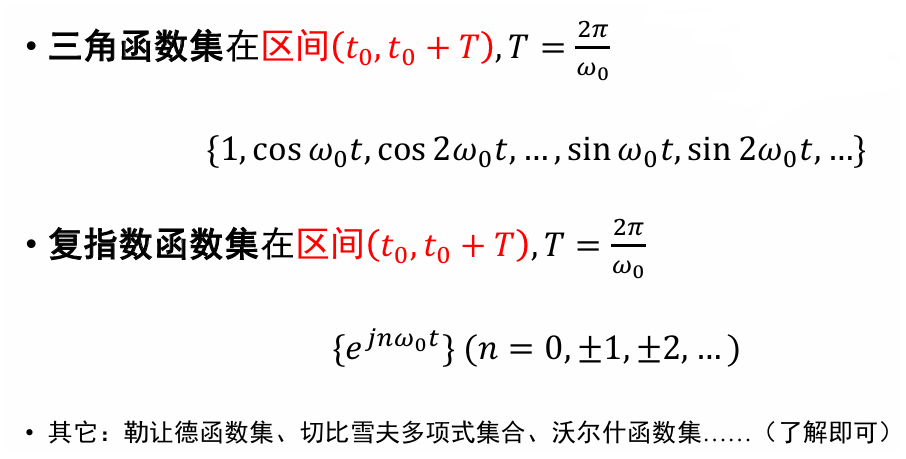

  - 信号的正交分解
    $$
    x(t)=\sum_{i=1}^nx_if_i(t)+x_e(t)\qquad t\in(t_1,t_2)
    $$

    - 均方误差
      $$
      \overline{x_e^2(t)} = \frac{1}{t_2 - t_1} \int_{t_1}^{t_2} \left[ x(t) - \sum_{i=1}^n c_i f_i(t) \right]^2 dt
      $$
      其中
      $$
      c_i=\frac{\int_{t_1}^{t_2}x(t)f_i(t)dt}{\int_{t_1}^{t_2}[f_i(t)]^2dt}=\frac1{k_i}\int_{t_1}^{t_2}x(t)f_i(t)dt
      $$

    - 帕斯瓦尔方程
      $$
      \int_{t_1}^{t_2}x^2(t)dt=\sum_{i=1}^\infty c_i^2k_i
      $$

      - 表示了信号分解的能量关系：信号的能量等于其在完备正交函数集中各分量的能量之和

## 三、连续信号的频域分析

### 1、周期信号的傅里叶级数

#### ① 狄里赫利 (Dirichlet) 条件：傅里叶级数存在的充分条件

- 在一个周期内，如果有间断点存在，则间断点的数目应是有限个
- 在一个周期内，极大值和极小值的数目应是有限个
- 在一个周期内，信号是绝对可积的：$\int_{t_0}^{t_0+T_1}|f(t)|dt$ 为有限值

> 通常实际应用中的周期性信号都能满足狄里赫利条件，所以一般的周期信号都具有傅里叶级数。

#### ② 三角函数形式的傅里叶级数展开式

$$
\begin{align}
f(t)&=\frac{a_0}2+\sum_{n=1}^\infty(a_n\cos n\omega_1 t +b_n\sin n\omega_1 t)\\
&=\sum_{n=0}^\infty(a_n\cos n\omega_1 t +b_n\sin n\omega_1 t)\\
&=c_0+\sum_{n=1}^{\infty}c_n\cos (n\omega_1t+\phi_n)\qquad 其中：\phi_n=-\arctan\frac{b_n}{a_n}\qquad c_n=\sqrt{a_n^2+b_n^2}\\
\end{align}
$$

- 直流分量（信号在一个周期内的均值）：$\frac{a_0}2 = \frac  1{T_1}\int_{-\frac{T_1}2}^\frac{T_1}2f(t)dt\\$ 
- 余弦分量幅度：$a_n = \frac  2{T_1}\int_{-\frac{T_1}2}^\frac{T_1}2f(t)\cos n\omega_1tdt\\$ 
- 正弦分量幅度：$b_n = \frac  2{T_1}\int_{-\frac{T_1}2}^\frac{T_1}2f(t)\sin n\omega_1 tdt\\$ 

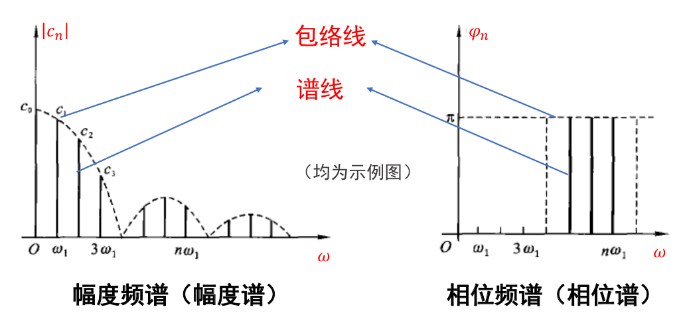

> 周期信号的频谱只会出现在 $0, 𝜔1 , 2𝜔1 , … $ 离散频率点上，称为离散谱

#### ③ 指数函数形式的傅里叶级数展开式

$$
\begin{align}
f(t)
&=\frac{a_0}2+\sum_{n=1}^{\infty}(\frac{a_n-jb_n}2e^{jn\omega_1t}+\frac{a_n+jb_n}2e^{-jn\omega_1t})\\
&=F(0)+\sum_{n=1}^{\infty}[F(n\omega_1)e^{jn\omega_1t}+F(-n\omega_1)e^{-jn\omega_1t}]\\
&=\sum_{n=-\infty}^{\infty}F(n\omega_1)e^{jn\omega_1t}\\
&=\sum_{n=-\infty}^{\infty}F_ne^{jn\omega_1t}
\end{align}
$$

- $F_n=\frac12c_ne^{h\phi_n}=\frac  1{T_1}\int_{-\frac{T_1}2}^\frac{T_1}2f(t)e^{-jn\omega_1t}dt\\$
  - $F_n=\frac12(a_n-jb_n)\\$
  - $F_{-n}=\frac12(a_n+jb_n)\\$
- $a_n=F_n+F_{-n}\qquad b_n=j(F_n-F_{-n})$
- $|F_n|=|F_{-n}|=\frac12|c_n|\\$

> 负频率的出现是数学运算的结果，把负频率项与相应的正频率项成对地合并起来，才是实际的频谱函数
>
> 模 $|𝐹_𝑛 |$ 反映了各谐波分量的幅度，随频率的分布称为幅度频谱（幅频）[𝑛的偶函数]
> 相角 $𝜑_𝑛$ 反映了各谐波分量的相位，随频率的分布称为相位频谱（相频）[𝑛的奇函数]

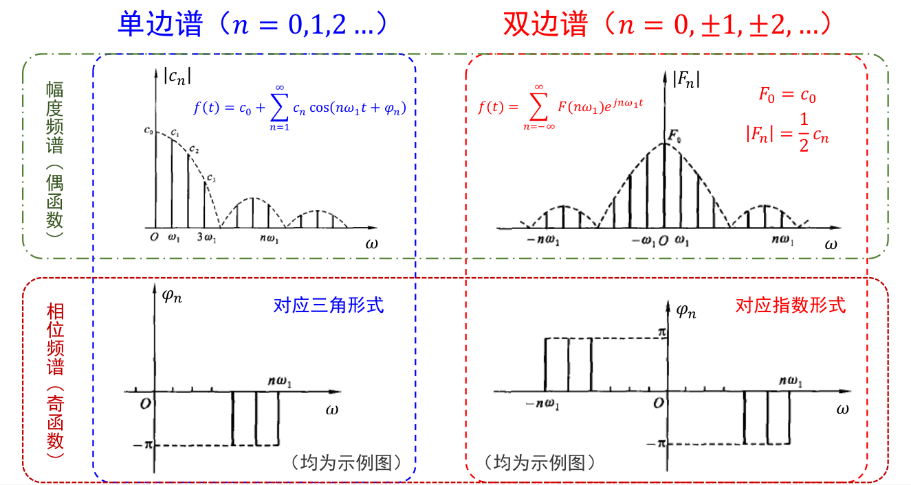

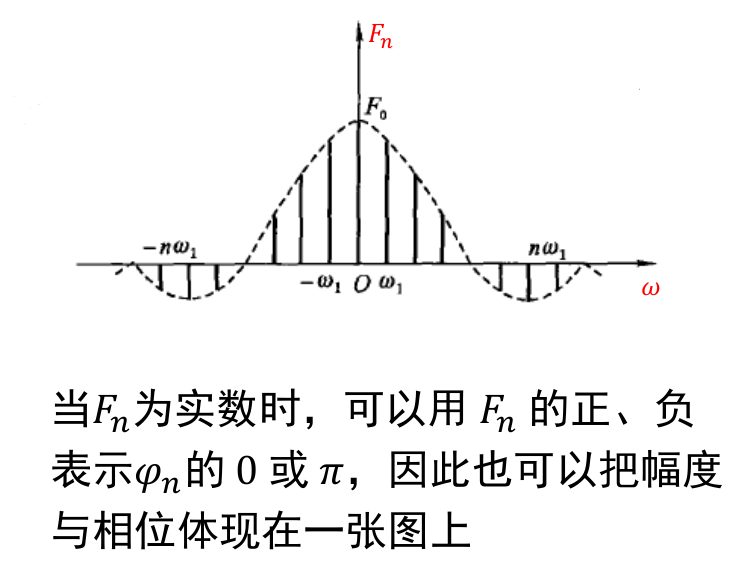

> 由帕斯瓦尔公式：$P=\sum_{n=-\infty}^{\infty}|F_n|^2\\$
>
> 周期信号的功率频谱：将各次谐波包括直流的平均功率分配关系表示成谱线形式

#### ④ 函数的对称性与傅里叶系数的关系

对于奇函数：
$$
\begin{cases}
a_n=\frac4{T_1}\int_0^{\frac{T_1}2}f(t)\cos n\omega_1tdt\\
b_n=0\\
c_n=a_n\\
F_n=\frac{a_n}2
\end{cases}
$$
对于偶函数：
$$
\begin{cases}
a_n=0\\
b_n=\frac4{T_1}\int_0^{\frac{T_1}2}f(t)\sin n\omega_1tdt\\
c_n=b_n\\
F_n=-\frac{jb_n}2\\
\phi_n=-\frac{\pi}2\ 或\ \frac{\pi}2
\end{cases}
$$
对于奇谐函数 $f(t)=-f(t± \frac{T_1}2)\\$

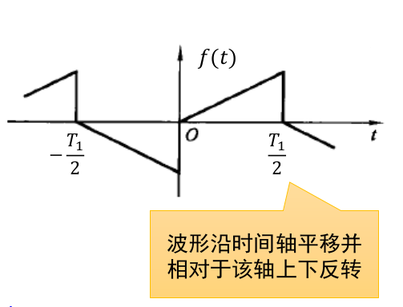
$$
n为偶数\begin{cases}
a_n=0\\
b_n=0\\
\end{cases}
\qquad
n为奇数\begin{cases}
a_n=\frac4{T_1}\int_0^{\frac{T_1}2}f(t)\cos n\omega_1tdt\\
b_n=\frac4{T_1}\int_0^{\frac{T_1}2}f(t)\sin n\omega_1tdt\\
\end{cases}
$$
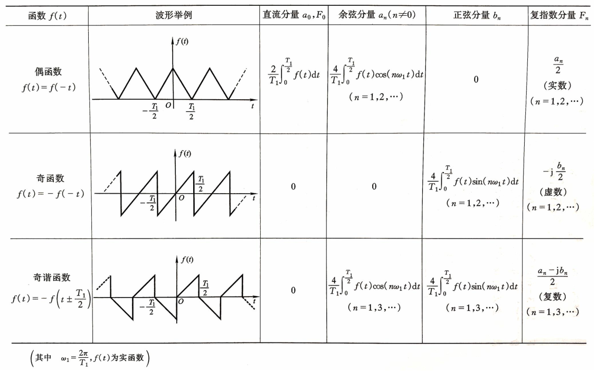

#### ⑤ 周期方波信号

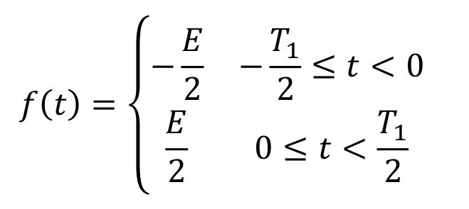

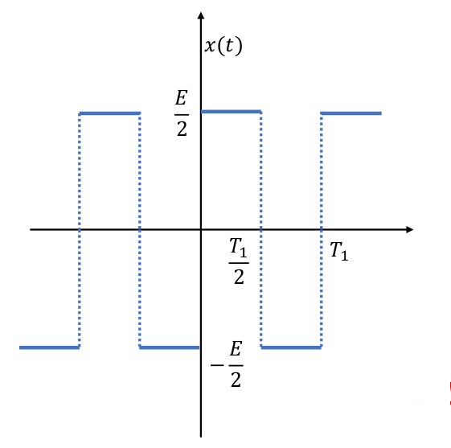

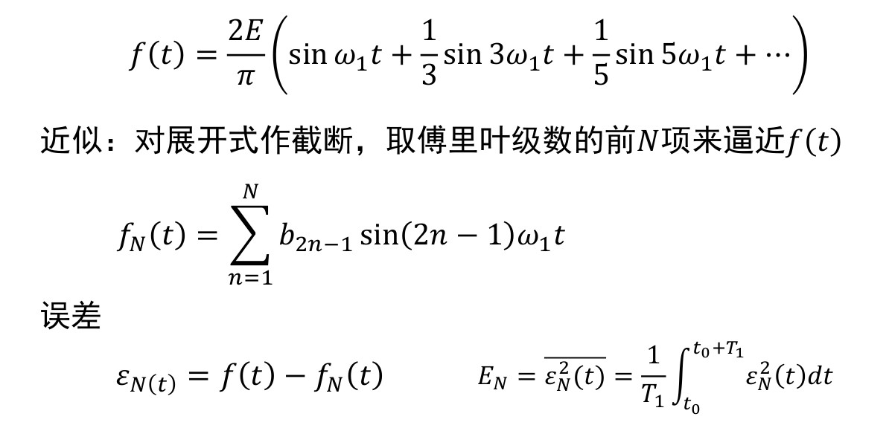

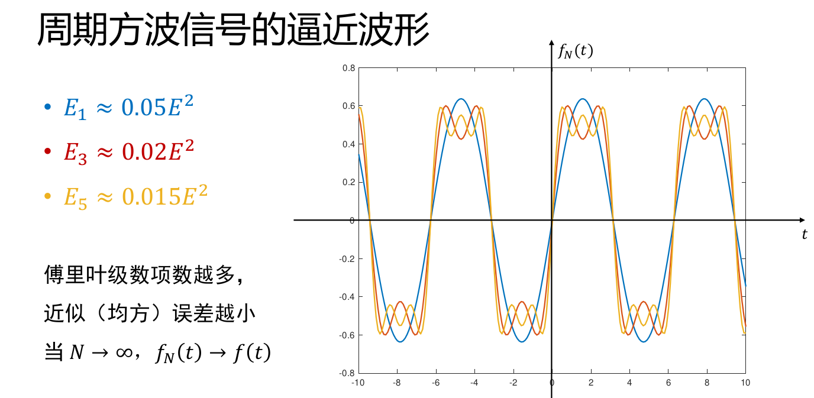

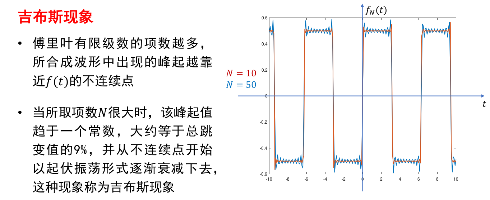

> 低频分量影响脉冲顶部：低频分量越多，信号变化越缓慢
> 高频分量影响脉冲跳变沿：高频分量越多，信号变化越剧烈

#### ⑥ 周期矩形脉冲信号

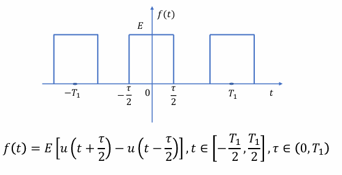

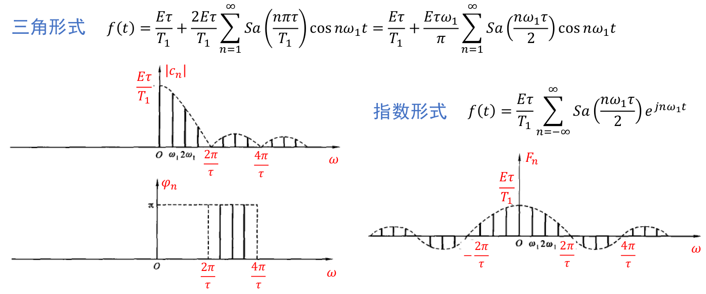

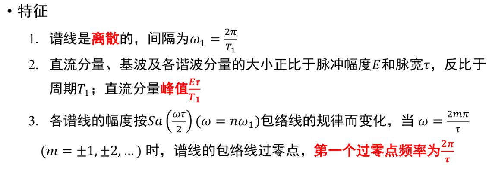

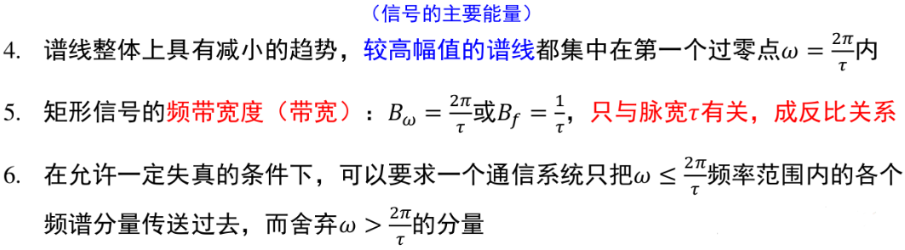

#### ⑦ 对称方波信号

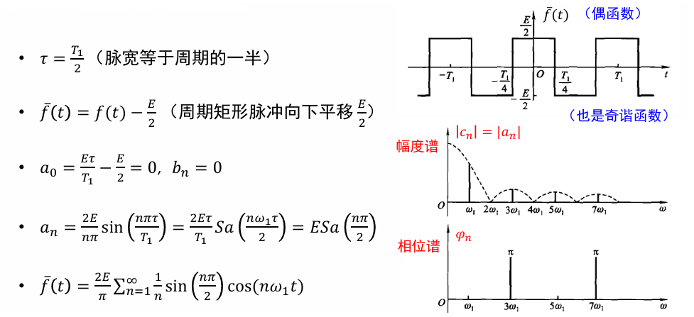

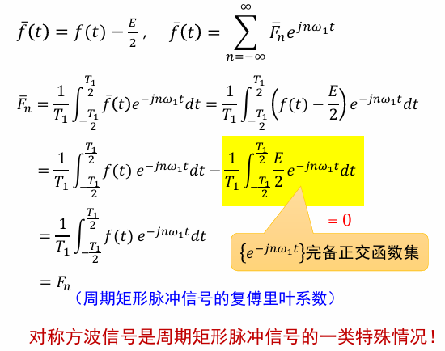

#### ⑧ 复指数信号

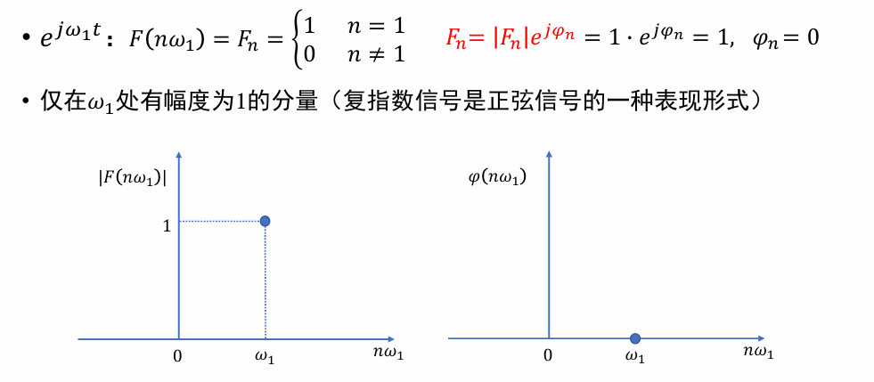

#### ⑨ 正弦信号

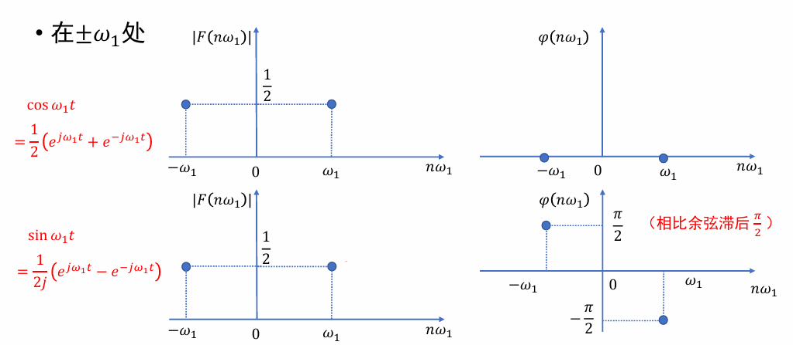

### 2、傅里叶变换

#### ① 正变换

$$
F(\omega)=\int_{-\infty}^{\infty}f(t)e^{-j\omega t}dt
$$

- 频谱密度：$\frac{F(n\omega_1)}{\omega_1}\\$，表示单位频带 $\omega=n\omega_1$ 处的频谱值

- 狄里赫利条件（存在条件）

  - $f(t)$ 在无限区间内绝对可积
    $$
    \int_{-\infty}^{\infty}|f(t)|dt<\infty
    $$

  - 在任意有限区间内， $f(t)$ 只有有限个不连续点，在这些点上，函数取有限值

  - 在任意有限区间内， $f(t)$ 只有有限个极大值和极小值

#### ② 逆变换：

$$
f(t)=\frac 1{2\pi}\int_{-\infty}^{\infty}F(\omega)e^{j\omega t}d\omega
$$

- 三角形式

  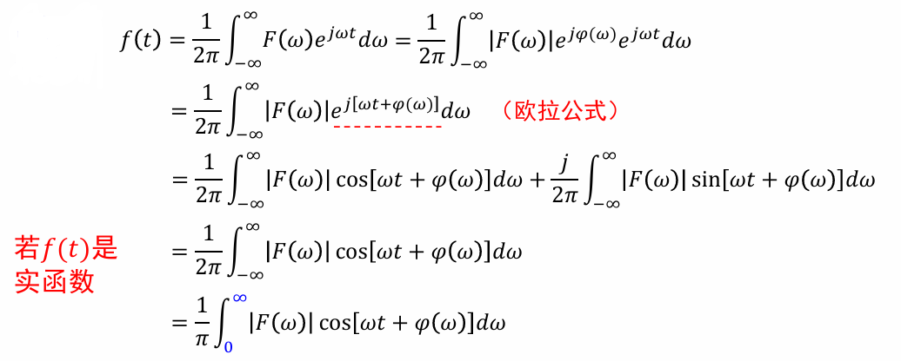

  - 一个非周期信号包含了频率从 $0$ 到无限大的一切频率的余弦分量
  - 各分量的振幅为无穷小量：$\frac1{\pi}|F(\omega)|d\omega\\$
    - 频谱不能再用幅度表示，而改用密度函数来表示
  
  

####  ③ 频谱密度函数

$$
F(\omega)=|F(\omega)|e^{j\phi(\omega)}
$$

- 幅度频谱（偶函数）：$|F(\omega)|$
- 相位频谱（奇函数）：$\phi(\omega)$

> - 一个周期内绝对可积的周期信号可以用傅里叶级数表示
> - 在无限区间内绝对可积的非周期信号可以用傅里叶变换表示
> - 周期信号的频谱是离散谱，非周期信号的频谱是连续谱
> - 通过引入冲激函数，可以得出周期信号的傅里叶变换
> - 把周期信号与非周期信号的频域分析统一起来，给分析带来便利

#### ④ 典型非周期信号的频谱

| 典型非周期信号 |                         频谱密度函数                         |                          时域表达式                          |
| :------------: | :----------------------------------------------------------: | :----------------------------------------------------------: |
| 🌈矩形脉冲信号  | $F(\omega) = E \tau \text{Sa}\left( \frac{\omega \tau}{2} \right)\\$ | $f(t) = E \left[ u\left( t + \frac{\tau}{2} \right) - u\left( t - \frac{\tau}{2} \right) \right]\\$ |
|  单边指数信号  |            $F(\omega) = \frac{1}{a + j\omega}\\$             |                $f(t) = e^{-at} u(t), \ a > 0$                |
|  双边指数信号  |          $F(\omega) = \frac{2a}{a^2 + \omega^2}\\$           |        $f(t) = e^{-at} u(t) + e^{at} u(-t), \ a > 0$         |
| 双边奇指数信号 |       $F(\omega) = -\frac{j2\omega}{a^2 + \omega^2}\\$       |        $f(t) = e^{-at} u(t) - e^{at} u(-t), \ a > 0$         |
| 🌈单位直流信号  |              $F(\omega) = 2\pi \delta(\omega)$               |                          $f(t) = 1$                          |
| 🌈符号函数信号  |              $F(\omega) = \frac{2}{j\omega}\\$               |            $f(t) = \text{sgn}(t) = u(t) - u(-t)$             |
| 🌈单位冲激信号  |                       $F(\omega) = 1$                        |                      $f(t) = \delta(t)$                      |
| 🌈单位阶跃信号  |    $F(\omega) = \pi \delta(\omega) + \frac{1}{j\omega}\\$    |                        $f(t) = u(t)$                         |
|  🌈复指数信号   |         $F(\omega) = 2\pi \delta(\omega - \omega_0)$         |                   $f(t) = e^{j\omega_0 t}$                   |
|   🌈正弦信号    | $F(\omega) = \pi [\delta(\omega - \omega_0) + \delta(\omega + \omega_0)]$ |                  $f(t) = \sin(\omega_0 t)$                   |
|   🌈余弦信号    | $F(\omega) = \pi [\delta(\omega - \omega_0) + \delta(\omega + \omega_0)]$ |                  $f(t) = \cos(\omega_0 t)$                   |

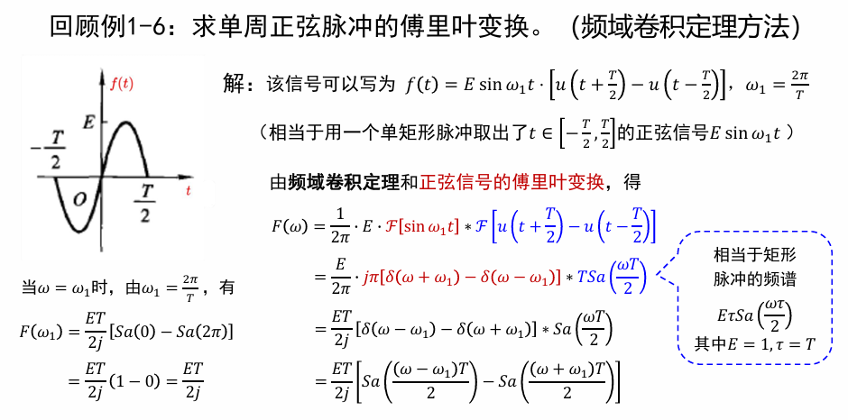

### 3、傅里叶变换的性质

|   性质   |                         时域 $f(t)$                          |                         频域 $F(ω)$                          | 时域频域对应关系 |
| :------: | :----------------------------------------------------------: | :----------------------------------------------------------: | :--------------: |
|   线性   | $$\sum_{i=1}^{n} a_{i} f_{i}(t)\\$$ |$\sum_{i=1}^{n} a_{i} F_{i}(\omega)\\$|线性叠加|
|  对称性  |                            $F(t)$                            |                     $$2\pi f(-\omega)$$                      |       对称       |
| 尺度变换 |                           $f(at)$                            |      $$\frac{1}{|a|} F\left(\frac{\omega}{a}\right)\\$$      |    压缩与扩展    |
|          |                           $f(-t)$                            |                           $F(-ω)$                            |       反褶       |
|   时移   |                         $f(t - t_0)$                         |               $$F(\omega) e^{-j\omega t_{0}}$$               | 时移与相移 |
|          |                        $f(at - t_0)$                         | $$\frac{1}{|a|} F\left(\frac{\omega}{a}\right) e^{-j\frac{\omega t_{0}}{a}}\\$$ |    时移与相移    |
|   频移   |                  $$f(t) e^{j\omega_{0} t}$$                  |                         $F(ω - ω_0)$                         | 调制与频移 |
|          |                        $f(t)cos(ω_t)$                        |   $$\frac{1}{2}[F(\omega+\omega_0)+F(\omega-\omega_0)]\\$$   |    调制与频移    |
|          |                       $f(t)sin(ω_0t)$                        |   $$\frac{j}{2}[F(\omega+\omega_0)-F(\omega-\omega_0)]\\$$   | 调制与频移 |
| 时域微分 |                   $$\frac{d f(t)}{d t}\\$$                   |                           $jωF(ω)$                           |                  |
|          |               $$\frac{d^{n} f(t)}{d t^{n}}\\$$               |                         $(jω)ⁿF(ω)$                          |                  |
| 频域微分 |                          $-jtf(t)$                           |              $$\frac{d F(\omega)}{d\omega}\\$$               |                  |
|          |                         $(-jt)ⁿf(t)$                         |          $$\frac{d^{n} F(\omega)}{d\omega^{n}}\\$$           |                  |
| 时域积分 |             $$\int_{-\infty}^{t} f(\tau) d\tau$$             | $$\frac{1}{j\omega} F(\omega) + \pi F(0) \delta(\omega)\\$$  |                  |
| 时域卷积 |                       $f_1(t) * f_2(t)$                       |                         $F_1(ω) F_2(ω)$                         |    乘积与卷积    |
| 频域卷积 |                         $f_1(t) f_2(t)$                         |   $$\frac{1}{2\pi} F_{1}(\omega) * F_{2}(\omega)\\$$    | 乘积与卷积 |
| 时域抽样 | $\sum_{n=-\infty}^{\infty} f(t) \delta(t-n T_{s})\\$ |$\frac{1}{T_{s}} \sum_{n=-\infty}^{\infty} F\left(\omega -\frac{2\pi n}{T_{s}}\right)\\$|抽样与重复|
| 频域抽样 | $\frac{1}{\omega_{s}} \sum_{n=-\infty}^{\infty} f\left(\omega -\frac{2\pi n}{\omega_{s}}\right)\\$ |$ \sum_{n=-\infty}^{\infty} F(\omega)\delta(\omega-n\omega_s)\\$|抽样与重复|
|   相关   |                           $R_{12}(τ)$                           |                        $F_1(ω) F_2^*(ω)$                        |                  |
|          |                           $R_{21}(τ)$                           |                        $F_1^*(ω) F_2(ω)$                        |                  |
|  自相关  |                            $R(τ)$                            | $|F(ω)|^2$ |              |

### 4、一般周期信号的傅里叶变换

- 一般周期信号

  - 傅里叶级数

  $$
  f(t)=\sum_{n=-\infty}^{\infty}F(n\omega_1)e^{jn\omega_1 t}
  $$

  - 傅里叶变换
    $$
    F(\omega)=\sum_{n=-\infty}^{\infty}2\pi F(n\omega_1)\delta(\omega-n\omega_1)
    $$
    其中：$F(n\omega_1)=F_n=\frac{1}{T_1}\int_{-\frac{T_1}2}^{\frac{T_1}2}f(t)e^{-jn\omega_1 t}dt\\$

  

例：已知周期矩形脉冲信号的傅里叶级数系数为 $F(n\omega_1)=\dfrac{E\tau}{T_1}\mathcal{Sa}(\dfrac{n\omega_1\tau}2)$

- 因此周期矩形脉冲信号的傅里叶变换为
  $$
  F(\omega)=\sum_{n=-\infty}^{\infty}2\pi F(n\omega_1)\delta(\omega-n\omega_1)=E\tau\omega_1\sum_{n=-\infty}^{\infty}\mathcal{Sa}(\dfrac{n\omega_1\tau}2)\delta(\omega-n\omega_1)
  $$
  

> - 周期信号的傅里叶变换（频谱密度函数）由无穷多个冲激函数组成
>
>   - 冲激位于信号的谐频 ( $0、±\omega_1、±2\omega_1, ...$ ) 处，强度等于 $f(t)$ 的傅里叶系数 $F_n$ 的 $2\pi$ 倍
>
> - 利用单脉冲信号的傅里叶变换式，可以方便地求出对应的周期信号傅里叶系数
>   $$
>   F_n=\frac1{T_1}F_0(\omega)\bigg|_{\omega=n\omega_1}
>   $$
>
>   - 例：已知单矩形脉冲信号频谱密度函数为 $F(\omega) = E \tau \text{Sa}\left( \frac{\omega \tau}{2} \right)\\$ 
>   
>     - 则周期矩形信号的傅里叶系数
>       $$
>       F_m=\frac1{T_1}F(\omega)\bigg|_{\omega=m\omega_1}=\frac{E \tau}{T_1} \text{Sa}\left( \frac{m\omega_1 \tau}{2} \right)
>       $$

