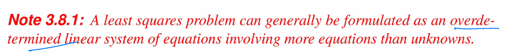
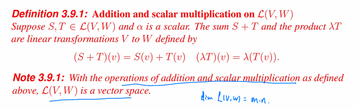

# Lec3 Linear Transformations

## 定义

## Null Space and Ranges

> ==零空间和值域==⭐⭐⭐

## Injective and Surjective

> ==单射==⭐⭐⭐

> ==满射==⭐⭐⭐

## Fundamental Theorem of Linear Transformations

> ==“必考之题”== ⭐⭐⭐⭐⭐

## Matrix Representation of Linear Transformations

> ==“矩阵表示也是必考之题啊”== ⭐⭐⭐⭐⭐

> ==矩阵表示定理== ⭐⭐⭐⭐⭐

## Equivalent Matrix and Similar Matrix

> “等价矩阵也讲了，大家都知道什么意思了是吧，同一个线性变换下，不同基向量的矩阵表示”
>
> “那么，我们要关注的肯定是相似矩阵”

> - ==“B old ，A new”==
> - ==“记住 S 后面是old就好记了吧”==
>
> 

## Projections and Least Squares Problem

> ==梅杰部分不考== ⭐⭐⭐⭐⭐
>
> ==”李老师那边肯定要考“== ⭐⭐⭐⭐⭐

> 最小二乘问题通常可以表述为一个超定线性方程组，其中方程的数量多于未知数的数量。

> V中向量沿着 W 投影到子空间 S

> 正交投影

> 最小二乘解

## Algebraic Operations on $\mathcal L(V,W)$

> ==“我们不考数值代数部分”== ⭐⭐⭐⭐⭐

## Invertibility and Isomprphic Vector Spaces

> ==“我们可能会简单地考一下”== ⭐⭐⭐⭐⭐
>
> ==“可逆的、可同构的，大家知道是啥意思就可以了”==
>
> 

## Products and Quotients of Vector Spaces

> ==不考！！== ⭐⭐⭐⭐⭐

