# 动态系统建模与分析

## 1、基本模型

### ① 电路系统

- 基尔霍夫定律

  - KCL
  - KVL

- 电容电压
  $$
  e_C=\frac{1}C\times q=\frac 1C\int _0^tidt
  $$

- 电感电压
  $$
  e_L=L\frac{di}{dt}
  $$
  

### ② 流体系统

- 基本元素

  - 不可压缩的均质流体：$\rho\ (kg/m^3)$ 为常数

  - 流量：$q\ (m^3/s)$

  - 体积：$v\ (m^3)$

  - 高度：$h \ (m)$

  - 表面积：$A\ (m^2)$

  - 压强：$P\ (N/m^2)$

    - 静压（由流体重力产生的压强）：$P_{Hydro}=\rho gh$
    - 绝对压强（大气压强+静压）：$P_{abs}=P_a+P_{Hydro}$ 
    - 表压（测量出来的压力）：$P_{gauge}=P_{abs}-P_a$

  - 流阻（与电阻相似）：$R$
    $$
    P_1-P_2=\rho q R\tag{1}
    $$

    - 理想压源：$P_2=P_1+P_s$

- 方程

  - 质量守恒
    $$
    \frac{dm}{dt}=\dot m_{in}-\dot m_{out}
    $$
    除以 $\rho$
    $$
    \frac {dV}{dt}=A\frac{dh}{dt}=q_{in}-q_{out}\tag{2}
    $$

    $$
    \frac{dh}{dt}=\frac{1}A(q_{in}-q_{out})\tag3
    $$

    - 再由 $P=P_a+\rho gh$ 得
      $$
      \frac{dP}{dt}=\frac{\rho g}{A}(q_{in}-q_{out})\tag4
      $$

## 2、Laplace 变换、传递函数、微分方程

### 卷积定义

- 线性时不变系统
- 单位冲激信号
- 求和->卷积

### Laplace 变换

- 定义

  - 公式
    $$
    \mathcal{L}[f(t)]=F(s)=\int_0^{\infty}f(t)e^{-st}dt
    $$

  - 图像

    - 时域

      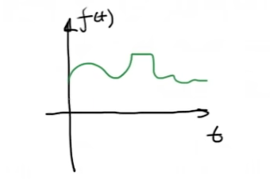

    - s域

      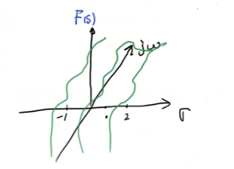

      - $s=\sigma+j\omega$

      - 二维图像（侧视）

        - 当 $\sigma=0$ 时，为傅里叶变换 $F(\omega)$   

        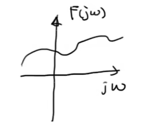

      - 极点、零点（俯视）

        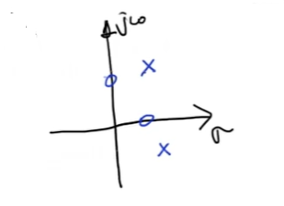

- 性质

  - 线性
    $$
    \mathcal{L}[{af(t)+bg(t)}]=aF(s)+bG(s)
    $$

  - 求导、积分
    $$
    \mathcal{L}[f'(t)]=sF(s)-f(0)
    $$

  - 卷积
    $$
    \mathcal{L}[{f(t)*g(t)}]=F(s)G(s)
    $$

- 常用变换对

  - 指数
    $$
    \mathcal{L}[e^{-at}]=\frac{1}{s+a}
    $$

  - 三角
    $$
    \mathcal{L}[\sin{(t)}]=\frac{a}{s^2+a^2}
    $$

- Laplace变换、微分方程、传递函数

  - 微分方程

  $$
  e'=Li^{''}+Ri'+\frac1Ci
  $$

  - Laplace变换（初值均设为 $0$）
    $$
    sE(s)=Ls^2I(s)+RsI(s)+\frac1CI(s)
    $$

    - 化简
      $$
      I(s)=\frac{s}{Ls^2+Rs+\frac1C}E(s)
      $$

  - 传递函数TF
    $$
    H(s)=\frac{s}{Ls^2+Rs+\frac1C}
    $$

- 收敛域 $ROC$ (Region of Convergence)

  - eg. $f(t)=e^{-at}、s=\sigma+j\omega$
    $$
    \int^{\infty}_0e^{-at}e^{-(\sigma+j\omega)t}dt=\int_0^{\infty}e^{-(a+\sigma)t}e^{-j\omega t}dt
    $$

    - 其中 $e^{-j\omega t}$ 为半径为 $1$ 的圆，幅值为 $1$ ，对收敛情况无影响，只会引起振动

    - 故收敛于只看前一部分，即 $\sigma=Re(s)>-a$

      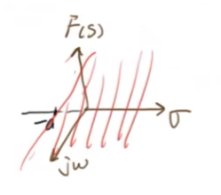

- 逆变换

  - 因式分解法

    -  eg1. 
      $$
      F(s)=\frac{-s+5}{s^2+5s+4}=\frac{-3}{s+4}+\frac{2}{s+1}\\
      f(t)=\mathcal{L^{-1}}[F(s)]=-3e^{-4t}+2e^{-t}
      $$

      - 极点（Poles）：$s_1=-4、s_2=-1$

    - eg2.
      $$
      F(s)=\frac{4s+8}{s^2+2s+5}=\frac{i+2}{s+1+2i}+\frac{-i+2}{s+1-2i}\\
      f(t)=\mathcal{L^{-1}}[F(s)]=(i+2)e^{-(-1-2i)t}+(-i+2)e^{-(-1+2i)t}
      $$

      - 极点：$s_1=-1-2i、s_2=-1+2i$

      - 化简
        $$
        f(t)=e^{-t}(2\sin2t+4\cos2t)
        $$

    - 可见：微分方程的解与极点密切相关，可配置极点获得期望输出

- 用法

  - 非线性系统
    - 在平衡点附近线性化
    - 直接使用非线性分析
  -  线性时不变系统 LTI
    1. 从时域转换到 $s$ 域
    2. 求解代数方程
    3. 从 $s$ 域转换回时域

## 3、一阶系统的单位阶跃响应

- 单位阶跃函数（unit step)
  $$
  u(t)=
  \begin{cases}
  0\ \ \ \ t=0\\
  1\ \ \ \ t>0
  \end{cases}
  $$

  - Laplace 变换
    $$
    \mathcal{L}[u(t)]=\frac1s
    $$

  - 单位阶跃响应

- 时间常数 $\tau$ （Time Constant）

  - 达到最终稳定状态的 $63\%$ 的时间
  - 稳定时间、整定时间 （Settling Time）：$T_{ss}=4\tau$
    - 达到最终稳定状态的 $98\%$ 的时间

- 系统识别（step test）

  - 步骤

    1. 列写表达式
       $$
       X(t)=\frac{CR}g(1-e^{-\frac gRt})
       $$

    2. 画出图像，找到稳定时间

       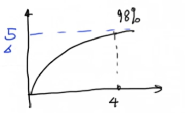

    3. 计算参数
       $$
       4\tau=4\times \frac Rg=4\\
       \frac{CR}g=5
       $$

  - 低通滤波器（有积累的，对高速变化不敏感）
    $$
    TF:\frac{a}{s+a}
    $$
    

## 4、频率响应与滤波器

- 对于一个线性时不变系统 LTI，输入与输出的频率相等

$$
input=M_i\sin(\omega t +\phi_i)\\
output=M_o\sin(\omega t+\phi_o)
$$

- 振幅响应（Magnitude Response）

$$
M=\frac{M_o}{M_i}
$$

- 幅角响应（Phase Response）

$$
\phi=\phi_o-\phi_i
$$

### 推导

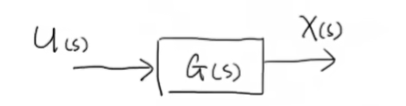

- 输入函数
  $$
  \begin{aligned}
  u(t)&=A\sin(\omega t)+B\cos(\omega t)\\
  &=\sqrt{A^2+B^2}\sin(\omega t +\phi_i)
  \end{aligned}
  $$

  - 其中：$\phi_i=\arccos(\frac{A}{\sqrt{A^2+B^2}})\\$

  - Laplace 变换
    $$
    U(s)=\mathcal{L}[u(t)]=\frac{A\omega}{s^2+\omega^2}+\frac{Bs}{s^2+\omega^2}=\frac{A\omega+Bs}{(s+j\omega)(s-j\omega)}
    $$

- 传递函数 TF
  $$
  G(s)=\frac{D(s)}{N(s)}=\frac{D(s)}{(s-p_1)(s-p_2)\cdots(s-p_n)}
  $$

  - 其中：$p_1、p_2、\cdots、p_n$ 是极点 poles

- 响应函数
  $$
  \begin{aligned}
  X(s)=U(s)G(s)
  &=\frac{A\omega+Bs}{(s+j\omega)(s-j\omega)}\times\frac{D(s)}{(s-p_1)(s-p_2)\cdots(s-p_n)}\\
  &=\frac{k_1}{s+j\omega}+\frac{k_2}{s-j\omega}+\frac{C_1}{s-p_1}+\frac{C_2}{s-p_2}+\cdots+\frac{C_n}{s-p_n}\\
  &=\frac{k_1(s-j\omega)N(s)+k_2(s+j\omega)N(s)+C_1(s+j\omega)(s-j\omega)\frac{N(s)}{s-p_1}+\cdots}{(s+j\omega)(s-j\omega)(s-P_1)(s-p_2)\cdots(s-p_n)}
  \end{aligned}
  $$

  - Laplace 逆变换
    $$
    x(t)=\mathcal{L^{-1}}[X(s)]=k_1e^{-j\omega t}+k_2e^{j\omega t}+C_1e^{p_1t}+C_2e^{p_2t}+\cdots+C_ne^{p_nt}
    $$

    - 对于稳定系统而言：$p_1、p_2、\cdots 、p_n$ 的实部都小于 $0$

    - 即：在稳态（steady state）下
      $$
      x_{ss}(t)=k_1e^{-j\omega t }+k_2e^{j\omega t}
      $$

      - 其它分量均衰减为 $0$
      - 故问题简化为求 $k_1、k_2$

- 求解：
  $$
  k_1(s-j\omega)N(s)+k_2(s+j\omega)N(s)+C_1(s+j\omega)(s-j\omega)\frac{N(s)}{s-p_1}+\cdots=(A\omega+Bs)D(s)
  $$

  1. let  $s=-j\omega$
     $$
     k_1(s-j\omega)N(-j\omega)=(A\omega-Bj\omega)D(-j\omega)\\\\
     k_1=\frac{A\omega-Bj\omega}{-2j\omega}\frac{D(-j\omega)}{N(-j\omega)}=\frac{B+Aj}{2}G(-j\omega)
     $$

  2. let $s=j\omega$
     $$
     k_2=\frac{B-Aj}2G(j\omega)
     $$

  3. 复数表达变换

     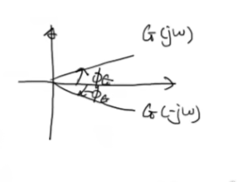

     - 分式线性映射的保对称性
       $$
       |G(j\omega)|=|G(-j\omega)|
       $$

     - 化简
       $$
       \begin{aligned}
       x_{ss}(t)
       &=\frac{B+Aj}2|G(-j\omega)|e^{-j\phi_G}e^{-j\omega t}+\frac{B-Aj}2|G(j\omega)|e^{j\phi_G}e^{j\omega t}\\
       &=\frac12|G(j\omega)|[(B+Aj)e^{-(\phi_G+\omega t)j}+(B-Aj)e^{(\phi_G+\omega t)j}]\\
       &=|G(j\omega)|[B\cos(\phi_G+\omega t)+A\sin(\phi_G+\omega t)]\\
       &=|G(j\omega)|\sqrt{A^2+B^2}[\frac{B}{\sqrt{A^2+B^2}}\cos(\phi_G+\omega t)+\frac{A}{\sqrt{A^2+B^2}}\sin(\phi_G+\omega t)]\\
       &=|G(j\omega)|M_i\sin(\omega t+\phi_i+\phi_G)
       \end{aligned}
       $$

  - 结果 :star:
    $$
    x_{ss}(t)==|G(j\omega)|M_i\sin(\omega t+\phi_i+\phi_G)
    $$

    - 振幅响应
      $$
      M=|G(j\omega)|
      $$

    - 幅角响应
      $$
      \phi_G=\angle{G(j\omega)}
      $$

## 5、一阶系统的频率响应

- 传递函数
  $$
  G(s)=\frac{a}{s+a}
  $$

- let $s=j\omega$
  $$
  G(j\omega)=\frac{a}{a+j\omega}=\frac{a^2}{a^2+\omega^2}+(-\frac{a\omega}{a^2+\omega^2})j
  $$

- 幅角响应
  $$
  \phi_G=-\arctan(\frac{\omega}a)
  $$
  

- 振幅响应
  $$
  |G(j\omega)|=\sqrt{\frac1{1+(\frac{\omega}a)^2}}
  $$
  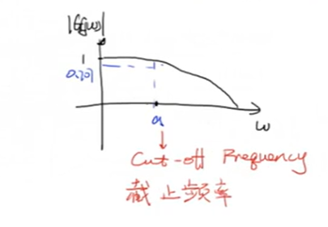

  - 特点

    - 当 $\omega\ll a$ 时 ：$|G(j\omega)| \rarr 1$ 
      - 当 $\omega \uarr$，$|G(j\omega)|\darr$
    - 当 $\omega =a$：$|G(j\omega)|=0.707$ （截止频率 cut-off frequency）
    - 当 $\omega\gg a$：$|G(j\omega)|\rarr0$

- 低通滤波器

  - 不反映高频变化

  - 通常在系统中存在一个容器（积分）

    - 积分的 Laplace变换就是 $\frac 1s\\$​
      $$
      \int_0^tf(\tau)d\tau=\frac1sF(s)
      $$

    - 提供了一个缓冲机制，给系统的响应带来延迟，从而抵消了高频变化的影响

  - 高通滤波器的 TF：$\frac s{s+a}\\$

- 伯德图 Bode Plot：把纵坐标改为 $20\log|G(j\omega)|$，单位为 dB

  - $1$ 变为 $0$
  - $0.707$ 变为 $-3$

## 6、二阶系统的动态响应

### 引入：质量弹簧阻尼系统

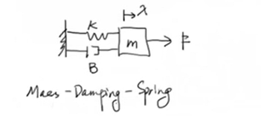

- 受力分析

  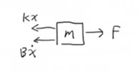
  $$
  m\ddot x=F-B\dot x-k x
  $$

  - 改写（令外力 $F=0$ ，以研究系统对初始条件的反应 Response to Initial Condition）
    $$
    \ddot x+2\zeta\omega_n\dot x+\omega_n^2x=0
    $$

    - 其中：

      - 固有频率（Natural Frequency）：$\omega_n=\sqrt{\frac km}\\$
      - 阻尼比（Damping Ratio）：$\zeta=\frac{B}{2\sqrt{km}}\\$

      > 解释：[二阶系统微分方程的标准形式为什么是那个鬼样子？ - 知乎](https://zhuanlan.zhihu.com/p/168654999)
      >
      > - 表现系统的固有频率大小以及是否振荡

    - 初值条件：
      $$
      \begin{cases}
      F=0\\
      x(0)=x_0\\
      \dot x(0)=\dot x_0
      \end{cases}
      $$

    - 仿真平台形式
      $$
      \begin{cases}
      \ddot x=-2\zeta\omega_n\dot x-\omega_n^2x\\
      x(0)=x_0\\
      \dot x(0)=\dot x_0
      \end{cases}
      $$

- 解（齐次方程）

  > 特征方程
  > $$
  > \lambda^2+2\zeta\omega_n\lambda+\omega_n^2=0
  > $$
  > 解得：
  > $$
  > \begin{cases}
  > \lambda_1=-\zeta\omega_n+\omega_n\sqrt{\zeta^2-1}\\
  > \lambda_2=-\zeta\omega_n-\omega_n\sqrt{\zeta^2-1}
  > \end{cases}
  > $$

  - 解的形式

  $$
  x(t)=C_1e^{\lambda_1t}+C_2e^{\lambda_2t}
  $$

  - 分类讨论

  1. $\zeta>1$：过阻尼系统（Over damped）

     - $\lambda_2<\lambda_1<0$
     - $C_1e^{\lambda_1t}$ 收敛速度较小，$C_2e^{\lambda_2t}$ 收敛速度较大

     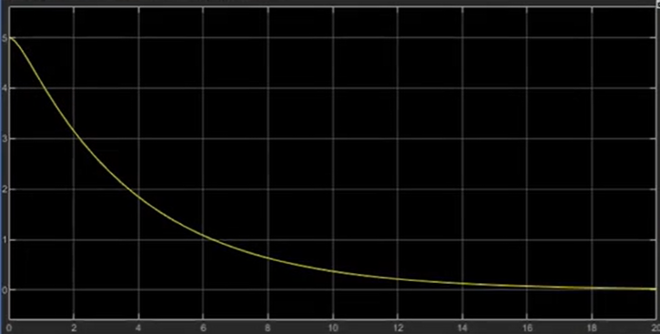

  2. $\zeta=1$：临界阻尼系统（Critical damped）

     - $\lambda_1=\lambda_2=-\omega_n$
     - $x(t)=(C_1+C_2)e^{\lambda t}$，收敛速度比过阻尼系统快

     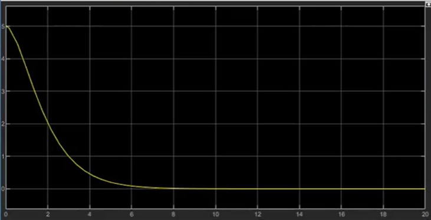

  3. $0<\zeta<1$：欠阻尼系统（Undder damped）

     - $\lambda_1=-\zeta\omega_n+i\ \omega_n\sqrt{1-\zeta^2}、\lambda_2=-\zeta\omega_n-i\ \omega_n\sqrt{1-\zeta^2}$：共轭复根

     - $x(t)=e^{-\zeta\omega_nt}\Big[C_1\cos(\omega_n\sqrt{1-\zeta^2}t)+C_2\sin(\sqrt{1-\zeta^2}t)\Big]$

       - 阻尼固有频率（Damped Natural Frequency）：$\omega_d=\omega_n\sqrt{1-\zeta^2}$

       $$
       x(t)=e^{-\zeta\omega_nt}\sqrt{C_1+C_2}\sin(\omega_dt+\phi)
       $$

       - 其中：$\phi=\arctan{\frac{C_1}{C_2}}\\$
       - 图像为衰减且振荡，周期为 $\frac{2\pi}{\omega_d}\\$

     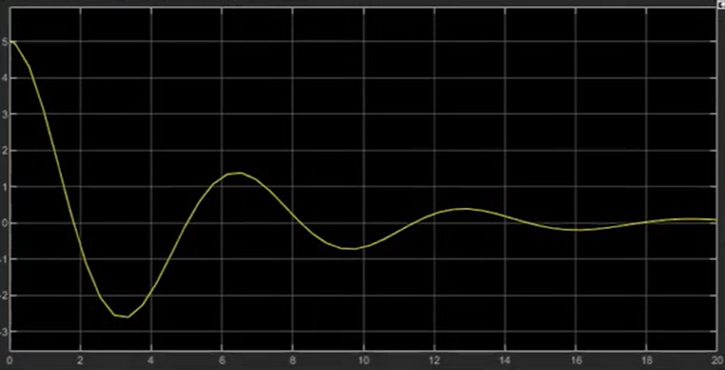

  4. $\zeta=0$：无阻尼自由振动

     - $x(t)=\sqrt{C_1+C_2}\sin(\omega_nt+\phi)$

     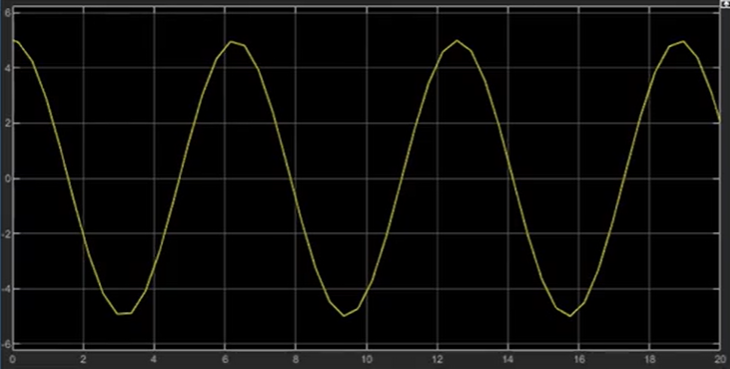

  5. 其它不稳定、发散的情况

  

###  二阶系统的单位阶跃响应

$$
\ddot x +2\zeta\omega_n\dot x+\omega_n^2x=\omega_n^2u(t )
$$

- 其中：

  - 输入 Input：$u(t)=\frac F{\omega_n^2}\\$ （单位化）
  - 输出 Output：$x(t)$

- Laplace 变换
  $$
  s^2X(s)+2\zeta\omega_nsX(s)+\omega_n^2X(s)=\omega_n^2U(s)
  $$

  - TF ：
    $$
    H(s)=\frac{X(s)}{U(s)}=\frac{\omega_n^2}{s^2+2\zeta\omega_ns+\omega_n^2}
    $$

  - 输出：
    $$
    X(s)=\frac 1s\times\frac{\omega_n^2}{s^2+2\zeta\omega_ns+\omega_n^2}
    $$

    - 欠阻尼情况的解

    $$
    x(t)=1-\frac{e^{-\zeta\omega_nt}}{\sqrt{1-\zeta^2}}\sin(\omega_dt+\phi)
    $$

> 求解：
>
> 1. 寻找极点（Find Poles）
>    $$
>    \begin{cases}
>    p_1=0\\
>    p_2=-\zeta\omega_n+\omega_n\sqrt{\zeta^2-1}\\
>    p_3=-\zeta\omega_n-\omega_n\sqrt{\zeta^2-1}
>    \end{cases}
>    $$
>
>    - 在欠阻尼情况下
>      $$
>      \begin{cases}
>      p_1=0\\
>      p_2=-\zeta\omega_n+i\ \omega_n\sqrt{1-\zeta^2}\\
>      p_3=-\zeta\omega_n-i\ \omega_n\sqrt{1-\zeta^2}
>      \end{cases}
>      $$
>
> 2. 求解
>    $$
>    X(s)=\frac A{s-p_1}+\frac B{s-p_2}+\frac C{s-p_3}
>    $$
>
>    $$
>    A(s-p_2)(s-p_3)+B(s-p_1)(s-p_3)+C(s-p_1)(s-p_2)=\omega_n^2
>    $$
>
>    - 令 $s=p_1$
>      $$
>      A=\frac{\omega_n^2}{(p_1-p_2)(p_1-p_3)}=1
>      $$
>
>    - 令 $s=p_2$
>      $$
>      B=\frac{\omega_n^2}{(p_2-p_1)(p_2-p_3)}=-\frac{1}{2}\Big[1-\frac{\ \zeta}{\sqrt{1-\zeta^2}}\ i\Big]
>      $$
>
>    - 令 $s=p_3$
>      $$
>      C=\frac{\omega_n^2}{(p_3-p_1)(p_3-p_2)}=-\frac{1}{2}\Big[1+\frac{\ \zeta}{\sqrt{1-\zeta^2}}\ i\Big]
>      $$
>
>    - 解得
>      $$
>      X(s)=\frac 1s-\frac{1}{2}\Big[1-\frac{\ \zeta}{\sqrt{1-\zeta^2}}\ i\Big]\frac1{s-p_2}-\frac{1}{2}\Big[1+\frac{\ \zeta}{\sqrt{1-\zeta^2}}\ i\Big]\frac1{s-p_3}
>      $$
>
> 3. Laplace 逆变换
>    $$
>    \begin{aligned}
>    x(t)&=1-\frac{1}{2}\Big[1-\frac{\ \zeta}{\sqrt{1-\zeta^2}}\ i\Big]e^{(-\zeta\omega_n+i\ \omega_n\sqrt{1-\zeta^2})t}-\frac{1}{2}\Big[1+\frac{\ \zeta}{\sqrt{1-\zeta^2}}\ i\Big]e^{(-\zeta\omega_n-i\ \omega_n\sqrt{1-\zeta^2})t}\\
>    &=1-e^{-\zeta\omega_nt}\Big[\frac12(e^{i\omega_dt}+e^{-i\omega_dt})+\frac12\frac{\zeta}{\sqrt{1-\zeta^2}}i(-e^{i\omega_dt}+e^{-i\omega_dt})  \Big]\\
>    &=1-e^{-\zeta\omega_nt}\Big[\cos(\omega_dt)+\frac{\zeta}{\sqrt{1-\zeta^2}}\sin(\omega_dt)\Big]\\
>    &=1-\frac{e^{-\zeta\omega_nt}}{\sqrt{1-\zeta^2}}\sin(\omega_dt+\phi)
>    \end{aligned}
>    $$
>
> 4. 绘制图像
>
>    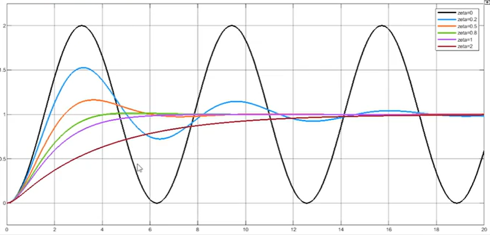

### 分析指标与方法

- 单位阶跃响应的欠阻尼情况
  $$
  x(t)=1-\frac{e^{-\zeta\omega_nt}}{\sqrt{1-\zeta^2}}\sin(\omega_dt+\phi)
  $$
  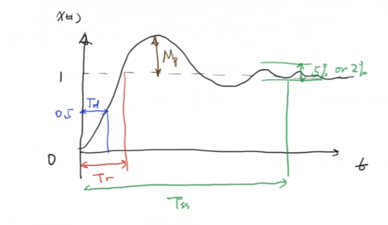

  1. 延迟时间 $T_d$ （Delay time）：系统达到稳态 $50\%$ 时的时间
  2. 上升时间 $T_r$ （Rise time）：系统第一次达到稳定点 $100\%$ 的时间
  3. 最大超调量 $M_p$ （Max Overshoot）：$(x_p-1)\times100\%$
  4. 调节时间 $T_{ss}$ （Settling time）：系统到达稳态误差范围内的时间

  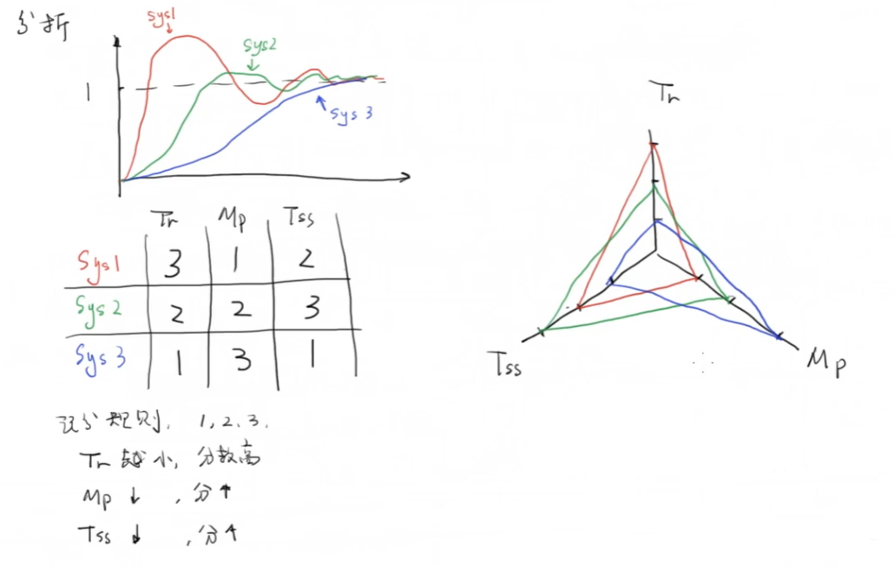

## 7、二阶系统的频率响应

对于一个典型的二阶系统，传递函数
$$
G(s)=\frac{\omega_n^2}{s^2+2\zeta\omega_ns+\omega_n^2}
$$

- 幅值响应 $|G(j\omega)|$
  $$
  |G(j\omega)|=\frac{1}{\sqrt{(1-\Omega^2)^2+4\zeta^2\Omega^2}}
  $$

  > $$
  > G(j\omega)=\frac{1}{-\frac{\omega^2}{\omega_n^2}+2\zeta\frac{\omega}{\omega_n}j+1}
  > $$
  >
  > - 令 $\frac{\omega}{\omega_n}=\Omega\\$
  >   $$
  >   G(j\omega)=\frac{1}{-\Omega^2+2\zeta\Omega j+1}=\frac{1-\Omega^2}{(1-\Omega^2)^2+4\zeta^2\Omega^2}-\frac{2\zeta\Omega j}{(1-\Omega^2)^2+4\zeta^2\Omega^2}
  >   $$
  >
  > - 求模
  >   $$
  >   |G(j\omega)|=\frac{1}{\sqrt{(1-\Omega^2)^2+4\zeta^2\Omega^2}}
  >   $$

  - 分析
    1. $\Omega=0$ ：$|G(j\omega)|=1$
    2. $\Omega\rarr\infty$ ：$|G(j\omega)|\rarr0$ （低通滤波器）
    3. $\Omega=1$ ：$|G(j\omega)|=\frac1{2\zeta}\\$
       1. $\zeta<0.5$ ：$|G(j\omega)|>1$ 
       2. $\zeta>0.5$ ：$|G(j\omega)|<1$ 
    
    - 说明当 $\zeta$ 较小的时候，存在一个最高极值点
      $$
      \begin{aligned}
      \frac{d((1-\Omega^2)^2+4\zeta^2\Omega^2)}{d\Omega}
      &=-4\Omega(1-\Omega^2)+8\zeta^2\Omega\\
      &=4\Omega(\Omega^2+2\zeta^2-1)\\
      &=0
      \end{aligned}
      $$
    
      $$
      \Omega=\sqrt{1-2\zeta^2}
      $$
    
      - 即当 $1-2\zeta^2>0$ 时存在极值
      - 共振频率（Resonant Frequency）：$\omega=\omega_n\sqrt{1-2\zeta^2}$ 
      - 此时 $|G(j\omega)|=\frac1{2\zeta\sqrt{1-\zeta^2}}\\$
    
    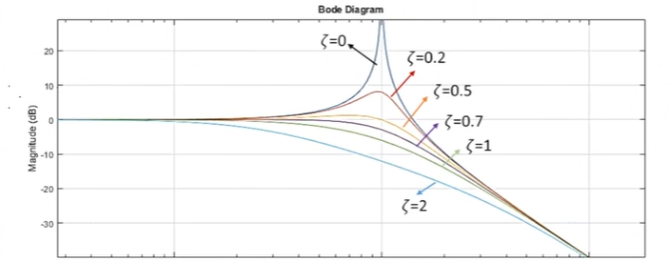

## 8、伯德图 Bode Plot

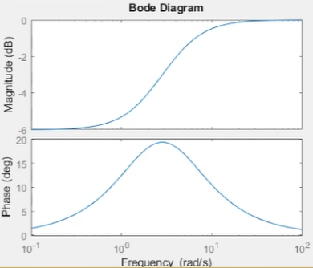

### 分贝 dB（decibel）

- 初始：用于描述电话/电报的信号损失
  $$
  dB=10\log_{10}\frac{P_M}{P_R}
  $$

  - $P_M$：测量能量
  - $P_R$：参考能量

  用于简化数量级

- $20\lg$ 的由来

  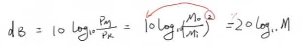

### 系统举例

-  积分系统

  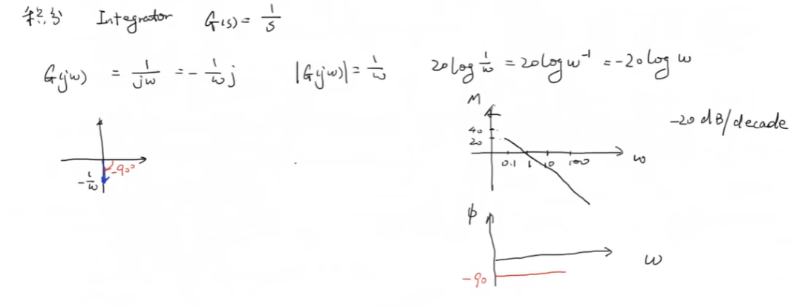

- 一阶系统 

  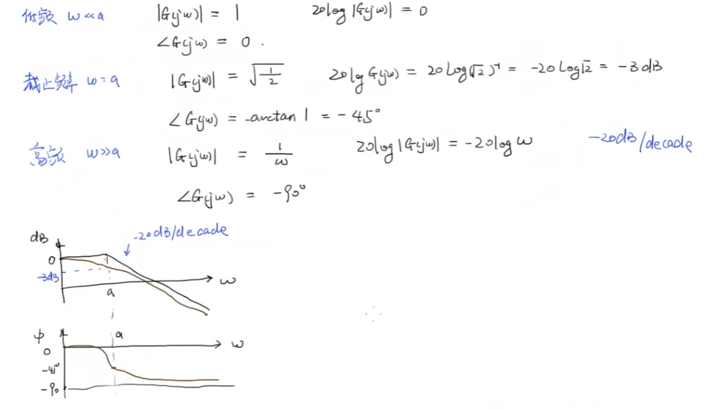

### 应用

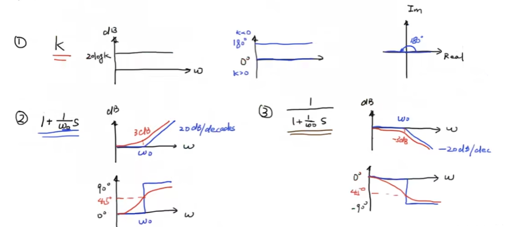

- 叠加：

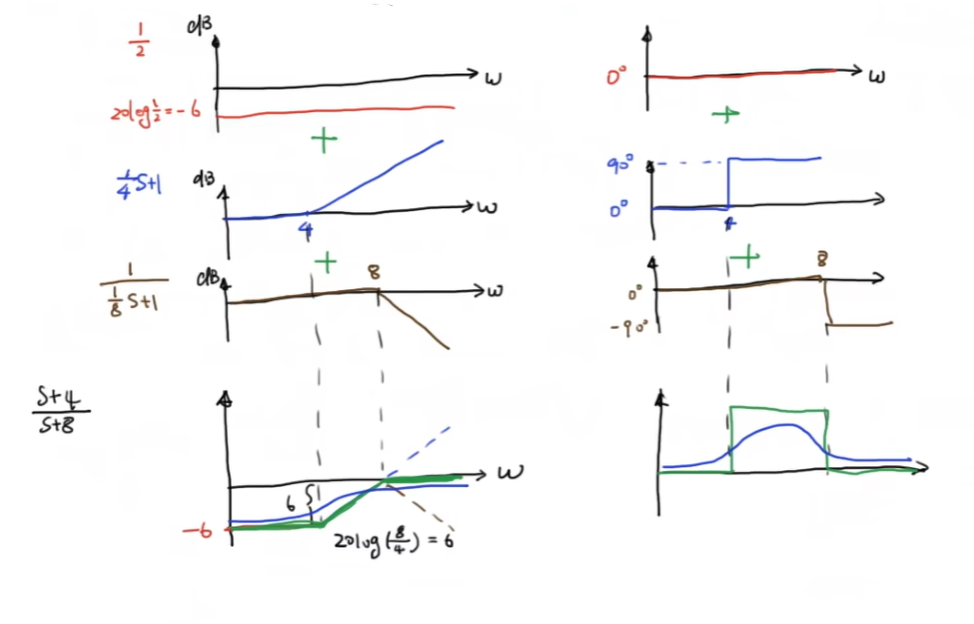

