# 自控知识点

## 绪论概念

### 经典控制理论

> 建立在频率法和根轨迹法上的理论，通常称为经典控制理论 (`Classic Control`)

- 一个函数 —— 传递函数
- 两种方法 —— 频率响应法，根轨迹法；
- 局限性：
  1. 限于线性定常系统 (`Linear time-invariant  system`)
  2. 限于标量系统或单回路反馈系统——单输入单 输出(`SISO`)系统

### 控制系统

- 基本形式：开环、闭环
- 基本构成：(控制)对象、输出量、输入量、控制器、检测环节、比较环节、扰动

- 基本要求：稳定性、准确性、快速性

## 控制系统的数学模型

### Laplace 变换

#### 重要变换对

> $$
> u(t)\qquad\qquad&\implies&\qquad\qquad\frac 1s\\
> \delta(t)\qquad\qquad&\implies&\qquad\qquad 1\\
> e^{-at}\qquad\qquad&\implies&\qquad\qquad\frac 1{s+a}\\
> \sin\omega t\qquad\qquad&\implies&\qquad\qquad\frac {\omega}{s^2+\omega^2}\\
> \cos\omega t\qquad\qquad&\implies&\qquad\qquad\frac {s}{s^2+\omega^2}\\
> t^n \qquad\qquad&\implies&\qquad\qquad\frac {n!}{s^{n+1}}\\
> $$

#### 重要性质

==时移性质==

> $$
> \mathcal L[f(t-t_0)]=e^{-st_0}F(s)\\
> $$

==频移性质==

> $$
> \mathcal L[e^{-at}f(t)]=F(s+a)\\
> $$

==时域放缩性质==

> $$
> \mathcal L[f(at)]=\frac1aF(\frac sa)\\
> $$

==微分性质 ⭐== 

> $$
> \mathcal L[\frac d{dt}f(t)]=sF(s)-f(0^-)\\
> \mathcal L[\frac {d^n}{dt^n}f(t)]=s^nF(s)-s^{n-1}f(0^-)-s^{n-2}f^{(1)}(0^-)-\cdots-f^{(n-1)}(0^-)\\
> \mathcal L[tf(t)]=-\frac d{ds}F(s)\\
> $$

==积分性质==

> $$
> \mathcal L\bigg[\int_0^tf(\xi)d\xi\bigg]=\dfrac{F(s)}s\\
> $$

==卷积性质 ⭐==

> $$
> \mathcal L[f_1(t)*f_2(t)]=F_1(s)F_2(s)\\
> \mathcal L[f_1(t)f_2(t)]=\frac 1{2\pi j}F_1(s)*F_2(s)\\
> $$

==初值、终值定理==

> $$
> \lim_{t\rarr0^+}y(t)=\lim_{s\rarr\infty}sF(s)\\
> \lim_{t\rarr\infty}y(t)=\lim_{s\rarr0}sF(s)
> $$

### 典型环节

==惯性环节==

> $$
> G(s)=\frac {1}{Ts+1}
> $$
> 在有反馈环节时，$H(s)=1\qquad G(s)=\dfrac 1{Ts}$

==积分环节==

> $$
> G(s)=\frac {1}{Ts}
> $$

==振荡环节==

> $$
> G(s)=\frac {\omega_n^2}{s^2+2\zeta\omega_ns+\omega_n^2}
> $$
>
> - 其中：$\zeta\in(0,1)$ 为阻尼比，$\omega_n=\dfrac1T$ 为无阻尼振荡频率，$\omega_d=\omega_n\sqrt{1-\zeta^2}$

==微分环节==

> $$
> G(s)=T_ds
> $$
>
> 不是真有理分式难以实现，工程上采用具有惯性环节的微分环节
> $$
> G(s)=\frac {T_1s}{T_2s+1}
> $$

==比例环节==

> $$
> G(s)=K_p
> $$

==时滞 / 延迟环节==

> $$
> G(s)=e^{-\tau s}
> $$

### 方框图

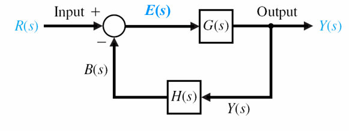

#### 传递函数

==闭环传递函数==

> $$
> \Phi(s)=\frac{Y(s)}{R(s)}=\frac{G(s)}{1+G(s)H(s)}
> $$

==前向传递函数==

> $$
> \frac{Y(s)}{E(s)}=G(s)
> $$

==开环传递函数==

> $$
> \frac{B(s)}{E(s)}=G(s)H(s)
> $$

#### 基本变换

==串联方框==

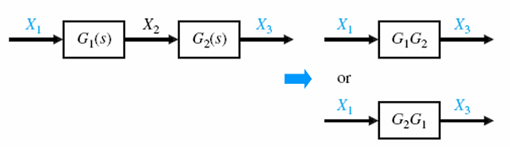

==并联方框==

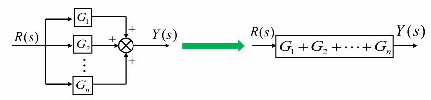

==消去反馈回路==

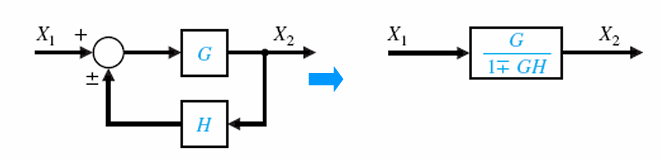

==相加点后移 ⭐== 

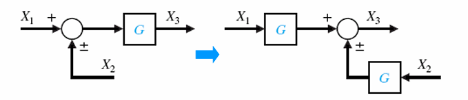

==相加点前移 ⭐==

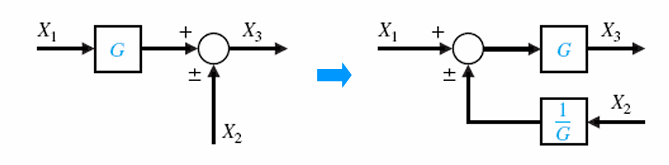

==分支点后移 ⭐==

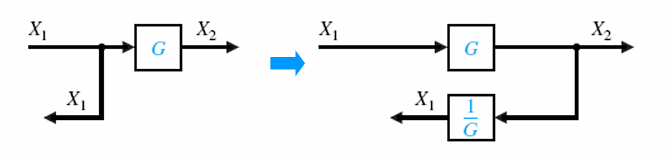

==分支点前移 ⭐==

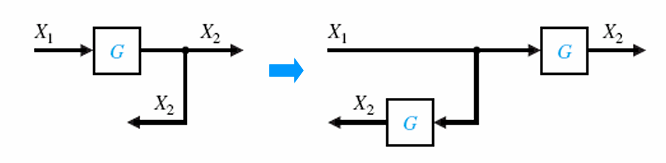

==相邻相加点之间的移动 ⭐==

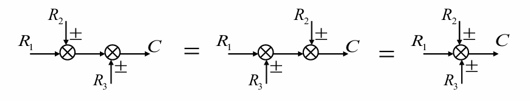

==相加点与分支点交换位置==

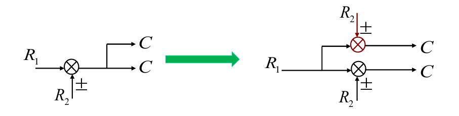

### 信号流图

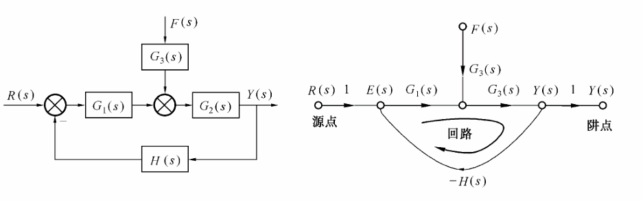

> 输入节点（源点）、输出节点（阱点）、混合节点
>
> 通路、==前向通路==、回路、==不接触回路==
>
> 回路/通路增益
>
> - 前向通路：当信号从输入节点至输出节点传递时，每个节点只通过1次的通路
> - 不接触回路：之间没有公共节点的回路

> ⭐ **重点信号用 $1$ 引出，正反馈乘 $1$ 引入，负反馈乘 $-1$ 引入** 
>
> ⭐ 不能随意合并节点，如：相加点、分支点都对应着节点，当多个相相加点、分支点相连时，应当用 $1$ 连接
>
> 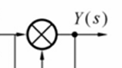
>
> 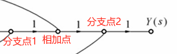

#### 梅森公式 ==重要==

> $$
> P=\frac 1\Delta\sum_{k=1}^nP_k\Delta_k\\
> \text{系统传递函数 = 信号流图的输入输出节点间总传输增益}
> $$
>
> - $P$ 总增益
>
> - $P_k$ 第 $k$ 条前向通路的通路增益
>
> - $\Delta$ 信号流图特征式
> $$
>   \Delta=1-\sum_aL_a+\sum_{bc}L_bL_c-\sum_{def}L_dL_eL_f+\cdots
> $$
> 
>   - $\sum_aL_a$ 所有回路增益之和
>  - $\sum_{bc}L_bL_c$ 每两个互不接触回路增益乘积之和
>   - $\sum_{def}L_dL_eL_f$ 每三个互不接触回路增益乘积之和
>   - $\Delta_k$ 在 $\Delta$ 中除去与第 $k$ 条前向通路相接触的（有共同节点）回路后的特征式，称为第 $k$ 条前向通路特征式的余因子
>     - 当前向通路接触所有的回路时，$\Delta_i=1$
>     - 当前向通路不接触所有的回路时，$\Delta_i=\Delta$

> 步骤：⭐⭐
>
> - 列出所有回路：$L_i$
>
> - 计算两两互不相连的回路、三个互不相连的回路、……
>
> - 写出信号流图特征式：$\Delta$
>
> - 列出所有前向通路：$P_j$，同时求解 $j$ 个前向通路特征式的余因子：$\Delta_j$
>
>   - 防止记漏法
>     $$
>     P=G_1
>     \begin{cases}
>     G_7G_4
>     \begin{cases}
>     G_5\\
>     G_9
>     \end{cases}
>     G_6\\
>     G_2
>     \begin{cases}
>     G_3G_4
>     \begin{cases}
>     G_5\\G_9
>     \end{cases}
>     G_8\\G_8
>     \end{cases}
>     \end{cases}
>     $$
>
> - 代入公式求解：$P$

## 控制系统的时域分析

### 典型输入信号

> - 阶跃
>   $$
>   r(t)=A\qquad t\geq0\\
>   R(s)=\frac As
>   $$
>
> - 斜坡
>   $$
>   r(t)=At\qquad t\geq0\\
>   R(s)=\frac A{s^2}
>   $$
>
> - 抛物线
>   $$
>   r(t)=\frac A2t^2\qquad t\geq0\\
>   R(s)=\frac A{s^3}
>   $$
>
> - 单位脉冲
>   $$
>   R(s)=1
>   $$

### 动态性能指标

==延迟时间 $T_d$==

> 系统响应从 $0$ 上升到稳态值的 $50\%$ 所需要的时间

==上升时间 $T_r$==

> - **<u>有振荡系统：系统响应从 $0$ 上升到稳态值所需时间</u>**
> - 无振荡系统：系统响应从 $10\%$ 上升到稳态值的 $90\%$ 所需要的时间

==峰值时间 $T_p$==

> 系统响应达到最大峰值所需要的时间

==（最大）超调量 $\sigma$==

> 系统响应超出稳态值的最大偏离量(常以百分比表示)
> $$
> \sigma\%=\frac{y(T_p)-y(\infty)}{y(\infty)}\times100\%
> $$
> 

==调节时间 $T_s$==

> 系统响应与稳态值之差达到并维持误差 $\pm\delta$ 所需要的最小时间
> $$
> |y(t)-y(\infty)|\leq y(\infty)\delta\qquad t\geq T_s
> $$
> 

==振荡次数 $N$==

> 调节时间 $T_s$ 内，$y(t)$ 偏离 $y(∞)$ 的振荡次数

### 一阶系统时域分析

$$
Y(s)=R(s)G(s)=\frac1s\cdot\frac1{Ts+1}=\frac1s-\frac1{s+\dfrac1T}
$$

$$
y(t)=1-e^{-\frac tT}\\
e(t)=1-y(t)=e^{-\frac{t}T}
$$

> - 系统输出初值为 $0$，终值为 $1$，单调连续上升
> - 稳态误差为 $0$
> - **在 $t=0$ 处斜率最大，为 $\dfrac 1T$**  ⭐
> - 当 $t=T$ 时，相应上升到稳态值的 $63.2\%$ ，要提高相应的快速性，可减小时间常数 $T$

==延迟时间 $T_d$ ⭐==

> $$
> y(t)\bigg|_{t=T_d}=1-e^{-\frac{T_d}T}=0.5 \implies T_d=0.69T
> $$

==上升时间 $T_r$ ⭐==

> $$
> \begin{cases}
> y(t_{0.1})=1-e^{-\frac{t_{0.1}}T}=0.1\implies t_{0.1}=0.105T\\
> y(t_{0.9})=1-e^{-\frac{t_{0.9}}T}=0.9\implies t_{0.9}=2.303T\\
> \end{cases}
> \implies T_r=2.2T
> $$

==调节时间 $T_s$ ⭐==

> $$
> T_s(\delta=5\%)=3T
> $$

> ##### 对于单位脉冲响应
>
> - 系统输出 $y(0)=\dfrac 1T\qquad y(T)=0.368\dfrac 1T\qquad  y(\infty)=0$，单调连续下降  ⭐
> - 稳态误差为 $0$

> ##### 对于单位斜坡响应
>
> - 当 $t\rarr\infty$ 时，$y(t)$ 为 $y(t-T)$
> - **<u>稳态误差为时间常数 $T$</u>**  ⭐
> - 减少 $T$ 可以加快响应速度、减少稳态误差

### 二阶系统时域分析

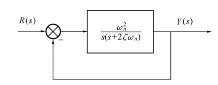
$$
\Phi(s)=\frac{Y(s)}{R(s)}=\frac{\omega_n^2}{s^2+2\zeta\omega_ns+\omega_n^2}
$$

$$
G(s)=\frac{\omega_n^2}{s(s+2\zeta\omega_n)}
$$

> - $\omega_n$ 自然振荡频率
>
> - $\zeta$ 阻尼比： （根轨迹可能会用到）⭐
>   - 欠阻尼：$0<\zeta<1\ \ $  ==极点在左半平面上下对称==
>   - 临界阻尼：$\zeta=1\ $     ==极点在负实轴重合==
>   - 过阻尼：$\zeta>1\ $       ==极点在负实轴且不重合==
>   - 无阻尼：$\zeta=0\ $       ==极点在虚轴上下对称==

#### 欠阻尼情况（$0<\zeta<1$) ==重要==

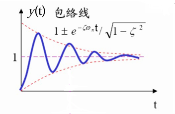

> 暂态分量衰减速度取决于 $\zeta\omega_n$，不存在稳态误差

==延迟时间 $T_d$==

> $$
> \omega_nT_d=\frac1\zeta\ln\frac{2\sin(\omega_dT_d+\varphi)}{\sqrt{1-\zeta^2}}
> $$

==上升时间 $T_r$ ⭐==

> $$
> T_r=\frac{\pi-\varphi}{\omega_d}=\frac{\pi-\varphi}{\omega_n\sqrt{1-\zeta^2}}\qquad\varphi=\arccos\zeta
> $$

==峰值时间 $T_p$ ⭐==

> $$
> T_p=\frac{\pi}{\omega_d}=\frac{\pi}{\omega_n\sqrt{1-\zeta^2}}
> $$

==（最大）超调量 $\sigma$ ⭐==

> $$
> \sigma\%=e^{-\zeta\omega_nT_p}=\exp{\bigg(-\frac{\zeta\pi}{\sqrt{1-\zeta^2}}\bigg)}\times100\%
> $$

==调节时间 $T_s$ ⭐==

> $$
> T_s(2\%)≈\frac4{\zeta\omega_n}\\
> T_s(5\%)≈\frac3{\zeta\omega_n}
> $$

==振荡次数 $N$ ⭐==

> $$
> N=\frac{T_s}{\tau_d}=
> \begin{cases}
> \dfrac{2\sqrt{1-\zeta^2}}{\pi\zeta}\qquad \delta=2\%\\
> \dfrac{1.5\sqrt{1-\zeta^2}}{\pi\zeta}\qquad \delta=5\%\\
> \end{cases}
> \qquad
> 阻尼振荡周期\ \tau_d=\frac{2\pi}{\omega_d}=\frac{2\pi}{\omega_n\sqrt{1-\zeta^2}}
> $$

> ##### 注意⚠：
>
> 为了兼顾超调量和响应时间，**<u>控制系统常选择 $\zeta=0.4-0.8$，相应的 $\sigma\%=25.4\%-1.5\%$</u>** ⭐
>
> 实际控制系统常选取工作在欠阻尼状态，只有当不允许出现超调或对象本身惯性很大时，才采用接近临界阻尼的过阻尼状态
>
> ==当有零点时 ⭐==
>
> - 上升时间、峰值时间、调节时间提前
> - 超调量增大（振荡加剧）
> - $\dfrac z{\zeta\omega_n}=\dfrac 1r$ 越小，影响越大

#### 无阻尼情况（$\zeta=0$)

> 等幅振荡，超调 $\sigma_p=100\%$，调节时间 $t_s=\infty$

#### 临界阻尼情况（$\zeta=1$)

> 图像类似一阶系统的单位阶跃响应，无超调，$y’(0)=0$ ⭐（一阶系统：$y’(0)=\dfrac 1T$）

#### 过阻尼情况（$\zeta>1$)

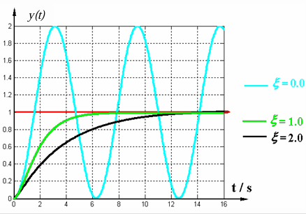

> 单调上升，慢于临界阻尼
>
> 包含两个时间常数不同的指数衰减，当 $\zeta \gg 1$ 时，其中一个可忽略，此时近似于一阶系统

#### 负阻尼情况（$-1<\zeta<0$)

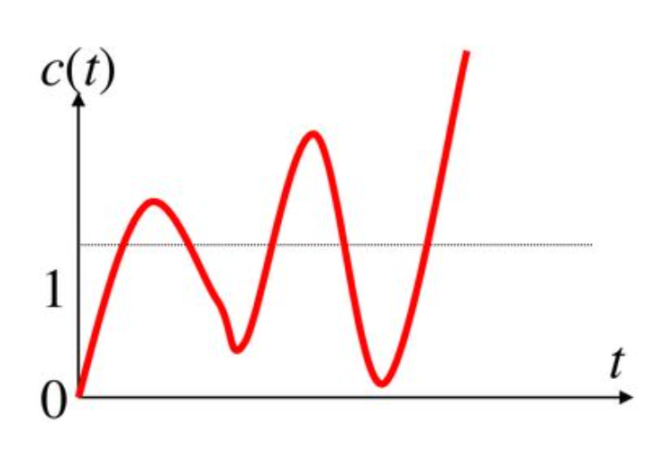

> 发散的正弦振荡，系统不稳定

> ##### 对于单位脉冲响应
>
> - 单位脉冲函数是单位阶跃函数的导数，所以单位脉冲响应是单位阶跃响应对时间的导数，可以对系统的单位阶跃响应求导而得到系统的单位脉冲响应 ⭐
> - 单位脉冲响应是传递函数的拉氏变换，所以单位脉冲响应和传递函数一样，可以反映控制系统的全部特性

> ##### 对于单位斜坡响应
>
> - 欠阻尼情况下，稳态误差 $e_{ss}=\dfrac{2\zeta}{\omega_n}$ ⭐

### 高阶系统时域分析

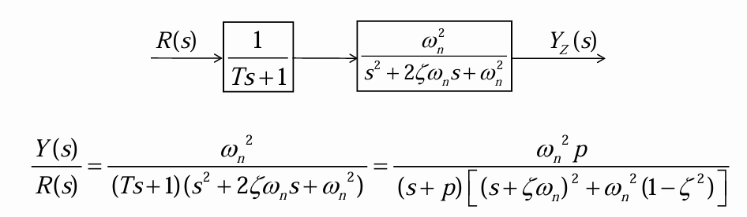

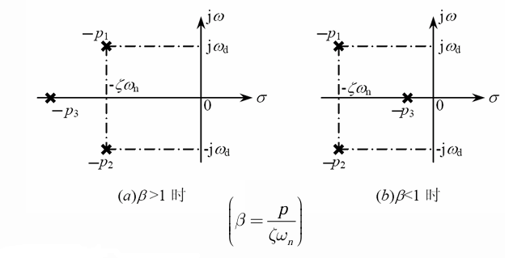

> - 当 $\beta=\dfrac {p}{\zeta\omega_n}=\dfrac{1}{T\zeta\omega_n}\geq5或\leq\dfrac15$ 时，可按照主导极点共轭复数极点（或按照主导极点实极点）估算暂态响应特性
>
> - 高阶系统单位阶跃响应中暂态分量的各项系数不仅和闭环极点有关,而且也与闭环零点有关 ⭐
>   - 如果某一闭环极点靠近一零点,而又与其他极点相距较远,则其在暂态分量中的影响较小
>   - 若有一对闭环零、极点非常接近,称做一对偶极子,则该极点对暂态过程几乎没有影响
>   - 若某极点附近没有零点,并且距虚轴较近,则其对暂态过程的影响较大
> - ⭐**<u>若高阶系统中距离虚轴最近的极点，其实数部分为其他极点的 $\dfrac15$ 或更小，并且附近又没有其他闭环零点，则可认为系统的响应主要由该极点(或共轭复数极点)决定</u>**
>   - 一般情况下，高阶系统具有振荡性，故主导极点通常是共轭复数极点
>   - 所以，高阶系统常当作二阶系统来分析，相应的性能指标都可按二阶系统近似估计

## 控制系统的稳定性及稳态误差

$$
\lim_{t\rarr\infty}k(t)=0\qquad其中\ k(t)\ 为系统的单位脉冲响应
$$

### 系统稳定的充要条件

> 系统的所有闭环极点均具有负的实部（所有闭环极点均严格位于左半平面）

### 稳定性判据

> 特征方程
> $$
> D(s)=a_ns^n+a_{n-1}s^{n-1}+\cdots+a_1s+a_0=0
> $$
>
> - 为系统闭环传递函数的分母

#### 必要条件

> $$
> a_i>0
> $$
>
> - 先检查系数是否都大于 $0$，是的话再进行后续判断

#### 劳斯稳定判据 ==重要==

> 劳斯表
> $$
> \begin{align}
> &s^n\qquad &a_0&\qquad &a_2&\qquad &a_4&\qquad &a_6&\qquad \cdots\\
> &s^{n-1}\qquad &a_1&\qquad &a_3&\qquad &a_5&\qquad &a_7&\qquad \cdots\\
> &s^{n-2}\qquad &b_1&\qquad &b_2&\qquad &b_3&\qquad &b_4&\qquad \cdots\\
> &s^{n-3}\qquad &c_1&\qquad &c_2&\qquad &c_3&\qquad &\cdots&\\
> &\ \vdots\\
> &s^1&\cdots\\
> &s^0&\cdots\\
> \end{align}
> $$
> ⭐ $b_i、c_i = -\dfrac{\det(所在行的上两行的首列与右上方一列组成的\ 2\times2\ 矩阵)}{上一列的首位}$
>
> 如：
> $$
> b_3=\frac{a_1a_6-a_0a_7}{a_1}\\
> c_2=\frac{b_1a_5-a_1a_3}{b_1}
> $$
>
> - 遇到上一列首位为 $0$ 时，可以确定系统不稳定
>   - 在计算下一行时，用 $\epsilon$ 来代替 $0$，最后分析时再让 $\epsilon\rarr0$ 来判断正负
> - 遇到一整行为 $0$ 时
>   - 用上一行各元素构造辅助多项式
>   - 对辅助多项式求导，用其系数代替全 $0$ 行，继续计算
>   - 辅助方程的根也是系统的特征根 ⭐
>   - 若此时劳斯表第一列没有正负变化，则说明没有根位于右半平面，只有根位于虚轴上（临界稳定，仍不稳定） ⭐
>     - 临界稳定时，系统持续震荡频率的大小为虚轴上的根 $|p_j|\ rad\cdot s^{-1}$ ⭐
>
> 解答格式：
>
> 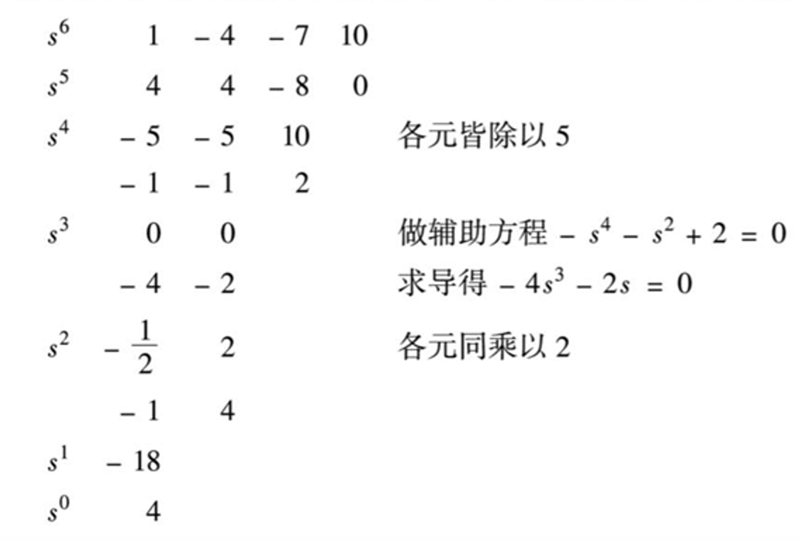
>
> ✅ **<u>劳斯表的第一列系数全部大于零，则系统稳定</u>**
>
> - 劳斯表第一列元素符号改变的次数 = 正实部（右半平面）根的个数
>
> - 计算过程中某行同乘或同除一个正数，结果不变

> ##### 注意⚠：
>
> - 系统开环增益 $K$ 需要将开环传递函数转换成下面的形式（分子分母都尾 $1$）才能获得❗❗❗==（题目问开环增益则一定要记得转换） ⭐⭐⭐==
>
> $$
> G(s)=\frac{K\Pi_{i=1}^m(\tau_is+1)}{s^v\Pi_{j=1}^k(T_js+1)\Pi(T_k^2s^2+2\zeta_kT_ks+1)}
> $$
>
> - 系统稳定与否只取决于闭环极点，与闭环零点无关，也与开环是否稳定无关 ⭐
> - 若要求闭环系统的特征根在某条线 $\sigma=x\quad (x<0)$ 左侧，则相当于求当根轨迹向右平移 $|x|$ 后，系统稳定的范围，即将 $s=s-|x|$ 代入，列劳斯表求解

### 线性系统的稳态误差 ==重要==

> **<u>先判断系统是否稳定，再计算稳态误差</u>**
>
> 定义：
>
> - 按输入端定义误差
>   $$
>   E(s)=R(s)-B(s)=R(s)-H(s)C(s)
>   $$
>
> - 按输出端定义误差
>   $$
>   E'(s)=\frac{R(s)}{H(s)}-C(s)=\frac{E(s)}{H(s)}=\frac1{H(s)}\frac{1}{1+G(s)H(s)}R(s)
>   $$
>   

> 对于扰动端，扰动到误差的闭环传递函数为：
>
> 
> $$
> \Phi_{ef}(s)=\dfrac{-G_2(s)}{1+G_1(s)G_2(s)}
> $$

#### 一般方法

> 1. 判断系统稳定性
>
> 2. 求误差传递函数
>
> 3. 用终值定理求稳态误差
>    $$
>    e_{ss}(t)=\lim_{s\rarr0}sE(s)=\lim_{s\rarr0}s\big[E_{er}(s)+E_{ef}(s)\big]
>    $$
>
>    - 要求 $sE(s)$ 的极点都在左半平面（包括坐标原点，不包括虚轴） ⭐ ==使用前记得判断==

#### 静态误差系数法

> 1. 判断系统稳定性
> 2. 求静态误差系数 $K_p、K_v、K_a$
> 3. 用结论计算误差

> ##### 注意⚠：
>
> - 系统开环传递函数需为以下形式
>   $$
>   G(s)H(s)=\frac{K}{s^v}\cdot\frac{\Pi_{i=1}^{m_1}(\tau_is+1)\Pi_{k=1}^{m_2}(\tau_k^2s^2+2\zeta_k\tau_ks+1)}{\Pi_{j=1}^{n_1}(T_js+1)\Pi_{l=1}^{n_2}(T_l^2s^2+2\zeta_lT_ls+1)}
>   $$
>
>   - 开环放大倍数：$K=\lim_{s\rarr0}s^vG(s)H(s)$
>   - 系统的型别（开环传函中串联积分环节的个数）：$v$

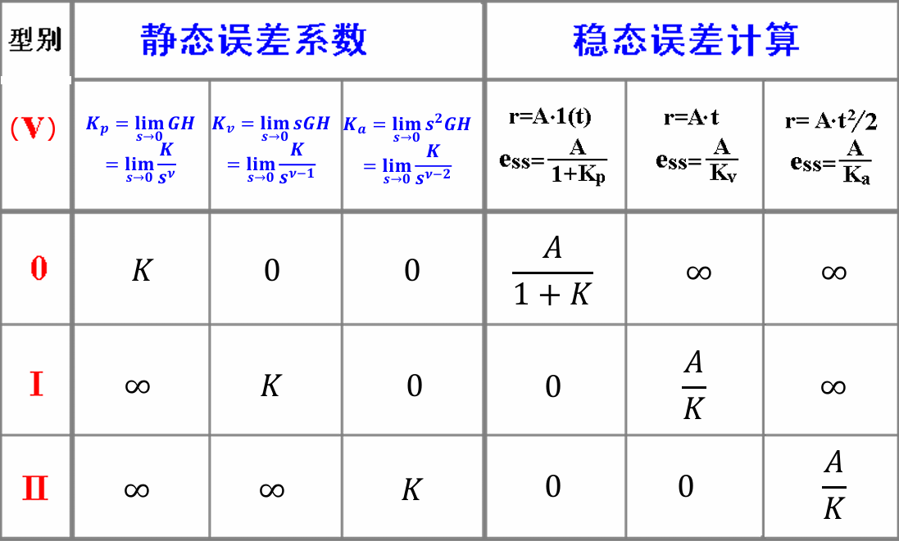

> - 0型系统对**单位阶跃输入信号**的稳态误差为常数
> - Ⅰ型系统**单位阶跃输入信号**的稳态误差为零
> - Ⅱ型系统**对阶跃输入信号和斜坡信号**的稳态误差为零
> - 系统的型别越高，跟踪输入信号的能力越强。但型别越高，稳定性越难以保证

#### 动态误差系数法

> 用静态误差系数法只能求出误差的稳态值，而稳态误差随时间变化的规律无法获得
>
> 用动态误差系数法可以研究误差中的稳态分量随时间的变换规律

$$
\Phi_e(s)=\frac{E(s)}{R(s)}=\sum_{i=0}^{\infty}C_is^i\qquad C_i=\frac1{i!}\Phi_e^{(i)}(0)\qquad i=0,1,2,\ldots
$$

$$
e_s(t)=\sum_{i=0}^{\infty}C_ir^{(i)}(t)
$$

> 先求系统的闭环偏差传递函数，并将分子分母按 $s$ 的升幂排列，再使用多项式大除法，用分子除以分母，得到多项式系数
>
> - 题目要求动态误差系数，则默认求 $3$ 项
> - 若已知输入，则求 $n$ 项，其中 $r^{(n)}(t)=0$

> ##### 注意⚠：
>
> 如果输入是**正弦信号，**要求稳态误差：
>
> - 此时终值定理、静态误差系数法、动态误差系数法都无法直接求
> - **需要使用频率特性方法求解** ⭐ 
> - 最终得到的稳态误差 $e_{ss}(t)$ 也是一个正弦信号 

### 基于根轨迹的稳定性分析

> 闭环零点 = 前向通道开环零点 + 反馈通道开环极点
>
> 根轨迹方程
> $$
> G(S)H(s)=-1\implies
> \begin{cases}
> |G(s)H(s)|=K^*\dfrac{\Pi_{i=1}^m|s-z_i|}{\Pi_{j=1}^n|s-p_j|}=1\\\\
> \begin{align}
> \angle G(s)H(s)&=\sum_{i=1}^m\angle(s-z_i)-\sum_{j=1}^n\angle(s-p_j)\\
> &=(2k+1)\pi
> \end{align}
> \end{cases}
> $$
>
> $$
> K=K^*\dfrac{\Pi_{i=1}^m|z_i|}{\Pi_{j=1}^n|p_j|}
> $$
>
> - 相角条件的角度：由 $z$ 指向 $s$ 的向量、由 $p$ 指向 $s$ 的向量
> - 模值条件总能满足，因而只需满足相角条件
> - 根轨迹的变量为 $K^*$ 而非 $K$，故第一步应该写出二者关系，以便后续分析 ⭐（也可直接利用特征方程求 $K$）

#### 绘制根轨迹八个法则 ==重要==

==根轨迹的起点和终点==

> 根轨迹起始于开环极点，终止于开环零点
>
> 如果开环极点个数 $n$ 大于开环零点个数 $m$，则有 $n-m$ 条根轨迹终止于无穷远处

==根轨迹的分支数、对称性、连续性==

> 根轨迹的分支数 = 开环极点数
>
> 根轨迹连续且对称于实轴

==实轴上的根轨迹==

> 从实轴上最右端的开环零、极点算起，奇数点到偶数点之间的区域必是根轨迹

==根之和 ⭐==

> $n-m\geq2$​ 时，闭环根之和保持一个常值
> $$
> \sum_{i=1}^n\lambda_i=C\qquad(n-m\geq2)
> $$
> 一部分根左移，另一部分根必右移，且移动总量为 $0$

==渐近线 ⭐==

> $$
> \begin{cases}
> \sigma_a=\dfrac{\sum_{i=1}^np_i-\sum_{j=1}^mz_i}{n-m}\\
> \varphi_a=\dfrac{(2k+1)\pi}{n-m}
> \end{cases}
> $$
>
> - $\sigma_a$ 为渐近线与实轴的交点，$\varphi_a$ 为渐近线与实轴正方向的夹角
> - $n>m$ 时，有 $n-m$ 条根轨迹趋于无穷远处

==分离点 ⭐==

> $$
> \sum_{i=1}^n\frac1{d-p_i}=\sum_{j=1}^m\frac1{d-z_j}
> $$
>
> - 无零点时右端为 $0$

==与虚轴交点==

> 方法 $1$：
>
> - 使用劳斯表获得特征方程（若含有未知数，则让含未知数的某行全为 $0$，可获得未知数的值，同时也获得特征方程）
> - 特征方程的解即为与虚轴的交点
>
> 方法 $2$：
> $$
> Re[D(j\omega)]=Im[D(j\omega)]=0
> $$

==出射角/入射角 ⭐==

> $$
> \sum_{j=1}^m\angle(s-z_j)-\sum_{i=1}^n\angle(s-p_i)=(2k+1)\pi
> $$
>
> - 由其它零、极点指向当前选择的点，即相角条件
> - 等式右边取 $-180\degree$，零度根轨迹时则取 $0\degree$

==定理==

> 1. 若系统有 $2$ 个开环极点，$1$ 个开环零点，且在复平面存在根轨迹，则复平面的根轨迹是以该零点为圆心的圆弧 ⭐
> 2. 若开环零极点均为偶数个，且关于一条平行于虚轴的直线左右对称分布，则根轨迹一定关于该直线左右对称 ⭐

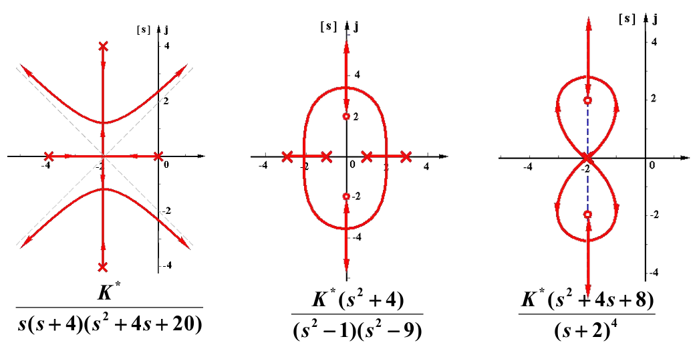

#### 其他参数根轨迹 ⭐

> 需要先列写 $D(s)$，然后构造等效开环传递函数，使得待求参数变为 $K$ 的一部分（n>m)
>
> - 未知数所在项如果不为最高次项，则直接作为分子，其余作为分母
> - 否则如下：
>
> $$
> G(s)=\dfrac{615(s+26)}{s^2(Ts+1)}\\
> \implies D(s)=Ts^3+s^2+615s+15990=0\\
> \implies G^*(s)=\dfrac{\dfrac1T(s^2+615s+15990)}{s^3}
> $$

#### 零度根轨迹 ⭐

> 系统处于正反馈时的根轨迹
> $$
> G(S)H(s)=-1\implies
> \begin{cases}
> |G(s)H(s)|=K^*\dfrac{\Pi_{i=1}^m|s-z_i|}{\Pi_{j=1}^n|s-p_j|}=1\\\\
> \angle G(s)H(s)=\sum_{i=1}^m\angle(s-z_i)-\sum_{j=1}^n\angle(s-p_j)=2k\pi
> \end{cases}
> $$
>
> - 与负反馈根轨迹的法则有三个不同
>   - 实轴上的根轨迹：奇偶相反
>   - 渐近线、出射角/入射角：公式中的 $(2k+1)\pi$ 改为 $2k\pi$

#### 系统性能分析 ⭐

> - 稳定性分析
>   - 看根什么时候位于左半平面，此时系统稳定
> - 动态性能
>   - 定性分析
>     - 随着参数变化，特征根怎么变，此时有无衰减震荡分量
>   - 定量计算
>     - 先求相应的闭环极点，再进行计算
> - 稳态性能
>   - 计算开环增益和系统的型别、三种输入下的稳态误差

## 线性系统的频域分析方法

### 频率特性

> $$
> 定义1：\qquad &G(j\omega)=|G(j\omega)|\angle G(j\omega)\\
> 定义2：\qquad &G(j\omega)=G(s)\bigg|_{s=j\omega}
> $$

> $$
> |G(j\omega)|=\dfrac{\text{输出信号稳态分量的幅值}}{输入信号的幅值}\\
> \angle G(j\omega)=\text{输出信号稳态分量的相位 - 输入信号的相位}
> $$

### 几何表示

> - 奈奎斯特图（幅相特性）：
>   - 把频率特性表示在同一张图、同一条曲线上
>   - 特点：
>     - $K𝐺(𝑗𝜔)$ 的频率特性是原 $𝐺(𝑗𝜔)$ 曲线上各点的幅值都增大为 $K$ 倍，相角不变

> - 伯德图（对数频率特性）：
>   $$
>   L(\omega)=20\lg|G(j\omega)|\qquad
>   \varphi(\omega)=\angle G(j\omega)
>   $$
>
>   - 特点
>
>   $$
>   20\lg |KG(j\omega)| =20\lg |G(j\omega)|+20\lg K\\
>   20\lg [G_1(j\omega)][G_2(j\omega)] =20\lg |G_1(j\omega)|+20\lg |G_2(j\omega)|\\
>   $$

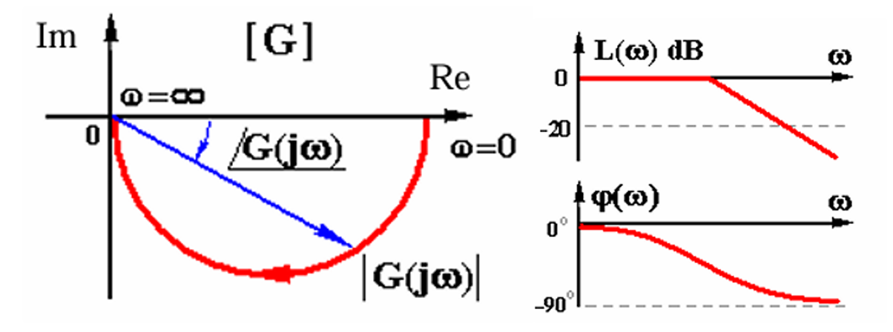

### 典型环节的分类

> 系统的开环传递函数通常可分解为若干个典型环节的乘积。典型环节分为最小相位环节和非最小相位环节
>
> 非最小相位环节与最小相位环节的区别在于开环零、极点的位置。非最小相位环节对应于s开右半平面的开环零点或极点，而最小相位环节对应于s左半平面的零点或极点

### 典型环节的幅相频率特性（Nyquist图）

==比例环节==

> 传递函数：$ G(s) = K $
>
> 频率特性：$ G(j\omega) = K $

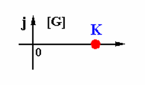

==微分环节==

> 传递函数：$ G(s) = s $
>
> 频率特性：$ G(j\omega) = j\omega $

==积分环节==

> 传递函数：$ G(s) = \dfrac{1}{s} $
>
> 频率特性：$ G(j\omega) = \dfrac{1}{j\omega} $

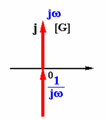

==惯性环节==

> 传递函数：$ G(s) = \dfrac{1}{Ts \pm 1} $
>
> 频率特性：$ G(j\omega) = \dfrac{1}{\pm1 + j\omega T} $

> 幅相特性为半圆
>
> 蓝色的不稳定，红色的稳定

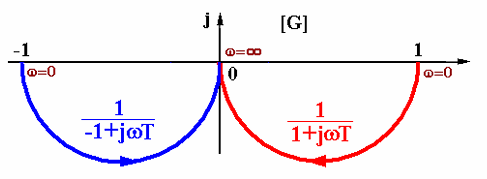

==一阶微分环节==

> 传递函数：$ G(s) = Ts \pm 1 $
>
> 频率特性：$ G(j\omega) = \pm1 + j\omega T $

==振荡环节==

> 传递函数：$ G(s) = \dfrac{\omega_n^2}{s^2 + 2\zeta\omega_n s + \omega_n^2} $
>
> 频率特性：$ G(j\omega) = \dfrac{1}{1 - \dfrac{\omega^2}{\omega_n^2} + j2\zeta\dfrac{\omega}{\omega_n}} $

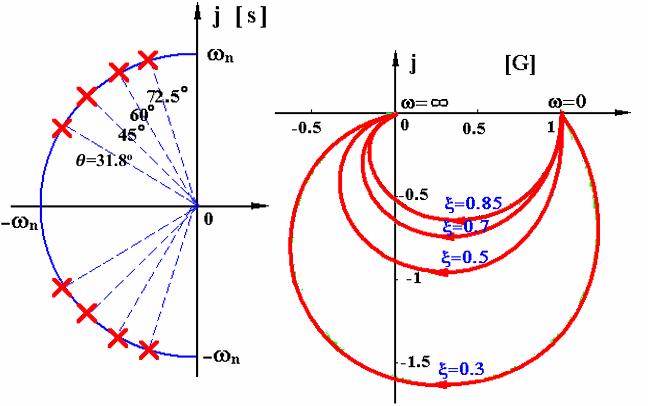

> 当 $\omega$ 从 $0→∞$ 变化时，相角变化范围是 $ 0^\circ \rightarrow -180^\circ $，Nyquist 图分布在第四象限和第三象限

==不稳定振荡环节==

> 传递函数：$ G(s) = \dfrac{\omega_n^2}{s^2 - 2\zeta\omega_n s + \omega_n^2} $
>
> 频率特性：$ G(j\omega) = \dfrac{1}{1 - \dfrac{\omega^2}{\omega_n^2} - j2\zeta\dfrac{\omega}{\omega_n}} $

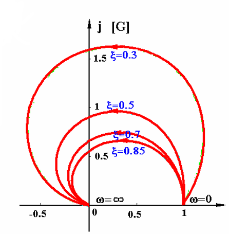

==二阶微分环节==

> 传递函数：$ G(s) = T^2 s^2 \pm 2\zeta Ts + 1 $
>
> 频率特性：$ G(j\omega) = 1 - \dfrac{\omega^2}{\omega_n^2} \pm j2\zeta\dfrac{\omega}{\omega_n} $

==延迟环节==

> 传递函数：$ G(s) = e^{-\tau s} $
>
> 频率特性：$ G(j\omega) = e^{-j\omega\tau} $

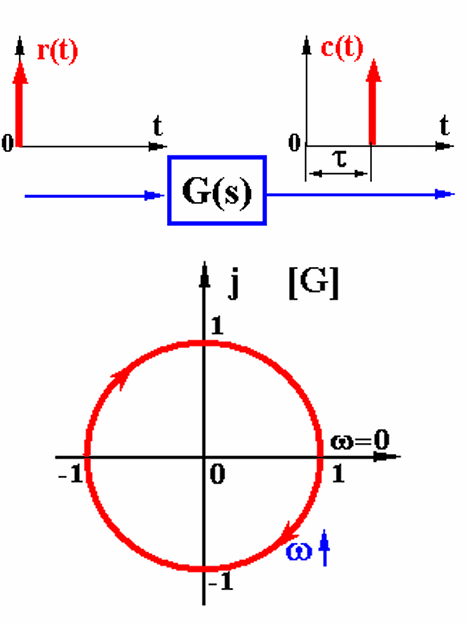

> 汇总 ⭐

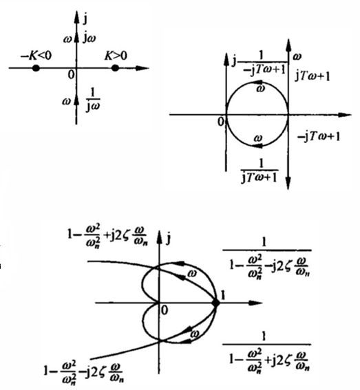

### 谐振频率$\omega_r$和谐振峰值$M_r$

> 频率特性的幅值出现峰值，即出现谐振现象
>
> - 谐振频率：$ \omega_r = \omega_n \sqrt{1 - 2\zeta^2} $ ⭐
> - 谐振峰值：$ M_r = |G(j\omega_r)|=\dfrac{1}{2\zeta\sqrt{1 - \zeta^2}} $ ⭐
>
> 当 $0<\zeta < \dfrac{\sqrt{2}}{2}$ 时，谐振峰存在；当 $\zeta \geq \dfrac{\sqrt{2}}{2}$ 时，谐振峰不存在
>

### 开环Nyquist图绘制  ==重要==

> ##### 概略绘制步骤：
>
> 1. **确定起点和终点**：
>
>    - 起点：$\omega \rightarrow 0$，$\angle G(j\omega) \rightarrow -90^\circ \times v$，$|G(j\omega)|\rarr \begin{cases}K&(v=0)\\\infty&(v>0)\end{cases}$ （$v$ 为积分环节个数）
>      - 趋于 $\infty$ 时，需计算渐近线：$Re[G(j0)]=\sigma_0\ (\pm90\degree)\qquad Im[G(j0)]=\omega_0\ (0\degree、180\degree)$
>
>    - 终点：$\omega \rightarrow \infty$，$G(j\omega)\rarr0\angle-90\degree(n-m)$
>
>    
>
> 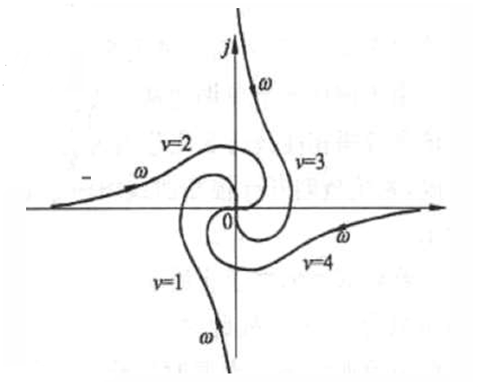
>
> 2. **求出与实轴、虚轴的交点**：( $\omega_0$ 、 $|G(j\omega_0)|$ 都要求)
>
>    - 与负实轴的交点：判断在-1的左边还是右边
>      - 令G(jω)的虚部为零，求实部
>    - 或者令角度为 $0\degree、90\degree、180\degree、270\degree$ ，得到虚轴、实轴交点
>

### 对数幅频特性（Bode图）

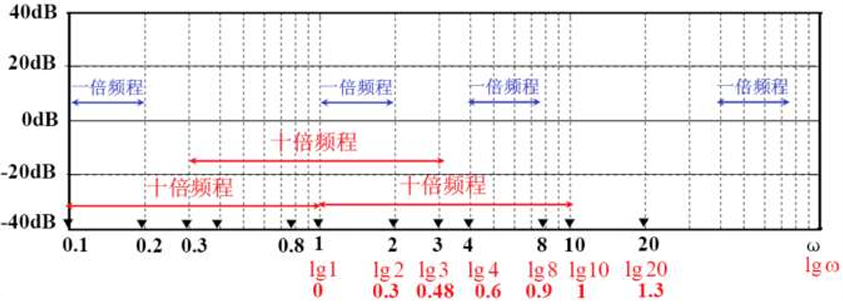

> 绘制时：
>
> - $3cm$ 为十倍频，$1cm$ 为 $20dB$ 或 $90\degree$ （或按此比例缩放） ⭐
> - 无 $\omega=0$ 这一点，横轴为 $\lg \omega$ 
> - 幅值相乘即对数相加，叠加作图即可

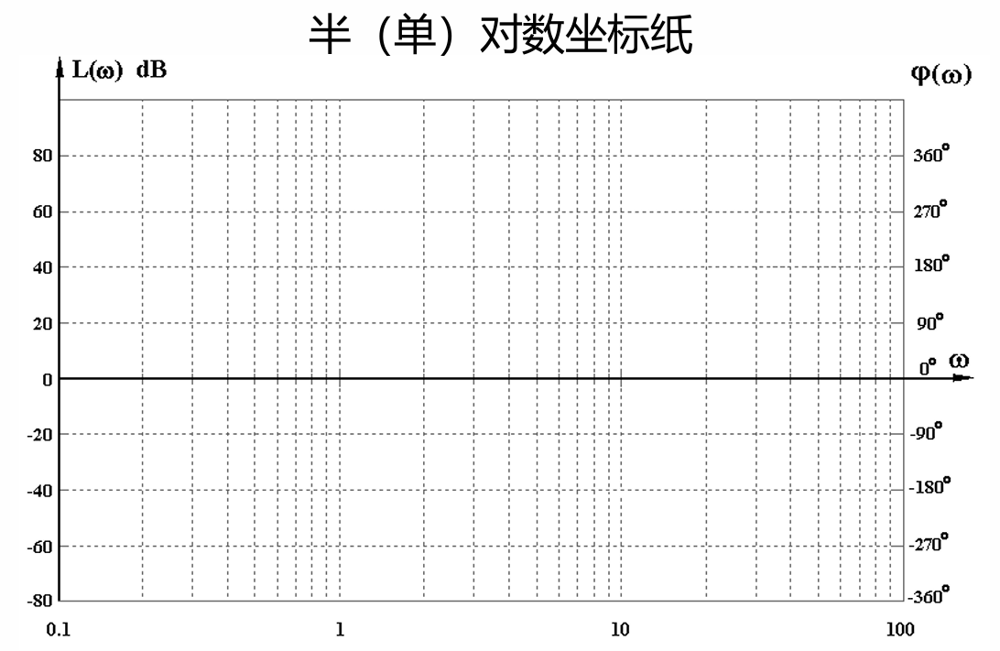

#### 典型环节

==比例环节==

> 传递函数：$G(j\omega) = K$
>
> 幅频特性：$L(\omega) = 20 \lg K$
>
> 相频特性：$\varphi(\omega) = 0^\circ$

- 幅频图：平行于ω轴的直线，位置由K决定
- 相频图：与ω轴重合的直线

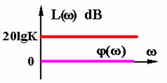

==积分环节 ⭐==

> 传递函数：$$G(j\omega) = \dfrac{1}{j\omega}$$
>
> 幅频特性：$L(\omega) = -20 \lg \omega$
>
> 相频特性：$\varphi(\omega) = -90^\circ$

- 幅频图：斜率为 $-20 dB/dec$ 的直线，过点 $(\omega=1, L=0)$
- 相频图：恒为 $-90^\circ$ 的直线

==微分环节 ⭐==

> 传递函数：$$G(j\omega) = j\omega$$
>
> 幅频特性：$L(\omega) = 20 \lg \omega$
>
> 相频特性：$\varphi(\omega) = 90^\circ$

- 幅频图：斜率为 $+20 dB/dec$ 的直线，过点 $(\omega=1, L=0)$
- 相频图：恒为 $90^\circ$ 的直线

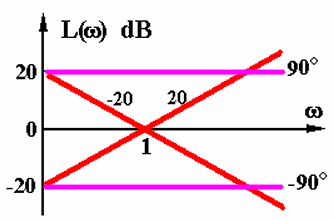

==惯性环节 ⭐==

> 传递函数：$$G(j\omega) = \dfrac{1}{\pm1 + j\omega T}$$
>
> 幅频特性：$L(\omega) = -20 \lg \sqrt{1 + \omega^2 T^2}$
>
> 相频特性：
> $$
> \varphi(\omega) = \begin{cases} 
> -\arctan(\omega T) & +\\
> -180^\circ + \arctan(\omega T) & -
> \end{cases}
> $$

- 幅频图：低频段近似为 $0 dB$，高频段斜率为 $-20 dB/dec$，转折频率为 $\omega = \dfrac{1}{T}$
- 相频图：关于点 $(\omega=\dfrac{1}{T}, \varphi=-45^\circ)$对称

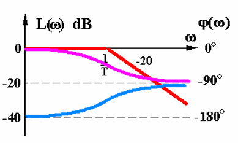

> 折线近似图由两条直线构成
>
> 精确图形以近似图形为渐近线，最大误差在转折频率处

==一阶微分环节 ⭐==

> 传递函数：$G(j\omega) = \pm1+j\omega T$
>
> 幅频特性：$L(\omega) = 20 \lg \sqrt{1 + \omega^2 T^2}$
>
> 相频特性：
> $$
> \varphi(\omega) = \begin{cases} 
> \arctan(\omega T) & + \\
> 180^\circ - \arctan(\omega T) & -
> \end{cases}
> $$

- 幅频图：低频段近似为 $0 dB$，高频段斜率为 $+20 dB/dec$，转折频率为$\omega = \dfrac{1}{T}$

- 相频图：从$0^\circ$逐渐增加到$90^\circ$

  

==振荡环节 ⭐==

> 传递函数：$G(j\omega) = \dfrac{1}{1 - \dfrac{\omega^2}{\omega_n^2} \pm j2\zeta\dfrac\omega{\omega_n}}$
>
> 幅频特性：$L(\omega) = -20 \lg \sqrt{\left(1 - \dfrac{\omega^2}{\omega_n^2}\right)^2 + \left(\dfrac{2\zeta\omega}{\omega_n}\right)^2}$
>
> 相频特性：
> $$
> \varphi(\omega) = \begin{cases} 
> -\arctan\left(\dfrac{2\xi\dfrac\omega{\omega_n}}{1 - \dfrac{\omega^2}{\omega_n^2}}\right) &+ \\
> -\arctan\left(\dfrac{-2\xi\dfrac\omega{\omega_n}}{1 - \dfrac{\omega^2}{\omega_n^2}}\right) - 180^\circ &-
> \end{cases}
> $$

- 幅频图：峰值出现在 $\omega = \omega_n \sqrt{1 - 2\zeta^2}$ （当 $\zeta < \dfrac{\sqrt{2}}{2}$ 时）
- 相频图：从 $0^\circ$ 下降到 $-180^\circ$（+），从 $-360^\circ$ 上升到 $-180^\circ$（-）

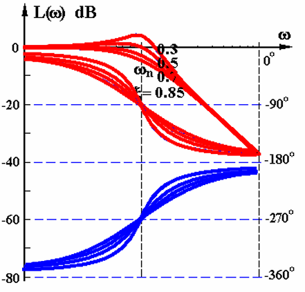

==二阶微分环节 ⭐==

> 传递函数：$G(j\omega) ={1 - \dfrac{\omega^2}{\omega_n^2} \pm j2\zeta\dfrac\omega{\omega_n}}$
>
> 幅频特性：$L(\omega) = 20 \lg \sqrt{\left(1 - \dfrac{\omega^2}{\omega_n^2}\right)^2 + \left(\dfrac{2\zeta\omega}{\omega_n}\right)^2}$
>
> 相频特性：
> $$
> \varphi(\omega) = \begin{cases} 
> \arctan\left(\dfrac{2\xi\dfrac\omega{\omega_n}}{1 - \dfrac{\omega^2}{\omega_n^2}}\right) &+ \\
> \arctan\left(\dfrac{-2\xi\dfrac\omega{\omega_n}}{1 - \dfrac{\omega^2}{\omega_n^2}}\right) - 180^\circ &-
> \end{cases}
> $$

- 幅频图：低频段近似为 $0 dB$，高频段斜率为 $+40 dB/dec$
- 相频图：从 $0^\circ$上升到 $180^\circ$（+），从 $360^\circ$ 下降到 $180^\circ$（-）

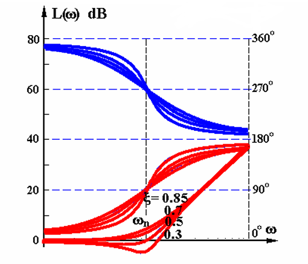

==延迟环节==

> 传递函数：$G(j\omega) = e^{-j\omega\tau}$
>
> 幅频特性：$L(\omega) = 20 \lg 1 = 0$
>
> 相频特性：$\varphi(\omega) = -57.3^\circ \times \tau \omega$

- 幅频图：恒为 $0 dB$ 的水平线
- 相频图：单调下降

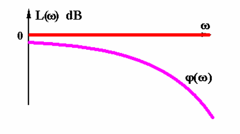

#### 对称性结论 ⭐⭐

> 若两个传递函数互为倒数，则它们的 Bode 图幅频特性关于 $ω$ 轴对称
>
> - 微分环节 与 积分环节 对称
>
> - 一阶微分环节 与 惯性环节 对称
> - 二阶微分环节 与 振荡环节 对称
>
> > 比例环节和延迟环节单独记

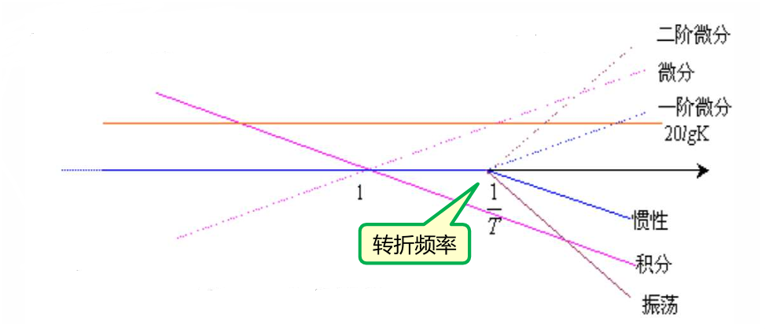

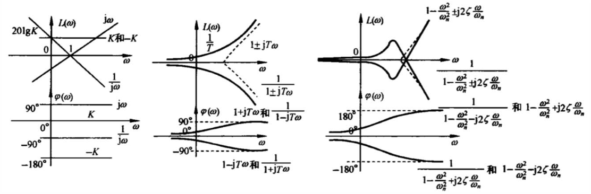

> 剪切频率 $\omega_c$ ：幅频曲线与 $0 dB$ 线的交点（$|G(j\omega)|=1$）
>
> - 一般用斜率计算，记得在图上标出来 ⭐

#### 绘制Bode图的步骤(根据图像求开环传函同理) ⭐⭐

> 1. 将传递函数分解为典型环节的乘积（尾 $1$ 形）
>
> 2. 按顺序确定含有转折频率的环节的类型（一阶惯性、一阶微分、二阶振荡、二阶微分）及其转折频率（一阶为 $\frac1T$，二阶为 $\omega_n$）
>
> 3. 绘制基准线（通常以 $\omega=1$ 为基准点）
>    - 最小转折频率的左边的特性及其延长线：$G(s)=\dfrac{K}{s^v}$
>       - 选 $\omega=1$ 时，$L(1)=20\lg K$，斜率为 $-20\cdot v\ dB/dec$ 
>
>       - 选其他点：$\omega_0\rarr20\lg\dfrac K{\omega_0^v}$
>
> 4. 叠加各环节的幅频和相频特性
>
>    - 比例
>      - $0\ dB/dec$、$0\degree$
>    - 一阶
>      - 惯性环节：$-20\ dB/dec$、$-90\degree$
>      - 一阶微分：$+20\ dB/dec$、$90\degree$
>    - 二阶（转折频率前为 $0\ dB、0\degree$）
>      - 振荡环节：$-40\ dB/dec$、$-90\degree/dec$
>      - 二阶微分：$+40\ dB/dec$、$+90\degree/dec$
>
> 5. 根据需要修正曲线
>
>    - 两惯性环节转折频率很接近时 
>    - 振荡环节或二阶微分环节的谐振点、转折频率点（注意下面的两条公式是叠加前的，等于当前幅值减去当前渐近线的幅值）
>      - 谐振点：$20\lg \dfrac{1}{2\zeta\sqrt{1 - \zeta^2}}$
>      - 转折频率点: $20\lg \dfrac1{2\zeta}$
>
> 6. 检查曲线特性是否符合预期
>
>    - $L(\omega)$ 最右端曲线斜率 $k=-20(n-m)\ dB/dec$
>    - 转折点数：惯性 + 一阶微分 + 振荡 + 二阶微分
>    - $\varphi(\omega)\rarr-90\degree (n-m)$
>

> ##### 总结：
>
> 1. 先画幅频特性
> 2. 找到相位起始点（$0\degree、90\degree、-90\degree$），相位终点：$\varphi(\omega)\rarr-90\degree (n-m)$
> 3. 根据幅频特性的斜率，绘制相频特性趋势：从起点开始，幅频特性的斜率增加了，相频曲线往上拉一点，反之往下拉一点，最后到达终点

### 频率域稳定判据

> 代数稳定判据 — Routh判据
>
> - 由闭环特征多项式系数（不解根）判定系统稳定性
> - 不能用于研究如何调整系统结构来改善系统稳定性的问题
>
> 频域稳定判据 - Nyquist判据、对数稳定判据
>
> - 由开环频率特性直接判定闭环系统的稳定性
> - 可以研究包含延迟环节的系统的稳定性问题
> - 可研究如何调整系统结构参数改善系统稳定性及性能

##### 奈奎斯特稳定判据 ⭐⭐

$$
Z=P-2N
\begin{cases}
>0& 闭环系统不稳定\\
=0& 闭环系统稳定\\
<0& 有误！
\end{cases}
$$

> $Z$：在右半s平面中的闭环极点个数
>
> $P$：在右半s平面中的开环极点个数
>
> $N$：开环幅相曲线 $G(j\omega)H(j\omega)$包围 $(-1, j0)$ 点的圈数 $R$ 的一半
> - $N=N_+-N_-$
>   - $N_+$：正穿越次数
>     - $\omega$ 增大时，Nyquist 曲线由上而下穿越
>   - $N_-$：负穿越次数
>     - $\omega$ 增大时，Nyquist 曲线由下而上穿越
>   - 穿越：开环 Nyquist 曲线穿过 $(-1, j0)$ 点左边的实轴
>     - 完全穿过算一次
>     - 到达实轴停止则算 $\pm\dfrac12$ 次（半次穿越）

>  当 s 平面虚轴上有开环极点时，奈氏路径要从其右边绕出半径为无穷小的圆弧；G 平面对应要补充大圆弧
>
>  ==补圆==
>
>  若有 $(\dfrac1s)^v$项，则以奈奎斯特曲线的起始位置为起点，**逆时针画 $v \times 90°$ 半径无穷大**的圆弧，但该圆弧的方向为**顺时针**

