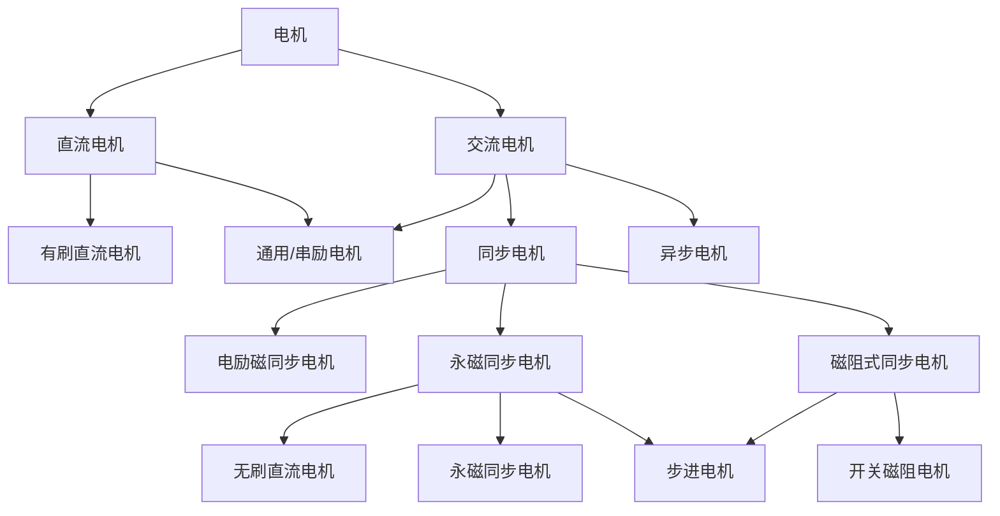

# 一、绪论

## 1、控制

> 主体按照给定的条件和目标，对客体施加影响的过程和行为
>

即：主体对客体施加影响，通过**改变或保持**装置或体系内的变量，达到最终的期望

- 五要素：主体、客体、目标、条件、手段

## 2、控制系统

> 实现控制过程的装置、体系
>

- 常见的自动化控制系统是由相应的硬件和软件构成的机构、设备

- 功能框图：

  

  

  - **执行元件**：各类电机，驱动控制对象，改变被控量（输出量）
    - 直流电机、交流电机、步进电机、超声电机
  - **测量元件**：将被测量检测出来，并转换成另一种容易处理和使用的量（如电压），提供给处理器识别
    - 测量元件一般称为传感器，过程控制中又被称为变送器
    - 可测角度、速度、位置、电特性（电压电流）、振动、温度、电磁
      - 物理传感：力传感器、接触传感器、视觉传感器、……
      - 位置传感：光电编码器、电磁测角、电位器、……
    - 电磁式传感器：信号输出幅值大，简单、灵敏、适应环境能力强、维护简便、应用广泛
  - **功放元件**：将控制驱动信号幅值放大，输出较大功率以驱动执行元件动作
    - 线性功放，开关功放
    - 驱动器、逆变器、……
  - **校正元件**（补偿元件）：实现高精度输出量的检测元件或校正算法。
    - 硬件一般是精密电位器
    - 算法是对控制信号的运算，对功放元件输出驱动指令，确保系统稳定并达到规定的性能指标

# 二、磁场基本理论

> 电磁元件是利用**磁场做媒介**来实现能量（或信息）转换（或传递）的装置
>

- 磁场产生：永久磁铁、电流
- 磁场分类：直流磁场、交流磁场

## 1、磁场基本物理量

### ① 磁力线

- 磁力线是用来形象**描述磁场分布**的曲线

- 磁力线是三维的封闭曲线
- 磁力线上任一点的**切线方向**即该点磁场的方向

#### 基本特征

- 所有的磁力线都**不交叉**
- 磁力线的**相对疏密**表示磁场的**相对强弱**
- 任何磁场中，每一条磁力线都是环绕电流的无头无尾的闭合曲线，无起点无终点（但磁场有方向）
- 在任何磁场中，每一条闭合的磁力线的回转方向和该闭合磁力线所包围的电流方向符合**右手螺旋法则**

### ② 磁感应强度 B

> 表示在空间**某点磁场强弱和方向**的物理量，是一个空间**矢量**
>

- 磁感应强度（强弱）为通过某单位面积的磁力线的条数，所以也被称为**磁密**（磁通密度）
- 磁感应强度的方向：**该点磁场的方向**
- 单位 T 特斯拉

### ③ 磁通 $\Phi$

> 通过磁场中一个给定面 A 的磁力线条数

$$
\Phi=\int_AB\cos\theta dA=\int_A\mathbf B\cdot d \mathbf A
$$
均匀的磁场中的磁通量
$$
\Phi = \mathbf{BA}
$$
单位 Wb 韦伯

#### 磁路

电磁元件中，磁通所经过的闭合回路

- 主磁通：通过电磁元件**工作磁路路径**的磁通
- 漏磁通：不在工作磁路路径通过的少量磁通

### ④ 磁场强度 H

> 在任何介质磁场中，某一点的磁感应强度 $B$ 和同一点上**介质磁导率 $\mu$** 的比值

$$
\mathbf H=\dfrac{\mathbf B }\mu
$$
单位：A/m 安培每米

- **磁场强度 $H$​** 是磁场的特性参数，与截至无关，仅与电流相关
  $$
  H=\dfrac{N\times I}{L_e}
  $$
  $L_e$ 是磁路的有效长度，即磁通在磁性材料中经过的平均路径长度

- **磁感应强度 $B$​** 是磁场感应出来的强度大小，与介质有关
  $$
  B=H\times \mu
  $$

### ⑤ 磁导率 $\mu$

> 用来表示**物质导磁能力大小**的物理量，称为导磁系数或磁导率
>

- 并非表示磁力大小，只是表示物质导磁能力的大小

单位 H/m 亨每米
$$
\text{真空}&\mu_0=4\pi\times10^{-7}\\
\text{相对磁导率}&\mu_r=\dfrac{\mu}{\mu_0}
$$

- 真空和空气的相对磁导率 $\mu_r=1$
- 非铁磁性物质 $\mu\approx0$
- 铁磁性物质的磁导率很高 $\mu\gg\mu_0$
  - 磁王：钕铁硼，$\mu=1012\ H/m$

## 2、磁路基本定律

### ① 高斯定律（磁通连续性定律）

> 通过磁场中**封闭曲面**的总磁通量为 $0$

$$
\oint_A\mathbf B\cdot d\mathbf A=\oint_AB\cos\theta dA=0
$$

- 取垂直于曲面向外的方向为正方向

由高斯定律可得

- 汇集在一点的多条磁路（分支磁路）中的磁通代数和为 $0$ （磁路基尔霍夫第一定律）

  
  $$
  \sum\Phi_i=0\implies\Phi_2+\Phi_3-\Phi_1=0
  $$

### ② 安培环路定律（全电流定律）

> 空间中磁场强度 $H$ 沿任意一条闭合路径 $L$ 的线积分，等于这个闭合路径所包围的**各传导电流的代数和**

$$
\oint_L\mathbf H\cdot d\mathbf L=\sum I_i
$$

-  电流取和闭合路径方向符合右手定则的方向为正

由安培环路定律可得到（磁路基尔霍夫第二定律）

$$
\sum H_iL_i=\sum I_kN_k
\\
\oint_L \mathbf H\cdot d\mathbf L=H_1L_{ab}+H_2L_{bc}+H_3(L_{cd}-\delta)+H_\delta L_\delta +H_4L_{ad}=I_1N_1-I_2N_2
$$

- **磁路磁压降**：$U_{mi}=H_iL_i$，其方向与磁场 $H_i$ 方向相同

- **磁路磁动势**：$F_{mk}=I_kN_k$，其方向与电流方向 $I$​ 一致
  $$
  \sum U_{mi}=\sum F_{mk}
  $$

### ③ 磁路欧姆定律

#### 磁阻

$$
R_m=\frac{L}{\mu A}
$$

单位 1/H 或 A/Wb

#### 磁导

$$
\Lambda=\dfrac1{R_m}
$$

单位 H 亨

#### 欧姆定律

$$
U_m=HL=\dfrac{\Phi}{\mu A}L=\Phi R_m
$$

#### 磁路与电路的差别

|                      电路                      |                       磁路                       |
| :--------------------------------------------: | :----------------------------------------------: |
|           电动势 $E$           $[V]$           |        磁动势 $F_m$      （安匝）或 $[A]$        |
|           电流 $I$             $[A]$           |        磁通 $\Phi$                 $[Wb]$        |
|         电导率 $\gamma$        $[S/m]$         |        磁导率 $\mu$              $[H/m]$         |
| 电阻 $R = \dfrac{L}{\gamma S}$      $[\Omega]$ |   磁阻 $R_m = \dfrac{L}{\mu S}$       $[1/H]$    |
|      电导 $G = \dfrac{1}{R}$       $[S]$       |  磁导 $\Lambda = \dfrac{1}{R_m}$          $[H]$  |
|        欧姆定律               $U = IR$         |  磁路欧姆定律                 $U_m = \Phi R_m$   |
|     基尔霍夫第一定律         $\sum I = 0$      | 磁路基尔霍夫第一定律             $\sum \Phi = 0$ |
|     基尔霍夫第二定律     $\sum E = \sum U$     | 磁路基尔霍夫第二定律       $\sum F_m = \sum U_m$ |

1. 直流磁路（内部）无损耗，直流电路有 $I^2R$ 的损耗
2. 磁路中的漏磁比电路中严重得多，一般的电磁机构中，主磁通约占全部磁通的 $80\%$
3. 对常用的铁磁材料，磁导率 $\mu$ 由 $B-H$ 曲线决定，呈显著的**非线性**，而电阻率 $\rho$ 一般可近似为常值
4. 对线性电路可应用叠加定律，磁路一般呈显著的饱和非线性，一般**不能应用叠加定律**

### ④ 法拉第定律（电磁感应定律）

> 当通过闭合导线回路所包围的面积内的磁通量 $\Phi$ 发生变化时，在回路上产生的感应电动势 $e_i$ 总是与磁通量对时间 $t$ 的变化率的负值成正比

$$
e_i=-\dfrac{d\Phi}{dt}
$$

- 导线切割磁力线产生电势
  $$
  e=BLv
  $$

- 对电感不变的线圈
  $$
  e=-L\dfrac{dI}{dt}
  $$

### ⑤ 安培电磁力定律

导线在磁场中受力
$$
d\mathbf F=Id\mathbf{l\times B}
$$

- 均匀磁场中的导线受力
  $$
  F=BIL\sin\theta
  $$
  
- 电磁力和电磁转矩

  - 磁场中的载流导体所受的电磁力和力矩

    
    $$
    F_e = BlI\\
    T_e=BlIr
    $$

  - 铁芯表面的磁力

    
    $$
    F_{em}=\dfrac12\Phi_{\delta}^2\dfrac{dR_\delta}{d\delta}=\dfrac12\dfrac{\mu_0s}{\delta^2}I^2N^2
    $$
  
- 磁极间的力
  
  - 同性相斥、异性相吸，与距离平方成反比
  
- 电磁力与极对数之间的关系
  
  - 2 极磁场（1对级）：$T_1=K\sin\theta$ ( $p=1$ )
    - 4 极磁场（2对级）：$T_1=K\sin2\theta$ ( $p=2$ )
    - **2p 极磁场（p对级）**：$T_1=K\sin p\theta$ 
  
  

# 三、直流电机原理与结构

## 1、电机概述

## 2、直流电机

### ① 特点

优点：转矩大、调整范围宽、容易控制

- 具有良好的线性控制特性，静、动态控制性能好
- 调速范围广，易于无级调速、四象限运行
- 起动、制动转矩大，易于快速起动、停车

缺点：寿命有限、结构复杂

- 电刷、换向器结构限制了电机的最大功率、最高转速
- 电刷、换向器结构限制了电机的安全性、适用性
- 电刷、换向器结构导致电机应用维护性差
- 电磁兼容性差

> 直流伺服系统正被交流伺服系统所逐步取代
>
> 但是其控制和应用的概念，是运动控制的基础；交流电机的控制是基于直流电机模型进行的

### ② 工作原理

#### 系统组成

定子、转子、电刷、换向片

### ③ 结构

#### i. 定子

> 主要由主磁极、机座、电刷装置、换向磁极（可省）组成

按定子磁场产生方式分类

- 永磁式：由永久磁铁做成
- 励磁式：磁极上绕线圈（励磁线圈或励磁绕组），然后在线圈中通过直流电，形成电磁场

##### 主磁极

作用：建立主磁场

构成：

- 大功率场合：主极铁芯 + 套装在铁芯上的励磁绕组

- 小功率场合：永久磁铁

##### 机座

作用：主磁路的一部分、电机的结构框架

构成：用厚钢板弯成筒形焊成、铸钢件制成

##### 电刷装置

作用：对电枢电路（转子）电信号的引出（或引入）装置

构成：电刷、弹簧、刷杆、连线等

（接触时会有电火花、寿命有限、可用无线电磁耦合方式来替代）

#### ii. 转子（电枢）

> 主要由换向器、电枢铁芯、绕组、转轴、轴承组成

相应电机分类：

- **他励电动机**：励磁线圈与转子电枢的电源分开
- 并励电动机：励磁线圈与转子电枢并联到同一电源上
- 串励电动机：励磁线圈与转子电枢串联接到同一电源上
- 复励电动机：励磁线圈与转子电枢的联接有串有并，接在同一电源上

##### 换向器

作用：与电刷配合逆变（电动机）或整流（发电机）

构成：由许多燕尾形的换向片排列成一个圆筒，片间用云母（塑料）绝缘，两端用两个卡扣夹紧而构成

##### 电枢铁芯

作用：主磁路的一部分、电枢绕组的支撑部件

构成：冲有齿、槽的硅钢片叠压或加工而成

##### 电枢绕组

作用：直流电机的电路部分

构成：用绝缘的圆形或矩形截面导线（铜）绕成，上下层线圈之间以及线圈与电枢铁心间绝缘，并用槽楔压紧

> 电枢绕组是直流电机电路的一部分，是机电能量转换的枢纽

构成原则：

- 产生最大的感应电势
- 可以承载一定的电流
- 结构简单
- 节约有色金属

结构：

- 元件：又称线圈，是构成绕组的基本单元
- 有效边：切割磁场的元件边
- 匝数：单匝、多匝
- 层数：单层、多层

> 整个电枢绕组通过换向片，连成一个闭合回路

### ④ 电机中的铁磁与永磁材料

#### 磁化曲线和磁滞曲线

电枢绕组一般用铜材料，作为电机的电路部分

定子铁芯一般用铁材料，作为电机的磁路部分（非线性的 B-H 曲线）

磁化曲线：

磁滞曲线：

> 磁感应强度B的变化总是落后于外磁场H的变化，称磁滞现象

- $B_r$：铁磁材料剩余感应强度（剩磁）
- $H_c$：铁磁材料的矫顽力

- 各磁滞回线的顶点的连线称为基本磁化曲线

#### 永磁材料

主要性能参数：

- 剩磁密度：$B_r$
- 矫顽力：$H_c$
- 最大磁能积：$BH_{max}$
  - 退磁线上某点表示材料的一个工作状态，该点的磁能积为 $BH$ 的乘积，表示该状态下永磁材料的磁场能量密度
  - 最大磁能积则代表了永磁材料的磁性能
- 温度系数（通常为负）
  - 温度变化对性能的不利影响，分为 $\alpha_{B_r}$、$\alpha_{H_c}$

#### 其它铁磁材料的主要特性

- 温度特性
  - 当铁磁材料的温度升到一定程度时，铁磁材料会变为弱磁物质
  - 居里点：铁磁材料转化为弱磁物质 $\mu_r=1$ 的温度
- 电阻率特性
  - 常用的铁氧体、钕铁硼等永磁材料的电阻率是纯铁的 100-1000 倍以上，（纯铁）铁耗小

### ⑤ 直流电机的磁场

#### 空载时直流电机的磁场

空载磁场为（转子）电枢电流等于零时，由励磁绕组电流单独作用产生的磁场，又称为主极磁场

# 四、直流电机基本方程

## 1、直流电机基本关系式

### ① 电动势

> 电枢绕组电势指的是正负电刷之间的电势，他等于支路电势，即一条支路中各导体电势总和

设总导体数为 $N$，共有 $a$ 对（ $2a$ 条）并联支路，单条支路的导体数为 $\dfrac{N}{2a}$ ，磁极对数为 $p$

则单条支路电枢绕组感应电动势
$$
\begin{align}
e
&=\sum B_\delta lv\\
&=\dfrac{N}{2a}B_\delta lv\\
&=\dfrac{N}{2a}B_\delta lr\Omega\qquad\qquad\implies\text{电枢切割线速度：} v=r\Omega=n\dfrac{2\pi}{60}r\\
&=\dfrac{N}{2a}B_\delta\dfrac{2\pi rl}{2p}\Omega\dfrac{2p}{2\pi}\quad\implies\text{每磁极下平均磁通：}B_\delta\dfrac{2\pi rl}{2p}=\phi\\
&=\dfrac{N}{2a}\phi\Omega\dfrac{2p}{2\pi}\\
&=\dfrac{pN}{2\pi a}\phi\Omega\\
&=C_e\phi n\ 或 \ K_e\Omega

\end{align}
$$

- $K_e$：反电势系数（感应电动势与电流方向相反)

- 实际的感应电势是波动的

  

  - 实际电机有齿槽的存在，电枢导体集中在有限的槽内，而非在整个电枢表面

  - 感应电势的平均值仍符合上式，瞬时值随着电枢转动而上下波动

  - 波动的频率 $f_s$ 为齿频率（ $z$ 为齿数）
    $$
    f_s=\dfrac{z\cdot n}{60}
    $$

  -  纹波系数
    $$
    \epsilon=\dfrac{E_{max}-E_{min}}{E_{max}+E_{min}}
    $$
    

### ② 电磁力矩

设总导体数为 $N$，共有 $a$ 对（ $2a$ 条）并联支路，单条支路的导体数为 $\dfrac{N}{2a}$ ，电流为 $i_1$，磁极对数为 $p$

则电枢绕组的单条支路导体的电磁力矩
$$
\begin{align}
T_e
&=\sum B_\delta i_1 lr\\
&=\dfrac{N}{2a}B_\delta i_a lr\qquad\qquad \implies \text{电枢总电流：}i_a=2ai_1\\
&=\dfrac{N}{2a}B_\delta\dfrac{2\pi rl}{2p}i_a\dfrac{2p}{2\pi}\\
&=\dfrac{N}{2a}\phi i_a\dfrac{2p}{2\pi}\qquad\qquad\implies\text{每磁极下平均磁通：}B_\delta\dfrac{2\pi rl}{2p}=\phi\\
&=\dfrac{pN}{2\pi a}\phi i_a\\
&=K_ti_a
\end{align}
$$

- $K_t$：转矩灵敏度，或称转矩系数

- 由于有齿槽，电磁转矩仍是平均值，瞬时转矩是波动的，特性与电势相同
  $$
  \epsilon=\dfrac{T_{max}-T_{min}}{T_{max}+T_{min}}
  $$

  - 解决方法：提高齿数，使用无槽结构、斜槽结构

- $K_e$ 和 $K_t$ 的关系
  $$
  K_e=K_t
  $$

### ③ 电压平衡式

电枢绕组有电阻和电感，在外磁场中转动时，电枢中也有感应电势（电枢反电势）

$$
U_a=L_a\dfrac{dI_a}{dt}+R_aI_a+E_a
$$
静态：$\dfrac{dI_a}{dt}=0\implies U_a=R_aI_a+E_a$

### ④ 力矩平衡式

$$
T_{em}-T_0-T_L=J\dfrac{d\omega}{dt}\implies T_{em}=T_0+T_L+J\dfrac{d\omega}{dt}
$$
其中，$T_{em}$ 为电磁转矩，$T_L$ 为负载转矩，$T_0$ 为电机本身的摩擦引起的阻转矩

- 动态转矩平衡方程式同上（$\dfrac{d\omega}{dt}\neq0$）

  - 加速：$T_{out}=T_{em}-T_0>T_L=T_2\implies\dfrac{d\omega}{dt}>0$
  - 匀速：$T_{out}=T_{em}-T_0=T_L=T_2\implies\dfrac{d\omega}{dt}=0$
  - 加速：$T_{out}=T_{em}-T_0<T_L=T_2\implies\dfrac{d\omega}{dt}<0$

- 静态转矩平衡方程式（$\dfrac{d\omega}{dt}\neq0$​）
  $$
  T_{em}=T_0+T_L
  $$

### ⑤ 功率平衡式

整个电机 (电学角度)
$$
P_I=P_{cu}+P_{em}
$$

- $P_{I}=U_aI_a$：电源输入功率
- $P_{cu}=I_a^2R_a$：电枢绕组铜损耗
- $P_{em}=E_aI_a$：电磁功率

电磁功率部分 (机械角度)
$$
P_{em}=P_0+P_2
$$

- $P_{em}=T_{em}\omega=K_aI_a\omega$：电磁功率
- $P_{0}=T_0\omega$：空载功率损耗（阻转矩功率）
- $P_2=T_2\omega$：输出机械损耗（ $T_2$ 电磁力矩对应的有用功率）

电动机能流图

$$
\eta=\dfrac{P_2}{P_1}=\dfrac{P_2}{P_2+\sum P}\times 100\%
$$

### 四大关系式总结

#### 动态

$$
T_{em}=T_0+T_L+J\dfrac{d\omega}{dt}\\
U_a=L_a\dfrac{dI_a}{dt}+R_aI_a+E_a
$$

#### 通用

$$
T_{em}=C_t\Phi I_a=K_tI_a\\
E_a=K_e\Omega
$$

#### 静态

$$
T_{em}=T_0+T_L\\
U_a=R_aI_a+E_a
$$

#### 其它

$$
K_e=K_t
$$

### 电机与发电机

> 直流电动机和发电机中，感应电动势和电流的方向关系？

- **直流电动机**：
  - 感应电动势的方向与电流方向相反
  - 感应电动势是反电动势，阻碍电流的流动

- **直流发电机**：
  - 感应电动势的方向与电流方向相同
  - 感应电动势驱动电流流动

> 直流电动机和发电机运行时电磁力矩与转速的关系？

- **直流电动机**：
  - 电磁力矩与转速成正比
  - 转速越高，电磁力矩越大

- **直流发电机**：
  - 电磁力矩与转速成反比
  - 转速越高，电磁力矩越小

> 对恒定负载下的直流电动机施加电压，达到平稳转速后，电机的电流、转速由什么决定？

- **电流**：
  - 电流由负载决定
  - 负载越大，电流越大

- **转速**：
  - 转速由电压和负载共同决定
  - 电压越高，转速越高；负载越大，转速越低

> 对电路负荷一定的发电机，稳速运行时，其原动机拖动力矩、发电机输出电压由什么决定？

- **原动机拖动力矩**：
  - 原动机拖动力矩由负载决定
  - 负载越大，原动机拖动力矩越大

- **发电机输出电压**：
  - 发电机输出电压由转速和负载共同决定
  - 转速越高，输出电压越高；负载越大，输出电压越低

### 实际直流电机的参数

**额定功率** $P_N$：电机轴上输出的机械功率（ $T_N\times n_N$ ）

**额定电压** $U_N$：额定工作情况下的转子电枢上加的直流电压

**额定电流** $I_N$：额定电压下，转子轴上输出额定功率时的电流

- 并励时，应包括励磁电流 $I_f=\dfrac{U}{R_f}$ 和电枢电流 $I_a=I_N-I_f$ 

$$
P_N=U_NI_N\eta
$$

**额定转速** $n_N$：在 $P_N$、$U_N$、$I_N$ 时的转速
$$
n_N=\dfrac{U_N-R_aI_a}{C_E\Phi_N}
$$

**最大转矩** $T_M$：电机在短时间内可输出的最大转矩，反映了电机的瞬时过载能力

**机电时间常数** $\tau_m$ 、**电磁时间常数** $\tau_c$：分别反映了电机的两个过渡过程时间

**转动惯量** $J$：高响应需求时，电机转子的转动惯量与负载惯量有匹配需求

**最大电流** $I_m$：对应于可允许最大输出转矩时的电机电流

## 2、直流电机的工作特性

### 静态特性

> 静态：控制电压和负载转矩不变，电机的电流和转速达到恒定的稳定值，称电机处于稳态
>
> 静态特性：静态时，各变量之间的关系
>
> - 机械特性：转速与转矩的关系（固有特性）
> - 调节特性：转速与控制量（如电压）的关系（人为控制）

> [!Note]
>
> 对于直流电机控制系统，根据被控量的不同，分为：
>
> - 调速系统（常用）
> - 转矩控制系统
> - 机械位移（角位移控制系统） 

**电机电流**
$$
I_a=\dfrac{U_a-E_a}{R_a}=\dfrac{U_a-C_e\Phi n}{R_a}
$$
**转速**
$$
n=\dfrac{U_a}{C_e\Phi}-\dfrac{T_{em}R_a}{C_eC_t\Phi^2}\\
\omega=\dfrac{U_a}{K_e}-\dfrac{T_{em}R_a}{K_eK_t}
$$
**调速方法**

- 开环调速
  - 电枢电压 $U_a$：仅改变电枢电压（或电流） **应用最广**
  - 磁场 $\Phi$：改变定子激磁电流（或电压） **大容量、快速性差的系统**
  - 电阻 $R_a$：改变电枢上的电阻
- 对于调速系统，要求
  - 调速范围宽
  - 调速平滑（有极和无极调速）
  - 控制装置的经济性

#### 电枢控制时的机械特性

励磁磁通 $\Phi$、电枢电阻 $R$、电枢电压 $U_a$ 不变，转速与电磁转矩的关系

- 斜率
  $$
  -\dfrac{R_a}{C_eC_t\Phi^2}=-\dfrac{R_a}{K_eK_t}<0
  $$

- 理想空载转速
  $$
  T_{em}=0\implies n_0=\dfrac{U_a}{C_e\Phi}=\dfrac{U_a}{K_e}
  $$

- 实际空载转速
  $$
  T_{em}=T_0\implies n_0
  $$

- 堵转转矩
  $$
  n=0\implies T_s=\dfrac{U_a}{R_a}C_t\Phi=I_sC_t\Phi=I_sK_t
  $$

- 机械特性硬度 $\beta$：转速对负载 $T_L$ 的抵抗能力

  - 硬度越大，抵抗能力越强
  - 机械特性曲线的角度越小，$n$ 变化越小，硬度越大

- 机械特性族：改变电枢电压，得到一系列平行直线

  

  - 电压提高，$T_L$ 不变，$1\rarr2'\rarr2$，$n_1\rarr n_2$

> [!important]
>
> 结论：电枢电压对电机转速有调节作用

#### 电枢控制时的调节特性

励磁磁通 $\Phi$、电枢电阻 $R$、电枢电压 $U_a$ 不变，转速与电枢电压的关系

- 斜率
  $$
  \tan\gamma=\dfrac1{C_e\Phi}=\dfrac1{K_e}>0
  $$

- 直线过原点（理想状态）
  $$
  T_0=T_{em}=0
  $$

  - 由摩擦力引起的 $T_0 \neq 0$

- 启动电压（ $n=0$ 可得）
  $$
  U_s=\dfrac{T_{em}R_a}{C_t\Phi}=\dfrac{T_0R_a}{C_t\Phi}
  $$

- 启动电流
  $$
  I_s=\dfrac{U_s}{R_a}
  $$

> [!note]
>
> 优点
>
> - 机械特性和调节特性时平行直线
> - 表明直流电机是理想的线性元件
>
> 缺点
>
> - 控制功率 $U_aI_a$ 大
> - 要用较大容量的功率放大器

#### 磁场控制时的机械特性与调节特性

$$
n=\dfrac{U_a}{C_e\Phi}-\dfrac{T_{em}R_a}{C_eC_t\Phi^2}
$$

机械特性

- 磁通是参变量，表示 $n$ 与 $T_{em}$ 的关系，是交叉的直线

调节特性

- 转矩是参变量，表示 $n$ 与 $\Phi$ 的关系，是双曲线

> [!note]
>
> 优点：控制大功率电机

#### 电机稳定运行时的功率关系

$$
U_a=R_aI_a+E_a\implies U_aI_a=R_aI_a^2+E_aI_a
$$

- 总输入电功率
  $$
  P_1=U_aI_a
  $$

- 回路消耗功率（铜损）
  $$
  P_{cu}=R_aI_a^2
  $$

- 电枢吸收电功率
  $$
  P_m=E_aI_a
  $$

$$
T_{em}=T_0+T_L\implies T_{em}\omega=T_0\omega+T_L\omega
$$

- 输出机械功率
  $$
  P_2=T_L\omega
  $$

- 无载损耗功率
  $$
  P_0=T_0\omega
  $$

- 电磁功率
  $$
  P_m=T_{em}\omega
  $$
- 效率
  $$
  \eta=\dfrac{P_2}{P_1}
  $$
  

### 调速运行

> 人为改变直流电机的工作条件，使电机的工作点偏移，与负载线的交点移动
>

#### 串电阻调速

保持 $\Phi=\Phi_N$、$U=U_N$ 不变，增加电阻 $R_a\rarr R_1\rarr R_2\rarr R_3$

- $n$ 下降，但 $n_0$ 不变

$$
n_N=\dfrac{U_N-R_aI_a}{C_E\Phi_N}\implies n=\dfrac{U_N-(R_a+R)I_a}{C_E\Phi_N}
$$

> [!note]
>
> 只适用于小功率，卷扬机等场合
>
> - 简单易实现
> - 损耗大、低效率
> - 降速调速
> - 一般为有极调速
> - 特性变软（抗负载 $T_L$ 能力变差）
> - 轻载时，调速范围小

分析：改变磁通时（$\Phi_1\rarr\Phi_2$），电机的调速过程
$$
b\rarr e\rarr c
$$

|       |   $b$    |   $e$    |      |   $c$    |
| :---: | :------: | :------: | :--: | :------: |
| $T_M$ | $T_{Mb}$ | $T_{Me}$ | 减小 | $T_{Mc}$ |
| $T_L$ | $T_{Lb}$ | $T_{Lb}$ | 减小 | $T_{Lc}$ |
| $T_d$ |   $0$    |   $>0$   | $>0$ |    0     |
|  $n$  |  $n_b$   |  $n_b$   | 加速 |  $n_c$   |

#### 降压调速

保持 $\Phi=\Phi_N$、$R=R_a$ 不变，改变电压 $U_N\rarr U\darr$ 

- $n$ 下降，$n_0$ 也下降

$$
n_N=\dfrac{U_N-R_aI_a}{C_E\Phi_N}\implies n=\dfrac{U-R_aI_a}{C_E\Phi_N}
$$

> [!note]
>
> - 实现的是基速（额定转速）以下的调速
> - 线性直线族特性
> - 控制与调节特性良好，范围大
> - 易于无极调速
> - 效率高
> - 需要调压电源来实现
> - 硬度不变
> - 恒转矩（ $\Phi、I_a$ 不变，针对恒定负载转矩时）

分析：改变磁通时（$\Phi_1\rarr\Phi_2$），电机的调速过程
$$
b\rarr g\rarr a
$$

|       |   $b$   |   $g$   |      |   $a$   |
| :---: | :-----: | :-----: | :--: | :-----: |
| $T_M$ | $T_{L}$ | $T_{g}$ | 减小 | $T_{L}$ |
| $T_L$ | $T_{L}$ | $T_{L}$ | 不变 | $T_{L}$ |
| $T_d$ |   $0$   |  $>0$   | $>0$ |    0    |
|  $n$  |  $n_b$  |  $n_b$  | 加速 |  $n_a$  |

#### 弱磁调速

$$
T_N=\Phi_N I_{aN}\implies T=\Phi I_a
$$

- 需关注电流大小，过大时，电动机不能长期运行

#### 启动 / 关闭

由电枢电压平衡方程，电流可表示为
$$
I_a=\dfrac{U-E}{R_a}
$$
启动时：$n=0\quad E=0$，故启动电流
$$
I_{astMax}=\dfrac{U_N}{R}=(10\sim 20)I_N
$$
而要求：启动电流不能大于 $(1.5\sim2)I_N$，故需要

- **减小电压**：降压启动
  - 电压由小到大，随转速的升高而逐步加大，直到满足要求
- **增大电阻**：串接电阻启动

> 启动时，先加载励磁电压 $U_f$，再加载电枢电压 $U_a$
>
> 关闭时，先关闭电枢电压 $U_a$，再关闭励磁电压 $U_f$

### 工作状态

$$
n=\dfrac{U}{K_e}-\dfrac{R_a+R_i}{K_eK_t}T_{em}\\
I_a=\dfrac{U-E_a}{R_a+R_i}\\
I_s=\dfrac{U}{R_a+R_i}
$$

> 电动
>
> - 电磁转矩与转速同向
> - 用于提升重物
>
> 制动
>
> - 电磁转矩与转速反向
> - 用于下放重物

#### 电动机

- 外加电压 $U_a$：大于电枢感应电势，方向相反
- 电流：正值，小于堵转电流，与感应电势相反
- 电磁转矩：方向与转速相同，电动机的特点
- 能量关系：电能转化为机械能
- 转速：低于空载转速
- 机械特性：1、3象限

$$
n=\dfrac{U}{K_e}-\dfrac{R_a+R_i}{K_eK_t}T_{em}\\
I_a=\dfrac{U-E_a}{R_a+R_i}\\
I_s=\dfrac{U}{R_a+R_i}
$$

#### 能耗制动

- 外加电压 $U_a$：$0$
- 电流：与感应电动势 $E_a$ 同向
- 电磁转矩：与电机转速 $n$ 相反，是制动转矩（负）
  - 符号与电流相同，与转速相反
- 能量关系：机械能转化为电能（热能）
- 机械特性：由公式决定，通过原点

$$
U=0\\
n=\dfrac{U}{K_e}-\dfrac{R_a+R_i}{K_eK_t}T_{em}=\dfrac{R_a+R_i}{K_eK_t}T_{em}
$$

> [!note]
>
> - 机械特性发生变化，斜率增大
>
> - $R_b$ 是制动电阻，$E$ 上正下负
>
>   
>
> - $U_a=0$，$n$ 不可突变，导致 $I_a$ 反向，进而使 $T_{em}=K_tI_a$ 反向，起制动作用
>
> - 当 $T_{em}=0$ 时，$n=0$，此时若关闭电源，则能迅速准确停车，不会出现反向启动
>
>   - 若不关电源，则反向启动到新的平衡点
>
>   

#### 反接制动

- 外加电压：与感应电势同向（在公式中为负号）
- 电流：与外电压、感应电势同向，大于堵转电流，因此需要增加限流电阻
- 电磁转矩：大于堵转转矩（电流太大），方向与转速相反，见机械特性
- 能量关系：电源和电机电枢输出电能，变成机械能与热能（电阻耗能）
- 机械特性：2、4象限

$$
|I_a|=\dfrac{|U|+|E_a|}{R_a+R_i}\\
n=\dfrac{U}{K_e}-\dfrac{R_a+R_i}{K_eK_t}T_{em}=n_0-\dfrac{R_a+R_i}{K_eK_t}T_{em}
$$

> [!note]
>
> - $R_b$ 是制动电阻，$E$ 上正下负
>
> - 机械特性发生变化，斜率增大
>
> - $U_a<0$，$n$ 不可突变，导致 $I_a$ 反向，进而使 $T_{em}=K_tI_a$ 反向，起制动作用
>
>   - $c$ 点断电，则电机停止
>   - 若不断电，则反向转到 $f$ 点平衡点
>
>   
>
>   - 第 3 象限为反向电动机状态
>
>   
>
>   

#### 发电机

- 外加电压 $U_a$：小于感应电势 $E_a$，方向相反
- 电流：与感应电势方向相同（负）
- 电磁转矩：与电机转速 $n$ 相反，是制动转矩（负）
- 转速大于理想空载转速 $n_0$ (高转速满足 $E_a>U_a$ ）
- 能量关系：机械能转化为电能
- 机械特性：2、4象限

$$
n=\dfrac{U}{K_e}-\dfrac{R_a+R_i}{K_eK_t}T_{em}=n_0-\dfrac{R_a+R_i}{K_eK_t}T_{em}\\
I_a=\dfrac{U-E_a}{R_a+R_i}
$$

> [!note]
>
> 有外力作用，或 $n$ 增加时，机械特性不变，斜率不变
>
> 
>
> 整个下坡过程，车子受到重力
>
> - 当 $T_{em}$（正向）不断减小时，$n$ 增加，超过 $n_0$
> - 当 $T_{em}$（正向）减小到 0 时，车子速度达到 $n_0$，此时电流 $I=0$
> - 当 $T_{em}$ (反向）增加时，$n$ 继续增加，但加速度（ $T_{em}-mg\sin \theta$ ）不断变小
>   - 当二者处于平衡时，$n$ 达到最大值
>   - 从 $n_0$ 到 3 过程，$E_a>U_a$，电流反向，给 $U_a$ 充电，此时为发电机状态
>
> 
>
> 实际应用（负载转矩 $T_c$ 不变，$U_1$ 对应 $n_1$）
>
> 
>
> - $n_1\rarr n_2$
>   - $U_1\rarr U_2\qquad A\rarr B\rarr C\rarr D$
>   - $B\rarr C$ 发电机状态，加快减速过程
> - 停转 $n_2\rarr  0$
>   - 能耗制动： $U_2\rarr 0\qquad D\rarr E\rarr 0$
>   - 反接制动： $U_2\rarr U_4<0\rarr 0\qquad D\rarr E\rarr F\rarr 0$
>
> > 制动转矩加快了减速过程

#### 四象限运行

直流电机的四象限调压控制: 第1，2，3，4象限依次运行

### 动态特性

电枢电压 $U_a$ 为输入，转速 $\omega$ 为输出，扰动力矩 $T_c$
$$
\begin{cases}
T_{em}(t)=J\dfrac{d\omega(t)}{dt}+T_c\\
T_{em}(t)=K_tI_a(t)\\
U_a(t)=L_a\dfrac{dI_a(t)}{dt}+R_aI_a(t)+E_a(t)\\
E_a(t)=K_e\omega(t)
\end{cases}
\qquad
\begin{cases}
\Omega(s)=\dfrac{1}{Js}(T_{em}(s)-T_c(s))\\
T_{em}(s)=K_tI_a(s)\\
I_a(s)=\dfrac{1}{L_as+R_a}(U_a(s)-E_a(s))\\
E_a(s)=K_e\Omega(s)
\end{cases}
$$
方框图

$$
\dfrac{\Omega(s)}{U_a(s)}=\dfrac{\dfrac1{K_e}}{\tau_m\tau_es^2+\tau_ms+1}
$$

- 机电时间常数
  $$
  \tau_m=\dfrac{R_aJ}{K_eK_t}
  $$

- 电磁时间常数
  $$
  \tau_e=\dfrac{L_a}{R_a}
  $$

- 若 $\tau_m>10\tau_e$，则
  $$
  \dfrac{\Omega(s)}{U_a(s)}=\dfrac{\dfrac1{K_e}}{(\tau_es+1)(\tau_ms+1)}
  $$

#### 若角位移 $\theta(t)$ 为输出

$$
\theta(t)=\int\omega(t)dt\implies\Theta(s)=\dfrac1s\Omega(s)\\
\dfrac{\Theta(s)}{U_a(s)}=\dfrac{\dfrac1{K_e}}{s(\tau_m\tau_es^2+\tau_ms+1)}\approx\dfrac{\dfrac1{K_e}}{s(\tau_ms+1)(\tau_es+1)}\implies\dfrac{\dfrac1{K_e}}{s(\tau_ms+1)}
$$

#### 若电流 $I_a(t)$ 为输入

设扰动力矩 $T_c(t)=K_c\omega(t)$
$$
T_{em}(t)=J\dfrac{d\omega(t)}{dt}+K_c\omega(t)\implies\Omega(s)=\dfrac{T_{em}(s)}{Js+K_c}\\
T_{em}(t)=K_tI_a(t)\implies I_a(s)=\dfrac{T_{em}(s)}{K_t}\\
$$
可得
$$
\dfrac{\Omega(s)}{I_a(s)}=\dfrac{K_t}{Js+K_c}\qquad\dfrac{\Theta(s)}{I_a(s)}=\dfrac{K_t}{s(Js+K_c)}
$$

> ✅ 问题1：**电动机在启动时和与负载达到稳定转速时，电枢电流各是多大？由什么决定？**
>
> |      工况      |                电枢电流大小                |                           决定因素                           | 原因说明                                                     |
> | :------------: | :----------------------------------------: | :----------------------------------------------------------: | ------------------------------------------------------------ |
> |  **启动瞬间**  |        **很大**（称为**启动电流**）        | 主要由**电枢电压 $ U $** 、**电枢电阻 $ R_a $** 决定：$ I_{\text{start}} \approx \dfrac{U}{R_a} $ | 启动瞬间转速为零，反电动势 $ E = K_e \Phi n = 0 $，因此电流仅受电阻限制，通常可达额定电流的 **10~20倍** |
> | **稳态运行时** | **较小**（称为**工作电流**或**负载电流**） | 由**负载转矩 $ T_L $** 决定：$ I_a = \dfrac{T_L}{K_t \Phi} $ | 稳态时，电机产生的电磁转矩 $ T_{\text{em}} $ 等于负载转矩 $ T_L $，电流与负载成正比 |
>
> > ⚠️ 注意：启动电流过大可能烧毁电机，因此实际中常采用**降压启动**、**串电阻启动**或**软启动器**等方法限制启动电流
>
> ✅ 问题2：**输出功率 $ P $ 和转速 $ n $ 为何不过原点？**
>
> |        参数        |                        不过原点的原因                        |                           物理意义                           |
> | :----------------: | :----------------------------------------------------------: | :----------------------------------------------------------: |
> |   **转速 $ n $**   | 当负载为零（理想空载）时，电机仍有**空载转矩**（摩擦、风阻、铁耗等），需要一定的电磁转矩来克服，因此电流不为零，存在**空载转速** $ n_0 $ |   实际电机不可能转速无限高，空载时转速接近理想值，但不为零   |
> | **输出功率 $ P $** | 空载时，输出机械功率为零（因为输出功率 $ P = T \cdot \Omega $，空载时输出转矩为零），但电机内部仍有**空载损耗**，输入功率不为零 | 随着负载增加，输出转矩增大，输出功率逐渐上升，因此曲线从空载点（非零点）开始 |
>
> > 📌 总结：  
> > - 转速曲线不过原点，是因为存在**空载转速**
> > - 功率曲线不过原点，是因为空载时**输出转矩为零**，但电机已运行
>
> ---
>
> ✅ 问题3：**有什么方法可以调整电动机转速？**
>
> 直流电机转速公式为：
>
> $$
> n = \frac{U - I_a R_a}{K_e \Phi}
> $$
> 由此可知，调速方法有以下三种：
>
> |               调速方法                |                           原理                           |                         特点                         |                    应用场合                    |
> | :-----------------------------------: | :------------------------------------------------------: | :--------------------------------------------------: | :--------------------------------------------: |
> |   **调压调速（变电枢电压 $ U $）**    |        降低电枢电压，转速下降；升高电压，转速上升        | 调速范围宽，平滑性好，保持硬度高，是现代主要调速方式 |   广泛采用，如数控机床、电动车、工业机器人等   |
> | **弱磁调速（减小励磁磁通 $ \Phi $）** | 减小励磁电流（串电阻或降低励磁电压），磁通减小，转速上升 |   只能**向上调速**，调速范围有限，一般配合调压使用   |        用于额定转速以上的小范围升速场合        |
> |   **串电阻调速（电枢回路串电阻）**    |   电枢回路串入电阻，电压降增大，有效电压降低，转速下降   |   方法简单，但能耗大，效率低，特性变软，调速性能差   | 仅用于小功率、对性能要求不高的场合，已逐渐淘汰 |
>
> > :ping_pong: 现代高性能直流调速系统通常采用**调压调速**（如PWM斩波器或整流器）为主，**弱磁调速**为辅的组合方式
>
> ✅ 问题4：**并励直流电动机**空载试车时转速骤升、远超额定值**，最典型、最可能的故障原因是：**
>
> **励磁回路断线（失磁）** —— 即并励绕组回路开路，励磁电流 $ I_f \approx 0 $，主磁通 $\Phi \approx 0$ 

### 电机的选择

$$
J=J_m+\dfrac1{i^2}J_L\qquad T_f=\dfrac1iT_L
$$

- $J_L$：负载转动惯量
- $J_m$：电机转动惯量
- $i$：齿轮速比
- $T_L$：负载力矩

1. 峰值力矩：加速度 + 阻力矩
   $$
   T_p=(J_m+J_L)a+T_f
   $$

   - $J_m$ 电机转动惯量
   - $J_L$ 负载折算转动惯量
   - $a$ 加速度
   - $T_f$ 折算阻力矩

2. 额定力矩：电机长时间运行允许的最大电流

3. 额定转速：转矩 x 转速 = 功率

4. 力矩常数 $K_t$：电流

5. 电势常数 $K_e$：电压

6. 尺寸、质量、接口形式

> 考虑两个具有不同参数的电机，如表所示。需要电机在 $3000r/min$ 速度下运行，并产生 $1.2 N·m$ (电磁力矩)。供电电源电压 $45V$，问需要什么样的电机？
>
> |                 参数                 | 电机A | 电机B |
> | :----------------------------------: | :---: | :---: |
> |    $K_ \qquad\qquad(N\cdot m/A)$     |  0.1  |  0.2  |
> |  $K_e \qquad(V/(rad\cdot s^{-1}))$   |  0.1  |  0.2  |
> | $R\qquad\qquad\qquad\qquad (\Omega)$ |  0.5  |  2.0  |
>
> $$
> I_{max}=\dfrac{T_p}{K_t}\implies
> \begin{cases}
> 12A\\
> 6A
> \end{cases}\\
> 
> V_{m}=rI+K_e\cdot\Omega\implies
> \begin{cases}
> 37.4V\\
> 74.8V
> \end{cases}
> $$
>
> 故选择电机 B

> 摩擦阻力矩 $0.2N\cdot m$，系统转动惯量 $1.6\times10^{-4}kg\cdot m^{-2}$，运动要求：$60 ms$ 旋转一圈，每秒重复 $10$ 次
>
> 
> $$
> \omega_p=\dfrac{\text{旋转位移}}{\dfrac12t_{加速}+t_{匀速}+\dfrac12t_{减速}}=\dfrac{2\pi}{0.04}=157\ \text{rad}\cdot \text s^{-1}\\
> \alpha=\dfrac{\omega_p}{t_{加速}}=\dfrac{157}{0.02}=7850\ \text{rad}\cdot \text s^{-2}\\
> \begin{cases}
> T_{g1}=J_L\alpha+T_f=1.456\ N\cdot m\\
> T_{g2}=T_f=0.2\ N\cdot m\\
> T_{g3}=-J_L\alpha+T_f=-1.056\ N\cdot m\\
> \end{cases}\\
> T_{rms}=\bigg[\dfrac1T\int_0^TT_g^2dt\bigg]^{\frac12}=\sqrt{\dfrac{T_{g1}^2t_1+T_{g2}^2t_2+T_{g3}t_3}{t_1+t_2+t_3}}=0.809<T_c=1.2
> $$

# 五、电力电子技术

## 1、功率放大环节的作用与特点

### 要求

- 能够输出期望的电压、电流（功率）
- 输出信号的失真小，或称输出线性度好
- 具备可靠的限压、限流、过热保护等安全保护功能
- 根据应用特点可实现功率流向控制
- 驱动运行中具有良好的效率

## 2、电力电子技术概述

> 应用于电力领域的电子技术，使用电力电子器件对电能进行变换和控制的技术

### 电力变流技术

### 电能变换——开关技术

## 3、电力电子器件概述

> **电力电子器件**：可直接用于处理电能的主电路中，实现电能的变换或控制的电子器件
>
> **主电路**：电气设备或电力系统中，直接承担电能的变换或控制任务的电路

### 分类

- 不可控器件：不能用控制信号来控制其通断

  - **电力二极管（Power Diode）**：只有两个端子，器件的通和断是由其在主电路中承受的电压和电流决定的

    

- 半控型器件：通过控制信号可以控制其导通而不能控制其关断

  - **晶闸管（Thyristor）**及其大部分派生器件：器件的关断由其在主电路中承受的电压和电流决定

    

    

    

- 全控型器件：通过控制信号既可控制其导通又可控制其关断，又称自关断器件

  - 电力场效应晶体管 MOSFET

    

    - 特点

      - 单极型(0V电压以上驱动)，电压驱动

      - 开关速度快（20ns)

      - 热稳定性好

      - 所需驱动功率小而且驱动电路简单，驱动电流小，耐压低

      - 用于小功率场合（十千瓦以下）

    - **转移特性**

      

      - $U_t$ 是开启电压
      - 漏极电流 $I_D$ 和栅源间电压 $U_{GS}$ 的关系，反映了输入电压和输出电流的关系
      - $I_D$ 较大时， $I_D$ 与 $U_{GS}$ 的关系近似线性

    - **输出特性（漏极伏安特性）**

      

      - 截止区、饱和区、非饱和区三个区域
        - 饱和是指漏源电压增加时漏极电流不再增加
        - 非饱和是指漏源电压增加时漏极电流相应增加
      - 工作在开关状态，即在截止区和非饱和区之间来回转换

    - **动态特性**

      

      - 开通过程
        - 开通延迟时间 $t_{d(on)}$
        - 电流上升时间 $t_r$
        - 开通时间 $t_{on}=t_{d(on)}+t_r$
      - 关断过程
        - 关断延迟时间 $t_{d(off)}$
        - 电流下降时间 $t_f$
        - 关断时间 $t_{off}=t_{d(off)}+t_f$

  - 绝缘栅双极晶体管 IGBT

    - 三端器件：栅极 G 、集电极 C 和发射极 E

    

    - 转移特性

      

    - 特点

      - IGBT 的开关速度低于电力 MOSFET，但功率要高于 MOSFET
      - IGBT 的击穿电压、通态压降和关断时间需要折中

    - 主要参数

      - 最大集射极间电压 $U_{CES}$：击穿电压
      - 最大集电极电流 $I_{CP}$：$1ms$ 脉宽最大电流
      - 最大集电极功耗 $P_{CM}$：正常工作温度下允许的最大功耗

  - 门极可关断晶闸管 GTO

### 功率模块

> 将多个器件封装在一个模块中，称为功率模块

- 可缩小装置体积，降低成本，提高可靠性
- 对工作频率高的电路，可大大减小线路电感，从而简化对保护和缓冲电路的要求
- 将器件与逻辑、控制、保护、传感、检测、自诊断等信息电子电路制作在同一芯片上，称为功率集成电路

### 器件保护

> 功率放大线路主要要具有过电压、过电流和过热保护的功能

#### 过电压

##### 电力电子装置可能的过电压

- 操作过电压：由分闸、合闸等开关操作
- 雷击过电压：由雷击引起（1000V+）
- 关断过电压：全控型器件关断时，正向电流迅速降低而由线路电感在器件两端感应出的过电压

##### 过电压保护

- RV： 压敏电阻过电压抑制器

- RCD：关断过电压抑制用RCD电路

#### 过电流

包含过载和短路两种情况

- 同时采用几种过电流保护措施，提高可靠性和合理性。
- 电子电路作为第一保护措施
- 快熔仅作为短路时的部分区段的保护
- 直流快速断路器整定在电子电路动作之后实现保护
- 过电流继电器整定在过载时动作

#### 缓冲电路

> 抑制过电压、$\dfrac{du}{dt}$、过电流和 $\dfrac{di}{dt}$，减小器件的开关损耗

##### 关断缓冲电路（$\dfrac{du}{dt}$抑制电路）

吸收器件的关断过电压和换相过电压，抑制 $\dfrac{du}{dt}$，减小关断损耗

##### 开通缓冲电路（$\dfrac{di}{dt}$抑制电路）

抑制器件开通时的电流过冲和 $\dfrac{di}{dt}$，减小器件的开通损耗

> 将关断缓冲电路和开通缓冲电路结合在一起，则为复合缓冲电路
>
> 其他还有：耗能式缓冲电路和馈能式缓冲电路

## 4、功放环节的类型与结构

### 类型

- 功放根据功率器件的工作状态分为
  - 线性功放
  - 开关功放
- 功放根据所驱动控制的电机类型，分为
  - 直流伺服（电机）功率放大器
  - 交流伺服（电机）功率放大器
- 功放根据所采用的功率器件不同，可分为
  - MOSFET功放
  - IGBT功放
  - SCR功放

### 结构

- 伺服驱动的功放环节一般包括：
  - 功放主电路
  - 前置放大、隔离电路
  - 传感检测与控制/保护电路

|      |                           线性功放                           |                    开关功放                    |
| :--: | :----------------------------------------------------------: | :--------------------------------------------: |
| 优点 | 电磁兼容性好 电路简单，适于低成本简单应用 电压电流纹波小 | 效率高 适于数字化控制 适于大功率驱动应用 |
| 缺点 |                  效率低 仅用于小功率场合                  |            有可能产生电磁兼容性问题            |

# 六、脉宽调制驱动技术

## 1、PWM 驱动基本原理

### 冲量相等原理

> 冲量相等而形状不同的窄脉冲加在具有惯性的环节上时，其（响应）效果基本相同

- 冲量指窄脉冲的面积
- 效果基本相同，是指环节的输出响应波形基本相同
- 低频段非常接近，仅在高频段略有差异

- 用一系列等幅不等宽的脉冲来代替一个正弦半波
  - 正弦半波 N 等分，可看成 N 个彼此相连的脉冲序列，宽度相等，但幅值不等
  - 用矩形脉冲代替，等幅，不等宽，中点重合，面积（冲量）相等
  - 宽度（不等宽）按正弦规律变化
  - 要改变等效输出正弦波幅值，改变各脉冲宽度即可

## 2、H 桥与 双极性 PWM 驱动

### H 桥

> H 型桥式电路，四个晶体管和四个续流二极管。A 、B 是电路的输出端。以直流电动机为负载进行原理分析

输入 PWM 信号，它的频率和周期就是开关频率和开关周期

#### 假设

- 忽略晶体管开关过程，只讨论其稳态阶段（但要分析晶体管开关时，电路中电压电流的瞬态与稳定响应）
- 一个开关周期内电机转速及反电势为常值
- 电枢回路用电阻、电感和电势等效
- 电磁转矩平均值和负载转矩相平衡时，是准稳定状态，电枢电流周期性变化
- 电机默认为正向转动
- 电流A到B为正向

### 双极性 PWM 驱动

#### 输入控制信号

$$
u_{B1}=u_{B4}=-u_{B2}=-u_{B_3}
$$

#### 输出电压

$$
U_{av}=\dfrac1T\int_{0}^{t_1}U_Ddt-\dfrac1T\int_{t_1}^TU_Ddt=U_D(2\dfrac{t_1}T-1)
$$

> [!important]
>
> - 当 $t_1>\dfrac T2$ 时，输出电压的平均值 $U_{av}$ 为正
> - 当 $t_1<\dfrac T2$ 时，输出电压的平均值 $U_{av}$ 为负
>
> **根据平均电压 $U_{av}$ 和反电动势 $E$ 的大小不同，电路的工作可分为两个状态、四种情况**

#### 电动机状态

> 电流与电动势反向
> $$
> i_a>0\quad U_{av}>E
> $$

- $0<t<t_1$

  

  - $T_1、T_4$ 饱和导通，$T_2、T_3$ 截止断开
  - 电流
    - 方向：$U_D\rarr T_1\rarr A\rarr B\rarr T_4\rarr 地\rarr U_D$ （**E 电流由 B 到 A**）
    - 大小：$i_a(t)\uarr,I_0\rarr\dfrac{U_D-E}{R_a}$ 

  $$
  u_{AB}=R_ai_a+L_a\dfrac{di_a}{dt}+E=U_D\implies i_a(t)=\dfrac{U_D-E}{R_a}-(\dfrac{U_D-E}{R_a}-I_0)e^{-\dfrac{R_a}{L_a}t}
  $$

  - 能量：电源输出电能，电流增加，磁场能增加，电能转化为机械能
  - 转速 $n$ 正向，与 $T_{em}$ 同向

- $t_1<t<T$

  

  - $T_1、T_4$ 截止断开

    - $T_2、T_3$ 基极虽然正向偏压，但 $U_{CE}=-0.7V$，故不导通
    - 若无 $D_2、D_3$，$T_1、T_4$ 截止时将被击穿

  - 电流

    - 方向：$地\rarr D_2\rarr A\rarr B\rarr D_3\rarr U_D\rarr 地$
    - 大小：$i_a(t)\darr$，$I(t_1)\rarr-\dfrac{U_d+E}R$​

    $$
    u_{AB}=R_ai_a+L_a\dfrac{di_a}{dt}+E=-U_D\implies i_a(t)=-\dfrac{U_D-E}{R_a}+[\dfrac{U_D-E}{R_a}+I(t_1)]e^{-\dfrac{R_a}{L_a}(t-t_1)}
    $$

    

    - 电枢电感释放能量，维持整个电流 $i_a$ 向右（ $A\rarr B$ ），$I_a$ 给 $U_D$（左-右+）充电，电源吸收电能

      

    - 两阶段都无法达到收敛值，就切换到下一阶段

      

  - 能量：电源吸收电能，电流减小，磁场能减小，磁场能变成机械能与电能

  - 转速 $n$ 正向，与 $T_{em}$ 同向

#### 发电机状态

> 电流与电动势同向
> $$
> i_a<0\qquad U_{av}<E
> $$

- $t_1<t<T$

  

  - $T_2、T_3$ 饱和导通，$T_1、T_4$ 截止断开

  - 电流

    - 方向：$U_D\rarr T_3\rarr B\rarr A\rarr T_2\rarr 地\rarr U_D$
    - 大小：$i_a(t)\darr$，$|i_a(t)|\uarr$， $I(t_1)\rarr-\dfrac{U_d+E}R$​

    $$
    u_{AB}=R_ai_a+L_a\dfrac{di_a}{dt}+E=-U_D\implies i_a(t)=-\dfrac{U_D-E}{R_a}+[\dfrac{U_D-E}{R_a}+I(t_1)]e^{-\dfrac{R_a}{L_a}(t-t_1)}
    $$

    

    

  - 能量：电流增加，磁场能增加，机械能变成电能与磁场能

  - 转速 $n$ 正向，与 $T_{em}$ 反向（制动）

- $0<t<t_1$

  

  - $T_2、T_3$ 截止

    - $T_1、T_4$ 基极虽然正向偏压，但 $U_{CE}=-0.7V$，故不导通
    - 若无 $D_1、D_4$，$T_2、T_3$ 截止时将被击穿

  - 电流

    - 方向：$地\rarr D_4\rarr B\rarr A\rarr D_1\rarr U_D\rarr 地$
    - 大小：$i_a(t)\uarr$，$|i_a(t)|\darr$， $I(t_1)\rarr\dfrac{U_d-E}R$

    $$
    u_{AB}=R_ai_a+L_a\dfrac{di_a}{dt}+E=U_D\implies i_a(t)=\dfrac{U_D-E}{R_a}-(\dfrac{U_D-E}{R_a}-I_0)e^{-\dfrac{R_a}{L_a}t}
    $$

    

    

  - 能量：电枢电感释放能量，磁场能减小，电流减小，机械能变小，电源吸收电能，电能增加，磁场能和机械能变成电能

  - 转速 $n$ 正向，与 $T_{em}$ 反向（制动）

#### 轻载状态

> 电流有正有负，上述两个状态中的四种情况，在一个周期内交替出现

#### 双极性输出总结

> [!important]
>
> - 在一个开关周期中，输出电压 $U_{av}$ 是方波，有正、负两个极性，电源交替地输出电能和吸收电能（但电动机状态以输出电能为主，发电机状态以吸收能量为主）
>
> - 电源输出电能时电流值增加，吸收电能时电流减小
>
> - 电流方向取决于电机工作状态。当为电动机时，电流为正向；当为发电机时，电流为负向
>
> - 当为电动时，$T_{em}$ 与 $n$ 同向，电能变机械能
>
>   当为发电时，$T_{em}$ 与 $n$ 反向，机械能变电能
>
> - 微观状态下，$I_a，T_{em},n,E_a$ 都有增加/减少，但变化极小可认为不变
>
> - 针对方向，定义从左到右是 $+$，反之为 $-$
>
> - 当占空比 $\rho = 50\%$ 时，电机不转, $U_{av}=0$ , 开始 $n$ 不为 $0$，但最终为 $0$，此阶段为能耗制动
>
>   当 $\rho>\dfrac12$ 时，电动机正转
>
>   当 $\rho<\dfrac12$ 时，电动机反转
>
> - 双极性控制的桥式可逆 PWM 变换器的优点
>
>   - 电流一定连续
>   - 可使电动机在四象限运行
>   - 电动机停止时有微振电流，能消除静摩擦死区
>   - 低速平稳性好，系统的调速范围大
>   - 低速时，每个开关器件的驱动脉冲仍较宽，有利于保持器件的可靠导通
>
> - 单极性 PWM 
>
>   - 优点：减少开关管导通次数，增加其寿命
>   - 缺点：控制复杂

# 七、变压器及其应用

## 1、变压器运行原理

### 概述

> - 将一种等级的交流电变换为另一种等级的同频交流电
> - 变压器原、副绕组间虽然没有导线连接，但当原绕组接交流电、副绕组接负载后，副绕组便有电流和电功率输出
> - 根据能量守恒定律，变压器接负载后，原绕组比空载时会相应增加一定的功率输入，增加的部分等于副绕组输出的电功率
> - 因而，变压器能够改变电压、传递电功率

#### 用途

- 电力变压器主要用于电力系统升高或降低电压
- 仪用变压器一般指电流互感器和电压互感器，将大电流变为小电流，将高电压变为低电压以便常规仪器测量
- 调压变压器可用来调节电压，实验室常用
- 在电子电路中，变压器常用来变换阻抗
- 在自动控制系统中，变压器还可用来变换极性、传输脉冲等，在电源子系统广泛使用
- 隔离变压器（1：1）用于抑止电控系统的传导干扰

#### 分类

- 按用途：电力变压器、电源变压器、仪用变压器、电子变压器（用在电子线路中）、电流互感器、电压互感器等；
- 按相数：单相变压器、三相变压器；
- 按频率：高频变压器（开关电源）、中频变压器（中频加热、淬火）、工频变压器；
- 按冷却介质：油浸变压器、干式变压器、水冷变压器；
- 按铁心形式：心式变压器、壳式变压器；
- 按绕组数：双绕组变压器、多绕组变压器、自耦变压器

#### 结构

- 铁心
  - 构成主磁路，增加磁密和磁通
  - 表面涂有绝缘漆的硅钢片叠压而成（增大电阻，减少涡流、铁损，提高导磁性能）
  - **必须闭合**
- 绕组
  - 构成电路部分
  - 一般为绝缘铜线在绕线模上绕制而成

### 空载与负载运行

> 一次（原边）、二次（副边）绕组互不相连，能量的传递靠磁耦合

#### 电磁关系

- 原绕组（一次绕组、初级绕组）：接交流电源的线圈，匝数为 $N_1$
  $$
  u_1\approx e_1=-N_1\dfrac{d\phi}{dt}
  $$

- 副绕组（二次绕组、次级绕组）：接到用电设备上的线圈，匝数为 $N_2$
  $$
  u_2\approx e_2=-N_2\dfrac{d\phi}{dt}
  $$

> [!note]
>
> - 变压器原、副边感应电动势之比，及电压之比等于原、副边匝数之比
> - 磁通不能为常数，因此需要交流电
> - 无用因素
>   - 铜损：有电阻的绕组上的电流
>   - 铁损：有磁阻的铁心上的磁通
>   - 漏磁：磁通耦合度不够

#### 方向问题

根据 $u_1$ 方向，确定 $i_1$ 方向，再确定 $\Phi$ 的方向，进而确定 $e_1、e_2$ 的方向，最后是 $e_2、i_2$ 的方向

#### 主磁通和漏磁通的区别

1. 性质

   主磁通和电流 $I_1$ 为非线性关系（介质是铁心）

   漏磁通和电流 $I_1$ 为线性关系（介质是空气）

2. 表达式
   $$
   主磁通\Phi在原绕组内感应电动势的瞬时值\quad e_1&=-N_1\dfrac{d\phi}{dt}\\
   主磁通\Phi在副绕组内感应电动势的瞬时值\quad e_2&=-N_2\dfrac{d\phi}{dt}\\
   漏磁通\Phi_{1\sigma}在原绕组外感应电动势的瞬时值\quad e_{1\sigma}&=-N_1\dfrac{d\phi_{1\sigma}}{dt}\\
   $$

3. 数量

   $\Phi_0$ 占 $80\%$ 以上

   $\Phi_{1\sigma}$ 占 $20\%$ 以下

4. 作用

   $\Phi_0$ 起传递能量的作用

   $\Phi_{1\sigma}$ 起漏抗压降作用（坏作用）

#### 单相变压器的空载运行

- 主磁通感应的电动势：主电动势

  - 设 $\Phi_0=\Phi_m\sin\omega t$，则
    $$
    e_1=-N_1\dfrac{d\Phi_0}{dt}=2\pi f_1N_1\Phi_m\sin(\omega t-90\degree)=E_{1m}\sin(\omega t-90\degree)
    $$

    - 有效值：$E_1=4.44f_1N_1\Phi_m$
    - 相量：$\dot E_1=-j4.44f_1N_1\dot\Phi_m$

  > [!note]
  >
  > - 相量有负号
  >
  > - 式中 $\Phi_m$ 是主磁通峰值
  >   $$
  >   \Phi_m\approx\dfrac{U_1}{4.44fN_1}
  >   $$
  >
  > - 电主动势滞后于主磁通 $90\degree$，同主磁通一样按正弦规律变化，大小与电源频率、绕组匝数及主磁通的最大值成正比
  >
  > - 主磁通取决于电网电压、频率与匝数，与负载大小基本无关，是“恒磁通”

  - 对于二次主电动势：
    $$
    E_{2m}=N_2\omega\Phi_m
    $$

    - 有效值：$E_1=4.44f_1N_2\Phi_m$
    - 相量：$\dot E_1=-j4.44f_1N_2\dot\Phi_m$

- 漏磁通感应的电动势：漏电动势
  $$
  E_{1\sigma}=4.44fN_1\Phi_{1\sigma m}\\
  \dot E_{1\sigma}=-j4.44fN_1\dot \Phi_{1\sigma m}
  $$

  - 漏电动势也可以用漏抗压降来表示
    $$
    \dot E_{1\sigma} = -j\omega L_{1\sigma}\dot I_0=-j\dot I_0 X_{1\sigma}
    $$

    - 漏电抗 $X_{1\sigma}=\omega L_{1\sigma}$

  > [!note]
  >
  > 由于漏磁通主要经过非铁磁路径，磁路不饱和，故磁阻很大且为常数，所以漏电抗 $X_{1\sigma}$ 很小且为常数，它不随电源电压负载情况而变

  > [!important]
  >
  > **重要结论 1**
  >
  > 原边绕组的漏电抗，表征的是漏磁通与电流的关系，与匝数和几何尺寸有关
  >
  > 对于一个做好了的变压器，漏电抗是定值，不会变化

##### 空载时的电动势方程

- 一次侧电动势平衡方程
  $$
  \dot U_1=-\dot E_1-\dot E_{1\sigma}+\dot I_0R_1=-\dot E_1+\dot I_0 R_1 +j\dot I_0X_{1\sigma}=-\dot E_1+Z_1\dot I_0
  $$

  - 其中：
    - $\dot E$：主电动势
    - $\dot E_{1\sigma}$：漏电动势
    - $\dot I_0$：空载电流
    - $R_1$：原端绕组电阻
    - $X_{1\sigma}$：原端绕组漏电抗
    - $Z_1=R_1+jX_{1\sigma}$：原端绕组漏阻抗

  - 忽略很小的漏阻抗压降，并写成有效值形式
    $$
    U_1\approx E_1=4.44fN_1\Phi_m\\
    \Phi_m=\dfrac{E_1}{4.44fN_1}\approx\dfrac{U_1}{4.44fN_1}
    $$

- 二次侧电动势平衡方程
  $$
  \dot U_{20}=\dot E_2
  $$

**空载电流 $I_0$**

> 空载运行时，原边绕组中流过的电流

- 大小：与电源电压、频率、线圈匝数、磁路材质、几何尺寸有关
  $$
  I_0=(2\%-10\%)I_N
  $$

  - 空载时不怎么耗电

- 相位：近似于主磁通同相，超前一个 $\alpha$ 角（铁损角）

- 组成

  

  - 励磁分量 $\dot I_{\mu}$：建立磁场，产生主磁通
  - 铁损耗分量 $\dot I_{Fe}$：供变压器铁心损耗

- 性质：由于 $\dot I_{\mu}$ 分量大于 $\dot I_{Fe}$ 分量，所以空载电流主要是感性，也称励磁电流

##### **变比**

> 只要两边匝数不同，对应的电压就不同，就能实现变压

$$
U_1\approx E_1\qquad U_2\approx E_2\\
\dfrac{U_1}{U_2}\approx\dfrac{E_1}{E_2}=\dfrac{4.44N_1f\phi_m}{4.44N_2f\phi_m}=\dfrac{N_1}{N_2}=k
$$

##### 波形

> 由于磁路饱和，空载电流 $I_0$ 与由它产生的主磁通 $\Phi_0$ 呈非线性关系

- 当磁通按正弦规律变化时
  - 空载电流呈尖顶（不饱和）波形
- 当空载电流按正弦规律变化时
  - 主磁通呈平顶（饱和）波形

##### 等效电路

主磁通 $\dot \Phi$ 感应的 $\dot E_1$ 用电抗压降表示，由于 $\dot \Phi_0$ 在铁心中引起电抗 $X_m$ 与电阻 $R_m$，因此铁心阻抗为 $R_m+jX_m$，可等效为
$$
\dot E_1=-\dot I_0(R_m+jX_m)=-\dot I_0Z_m
$$
一次侧的电动势平衡方程为
$$
\dot U_1=-\dot E_1+\dot I_0Z_1=(R_m+jX_m)\dot I_0+(R_1+jX_1)\dot I_0
$$

> [!note]
>
> - 由于磁路具有饱和特性，所以 $Z_m=R_m+jX_m$ 不是常数，随磁路饱和程度增大而减小
> - 由于 $R_m\gg R_1、X_m\gg X_1$，所以有时候可以忽略漏阻抗，空载等效电路只是一个 $Z_m$ 元件的电路
>   - 为使 $I_0$ 越小越好，变压器常采用高导磁材料，以增大 $Z_m$，减小 $I_0$，提高运行效率和功率因数

##### 相量图

- 以 $\dot \Phi_m$ 为参考相量
- $\dot I_\mu$ 与 $\Phi_m$ 同相，$\dot I_{Fe}$ 滞后 $90\degree$，且 $\dot I_0=\dot I_\mu+\dot I_{Fe}$
- $\dot E_1、\dot E_2$ 滞后 $90\degree$，标出 $-\dot E_1$
- 标出 $R_1\dot I_0$、$j\dot I_0X_1$
- 标出 $\dot U_1$

> [!important]
>
> - 一次侧主电动势与漏阻抗压降总是与外施电压平衡，若忽略漏阻抗压降，则一次主电势的大小由外施电压决定
> - 主磁通大小由电源电压、电源频率和一次线圈匝数决定，与磁路所用的材质及几何尺寸基本无关
> - 空载电流大小与主磁通、线圈匝数及磁路的磁阻有关，铁心所用材料的导磁性能越好，空载电流越小
> - 电抗是交变磁通所感应的电动势与产生该磁通的电流的比值，线性磁路中，电抗为常数

#### 单相变压器的负载运行

> 变压器的一次侧接在额定频率、额定电压的交流电源上，二次接上负载的运行状态

**从空载到负载的变化过程**

1. $i_2\uarr\ (F_2\neq0)$，总的磁势变化
2. 磁通、电势、电流变化
3. 最后：电磁平衡
4. 原端 $i_0\rarr i_1$

**副边情况**

==电流 $I_2$==

由于忽略了漏阻抗压降，主磁通不变，为恒磁通，故
$$
\sum\Phi_mR_m=\sum F=\text{const}\\
\implies F_1+F_2=F_0 \\
\implies \dot I_1N_1+\dot I_2N_2=\dot I_0N_1\\
\implies \dot I_1+\dfrac1k\dot I_2=\dot I_0
$$

- 假设原边电流中增加一个负载分量
  $$
  \dot I_1=\dot I_0 +\dot I_{1L}\implies \dot I_{1L}N_1+\dot I_2N_2=0\implies \dot I_2=-k\dot I_{1L}
  $$

  - 负载分量 $I_{1L}$ 占 $I_1$ 的很大比例

  - 原副边电流是有联系的，加了负载之后，原边电流上升很多

  - 当 $I_0=0$ 时，有 
    $$
    \dfrac{I_1}{I_2}=\dfrac{N_2}{N_1}=\dfrac1k
    $$

  > [!note]
  >
  > - 原边绕组从电网吸收的功率传递给副边绕组
  > - 副边绕组电流增加或减小的同时，引起原边电流的增加或减小，吸收的功率也增大或减小

==电压 $U_2$==

电压平衡式
$$
原边& \dot U_1=-\dot E_1+\dot I_1Z_1  \\
副边& \dot U_2=\dot E_2-\dot I_2Z_2 \qquad U_2\approx E_2
$$
==功率 $P_2$==
$$
p_2=\dot U_2\dot I_2\approx \dot E_2\dot I_2=\dot E_2(-k\dot I_{1L})=\dot E_1\dot I_{1L}\approx\dot U_1\dot I_{1L}=\dot U_1\dot I_1-\dot U_1\dot I_0
$$
**基本方程组**
$$
原端电压&  \dot U_1=-\dot E_1+\dot I_1Z_1 \\
副端电压&  \dot U_2=\dot E_2-\dot I_2Z_2  \\
原副端电势& \dot E_1=k\dot E_2\\
原副端磁势& \dot I_1+\dfrac1k\dot I_2=\dot I_m\\
激励方程&  -\dot E_1=\dot I_mZ_m\\
负载方程& \dot U_2=\dot I_2Z_L
$$

### 变压器的等效电路

#### 一次侧绕组等效电路

$$
\dot U_1=-\dot E_1+\dot I_1Z_1
$$

#### 激磁电路

$$
\dot E_1=-\dot I_mZ_m
$$

#### 二次侧绕组等效电路

$$
\dot E_2=\dot U_2+\dot I_2Z_2
$$

#### 绕组归算

> 假设一个新的二次绕组替代原二次绕组
>
> - 新的二次绕组的匝数等于一次绕组的匝数
> - 一次和二次绕组的原有电磁关系不变
>   - 二次绕组的磁动势不变
>   - 功率能量不变
>
> 目的：使新的二次绕组的电势等于一次绕组的电势
> $$
> \dot E_1=\dot E_2'
> $$

副边电动势的折算值（主磁通不变）
$$
\dot E_2'=\dot E_1=k\dot E_2
$$
副边电流的折算值（磁动势不变）
$$
N_1\dot I_2'=N_2\dot I_2\implies \dot I_2'=\dfrac{N_2}{N_1}\dot I_2=\dfrac1k\dot I_2
$$
副边漏电抗的折算值
$$
X'_{2\sigma}=k^2X_{2\sigma}
$$
副边电阻的折算值
$$
R_2'=k^2R_2
$$
副边电压的折算值
$$
\dot U_2'=k\dot U_2
$$
副边阻抗的折算值
$$
Z_L'=k^2Z_L
$$

> [!note]
>
> 元件都不发生变化，只是值变化为折算值

> [!tip]
>
> **折算法只是一种分析的方法**
>
> 单位为伏的物理量（电动势、电压）的折算值等于原来数值乘 $k$
>
> 单位为欧的物理量（电阻、电抗、阻抗）的折算值等于原来数值乘 $k^2$
>
> 电流的折算值等于原来的数值乘 $\dfrac1k$

##### 归算后的基本方程（无变比 $k$）

$$
原端电压&  \dot U_1=-\dot E_1+\dot I_1Z_1 \\
副端电压&  \dot U_2'=\dot E_2'-\dot I_2Z_2  \\
原副端电势& \dot E_1=\dot E_2'\\
原副端磁势& \dot I_1+\dot I_2'=\dot I_m\\
激励方程&  -\dot E_1=\dot I_mZ_m\\
负载方程& \dot U_2'=\dot I_2'Z_L'
$$

- 原边为实际值，副边为折算值

##### 归算后的相量图

给定 $U_2$、$I_2$、$\cos\phi_2$ 及各个参数

- 画出 $U_2'、I_2'$
- 在 $U_2'$ 相量上加上 $I_2'R_2'+jI_2'X_2'$ 得到 $E_2'$
- $\dot E_1=\dot E_2$
- 画出超前 $E_1$ $90\degree$ 的主磁通 $\dot\phi_m$
- 根据 $\dot I_m=-\dfrac{\dot E_1}{Z_m}$ 画出 $\dot I_m$
- 画出 $\dot I_1 = -\dot I_2' + \dot I_m$
- 画出 $-\dot E_1$，并加上 $\dot I_1R_1+j\dot I_1X_{1\sigma}$ 得到 $\dot U_1$

> [!note]
>
> 功率因数 $\cos \phi_1$
>
> - 变压器原边电压 $U_1$ 与电流 $I_1$ 的夹角为 $\phi_1$，称为变压器负载运行的功率因数角

> [!tip]
>
> 一般定量计算用等效电路，讨论各物理量之间的相位关系用相量图

### 变压器的运行

#### 参数

- 额定容量 $S_N$

  - 额定工作状态下的视在功率 （ $VA$​ ）
    $$
    单相:& S_N=U_{2N}I_{2N}\approx U_{1N}I_{1N}\\
    三相:& S_N=\sqrt3U_{2N}I_{2N}\approx \sqrt3U_{1N}I_{1N}\\
    $$

  - 效率
    $$
    \eta=\dfrac{P_2}{P_1}=\dfrac{U_1I_1\cos\phi_1}{U_2I_2\cos\phi}
    $$

    - 容量 $S_N\neq$ 输入功率 $P_1$
    - 一次侧输入功率 $P_1\neq$ 输出功率 $P_2$

- 额定电压 $U_{1N}、U_{2N}$

  - $U_{1N}$ 是电源加到一次绕组上的额定电压
  - $U_{2N}$​ 是一次绕组加上额定电压后二次绕组开路，即空载时二次绕组的端电压

- 额定电流 $I_{1N}、I_{2N}$

  - 变压器额定容量分别除以原、副边额定电压所计算出来的线电流值
  - 是变压器满载运行时，一次、二次侧绕组允许的电流值

- 额定频率

  - 我国规定工业用电 $50Hz$

## 2、变压器不同场合的应用

### 自耦变压器

> 低压小容量的自耦变压器，其二次绕组的接头C常做成沿线圈自由滑动的触头
>
> 它可以平滑地调节自耦变压器的二次绕组电压，这种自耦变压器称为自耦调压器

原理
$$
\dfrac{U_1}{U_2}=\dfrac{N_1}{N_2}=K\\
\dfrac{I_1}{I_2}=\dfrac{N_2}{N_1}=\dfrac1K
$$
使用时，改变滑动端的位置，便可得到不同的输出电压

注意：一次、二次侧千万不能对调使用

### 电压互感器

实现用低量程的电压表测量高电压

### 电流互感器

实现低量程的电流表测量大电流

# 八、步进电机

