# 自控A重点

## 1、状态空间表达式

$$
\begin{cases}
\mathbf{\dot x}(t) = \mathbf{Ax}(t)+\mathbf{Bu}(t)\qquad&——状态方程
\\
\mathbf y(t) = \mathbf{Cx}(t)+\mathbf{Du}(t)\qquad&——输出方程
\end{cases}
$$

- 初始条件：$t\geq0,x_0=x(0)$
- 状态向量：$\mathbf{x}\in R^n$ ，输入向量：$\mathbf{u}\in R^m$，输出向量：$\mathbf{y}\in R^q$
- 状态矩阵（系统矩阵）：$\mathbf{A}\in R^{n\times n}$，控制矩阵（输入矩阵）：$\mathbf{B}\in R^{n\times m}$ 
- 输出矩阵：$\mathbf{C}\in R^{q\times n}$，前馈矩阵：$\mathbf{D}\in R^{q\times m}$

> 常用 $\sum(A,B,C,D)$ 来表示系统

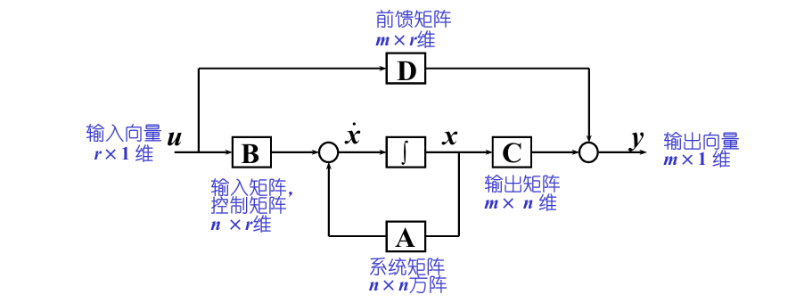

## 2、传递函数与状态空间模型

### ① 传递函数转化为状态空间模型

> 由状态空间模型可以唯一地转换为一个传递函数（阵）
>
> 由传递函数转换为状态空间模型，称为系统的实现问题

#### 能控规范型

- `Case I`：当传递函数的分子为常数项时
  $$
  \begin{flalign}
  &G(s)=\dfrac{Y(s)}{U(s)}=\dfrac{1}{s^n+a_{n-1}s^{n-1}+\cdots+a_1s+a_0}\\
  \\\phantom{G(s)}
  \xrightarrow{Laplace反变换}\qquad
  &
  \dfrac{d^ny(t)}{dt^n}+a_{n-1}\dfrac{d^{n-1}y(t)}{dt^{n-1}}+\cdots+a_1\dfrac{dy(t)}{dt}+a_0y(t)=u(t)\\
  \\\phantom{G(s)}
  \xrightarrow{定义状态变量}\qquad
  &\begin{cases}
  x_1=y\\
  x_2=\dot y\\
  \quad\vdots\\
  x_n=y^{(n-1)}
  \end{cases}\\
  \\\phantom{G(s)}
  \xrightarrow{定义状态向量}\qquad&\mathbf x=
  \left[
  \begin{matrix}
  x_1\\
  \vdots\\
  x_n
  \end{matrix}
  \right]\\
  \\\phantom{G(s)}
  \xrightarrow{一阶微分方程组}\qquad
  &\begin{cases}
  \dot x_1=\dot y = x_2\\
  \dot x_2=\ddot y = x_3\\
  \qquad\vdots\\
  \dot x_{n-1}=y^{(n-1)}=x_n\\
  \dot x_n=y^{n}=-a_0x_1-a_1x_2-\cdots-a_{n-1}x_n+u
  \end{cases}\\
  \\{状态空间方程}\qquad
  &\begin{cases}
  \mathbf{\dot x}=
  \left[
  \begin{matrix}
  0 &1 &0 &\cdots &0\\
  0 &0 &1 &\cdots &0\\
  \vdots &\vdots &\vdots &\cdots &\vdots\\
  0 &0 &1 &\cdots &0\\
  -a_0 &-a_1 &-a_2 &\cdots &-a_{n-1}\\
  \end{matrix}
  \right]\mathbf x+
  \left[
  \begin{matrix}
  0\\0\\\vdots\\0\\1
  \end{matrix}
  \right]\mathbf u
  \\\\
  \mathbf y=\left[
  \begin{matrix}
  1&0&\cdots&0
  \end{matrix}
  \right]\mathbf x
  \\
  \end{cases}
  \end{flalign}
  $$

- `Case II`：传递函数的分子为多项式 $m<n$
  $$
  \begin{flalign}
  &G(s)=\dfrac{Y(s)}{U(s)}=\dfrac{b_ms^m+b_{m_1}s^{m-1}+\cdots+b_1s+b_0}{s^n+a_{n-1}s^{n-1}+\cdots+a_1s+a_0}\\
  \\\phantom{G(s)}
  
  \xrightarrow{作变换}\qquad
  &
  \begin{cases}
  \dfrac{X_1(s)}{U(s)}=\dfrac{1}{s^n+a_{n-1}s^{n-1}+\cdots+a_1s+a_0}\\\\
  Y(s)=X_1(s)[b_ms^m+b_{m-1}s^{m-1}+\cdots+b_1s+b_0]
  \end{cases}\\
  \\\phantom{G(s)}
  \xrightarrow{根据\ \text{Case I}}\qquad
  &
  \mathbf{\dot x}=
  \left[
  \begin{matrix}
  0 &1 &0 &\cdots &0\\
  0 &0 &1 &\cdots &0\\
  \vdots &\vdots &\vdots &\cdots &\vdots\\
  0 &0 &0 &\cdots &1\\
  -a_0 &-a_1 &-a_2 &\cdots &-a_{n-1}\\
  \end{matrix}
  \right]\mathbf x+
  \left[
  \begin{matrix}
  0\\0\\\vdots\\0\\1
  \end{matrix}
  \right]\mathbf u
  \\
  \\\phantom{G(s)}
  \xrightarrow{Laplace\ 反变换}\qquad
  &
  \mathbf y=
  \left[
  \begin{matrix}
  b_0&b_1&\cdots&b_m&0\cdots&0
  \end{matrix}
  \right]
  \left[
  \begin{matrix}
  x_1\\\vdots\\x_{m+1}\\\vdots\\x_n
  \end{matrix}
  \right]
  \end{flalign}
  $$

- `Special Case I`：传递函数中只含有两两相异的实数极点​​​
  $$
  \begin{align}
  &G(s)=\dfrac{Y(s)}{U(s)}=\dfrac{\beta_{n-1}s^{n-1}+\cdots+\beta_1s+\beta_0}{(s-\lambda_1)\cdots(s-\lambda_n)}=\sum_{i=1}^n\dfrac{c_i}{s-\lambda_i}\\
  \\\phantom{G(s)}\xrightarrow{选取状态变量}\qquad&
  X_i(s)=\dfrac{U(s)}{s-\lambda_i}\qquad\dot x_i=\lambda_ix_i+u\qquad y(t)=c_1x_1+\cdots+c_nx_n\\
  \\\phantom{G(s)}\xrightarrow{状态空间}\qquad&
  \begin{cases}
  \mathbf{\dot x}
  =
  \left[
  \begin{matrix}
  \lambda_1&&&0&\\
  &\lambda_2&&\\
  &&&\ddots&\\
  &0&&&\lambda_n
  \end{matrix}
  \right]
  \mathbf x
  +
  \left[
  \begin{matrix}
  1\\1\\\vdots\\1
  \end{matrix}
  \right]
  \mathbf u\\\\
  \mathbf y=\left[
  \begin{matrix}
  C_1&C_2&\cdots&C_n
  \end{matrix}
  \right]\mathbf x
  \end{cases}
  \end{align}
  $$

  

- `Special Case II`：传递函数中有重实数极点
  $$
  \begin{align}
  &G(s)=\dfrac{c_1}{(s-\lambda_1)^3}+\dfrac{c_2}{(s-\lambda_1)^2}+\dfrac{c_3}{s-\lambda_1}+\sum_{j=2}^{n-2}\dfrac{d_j}{s-\lambda_j}\\
  \\\phantom{G(s)}\xrightarrow{选取状态变量}\qquad&
  \begin{cases}
  X_1(s)=\dfrac{X_2(s)}{s-\lambda_1}&\dot x_1=\lambda_1x_1+x_2\\
  X_2(s)=\dfrac{X_3(s)}{s-\lambda_1}&\dot x_2=\lambda_1x_2+x_3\\
  X_3(s)=\dfrac{U(s)}{s-\lambda_1}&\dot x_3=\lambda_1x_3+u\\
  X_4(s)=\dfrac{U(s)}{s-\lambda_2}&\dot x_4=\lambda_2x_4+u\\
  \qquad\quad\vdots&\qquad\vdots\\
  X_n(s)=\dfrac{U(s)}{s-\lambda_{n-2}}&\dot x_n=\lambda_{n-2}x_n+u
  \end{cases}\\
  \\\phantom{G(s)}\xrightarrow{状态空间}\qquad&
  \begin{cases}
  \mathbf{\dot x}
  =
  \left[
  \begin{matrix}
  \lambda_1&1&0&0&\cdots&0\\
  0&\lambda_1&1&0&\cdots&0\\
  0&0&\lambda_1&0&\cdots&0\\
  \vdots&\vdots&\vdots&\vdots&\ddots&\vdots\\
  0&0&0&0&\cdots&\lambda_{n-2}
  \end{matrix}
  \right]
  \mathbf x
  +
  \left[
  \begin{matrix}
  0\\0\\1\\\vdots\\1
  \end{matrix}
  \right]
  \mathbf u\\\\
  \mathbf y=\left[
  \begin{matrix}
  c_1&c_2&c_3&d_2&\cdots&d_{n-2}
  \end{matrix}
  \right]\mathbf x
  \end{cases}
  \end{align}
  $$

### ② 状态空间模型转换为传递函数（阵）

$$
\begin{cases}
\mathbf{\dot x}(t) = \mathbf{Ax}(t)+\mathbf{Bu}(t)
\\
\mathbf y(t) = \mathbf{Cx}(t)+\mathbf{Du}(t)
\end{cases}
$$

- Laplace 变换（零初始条件）
  $$
  s\mathbf X(s)=\mathbf A\mathbf X(s)+\mathbf B\mathbf U(s)\\
  \mathbf Y(s)=\mathbf C\mathbf X(s)+\mathbf D\mathbf U(s)
  $$

- 表达式
  $$
  \mathbf X(s)=(s\mathbf I-\mathbf A)^{-1}\mathbf B\mathbf U(s)\\
  \mathbf Y(s)=[\mathbf C(s\mathbf I-\mathbf A)^{-1}\mathbf B+\mathbf D]\mathbf U(s)
  $$

  - 其中，传递函数矩阵
    $$
    \mathbf C(s\mathbf I-\mathbf A)^{-1}\mathbf B+\mathbf D
    $$

    - 对于单输入单输出系统，上式即为传递函数

#### 离散状态空间表达式

$$
x(k+1)=Gx(k)+Hu(k)\\
y(k)=Cx(k)+Du(k)
$$

##### 化差分方程为离散状态方程

##### 化脉冲传递函数为离散状态方程

## 3、零阶保持器（ZOH）

- 数学模型：
  $$
  g_h(t) = 1(t) - 1(t - T), \quad G_h(s) = \frac{1 - e^{-Ts}}{s}\approx e^{-\frac{Ts}2}
  $$
  

- 特点：

  - 幅值随频率升高而衰减，具有低通特性
  - 引入相位滞后 $ \omega T/2 $，影响系统稳定性

- Z 变换
  $$
  G(z)=1-\dfrac1z
  $$

## 4、Z 变换

$$
X(z)=X^*(s)\bigg|_{z=e^{sT}}=\sum_{n=0}^{\infty}x(nT)z^{-n}=x(0)+x(T)z^{-1}+x(2T)z^{-2}+\cdots
$$

#### 正变换

- 级数求和法

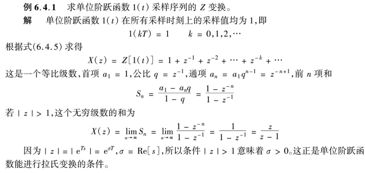

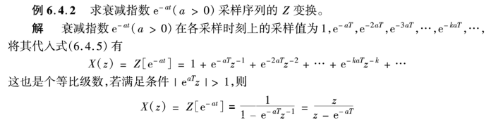

- 部分分式展开法

- 留数法

#### 反变换

- 长除法
  $$
  X(z)=\dfrac{N(z)}{D(z)}=\dfrac{b_0+b_1z^{-1}+b_2z^{-2}+\cdots+b_mz^{-m}}{a_0+a_1z^{-1}+a_2z^{-2}+\cdots+a_nz^{-n}}\qquad n\geq m
  $$
  

- 部分分式法

  

  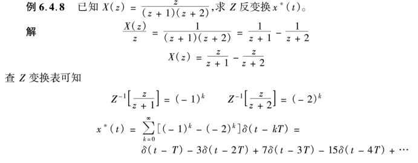

- 留数计算法

  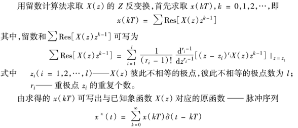

  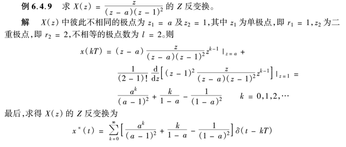

#### Z 变换表

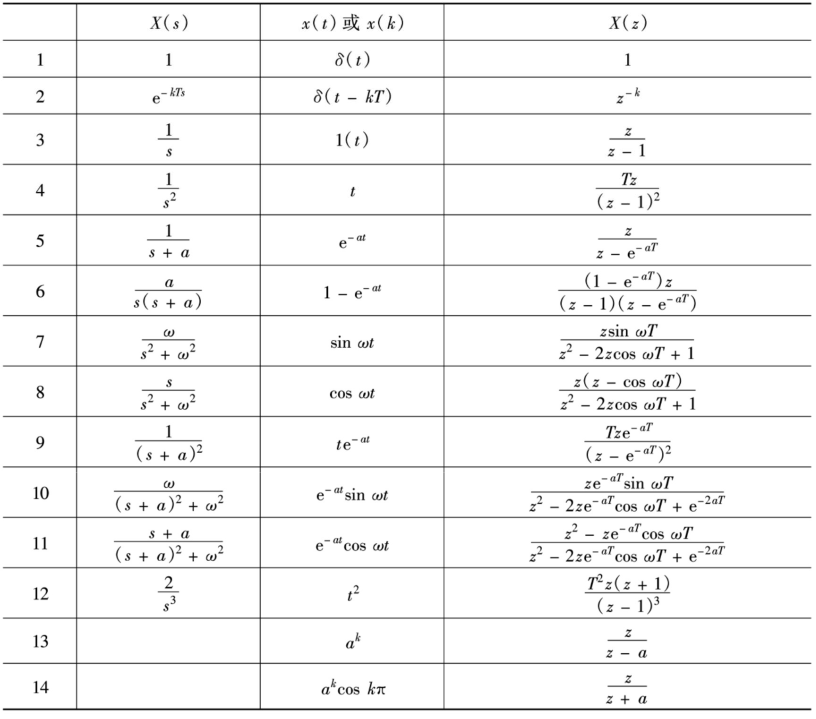

#### 性质定理

- z 变换的线性性质
  $$
  x(k)=\alpha f(k)+\beta g(k)\implies X(z)=\alpha F(z)+\beta G(z)
  $$

- 位移定理
  $$
  \mathcal Z[x(t-nT)]=z^{-n}X(z)\\
  \mathcal Z[x(t+nT)]=z^n[X(z)-\sum_{k=0}^{n-1}x(kT)z^{-k}]
  $$

- 初值定理

  - 若 $\mathcal Z[x(t)]=X(z)$，$x(t)=0,\forall t<0$
    $$
    x(0)=\lim_{t\rarr0}x^*(t)=\lim_{k\rarr0}x(kT)=\lim_{z\rarr\infty}X(z)
    $$

- 终值定理

  - 若 $\mathcal Z[x(t)]=X(z)$，且 $(z-1)X(z)$ 的全部极点都位于单位圆内
    $$
    x(\infty) = \lim_{t\rarr \infty}x^*(t)=\lim_{k\rarr \infty}x(kT)=\lim_{z\rarr 1}(z-1)X(z)
    $$

- 卷积定理
  $$
  X_1(z)X_2(z)=\mathcal Z\bigg[\sum_{m=0}^\infty x_1(mT)x_2(kT-mT)\bigg]
  $$

## 5、变换法求解差分方程

- 迭代法

  

- Z 变换法
  $$
  \mathcal Z[x(k-n)]=z^{-n}X(z)\\
  \mathcal Z[x(k+n)]=z^n\bigg[X(z)-\sum_{k=0}^{n-1}x(k)z^{-k}\bigg]
  $$
  

## 6、零阶保持器与环节串联

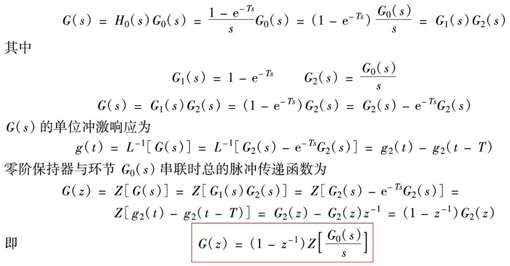

## 7、闭环脉冲传递函数

> 如果偏差信号不是以离散信号的形式输入到前向通道的第一个环节，则一般写不出闭环脉冲传递函数，只能写出输出的Z变换的表达式

- 叠加

  

> $$
> Z[G_1(s)G_2(s)X^*(s)]=Z[G_1(s)G_2(s)]X^*(s)=G_1G_2(z)X(z)
> $$

## 8、阶跃响应

$$
\Phi(z)=\dfrac{N(z)}{D(z)}=\dfrac{k\Pi_{i=1}^m(z-z_i)}{\Pi_{j=1}^n(z-p_i)}\qquad n>m
$$

- 其中 $z_i$ 为系统的闭环零点；$p_i$ 为系统闭环极点

$$
r(t) = 1(t)\implies R(z)=\dfrac{z}{z-1}
$$

则系统输出的 Z 变换为
$$
Y(z)=\Phi(z)R(z)=\dfrac{k\Pi_{i=1}^m(z-z_i)}{\Pi_{j=1}^n(z-p_i)}\dfrac{z}{z-1}
$$
当特征方程无重根时，$Y(z)$ 可展开为
$$
Y(z)=\dfrac{Az}{z-1}+\sum_{i=1}^n\dfrac{B_iz}{z-p_i}
$$

- 其中，$A=\dfrac{N(z)}{D(z)}\bigg|_{z=1}$  $B_i=\dfrac{N(z)(z-p_i)}{D(z)(z-1)}\bigg|_{z=p_i}$

Z 反变换可得
$$
y(kT)=A+\sum_{i=1}^nB_ip_i^k
$$

#### Case 1：实极点

第 $i$ 个实极点所对应的瞬态响应分量为
$$
y_i(kT)=B_ip_i^k
$$

#### Case2: 复数共轭极点

一对共轭复数极点 $p_{i,i+1}=a\pm jb$ 所对应的瞬态响应分量为
$$
y_i(kT)=A_i\lambda_i^k\cos(k\theta_i+\phi_i)
$$

- $A_i、\phi_i$ 为由部分分式展开式的系数所决定的常数
- $\lambda_i=\sqrt{a^2+b^2}=|p_i|$    $ \theta_i=\arctan\dfrac ba$

- 振荡的角频率由相角 $\theta_i$ 决定，为 $\omega_i=\dfrac{\theta_i}T$

## 9、基于脉冲传函的离散系统的瞬态响应分析

> 1. 求输出 $Y(z)$，利用 Z 的反变换，求解出 $y^*(t)$
> 2. 根据输出序列 $y(kT)$，求出动态性能指标

## 10、连续系统时域分析

$$
\mathbf{\dot x}(t)=\mathbf{Ax}(t)+\mathbf{Bu}(t)\qquad t\geq0,\ x_0=x(0)\\
$$

### 零输入响应

$$
x(t)=e^{At}x_0
$$

- 其中 $e^{At}=I+At+\dfrac1{2!}(At)^2+\cdots=\sum_{k=0}^\infty\dfrac1{k!}A^kt^k\\$ 

> **矩阵指数函数的性质**
>
> 1. $e^{At}\bigg|_{t=0}=I\\$
>
> 2. $e^{A(t+\tau)}=e^{At}e^{A\tau}$
>
> 3. $(e^{At})^{-1}=e^{-At}$
>
> 4. $AF=FA\implies e^{(A+F)t}=e^{At}e^{Ft}=e^{Ft}e^{At}$
>
> 5. $\dfrac d{dt}e^{At}=Ae^{At}=e^{At}A$
>
> 6. $\dfrac d{dt}(e^{At})^{-1}=\dfrac d{dt}e^{-At}=-Ae^{-At}=-e^{-At}A$
>
> 7. $(e^{At})^m=e^{A(mt)}$
>
> 8. 如果 $A$ 是 $n\times n$ 阶对角阵，则 $e^{At}$ 也是 $n\times n$​ 阶对角阵
>    $$
>    A=
>    \left[
>    \begin{matrix}
>    \lambda_1\\
>    & \lambda_2\\
>    &&\ddots\\
>    &&&\lambda_n
>    \end{matrix}
>    \right]
>    \implies
>    e^{At}=
>    \left[
>    \begin{matrix}
>    e^{\lambda_1t}\\
>    & e^{\lambda_2t}\\
>    &&\ddots\\
>    &&&e^{\lambda_nt}
>    \end{matrix}
>    \right]
>    $$

> **矩阵指数函数的计算**
>
> 1. 定义法
>    $$
>    e^{At}=I+At+\dfrac1{2!}(At)^2+\cdots=\sum_{k=0}^\infty\dfrac1{k!}A^kt^k\\
>    $$
>
> 2. 特征根法
>
>    给定矩阵 $A$，其 $n$ 个特征根 $\lambda_1,\lambda_2,\ldots,\lambda_n$ 两两相异，令由 $A$ 的属于各个特征根的右特征向量组成的变换矩阵为 $P=[v_1, v_2,\ldots, v_n]$，则
>    $$
>    e^{At}=P\left[
>    \begin{matrix}
>    e^{\lambda_1t}\\
>    & e^{\lambda_2t}\\
>    &&\ddots\\
>    &&&e^{\lambda_nt}
>    \end{matrix}
>    \right]P^{-1}
>    $$
>
>    > [!tip]
>    >
>    > - 右特征向量
>    >   $$
>    >   Av_i=\lambda_iv_i\\
>    >   $$
>    >
>    > - 右特征向量矩阵
>    >
>    > $$
>    > P=[v_1,v_2,\ldots,v_n]\\
>    >   P^{-1}=
>    >   \left[
>    >   \begin{matrix}
>    >   \bar v_1^T\\
>    >   \bar v_2^T\\
>    >   \vdots\\
>    >   \bar v_n^T
>    >   \end{matrix}
>    >   \right]
>    > $$
>    >
>    >   满足
>    > $$
>    > \sum_{i=1}^nv_i\bar v_i^T=I
>    > $$
>
>    - 重根情况
>
>      以 $A\in R^{5\times5}$ 为例，假设其特征根 $\lambda_1$ 具有代数重数 $3$ 和几何重数 $1$，特征根 $\lambda_2$ 具有代数重数 $2$ 和几何重数 $1$，标记由矩阵 $A$ 的属于 $\lambda_1, \lambda_2$ 的广义特征向量所构成的变换矩阵为 $Q$，且
>      $$
>      A=Q
>      \left[
>      \begin{matrix}
>      {\lambda_1}&1&0&0&0\\
>      0& {\lambda_1}&1&0&0\\
>      0&0&\lambda_1&0&0\\
>      0&0&0&{\lambda_2}&1\\
>      0&0&0&0&\lambda_2
>      \end{matrix}
>      \right]
>      Q^{-1}
>      $$
>      则：
>      $$
>      e^{At}=Q
>      \left[
>      \begin{matrix}
>      e^{\lambda_1t}&te^{\lambda_1t}&\dfrac1{2!}t^2e^{\lambda_1t}&0&0\\
>      0&e^{\lambda_1}&te^{\lambda_1t}&0&0\\
>      0&0&e^{\lambda_1}&0&0\\
>      0&0&0&e^{\lambda_2}&te^{\lambda_2t}\\
>      0&0&0&0&e^{\lambda_2}
>      \end{matrix}
>      \right]
>      Q^{-1}
>      $$
>
> 3. 预解矩阵法 / 拉氏变换法
>    $$
>    e^{At}=\mathcal L^{-1}(sI-A)^{-1}
>    $$

### 零状态响应

$$
\begin{align}
x_{0x}&=\int_0^te^{A(t-\tau)}Bu(\tau)d\tau\\
&=[e^A(t)B]*u(t)\\
&=\mathcal L^{-1}[(sI-A)^{-1}BU(s)]
\end{align}
$$

### LTI 系统的状态转移矩阵

对于齐次状态方程，若有 $x(t)=\Phi(t,t_0)x_0$，则称 $\Phi(t,t_0)$ 为系统的状态转移矩阵，也可写作 $\Phi(t-t_0)$

- 系统做自由运动时，他的运动形态唯一由状态转移矩阵决定，它包含了系统自由运动的全部信息

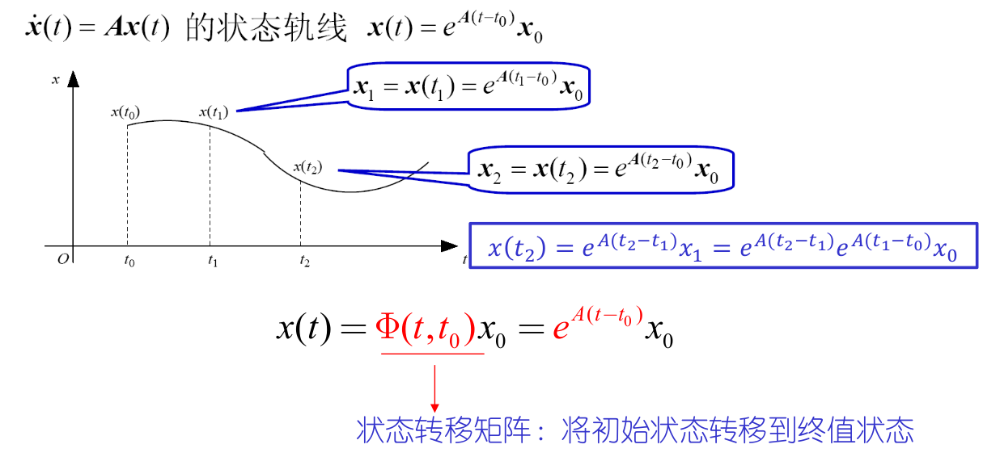

**状态转移矩阵的特性**

- 初始阵：$\Phi(0)=\Phi(t,t_0)=I$
- 逆：$\Phi^{-1}(t,t_0)=\Phi(t_0,t)$
- 传递性：$\Phi(t_2,t_1)\Phi(t_1,t_0)=\Phi(t_2,t_0)$
- 对时间求导：$\dfrac{d}{dt}\Phi(t,t_0)=A\Phi(t,t_0)=\Phi(t,t_0)A$

**LTI 系统的状态响应和输出响应**
$$
x(t)=e^{At}x_0+\int_0^te^{A(t-\tau)}Bu(\tau)d\tau=\Phi(t,t_0)x_0+\int_{t_0}^t\Phi(t,\tau)Bu(\tau)d\tau\\
y(t)=Ce^{A(t-t_0)}x_0+C\int_{t_0}^te^{A(t-\tau)}Bu(\tau)d\tau+Du(\tau)=C\Phi(t,t_0)x_0+C\int_{t_0}^t\Phi(t,\tau)Bu(\tau)d\tau+Du(t)
$$

##  11、离散系统时域分析

### 连续系统状态方程的离散化

$$
线性定常连续系统
\begin{cases}
\dot x(t)=Ax(t)+Bu(t)\\
y(t)=Cx(t)+Du(t)
\end{cases}
\implies
离散方程
\begin{cases}
x(k+1)=Gx(k)+Hu(k)\\
y(k)=Cx(k)+Du(k)
\end{cases}
$$

其中
$$
G=e^{AT}\qquad H=\big(\int_0^Te^{At}dt\big)B
$$

- 时间离散化不改变系统的时变或时不变属性

### 线性时不变离散系统状态方程的解

$$
x(k+1)=Gx(k)+Hu(k),\qquad x(0)=x_0
$$

- 迭代法
  $$
  x(1)=Gx(0)+Hu(0)\\
  x(2)=Gx(1)+Hu(1)\\
  \vdots\\
  x(k)=Gx(k-1)Hu(k-1)
  $$

  $$
  x(k)=G^kx_0+\sum_{i=0}^{k-1}G^{i}Hu(k-i-1)
  $$

  - 零输入响应：$G^kx_0$
  - 零状态响应：$\sum_{i=0}^{k-1}G^{i}Hu(k-i-1)\\$

- z 变换法
  $$
  zX(z)-zx_0=GX(z)+HU(z)\\
  x(k)=\mathcal Z^{-1}\bigg[(zI-G)^{-1}z\bigg]x_0+\mathcal Z^{-1}\bigg[(zI-G)^{-1}HU(z)\bigg]
  $$

> [!tip]
>
> 对于
> $$
> x(k+1)=Gx(k),\qquad x(0)=x_0
> $$
> 其零输入响应 $x_{0u}(k)$ ，满足 $\lim_{k\rarr\infty}x_{0u}(k)=0\\$ 当且仅当矩阵 $G$ 的所有特征根的模均小于 $1$

### 离散系统的状态转移矩阵

$$
\phi(k+1)=G(k)\phi(k), \qquad\phi(0)=I\\
\darr\\
\phi(k)=G^k
$$

- 对于线性时变系统：$\phi(k+1,m)=G(k)\phi(k,m), \qquad\phi(m,m)=I$

#### **求法**

##### 定义法

$$
\phi(k)=G^k
$$

##### z 变换法

$$
\phi(k)=G^k=\mathcal Z^{-1}\bigg[(zI-G)^{-1}z\bigg]
$$

##### 化矩阵 G 为标准型

- $G$​ 的特征根为单根
  $$
  \phi(k)=G^{k}=P\Lambda^kP^{-1}=P
  \left[
  \begin{matrix}
  \lambda_1\\
  &\ddots\\
  &&\lambda_n
  \end{matrix}
  \right]
  P^{-1}
  $$

  - 其中
    $$
    P=[v_1\quad v_2\quad \cdots\quad v_n]
    $$

- $G$ 的特征根有重根
  $$
  \phi(k)=G^k=QJ^kQ^{-1}
  $$

  - 其中，$J$ 为约旦标准型，$Q$ 为化系统矩阵 $G$ 为约旦标准型的变换矩阵

##### 化矩阵 $G$ 为有限项

- 根据 凯莱-哈密尔顿 定理，系统矩阵 $G$ 满足自身的零化多项式
  $$
  \phi(k)=\alpha_0(k)I+\alpha_1(k)G+\alpha_2(k)G^2+\cdots+\alpha_{n-1}(k)G^{n-1}
  $$

  

## 12、离散系统稳定性

> 线性离散系统稳定的充要条件为：线性离散系统的全部特征根 $z_i$ 都分布在 $z$ 平面的单位圆之内（或者说模都小于 $1$）

### 劳斯稳定判据

双线性变换（ $w$ 变换）
$$
z = \dfrac{w+1}{w-1}
$$
然后可以在 $W$ 域使用劳斯稳定判据间接判别（**特殊情况的处理方法与连续情形的处理方法类似**）

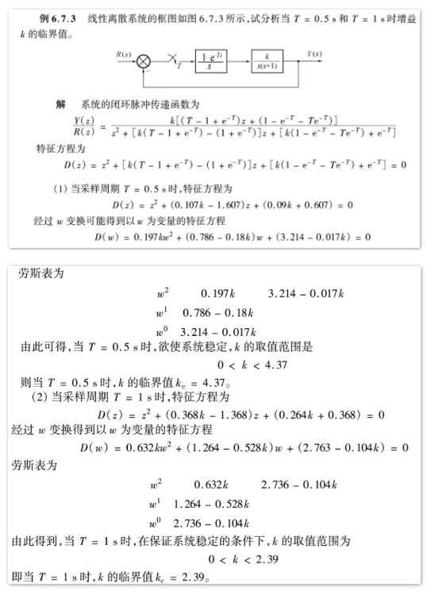

## 13、离散系统稳态误差分析

### 利用终值定理

1. 判定稳定性

2. 求误差脉冲传递函数
   $$
   \Phi_e(z)=\dfrac{E(z)}{R(z)}=\dfrac{1}{1+GH(z)}
   $$

3. 用终值定理求 $e_{ss}^*(\infty)$
   $$
   e_{ss}^*(\infty)=\lim_{t\rarr\infty}e^*(t)=\lim_{z\rarr1}(z-1)E(z)=\lim_{z\rarr1}\dfrac{(z-1)}{1+GH(z)}R(z)
   $$

> 适用于系统稳定， $r(t) $作用，对误差采样的线性定常离散系统

### 静态误差系数法

$$
K_p=\lim_{z\rarr1}GH(z)\\
K_v=\lim_{z\rarr1}(z-1)GH(z)\\
K_a=\lim_{z\rarr1}(z-1)^2GH(z)\\
$$

### 动态误差系数法

将 $z=e^{sT}$ 代入到 $\Phi_e(z)$ 中
$$
\Phi_e^*(s)=\Phi_e(z)\bigg|_{z=e^{sT}}=\Phi_e(0)+\dfrac1{1!}\Phi_e'(0)s+\dfrac1{2!}\Phi_e''(0)s^2+\cdots+\dfrac{1}{m!}\Phi_e^{(m)}(0)s^m+\cdots
$$
计算动态误差系数
$$
c_m=\dfrac1{m!}\dfrac{d^m\Phi_e^*(s)}{ds^m}\bigg|_{s=0}
$$
得到
$$
\Phi_e^*(s)=c_0+c_1s+c_2s^2+\cdots+c_ms^m+\cdots=\sum_{i=0}^\infty c_is^i\\
E^*(s)=\Phi_e^*(s)R(s)=c_0R(s)+c_1sR(s)+\cdots+c_ms^mR(s)+\cdots\\
e_{ss}^*(kT)=c_0r(kT)+c_1\dot r(kT)+c_2\ddot r(kT)+\cdots+c_mr^{(m)}(kT)+\cdots
$$

> [!tip]
>
> 需要先对分式求导，再令 $s=0$
> $$
> \Phi_e(z)=\dfrac{1}{1+G(z)H(z)}
> $$

## 12、Lyapunov 稳定性

> [!important]
>
> 对于线性系统而言，系统稳定性和平衡状态稳定性是一回事
>
> - 线性定常系统所有平衡点的稳定性是相同的
> - 对于非零平衡点，经过状态平移，均可转换为原点，并且状态矩阵不变
> - 因此，只需判断原点是否为该系统的稳定（渐近稳定）平衡点，即可判断该系统是否稳定（渐近稳定）
>
> $$
> 稳定\rarr一致稳定\\
> 渐近稳定\rarr大范围一致渐近稳定
> $$
>
> 对于非线性系统，即使原点是渐近稳定的，也需要验证无穷远特性，才能确定是否为全局渐近稳定

### Lyapunov 第一法（间接法）

##### 定理

对于线性定常系统 $\dot x=Ax，x(0)=x_0，t\geq0$，系统的唯一平衡状态 $x_e=0$ 时渐近稳定的充要条件：$A$ 的所有特征值均具有负实部

- 如果只有一个或一对特征值（非重根）的实部等于零，其余特征值实部均小于零，$x(t)$ 便含有常数项或三角函数项，则系统是 Lyapunov 意义下稳定的

### Lyapunov 第二法（直接法）

> 线性系统，通常用二次型函数 $x^TPx$ 作为 Lyapunov 函数

> [!TIP]
>
> 实对称矩阵 $A$ 是正定（半正定）的
>
> 1. 当且仅当所有特征值均大于（大于等于）$0$
> 2. 当且仅当所有主子式均大于（大于等于）$0$

#### 定常系统大范围渐近稳定判别定理 1

对于定常系统
$$
\dot x=f(x)\qquad t\geq 0
$$
其中 $f(0)=0$，如果存在一个具有连续一阶导数的标量函数 $V(x)$，满足 $V(0)=0$，并且对于状态空间 $X$ 中的一切非零点 $x$ 均有

- $V(x)$ 正定
- $\dot V(x)$ 负定
- 当 $||x||\rarr\infty$ 时，有 $V(x)\rarr\infty$

则系统的**原点**平衡状态是大范围渐近稳定的

> [!note]
>
> 满足前两点则**渐近稳定**，三点都满足则**全局渐近稳定**

> [!tip]
>
> 多平衡点时，“全局” 通常不成立，因为状态可能流向其他平衡点，故需要先明确原点是系统的唯一平衡状态

#### 定常系统大范围渐近稳定判别定理 2

对于定常系统，如果存在一个具有连续一阶导数的标量 $V(x)$，满足 $V(0)=0$，并且对于状态空间 $X$ 中的一切非零点 $x$ 均有

- $V(x)$ 正定
- $\dot V(x)$ 负**半**定
- 对任意 $x\in X$，有 $\dot V(x(t;x_0,0))\not\equiv0$   （ $\dot V(x)$ 除原点外，沿状态轨线不恒为 $0$ ）
- 当 $||x||\rarr\infty$ 时，有 $V(x)\rarr\infty$

则系统的**原点**平衡状态是大范围渐近稳定的

> [!note]
>
> 满足前两点则**稳定**，再满足第三点则**渐近稳定**，再满足第四点则**全局渐近稳定**

#### 不稳定判别定理

对于定常系统，如果存在一个具有连续一阶导数的标量 $V(x)$，满足 $V(0)=0$，和围绕原点的域 $\Omega$，使得对于一切 $x\in\Omega$ 和一切 $t\geq t_0$，满足

- $V(x)$ 正定
- $\dot V(x)$ 正定

则系统的**原点**平衡状态为不稳定

> [!caution]
>
> 以上三个定理均为充分条件。某 $V(x)$ 不满足定理条件时，不能下结论

### 线性定常系统的 Lyapunov 稳定性分析

线性定常连续系统渐近稳定的充要条件是：给定一个正定矩阵 $P$ ( $x^TPx$ 是该系统的一个 Lyapunov 函数），存在满足 Lyapunov 矩阵代数方程的正定矩阵 $Q$
$$
A^TP+PA=-Q
$$

> [!tip]
>
> 最好是先选取 $Q$ 为正定实对称矩阵，再求解方程
>
> - 若求得 $P$ 为正定实对称矩阵，则可判定系统是渐近稳定的；否则系统不是渐近稳定的
>
> 通常选取 $Q$ 为单位阵或对角阵，因此简化为
> $$
> A^TP+PA=-I
> $$

> [!note]
>
> 若系统任意状态轨迹在非零状态不存在 $\dot V(x)=0$ 时，由定理 2 可知
>
> - $Q$ 可选择为半正定的，即允许 $Q$ 取半正定对角阵时，主对角线上部分元素为 $0$
> - 而解得的 $P$ 仍为正定

> [!important]
>
> 对于离散系统
> $$
> x(k+1)=\Phi x(k)
> $$
>
> - 用 $\Delta V(x)=V(x(k+1))-V(x(k))$ 代替 $\dot V(x)$
>
> 离散 Lyapunov 矩阵代数方程
> $$
> \Phi^TP\Phi-P=-Q
> $$
>
> - 通常取 $Q=I$

## 13、频率域稳定判据

- 奈奎斯特稳定判据
  $$
  Z=P-2N
  $$

  - $Z$：右半平面的闭环极点个数

  - $P$：右半平面的开环极点个数

  - $N$：开环幅相曲线 $G(j\omega)H(j\omega)$ 包围 $(-1,j0)$ 点的圈数
    $$
    N=N_+-N_-
    $$

    - $N_+$：正穿越次数，由上而下穿过  $(-1,j0)$ 点左侧的实轴
    - $N_-$：负穿越次数，由下而上穿过  $(-1,j0)$ 点左侧的实轴

- 对数稳定判据

  - 与 Nyquist 图对应

    - Nyquist 图上的单位圆对应 Bode 图上的 $0dB$ 线
      - 单位圆内 $\rarr$ $0dB$ 线以上
      - 单位圆外 $\rarr$ $0dB$ 线以下
    - Nyquist 图上的负实轴对应 Bode 图上的 $-180\degree$ 线

    > Nyquist 图上 $(-1,j0)$ 点左侧的负实轴对应于
    >
    > - 幅频特性 $0dB$ 线以上
    > - 相频特性的 $180\degree$ 线上 

    - 存在积分环节的情形
      - Nyquist 图需要补圆
      - Bode 图在相频曲线 $\omega=0_+$ 处，由下向上补画一条虚线，该虚线通过的相角为 $v90\degree$

  - 定义 $N$

    - 穿越：当 $L(\omega)$ 大于 $0dB$ 时，$\phi(\omega)$ 穿过 $-180\degree$ 线
    - 正穿越：由下而上（半次：从 $-180\degree$ 线开始向上）
    - 负穿越，由上而下（半次：从 −180° 线开始向下）

    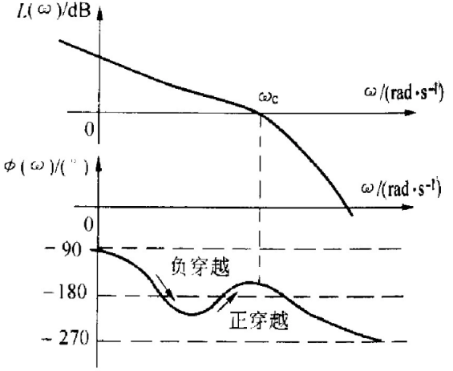

## 14、稳定裕度 ( 相对稳定性 )

### 相角裕度

剪切频率 $\omega_c$：Nyquist 曲线穿越单位圆、幅频响应穿越频率轴（横轴）时的频率

相角裕度 $\gamma$ 
$$
\gamma = \angle G(j\omega_c)H(j\omega_c)-(-180\degree)= 180\degree+ \angle G(j\omega_c)H(j\omega_c)
$$

- 负实轴与 $OA$ 的角度，逆时针为正

  

  

> [!note]
>
> 相角裕度表示开环 Nyquist 图与单位圆的交点沿单位圆与 $(-1,j0)$ 的远近程度
>
> 若系统剪切频率 $\omega_c$ 处的相位再减小 $\gamma$ ，则 $\phi(\omega_c)=-180\degree$，Nyquist 曲线过 $(-1,j0)$，系统处于临界稳定状态
>
> 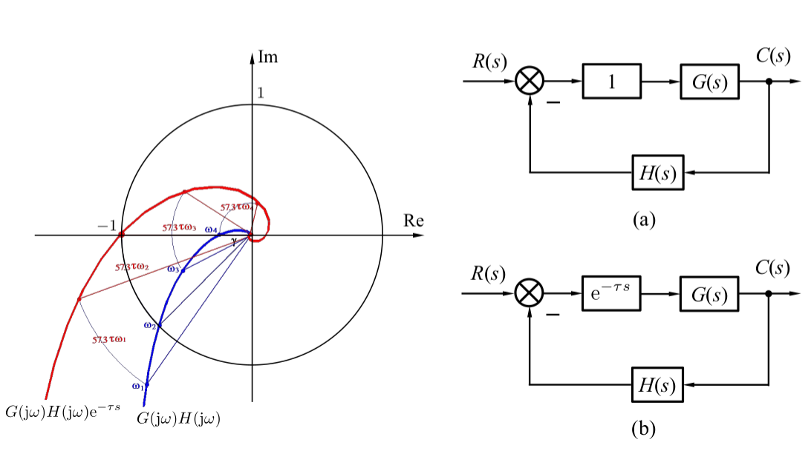

### 幅值裕度

相位穿越频率 $\omega_g$：开环频率特性相角为 $-180\degree$ 的频率

幅值裕度 $K_g$
$$
\begin{cases}
K_g&=\dfrac{1}{|G(j\omega_g)H(j\omega_g)|}\qquad(\text{Nyquist 图})\\
20\lg K_g&=-20\lg|G(j\omega)H(j\omega)|\ dB\qquad(\text{Bode 图})
\end{cases}
$$

-  负幅值裕度，是对数域中的表述，目的是快速判断系统是否稳定，而非裕度本身具有负属性

> [!note]
>
> 幅值裕度表示开环 Nyquist 图与负实轴的交点离  $(-1,j0)$ 的远近程度
>
> 若系统的开环增益增大到原来的 $K_g$  倍，则  $A(\omega_g)=1$，Nyquist 曲线过 $(-1,j0)$，系统处于临界稳定状态
>
> 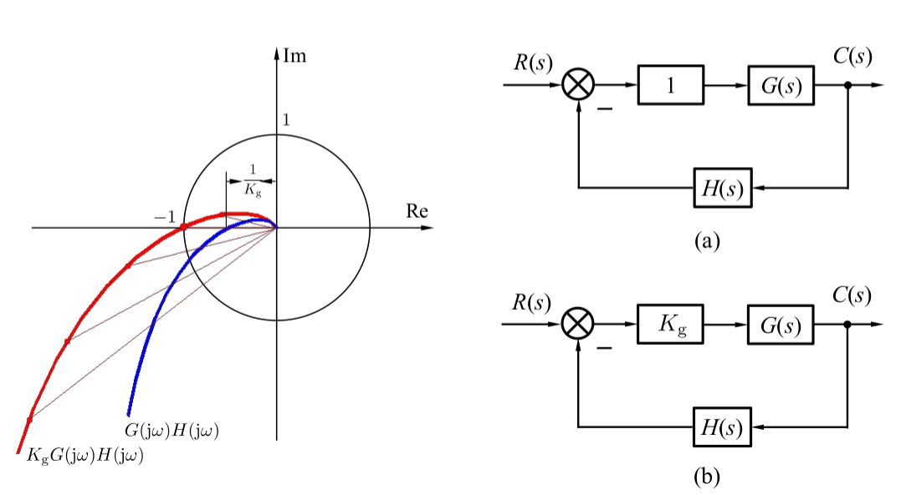

> [!important]
>
> - 对于一些复杂系统，可以求出多个相角裕度和幅值裕度，这时，以最小的值作为相角裕度和幅值裕度
> - 对于一阶、二阶的系统，或开环传递函数 $n-m=1或2$  的系统，如果其开环频率特性的 Nyquist 图与负实轴不相交，则 $K_g=\infty$
>
> 
