# 一、控制系统的数学模型

## 1、线性连续系统状态空间模型

|          输入输出模型          |            状态空间模型            |
| :----------------------------: | :--------------------------------: |
|      单输入单输出（SISO）      |        多入多出系统（MIMO）        |
|     线性时不变系统（LTI）      |        线性系统、非线性系统        |
| 仅描述输入输出关系（外部特性） |        全面描述系统动态特性        |
|        传递函数、频域法        | 频域法、时域法、微分方程、差分方程 |
|          经典控制理论          |            现代控制理论            |

###  ① 状态空间表达

- `状态变量`：确定动态系统状态的最小一组变量 $x_1(t),\cdots,x_n(t)$，构成了系统变量中的极大线性无关组
  
  - 特点
    - 独立性：状态变量之间线性独立
    - 多样性：状态变量的选取并不唯一，实际上存在无穷多种方案
    - 等价性：两个状态向量之间只差一个非奇异线性变换
    - 现实性：状态变量通常取为含义明确的物理量
    - 抽象性：状态变量可以没有直观的物理意义
- `状态`
  
  - 动态系统的状态是系统的最小一组变量（状态变量）
  - 只要知道了 $t=t_0$ 的一组状态变量和时刻 $t>t_0$ 的输入量，就能够完全确定系统在未来的行为
- `状态向量`：$n$ 个状态变量构成状态向量 $x(t)=[x_1(t),\cdots,x_n(t)]^T$
- `状态空间`
  
  - 状态向量张成的函数空间
  - 在 $t$ 时刻的状态向量就是状态空间中的一个点
- `状态轨迹`：以 $x(t)=x(t_0)$ 为起点，随时间推移，$x(t)$ 在状态空间绘出的一条轨迹
  
- `状态方程`：描述系统状态与输入之间的关系的一阶微分方程组

- `输出方程`：描述系统输出与状态、输入之间关系的表达式

- 状态空间表达式
  $$
  \begin{cases}
  \mathbf{\dot x}(t) = \mathbf{Ax}(t)+\mathbf{Bu}(t)\qquad&——状态方程
  \\
  \mathbf y(t) = \mathbf{Cx}(t)+\mathbf{Du}(t)\qquad&——输出方程
  \end{cases}
  $$

  - 初始条件：$t\geq0,x_0=x(0)$
  - 状态向量：$\mathbf{x}\in R^n$ ，输入向量：$\mathbf{u}\in R^m$，输出向量：$\mathbf{y}\in R^q$
  - 状态矩阵（系统矩阵）：$\mathbf{A}\in R^{n\times n}$，控制矩阵（输入矩阵）：$\mathbf{B}\in R^{n\times m}$ 
  - 输出矩阵：$\mathbf{C}\in R^{q\times n}$，前馈矩阵：$\mathbf{D}\in R^{q\times m}$

  > 常用 $\sum(A,B,C,D)$ 来表示系统

  

### ② 传递函数转化为状态空间模型

> 由状态空间模型可以唯一地转换为一个传递函数（阵）
>
> 由传递函数转换为状态空间模型，称为系统的实现问题

#### 能控规范型

- `Case I`：当传递函数的分子为常数项时
  $$
  \begin{flalign}
  &G(s)=\dfrac{Y(s)}{U(s)}=\dfrac{1}{s^n+a_{n-1}s^{n-1}+\cdots+a_1s+a_0}\\
  \\\phantom{G(s)}
  \xrightarrow{Laplace反变换}\qquad
  &
  \dfrac{d^ny(t)}{dt^n}+a_{n-1}\dfrac{d^{n-1}y(t)}{dt^{n-1}}+\cdots+a_1\dfrac{dy(t)}{dt}+a_0y(t)=u(t)\\
  \\\phantom{G(s)}
  \xrightarrow{定义状态变量}\qquad
  &\begin{cases}
  x_1=y\\
  x_2=\dot y\\
  \quad\vdots\\
  x_n=y^{(n-1)}
  \end{cases}\\
  \\\phantom{G(s)}
  \xrightarrow{定义状态向量}\qquad&\mathbf x=
  \left[
  \begin{matrix}
  x_1\\
  \vdots\\
  x_n
  \end{matrix}
  \right]\\
  \\\phantom{G(s)}
  \xrightarrow{一阶微分方程组}\qquad
  &\begin{cases}
  \dot x_1=\dot y = x_2\\
  \dot x_2=\ddot y = x_3\\
  \qquad\vdots\\
  \dot x_{n-1}=y^{(n-1)}=x_n\\
  \dot x_n=y^{n}=-a_0x_1-a_1x_2-\cdots-a_{n-1}x_n+u
  \end{cases}\\
  \\{状态空间方程}\qquad
  &\begin{cases}
  \mathbf{\dot x}=
  \left[
  \begin{matrix}
  0 &1 &0 &\cdots &0\\
  0 &0 &1 &\cdots &0\\
  \vdots &\vdots &\vdots &\cdots &\vdots\\
  0 &0 &1 &\cdots &0\\
  -a_0 &-a_1 &-a_2 &\cdots &-a_{n-1}\\
  \end{matrix}
  \right]\mathbf x+
  \left[
  \begin{matrix}
  0\\0\\\vdots\\0\\1
  \end{matrix}
  \right]\mathbf u
  \\\\
  \mathbf y=\left[
  \begin{matrix}
  1&0&\cdots&0
  \end{matrix}
  \right]\mathbf x
  \\
  \end{cases}
  \end{flalign}
  $$
  
- `Case II`：传递函数的分子为多项式 $m<n$
  $$
  \begin{flalign}
  &G(s)=\dfrac{Y(s)}{U(s)}=\dfrac{b_ms^m+b_{m_1}s^{m-1}+\cdots+b_1s+b_0}{s^n+a_{n-1}s^{n-1}+\cdots+a_1s+a_0}\\
  \\\phantom{G(s)}
  
  \xrightarrow{作变换}\qquad
  &
  \begin{cases}
  \dfrac{X_1(s)}{U(s)}=\dfrac{1}{s^n+a_{n-1}s^{n-1}+\cdots+a_1s+a_0}\\\\
  Y(s)=X_1(s)[b_ms^m+b_{m-1}s^{m-1}+\cdots+b_1s+b_0]
  \end{cases}\\
  \\\phantom{G(s)}
  \xrightarrow{根据\ \text{Case I}}\qquad
  &
  \mathbf{\dot x}=
  \left[
  \begin{matrix}
  0 &1 &0 &\cdots &0\\
  0 &0 &1 &\cdots &0\\
  \vdots &\vdots &\vdots &\cdots &\vdots\\
  0 &0 &0 &\cdots &1\\
  -a_0 &-a_1 &-a_2 &\cdots &-a_{n-1}\\
  \end{matrix}
  \right]\mathbf x+
  \left[
  \begin{matrix}
  0\\0\\\vdots\\0\\1
  \end{matrix}
  \right]\mathbf u
  \\
  \\\phantom{G(s)}
  \xrightarrow{Laplace\ 反变换}\qquad
  &
  \mathbf y=
  \left[
  \begin{matrix}
  b_0&b_1&\cdots&b_m&0\cdots&0
  \end{matrix}
  \right]
  \left[
  \begin{matrix}
  x_1\\\vdots\\x_{m+1}\\\vdots\\x_n
  \end{matrix}
  \right]
  \end{flalign}
  $$

- `Special Case I`：传递函数中只含有两两相异的实数极点​​​
  $$
  \begin{align}
  &G(s)=\dfrac{Y(s)}{U(s)}=\dfrac{\beta_{n-1}s^{n-1}+\cdots+\beta_1s+\beta_0}{(s-\lambda_1)\cdots(s-\lambda_n)}=\sum_{i=1}^n\dfrac{c_i}{s-\lambda_i}\\
  \\\phantom{G(s)}\xrightarrow{选取状态变量}\qquad&
  X_i(s)=\dfrac{U(s)}{s-\lambda_i}\qquad\dot x_i=\lambda_ix_i+u\qquad y(t)=c_1x_1+\cdots+c_nx_n\\
  \\\phantom{G(s)}\xrightarrow{状态空间}\qquad&
  \begin{cases}
  \mathbf{\dot x}
  =
  \left[
  \begin{matrix}
  \lambda_1&&&0&\\
  &\lambda_2&&\\
  &&&\ddots&\\
  &0&&&\lambda_n
  \end{matrix}
  \right]
  \mathbf x
  +
  \left[
  \begin{matrix}
  1\\1\\\vdots\\1
  \end{matrix}
  \right]
  \mathbf u\\\\
  \mathbf y=\left[
  \begin{matrix}
  C_1&C_2&\cdots&C_n
  \end{matrix}
  \right]\mathbf x
  \end{cases}
  \end{align}
  $$
  
  

  
- `Special Case II`：传递函数中有重实数极点
  $$
  \begin{align}
  &G(s)=\dfrac{c_1}{(s-\lambda_1)^3}+\dfrac{c_2}{(s-\lambda_1)^2}+\dfrac{c_3}{s-\lambda_1}+\sum_{j=2}^{n-2}\dfrac{d_j}{s-\lambda_j}\\
  \\\phantom{G(s)}\xrightarrow{选取状态变量}\qquad&
  \begin{cases}
  X_1(s)=\dfrac{X_2(s)}{s-\lambda_1}&\dot x_1=\lambda_1x_1+x_2\\
  X_2(s)=\dfrac{X_3(s)}{s-\lambda_1}&\dot x_2=\lambda_1x_2+x_3\\
  X_3(s)=\dfrac{U(s)}{s-\lambda_1}&\dot x_3=\lambda_1x_3+u\\
  X_4(s)=\dfrac{U(s)}{s-\lambda_2}&\dot x_4=\lambda_2x_4+u\\
  \qquad\quad\vdots&\qquad\vdots\\
  X_n(s)=\dfrac{U(s)}{s-\lambda_{n-2}}&\dot x_n=\lambda_{n-2}x_n+u
  \end{cases}\\
  \\\phantom{G(s)}\xrightarrow{状态空间}\qquad&
  \begin{cases}
  \mathbf{\dot x}
  =
  \left[
  \begin{matrix}
  \lambda_1&1&0&0&\cdots&0\\
  0&\lambda_1&1&0&\cdots&0\\
  0&0&\lambda_1&0&\cdots&0\\
  \vdots&\vdots&\vdots&\vdots&\ddots&\vdots\\
  0&0&0&0&\cdots&\lambda_{n-2}
  \end{matrix}
  \right]
  \mathbf x
  +
  \left[
  \begin{matrix}
  0\\0\\1\\\vdots\\1
  \end{matrix}
  \right]
  \mathbf u\\\\
  \mathbf y=\left[
  \begin{matrix}
  c_1&c_2&c_3&d_2&\cdots&d_{n-2}
  \end{matrix}
  \right]\mathbf x
  \end{cases}
  \end{align}
  $$

### ③ 状态空间模型转换为传递函数（阵）

$$
\begin{cases}
\mathbf{\dot x}(t) = \mathbf{Ax}(t)+\mathbf{Bu}(t)
\\
\mathbf y(t) = \mathbf{Cx}(t)+\mathbf{Du}(t)
\end{cases}
$$

- Laplace 变换（零初始条件）
  $$
  s\mathbf X(s)=\mathbf A\mathbf X(s)+\mathbf B\mathbf U(s)\\
  \mathbf Y(s)=\mathbf C\mathbf X(s)+\mathbf D\mathbf U(s)
  $$

- 表达式
  $$
  \mathbf X(s)=(s\mathbf I-\mathbf A)^{-1}\mathbf B\mathbf U(s)\\
  \mathbf Y(s)=[\mathbf C(s\mathbf I-\mathbf A)^{-1}\mathbf B+\mathbf D]\mathbf U(s)
  $$

  - 其中，传递函数矩阵
    $$
    \mathbf C(s\mathbf I-\mathbf A)^{-1}\mathbf B+\mathbf D
    $$

    - 对于单输入单输出系统，上式即为传递函数

> 若两个状态空间模型有着相同的传递函数，则说明两个系统是等价的
>
> - 即存在一个 非奇异变换矩阵 $T$
>   $$
>   T\mathbf A_1T^{-1}=\mathbf A_2\\
>   T\mathbf B_1=\mathbf B_2
>   $$
>
> - 数学描述
>
>   - 给定系统 $S(A,B,C,D)$，引入线性变换
>     $$
>     \bar x=Tx
>     $$
>
>   - 其中，$T$ 是 $n\times n$ 的非奇异矩阵，则可以得到系统 $\bar \Sigma(\bar A,\bar B,\bar C,\bar D)\\$
>     $$
>     \bar A=TAT^{-1}\qquad\bar B=TB\\
>     \bar C=CT^{-1}\qquad\bar D=D\\
>     \bar x(0)=Tx(0)
>     $$
>
>     - 称系统 $S$ 和系统 $\bar \Sigma\\$ 是等价的
>
> - 用途：通过线性变换，可将状态方程变成对角线或约当标准型（或其它标准型）
>
> - 对于等价的系统，必然有一些不变的特征
>
>   - 等价的状态空间模型具有相同的传递函数
>   - 等价的状态空间模型具有相同的特征多项式、特征方程、极点

## 2、线性离散系统数学模型

### ① 概念

- **采样过程及其数学描述**

  - 采样器（采样开关）：把连续信号变换为脉冲序列
  - 采样过程：用一个周期性闭合的采样开关 S 表示
    - 理想采样过程
      - $\tau \ll T$：认为采样瞬时完成
      - 字长足够：认为 $e^*(kT)=e(kT)$
  - 采样频率 $f_s=\dfrac 1T$
  - 采样角频率 $\omega_s=2\pi f_s=\dfrac{2\pi}T$

- **采样信号（冲激采样）的拉氏变换（关于 $s$ 的超越方程）**
  $$
  E^*(s)=\mathcal{L}(e^*(t))=e(0)+e(T)e^{-Ts}+e(2T)e^{-2Ts}+\cdots=\sum_{k=0}^{\infty}e(kT)e^{-kTs}
  $$

  - 其中：$e^*(t)=e(t)\delta_T(t)=e(t)\sum_{k=0}^{\infty}\delta(t-kT)\\$

- **连续信号的 z 变换（关于 $z$ 代数方程）**
  $$
  E^*(s)\bigg|_{s=\dfrac1T\ln z}=\sum_{k=0}^\infty e(kT)z^{-k}=E(z)
  $$

> 冲激采样信号的拉普拉斯变换 = 连续信号的 z 变换

- **采样信号的频谱**  
  
  设连续信号 $ e(t) $ 的傅里叶变换为 $ E(j\omega) $，则采样信号 $ e^*(t) $ 的频谱为：
  $$
  E^*(j\omega) = \frac{1}{T} \sum_{n=-\infty}^{\infty} E\left[j(\omega - n\omega_s)\right]
  $$
  - 频谱是原信号频谱的周期延拓，周期为 $ \omega_s $
  - 若 $ \omega_s < 2\omega_h $（$ \omega_h $ 为信号最高频率），则发生频谱混叠（Aliasing）
  
- **Shannon 采样定理**  
  
  若连续信号 $ e(t) $ 的最高频率分量为 $ f_h $，则采样频率必须满足：
  $$
  f_s \geq 2f_h \quad \text{或} \quad \omega_s \geq 2\omega_h
  $$
  才能无失真地从采样信号中恢复原信号

- **理想低通滤波器**  
  
  理论上可完全恢复原信号，但物理不可实现
  
- **零阶保持器（ZOH）**  
  - 数学模型：
    $$
    g_h(t) = 1(t) - 1(t - T), \quad G_h(s) = \frac{1 - e^{-Ts}}{s}\approx e^{-\frac{Ts}2}
    $$
    
    
  - 特点：
    - 幅值随频率升高而衰减，具有低通特性
    - 引入相位滞后 $ \omega T/2 $，影响系统稳定性
    
  - Z 变换
    $$
    G(z)=1-\dfrac1z
    $$
    

### ② Z 变换

$$
X(z)=X^*(s)\bigg|_{z=e^{sT}}=\sum_{n=0}^{\infty}x(nT)z^{-n}=x(0)+x(T)z^{-1}+x(2T)z^{-2}+\cdots
$$

#### 正变换

- 级数求和法

- 部分分式展开法

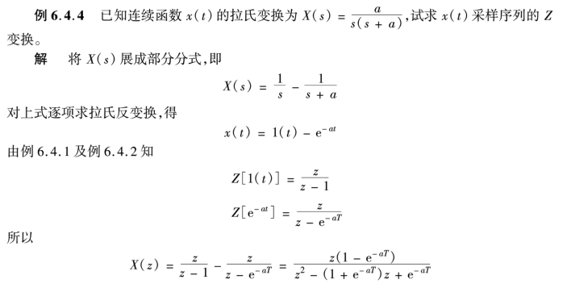

- 留数法

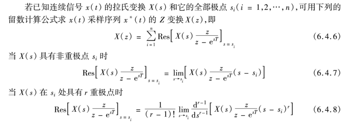

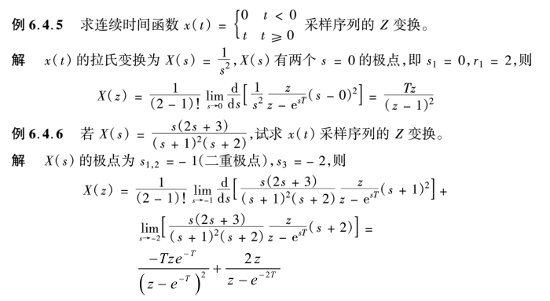

#### 反变换

- 长除法
  $$
  X(z)=\dfrac{N(z)}{D(z)}=\dfrac{b_0+b_1z^{-1}+b_2z^{-2}+\cdots+b_mz^{-m}}{a_0+a_1z^{-1}+a_2z^{-2}+\cdots+a_nz^{-n}}\qquad n\geq m
  $$
  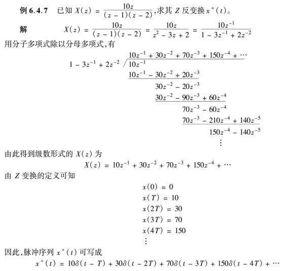

- 部分分式法

  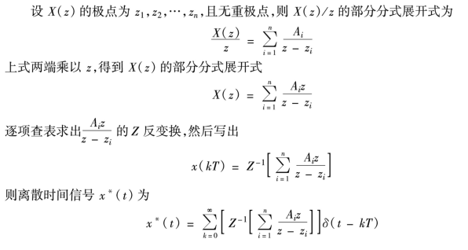

  

- 留数计算法

  

  

#### Z 变换表

#### 性质定理

- z 变换的线性性质
  $$
  x(k)=\alpha f(k)+\beta g(k)\implies X(z)=\alpha F(z)+\beta G(z)
  $$
  
- 位移定理
  $$
  \mathcal Z[x(t-nT)]=z^{-n}X(z)\\
  \mathcal Z[x(t+nT)]=z^n[X(z)-\sum_{k=0}^{n-1}x(kT)z^{-k}]
  $$
  
- 初值定理

  - 若 $\mathcal Z[x(t)]=X(z)$，$x(t)=0,\forall t<0$
    $$
    x(0)=\lim_{t\rarr0}x^*(t)=\lim_{k\rarr0}x(kT)=\lim_{z\rarr\infty}X(z)
    $$
    

- 终值定理

  - 若 $\mathcal Z[x(t)]=X(z)$，且 $(z-1)X(z)$ 的全部极点都位于单位圆内
    $$
    x(\infty) = \lim_{t\rarr \infty}x^*(t)=\lim_{k\rarr \infty}x(kT)=\lim_{z\rarr 1}(z-1)X(z)
    $$
    

- 卷积定理
  $$
  X_1(z)X_2(z)=\mathcal Z\bigg[\sum_{m=0}^\infty x_1(mT)x_2(kT-mT)\bigg]
  $$
  

### ③ 线性离散系统的三种数学模型

#### 1、差分方程（时域数学模型）

##### 线性常系数差分方程

- $n$ 阶后向差分方程
  $$
  y(k)+a_1y(k-1)+\cdots+a_ny(k-n)=b_0r(k)+b_1r(k-1)+\cdots+b_mr(k-m)
  $$

  - 表达式
    $$
    y(k)=-\sum_{i=1}^na_iy(k-i)+\sum_{j=0}^mb_jr(k-j)\qquad n\geq m
    $$

  - $kT$ 时刻的输出 $y(k)$ 不仅与 $kT$ 时刻的输入 $r(k)$ 相关，还与 $kT$ 时刻以前的输入 $r(k-1),r(k-2),…$ 和输出（初始条件） $y(k-1),y(k-2),…$ 有关

- $n$ 阶前向差分方程
  $$
  y(k+n)+a_1y(k+n-1)+\cdots+a_ny(k)=b_0r(k+m)+b_1r(k+m-1)+\cdots+b_mr(k)
  $$

  - 表达式
    $$
    y(k+n)=-\sum_{i=1}^na_iy(k+n-i)+\sum_{j=0}^mb_jr(k+m-j)\qquad n\geq m
    $$

  - 前向/后向差分方程无本质区别

  - 若不考虑初始条件，仅就输入与输出关系而言，二者等价

##### 迭代法和 Z 变换法求解差分方程

- 迭代法

  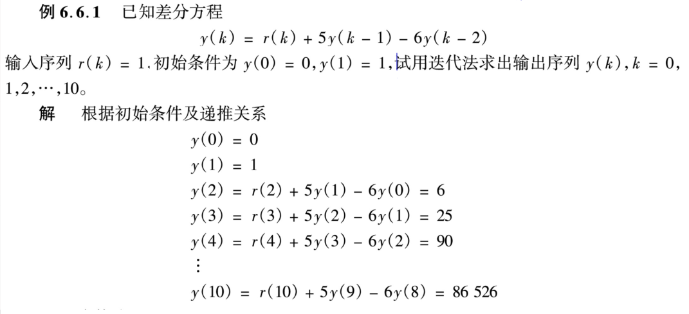

- Z 变换法
  $$
  \mathcal Z[x(k-n)]=z^{-n}X(z)\\
  \mathcal Z[x(k+n)]=z^n\bigg[X(z)-\sum_{k=0}^{n-1}x(k)z^{-k}\bigg]
  $$
  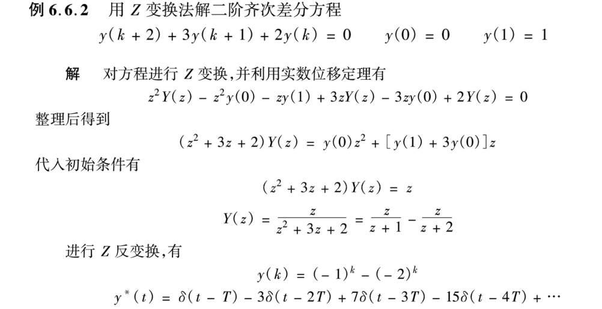

#### 2、脉冲传递函数（复域数学模型）

##### 概念

- 已知一个连续系统的传递函数为 $G(s)$ ，则通过对 $G(s)$ 的单位脉冲响应 $g(t)$ 的采样序列 $g^*(t)$ 求 Z 变换，可得该环节的脉冲传递函数 $G ( z ) =\mathcal Z[ g^ * (t )]$

- 性质
  - $G(z)$ 是关于 $z$ 的复函数
  - $G(z)$ 与输入输出序列无关，仅与系统的结构参数有关
  - $G(z)$ 与系统差分方程一一对应
  - $G(z)$ 相当于系统单位脉冲响应序列的 z 变换
  - $G(z)$ 对应 z 平面零极点图
- 局限性
  - 原则上不反映非零初始条件下系统响应的全部信息
  - 一般只适合描述单输入单输出离散系统
  - 只适用于描述线性定常离散系统

##### 串联环节的脉冲传递函数

- 串联环节间无同步采样开关

  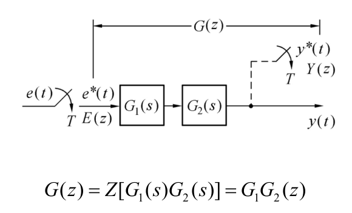

- 串联环节间有同步采样开关

  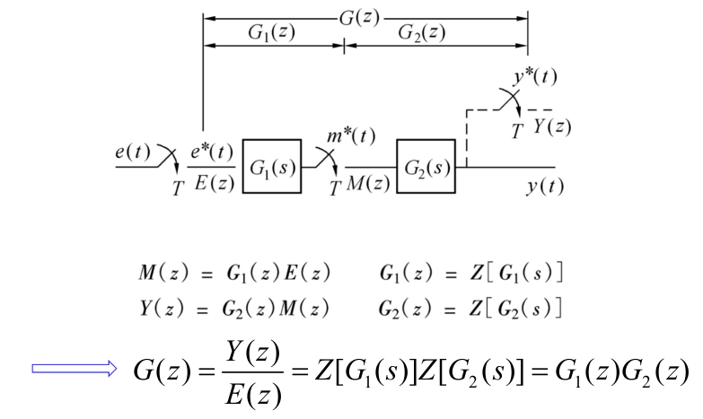

> 串联环节中有无同步采样开关隔离，脉冲传递函数是不同的（零点不同，极点相同）

- 零阶保持器与环节串联

  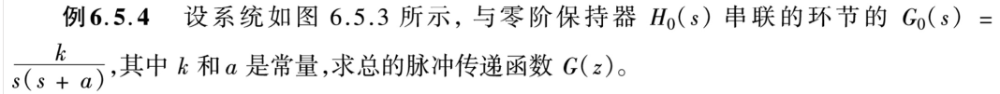

  

  

  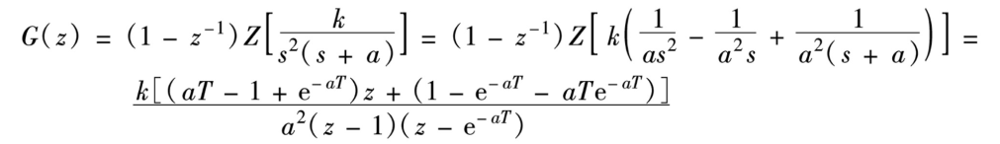

> 增加 ZOH 不改变系统的阶数，不改变开环极点，只改变开环零点

- 闭环脉冲传递函数

  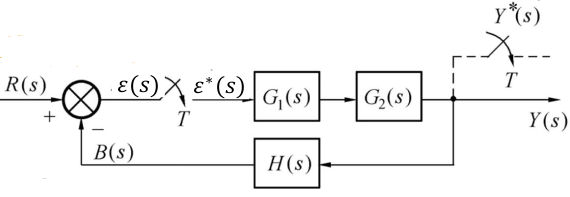

  

> 如果偏差信号不是以离散信号的形式输入到前向通道的第一个环节，则一般写不出闭环脉冲传递函数，只能写出输出的Z变换的表达式

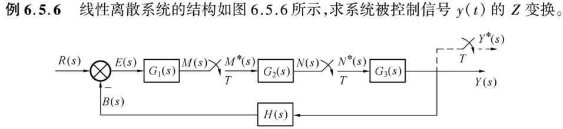

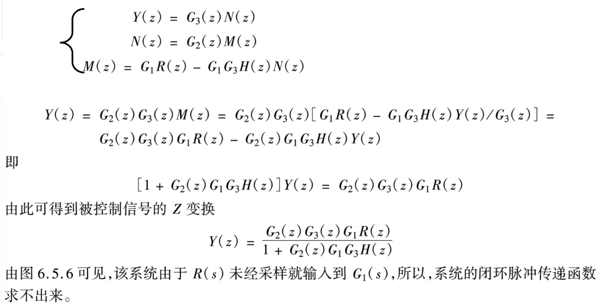

- 叠加

  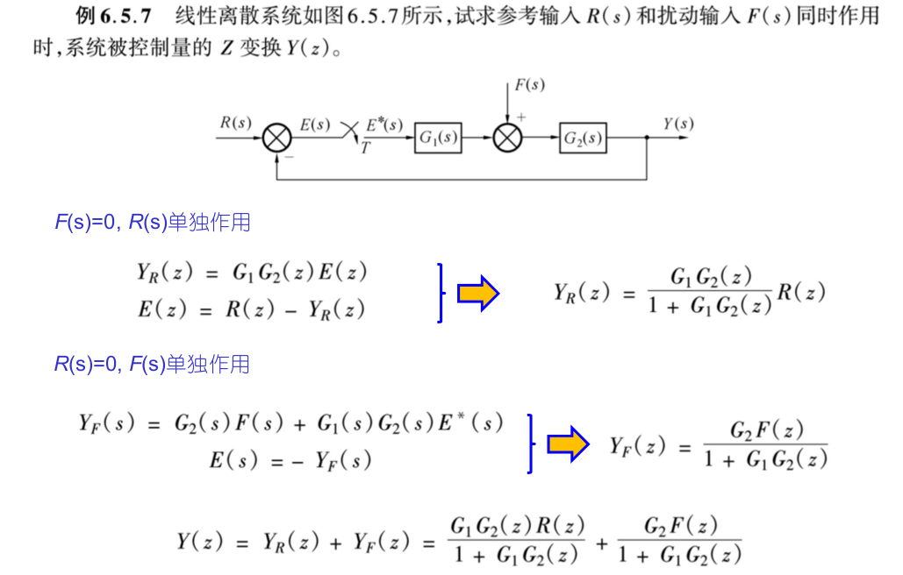

> $$
> Z[G_1(s)G_2(s)X^*(s)]=Z[G_1(s)G_2(s)]X^*(s)=G_1G_2(z)X(z)
> $$

##### 常见线性离散系统的方框图及被控信号的 Z 变换

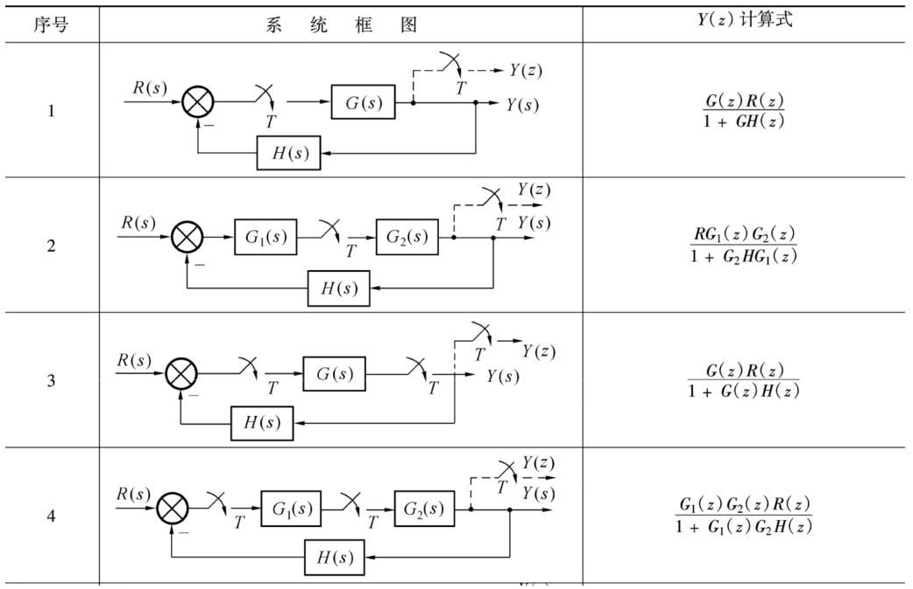

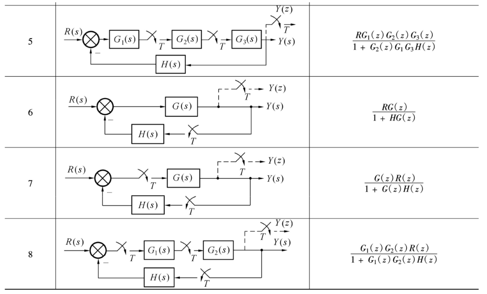

#### 3、离散状态空间表达式

$$
x(k+1)=Gx(k)+Hu(k)\\
y(k)=Cx(k)+Du(k)
$$

##### 化差分方程为离散状态方程

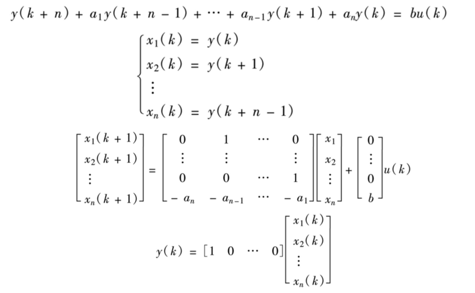

##### 化脉冲传递函数为离散状态方程

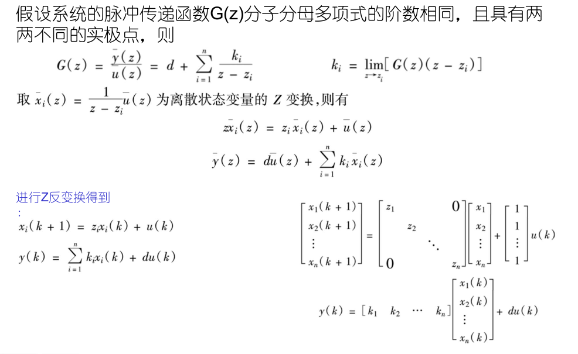

# 二、控制系统的时域分析

## 1、基于脉冲传递函数的离散系统时域分析

脉冲传递函数（Z 传递函数）
$$
G(z)=\dfrac{\mathcal Z[y^*(t)]}{\mathcal Z[x^*(t)]}=\dfrac{Y(z)}{X(z)}
$$
闭环脉冲传递函数
$$
\Phi(z)=\dfrac{N(z)}{D(z)}=\dfrac{k\Pi_{i=1}^m(z-z_i)}{\Pi_{j=1}^n(z-p_i)}\qquad n>m
$$

- 其中 $z_i$ 为系统的闭环零点；$p_i$ 为系统闭环极点

### ① 阶跃响应

$$
r(t) = 1(t)\implies R(z)=\dfrac{z}{z-1}
$$

则系统输出的 Z 变换为
$$
Y(z)=\Phi(z)R(z)=\dfrac{k\Pi_{i=1}^m(z-z_i)}{\Pi_{j=1}^n(z-p_i)}\dfrac{z}{z-1}
$$
当特征方程无重根时，$Y(z)$ 可展开为
$$
Y(z)=\dfrac{Az}{z-1}+\sum_{i=1}^n\dfrac{B_iz}{z-p_i}
$$

- 其中，$A=\dfrac{N(z)}{D(z)}\bigg|_{z=1}$  $B_i=\dfrac{N(z)(z-p_i)}{D(z)(z-1)}\bigg|_{z=p_i}$

Z 反变换可得
$$
y(kT)=A+\sum_{i=1}^nB_ip_i^k
$$

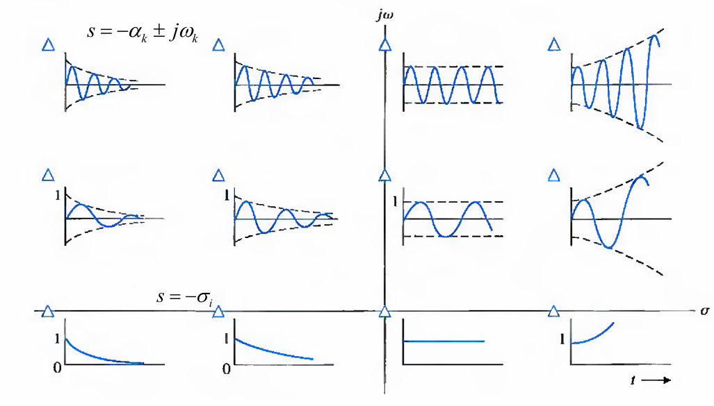

#### Case 1：实极点

第 $i$ 个实极点所对应的瞬态响应分量为
$$
y_i(kT)=B_ip_i^k
$$
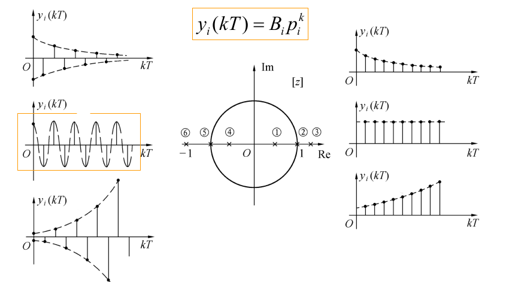

- 若 $0<p_i<1$，极点在单位圆内正实轴上，其对应的瞬态响应序列单调地衰减
- 若 $p_i=1$，相应的瞬态响应是不变号的等幅序列
- 若 $p_i>1$,极点在单位圆外正实轴上，对应的瞬态响应序列单调地发散
- 若 $-1<p_i<0$，极点在单位圆内负实轴上,对应的瞬态响应是正、负交替变号的衰减振荡序列,角频率为 $\dfrac\pi T$
- 若 $p_i=-1$，对应的瞬态响应是正、负交替变号的等幅序列,振荡的角频率为 $\dfrac\pi T$
- 若 $p_i<-1$，极点在单位圆外负实轴上，相应的瞬态响应序列是正、负交替变号的发散序列，振荡的角频率为 $\dfrac\pi T$

#### Case2: 复数共轭极点

一对共轭复数极点 $p_{i,i+1}=a\pm jb$ 所对应的瞬态响应分量为
$$
y_i(kT)=A_i\lambda_i^k\cos(k\theta_i+\phi_i)
$$

- $A_i、\phi_i$ 为由部分分式展开式的系数所决定的常数
- $\lambda_i=\sqrt{a^2+b^2}=|p_i|$    $ \theta_i=\arctan\dfrac ba$

若 $\lambda_i=|p_i|<1$，极点在单位圆之内，这对共轭复数极点所对应的瞬态响应是收敛振荡的脉冲序列，角频率为 $\dfrac{\theta_i}T$
若 $\lambda_i=|p_i|=1$，这对共轭复数极点在单位圆上，其瞬态响应是等幅振荡的脉冲序列，振荡的角频率为 $\dfrac{\theta_i}T$
若 $\lambda_i=|p_i|>1$，极点在单位圆之外，这对共轭复数极点所对应的瞬态响应是振荡发散的脉冲序列.角频率为 $\dfrac{\theta_i}T$

#### 振荡与极点的关系

上述振荡过程中，振荡的角频率都是由相角 $\theta_i$ 决定，为 $\omega_i=\dfrac{\theta_i}T$

角度 $\theta_i$ 越小，振荡的频率越低，一个振荡周期中包含的采样周期越多

一个振荡周期中所含采样周期的个数 $N$ 可由下式求出
$$
N=\dfrac{\omega_s}{\omega_i}=\dfrac{2\pi}{\theta_i}
$$

- 当 $\theta_i=\pi$ 时，极点在负实轴上， $\omega_i=\dfrac{\pi}T=\dfrac12\omega_s$，对应离散系统中频率最高的振荡
- 这种高频振荡即使收敛的，也会频繁切换动作，加剧机构磨损
- 所以实际设计时应避免极点位于单位圆内负实轴上，或是与正实轴夹角接近 $\pi$ 的情况

### ② 基于脉冲传函的离散系统的瞬态响应分析

> 1. 求输出 $Y(z)$，利用 Z 的反变换，求解出 $y^*(t)$
> 2. 根据输出序列 $y(kT)$，求出动态性能指标

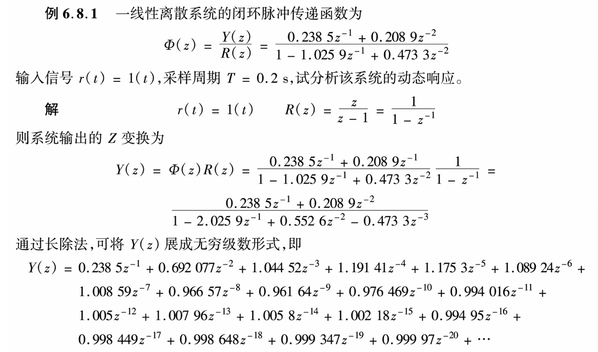

## 2、基于状态空间的时域分析

### ① 连续系统时域分析

> 系统的时域分析：本质是求解系统状态方程，以解析形式或数值形式，建立系统状态随着输入和初始状态的演化规律

$$
\mathbf{\dot x}(t)=\mathbf{Ax}(t)+\mathbf{Bu}(t)\qquad t\geq0,\ x_0=x(0)\\
$$

- 解的存在性和唯一性：输入向量 $\mathbf u(t)$ 的各个元素在时间定义区间上平方可积
  $$
  \int_{t_0}^{t_a}[u_i(t)]^2dt<\infty\qquad i=1,\ldots,m
  $$

- 线性系统满足叠加性定理
  $$
  x(t)=\phi(t,t_0,x_0,0)+\phi(t,t_0,0,u)\\
  \begin{align}
  \text{零输入响应（自由运动）：}& \dot x=Ax,\quad x(t_0)=x_0,\quad t\geq0,\quad x_{0u}=\phi(t,t_0,x_0,0)\\
  \text{零状态响应（强迫运动）：}& x_{0x}(t)=\phi(t,t_0,0,u)
  \end{align}
  $$

#### 零输入响应

$$
x(t)=e^{At}x_0
$$

- 其中 $e^{At}=I+At+\dfrac1{2!}(At)^2+\cdots=\sum_{k=0}^\infty\dfrac1{k!}A^kt^k\\$ 

> **矩阵指数函数的性质**
>
> 1. $e^{At}\bigg|_{t=0}=I\\$
>
> 2. $e^{A(t+\tau)}=e^{At}e^{A\tau}$
>
> 3. $(e^{At})^{-1}=e^{-At}$
>
> 4. $AF=FA\implies e^{(A+F)t}=e^{At}e^{Ft}=e^{Ft}e^{At}$
>
> 5. $\dfrac d{dt}e^{At}=Ae^{At}=e^{At}A$
>
> 6. $\dfrac d{dt}(e^{At})^{-1}=\dfrac d{dt}e^{-At}=-Ae^{-At}=-e^{-At}A$
>
> 7. $(e^{At})^m=e^{A(mt)}$
>
> 8. 如果 $A$ 是 $n\times n$ 阶对角阵，则 $e^{At}$ 也是 $n\times n$​ 阶对角阵
>    $$
>    A=
>    \left[
>    \begin{matrix}
>    \lambda_1\\
>    & \lambda_2\\
>    &&\ddots\\
>    &&&\lambda_n
>    \end{matrix}
>    \right]
>    \implies
>    e^{At}=
>    \left[
>    \begin{matrix}
>    e^{\lambda_1t}\\
>    & e^{\lambda_2t}\\
>    &&\ddots\\
>    &&&e^{\lambda_nt}
>    \end{matrix}
>    \right]
>    $$

> **矩阵指数函数的计算**
>
> 1. 定义法
>    $$
>    e^{At}=I+At+\dfrac1{2!}(At)^2+\cdots=\sum_{k=0}^\infty\dfrac1{k!}A^kt^k\\
>    $$
>
> 2. 特征根法
>
>    给定矩阵 $A$，其 $n$ 个特征根 $\lambda_1,\lambda_2,\ldots,\lambda_n$ 两两相异，令由 $A$ 的属于各个特征根的右特征向量组成的变换矩阵为 $P=[v_1, v_2,\ldots, v_n]$，则
>    $$
>    e^{At}=P\left[
>    \begin{matrix}
>    e^{\lambda_1t}\\
>    & e^{\lambda_2t}\\
>    &&\ddots\\
>    &&&e^{\lambda_nt}
>    \end{matrix}
>    \right]P^{-1}
>    $$
>
>    - 重根情况
>
>      以 $A\in R^{5\times5}$ 为例，假设其特征根 $\lambda_1$ 具有代数重数 $3$ 和几何重数 $1$，特征根 $\lambda_2$ 具有代数重数 $2$ 和几何重数 $1$，标记由矩阵 $A$ 的属于 $\lambda_1, \lambda_2$ 的广义特征向量所构成的变换矩阵为 $Q$，且
>      $$
>      A=Q
>      \left[
>      \begin{matrix}
>      {\lambda_1}&1&0&0&0\\
>      0& {\lambda_1}&1&0&0\\
>      0&0&\lambda_1&0&0\\
>      0&0&0&{\lambda_2}&1\\
>      0&0&0&0&\lambda_2
>      \end{matrix}
>      \right]
>      Q^{-1}
>      $$
>      则：
>      $$
>      e^{At}=Q
>      \left[
>      \begin{matrix}
>      e^{\lambda_1t}&te^{\lambda_1t}&\dfrac1{2!}t^2e^{\lambda_1t}&0&0\\
>      0&e^{\lambda_1}&te^{\lambda_1t}&0&0\\
>      0&0&e^{\lambda_1}&0&0\\
>      0&0&0&e^{\lambda_2}&te^{\lambda_2t}\\
>      0&0&0&0&e^{\lambda_2}
>      \end{matrix}
>      \right]
>      Q^{-1}
>      $$
>
> 3. 预解矩阵法 / 拉氏变换法
>    $$
>    e^{At}=\mathcal L^{-1}(sI-A)^{-1}
>    $$

#### 零状态响应

$$
\begin{align}
x_{0x}&=\int_0^te^{A(t-\tau)}Bu(\tau)d\tau\\
&=[e^A(t)B]*u(t)\\
&=\mathcal L^{-1}[(sI-A)^{-1}BU(s)]
\end{align}
$$

#### 基于特征结构的状态响应表达

对于特征值两两相异的 $n$ 维连续时间 LTI 系统
$$
e^{At}=\sum_{i=1}^nv_i\bar v_i^Te^{\lambda_i t}=\sum_{i=1}^n\bar w_iw_i^Te^{\lambda_it}
$$

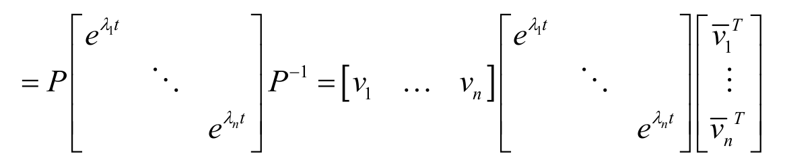

> [!note]
>
> - 右特征向量
>   $$
>   Av_i=\lambda_iv_i\\
>   $$
>- 右特征向量矩阵
> $$
> P=[v_1,v_2,\ldots,v_n]\\
>   P^{-1}=
>   \left[
>   \begin{matrix}
>   \bar v_1^T\\
>   \bar v_2^T\\
>   \vdots\\
>   \bar v_n^T
>   \end{matrix}
>   \right]
> $$
>   满足
> $$
>   \sum_{i=1}^nv_i\bar v_i^T=I
> $$
>   - 左特征向量
>$$
> w_i^TA=w_i^T\lambda_i\\
> $$
>   - 一般都使用列向量，所以取转置
>   
>- 右特征向量矩阵
>   $$
>    T=\left[
>   \begin{matrix}
>   w_1^T\\
>   w_2^T\\
>   \vdots\\
>   w_n^T
>   \end{matrix}
>   \right]\\
>                             
>   T^{-1}=[\bar w_1^T,\bar w_2^T,\ldots,\bar w_n^T]\\
>   $$
>   满足
>   $$
>   \sum_{i=1}^n\bar w_iw_i^T=I
>   $$
>   

- 基于特征结构的零输入响应（特征根两两相异）
  $$
  x_{0u}(t)=e^{At}x_0=\sum_{i=1}^n(v_i\bar v_i^T)x_0e^{\lambda_it}=\sum_{i=1}^n(\bar w_iw_i^T)x_0e^{\lambda_it}\qquad t\geq 0\\
  $$

- 基于特征结构的零状态响应（特征根两两相异）
  $$
  x_{0x}(t)=\sum_{i=1}^n(v_i\bar v_i^T)\bigg[\sum_{j=1}^pb_j\int_0^te^{\lambda_i(t-\tau)}u_j(\tau)d\tau\bigg]=\sum_{i=1}^n(\bar w_iw_i^T)\bigg[\sum_{j=1}^pb_j\int_0^te^{\lambda_i(t-\tau)}u_j(\tau)d\tau\bigg]\qquad t\geq 0\\
  $$

> 状态响应的运动模式主要由特征值决定
>
> - 对实数特征值，运动模式为指数函数模式
> - 共轭复数特征值，运动模式为指数正余弦函数形式
> - 特征值具有负实部，则运动模式随时间单调地或振荡地衰减至稳态过程
> - 特征值具有正实部，则运动模式随时间单调地或振荡地扩散到无穷大而不能达到稳态
>
> 特征向量对状态响应的影响
>
> - 状态响应可以看成是各个特征值相应运动模式的一个线性组合
> - 特征向量的影响体现于对于不同运动模式的“权重”上
> - 特征向量对状态响应的影响本质上属于“量”而非“质”的范畴
>   - 即只能影响各个运动模式在组合中的比重，一般不能影响各个运动模式本身

#### LTI 系统的状态转移矩阵

对于齐次状态方程，若有 $x(t)=\Phi(t,t_0)x_0$，则称 $\Phi(t,t_0)$ 为系统的状态转移矩阵，也可写作 $\Phi(t-t_0)$

- 系统做自由运动时，他的运动形态唯一由状态转移矩阵决定，它包含了系统自由运动的全部信息

**状态转移矩阵的特性**

- 初始阵：$\Phi(0)=\Phi(t,t_0)=I$
- 逆：$\Phi^{-1}(t,t_0)=\Phi(t_0,t)$
- 传递性：$\Phi(t_2,t_1)\Phi(t_1,t_0)=\Phi(t_2,t_0)$
- 对时间求导：$\dfrac{d}{dt}\Phi(t,t_0)=A\Phi(t,t_0)=\Phi(t,t_0)A$

**LTI 系统的状态响应和输出响应**
$$
x(t)=e^{At}x_0+\int_0^te^{A(t-\tau)}Bu(\tau)d\tau=\Phi(t,t_0)x_0+\int_{t_0}^t\Phi(t,\tau)Bu(\tau)d\tau\\
y(t)=Ce^{A(t-t_0)}x_0+C\int_{t_0}^te^{A(t-\tau)}Bu(\tau)d\tau+Du(\tau)=C\Phi(t,t_0)x_0+C\int_{t_0}^t\Phi(t,\tau)Bu(\tau)d\tau+Du(t)
$$

### ② 离散系统时域分析

#### 连续系统状态方程的离散化

$$
线性定常连续系统
\begin{cases}
\dot x(t)=Ax(t)+Bu(t)\\
y(t)=Cx(t)+Du(t)
\end{cases}
\implies
离散方程
\begin{cases}
x(k+1)=Gx(k)+Hu(k)\\
y(k)=Cx(k)+Du(k)
\end{cases}
$$

其中
$$
G=e^{AT}\qquad H=\big(\int_0^Te^{At}dt\big)B
$$

- 时间离散化不改变系统的时变或时不变属性

#### 线性时不变离散系统状态方程的解

$$
x(k+1)=Gx(k)+Hu(k),\qquad x(0)=x_0
$$

- 迭代法
  $$
  x(1)=Gx(0)+Hu(0)\\
  x(2)=Gx(1)+Hu(1)\\
  \vdots\\
  x(k)=Gx(k-1)Hu(k-1)
  $$

  $$
  x(k)=G^kx_0+\sum_{i=0}^{k-1}G^{i}Hu(k-i-1)
  $$

  - 零输入响应：$G^kx_0$
  - 零状态响应：$\sum_{i=0}^{k-1}G^{i}Hu(k-i-1)\\$

- z 变换法
  $$
  zX(z)-zx_0=GX(z)+HU(z)\\
  x(k)=\mathcal Z^{-1}\bigg[(zI-G)^{-1}z\bigg]x_0+\mathcal Z^{-1}\bigg[(zI-G)^{-1}HU(z)\bigg]
  $$

> [!tip]
>
> 对于
> $$
> x(k+1)=Gx(k),\qquad x(0)=x_0
> $$
> 其零输入响应 $x_{0u}(k)$ ，满足 $\lim_{k\rarr\infty}x_{0u}(k)=0\\$ 当且仅当矩阵 $G$ 的所有特征根的模均小于 $1$

#### 离散系统的状态转移矩阵

$$
\phi(k+1)=G(k)\phi(k), \qquad\phi(0)=I\\
\darr\\
\phi(k)=G^k
$$

- 对于线性时变系统：$\phi(k+1,m)=G(k)\phi(k,m), \qquad\phi(m,m)=I$

**求法**

- 定义法
  $$
  \phi(k)=G^k
  $$

- z 变换法
  $$
  \phi(k)=G^k=\mathcal Z^{-1}\bigg[(zI-G)^{-1}z\bigg]
  $$

- 化矩阵 G 为标准型

  - $G$​ 的特征根为单根
    $$
    \phi(k)=G^{k}=P\Lambda^kP^{-1}=P
    \left[
    \begin{matrix}
    \lambda_1\\
    &\ddots\\
    &&\lambda_n
    \end{matrix}
    \right]
    P^{-1}
    $$

    - 其中
      $$
      P=[v_1\quad v_2\quad \cdots\quad v_n]
      $$

  - $G$ 的特征根有重根
    $$
    \phi(k)=G^k=QJ^kQ^{-1}
    $$

    - 其中，$J$ 为约旦标准型，$Q$ 为化系统矩阵 $G$ 为约旦标准型的变换矩阵

    > [!important]
    >
    > **约旦标准型**
    >
    > - 一个四阶约旦块
    >   $$
    >   J=
    >   \left[
    >   \begin{matrix}
    >   \lambda & 1 \\
    >   &\lambda & 1\\
    >   &&\lambda &1 \\
    >   &&& \lambda
    >   \end{matrix}
    >   \right]
    >   $$
    >
    >   - 对应的特征多项式
    >     $$
    >     \Delta(J)=\det(sI-J)=(s-\lambda)^4
    >     $$
    >
    >   - 幂零矩阵
    >     $$
    >     (\lambda I-J)^4=0
    >     $$
    >
    > - 代数重数决定所有约旦块总阶数，几何重数决定约旦块数量
    >
    >   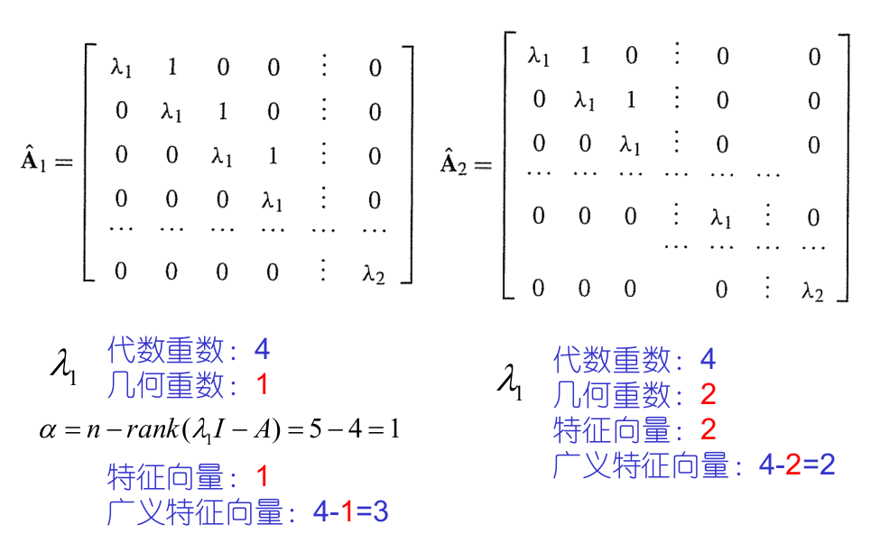
    >
    >   
    >
    > - 约旦标准型的幂
    >
    >   
    >
    > - example
    >
    >   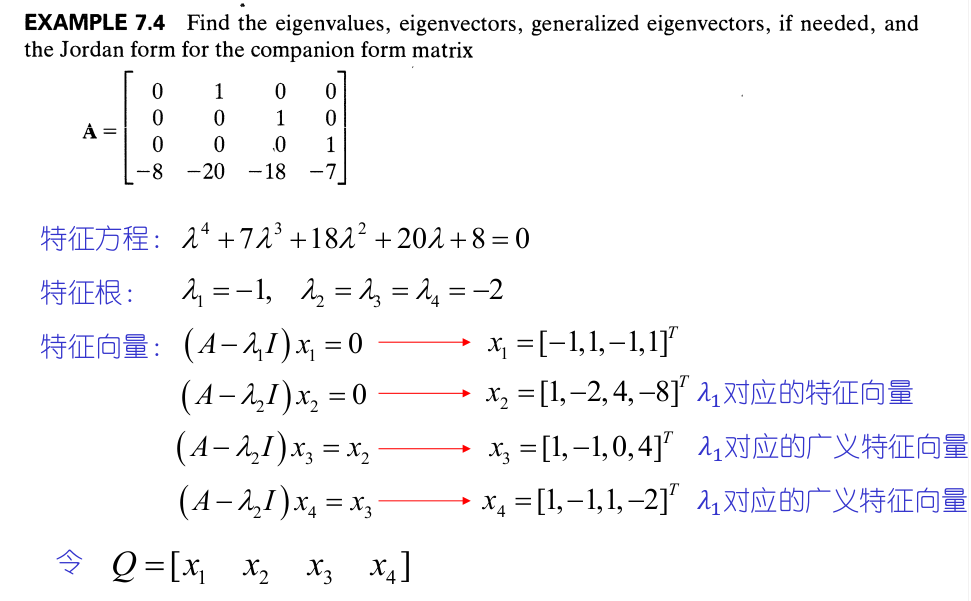
    >
    >   
    >
    >   

- 化矩阵 $G$ 为有限项

  - 根据 凯莱-哈密尔顿 定理，系统矩阵 $G$ 满足自身的零化多项式
    $$
    \phi(k)=\alpha_0(k)I+\alpha_1(k)G+\alpha_2(k)G^2+\cdots+\alpha_{n-1}(k)G^{n-1}
    $$

    - 其中，$\alpha_i(k)$ 为待定系数，可仿照连续系统的方法来求

  - 当 $A$ 为 $n$ 阶方阵，且具有互异特征值 $\lambda_i$，则
    $$
    \left[
    \begin{matrix}
    a_0(t)\\
    a_1(t)\\
    \vdots\\
    a_{n-1}(t)
    \end{matrix}
    \right]
    =
    \left[
    \begin{matrix}
    1 & \lambda_1 & \lambda_1^2 & \cdots & \lambda_1^{n-1}\\
    1 & \lambda_2 & \lambda_2^2 & \cdots & \lambda_2^{n-1}\\
    \vdots & \vdots & \vdots &  & \vdots\\
    1 & \lambda_n & \lambda_n^2 & \cdots & \lambda_n^{n-1}\\
    \end{matrix}
    \right]^{-1}
    \left[
    \begin{matrix}
    e^{\lambda_1t}\\
    e^{\lambda_2t}\\
    \vdots\\
    e^{\lambda_{n-1}t}
    \end{matrix}
    \right]
    $$

  - 当 $A$ 具有重特征值但为循环阵时，假设 $\lambda_1$ 为三重根，$\lambda_2$ 为二重根，其余为单根，则
    $$
    \left[
    \begin{matrix}
    a_0(t)\\
    a_1(t)\\
    a_2(t)\\
    a_3(t)\\
    a_4(t)\\
    a_5(t)\\
    \vdots\\
    a_{n-1}(t)
    \end{matrix}
    \right]
    =
    \left[
    \begin{matrix}
    0 & 0 & 1 & 3\lambda_1 & \cdots & \dfrac{(n-1)(n-2)}{2!}\lambda_1^{n-3}\\
    0 & 1 & 2\lambda_1 & 3\lambda_1^2 & \cdots & \dfrac{(n-1)}{1!}\lambda_1^{n-2}\\
    1 & \lambda_1 & \lambda_1^2 & \lambda_1^3 & \cdots & \lambda_1^{n-1}\\
    0 & 1 & 2\lambda_2 & 3\lambda_2^2 & \cdots & \dfrac{(n-1)}{1!}\lambda_2^{n-2}\\
    1 & \lambda_2 & \lambda_2^2 & \lambda_2^3 & \cdots & \lambda_2^{n-1}\\
    1 & \lambda_3 & \lambda_3^2 & \lambda_3^3 & \cdots & \lambda_3^{n-1}\\
    \vdots & \vdots & \vdots &  & \vdots\\
    1 & \lambda_{n-3} & \lambda_{n-3}^2 & \lambda_{n-3}^3 & \cdots & \lambda_{n-3}^{n-1}\\
    \end{matrix}
    \right]^{-1}
    \left[
    \begin{matrix}
    e^{\lambda_1t}\\
    e^{\lambda_2t}\\
    \vdots\\
    e^{\lambda_{n-1}t}
    \end{matrix}
    \right]
    $$
    

  > [!important]
  >
  > **凯莱-哈密尔顿定理**
  >
  > 若 $n\times n$ 矩阵 $A$ 的特征方程为
  > $$
  > \Delta(s)=\det(sI-A)=s^n+\alpha_{n-1}s^{n-1}+\cdots+\alpha_1s+\alpha_0
  > $$
  > 则矩阵 $A$ 为其特征方程的一个矩阵根，即
  > $$
  > \Delta(A)=A^n+\alpha_{n-1}A^{n-1}+\cdots+\alpha_1A+\alpha_0I=0
  > $$
  >
  > - 说明 $I、A、A^2、\cdots、A^{n-1}$ 线性无关
  >
  > 
  >
  > 

# 三、控制系统的稳定性及稳态误差

## 1、基于传递函数的稳定性分析

### 离散系统极点位置与系统瞬态响应的关系

$$
r(t)=1(t)\implies R(z)=\dfrac{z}{z-1}\\
Y(z)=\Phi(z)R(z)=\dfrac{k\Pi_{i=1}^m(z-z_i)}{\Pi_{i=1}^n(z-p_i)}\dfrac{z}{z-1}=\dfrac{Az}{z-1}+\sum_{i=1}^n\dfrac{B_iz}{z-p_i}\\
y(kT)=A+\sum_{i=1}^nB_ip_i^k
$$

> 极点 $p_i$ 在 $z$ 平面上的位置决定了瞬态响应中各分量的类型

###  $s$ 域到 $z$ 域的映射

$$
z=e^{sT}=e^{(\sigma+j\omega)T}=e^{\sigma T}e^{j\omega T}\implies |z|=e^{\sigma T}\quad \angle z=\omega T
$$

- 左半平面映射到单位圆内
- 虚轴上映射到单位圆上
- 右半平面映射到单位圆外

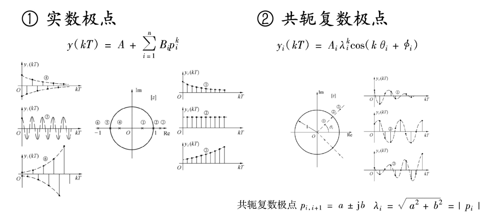

- 采样角频率 $\omega_s$
  $$
  \omega_s=\dfrac{2\pi}T=2\pi f_s
  $$

  - 主要带：$-\dfrac{\omega_s}2$ 到 $\dfrac{\omega_s}2$ 的周期带，$z$ 平面点从 $-\pi$ 逆时针变化到 $\pi$ ，转了一圈
  - 次要带：其余的周期带

  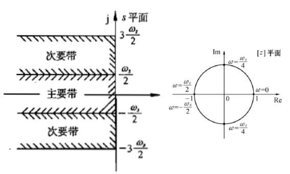

- 等 $\sigma$ 线映射

  

  - 平行竖线 $\rarr$ 同心圆

- 等 $\omega$ 线映射

  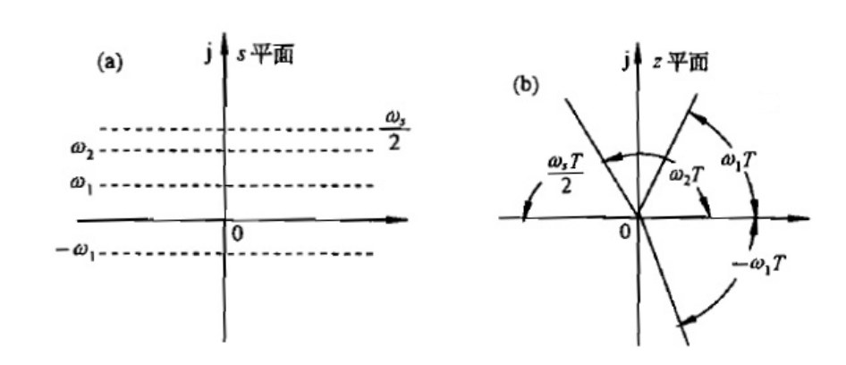

  - 平行横线 $\rarr$ 一簇射线

### 离散系统稳定性定理

> 线性离散系统稳定的充要条件为：线性离散系统的全部特征根 $z_i$ 都分布在 $z$ 平面的单位圆之内（或者说模都小于 $1$）

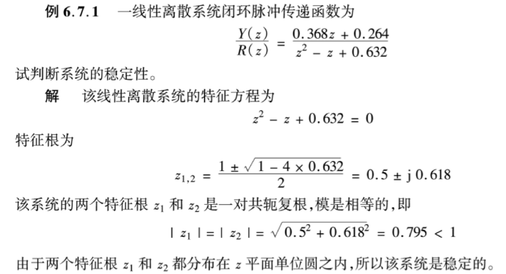

### 劳斯稳定判据

双线性变换（ $w$ 变换）
$$
z = \dfrac{w+1}{w-1}
$$
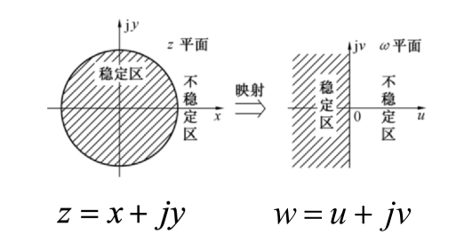

然后可以在 $W$ 域使用劳斯稳定判据间接判别（**特殊情况的处理方法与连续情形的处理方法类似**）

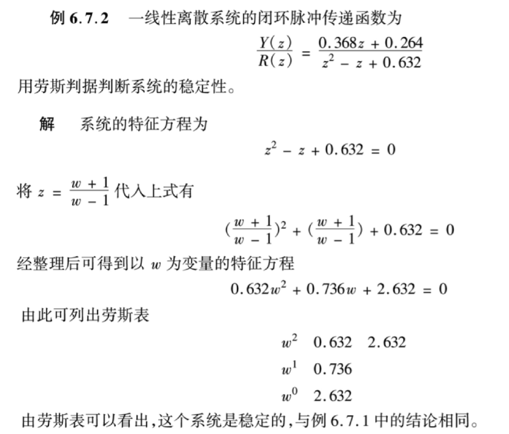

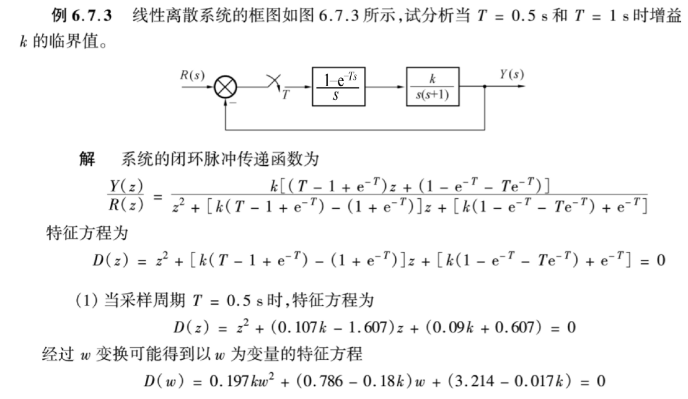

> [!note]
>
> - 在例 6.7.3 的系统中：
>
>   - 如果没有采样开关和零阶保持器，就是一个二阶线性连续系统，无论 $k$ 取何值，系统始终是稳定的
>
>   - 而二阶线性离散系统却不一定是稳定的，它与系统的参数有关
>     - 当 $k$ 比较小的时候，系统可能稳定
>     - 当 $k$ 比较大的时候，系统会不稳定
>
> - 采样周期 $T$ 是离散系统的一个重要参数
>   - 采样周期变化时，系统的开环传函、闭环传函、特征方程都要发生变化，系统的稳定性也发生变化
>   - 一般情况下，缩短采样周期可使线性离散系统的稳定性得到改善，增大采样周期对稳定性不利
>     - 因为缩短采样周期会增加离散系统获取的信息量，使其在特性上更加接近相应的连续系统

##  2、控制系统的稳态误差分析

### 线性离散系统稳态误差

对于稳定的线性离散系统，当过渡过程结束以后，系统误差信号的脉冲序列就是离散系统的稳态误差
$$
e^*_{ss}(t)\qquad t\geq t_ts
$$
当时间 $𝒕 → ∞$ 时，可求得线性离散系统在采样点上的稳态误差终值 $𝒆^*_{ss}(\infty)$

**传递函数**
$$
GH(z)=\mathcal Z\bigg[G(s)H(s)\bigg]=\dfrac{1}{(z-1)^v}GH_0(z)\\
\lim_{z\rarr1}GH_0(z)=K
$$

- 其中，$v$ 为系统的型别

#### 一般方法：利用终值定理

1. 判定稳定性

2. 求误差脉冲传递函数
   $$
   \Phi_e(z)=\dfrac{E(z)}{R(z)}=\dfrac{1}{1+GH(z)}
   $$
   

3. 用终值定理求 $e_{ss}^*(\infty)$
   $$
   e_{ss}^*(\infty)=\lim_{t\rarr\infty}e^*(t)=\lim_{z\rarr1}(z-1)E(z)=\lim_{z\rarr1}\dfrac{(z-1)}{1+GH(z)}R(z)
   $$

> 适用于系统稳定， $r(t) $作用，对误差采样的线性定常离散系统

#### 静态误差系数法

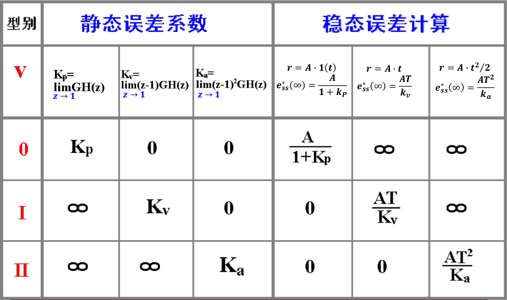
$$
K_p=\lim_{z\rarr1}GH(z)\\
K_v=\lim_{z\rarr1}(z-1)GH(z)\\
K_a=\lim_{z\rarr1}(z-1)^2GH(z)\\
$$

#### 动态误差系数法

将 $z=e^{sT}$ 代入到 $\Phi_e(z)$ 中
$$
\Phi_e^*(s)=\Phi_e(z)\bigg|_{z=e^{sT}}=\Phi_e(0)+\dfrac1{1!}\Phi_e'(0)s+\dfrac1{2!}\Phi_e''(0)s^2+\cdots+\dfrac{1}{m!}\Phi_e^{(m)}(0)s^m+\cdots
$$
计算动态误差系数
$$
c_m=\dfrac1{m!}\dfrac{d^m\Phi_e^*(s)}{ds^m}\bigg|_{s=0}
$$
得到
$$
\Phi_e^*(s)=c_0+c_1s+c_2s^2+\cdots+c_ms^m+\cdots=\sum_{i=0}^\infty c_is^i\\
E^*(s)=\Phi_e^*(s)R(s)=c_0R(s)+c_1sR(s)+\cdots+c_ms^mR(s)+\cdots\\
e_{ss}^*(kT)=c_0r(kT)+c_1\dot r(kT)+c_2\ddot r(kT)+\cdots+c_mr^{(m)}(kT)+\cdots
$$

> [!tip]
>
> 需要先对分式求导，再令 $s=0$

## 3、基于状态空间表达式的稳定性分析

### Lyapunov 意义下的稳定性基本概念

设系统方程
$$
\dot x=f(x,t)
$$

- $x$ 为 $n$ 维状态向量，且显含时间变量 $t$

- $f(x,t)$ 为线性或非线性、定常或时变的 $n$ 维向量函数
  $$
  \dot x_i=f_i(x_1,x_2,\ldots,x_n;t)\qquad i=1,2,\ldots,n
  $$
  假定方程的解为 $x(t;x_0,t_0)$，式中 $x_0$ 和 $t_0$ 分别为初始状态向量和初始时刻，需满足
  $$
  x(t_0;x_0,t_0)=x_0
  $$

#### 平衡状态

对于所有 $t$，满足 $\dot x_e=f(x_e,t)=0$ 的状态 $x_e$ 称为平衡状态

- 平衡状态的各分量相对于时间不再发生变化
- 若已知状态方程，令 $\dot x=0$ 所求得的解 $x$ 就是一种平衡状态

> [!note]
>
> 1. 对于线性定常系统 $\dot x=Ax$，其平衡状态满足 $Ax_e=0$
>
>    - 当 $A$ 为非奇异矩阵时，系统只有唯一的零解（只存在一个位于状态空间原点的平衡状态）
>
>    - 若 $A$ 为奇异矩阵，则系统存在无穷多个平衡状态
>      $$
>      \begin{cases}
>      \dot x_1=x_2\\
>      \dot x_2=0
>      \end{cases}
>      $$
>
> 2. 对于非线性系统，可能会有多个平衡状态
>    $$
>    \begin{cases}
>    \dot x_1=x_2\cos x_1\\
>    \dot x_2 = -\sin x_1-x_2\\
>    \end{cases}
>    $$

#### Lyapunov 意义下的稳定性

设 $x_e$ 为系统的一个平衡状态

- 如果对于给定的任意实数 $\epsilon>0$，

- 对应地存在一个实数 $\delta(\epsilon,t_0)>0$，

  - 使得系统初始状态位于以平衡状态 $x_e$ 为球心、半径为 $\delta(\epsilon,t_0)$ 的闭球域 $S(\delta)$ 内 （$\delta$ 通常与 $\epsilon$ 相关，$\epsilon$ 越小， $\delta$ 越小）

  $$
  ||x_0-x_e||\leq\delta(\epsilon,t_0)
  $$

  - 使得系统方程的解 $x(t;x_0,t_0)$ 在 $t\rarr\infty$ 的过程中，都位于以平衡状态 $x_e$ 为球心、半径为 $\epsilon$（期望精度） 的闭球域 $S(\epsilon)$ 内
    $$
    ||x(t;x_0,t_0)-x_e||\leq \epsilon\qquad t\geq t_0
    $$

  

- 则称系统的平衡状态 $x_e$ 在 Lyapunov 意义下是稳定的

> [!note]
>
> 按李雅普诺夫意义下的稳定性定义
>
> - 当系统作不衰减的振荡运动时，将在平面描绘出一条封闭曲线
> - 但只要不超出 $S(ε)$，则认为是稳定的
> - 这与经典控制理论中线性定常系统稳定性的定义是有差异的。经典控制理论中的稳定，指的是渐近稳定性

**渐近稳定性**

若系统的平衡状态 $x_e$ 不仅具有 Lyapunov 意义下的稳定性，且有
$$
\lim_{t\rarr\infty} ||x(t;x_0,t_0)-x_e||=0
$$
则称此平衡状态是渐近稳定的

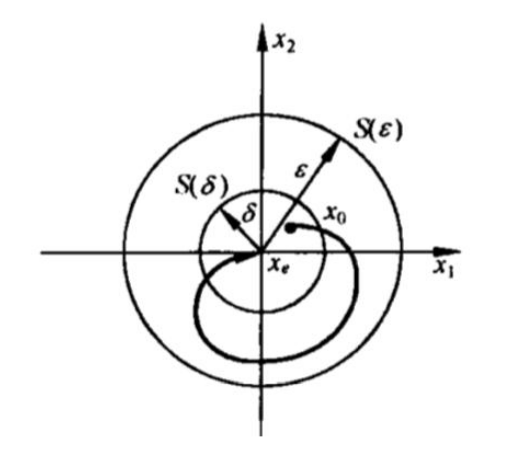

- 此时，从 $S(\delta)$ 出发的轨迹不仅不会超出 $S(\epsilon)$，且当 $t\rarr\infty$ 时收敛于 $x_e$ （与经典控制理论中的稳定性定义对应）

**大范围（全局）渐近稳定性**

当初始条件扩展至整个状态空间，且平衡状态均具有渐近稳定性时，称此平衡状态是大范围渐近稳定的。

- 此时 $\delta\rarr\infty$ $S(\delta)\rarr\infty$ 
- 当 $t\rarr\infty$ 时，由状态空间中任意一点出发的轨迹都收敛到 $x_e$

> [!important]
>
> 对于线性系统而言，系统稳定性和平衡状态稳定性是一回事
>
> - 线性定常系统所有平衡点的稳定性是相同的
> - 对于非零平衡点，经过状态平移，均可转换为原点，并且状态矩阵不变
> - 因此，只需判断原点是否为该系统的稳定（渐近稳定）平衡点，即可判断该系统是否稳定（渐近稳定）
>
> $$
> 稳定\rarr一致稳定\\
> 渐近稳定\rarr大范围一致渐近稳定
> $$
>
> 对于非线性系统，即使原点是渐近稳定的，也需要验证无穷远特性，才能确定是否为全局渐近稳定

> [!note]
> $$
> \text{稳定（Stable：S）}\rarr\text{渐近稳定（Asymptotically Stable：AS）}\rarr \text{全局渐近稳定（Globally Asymptotically Stable：GAS）}
> $$
>
> |     稳定性层级      |               对平衡状态 $x_e$ 的核心要求                |                           常见误区                           |
> | :-----------------: | :------------------------------------------------------: | :----------------------------------------------------------: |
> |   稳定 $\uarr$   | 初始偏差小 状态始终在平衡状态附近 （不远离即可） | **误认为 “稳定 = 收敛”**  实际稳定状态可能是振幅有界的振荡 （如无阻尼单摆的平衡态） |
> | 渐近稳定 $\uarr$ |                $+$ 状态最终收敛到平衡状态                | **忽略 “局部性** AS仅保证初始值在平衡态邻域内时才收敛 初始值过大则会失效 |
> |    全局渐近稳定     |   $+$ 对所有初始值均收敛 （且过程中状态始终有界）   | **误认为 ”线性系统 AS = GAS“ 成立** 线性定常系统时才成立 线性时变系统不成立 |

**不稳定性**

若对于某个实数 $\epsilon>0$ 和任意一个实数 $\delta>0$

- 不管这两个实数有多小
- 在 $S(\delta)$ 内中存在着一个状态 $x_0$
- 使得由这一状态出发的轨迹超出 $S(\epsilon)$
- 则平衡状态 $x_e$ 称为是不稳定的

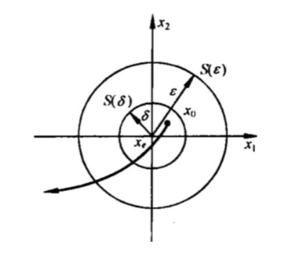

### Lyapunov 第一法（间接法）

> 利用状态方程解的特性，来判断系统稳定性
>
> 对于线性定常系统，有**特征值判据**

##### 定理

对于线性定常系统 $\dot x=Ax，x(0)=x_0，t\geq0$，系统的唯一平衡状态 $x_e=0$ 时渐近稳定的充要条件：$A$ 的所有特征值均具有负实部

- 如果只有一个或一对特征值（非重根）的实部等于零，其余特征值实部均小于零，$x(t)$ 便含有常数项或三角函数项，则系统是 Lyapunov 意义下稳定的

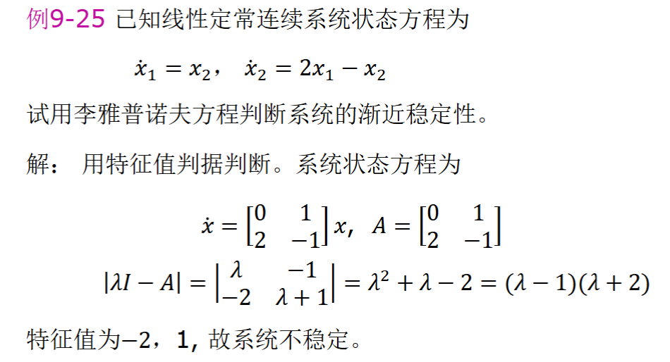

> [!note]
>
> - 线性时变系统 $A=A(t)$，特征值都是负实部不是渐近稳定的充要条件，需要用 Lyapunov 第二方法或其他判据
> - 非线性系统，无特征值概念，雅可比矩阵特征值负实部仅能保持平衡态局部渐近稳定，无法保证全局稳定

### Lyapunov 第二法（直接法）

> 虚构一个能量函数（Lyapunov 函数）$V(x)$，为正定函数，利用 $V$、$\dot V$ 的符号特征，能直接对平衡状态稳定性作出判断，无需求解
>
> - 对线性系统，通常用二次型函数 $x^TPx$ 作为 Lyapunov 函数
> - 对一般非线性系统仍未找到构造 Lyapunov 函数的通用方法

#### 标量函数定号性

**正定**：$V(x)>0\ x\neq0，V(0)=0$ 

-  $V(x)=x_1^2+x_2^2$

**半正定**：$V(x)\geq0，V(0)=0$

-  $V(x)=x_1^2$

**负定**：$-V(x)$ 正定

-  $V(x)=-(x_1^2+x_2^2)$

**半负定**：$-V(x)$ 半正定

-  $V(x)=-x_1^2$

**不定**：$V(x)$ 可正可负

-  $V(x)=x_1^2+x_2$

> [!TIP]
>
> 实对称矩阵 $A$ 是正定（半正定）的
>
> 1. 当且仅当所有特征值均大于（大于等于）$0$
> 2. 当且仅当所有主子式均大于（大于等于）$0$

#### 定常系统大范围渐近稳定判别定理 1

对于定常系统
$$
\dot x=f(x)\qquad t\geq 0
$$
其中 $f(0)=0$，如果存在一个具有连续一阶导数的标量函数 $V(x)$，满足 $V(0)=0$，并且对于状态空间 $X$ 中的一切非零点 $x$ 均有

- $V(x)$ 正定
- $\dot V(x)$ 负定
- 当 $||x||\rarr\infty$ 时，有 $V(x)\rarr\infty$

则系统的**原点**平衡状态是大范围渐近稳定的

> [!note]
>
> 满足前两点则**渐近稳定**，三点都满足则**全局渐近稳定**
>
> 第一点本质：
>
> - 原点是能量最低点
>
> 第二点本质
>
> - 确保能量持续递减
>
> 第三点本质：
>
> - 是通过 Lyapunov 函数的 “无界增长”
> - 确保状态空间中不存在 “能量上限”
> - 迫使所有轨迹（无论初始位置多远）都因能量持续递减而收敛到原点
> - 从而实现 “大范围”（全局）的渐近稳定。

> [!tip]
>
> 多平衡点时，“全局” 通常不成立，因为状态可能流向其他平衡点，故需要先明确原点是系统的唯一平衡状态

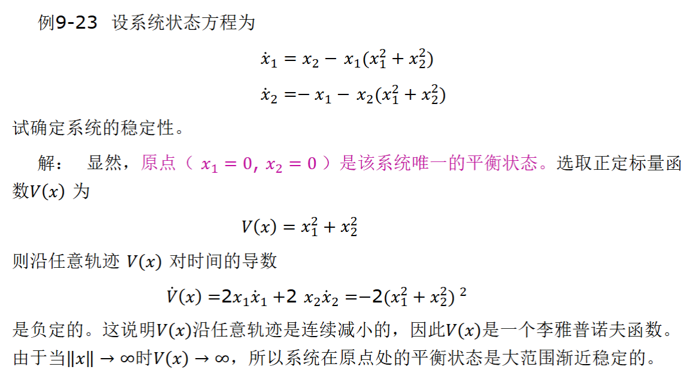

#### 定常系统大范围渐近稳定判别定理 2

对于定常系统，如果存在一个具有连续一阶导数的标量 $V(x)$，满足 $V(0)=0$，并且对于状态空间 $X$ 中的一切非零点 $x$ 均有

- $V(x)$ 正定
- $\dot V(x)$ 负**半**定
- 对任意 $x\in X$，有 $\dot V(x(t;x_0,0))\not\equiv0$   （ $\dot V(x)$ 除原点外，沿状态轨线不恒为 $0$ ）
- 当 $||x||\rarr\infty$ 时，有 $V(x)\rarr\infty$

则系统的**原点**平衡状态是大范围渐近稳定的

> [!note]
>
> 满足前两点则**稳定**，再满足第三点则**渐近稳定**，再满足第四点则**全局渐近稳定**
>
> 定理 2 是定理 1的扩展版本
>
> - 当 $\dot V(x)$ 无法满足严格负定，只能半负定时
> - 通过增加条件 3 来维持能量递减的本质，同时保留条件 4（全局约束）
> - 从而适用于更广泛的非线性系统

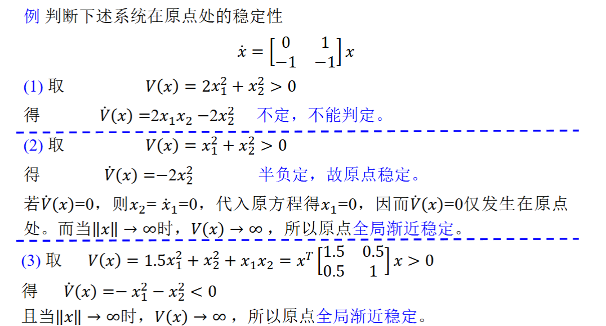

> [!tip]
>
> 选择不同的 $V(x)$，可能得到不同的结果，但得到的结论不矛盾
>
> 找到好的 $V(x)$，需要经验和运气

#### 不稳定判别定理

对于定常系统，如果存在一个具有连续一阶导数的标量 $V(x)$，满足 $V(0)=0$，和围绕原点的域 $\Omega$，使得对于一切 $x\in\Omega$ 和一切 $t\geq t_0$，满足

- $V(x)$ 正定
- $\dot V(x)$ 正定

则系统的**原点**平衡状态为不稳定

> [!caution]
>
> 以上三个定理均为充分条件。某 $V(x)$ 不满足定理条件时，不能下结论

### 线性定常系统的 Lyapunov 稳定性分析

对于状态方程 $\dot x=Ax。x(0)=x_0，t\geq0$ （线性定常系统）

- $A$ 为非奇异矩阵时，原点是唯一平衡状态

- 设取正定二次型函数 $V(x)=x^TPx$ 作为可能的 Lyapunov 函数
  $$
  \begin{cases}
  \dot V(x)=\dot x^TPx+x^TP\dot x=x^T(A^TP+PA)x\\
  A^TO+PA=-Q
  \end{cases}
  \implies
  \dot V(x)=-x^TQx
  $$

也就是说，只要 $Q$ 正定（也就是 $\dot V(x)$ 负定，则系统是大范围渐近稳定的

故线性定常连续系统渐近稳定的充要条件是：给定一个正定矩阵 $P$ ( $x^TPx$ 是该系统的一个 Lyapunov 函数），存在满足 Lyapunov 矩阵代数方程的正定矩阵 $Q$
$$
A^TP+PA=-Q
$$

> [!tip]
>
> 最好是先选取 $Q$ 为正定实对称矩阵，再求解方程，若求得 $P$ 为正定实对称矩阵，则可判定系统是渐近稳定的；否则系统不是渐近稳定的
>
> 通常选取 $Q$ 为单位阵或对角阵，因此简化为
> $$
> A^TP+PA=-I
> $$
> 

> [!note]
>
> 若系统任意状态轨迹在非零状态不存在 $\dot V(x)=0$ 时，由定理 2 可知
>
> - $Q$ 可选择为半正定的，即允许 $Q$ 取半正定对角阵时，主对角线上部分元素为 $0$
> - 而解得的 $P$ 仍为正定

1.

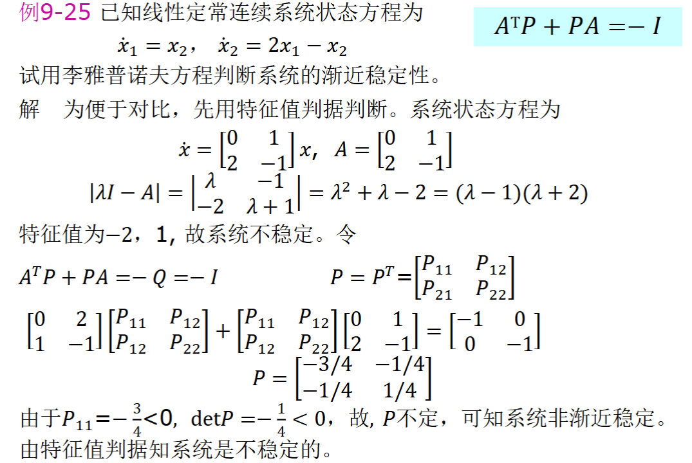

2.

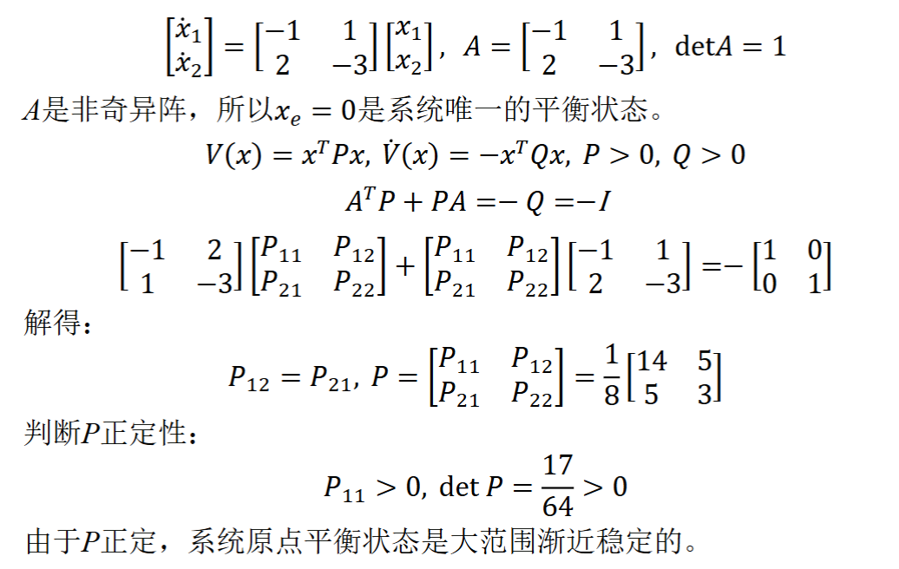

> [!important]
>
> 对于离散系统
> $$
> x(k+1)=\Phi x(k)
> $$
>
> - 用 $\Delta V(x)=V(x(k+1))-V(x(k))$ 代替 $\dot V(x)$
>
> 离散 Lyapunov 矩阵代数方程
> $$
> \Phi^TP\Phi-P=-Q
> $$
>
> - 通常取 $Q=I$

# 四、控制系统的稳定裕度

## 1、频率域稳定判据

- 奈奎斯特稳定判据
  $$
  Z=P-2N
  $$

  - $Z$：右半平面的闭环极点个数

  - $P$：右半平面的开环极点个数

  - $N$：开环幅相曲线 $G(j\omega)H(j\omega)$ 包围 $(-1,j0)$ 点的圈数
    $$
    N=N_+-N_-
    $$

    - $N_+$：正穿越次数，由上而下穿过  $(-1,j0)$ 点左侧的实轴
    - $N_-$：负穿越次数，由下而上穿过  $(-1,j0)$ 点左侧的实轴

- 对数稳定判据

  - 与 Nyquist 图对应

    - Nyquist 图上的单位圆对应 Bode 图上的 $0dB$ 线
      - 单位圆内 $\rarr$ $0dB$ 线以上
      - 单位圆外 $\rarr$ $0dB$ 线以下
    - Nyquist 图上的负实轴对应 Bode 图上的 $-180\degree$ 线

    > Nyquist 图上 $(-1,j0)$ 点左侧的负实轴对应于
    >
    > - 幅频特性 $0dB$ 线以上
    > - 相频特性的 $180\degree$ 线上 

    - 存在积分环节的情形
      - Nyquist 图需要补圆
      - Bode 图在相频曲线 $\omega=0_+$ 处，由下向上补画一条虚线，该虚线通过的相角为 $v90\degree$

  - 定义 $N$

    - 穿越：当 $L(\omega)$ 大于 $0dB$ 时，$\phi(\omega)$ 穿过 $-180\degree$ 线
    - 正穿越：由下而上（半次：从 $-180\degree$ 线开始向上）
    - 负穿越，由上而下（半次：从 −180° 线开始向下）

    

## 2、稳定裕度

> 在控制系统稳定的基础上，进一步讨论其稳定程度随参数发生一定变化时是否稳定，即控制系统的相对稳定性
>
> 相对稳定性通过稳定裕度来定量描述
>
> - 相角裕度
> - 幅值裕度

### 相角裕度

剪切频率 $\omega_c$：Nyquist 曲线穿越单位圆、幅频响应穿越频率轴（横轴）时的频率

相角裕度 $\gamma$ 
$$
\gamma = \angle G(j\omega_c)H(j\omega_c)-(-180\degree)= 180\degree+ \angle G(j\omega_c)H(j\omega_c)
$$

- 负实轴与 $OA$ 的角度，逆时针为正

  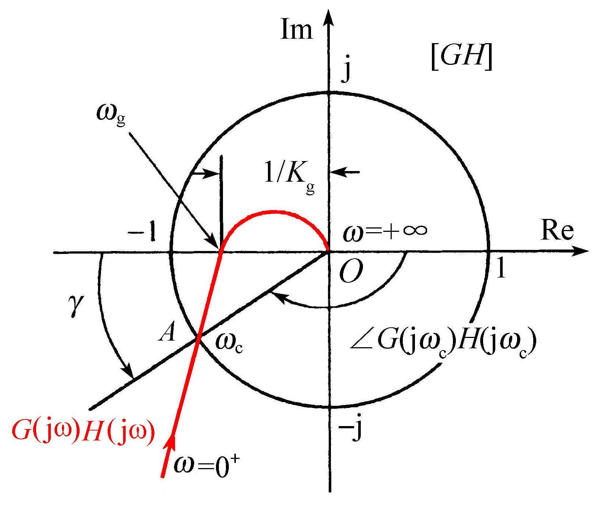

  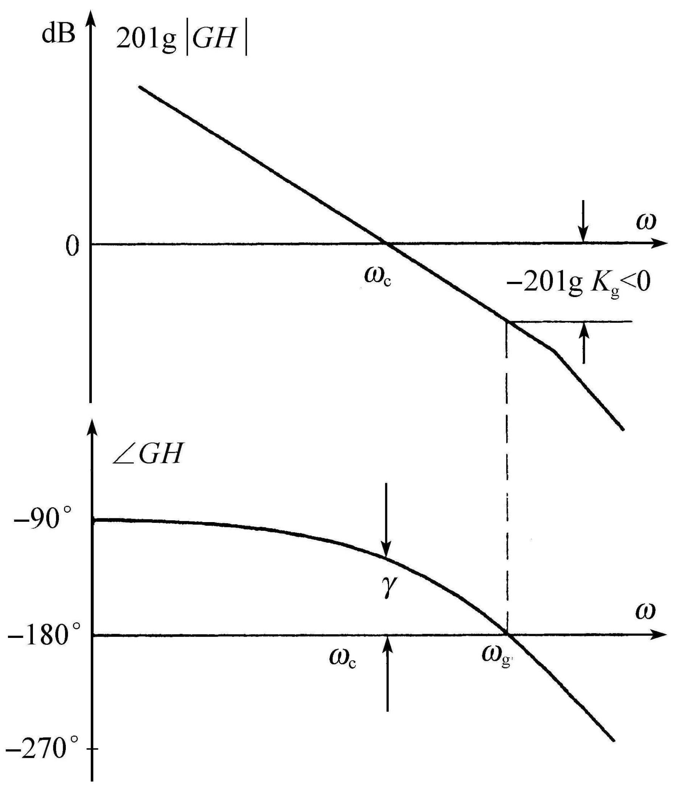

> [!note]
>
> 相角裕度表示开环 Nyquist 图与单位圆的交点沿单位圆与 $(-1,j0)$ 的远近程度
>
> 若系统剪切频率 $\omega_c$ 处的相位再减小 $\gamma$ ，则 $\phi(\omega_c)=-180\degree$，Nyquist 曲线过 $(-1,j0)$，系统处于临界稳定状态
>
> 

### 幅值裕度

相位穿越频率 $\omega_g$：开环频率特性相角为 $-180\degree$ 的频率

幅值裕度 $K_g$
$$
\begin{cases}
K_g&=\dfrac{1}{|G(j\omega_g)H(j\omega_g)|}\qquad(\text{Nyquist 图})\\
20\lg K_g&=-20\lg|G(j\omega)H(j\omega)|\ dB\qquad(\text{Bode 图})
\end{cases}
$$

-  负幅值裕度，是对数域中的表述，目的是快速判断系统是否稳定，而非裕度本身具有负属性

> [!note]
>
> 幅值裕度表示开环 Nyquist 图与负实轴的交点离  $(-1,j0)$ 的远近程度
>
> 若系统的开环增益增大到原来的 $K_g$  倍，则  $A(\omega_g)=1$，Nyquist 曲线过 $(-1,j0)$，系统处于临界稳定状态
>
> 

> [!important]
>
> - 相角裕度和幅值裕度表示闭环系统与临界稳定状态远离的程度，常被用作控制系统设计的指标
>
> - 相角裕度和幅值裕度数值大小、正负跟闭环系统是否稳定没有必然联系
>
> - 对于一些复杂系统，可以求出多个相角裕度和幅值裕度，这时，以最小的值作为相角裕度和幅值裕度
> - 对于一阶、二阶的系统，或开环传递函数 $n-m=1或2$  的系统，如果其开环频率特性的 Nyquist 图与负实轴不相交，则 $K_g=\infty$
>
> 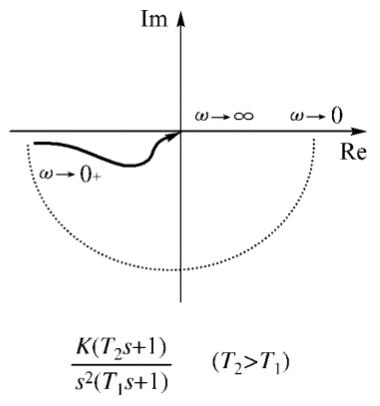
