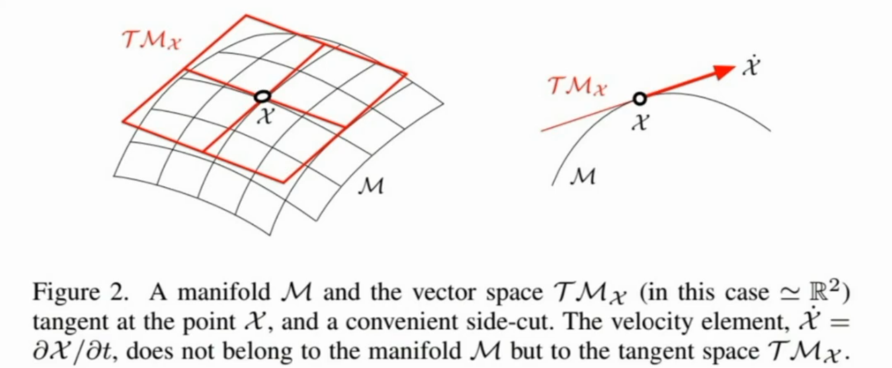
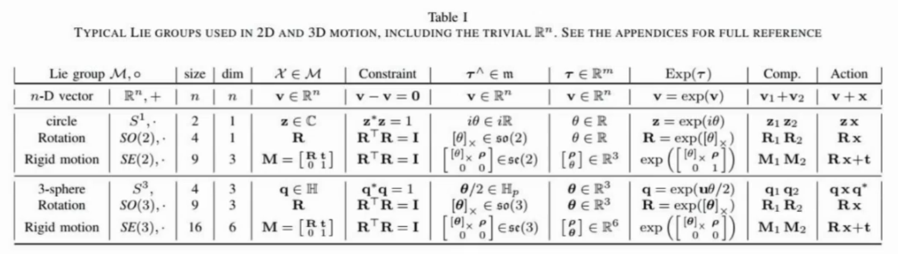
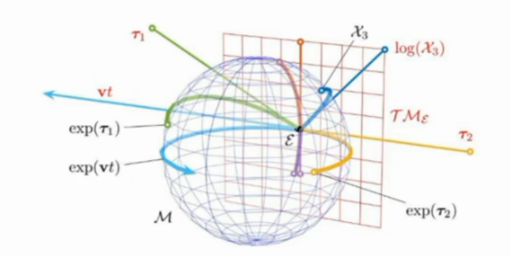
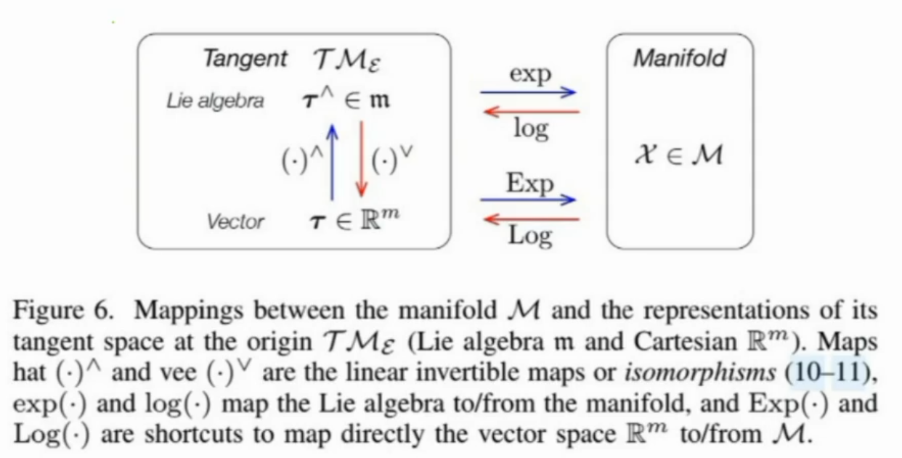

# 李群流形

## 1、为什么引入李群流形

在状态估计中，假设当前状态为 $x$，则损失函数
$$
r=f(x)
$$
让损失函数最小化，就可以求得目标 $x$​
$$
x^*=\min_xr
$$
这是一个典型的优化问题，解决方法有

- $SD$：梯度下降法
- $GN$：高斯牛顿法
- $LM$

要使用以上方法，就必须对 $r=f(x)$ 进行线性化，也即求导

- 当 $x$ 为普通变量，如 $R_3$空间的 $[x,y,z]$ ，用普通的矩阵求导就可以解决
- 而当 $x$ 为 $R_{3\times3}$ 旋转矩阵时，则不能简单求导解决，因为有旋转矩阵的限制

因此引入李群流形，能够定义旋转矩阵、齐次坐标变换矩阵等的求导

## 2、什么是李群流形

群是一种代数结构的概念，流形是一种几何拓扑的概念

李群连接了几何与代数

### ① 流形

和普通求导（$f(x)$ 和 $x$ 都在线性空间）不同， $f(x)$ 属于流形，$x$ 定义在线性空间

因而要定义一种抽象的求导概念

- 概念 1 ：$Local$
  - 由流形空间中的两个元素  $y_1、y_2$，求出来一个局部坐标系下的相对距离 $\Delta x$

- 概念 2 ：$Retract$
  - 由流形空间中的一个元素 $y_1$ 和定义在局部空间中的一个局部坐标系下的相对距离 $\Delta x$，求出来另外一个流形空间中的元素 $y_2$

有了以上两个概念，就可以定义导数
$$
\frac{Local(y_1,Retract(y_1,\Delta x)}{\Delta x}
$$

### ② 群

**群（Group）**是代数学中的一个基本概念

它由一个集合和一个定义在这个集合上的二元运算组成

满足以下四个条件：

1. **封闭性（Closure）**：对于集合中的任意两个元素，通过二元运算得到的结果仍在集合内。
2. **结合性（Associativity）**：对于集合中的任意三个元素，运算满足结合律。
3. **单位元（Identity Element）**：存在一个特殊元素，使得与任何元素进行运算后，结果仍是该元素本身。
4. **逆元（Inverse Element）**：对于集合中的每个元素，都存在一个逆元素，使得两者进行运算后得到单位元。

### ③ 李群流形

 结合了流形和群，并有额外的独有概念：

- 流形
  - $Local$ ：$v=(\log[Between(g,h)])^{\vee}$
  - $Retract$ ：$h=g * \exp(v^{\wedge})$
- 群
  - $Compose$ : $g*h$
  - $Identity$ : $I$
  - $Inverse$ : $I=g*g^{-1}$
  - $Between$ : $g^{-1} * h$
- 独有（两个映射）
  - $Tangent\ Vector\ Logmap$ : $(\log[g])^{\vee}$
  - $Liegroup\ Expmap$ : $\exp(v^{\wedge})$

> 不同李群有不同的计算定义：
>
> 
>
> 映射图解：
>
> 
>
> 
>
> 向量 $\rarr$ 李代数、切空间 $\rarr$ 李群流形
>
> 旋转向量 $\rarr$ 反对称矩阵 $\rarr$ 旋转矩阵

> 