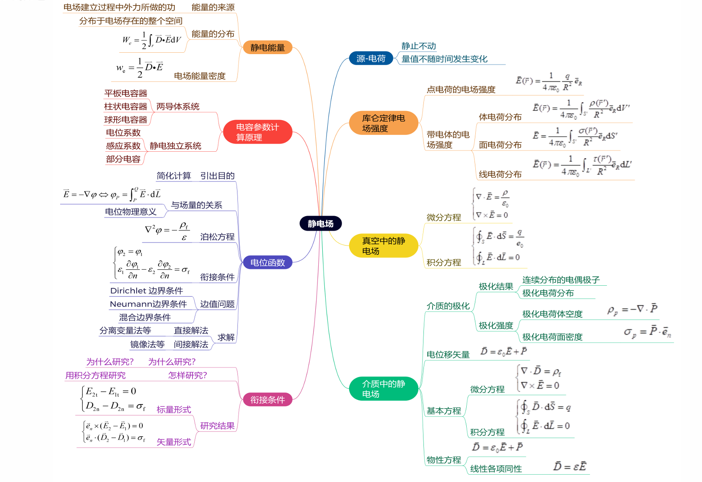

# 第1章 静电场

### 静电场知识结构图

## 1.1 电场强度 电位

### 一、静电场的基本概念

1. **静电场的定义**：由静止电荷产生的电场，电荷量不随时间变化
2. **静电场的特性**：
   - 无旋场：静电场的旋度为零，即 $\nabla \times \vec{E} = 0$
   - 保守场：静电场中电场力做功与路径无关

### 二、电场强度

1. **库仑定律**：
   - 两点电荷之间的作用力：
     $$
     \vec{F} = \frac{1}{4\pi\varepsilon} \frac{q q'}{|\vec{r} - \vec{r'}|^2} \bigg(\frac{\vec{r} - \vec{r'}}{|\vec{r} - \vec{r'}|}\bigg) 
     $$
     
   - $\varepsilon_0$ 为真空介电常数
   
   - $\varepsilon$ 为介质的介电常数
   
   
   
2. **电场强度的定义**：
   $$
   \vec{E} = \lim_{q_0 \to 0} \frac{\vec{F}}{q_0}
   $$
   
   - 单位：V/m

   
   
3. **点电荷的电场强度**：
   $$
   \vec{E} = \frac{1}{4\pi\varepsilon_0} \frac{q}{|\vec{r} - \vec{r'}|^2}\bigg(\frac{\vec{r} - \vec{r'}}{|\vec{r} - \vec{r'}|}\bigg) 
   $$

4. **电场叠加原理**：
   
   - 多个电荷产生的电场强度是各电荷产生的电场强度的矢量和：
     $$
     \vec{E} = \sum_i \frac{1}{4\pi\varepsilon_0} \frac{q_i}{|\vec{r} - \vec{r'}_i|^2} \bigg(\frac{\vec{r} - \vec{r_i'}}{|\vec{r} - \vec{r_i'}|}\bigg) 
     $$
   
5. **体电荷、面电荷和线电荷产生的电场**：
   - 体电荷：
     $$
     \vec{E} = \frac{1}{4\pi\varepsilon_0} \int_V \frac{\rho(\vec{r'})}{|\vec{r} - \vec{r'}|^2}\bigg(\frac{\vec{r} - \vec{r'}}{|\vec{r} - \vec{r'}|}\bigg) dV'
     $$
   - 面电荷：
     $$
     \vec{E} = \frac{1}{4\pi\varepsilon_0} \int_S \frac{\sigma(\vec{r'})}{|\vec{r} - \vec{r'}|^2} \bigg(\frac{\vec{r} - \vec{r'}}{|\vec{r} - \vec{r'}|}\bigg)  dS'
     $$
   - 线电荷：
     $$
     \vec{E} = \frac{1}{4\pi\varepsilon_0} \int_L \frac{\tau(\vec{r'})}{|\vec{r} - \vec{r'}|^2} (\vec{r} - \vec{r'}) dl'
     $$

### 三、电位

1. **电位的定义**：
   - 电位是电场的标量势函数，表示单位正电荷从某点移到参考点电场力所做的功：
     $$
     \phi(\vec{r}) = - \int_{\vec{r}_0}^{\vec{r}} \vec{E} \cdot d\vec{l}
     $$
     
   - 单位：V
   
   
   
2. **电位与电场强度的关系**：
   
   - 电场强度是电位的负梯度：
     $$
     \vec{E} = -\nabla \phi
     $$
   
3. **点电荷的电位**：
   $$
   \phi(\vec{r}) = \frac{1}{4\pi\varepsilon_0} \frac{q}{|\vec{r} - \vec{r'}|}+C
   $$

4. **电位的叠加原理**：
   - 多个电荷产生的电位是各电荷产生的电位的代数和：
     $$
     \phi(\vec{r}) = \sum_i \frac{1}{4\pi\varepsilon_0} \frac{q_i}{|\vec{r} - \vec{r}_i|}+C
     $$

5. **体电荷、面电荷和线电荷产生的电位**：
   - 体电荷：
     $$
     \phi(\vec{r}) = \frac{1}{4\pi\varepsilon_0} \int_V \frac{\rho(\vec{r'})}{|\vec{r} - \vec{r'}|} dV'+C
     $$
     
   - 面电荷：
     $$
     \phi(\vec{r}) = \frac{1}{4\pi\varepsilon_0} \int_S \frac{\sigma(\vec{r'})}{|\vec{r} - \vec{r'}|} dS'+C
     $$
     
   - 线电荷：
     $$
     \phi(\vec{r}) = \frac{1}{4\pi\varepsilon_0} \int_L \frac{\tau(\vec{r'})}{|\vec{r} - \vec{r'}|} dl'+C
     $$
   
6. **电力线和等位面**

   

   

### 六、电偶极子

### 五、静电场的无旋性

1. **微分形式**：
   $$
   \nabla \times \vec{E} = 0
   $$

2. **积分形式**：
   $$
   \oint_L \vec{E} \cdot d\vec{l} = 0
   $$

3. **物理意义**：
   - 静电场是保守场，电场力做功与路径无关

## 1.2 高斯定律

### 一、真空中的高斯定律

1. **高斯定律的微分形式**：
   $$
   \nabla \cdot \vec{E} = \frac{\rho}{\varepsilon_0}
   $$

2. **高斯定律的积分形式**：
   $$
   \oint_S \vec{E} \cdot d\vec{S} = \frac{Q}{\varepsilon_0}
   $$

3. **物理意义**：
   
   - 通过任一闭合曲面的电通量等于该曲面内总自由电荷与真空介电常数的比值

### 二、静电场中的电介质

1. **电介质的极化**：
   - 电介质在外电场作用下，内部电偶极子发生偏转或位移，形成极化电荷

2. **极化强度**：
   
   - 单位体积内的电偶极矩矢量和：
     $$
     \vec{P} = \lim_{\Delta V \to 0} \dfrac{\sum_i \vec{p}_i}{\Delta V}
     $$
   
3. **极化电荷**：
   - 体密度：
     $$
     \rho_p = -\nabla \cdot \vec{P}
     $$
   - 面密度：
     $$
     \sigma_p = \vec{P} \cdot \vec{e}_n
     $$

> 电介质对电场的影响，可归结为极化后极化电荷或电偶极子在真空所产生的作用

### 三、电位移矢量

1. **定义**：
   
   
   
   > $$
   > \rho_P=-\nabla\cdot\vec P\\
   > \rho_f=\nabla\cdot\vec D\\
   > $$
   
   $$
   \vec{D} = \varepsilon_0 \vec{E} + \vec{P}
   $$
   
2. **高斯定律的介质形式**：
   
   - 微分形式：
     $$
     \nabla \cdot \vec{D} = \rho_f
     $$
   - 积分形式：
     $$
     \oint_S \vec{D} \cdot d\vec{S} = Q_f
     $$
   
3. **物理意义**：
   
   - 电位移矢量的散度等于自由电荷体密度

### 四、静电场中的导体

- 导体内部电场强度为零
- 导体表面电场强度垂直于表面

- 导体内部无自由电荷，电荷仅分布在表面
- 导体是等位体，表面是等位面

> 导体在静电场中的模型就是自由面电荷模型
>
> 导体内部任意闭合曲面S上电通量密度的面积分为零

## 1.3 静电场基本方程组 分界面上的衔接条件

### 一、静电场基本方程

1. **高斯定律**：
   $$
   \nabla \cdot \vec{D} = \rho_f
   $$

2. **无旋条件**：
   $$
   \nabla \times \vec{E} = 0
   $$

3. **电位移与电场的关系**：
   $$
   \vec{D} = \varepsilon \vec{E}
   $$

### 二、分界面上的衔接条件

> 因为媒质的介电常数不同，因此分界面上微分方程失效（物理量不连续），积分方程仍有效

1. **电场强度的切向分量连续**：
   $$
   E_{2t} - E_{1t} = 0
   $$

2. **电位移矢量的法向分量不连续**：
   $$
   D_{2n} - D_{1n} = \sigma_f
   $$
   
   
   
   
3. **特殊分界面条件**：

   

   

## 1.4 静电场的边值问题 唯一性定理

### 一、电位的微分方程

1. **泊松方程**：
   $$
   \nabla^2 \phi = -\frac{\rho}{\varepsilon}
   $$

2. **拉普拉斯方程**：
   $$
   \nabla^2 \phi = 0
   $$

### 二、电位的衔接条件

> $$
> \begin{cases}
> \phi_1 = \phi_2 \quad\\
>  \varepsilon_1\dfrac{\partial \phi_1}{\partial \vec n} - \varepsilon_2 \dfrac{\partial \phi_2}{\partial \vec n}=\sigma_f
> \end{cases}
> $$

1. **导体与电介质分界面**：
   $$
   \phi_1 = \phi_2, \quad \varepsilon_1 \frac{\partial \phi_1}{\partial \vec n} = \sigma_f
   $$

2. **两种理想电介质分界面**：
   $$
   \phi_1 = \phi_2, \quad \varepsilon_1 \frac{\partial \phi_1}{\partial \vec n} = \varepsilon_2 \frac{\partial \phi_2}{\partial \vec n}
   $$

### 三、静电场边值问题

### 四、唯一性定理

## 1.7 镜像法和电轴法

### 一、镜像法

1. **基本思想**：
   - 用虚设电荷代替边界上的感应电荷，保证边界条件不变。

2. **典型应用**：
   - 点电荷对无限大接地导体平面的镜像：
     $$
     q' = -q, \\
     d' = d
     $$
   
   
   
   - 点电荷对接地导体球面的镜像：
     $$
     \begin{cases}
     q' = \dfrac{a}{d} q \qquad(相反电荷，图中加了负号)\\ 
     d' = \dfrac{a^2}{d}
     \end{cases}
     $$
   
   
   
   - 点电荷对无限大介质分界面的镜像：
   
     
     $$
     \varepsilon_1区
     \begin{cases}
     q' = \dfrac{\varepsilon_1-\varepsilon_2}{\varepsilon_1+\varepsilon_2} q\\  
     d'=-d
     \end{cases}
     \qquad
     \varepsilon_2区
     \begin{cases}
     q'' = \dfrac{2\varepsilon_2}{\varepsilon_1+\varepsilon_2} q\\
     d''=-d
     \end{cases}
     $$

## 1.8 电容和部分电容

### 一、电容

1. **定义**
   $$
   C = \frac{Q}{U}=\dfrac{\oint_S\vec D\cdot d\vec S}{\int_A^B\vec E\cdot d\vec l}=\dfrac{\oint_S\varepsilon\vec E\cdot d\vec S}{\int_A^B\vec E\cdot d\vec l}
   $$

2. **计算方法**
   
   
   
3. **典型例子**
   
   - 同心球壳电容器：
     $$
     C = 4\pi\varepsilon_0 \frac{ab}{b - a}
     $$
   - 平行板电容器：
     $$
     C = \frac{\varepsilon S}{d}
     $$

### 二、部分电容

1. **定义**：
   - 对于多导体系统，引入部分电容描述导体间的电容关系

2. **部分电容矩阵**：
   
   
   $$
   q_i = \sum_j C_{ij} U_j
   $$
   
   
3. **计算对称电缆电容**

   

   - 通过画图来判断串并联，从而得到等效电容

## 1.9 静电能量与力

### 一、静电能量

1. **静电能量的计算**：
   - 电场能量密度：
     $$
     w_e = \frac{1}{2} \vec{D} \cdot \vec{E}
     $$
   - 总静电能量：
     $$
     W_e = \frac{1}{2} \int_V \vec{D} \cdot \vec{E} dV
     $$

2. **电容器储存的能量**：
   $$
   W_e = \frac{1}{2} Q U = \frac{1}{2} C U^2 = \frac{Q^2}{2C}
   $$

> 静电场的能量来源于电场建立过程中外力所作的功
>
> 凡是静电场不为 0 的空间都储存着静电能量

