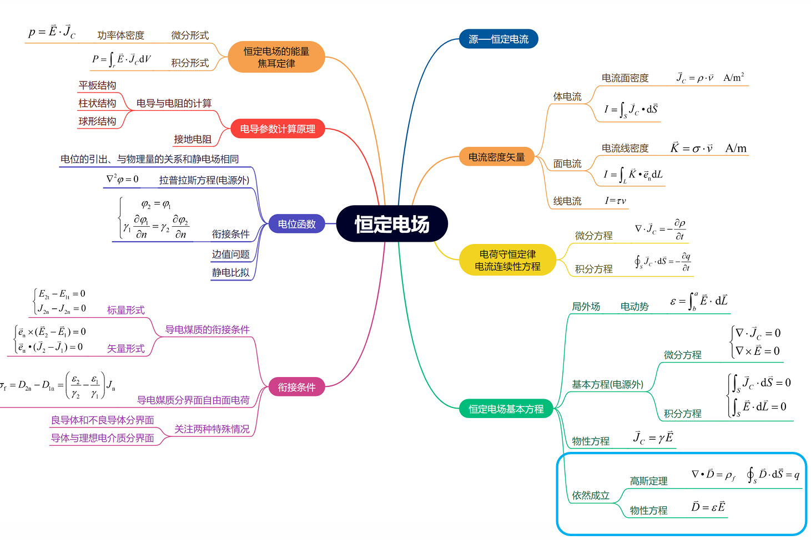

# 第2章 恒定电场

### 恒定电场知识结构图

### 恒定电场

- **研究对象**：导电媒质中的恒定电场。
- **主要特征**：电荷分布不随时间变化，处处保持动态平衡，场量仍然不随时间变化。
- **数学表达**：$\frac{\partial \rho}{\partial t} = 0\\$
- **电流分类**
  - 传导电流：在导电媒质中(如导体、电解液等)电荷的运动形成的电流称为传导电流。
  - 运流电流：在自由空间(如真空等)中，电荷的运动形成的电流称为运流电流。

## 2.1 导电媒质中的电流

### 一、电流密度矢量

1. **电流强度**：单位时间内通过任一曲面的电量值。
   $$
   I = \frac{dq}{dt}
   $$
   - 电流描述了每秒通过某一面积的电荷总量，具有通量的概念。
   - 没有说明电荷在导体截面上每一点流动的情况。

2. **电流密度矢量**：
   - **方向**：正电荷运动的方向。
   - **大小**：
     1. 单位时间内穿过与电荷运动方向相垂直的单位面积的净电量。
     2. 单位体积内的电荷，以速度 $v$ 作匀速运动时，形成电流密度矢量。
     3. 垂直于电荷运动方向单位面积上通过的电流。
     $$
     \vec{ J} = \rho \vec{ v}
     $$
     单位：A/m²

3. **不同电荷分布形成的电流**：
   - **体电流密度矢量（电流面密度矢量）**：按体密度 $\rho$ 分布的电荷，以速度 $v$ 作匀速运动时，形成电流面密度。
   $$
   \vec{ J} = \rho \vec{ v}\\
   I = \int \vec{ J} \cdot d\vec{ S} = \int \vec{ J} \cdot \vec{ e_n}d{S}
   $$
   - **面电流密度矢量（电流线密度矢量）**：按面密度 $\sigma$ 分布的电荷，以速度 $v$ 作匀速运动时，形成电流线密度。
   $$
   \vec{ K} = \sigma \vec{ v}\\
   I = \int \vec{ K} \cdot d\vec{ l} = \int \vec{ K} \cdot \vec{ e_l}d{l}
   $$
   - **线电流**：
   $$
   I=\vec\tau v
   $$

### 二、欧姆定律的微分形式

在线性、各向同性导电媒质中，任一点传导电流密度与电场强度成正比：
$$
\vec{ J} = \gamma \vec{ E}
$$
其中：
- $\gamma\\$：电导率，单位为 S/m
- $\rho_r = \frac{1}{\gamma}\\$：电阻率，单位为 $\Omega \cdot m$

> - 推导 $I=GU$
>   $$
>   I=\int \vec{ J}\cdot d\vec{ S}=\int \gamma \vec{ E} \cdot \vec{ e_n}dS=\gamma \vec{ E}\cdot\vec{ e_l}\Delta S=\frac{\gamma\Delta S}{\Delta l} \quad \vec{ E}\cdot\vec{ e_l}\Delta l=GU
>   $$
>
>   - $G=\frac{\gamma\Delta S}{\Delta l}\\$
>   - $U=\vec{ E}\cdot\vec{ e_l}\Delta l$
>
> - 只有体电流的电流面密度矢量有 $\vec{ J} = \gamma \vec{ E}$ 这个关系，而并无 $\vec{ K} = \gamma \vec{ E}$
> - 对于理想导体：$\gamma \rarr\infty$，而 $\vec{ J}$ 又是有限值，因而 $\vec{ E}$ 为 $\vec{ 0}$ ,即电流存在时，电场强度为 $0$ 
>   - 故：有传导电流的地方不一定存在电场、
> - 对于静电场中的导体，因为导体内部 $\vec{ E}$ 为 $\vec{ 0}$ ，因此静电平衡后导体内不会出现稳恒电流

### 三、焦耳定律的微分形式

**功率密度**：单位体积上的电功率。
$$
p = \lim_{\Delta V \to 0} \frac{W}{\Delta V} = \vec{ J} \cdot \vec{ E}
$$
单位：W/m³

> $$
> \begin{align}
> P&=\int pdV\\
> &=\int \vec{ J} \cdot \vec{ E}\ dV\\
> &=\int  \frac{\vec{J^2}}{\gamma}\ dV\\
> &=\frac{\vec{J^2}}{\gamma}\Delta S\Delta l\frac{\Delta S}{\Delta S}\\
> &=\frac{\Delta l}{\gamma\Delta S}\quad (\vec{J}\Delta S)^2=RI^2
> \end{align}
> $$
>
> - 要求在线性、各向同性导电媒质中
>

## 2.2 电源电动势与局外场强

### 局外力与局外场强

- **局外力** $f_e$：电源中能将正负电荷分离开来的力（不是电磁力）。
- **局外场强** $E_e=\frac{f_e}q\\$：把作用于单位正电荷上的局外力设想为一等效场强，称为局外场强，其方向由电源的负极指向正极。
  - 不是真正的电场强度，只是等效

### 电场强度

- 在电源内部场强包括局外场强 $E_e$ 和库仑场强 $E_c$。
- 在电源以外区域，只存在库仑场强 $E_c$。

> - 产生库伦场强的不是静止的电荷，而是处于动态平衡下的恒定电荷
> - 通过含源导电媒质的电流为 $\vec{ J}=\gamma(\vec{ E_e}+\vec{ E_c})$

### 电动势

- **定义**：衡量电源作功的能力。
- **电源电动势**：把单位正电荷从电源负极运动到正极时局外力所做的功。
$$
{ E} = \int_A^B \vec{ E}_e \cdot d\vec{l}
$$

> - 在电源中：$\vec{ E}=\vec{ E_e}+\vec{ E_c}$
>
> - 在电源外：$\vec{ E}=\vec{ E_c}$
>
> - 恒定电场的基本方程
>   $$
>   \oint_L\vec{ E_c}\cdot d\vec{ L}=0
>   $$
>
>   - 若 $L$ 为经过电源的闭曲线
>
>   $$
>   \oint_L\vec{ E}\cdot d\vec{ L}=\int_A^B \vec{ E}_e \cdot d\vec{l}
>   $$
>
>   - 若 $L$ 为不经过电源的闭曲线
>
>   $$
>   \oint_L\vec{ E}\cdot d\vec{ L}=0
>   $$
>
>   

## 2.3 恒定电场的基本方程 分界面上的衔接条件

### 一、电荷守恒和电流连续性
**电荷守恒定律**：单位时间流出区域 $V$ 的电荷总量等于 $V$ 内电量的减少率。
$$
\frac{\partial \rho}{\partial t} + \nabla \cdot \vec{ J} = 0
$$
在稳恒电流情形下：
$$
\frac{\partial q}{\partial t} = 0、\frac{\partial \rho}{\partial t} = 0 \implies \nabla \cdot \vec{ J} = 0、\oint_S\vec{ J}\cdot d{\vec S}=0
$$
稳恒电流没有头和尾，电流线总是闭合的。

### 二、恒定电场的基本方程

在电源外：
$$
\begin{cases}
\nabla \times \vec{E} = 0 \\
\nabla \cdot \vec{J} = 0 \\
\end{cases}
$$
- 恒定电场是无旋场。
- 恒定电场是无源场，电流线是无头无尾的闭合曲线。

$$
\begin{cases}
\oint_L\vec{ E_c}\cdot d\vec{ L}=0\\
\oint_S\vec{ J}\cdot d{\vec S}=0
\end{cases}
$$

- 恒定电场的环路线积分恒等于零，恒定电场仍是守恒场。
- 为确保导电媒质中的电场恒定，由任一闭合面（净）流出的传导电流应为零。

$$
\begin{cases}
\vec{ J} = \gamma \vec{ E}\\
\nabla\cdot\vec{ D}=\rho_f\qquad\oint_S\vec{ D}\cdot d{\vec S}=q\\
\vec{ D}=\varepsilon\vec{ E}
\end{cases}
$$

- 导电媒质的物性方程
- 高斯定理
- 物性方程

### 三、分界面上的衔接条件

1. **电场强度的切向分量**：
   $$
   E_{t2} - E_{t1} = 0
   $$
   分界面两侧电场强度的切线分量连续。

2. **电流密度的法向分量**：
   $$
   J_{n2} - J_{n1} = 0
   $$
   分界面两侧电流密度的法向分量连续。

3. **电位移矢量的法向分量：**
   $$
   D_{n2} - D_{n1} = \sigma_f
   $$
   分界面两侧电位移的法向分量不连续。
   
3. **折射关系（恒定电场的折射定律）**：
   $$
   \frac{\tan \theta_2}{\tan \theta_1} = \frac{\gamma_2}{\gamma_1}
   $$
   其中 $\theta_1$ 和 $\theta_2$ 分别为电场在分界面两侧的切向角度。
   
   - **良导体（$\gamma_1$) 与不良导体（$\gamma_2$) 媒质分界面：**
      - $\gamma_1 \gg \gamma_2 \implies \theta_2\approx0$
      - 从不良导体一侧观察，进入的电流线近似与分界面垂直
      - 在不良导体中放入良导体电极，从不良导体一侧看，可以认为电流线垂直进入或流出电极表面，电极表面可作为等位面处理
   
   - 导体与理想介质分界面 ($\gamma_2=0$) 的情况
      - 理想介质中电流密度为 $0$
      - 分界面导体侧的电流一定与导体表面平行
      - 导体与理想介质分界面上必有电荷分布
      - 电场切向分量不为零，导体表面的电场不再与导体表面垂直
         - 但一般情况下，可认为近似垂直于导体表面。
   

### 四、导电媒质中恒定电荷的分布

1. **均匀导电媒质**：
   $$
   \nabla \cdot \vec{ J} = 0 \implies \nabla \cdot \vec{ E} = 0 \implies \nabla \cdot \vec{ D} = 0 \implies \rho = 0
   $$
   均匀导电媒质中无体电荷分布，电荷只能分布在导电媒质的分界面上

   
   
2. **不均匀导电媒质**：
   $$
   \nabla \cdot \vec{ J} = 0 \implies \nabla \cdot (\gamma \vec{ E}) = 0
   $$
   在不均匀导电媒质中不仅分界面上有面电荷分布，导电媒质中也有体电荷分布
   
   

### 五、恒定电场的边值问题

- **电场强度与电位的关系**：
  $$
  \vec{ E} = -\nabla \varphi
  $$
- **拉普拉斯方程**：
  $$
  \nabla^2 \varphi = 0
  $$
- **电位的衔接条件**：
  $$
  \begin{cases}
  \varphi_1 = \varphi_2 \\
  \gamma_1 \dfrac{\partial \varphi_1}{\partial n} = \gamma_2 \dfrac{\partial \varphi_2}{\partial n}
  \end{cases}
  $$

## 2.4 导电媒质中的恒定电场与静电场的比拟

### 表1 两种场所满足的基本方程和重要关系式

|                 导电媒质中恒定电场（电源外）                 |                            静电场                            |
| :----------------------------------------------------------: | :----------------------------------------------------------: |
|                 $\nabla \cdot \vec{ J} = 0$                  |                 $\nabla \cdot \vec{ D} = 0$                  |
|                 $\vec{ J} = \gamma \vec{ E}$                 |                $\vec{ D} = \varepsilon \vec{ E}$                |
|            $I = \int_S \vec{ J} \cdot d\vec{ S}$             |             $q=\oint_S \vec{ D} \cdot d\vec{ S}$             |
| $\nabla \times \vec{ E} = 0 \implies \vec{ E} = -\nabla \varphi$ | $\nabla \times \vec{E} = 0 \implies \vec{E} = -\nabla \varphi$ |
|                     $\nabla^2 \varphi = 0$                      |                     $\nabla^2 \varphi = 0$                      |
|                $E_{1t}=E_{2t}\\J_{1n}=J_{2n}$                |                $E_{1t}=E_{2t}\\D_{1n}=D_{2n}$                |
| $\varphi_{1}=\varphi_{2}\\\gamma_1\frac{\partial\varphi_1}{\partial\vec n}=\gamma_2\frac{\partial\varphi_2}{\partial\vec n}$ | $\varphi_{1}=\varphi_{2}\\\varepsilon_1\frac{\partial\varphi_1}{\partial\vec n}=\varepsilon_2\frac{\partial\varphi_2}{\partial\vec n}$ |

### 表2 两种场对应物理量

| 静电场       | 导电媒质中恒定电场（电源外） |
| :----------: | :--------------------------: |
| $\varphi$       | $\varphi$                       |
| $\varepsilon$   | $\gamma$                     |
| $\vec{E}$ | $\vec{E}$                 |
| $\vec{D}$ | $\vec{J}$                 |
| $q$          | $I$                          |

### 启示——静电类比

在相同边界条件下，如果通过计算或测量得到一种场的分布，那么只要按上面的对应关系置换，就可以获得另外一种场的分布

## 2.5 电导和部分电导

### 一、电导(电阻)的计算
- **定义**：
  $$
  I = G U
  $$
  $$
  G = \frac{1}{R}
  $$
  
- **计算思路**：
  
  
  $$
  G = \frac{I}{U} = \dfrac{\oint_S \vec{ J} \cdot d\vec{ S}}{\oint_L \vec{ E} \cdot d\vec{ l}}
  $$
  $$
  R = \frac{U}{I} = \frac{\oint_L \vec{ E} \cdot d\vec{ l}}{\oint_S \vec{ J} \cdot d\vec{ S}}
  $$
  
- 

### 二、接地电阻和跨步电压

- **接地定义**：将电气设备的一部分和大地联接，这叫接地。
- **接地电阻**：当电流从接地体流向大地时，以及电流在大地流动时，都要遇到一定的电阻力。这些电阻统称为接地电阻。
- **跨步电压**：在电力系统中的接地体附近，由于接地电阻的存在，当有大电流在土壤中流动时，就可能使地面上行走的人的两足间的电压（跨步电压）很高，超过安全值后，将对生命产生危险。

