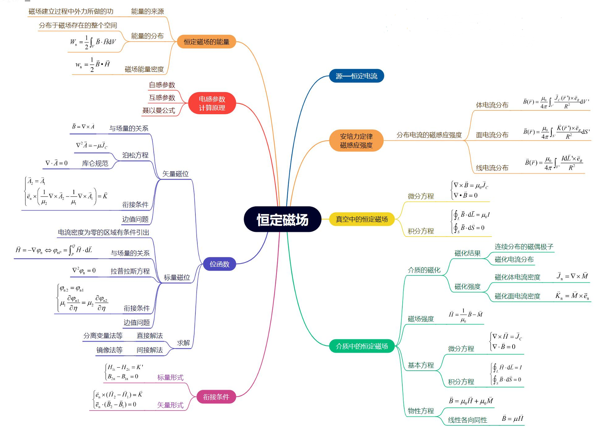

# 第3章 恒定磁场

### 恒定磁场知识结构图

### 恒定磁场

- **研究对象**：由稳恒电流激发产生的恒定磁场。
- **主要特征**：电流密度、磁感应强度、磁场强度等场量不随时间变化。
- **数学表达**：$\dfrac{\partial}{\partial t}(\cdot)=0\\$

## 3.1 磁感应强度

### 一、安培力定律

- **公式**：载流线圈 $I_1$ 对 $I_2$ 的作用力  
  $$
  \begin{align}
  \vec F &= \dfrac{\mu_0}{4\pi} \oint_{L_2} \oint_{L_1} \dfrac{I_2 d\vec{l_2} \times (I_1 d\vec{l_1} \times \vec{e}_R)}{R^2}\\
  &= \oint_{L_2}I_2 d\vec{l_2} \times\bigg(\dfrac{\mu_0}{4\pi} \oint_{L_1} \dfrac{ I_1 d\vec{l_1} \times \vec{e}_R}{R^2}\bigg)
  \end{align}
  $$
  
  - $\mu_0 = 4\pi \times 10^{-7} \, \text{H/m}$（真空磁导率）
  - 方向关系复杂，源于电流元的矢量性。

### 二、比奥-沙伐定律（Biot-Savart Law）
- **细导线(闭合回路)激发的磁场**：  
  $$
  \vec{B} = \dfrac{\mu_0}{4\pi} \oint_L \dfrac{I' d\vec{l}' \times \vec{e}_R}{R^2}
  $$

  - 单位 特斯拉（T）
  - 某点磁感应强度等于长 $1m$，电流为 $1A$ 的直导线在该点处所受到的最大的磁场力

> 用右手螺旋法则判断电流产生的磁感应强度方向
>
> - 通电直导线：用右手握住直导线，让大拇指的方向和电流的方向一致，弯曲四指方向就是磁感应线的环绕方向
> - 通电螺线管：用右手握住通电螺线管，四指的方向与电流方向相同，大拇指方向为通电螺线管内部磁感应线方向
> - 环形电流：用右手握住环形电流，四指的方向与电流方向相同，大拇指方向为环形电流内部磁感应线方向
>

- **不同电流分布的磁感应强度**：  
  $$
  \vec{B} = \dfrac{\mu_0}{4\pi}  \dfrac{q\vec{v}\times \vec{e}_R}{R^2} \quad (\text{单个运动点电荷})
  $$

  $$
  \vec{B} = \dfrac{\mu_0}{4\pi} \oint_L \dfrac{I' d\vec{l}' \times \vec{e}_R}{R^2} \quad (\text{线电流})
  $$

  $$
  \vec{B} = \dfrac{\mu_0}{4\pi} \int_{S'} \dfrac{\vec{K} dS' \times \vec{e}_R}{R^2} \quad (\text{面电流})
  $$

  $$
  \vec{B} = \dfrac{\mu_0}{4\pi} \int_{V'} \dfrac{\vec{J} dV' \times \vec{e}_R}{R^2} \quad (\text{体电流})
  $$

### 三、矢量磁位 $\vec{A}$

- **引出**：通过磁场无散性（$\nabla \cdot \vec{B} = 0$）引入矢量磁位：
  $$
  \vec{B} = \nabla \times \vec{A}
  $$
- **表达式**（库仑规范 $\nabla \cdot \vec{A} = 0$）：  
  $$
  \vec{A} = \dfrac{\mu_0}{4\pi} \int_{V'} \dfrac{\vec{J}}{R} dV' \quad (\text{体电流})
  $$
  $$
  \vec{A} = \dfrac{\mu_0}{4\pi} \int_{S'} \dfrac{\vec{K}}{R} d\vec{S}' \quad (\text{面电流})
  $$

$$
\vec{A} = \dfrac{\mu_0}{4\pi} \oint_{L'} \dfrac{I}{R} d\vec{l}' \quad (\text{线电流})
$$

### 四、磁通连续性定理

- **微分形式**：  
  $$
  \nabla \cdot \vec{B} = 0
  $$
  
  > - 恒定磁场是无散场、无源场
  > - 该公式说明：不可能单独存在磁荷，磁力线无始无终
  > - 恒定磁场线的磁力线是闭合曲线，且与闭合的电流矢量线相连
  >
  
- **积分形式（磁通密度）**：  
  $$
  \oint_S \vec{B} \cdot d\vec{S} = 0 \quad (\text{闭合面净磁通为零})
  $$

  - 以任意闭合曲线 $L$ 为边界的所有曲面上，具有相同的磁通

### 五、磁感应强度线

- 曲线上每一点的切线方向与该点磁感应强度方向一致

$$
\vec{B}\times d\vec{L}=0\implies \dfrac{\vec{B_x}}{dx}=\dfrac{\vec{B_y}}{dy}=\dfrac{\vec{B_z}}{dz}
$$

### 六、磁偶极子

- 指所围成的面积趋近于 $0$ 时的载流回路

- **磁偶极矩**：  
  $$
  \vec{m} = I \vec{S}
  $$
  
- **矢量磁位（球坐标系）：**
  $$
  \vec{A} = \dfrac{\mu_0}{4\pi}  \dfrac{\vec{m}\times \vec{e_r}}{r^2}  = \dfrac{\mu_0}{4\pi}  \dfrac{IS\sin \theta}{r^2}\vec{e_{\phi}}
  $$
  
- **磁场表达式（球坐标系）：**  
  $$
  \vec{B} = \dfrac{\mu_0 m}{4\pi r^3} (2\cos\theta \vec{e}_r + \sin\theta \vec{e}_\theta)
  $$

## 3.2 安培环路定律——恒定磁场的旋度方程

### 一、真空中的安培环路定律

- **微分形式**：  
  $$
  \nabla \times \vec{B} = \mu_0 \vec{J}_C
  $$
  
  > - 磁场是有旋场(涡旋场)，与磁场的散度方程一致
  > - 磁感线与电流垂直并相互交链
  > - 属于自由电流所激发的磁场
  
- **积分形式**：  
  $$
  \oint_L \vec{B} \cdot d\vec{l} = \mu_0 \sum I_i \quad (\text{闭合路径包围的传导电流代数和})
  $$

  > - 用于求磁场
  > - 在真空稳恒磁场中，$\vec{B}$ 沿任一闭合路径的积分，等于 $\mu_0$ 乘该闭合路径所包围面积的各电流的代数和；
  >   - 如果电流的方向和积分回路的绕行方向符合右手螺旋关系，式中的电流取正号
  > - $\vec{B}$ 对任意闭合曲线 $L$ 的环流不恒等于零，磁场是非保守力场，没有磁势的概念

### 二、媒质的磁化

> - 自然界中的所有实体物质都是磁介质
>
> - 物质由分子或原子组成，分子或原子中任何一个电子都不停的同时参与两种运动，即环绕原子核的轨道运动和电子本身的自旋运动。这两种运动都等效于一个电流分布，因而能产生**磁效应**
>
> - 把分子或原子看成一个整体，分子或原子中各个电子对外界所产生磁效应的总和，可用一个等效的圆电流表示，统称为**分子电流**
> - 在没有外磁场作用时，由于热运动，分子磁矩排列是随机的，因此总的磁矩等于零，整块物质对外不显磁性
> - 若把物体放入外磁场中，外磁场将对分子磁矩有转矩作用，其方向与外磁场方向趋于一致，使得分子磁矩的排列比较有序化。此时总磁矩不为零，物质对外呈现磁性，这种现象称为媒质（磁介质）的磁化
> - 磁化使得磁媒质中出现了宏观的附加电流，称为磁化电流，属于束缚电流

- **分子磁矩 $\vec{m}$​**
  $$
  \vec{m}=I\vec{S}
  $$

- **磁化强度 $\vec{M}$**
  $$
  \vec{M} = \lim_{\Delta V \to 0} \dfrac{\sum \vec{m}_i}{\Delta V} \quad (\text{单位体积磁矩矢量和})
  $$
  单位 A/m

- **磁化电流**：  

  - 体电流密度：$\vec{J}_M = \nabla \times \vec{M}$  
  - 面电流密度：$\vec{K}_M = \vec{M} \times \vec{e}_n$

  > - 磁介质对磁场的影响，可归结为磁化后磁化体电流和磁化面电流在真空所产生的作用
  >
  > - **整个媒质中，所有磁偶极矩在场点处产生的矢量磁位**
  >   $$
  >   \vec A=\dfrac{\mu_0}{4\pi}\int_{V'}\dfrac{\vec {J_M}(\vec r')}{R}dV'+\dfrac{\mu_0}{4\pi}\oint_{S'}\dfrac{\vec {K_M}(\vec r')}{R}dS'
  >   $$
  >
  > - **磁化电流激发的磁场**
  >   $$
  >   \begin{cases}
  >   \nabla\times\vec{B_M}=\mu_0\vec{J_M}\\
  >   \nabla\cdot\vec{B_M}=0
  >   \end{cases}
  >   $$
  >
  > - **自由电流激发的磁场**
  >   $$
  >   \begin{cases}
  >   \nabla\times\vec{B_C}=\mu_0\vec{J_C}\\
  >   \nabla\cdot\vec{B_C}=0
  >   \end{cases}
  >   $$

### 三、磁场强度 $\vec{H}$

- **定义**：  
  $$
  \vec{H} = \dfrac{\vec{B}}{\mu_0} - \vec{M}
  $$
  单位 A/m
  
  其中 $\vec B = \vec{B_C}+\vec{B_M}$

- **媒质中的安培环路定律**：  
  $$
  \nabla \times \vec{H} = \vec{J}_C \quad \text{或} \quad \oint_L \vec{H} \cdot d\vec{l} = I_C\\\oint_L \vec{B} \cdot d\vec{l} = \mu_0(I_C+I_M)
  $$

  > - 表明静磁场中任一点上磁场强度的旋度等于该点的传导电流面密度
  > - 在磁场中，磁场强度沿任一闭合路径的线积分等于穿过该回路所包围面积的自由电流(不包括磁化电流)的代数和

### 四、物性方程（各向同性线性媒质）

- **本构关系**：  
  $$
  \vec{B} = \mu_0(\vec H+\vec M)=\mu_0(1+\chi_M)\vec H = \mu_0 \mu_r \vec{H}=\mu \vec{H}
  $$
  
  - 媒质的磁化率：$\chi_m$ 
  - 相对磁导率：$\mu_r = 1 + \chi_m$
  - 媒质的磁导率：$\mu$ (H/m)

## 3.3 恒定磁场基本方程与分界面衔接条件

### 一、基本方程组
- **微分形式**：  
  $$
  \begin{cases}
  \nabla \times \vec{H} = \vec{J}_C \\
  \nabla \cdot \vec{B} = 0 \\
  \vec{B} = \mu \vec{H}
  \end{cases}
  $$
  
  > - 恒定磁场是有旋场，电流密度是磁场的涡旋源
  > - 恒定磁场是无源场，磁感应线是无头无尾的闭合曲线，没有磁荷的存在
  > - 各向同性线性介质的构成方程
  
- **积分形式**：  
  $$
  \begin{cases}
  \oint_L \vec{H} \cdot d\vec{l} = I_C \\
  \oint_S \vec{B} \cdot d\vec{S} = 0
  \end{cases}
  $$
  
  > - 恒定磁场的环路线积分等于与积分路径相交链的所有自由电流代数和
  > - 磁通连续性定理，由任一闭合面穿出的净磁通等于零

### 二、分界面衔接条件

1. **磁场强度切向分量不连续**：  
   $$
   \vec{e}_n \times (\vec{H}_2 - \vec{H}_1) = \vec{K} \implies H_{1t} - H_{2t} = K\implies\dfrac{B_{1t}}{\mu_1}-\dfrac{B_{2t}}{\mu_2}=K
   $$
   
2. **磁感应强度法向分量连续**：  
   $$
   B_{2n} - B_{1n}=0\implies
   \mu_2H_{2n}-\mu_1H_{1n}=0
   $$
   
3. **矢量磁位衔接条件（平行平面磁场）**：  
   $$
   \begin{cases}
   A_1 = A_2 \\
   \dfrac{1}{\mu_1} \dfrac{\partial A_1}{\partial n} - \dfrac{1}{\mu_2} \dfrac{\partial A_2}{\partial n} = K
   \end{cases}
   $$

## 3.4 磁矢位与恒定磁场边值问题

### 一、矢量磁位的微分方程
- **泊松方程**（存在电流分布）：
  $$
  \nabla^2 \vec{A} = -\mu \vec{J_C}
  $$
- **拉普拉斯方程**（无电流分布）：  
  $$
  \nabla^2 \vec{A} = 0
  $$

## 3.5 标量磁位

### 一、定义与条件
- **定义**（传导电流为零的区域）：
  $$
  \vec{H} = -\nabla \varphi_m
  $$
  
- **拉普拉斯方程**：  
  $$
  \nabla^2 \varphi_m = 0
  $$
- **衔接条件**：  
  $$
  \begin{cases}
  \varphi_{m1} = \varphi_{m2} \\
  \mu_1 \dfrac{\partial \varphi_{m1}}{\partial n} = \mu_2 \dfrac{\partial \varphi_{m2}}{\partial n}
  \end{cases}
  $$

> - $\phi_m$ 的提出有条件（传导电流为0）
> - 电位多值 $\rarr$ 参考点 
> - 磁位多值 $\rarr$ 参考点 + 积分路径 
> - 物理意义（标量磁位没有物理意义）

## 3.6 磁场能量与力

### 一、磁场能量
- **能量密度**：  
  $$
  w_m = \dfrac{1}{2} \vec{B} \cdot \vec{H}
  $$
- **总能量**：  
  $$
  W_m = \dfrac{1}{2} \int_V \vec{B} \cdot \vec{H} \, dV
  $$

