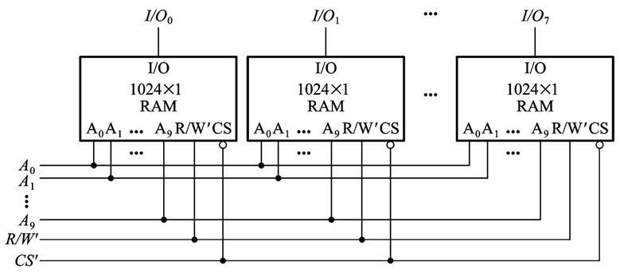
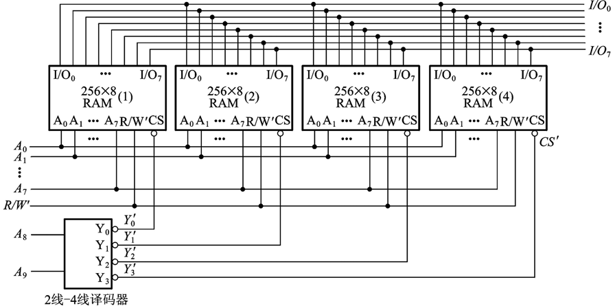
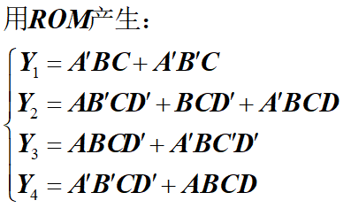
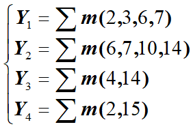
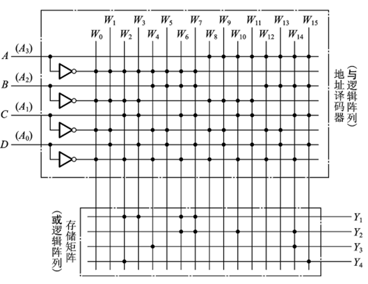

# 数电（十）：存储器

## 一、概念
- **存储单元**：用于存储单个二值信息（0或1）
- **存储器**：由大量存储单元组成，用于存储大量二值信息


### 二、存储器的基本结构

- **存储矩阵**：包含大量存储单元
- **地址译码器**：输入地址经过地址译码器，选择具体存储单元
- 数据的基本流向为：
  $$
  \text{输入地址} \rightarrow \text{地址译码器} \rightarrow \text{存储矩阵} \rarr 输出缓冲器 \rarr 数据输出
  $$


## 三、分类

- 分类1：从存取功能分类

  - 只读存储器（ROM - Read Only Memory）

    - 数据一经写入，通常只能读取，不能修改。

    - **特点**：
      - 数据断电后不丢失（非易失性存储器）。
      - 常用于存储固化数据（如程序固件）。

    - **分类**：
      1. **掩膜 ROM**：
         - 数据在制造时直接固化到芯片中。
         - 优点：生产成本低，适合大批量生产。
         - 缺点：数据不可更改。
      2. **可编程 ROM (PROM)**：
         - 用户可以通过专用设备编程，但编程后不可修改。
         - 编程方式：通过熔丝技术。
      3. **可擦除可编程 ROM (EPROM)**：
         - 数据可通过紫外线擦除后重新写入。
         - 集成了透明窗口，用于紫外线照射。
      4. **电可擦除可编程 ROM (EEPROM)**：
         - 支持通过电信号擦除和重新写入，无需紫外线。


  - 随机读写存储器（RAM - Random Access Memory）

    - 数据可随机读写，但断电后数据丢失（易失性存储器）。

    - **分类**：
      1. **静态 RAM (SRAM)**：
         - 使用双稳态触发器（SR锁存器）存储信息。
         - 优点：速度快，功耗低。
         - 缺点：占用面积大，集成度低。
      2. **动态 RAM (DRAM)**：
         - 使用MOS电容存储信息，需要周期性刷新。
         - 优点：存储密度高，成本低。
         - 缺点：存取速度相对较慢。


- 分类2：从工艺分类

  - **双极型存储器**：
    - 使用双极型晶体管制造。
    - 优点：速度快。
    - 缺点：功耗高，集成度低。

  - **MOS型存储器**：
    - 使用金属氧化物半导体（MOS）技术制造。
    - 优点：功耗低，集成度高。
    - 缺点：速度相对较慢。


---


## 四、静态随机存储器（SRAM）

- **主要组成部分**：
   - **地址译码器**：
     - 负责将输入地址转化为行、列的选择信号。
   - **存储矩阵**：
     - 包含存储单元数组。
   - **读写控制电路**：
     - 控制存储器的读写操作。
   - **输入/输出接口 (I/O)**：
     - 实现数据与外部的交互。

- **读写控制信号**：
   - $\text{R/W}' $：读/写控制信号。
     - $1 $：读操作。
     - $0 $：写操作。
   - $\text{CS}' $（片选输入端）：使能端。
     - $0 $：存储器处于正常工作状态。
     - $1 $：存储器处于高阻状态（不工作）。


- **并行输出**：

   - 并行输出的一组数据称为**一个字**。
   - 每个存储器地址存储一个字。
   - **容量表示方式**：
     $$
     \text{容量} = \text{字数} \times \text{每个字的位数}
     $$

---


## 五、只读存储器（ROM）

- **主要组成部分**：
   - **地址译码器**：
     - 通常使用二极管钳位方法，判断电流流向。
   - **存储矩阵**：
     - 使用二极管或其他逻辑器件实现。
     - 数据存储方式：
       - **1**：接入存储矩阵。
       - **0**：不接入存储矩阵。
   - **输出缓冲器**：
     - 提升输出信号的驱动能力。
- **缺点**：
   - 存在电压偏移。
   - 带负载能力差。

---


## 六、存储容量的扩展

在实际应用中，当单一存储器容量不能满足需求时，可以通过扩展方式实现更大的存储容量。扩展方式包括位扩展和字扩展。

### 1. 位扩展
- **目标**：增加存储字的位数（即每个地址存储更多数据位）。

- **方法**：
  
  1. 将多个存储器的地址线、读写控制线、片选控制线**并联**。
  2. 每片存储器负责不同的位组，比如：
     - 存储器A存储数据的低8位。
     - 存储器B存储数据的高8位。
  3. 数据线按位分组后分别连接到多个存储器的输出端。
  
- **示意图**：
  ```
  地址线 ——→ 存储器A（低8位）
          ——→ 存储器B（高8位）
  读写线 ——→ 并联
  片选线 ——→ 并联
  ```

- **效果**：
  如果原存储器支持 $2^m$ 个地址，每个地址存储 $n$ 位，通过位扩展可以实现 $2^m \times (n \times k)$ 位的数据存储（$k$ 为存储器片数）。



---

### 2. 字扩展
- **目标**：增加存储字的数量（即存储更多地址）。

- **方法**：
  1. 在片选线中引入**地址译码器**（如2线-4线或3线-8线译码器），以激活不同存储器。
  2. 通过扩展地址线，增加可寻址的存储地址范围。
  3. 每块存储器负责不同的地址范围。

- **示意图**：
  ```
  地址线高位 ——→ 译码器 ——→ 片选（CS）信号
  地址线低位 ——→ 并联到所有存储器
  ```

- **效果**：
  如果每片存储器支持 $2^m$ 个地址，通过字扩展可以实现 $k \times 2^m$ 个地址的存储（$k$ 为存储器片数）。



---

### 3. 位扩展和字扩展组合
位扩展和字扩展可以结合使用，既增加每个地址存储的数据位数，又扩展存储地址的范围。组合后的容量为：
$$
\text{容量} = (\text{字数扩展倍数}) \times (\text{每字位数扩展倍数}) \times \text{单片容量}
$$

---


## 七、用存储器实现组合逻辑函数

### 1. 基本原理
- 存储器可以作为查找表（LUT，Lookup Table）使用，将输入变量对应的输出值存储在存储单元中，从而实现组合逻辑功能。
- **实现步骤**：
  1. 确定组合逻辑函数的真值表。
  2. 根据真值表将输出数据写入存储矩阵中。
  3. 使用输入变量作为地址输入，直接获得对应输出。


### 2. 点阵图（重点）

点阵图是存储逻辑函数实现的重要工具，基本结构如下：
1. **输入端**：输入变量信号。
2. **与矩阵（AND Matrix）**：
   - 将输入信号组合，生成最小项（与项）。
3. **或矩阵（OR Matrix）**：
   - 对最小项进行按逻辑函数设计的或操作，生成最终输出。
4. **输出端**：输出逻辑函数结果。


### 3. 应用实例

- **实现方式**：
  1. 输入 $A, B, C$
  2. 使用与矩阵生成所有最小项
  3. 通过或矩阵对特定最小项进行逻辑或操作得出最终结果






