# 数电（七）：门电路

### 一、门电路概述

* **门电路**
    * 实现基本逻辑运算和复合逻辑运算的单元电路，是数字电路系统的基本组成部分

* **正负逻辑系统**
    * 定义逻辑电平与物理电平之间对应关系的系统
    * 两种逻辑
        * **正逻辑**（实际应用中，正逻辑更为常见）
            * 高电平代表逻辑 $1$
            * 低电平代表逻辑 $0$

        * **负逻辑**
            * 低电平代表逻辑 $1$
            * 高电平代表逻辑 $0$

* **高低电平的实现：开关电路**
    *  通过开关电路的通断来实现高低电平的转换
    * 开关器件
        * **二极管**: 利用二极管的单向导电性
        * **三极管**: 利用三极管的放大作用和开关特性

* **数字电路**:
    *  处理离散数值信号的电路
    * **优点**:
        * 抗干扰能力强
        * 可靠性高
        * 易于集成
        * 设计方便

    * **分类**:  
      * 分立
      * 集成

### 二、半导体二极管门电路

* **开关特性**

    * 二极管具有单向导电性，可以作为开关元件使用
    * **开关特性同模电笔记**
        * 稳态开关特性

* **二极管与门**

    * 由二极管和电阻构成的与门电路

    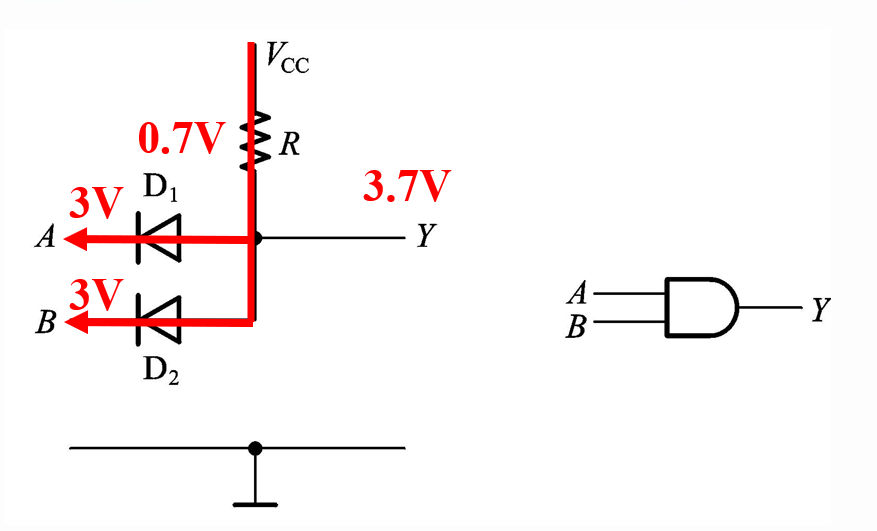

    |  A   |  B   |  Y   |
    | :--: | :--: | :--: |
    |  0   |  0   |  0   |
    |  0   |  1   |  0   |
    |  1   |  0   |  0   |
    |  1   |  1   |  1   |

    * **优点**
        * 电路简单

    * **缺点**:
        * 电平有偏移
          * 输出电压和输入电压不等
          * 相差一个二极管的正向压降（约 $0.7V$ ）
          * 在多级电路中会产生电压偏移
        * 带负载能力差
          * 负载变化会影响输出高电平值

* **二极管或门**

    * 由二极管和电阻构成的或门电路

        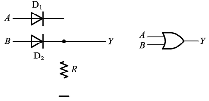

        |  A   |  B   |  Y   |
        | :--: | :--: | :--: |
        |  0   |  0   |  0   |
        |  0   |  1   |  1   |
        |  1   |  0   |  1   |
        |  1   |  1   |  1   |

    * **优缺点**: 与二极管与门类似

- 只用于集成电路内部电路逻辑单元，无法制作具有标准化输出电平的集成电路

### 三、CMOS门电路

* **MOS管的开关特性**

    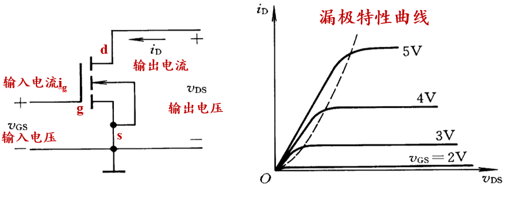

    * MOS管可以作为电子开关使用

    * 具有高输入阻抗和低输出阻抗的特点

    * **MOS管的结构和工作原理**
        
        * MOSFET由栅极、源极和漏极构成，通过栅极电压控制源极和漏极之间的导通状态
        
    * **MOS管的输入特性和输出特性**
        
        * **截止区**: 栅源电压小于阈值电压，MOS管不导通
        * **恒流区**:  MOS管导通，漏极电流近似恒定
        * **可变电阻区**: MOS管导通，漏极电流随漏源电压变化
        
    * **MOS管的基本开关电路**

        * 利用MOS管的截止区和导通区实现开关功能
            * 输入较小时，工作在截止区
                * 相当于断开开关
            * 输入较大时，工作在可变电阻区
                * 分压小，相当于闭合开关

    * **MOS管的四种类型**

        * N沟道增强型MOSFET
        * N沟道耗尽型MOSFET
        * P沟道增强型MOSFET
        * P沟道耗尽型MOSFET

        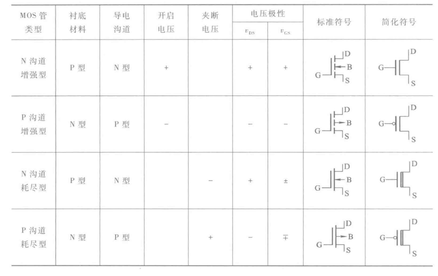

* **CMOS反相器的电路结构和工作原理**

    * **电路结构**

        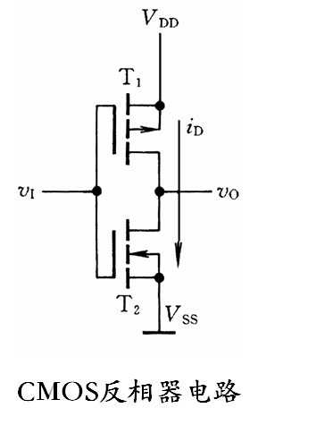

        * 上 $P$ 下 $N$，构成互补对称电路
            * 栅极连栅极、漏极连漏极
            * 源极上接 $V_{DD}$ ，下接 $GND$
            * 漏极输出
        * 都是增强型MOS管

    * **电压电流传输特性**

        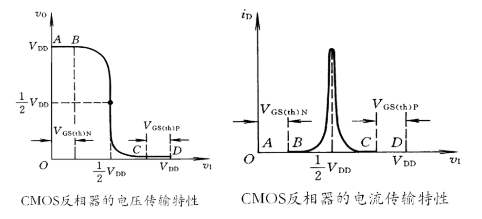

        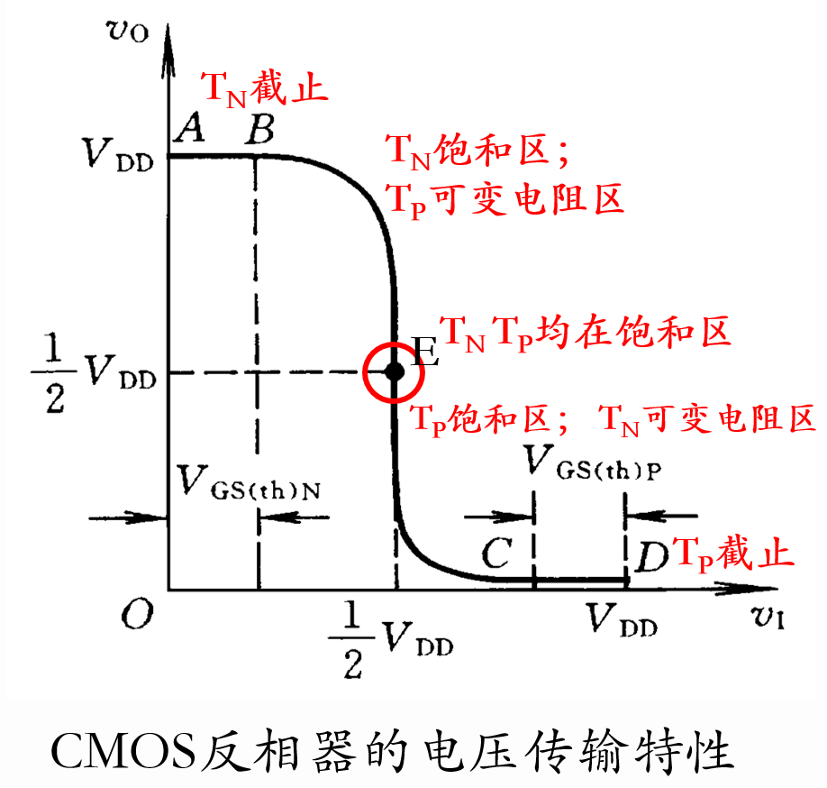

        * **低电平输入**

            *  $P$ 导通，$N$ 截止
            * 输出高电平

        * **高电平输入**

            * $P$ 截止，$N$ 导通
            * 输出低电平。

        * **转折区**

            *  输入电压在阈值电压附近时，$P$ 和 $N$ 同时导通，电流较大，不宜长时间工作在此区域

        * **特点**:
            * 输入端噪声容限（波动范围）高

              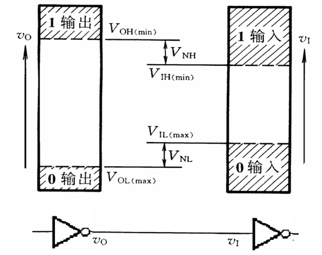

              * $V_{NH} = V_{OH(min)} - V_{IH(min)}$

              * $V_{NL} = V_{IL(max)} - V_{OL(max)}$

              * 可以通过提高 $V_{DD}$ 来进一步提高噪声容限

                

            * 静态功耗低

              * 静态电流极小

            * 工作速度快

              * $t_{pd}\simeq10\ ns$

    * **静态特性**:
        * **输入特性**

            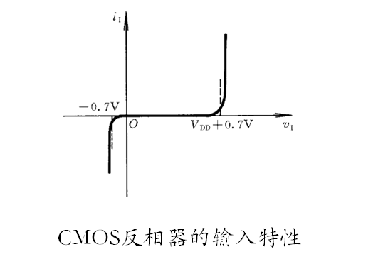

            * 保护电路

                * 通常使用分布式二极管结构，可通过较大电流

                    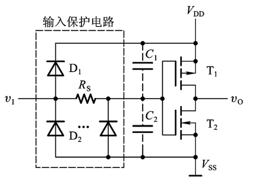

            * 栅极等效电容

                * MOS管的栅极和衬底之间存在寄生电容

            * 负载门

                * 输入电流很小，通常在微安级别
                * 输入电流方向判断
                    * 驱动门输出高电平：由 $V_{DD}$ 流入负载门
                    * 驱动门输出低电平：由负载门输出端流到负载门输入端

        * **输出特性**

            * 与负载电流的大小有关

                * 随着 $V_{DD}$ 的提升，电流变化对输出电平的影响逐渐下降，输出更加稳定

            * 低电平

                * NMOS导通，电流方向为从输出端流向 $GND$

                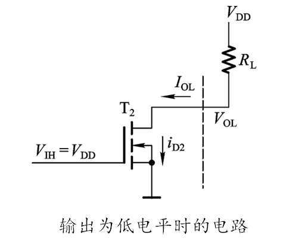

                * 输出电压随电流大小增加而提高

                    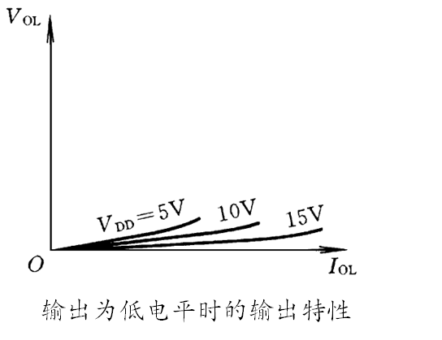

            * 高电平

                * PMOS导通，电流方向为从 $V_{DD}$ 流向输出端（与图中相反）

                

                * 输出电压随电流大小增加而下降

                

    * **动态特性**:

        * **传输延迟时间**
          *  $t_{pd} = \frac{1}{2}(t_{PHL} + t_{PLH})$
          * $t_{PHL}$是从高电平到低电平的延迟时间
          * $t_{PLH}$是从低电平到高电平的延迟时间
          * 延迟时间受寄生电容和负载电容的影响
        * **扇出**
          * 指一个门电路能够驱动同类型门电路的数目
          * CMOS门电路的静态扇出很大，**动态扇出较小，通常为几十个**

    

    * **各种逻辑类型的CMOS门电路**:

        * **与非门**

          *  **N串P并**

            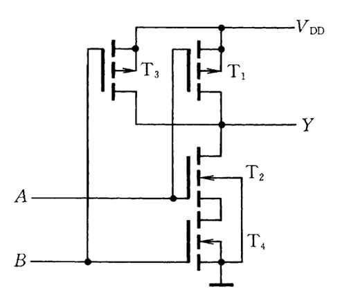

          * P为工作管，N为负载管

        * **或非门**

          *  **N并P串**

            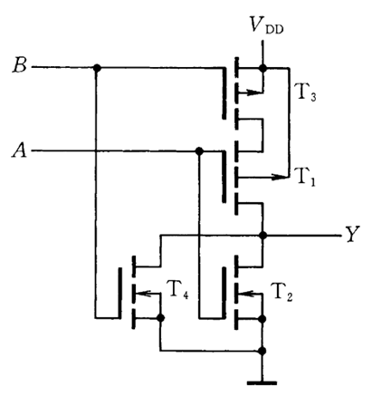

    

    * **带缓冲级的CMOS门电路**
        * 为了提高驱动能力和稳定性，**在输入端和输出端增加反相器**作为缓冲级
        * 原因
            * 输出电阻受输入端状态影响
            * 输出电平受输入端数目的影响
            * 输入端工作状态不同时对电压传输特性也有影响
        * 变化
            * 或非门 + 缓冲器 = 与非门
            * 与非门 + 缓冲器 = 或非门
        * 优点
            * 输入输出电阻基本固定
            * 输入端噪声容限大
            * 输出高低电平摆幅大
            * 电压传输特性更陡

    

    * **漏级开路输出门电路（OD门）**

        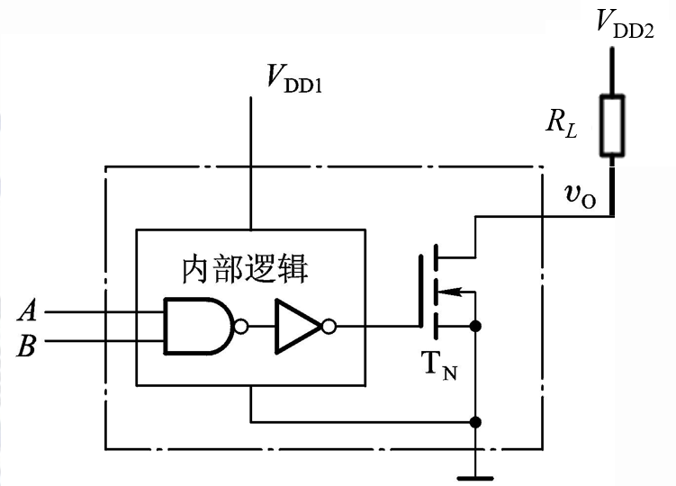

        * **原因**

            * 满足输出电平转换
            * 输出大负载电流
            * **实现线与连接**

        * **OD门的并联使用**

            * 可以实现线与逻辑。

            * OD输出的**与非门符号、线与符号**

                

                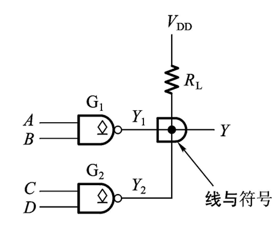

            * 输出 $Y = (AB + CD)'$ ，即**与或非**

        * **上拉电阻的范围计算**:

            * 输出端是NMOS的漏极，需要外接上拉电阻

                * $R_L$ 上的压降不能太大，否则高电平会低于标准值
                * $R_L$ 上的压降不能太小，否则低电平会高于标准值

            * $R_{Lmax} = \frac{V_{DD} - V_{OH}}{nI_{OH} + mI_{IH}}\\$  

                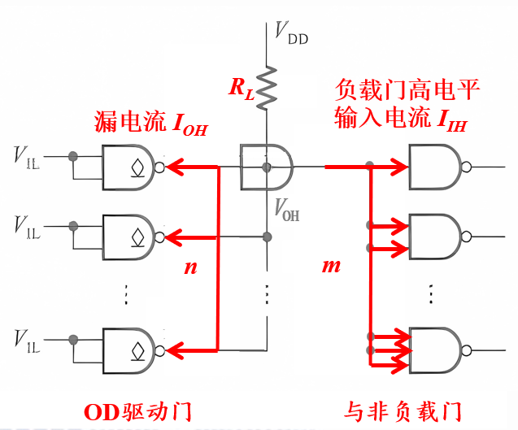

                * 驱动边
                    * $n$ 为驱动门输出高电平的个数
                    * $I_{OH}$ 为驱动门输出高电平时的漏电流
                * 负载边
                    * $m$ 为负载门高电平输入的个数
                    * $I_{IH}$ 为负载门高电平输入电流

            * $R_{Lmin} = \frac{V_{DD} - V_{OL}}{I_{OLmax} - m'|I_{IL}|}\\$ 

                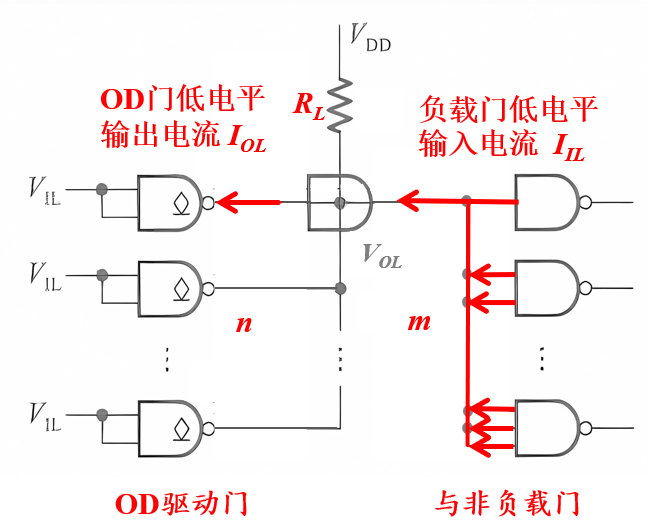

                * 驱动边（仅1门输出低电平）
                    * $I_{OL}$ 为驱动门输出高电平时的漏电流
                * 负载边
                    * $m'$ 为负载门低电平输入的个数
                    * $I_{IL}$ 为负载门低电平输入电流

    

    * **CMOS传输门**

        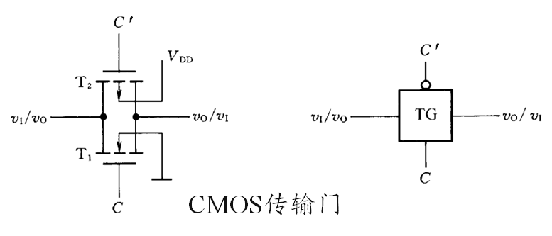

        * **结构**

            * 上 $P$ 下 $ N$，都是增强型MOS
            * 横向连接，上下对称
                * 左右输入输出可对调
            * 栅极分别接控制信号和其反相信号
                * 上 $C'$ 下 $C$ 

        * **逻辑**

            * 模拟开关
            * 当控制信号为高电平时导通，为低电平时截止

            

    * **三态输出的CMOS门电路（三态门）**

        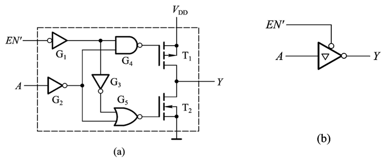

        * 输出可以处于高电平、低电平或高阻态。

        * **输出缓冲器、三态反相器**

          * 总是接在集成电路的输出端

        * **功能**

            * $EN' = 0$ 时，作为反相器正常工作
            * $EN' = 1$ 时，输出呈高阻态
                * 高阻态指的是电路的一种输出状态，既不是高电平也不是低电平
                * 理论上高阻态不是悬空，它是对地或对电源电阻极大的状态
                * 如果高阻态再输入下一级电路的话，对下级电路无任何影响，和没接一样
                * 如果用万用表测的话有可能是高电平也有可能是低电平，随其后级而定。

        * **用途**

            * 总线结构

                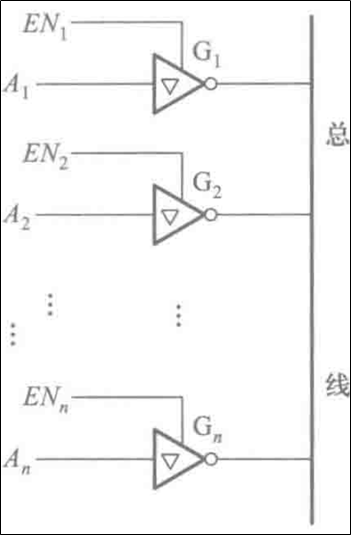

                * 使能端不能同时为 $1$

            * 数据的双向传输

                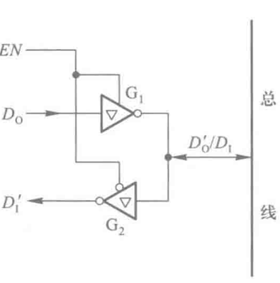

### 四、TTL门电路

* **TTL反相器**

    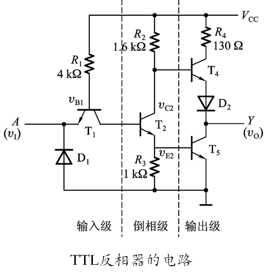

    * **电路结构**:

        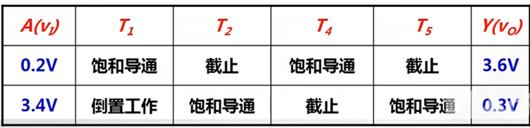

        * 输入级
            * 作用
                * 提高可靠性
                * 保护输入端
                * 提高动态特性
            * 结构
                * $T_1$ 管为单发射极输入
                * $D_1$ 钳位二极管
                    * 抑制输入端可能出现的负极性干扰脉冲
                    * 防止输入电压为负时，发射极电流过大，起保护作用
            * 跟随关系
                * 输入低电平
                    * $T_1$ 的 $be$ 和 $bc$ 导通（双二极管并联等效）
                    * $c$ 端输出低电平
                * 输入高电平
                    *  $T_1$ 的 $be$ 截止， $bc$ 导通，处于反向放大状态
                    * $c$ 端输出高电平
        * 倒相级
            * $T_2$ 管作为倒相级，将输入级的输出电平反相
        * 推拉式输出级
            * 由 $T_4$ 和 $T_5$ 组成
            * $D_2$ 确保 $T_5$ 导通时 $T_4$ 可靠地截止
            * 输出级上下两管总一管导通一管截止，静态功耗较低，提高带负载能力
            * 输出电阻低，输出高低电平固定

    

    * **电压传输特性**

        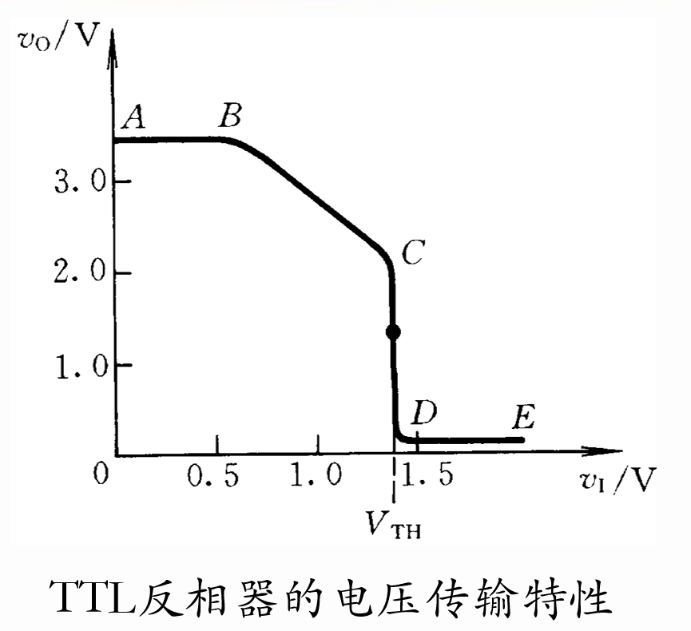

    * **静态特性**:

        * 输入特性
            
            * 输入短路电流 $I_{IS}$
            
                * 和输入电流值相近，故分析和计算时代替$I_{IL}$
            
            * 输入端等效电路
            
                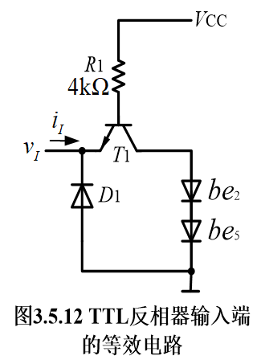
            
            * 输入特性曲线
            
                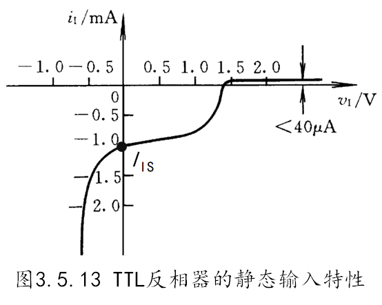
            
        * 输出特性:
            * 高电平

              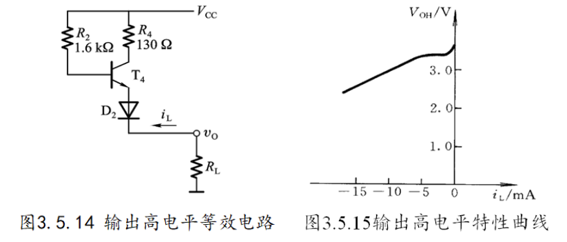

            * 低电平

              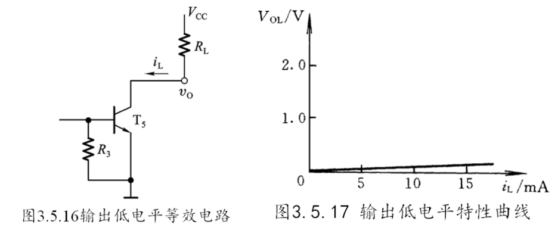

            * 扇出系数

              * $N = min({N_1, N_2})$
              * $N_1\leq\frac{I_{OL(max)}}{|I_{IL}|}\\$为低电平扇出系数
              * $N_2\leq\frac{I_{OH(max)}}{|I_{IH}|}\\$为高电平扇出系数

        * 输入端负载特性
            * 输入低电平：$R_p < 700\Omega$
            * 输入高电平：$R_p>1.5k\ohm$

* **其他的TTL门电路**

    * **与非门**

        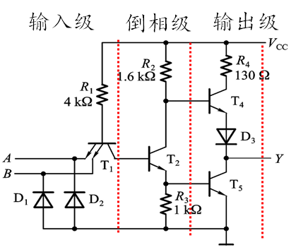

        * 输入级采用多发射极晶体管
        * 输入电流
            * 低电平：与反相器相同，与输入端个数无关
            * 高电平：为反相器的两倍

    

    * **或非门**

        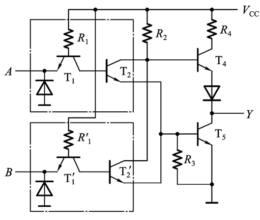

        * 输入级采用多个晶体管并联
        * 输入电流
            * 高低电平输入电流都是反相器的两倍

    

    * **集电极开路与非门（OC门）**

        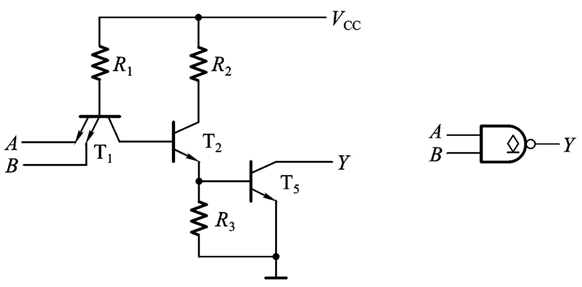

        * 可以实现线与逻辑

            * 若利用OC门实现线与功能，则将几个OC门的输出并联起来用一个上拉电阻即可

                

    

    * **三态TTL与非门**

        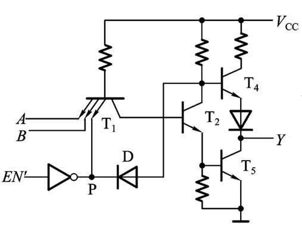

        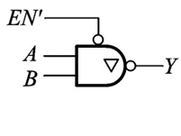

        * 输出可以处于高电平、低电平或高阻态
        * 使能端 $EN'$: 控制输出状态
            * 控制端高电平有效电路
              * $EN' = 1$ 时，电路正常工作
            * 控制端低电平有效电路
              * $EN' = 0$ 时，电路正常工作

