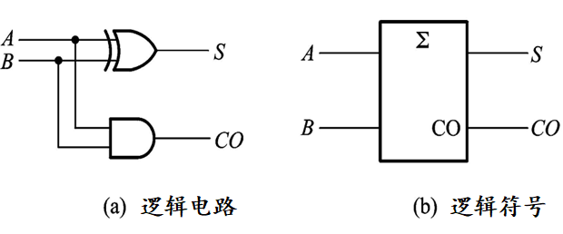
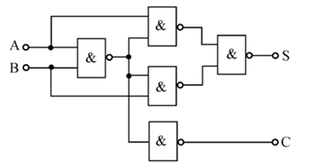
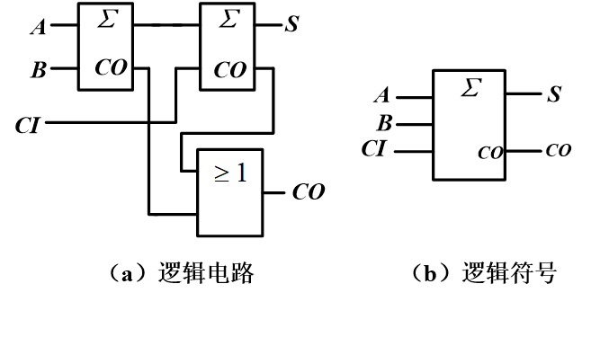
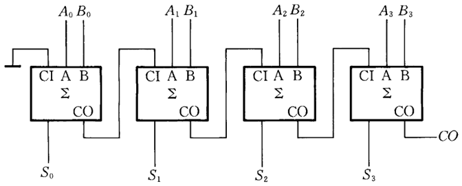
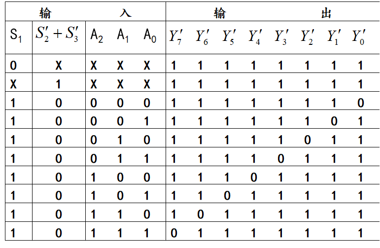
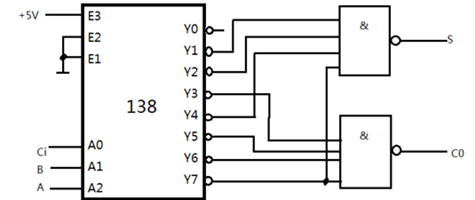

# 数电（八）：加法器

* **组合逻辑电路**
    * 输出只取决于当前输入，与时间无关
    * **分析步骤**:
        1. 根据电路图写出逻辑表达式
        2. 化简逻辑表达式
        3. 列出真值表
        4. 分析逻辑功能
    * **设计步骤**:
        1. 确定输入输出变量
        1. 确定各逻辑状态的赋值
        2. 列出真值表
        3. 写出逻辑表达式
        4. 用卡诺图化简逻辑表达式
        5. 绘制逻辑电路图
    

* **1位加法器**:

    * **半加器**
        
        * 实现两个1位二进制数相加，输出和（$S$）与进位（$CO$）
        
            
        
        * 真值表:
        
            | 加数 | 被加数 | 本位的和 | 进位 |
            | :--: | :----: | :------: | :--: |
            |  A   |   B    |    S     |  CO  |
            |  0   |   0    |    0     |  0   |
            |  0   |   1    |    1     |  0   |
            |  1   |   0    |    1     |  0   |
            |  1   |   1    |    0     |  1   |
        
        * 逻辑表达式
        
            *  $S = A'B+AB'=A \oplus B$
            *  $CO = AB$
        
        * 由与非门组成
        
            
        
            

    

    * **全加器**

        * 实现两个1位二进制数和低位进位（$CI$）相加，输出和（$S$）与进位（$CO$）

            

        * 真值表
            |  A   |  B   | $CI$ |  S   | $CO$ |
            | :--: | :--: | :--: | :--: | :--: |
            |  0   |  0   |  0   |  0   |  0   |
            |  0   |  0   |  1   |  1   |  0   |
            |  0   |  1   |  0   |  1   |  0   |
            |  0   |  1   |  1   |  0   |  1   |
            |  1   |  0   |  0   |  1   |  0   |
            |  1   |  0   |  1   |  0   |  1   |
            |  1   |  1   |  0   |  0   |  1   |
            |  1   |  1   |  1   |  1   |  1   |

        * 逻辑表达式

            * $S =(A^′ B^′ CI^′+A^′ B⋅CI+AB^′ CI+ABCI^′ )^′ =A \oplus B \oplus CI$
            * $CO =(A^′ B^′+B^′ CI^′+A^′ CI^′ )^′= AB + CI·(A\oplus B)$

* **多位加法器**:

    * **串行进位加法器**

        * 由多个全加器级联而成，低位全加器的进位输出作为高位全加器的进位输入

            

        * 优点

            * 电路结构简单

        * 缺点

            * 运算速度慢，因为高位的计算必须等待低位的进位信号

    

    * **超前进位加法器**

        * 通过计算每一位的进位输出，加快运算速度

        * 向高位的进位信号

            * $(CO)_i=A_i B_i+(A_i+B_i)(CI)_i$
            * $(CI)_i=(CO)_{i-1}$

        * 第 $i$ 位和

            * $S_i=A_i \oplus B_i \oplus (CI)_i$

        * 优点

            * 运算速度快，每1位的和及最后的进位基本同时产生

        * 缺点

            * 电路复杂度较高

            

        * 进位产生函数（$G_i$）和进位传递函数（$P_i$）

            * $G_i = A_iB_i$

            * $P_i = A_i \oplus B_i$

            * 则进位信号可写成
                $$
                \begin{aligned}
                (𝐶𝑂)_𝑖&=𝐺_𝑖+𝑃_𝑖 (𝐶𝐼)_𝑖
                \\&=𝐺_𝑖+𝑃_𝑖 [𝐺_{𝑖−1}+𝑃_{𝑖−1} (𝐶𝐼)_{𝑖−1}]
                \\&=𝐺_𝑖+𝑃_𝑖 𝐺_{𝑖−1}+𝑃_𝑖 𝑃_{𝑖−1} [𝐺_{𝑖−2}+𝑃_{𝑖−2} (𝐶𝐼)_{𝑖−2}]
                \\&=𝐺_𝑖+𝑃_𝑖 𝐺_{𝑖−1}+𝑃_𝑖 𝑃_{𝑖−1} 𝐺_{𝑖−2}+⋯+𝑃_𝑖 𝑃_{𝑖−1} 𝑃_{𝑖−2}\\ &\ \ \ \ \ ⋯𝑃_1𝐺_0𝑃_𝑖𝑃_{𝑖−1} 𝑃_{𝑖−2}⋯𝑃_0 (𝐶𝐼)_0
                \end{aligned}
                $$

            * 通过预先计算所有位的 $G_i$ 和 $P_i$ ，可以并行计算所有位的进位输出，从而提高运算速度

* **译码器实现加法器功能**

    * 最小项译码器

        * $Y_i'=m_i'$
        * 真值表

        

    * 原理

        * 将加法器的真值表转换为译码器的输入

        * 然后用与非门得到最终的和与进位

            

