# 数电（九）：脉冲波形的产生与整形

### 一、产生矩形脉冲

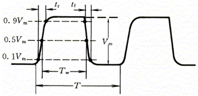

* **参数**
    * 周期 $T$：信号变化一次所需要的时间
    * 频率  $f = \frac{1}{T}\\$：单位时间内信号变化的次数
    * 幅度 $V_m$：脉冲电压的最大变化幅度
    * 宽度 $t_w$ 
      * 从前沿 $0.5V_m$ 到后沿 $0.5V_m$ 的一段时间
      * 对于施密特触发器，由输入电压决定
      * 对于单稳态电路和多谐振荡电路，由电容的充放电时间决定
    * 上升时间 $t_r$：从上升沿 $0.1V_m$ 上升到 $0.9V_m$ 所需时间
    * 下降时间 $t_f$：从下降沿 $0.9V_m$ 下降到 $0.1V_m$ 所需时间
    * 占空比$q = \frac{t_w}{T}\\$：脉冲宽度与周期的比值

### 二、施密特触发电路

* **原理**

    * 利用正反馈产生迟滞效应，使电路具有两个不同的阈值电压。

* **两个输出电压传输特性**

    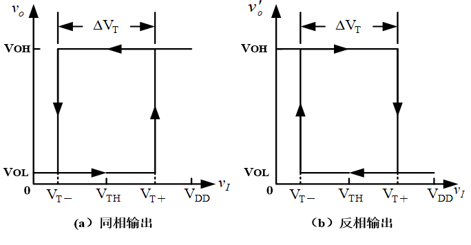

    - $\Delta V_T$ 定义为回差电压 

* **用门电路组成**

    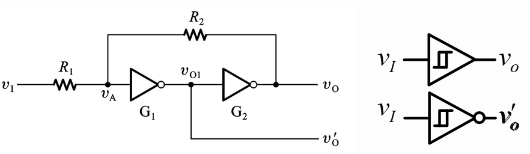

    * CMOS反相器

      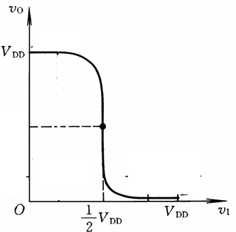

      * 连接
        * 将两级反相器串接起来
        * 使用分压电阻把输出端的电压反馈（正反馈）到输入端
      * 阈值电压 $V_{TH}=\frac{V_{DD}}2\\$
      * 输出电平
        * 高：$V_{OH}=V_{DD}$
        * 低：$V_{OL}=0$

    * $V_A$表达式：$V_A = \frac{R_2}{R_1+R_2}V_i + \frac{R_1}{R_1+R_2}V_o\\$

      * $V_i$为输入电压，$V_o$为输出电压

* **过程**:

    - $V_i = 0$

      - $V_A = 0$，$V_o = 0$ 

      

    - $V_i$ 从 $0$ 上升到 $V_{T+}$

      - 使 $V_A = V_{TH} = \frac 12V_{DD}\\$
      - $V_o$ 由正反馈迅速到达最大值 $V_{OH} = V_{DD}$
      - 可以由 $V_A$  表达式反求 $V_{T+} = (1+\frac{R_1}{R_2})V_{TH}\\$

      

    - $V_i$ 从 $V_{DD}$ 下降到$V_{T-}$

      - 使 $V_A = V_{TH} = \frac 12V_{DD}\\$
      - $V_o$ 由正反馈迅速到达最小值 $V_{OL} = 0$
      - 可以由 $V_A$  表达式反求 $V_{T-}= (1-\frac{R_1}{R_2})V_{TH}\\$

      

    - 同时可求得 $\Delta V_T=V_{T+}-V_{T-}=2\frac{R_1}{R_2}V_{TH}\\$

    - 可通过调节电阻比值来改变（移动）输出电压传输特性

- **应用**

  - **波形变换**

    - 将边沿变化缓慢的周期性信号变换为边沿很陡的矩形脉冲

    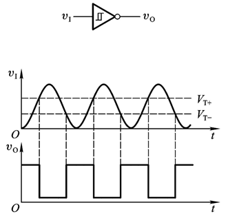

  - **脉冲整形**

    - 干扰信号会使得信号波形变差，可通过施密特触发器整型获得比较理想的波形

      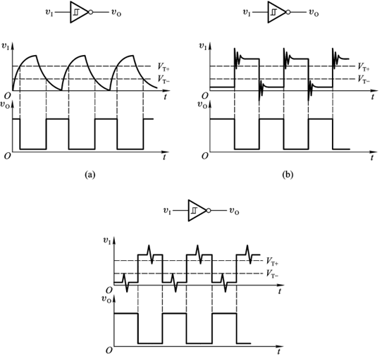

  - **鉴幅**

    - 将一系列幅度不同的脉冲信号，其中幅度大于正向阈值电压的幅度鉴别出来

      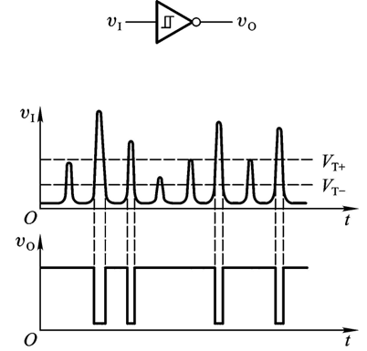

### 三、555 定时器

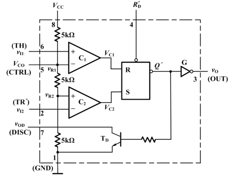

* **电路结构**:
  
    * 两个电压比较器：$C1$ 和 $C2$，用于比较输入电压与内部参考电压
    * 一个 $SR$ 锁存器：根据比较器的输出控制输出状态
    * 一个输出缓冲器 $G$：提高输出驱动能力
    * 一个OC输出三极管 $T_D$（放电管）：控制外部电路的放电
    
* **图形符号和功能表**

    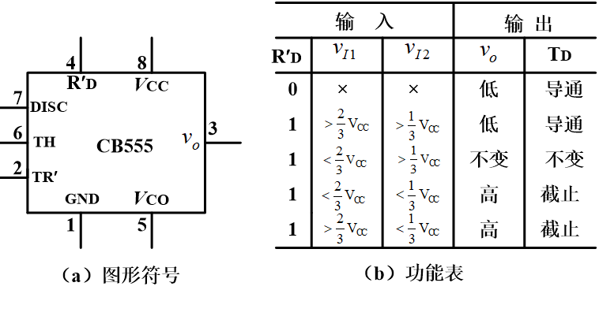

    - 记忆
      - 都大：低、导通
      - 都小：高、截止
      - 中间：保持
      - 两边：高、截止
    - 引脚功能
      - 1－接地端
      - 2－低电平触发端
      - 3－输出端
        - 输出电流可达 $200mA$
        - 直接驱动继电器、发光二极管、扬声器、指示灯等
        - 输出电压约低于电源电压 $1－3V$
      - 4－复位端
        - 若此端输入一负脉冲，而使触发器直接复位
        - 不用时加以高电平
      - 5－电压控制端
        - 此端可外加一电压以改变比较器的参考电压
        - 不用时可悬空或通过 $0.01μF$ 的电容接地
      - 6－高电平触发端
      - 7－放电端
        - 当触发器的 $Q＝0$ 时，$T_D$ 导通，外接电容 $C$ 通过此管放电
      - 8－电源端
        - 可在 $5－18V$ 范围内使用
    - 一般
      - $CTRL$（$V_{CO}$）通过电容接地
      - $R_D'$ 接 $VCC$

### **四、555定时器应用**

* **施密特触发器**

    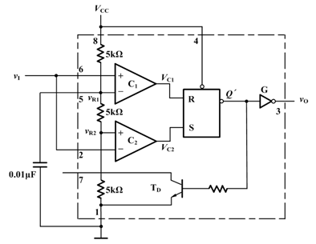

    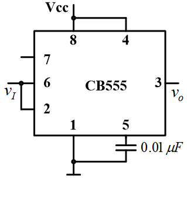

    * 将 $TRIG$（$v_{I2}$） 和 $THRES$（$v_{I1}$） 连接在一起作为输入

    * 上下阈值电压分别为 $\frac{2}{3}V_{CC}\\$ 和 $\frac{1}{3}V_{CC}\\$

    * 若5脚由外电路提供参考电压

        * 则 ：$V_{T+}＝V_{CO}，V_{T-}＝\frac {V_{CO}}2\\$

        

* **单稳态电路**

    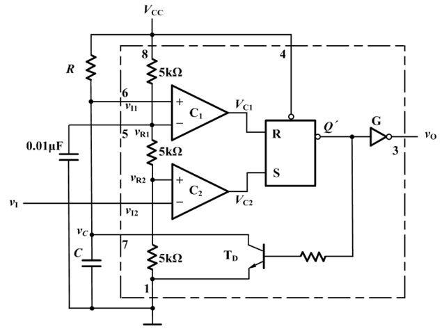

    * **特点**

        * 具有一个稳态和一个暂稳态
        * 在触发信号作用下，能从稳态跃迁到暂稳态，经过一段时间后自动返回稳态
        * 暂稳态维持时间由电路内部参数（电容充放电时间）决定

    * **电路结构**

        *  $THRES$（$v_{I1}$）
            * 通过电阻接 $VCC$
            * 连接 $DISC$（$v_{OD}$）
            * 通过电容接地
        * $TRIG$（$v_{I2}$）作为输入端

    * **原理**

        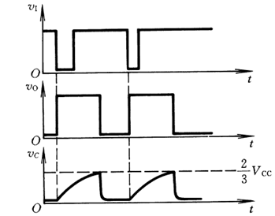

        *  当 $TRIG$（$v_{I2}$）输入一个负脉冲使其电压低于 $\frac{1}{3}V_{CC}\\$ 时
            * 输出变为高电平，同时放电管截止，电容开始充电
            * 当电容电压达到 $\frac{2}{3}V_{CC}\\$ 时，输出变为低电平，放电管导通，电容快速放电。

    * **暂稳态持续时间 $t_w$**

        *  $t_w = 1.1RC$

            * $R$ 为外接电阻，$C$ 为外接电容。

            * 由 $v_c (t)=v_c (∞)+[v_c (0)-v_c (∞)]e^{-t/τ}$
                $$
                𝑡=𝜏 \ln\frac{⁡𝑣_𝑐 (∞)−𝑣_𝑐 (0)}{𝑣_𝑐 (∞)−𝑉_C (𝑡)}=RC\ln\frac{V_{CC}-0}{V_{CC}-\frac 23 V_{CC}}=RC\ln3\simeq1.1RC
                $$

    * **图形符号与功能表**

        

        - 引脚
          - $A_1$ 和 $A_2$ 为下降沿触发端
          - $B$ 为上升沿触发端，此时 $A_1$ 和 $A_2$ 当中至少要有一个接低电平
          - $R_{int}$ 为内置电阻，可以代替外接电阻，但阻值不大，约为 $2kΩ$
          - $C_{ext}$ 和 $R_{ext}$ 为外接电容和外接电阻
            - $R_{ext}$ 取值在 $2kΩ～ 30kΩ$
            - $C_{ext}$ 取值在 $10pF～10μF$ 
            - 得到的脉冲宽度 $t_W$ 的范围为 $20ns～200ms$
              - $t_W=0.69R_{ext} C_{ext}$

        - 典型接法

          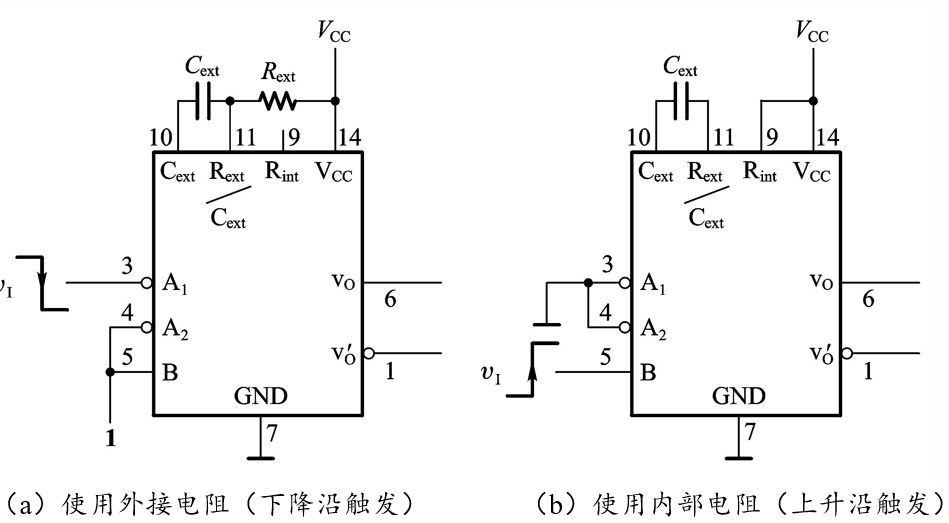

        - 波形图

          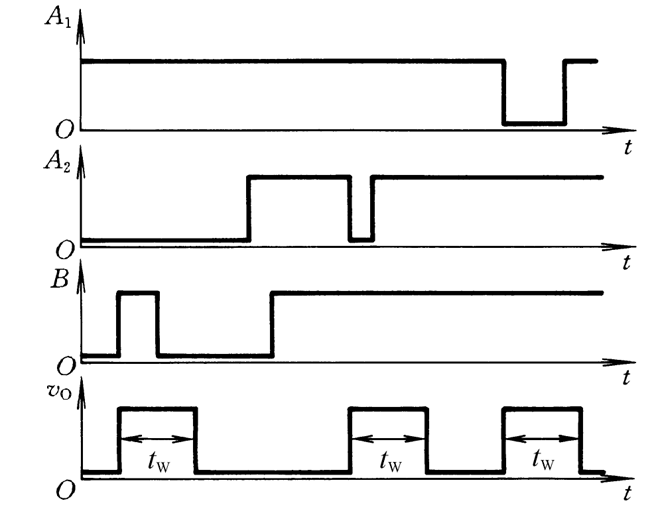

          - 不可重复触发型、重复触发型

            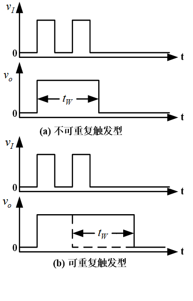

- **多谐振荡电路**

  

  - **特点**

    - 是一种自激振荡器
    - 在接通电源后，不需要外加触发信号，便能自动产生矩形波形

  - **电路结构**

    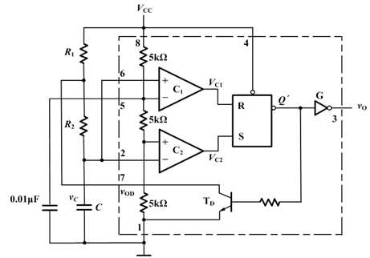

    - 先接成施密特触发电路
    - 再接成多谐振荡电路

  * **工作原理**

    * 接通电源：$v_I=0、v_O=V_{OH}$
    * 电容 $C$ 通过 $R$ 充电至 $V_{T+}$（$\frac{2}{3}V_{CC}\\$） 时，输出变为低电平
    * 放电管导通，电容 $C$ 通过 $R$ 放电至 $V_{T-}$（ $\frac{1}{3}V_{CC}\\$ ）时，输出变为高电平
    * 放电管截止，电容 $C$ 重新开始充电
    * 如此循环，产生振荡

    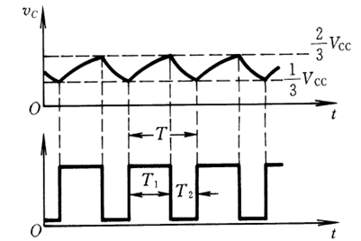

  * **振荡周期**  
    $$
    T＝RC\ln(\frac{V_{DD} －V_{T－}}{V_{DD} －V_{T＋}}⋅\frac{V_{T⁡+}}{V_{T⁡-}} ⁡ )\\
    $$
    
  * **占空比可调电路**
  
    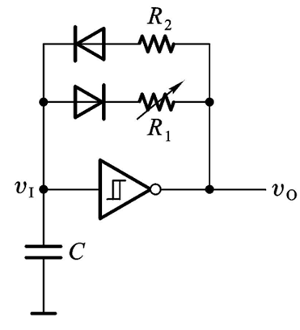
  
    - 电容充电是通过 $R_2$ 进行，电容放电是通过 $R_1$ 进行
  
    - 故只要改变 $R_1$ 和 $R_2$ 的比值即可改变占空比
      $$
      T=T_1+T_2\simeq R_2 C \ln⁡\frac{V_{DD}-V_{T-}}{V_{DD}-V_{T+} }+R_1 C \ln⁡\frac{V_{T+}}{V_{T-}}
      $$
  
      - 555定时器构成的电路中
        $$
        T=(R_1+2R_2)C\ln2\\
        𝑞=\frac{𝑇_1}𝑇=\frac{𝑅_1+𝑅_2}{𝑅_1+2𝑅_2}>50\%
        $$
  
      - 若如上图增加二极管，则
        $$
        T=(R_1+R_2)C\ln2\\
        𝑞=\frac{𝑇_1}𝑇=\frac{𝑅_1}{𝑅_1+𝑅_2}<50\%
        $$
