# 模电（十）：直流电源

直流电源将交流电转换为稳定的直流电，主要由整流、滤波和稳压电路组成

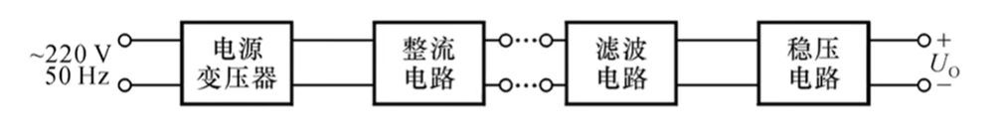

## 一、整流电路：

- 利用二极管的单向导电性，将交流电转换为单一方向的脉动电压

* **类型**（以下均输入峰值为 $\sqrt2U_2$ 的正弦波）

    * **单相半波整流电路**
    
        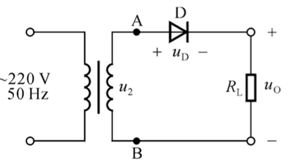
    
        * **输出电压有效值：** $\bar U_o = 0.45U_2\\$  
        * **输出电流有效值：** $\bar I_{o} = \frac{\bar U_o}{R_L}=\frac{0.45U_2}{R_L}\\$ 
        * **二极管电流应力：** $I_{D} = 1.1I_o\\$
        * **二极管反向电压（电压应力）：** $U_{D} = 1.1\sqrt2 U_2$
    
        
    
    * **单相全波整流电路**
      
        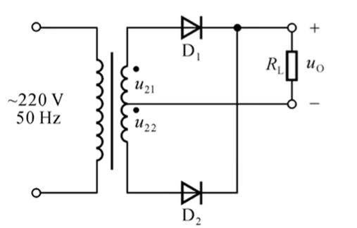
        
        * **输出电压有效值：** $\bar U_o = 0.9U_2\\$  
          * 为单相半波的2倍
        * **输出电流有效值：** $\bar I_{o} = \frac{\bar U_o}{R_L}=\frac{0.9U_2}{R_L}\\$ 
          * 为单相半波的2倍
        * **二极管电流应力：** $I_{D} = 1.1\frac{I_o}2\\$
          * 只有半个周期导通，但是平均电流又翻倍，所以电流应力和单相半波整流相同
        * **二极管反向电压（电压应力）：** $U_{D} = 1.1\times 2\times \sqrt2 U_2$
          * 每个二极管承受的最大反向电压是变压器副边的峰峰值
        
        
        
    * **单相桥式整流电路**
      
        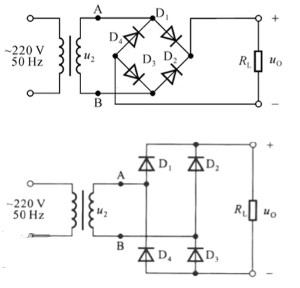
        
        * **输出电压有效值：** $\bar U_o = 0.9U_2\\$  
          * 为单相半波的2倍
        * **输出电流有效值：** $\bar I_{o} = \frac{\bar U_o}{R_L}=\frac{0.9U_2}{R_L}\\$ 
          * 为单相半波的2倍
        * **二极管电流应力：** $I_{D} = 1.1\frac{I_o}2\\$
          * 只有半个周期导通，但是平均电流又翻倍，所以电流应力和单相半波整流相同
        * **二极管反向电压（电压应力）：** $U_{D} = 1.1 \sqrt2 U_2$
          * 与单相半波相同

## 二、滤波电路

- 滤去交流分量，减小电压脉动，使输出平滑

- **电容滤波电路：** 利用电容的充放电作用，平滑电压

  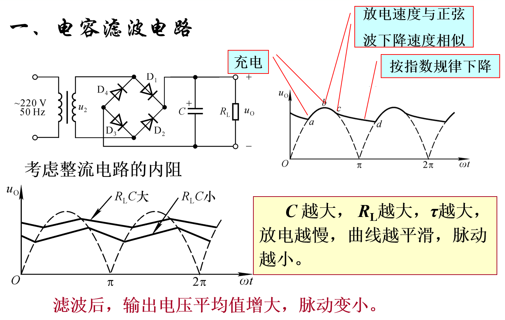

  * 

* **电感滤波电路：** 利用电感的特性，阻止电流突变，使电流更加平滑。常用于大电流场合。

    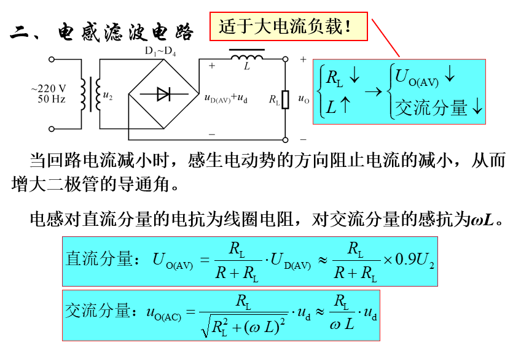

* **倍压整流电路**

    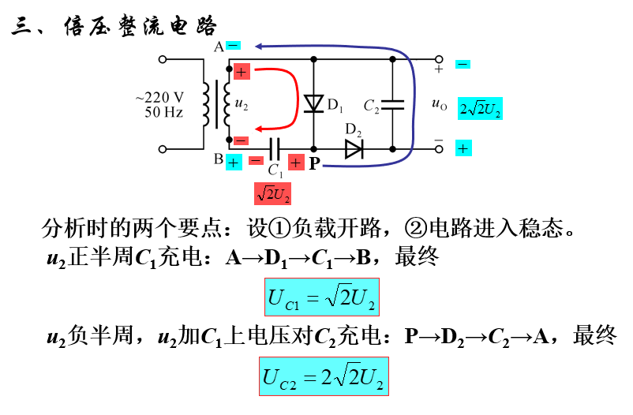

    - 例题

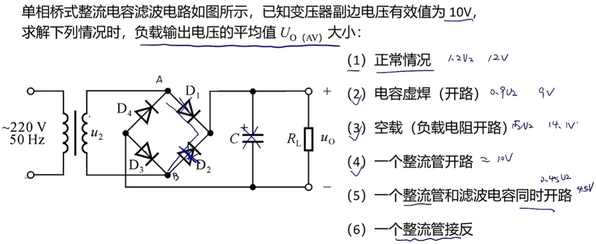

## 三、稳压电路

- 用于稳定输出电压，使其不受电网电压波动和负载变化的影响

* **稳压管稳压电路：** 利用稳压管的反向击穿特性，稳定输出电压
  
    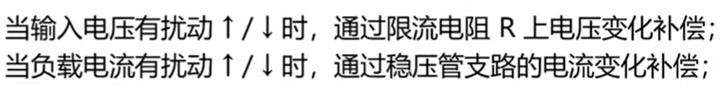

    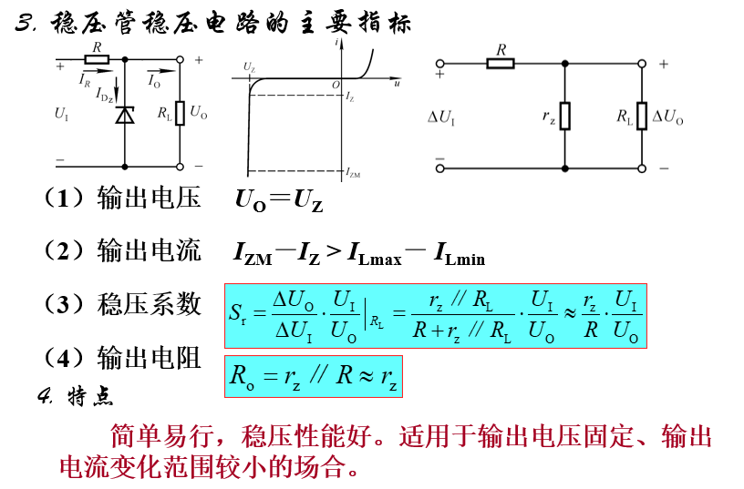
    
    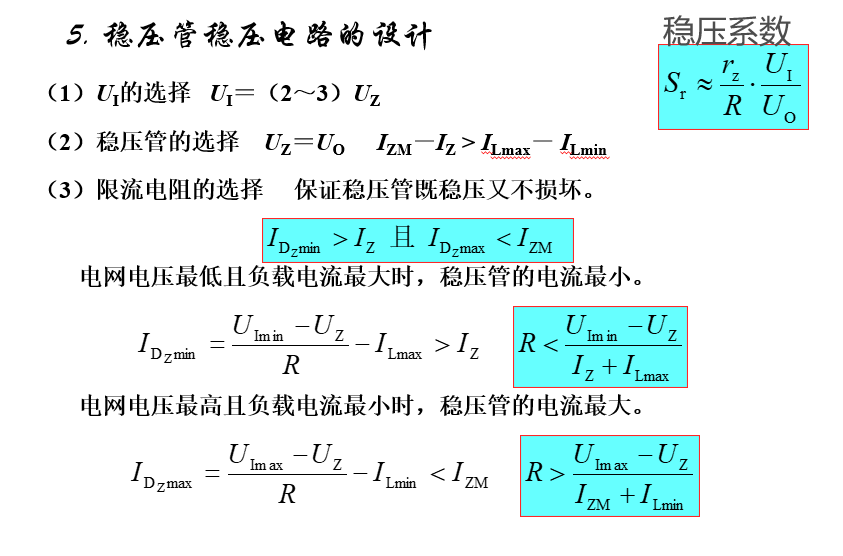
    
    
    
* **串联型稳压电路**

    * **基本调整管稳压电路：**  简单的串联型稳压电路，稳压性能较差

      * 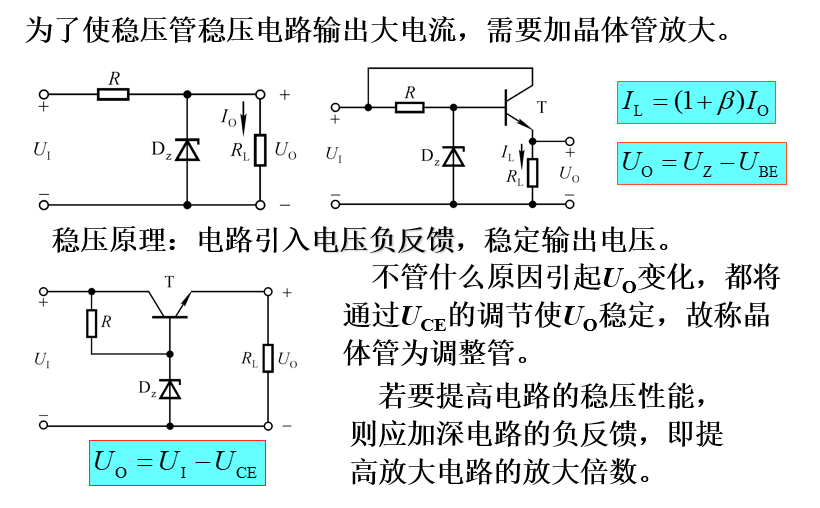

    * **具有放大环节的串联型稳压电路：**  引入放大环节，提高稳压性能

      * 
      * 

      

    * **集成稳压器（三端稳压器）：** 将稳压电路集成在一个芯片中，使用方便，性能稳定

      * $W7800$ 系列

        * 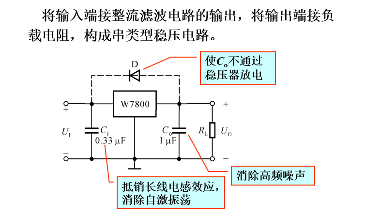
        * 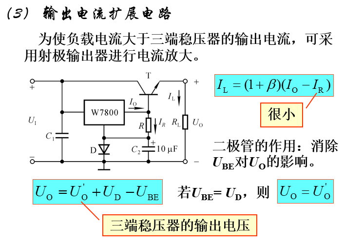

        

      * $W117$ 系列

        * 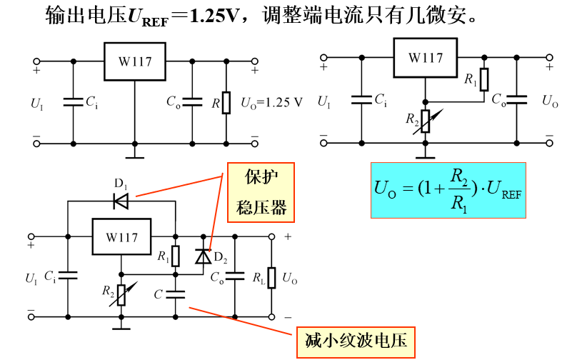
