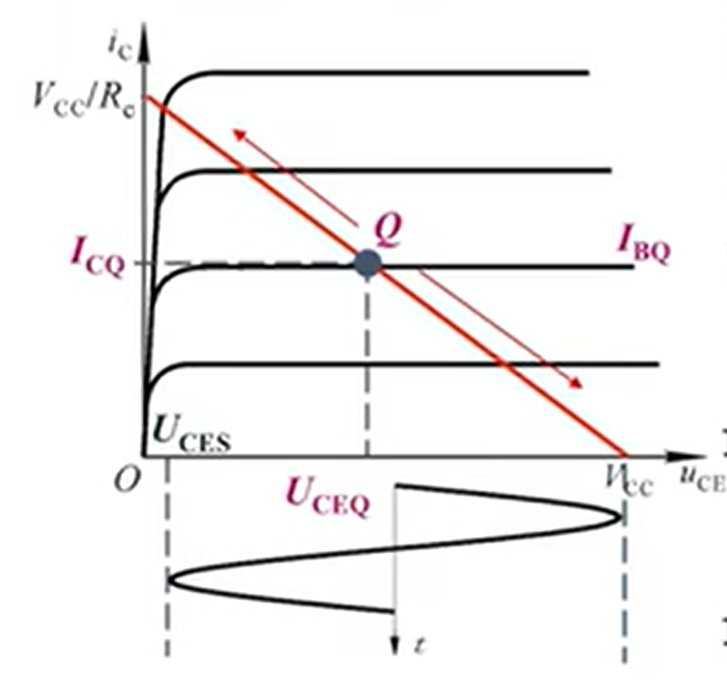
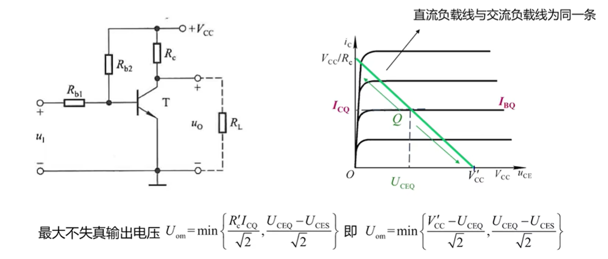
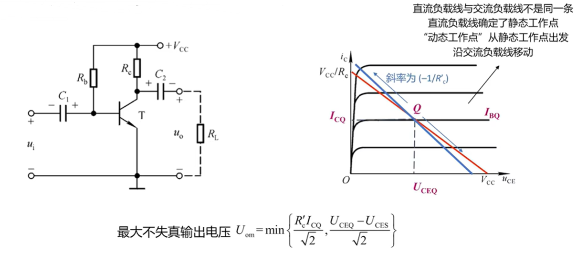
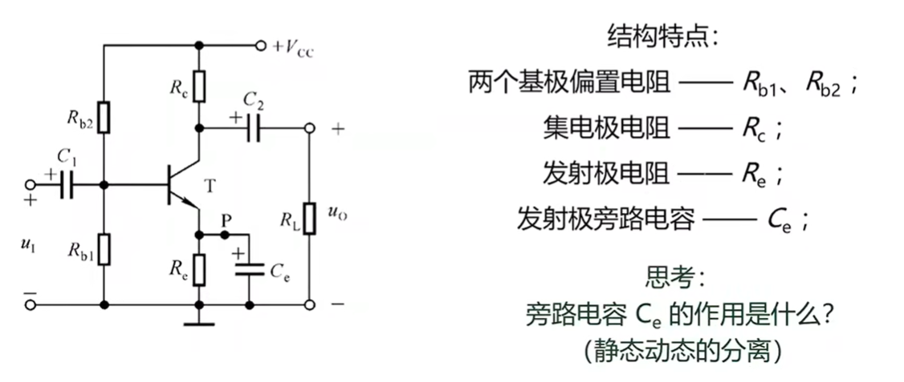
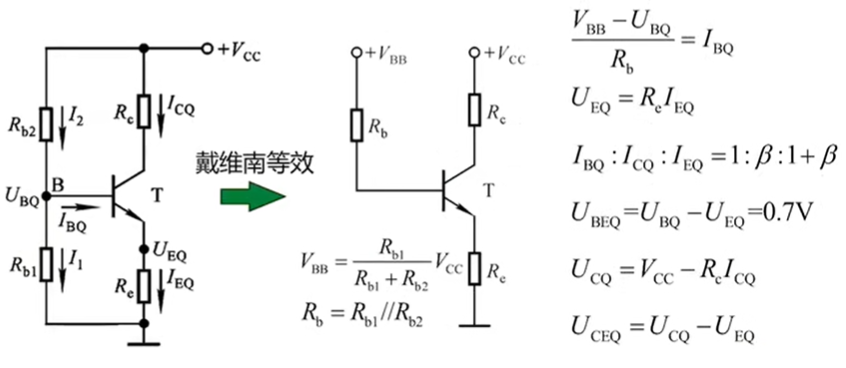
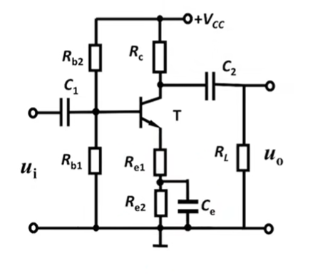
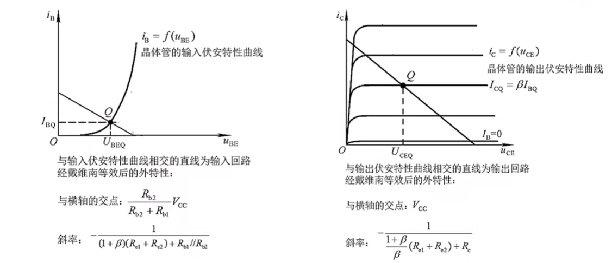

# 模电（六）：基本放大电路

## 1、一些概念

### ① 三极管

- 输入特性：

  - 在**管压降 $U_{CE}$ 一定**的情况下，基极电流 $i_B$ 与发射结压降  $U_{BE}$ 之间的函数关系
    $$
    i_B=f(u_{BE})\mid_{U_{CE}=常数}
    $$

  

  - $U_{CE}=0$ 时，发射结与集电结并联，**与PN结特性相似**

  - 对于小功率管，可以用 $U_{CE}>1V$  的任意一条曲线来近似所有 $U_{CE}>1V$  的所有曲线 

    

- 输出特性

  - 基极电流 $I_B$ 为常量时，集电极电流  $i_C$ 与管压降 $u_{CE}$ 之间的函数关系
    $$
    i_C=f(u_{CE})\mid_{I_B=常数}
    $$
    

    

### ② 图解法分析

- 斜率：$R_C$ 倒数
- 横轴截距： $V_{CC}$
- 横轴 $u_{CE}$、纵轴 $i_C$

### ③ 失真分析

- 截止失真：
  - 晶体管工作在截止区，信号产生顶部失真
    - 因为$NPN$ 正常情况下输出和输入反相，如果是 $PNP$ 则是底部失真
  - 解决方法：增大Q点（只能从输入回路改善）
    - 增大积极静态电压（$V_{BB}$）
    - 减小电阻 $R_b$
- 饱和失真：
  - 晶体管工作在饱和区，信号产生底部失真
    - $NPN$ 情况，若是 $PNP$ 情况则是顶部失真
  - 解决方法：降低Q点（输入输出回路都能改善）
    - 增大基极电阻，以减小基极电流
    - 更换 $\beta$ 更小的管子，以减小集电极电流
    - 减小集电极电阻，以增大管压降 

- 同时发生截止失真和饱和失真

  - 电源设置不合理，应调节 $V_{CC}$ 大一些

- 无法消除的失真

  - 非线性失真：器件固有特性导致

- 最大不失真输出电压

  - 当输入电压再增大就会使输出电压产生非线性失真的极限输出电压的有效值
    $$
    U_{om}=\min{(\frac{V_{CC}-U_{CEQ}}{\sqrt 2}，\frac{U_{CEQ}-U_{CES}}{\sqrt 2})}
    $$

    - 最合适的静态工作点：$U_{CEQ}=\frac{V_{CC}+U_{CES}}2\\$

## 2、非线性电路的分析方法：小信号分析法

- 思想
  - 直流叠加交流
  - 静态叠加动态
- 步骤
  - 需要先判断是否在放大区
  - 再求解静态工作点
  - 最后求解动态参数

### ① 共射放大电路放大正弦波信号的条件

- 直流通路：

  - **把电容开路**

  - 用于判断是否有合适的静态工作点

  - **基极要有限流电阻**

  - **输入要有电容隔直通交**

  - $NPN$ 管：判断是否有 $V_c>V_b>V_e$

    - **即发射结正偏**，**集电结反偏**

  - $PNP$ 管：判断是否有 $V_c<V_b<V_e$

    - **即发射结反偏**，**集电结正偏**

  - 举例：
  
    
  
    > 直流通路中：基极被短路到地，不满足电位条件，应该在输入端串联电容，其次 $V_{BB}$ 也应该反接
  
    
  
    > 集电结没有反偏，应改为 $+V_{CC}$ 且 $V_{CC}>V_{BB}$
    
    
    
    > 集电结没有反偏，应在 $V_{CC}$ 和基极之间添加一个比 $R_C$ 大的电阻
  

- 交流通路：

  - 电容短路，$V_{CC}$ 短路到地

  - 判断输入信号是否加到了基极，并影响了 $U_{be}$ 的电压

  - 判断输出回路是否能把电流的变化转化为电压的变化

  - 举例：

    
  
    > 交流通路中：信号被短路，无法加到基极；输出端也固定为 $+V_{CC}$，无法产生变化
    >
    > 故应该在 $V_{BB}、V_{CC}$ 处各串联一个电阻
    
    
  

### ② 几种典型的基本放大电路

#### 1、直接耦合共射放大电路

#### 2、阻容耦合共射放大电路

#### 3、静态工作点稳定的共射放大电路

- $R_e$ 引入直流负反馈，抑制温漂扰动

  - $R_e$ 越大，抗扰效果越好

- 分压偏置式阻容耦合共射放大电路

  

  - 静态分析戴维南等效：

    

    - 或者直接忽略基极电流（要说明），直接 $R_{b1}$ 和 $R_{b2}$ 分压来求 $U_{BQ}$ 

  - 若没有旁路电容 $C_0$，则动态电路中 $R_e$ 仍存在，在动态电路中产生负反馈

    - 交流电压放大倍数不受晶体管参数影响，但放大倍数大打折扣

    - 实际需求中，将 $R_e$ 分为两部分，根据需求设置大小

      

      

### ③ 基本放大电路的计算

#### 1、静态工作点 Q点

- 计算：$I_{BQ}、I_{CQ}、I_{EQ}、U_{CEQ}$
- 备注：
  - $U_{BE}=0.7V$
- 步骤：
  - 画出直流通路：
    - 电容开路
  - 根据 $KVL$ 和 $I_C=\beta I_B、I_E=(1+\beta)I_B$ ，即可计算 $Q$ 点

#### 2、动态参数

- 计算：$\dot A_u、R_i、R_o$
- 备注：
  - $r_{be}=r_{bb'}+\frac{U_T}{I_B}\\$
  - $U_T=26mV$
- 步骤：
  - 画出交流通路
    - 电容短路
    - $V_{CC}$ 短路到地
    - 将晶体管转换为微变等效模型
      - 删去晶体管
      - 基极与发射极连接一个 $r_{be}$，其上流过的电流为 $\dot I_b$
      - 集电极与发射极连接一个 $\beta \dot I_b$ 的受控电流源
  - 计算 $\dot A_u$ ：
    - $\dot A_u=\frac{\dot U_o}{\dot U_i}\\$
    - 注意参考方向导致的正负号
    - $\dot U_o$ 是负载 $R_L$ 上的电压
    - $\dot A_{us} = \frac{\dot U_o}{\dot U_s}=\frac{\dot U_o}{\dot U_i}\frac{\dot U_i}{\dot U_s}=\dot A_u\frac{\dot U_i}{\dot U_s}\\$
  - 计算 $R_i、R_o$
    - 共射：两边无关
    - 共集：两边相关

