# 模电（七）：差分放大电路

## 一、 信号

* **差模信号 different** （有用信号，需放大）
  *  两个输入端电压的差值
  *  $\Delta u_{id} = u_{i1} - u_{i2}$

* **共模信号 common** （扰动信号，需抑制）
  * 两个输入端电压的平均值
  *  $\Delta u_{ic} = \frac{u_{i1} + u_{i2}}{2}\\$

## 二、 差分放大电路

- **雏形**

  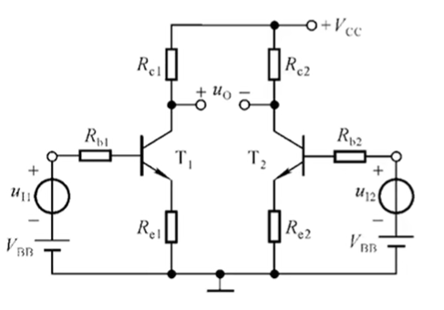

  - 两个电路都有发射极电阻，放大倍数被衰减
  - 过于依赖对称性，只通过对称性作差减去共模输出

  

* **长尾式差分放大电路** 

    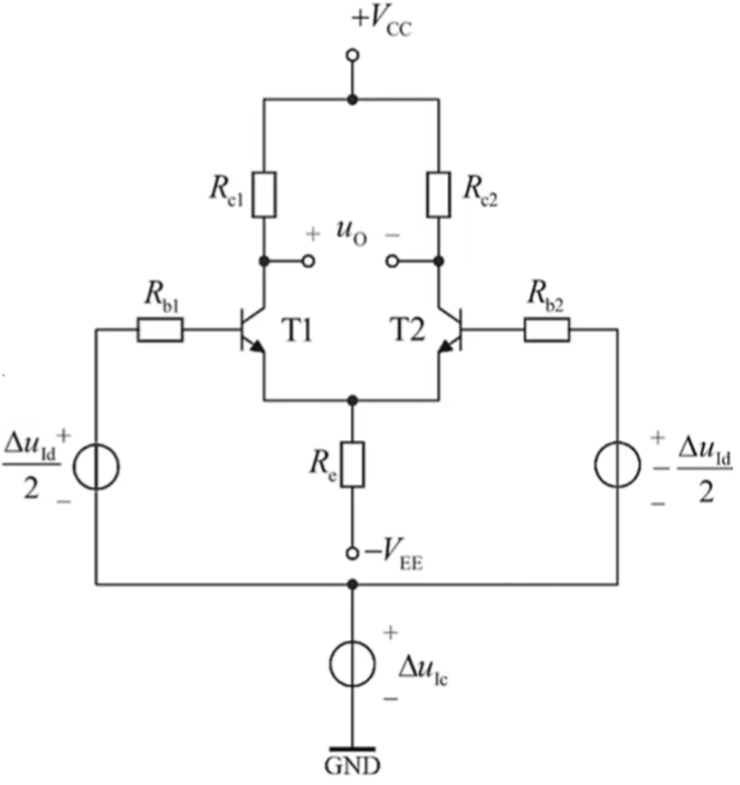

    * T1 通常反相放大输入信号，T2 同相放大输入信号
    * 对共模信号抑制放大，同时使用对称性减去共模输出
    * 对差模正常放大

    

# 三、 分析

> 由于参数理想对称，所以只分析一边，但是要注意发射极电阻有两倍电流
>
> 某些情况下并不需要严格将三个状态全部分析，例如参数完全对称情况下的双端输出、恒流源代替长尾电阻时，无需考虑共模信号回路

* **静态工作点**  

    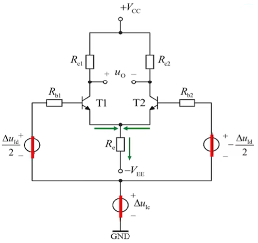

    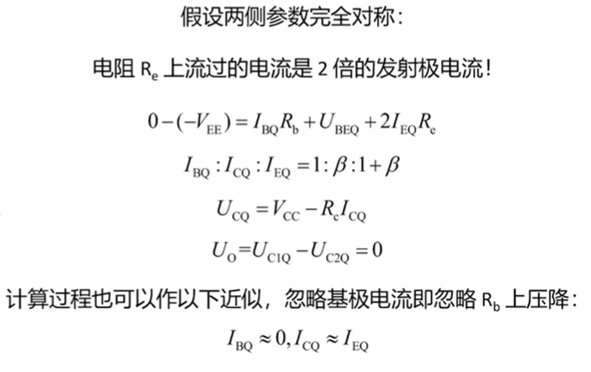

     

* **动态分析** 

    * **参数**

      * **差模电压放大倍数**  $A_d = \frac{V_{o}}{\Delta u_{id}}\\$
        * 表示差模信号的放大能力
      * **共模电压放大倍数**  $A_c = \frac{V_{o}}{\Delta u_{ic}}\\$
        * 表示共模信号的放大能力
      * **差模输入电阻 $R_{id}$ **  
        * 差模信号回路看到的等效输入电阻
      * **输出电阻  $R_o$**  
        * 从输出端看进去的等效电阻
      * **共模抑制比** $K_{CMR} = \frac{|A_d|}{|A_c|}\\$ 
        * 表示电路抑制共模信号的能力，CMRR 越高，电路性能越好

    * **共模信号回路** 

      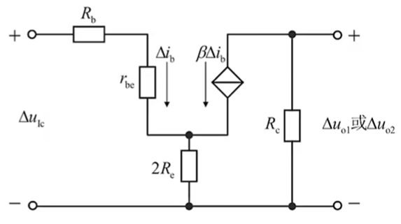

      * 将差模信号短路
      * 并将电路转换为交流等效电路进行分析
      * 用于计算共模电压放大倍数 $A_c$

    * **差模信号回路** 

      * 原电路中：

        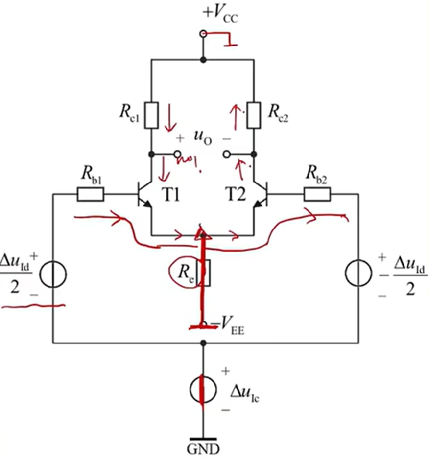

        * 真正的电流不是这个流向，只是说左边增加的电流量，跟右边减少的电流量相同

      * 等效电路：

        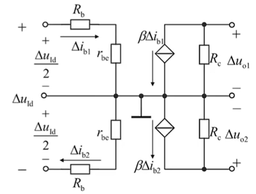

      * 将共模信号短路

      * 并将电路转换为交流等效电路进行分析

      * 用于计算差模电压放大倍数 $A_d$

## 四、 输出电压

* **静态输出电位**  
  * 电路在没有输入信号时的直流输出电压

* **共模输出电压**  $V_{oc} = A_c \times \Delta u_{ic}$
  * 共模放大倍数 x 共模输入电压
* **差模输出电压**  $V_{od} = A_d \times \Delta u_{id}$
  * 差模放大倍数 x 差模输入电压

## 五、 输入方式（影响输入电压）

* **输入电阻**  

    * 两种输入方式下，输入电阻均为 $2(R_b + r_{be})$

    

* **单端输入：**  一个输入端接地，另一个输入端接输入信号

    * 不对称双端输入：$u_{i1}=0$， $u_{i2}=u$
      * 差模信号：$\Delta u_{id} = u$
      * 共模信号：$\Delta u_{ic} = u/2$

    

* **双端输入：**  两个输入端分别接大小相等、极性相反的输入信号

    * 对称双端输入：$u_{i1}=-u$， $u_{i2}=u$
      * 差模信号：$\Delta u_{id} = 2u$
      * 共模信号：$\Delta u_{ic} = 0$

    

## 六、 输出方式（影响电压放大倍数、输出电阻）

* **单端输出：**  从一个集电极输出信号

    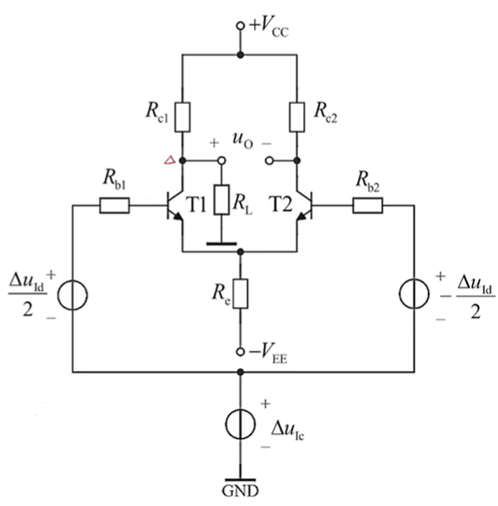

    - 共模等效电路

      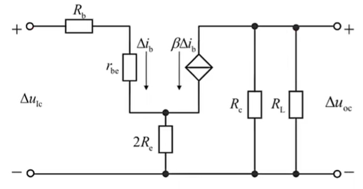

      - 无需画出T2的等效电路

    - 差模等效电路

      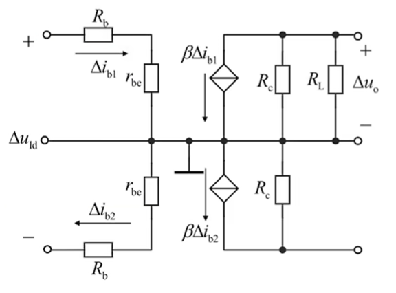

    * 共模放大倍数不为0，需要单独分析
    * 差模放大倍数等于单管共射放大电路放大倍数的一半
        * 负载电阻为 $R_L$

    * 输出电阻 $R_C$

    

* **双端输出：**  从两个集电极取出信号，输出电压为两集电极电压之差

    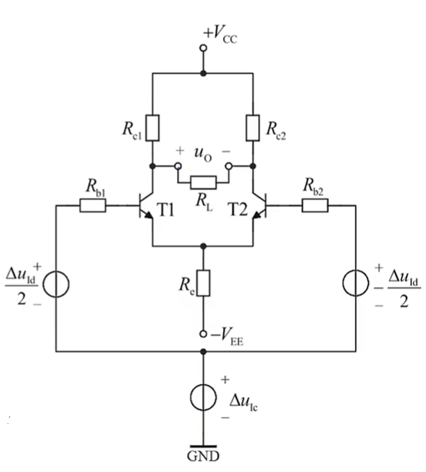

    - 等效电路

    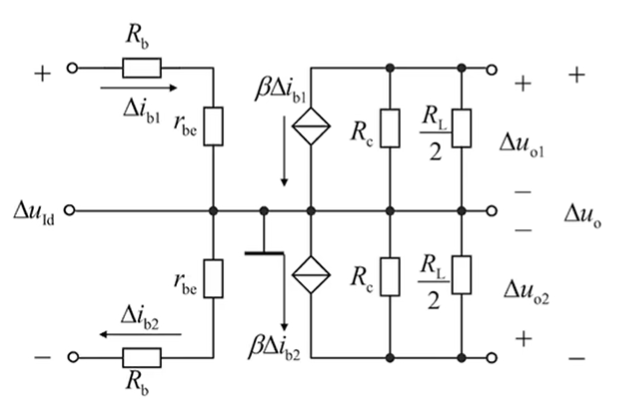

    * 共模放大倍数为 0
    * 差模放大倍数 = 单管共射放大电路放大倍数
      * 区别在于：负载电阻为 $R_L/2$

    * 输出电阻 $2R_C$

    

## 七、 优化电路

* **使用恒流源** 

    * 用恒流源代替长尾电阻 $R_e$，可以显著提高共模抑制比，但不影响差模信号回路

    * 无论单端输出还是双端输出，共模放大倍数都为 0

    * 恒流源静态条件下相当于普通电阻，用于设置静态工作点

    * 恒流源的动态电阻很大，理想情况下视为无穷大（如果题目给出则用题目给的）

    * 电路

      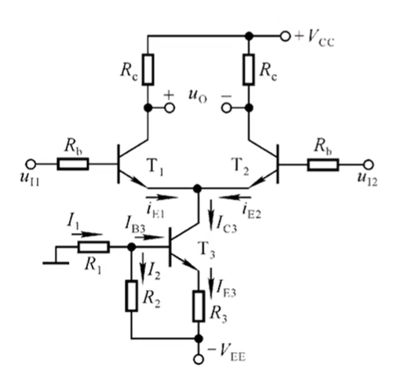

    

    

* **使用电位器微调**  

    * 在发射极电阻上串联一个电位器，可以微调电路的对称性，进一步提高共模抑制比
    
    * 会牺牲一部分增益
    
    * 电路
    
      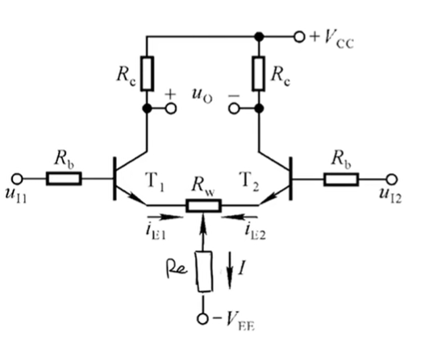

