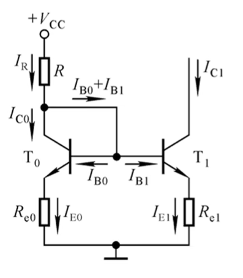
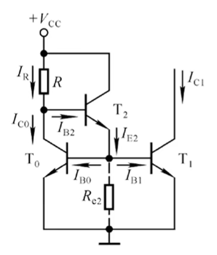
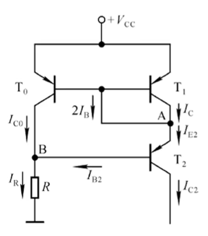
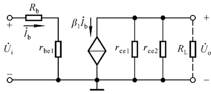
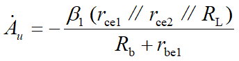
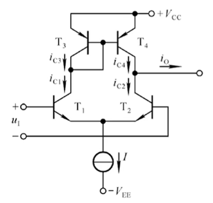

# 模电（八）：电流源电路

## 一、 单管电流源电路

* **静态** 

  * 等效为一个小的电阻，为其他电路提供偏置电流，建立合适的静态工作点

* **动态** 

  * 等效为一个无穷大的动态电阻，理想情况下，输出电流不随电压变化

  

## 二、 镜像电流源电路 

* **特性**
    
    * 两个特性相同的晶体管，一个作为输入（基准端），一个作为输出
    * 输出电流跟随基准电流变化（镜像）
      * 当晶体管的电流放大倍数 $\beta$ 远大于 2 时，输出电流近似等于基准电流（忽略基极电流）
        *  $I_{C1} \approx I_{R} = \frac{V_{CC}-U_{BE}}R\\$
    
    
    
* **结构特点**
    
    * 两个晶体管共基极、背靠背连接，且均没有发射极电阻
    * 输入端（基准端）的集电极和基极短接，使基极和集电极电位相等
      * 短路线上的电流为 $2I_B$

## 三、 比例电流源电路

* 输出电流与基准电流成比例关系

  * $I_{out} \times R_{E,out} = I_{ref} \times R_{E,ref}$

* 相比镜像电流源，两个晶体管的发射极都连接了电阻 $R_E$。

  

## 四、 微电流源电路

* 输出电流非常小
  * 相当于比例电流源电路中，基准端晶体管的发射极电阻趋近于零（短路）

## 五、 精密电流源电路 

* 基准端集电极和基极不直接相连，而是通过另一个晶体管连接
* 仍然是跟随关系，但精度更高

## 六、 威尔逊电流源电路

* 一种精密电流源电路
* 采用自上而下的方法分析电路

## 七、 多路电流源电路

* 多个基本电流源
* 分析方法：逐个分析每个输出支路即可

## 八、 电流源电路作为有源负载

* **用于单管放大电路**  

    

    * 将集电极电阻 $R_C$ 替换为电流源

    * 提高电压放大倍数

        * 电流源不影响静态工作点的设置，但动态电阻很大，理想情况下视为无穷大

    * 等效电路

        

        

* **用于改进型差分放大电路**  

    

    * 将长尾电阻替换为电流源，并将集电极电阻替换为电流源（有源负载）
    * 单端输出时，动态电流几乎全部流向负载，没有集电极电阻的分流，放大倍数不再是单管的一半

