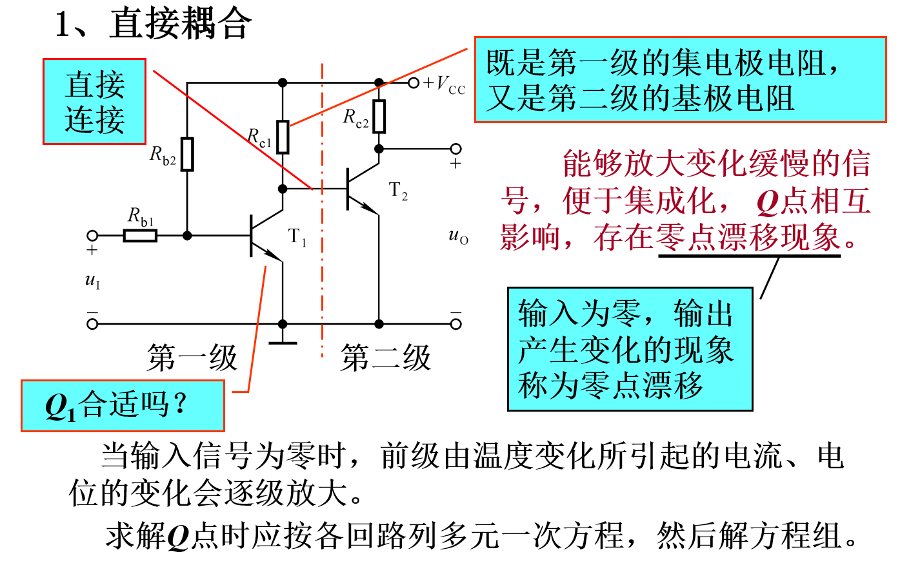
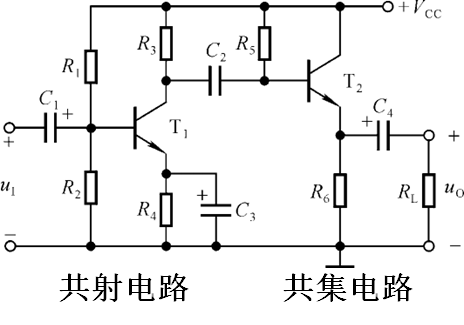
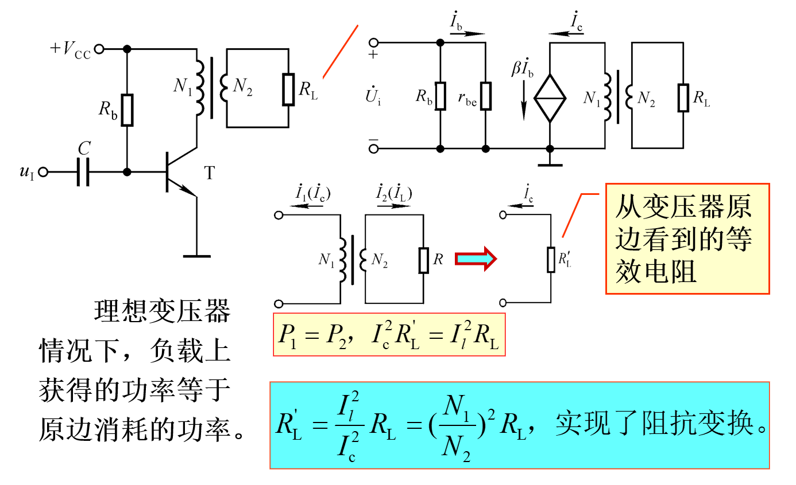
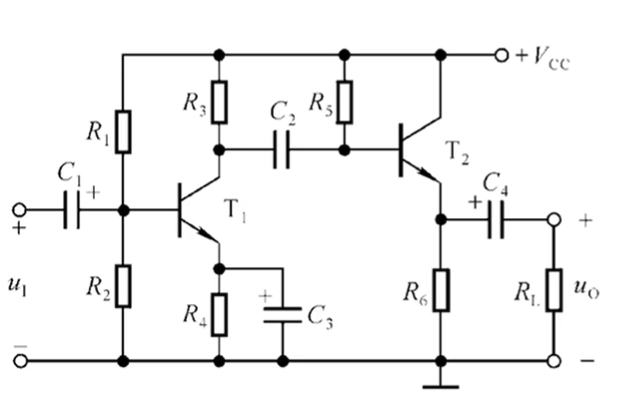
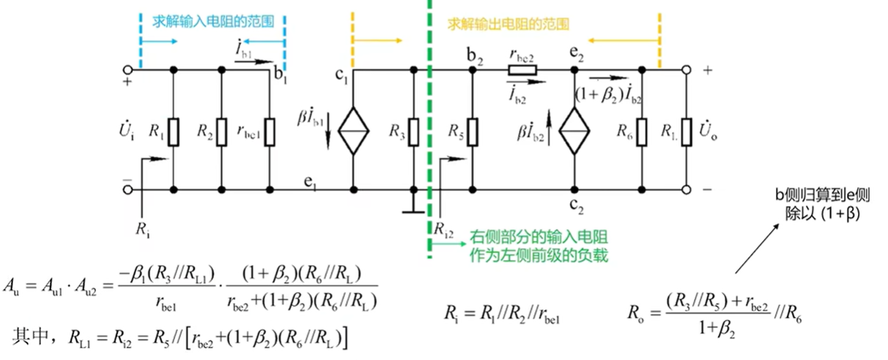
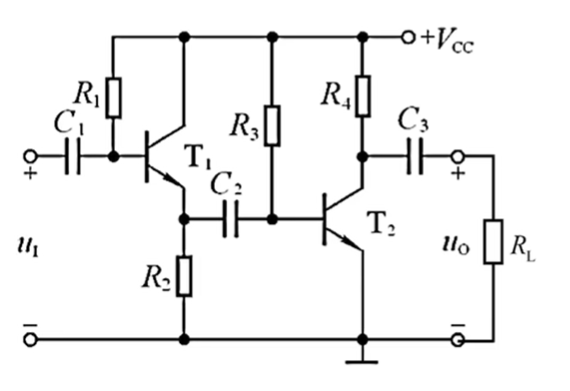
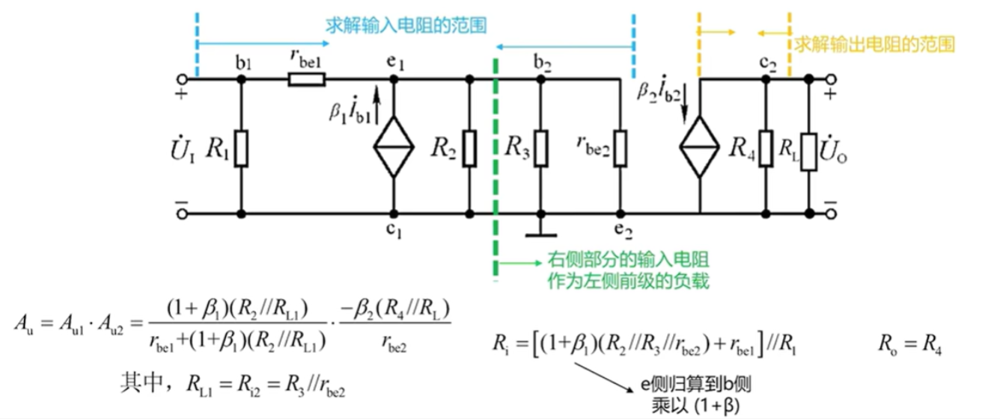

# 模电（九）：多级放大电路

## 一、各电路分析

* **共射放大电路**
    * **优点：** 具有**一定的电压放大能力**
    
    * **缺点：** **不适合直接作为输出级**，带负载能力差，输出电阻大
    
      

* **共集放大电路（射极跟随器）**
    * **优点：** 具有**较好的带负载能力**（输出电阻小），可作为缓冲级或输出级
    
    * **缺点：** **没有电压放大能力**，电压放大倍数略小于1
    
      

* **共基放大电路**
    * **优点：** 具有**宽频带，高频特性好**。
    * **缺点：** **输入电阻较小**，不适合直接作为输入级。
    
    

## 二、耦合方式

* **直接耦合：** 各级直接相连（集成运放中的常用耦合方式）
    
    

    * **优点：** **低频特性好**，能传递缓慢信号（甚至直流信号）
    * **缺点：** 存在**零点漂移问题**，各级静态工作点相互影响（共模信号）
      * **引入直流负反馈** 
        * 如发射极电阻与其旁路电容，可以稳定静态工作点
      * **利用差分放大电路抑制共模** 
        * 差分放大电路可以有效抑制共模信号，减小零点漂移
      * **利用温度补偿元件进行补偿调节**
        *  使用二极管、热敏电阻等温度补偿元件，可以抵消温度变化带来的影响
    
    
    
* **阻容耦合：** 通过耦合电容相连
    
    

    * **优点：** 各级静态工作点相互独立，可以单独计算
    * **缺点：** **无法放大低频信号**，有增益衰减
    
    
    
* **变压器耦合：** 通过变压器连接
    
    

    * **优点：** 可以实现阻抗匹配，提高效率
    * **缺点：** 只适用于交流信号，体积大、难集成
    
    
    
* **光电耦合：** 以光信号为媒介实现信号与能量的传递（光电转换）
    
    * **优点：** 能实现**电气隔离**，抗干扰性能好
    * **缺点：**  成本较高，响应速度相对较慢

## 三、多级放大电路的动态分析

* **步骤：**
    1. 判断级数、各级类型
    2. 画出整个放大电路的交流等效电路（注意接地点），注意标注各晶体管的b、c、e极（防止$r_{be}$和集电极电流源画错），并画出各级分割线
    3. 列写电压放大倍数、输入电阻、输出电阻表达式

    
    
* **要点：**
    * **共射+共射：** 
    
      * 输入电阻只与第一级有关，输出电阻只与最后一级有关，电压放大倍数为各级放大倍数的乘积 
      * $A_U = A_{u1} \cdot A_{u2} ... A_{un}$
    
      
    
      
    
      
    
    * **共射+共集** 
    
      * 由于共集电路的输出电阻与输入侧有关，故不能单独计算。需要考虑前级的影响
    
        
    
        
    
      
    
    * **共集+共射** 
    
      * 由于共集电路的输入电阻与输出侧有关，故不能单独计算。需要考虑后级的影响
    
      
    
      
    
    
    
    * **共集+共集**
    
      * 输入与输出都与邻级有关
    
      
    
      

