# 电路（十）：二端口网络

## 1、二端口网络

- 一端口网络

  - 二端（一对端子）网络

    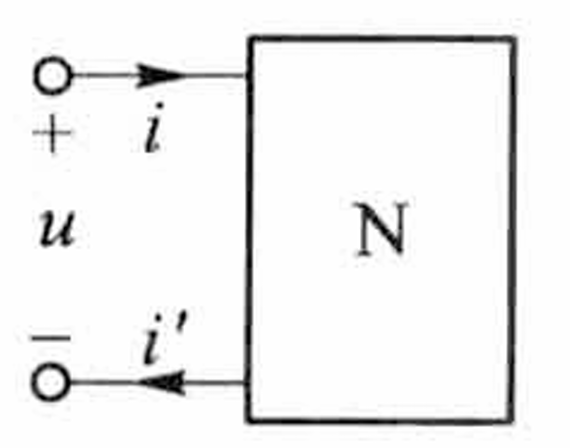
    $$
    i=i'
    $$

- 二端口网络

  - 四端（两对端子）网络

    
    $$
    i_1=i_1'\\
    i_2=i_2'
    $$

  - 简称 `二端口`

  - 若不满足上述关系，则此四端网络就不能称为二端口网络

  - 举例

    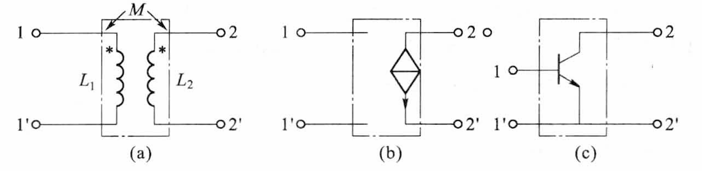

    - 对于三端网络
      $$
      i_3=i_1+i_2\\
      u_{12}=u_{13}-u_{23}
      $$
      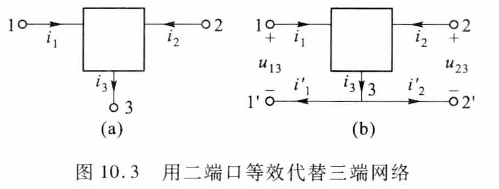

  - 一个 $n$ 端网络可用 $n-1$ 端口等效代替

  - 一个 $n-1$ 端口一般不能用 $n$ 端网络等效代替

  - 本章只讨论线性无独立源的二端口

    - 含有线性电阻、电容、自感、互感、线性受控电源
    - 不含独立源
    - 所有电感、电容都处于零状态

## 2、导纳参数方程和阻抗参数方程

- 规定参考方向：电压与电流相同

  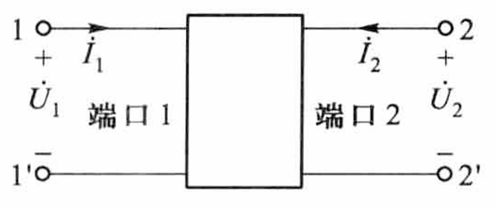

### ①单端口网络方程

- 输入阻抗方程
  $$
  \dot U = Z\dot I
  $$

- 输入导纳方程
  $$
  \dot I=Y\dot U
  $$

### ②二端口网络方程

#### （1）短路导纳参数方程（ $Y$ 参数方程）

$$
\begin{cases}
\dot I_1=Y_{11}\dot U_1+Y_{12}\dot U_2\\
\dot I_2=Y_{21}\dot U_1+Y_{22}\dot U_2\\
\end{cases}
$$

-  矩阵形式
  $$
  \left[
  \begin{matrix}
  \dot I_1\\
  \dot I_2
  \end{matrix}
  \right]=
  \left[
  \begin{matrix}
  Y_{11} & Y_{12}\\
  Y_{21} & Y_{22}\\
  \end{matrix}
  \right]
  \left[
  \begin{matrix}
  \dot U_1\\
  \dot U_2
  \end{matrix}
  \right]
  $$

  - 简写成
    $$
    \dot I=Y\dot U
    $$
    其中 $Y$ 参数矩阵：
    $$
    Y=\left[
    \begin{matrix}
    Y_{11} & Y_{12}\\
    Y_{21} & Y_{22}\\
    \end{matrix}
    \right]
    $$

- 使用测试法测定 $Y$ 参数

  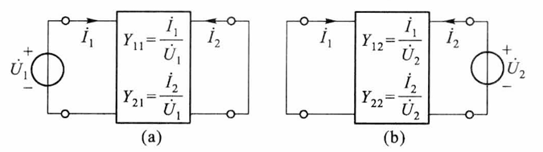
  $$
  Y_{11}=\frac{\dot I_1}{\dot U_1}|_{\dot U_2 = 0} \ \ \ \ \ &
  Y_{21}=\frac{\dot I_2}{\dot U_1}|_{\dot U_2 = 0} \\
  Y_{12}=\frac{\dot I_1}{\dot U_2}|_{\dot U_1 = 0} \ \ \ \ \ &
  Y_{22}=\frac{\dot I_2}{\dot U_2}|_{\dot U_1 = 0} \\
  $$

  - $Y_{11}$ ：短路输入导纳
  - $Y_{22}$：短路输出导纳
  - $Y_{12}、Y_{21}$：短路转移导纳
  - 也可列写节点电压方程来求 $Y$ 参数

- 如果一个二端口是互易的

  - 即满足互易定理：将一个端口的电压源 $\dot U_S$ 与另一端口的电流互易位置后， 电流满足 $\dot I_2=\dot I_1$

  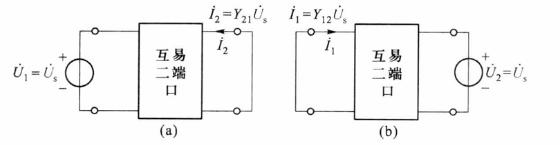

  - 则由
    $$
    \dot I_1=Y_{12}\dot U_S\ \ \ \ \ \ \dot I_2=Y_{21}\dot U_S
    $$
    得出
    $$
    Y_{12}=Y_{21}
    $$

  - 反之：

    - 若有 $Y_{12}=Y_{21}$ ，则此端口为互易二端口
    - 若有 $Y_{12}=Y_{21}$ 且  $Y_{11}=Y_{22}$ ，则此端口为对称二端口
      - 对于对称二端口，将输入端口和输出端口对换之后，二端口的特性保持不变

- 无导纳参数矩阵情况

  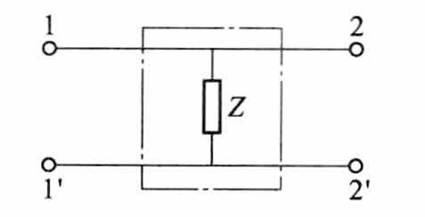
  $$
  Z=\left[
  \begin{matrix}
  Z & Z\\
  Z & Z\\
  \end{matrix}
  \right]
  $$

#### （2）开路阻抗参数方程（ $Z$ 参数方程）

$$
\dot U=Y^{-1}\dot I=Z\dot I
$$

$$
Z=Y^{-1}=\frac 1{\Delta_Y}\left[
\begin{matrix}
Y_{22} & -Y_{12}\\
-Y_{21} & Y_{11}\\
\end{matrix}
\right]=
\left[
\begin{matrix}
Z_{11} & Z_{12}\\
Z_{21} & Z_{22}\\
\end{matrix}
\right]\\
\frac 1{\Delta_Y}=Y_{11}Y_{22}-Y_{12}Y_{21}
$$

- 矩阵形式
  $$
  \left[
  \begin{matrix}
  \dot U_1\\
  \dot U_2
  \end{matrix}
  \right]=
  \left[
  \begin{matrix}
  Z_{11} & Z_{12}\\
  Z_{21} & Z_{22}\\
  \end{matrix}
  \right]
  \left[
  \begin{matrix}
  \dot I_1\\
  \dot I_2
  \end{matrix}
  \right]
  $$

- 互易条件
  $$
  Z_{12}=Z_{21}
  $$

- 对称条件
  $$
  Z_{12}=Z_{21}\ \ \ \ \ Z_{11}=Z_{22}
  $$

- 使用测试法测定 $Z$ 参数

  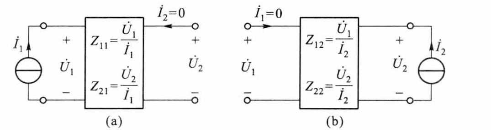
  $$
  Z_{11}=\frac{\dot U_1}{\dot I_1}|_{\dot I_2 = 0} \ \ \ \ \ &
  Z_{21}=\frac{\dot U_2}{\dot I_1}|_{\dot I_2 = 0} \\
  Z_{12}=\frac{\dot U_1}{\dot I_2}|_{\dot I_1 = 0} \ \ \ \ \ &
  Z_{22}=\frac{\dot U_2}{\dot I_2}|_{\dot I_1 = 0} \\
  $$

  - $Z_{11}$ ：开路输入阻抗
  - $Z_{22}$：开路输出阻抗
  - $Z_{12}、Z_{21}$：开路转移阻抗
  - 也可列写回路电流方程来求 $Z$ 参数

- 无阻抗参数矩阵情况

  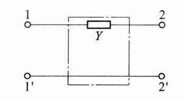
  $$
  Y=\left[
  \begin{matrix}
  Y & -Y\\
  -Y & Y\\
  \end{matrix}
  \right]
  $$
  

#### （3）传输参数方程（$A$ 参数方程）

$$
\dot U_1=A_{11}\dot U_2+A_{12}(-\dot I_2)\\
\dot I_1=A_{21}\dot U_2+A_{22}(-\dot I_2)
$$

其中：
$$
A_{11}=&-\frac{Y_{22}}{Y_{21}}\ \ \ \ \ \ &A_{12}=-\frac1{Y_{21}}\\
A_{21}=&Y_{12}-\frac{Y_{11}Y_{22}}{Y_{21}}\ \ \ \ \ \ &A_{22}=-\frac{Y_{11}}{Y_{21}}\\
$$

- 矩阵形式
  $$
  \left[
  \begin{matrix}
  \dot U_1\\
  \dot I_1
  \end{matrix}
  \right]=
  \left[
  \begin{matrix}
  A_{11} & A_{12}\\
  A_{21} & A_{22}\\
  \end{matrix}
  \right]
  \left[
  \begin{matrix}
  \dot U_2\\
  -\dot I_2
  \end{matrix}
  \right]
  $$

  - $A$ 参数矩阵
    $$
    A=\left[
    \begin{matrix}
    A_{11} & A_{12}\\
    A_{21} & A_{22}\\
    \end{matrix}
    \right]
    $$

    - 行列式
      $$
      \Delta_A=\frac{Y_{12}}{Y_{21}}
      $$

      - 对于互易二端口：$\Delta_A=1$
      - 对于对称二端口：$\Delta_A=1$ 且 $A_{11}=A_{22}$

    

- 使用测试法测定 $A$ 参数

  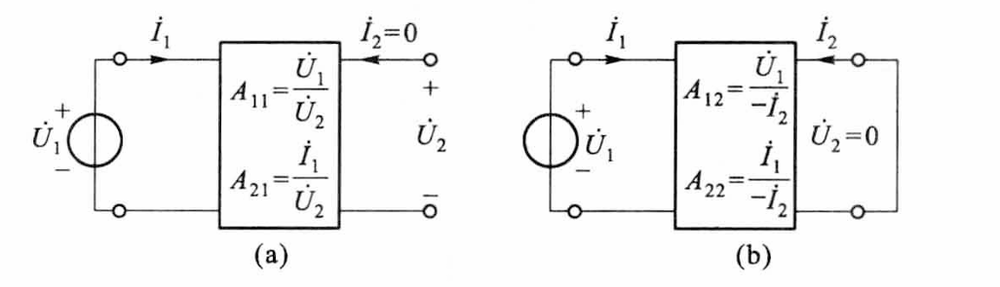
  $$
  A_{11}=\frac{\dot U_1}{\dot U_2}|_{\dot I_2 = 0} \ \ \ \ \ &
  A_{21}=\frac{\dot I_1}{\dot U_2}|_{\dot I_2 = 0} \\
  A_{12}=\frac{\dot U_1}{-\dot I_2}|_{\dot U_2 = 0} \ \ \ \ \ &
  A_{22}=\frac{\dot I_1}{-\dot I_2}|_{\dot U_2 = 0} \\
  $$

  - $A_{11}$ ：开路电压比
  - $A_{12}$：短路转移阻抗
  - $A_{21}$：开路转移导纳
  - $A_{22}$：短路转移电流比

#### （4）逆传输参数方程（$B$ 参数方程）

$$
\dot U_2=B_{11}\dot U_1+B_{12}(-\dot I_1)\\
\dot I_2=B_{21}\dot U_1+B_{22}(-\dot I_1)
$$

- 矩阵形式
  $$
  \left[
  \begin{matrix}
  \dot U_2\\
  \dot I_2
  \end{matrix}
  \right]=
  \left[
  \begin{matrix}
  B_{11} & B_{12}\\
  B_{21} & B_{22}\\
  \end{matrix}
  \right]
  \left[
  \begin{matrix}
  \dot U_1\\
  -\dot I_1
  \end{matrix}
  \right]
  $$

  - $B$ 参数矩阵
    $$
    B=\left[
    \begin{matrix}
    B_{11} & B_{12}\\
    B_{21} & B_{22}\\
    \end{matrix}
    \right]
    $$

    - 由于在传输方程中，$\dot I_2$ 前方带负号，而在逆传输参数方程中，$\dot I_1$ 前方带负号，故
      $$
      B\ne A^{-1}
      $$

- 理想变压器

  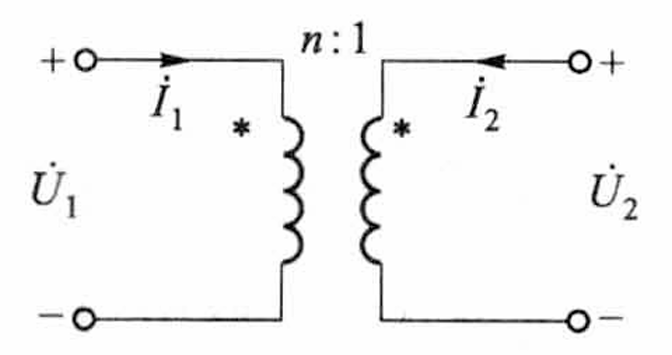
  $$
  \left[
  \begin{matrix}
  \dot U_1\\
  \dot I_1
  \end{matrix}
  \right]=
  \left[
  \begin{matrix}
  n & 0\\
  0 & \frac 1n\\
  \end{matrix}
  \right]
  \left[
  \begin{matrix}
  \dot U_2\\
  -\dot I_2
  \end{matrix}
  \right]
  $$

  - 满足互易条件
  - 不存在阻抗参数和导纳参数

#### （5）混合参数方程（$H$ 参数方程）

$$
\dot U_1=H_{11}\dot I_1+H_{12}\dot U_2\\
\dot I_2=H_{21}\dot I_1+H_{22}\dot U_2
$$

- 矩阵形式
  $$
  \left[
  \begin{matrix}
  \dot U_1\\
  \dot I_2
  \end{matrix}
  \right]=
  \left[
  \begin{matrix}
  H_{11} & H_{12}\\
  H_{21} & H_{22}\\
  \end{matrix}
  \right]
  \left[
  \begin{matrix}
  \dot I_1\\
  \dot U_2
  \end{matrix}
  \right]
  $$

  - $H$ 参数矩阵

  $$
  H=\left[
  \begin{matrix}
  H_{11} & H_{12}\\
  H_{21} & H_{22}\\
  \end{matrix}
  \right]
  $$

- 使用测试法测定 $H$ 参数

  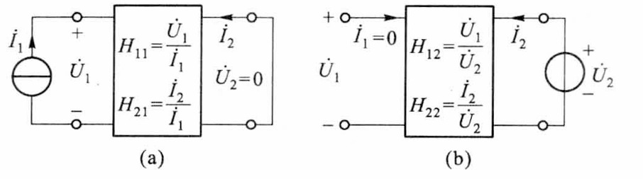
  $$
  H_{11}=\frac{\dot U_1}{\dot I_1}|_{\dot U_2 = 0} \ \ \ \ \ &
  H_{21}=\frac{\dot I_2}{\dot I_1}|_{\dot U_2 = 0} \\
  H_{12}=\frac{\dot U_1}{\dot U_2}|_{\dot I_1 = 0} \ \ \ \ \ &
  H_{22}=\frac{\dot I_2}{\dot U_2}|_{\dot I_1 = 0} \\
  $$

  - $H$ 参数与 $Y$ 参数的关系
    $$
    H_{11}=\frac{1}{Y_{11}} \ \ \ \ \ &
    H_{21}=\frac{Y_{21}}{Y_{11}} \\
    H_{12}=-\frac{Y_{12}}{Y_{11}} \ \ \ \ \ &
    H_{22}=\frac{\Delta_Y}{Y_{11}} \\
    $$

    - 对于互易网络：$H_{12}+H_{21}=0$
    - 对于对称网络：$\Delta_H=1$

- 用混合参数表述晶体管小信号等效电路非常方便

#### （6）逆混合参数方程

$$
\dot I_1=G_{11}\dot U_1+G_{12}\dot I_2\\
\dot U_2=G_{21}\dot U_1+G_{22}\dot I_2
$$

- 矩阵形式
  $$
  \left[
  \begin{matrix}
  \dot I_1\\
  \dot U_2
  \end{matrix}
  \right]=
  \left[
  \begin{matrix}
  G_{11} & G_{12}\\
  G_{21} & G_{22}\\
  \end{matrix}
  \right]
  \left[
  \begin{matrix}
  \dot U_1\\
  \dot I_2
  \end{matrix}
  \right]
  $$

  - $G$ 参数矩阵

  $$
  G=\left[
  \begin{matrix}
  G_{11} & G_{12}\\
  G_{21} & G_{22}\\
  \end{matrix}
  \right]
  $$

  $$
  G=H^{-1}
  $$

## 3、二端口网络的等效电路

- 等效电路与原网络必须具有相同的外部特性（相同的网络方程及参数）

- 对于互易二端口（仅有三个独立参数）

  - 可以用三个阻抗或导纳元件来组成

  - 三个元件可连成 $T$ 形电路或 $\Pi$ 形电路 

    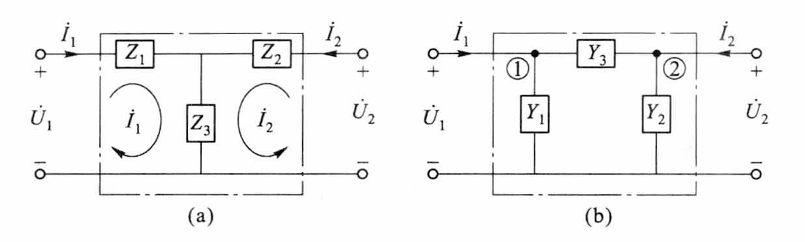

  -  如果给定二端口的 $Z$ 参数，宜选用 $T$ 形等效电路
    $$
    Z_1=Z_{11}-Z_{12}\\
    Z_2=Z_{22}-Z_{12}\\
    Z_3=Z_{12}
    $$

    - 若要进一步求 $\Pi$ 形电路，则在此基础上将星形联结变换为三角形联结即可

  - 如果给定二端口的 $Y$ 参数，宜选用 $\Pi$​ 形等效电路
    $$
    Y_1=Y_{11}+Y_{12}\\
    Y_2=Y_{22}+Y_{21}\\
    Y_3=-Y_{12}
    $$

  - 如果给定二端口的 $H$ 或 $A$ 参数，则需将它们变换成 $Y$ 或 $Z$​ 参数，再按上述方法求解
    $$
    Z_1=\frac{A_{11}-1}{A_{21}}\\
    Z_2=\frac{A_{22}-1}{A_{21}}\\
    Z_3=\frac{1}{A_{21}}\\
    $$

    $$
    Y_1=\frac{A_{22}-1}{A_{12}}\\
    Y_2=\frac{A_{11}-1}{A_{12}}\\
    Y_3=\frac{1}{A_{12}}\\
    $$

- 对于对称二端口，它的等效电路也必定是对称的

- 对于非互易的二端口（有四个独立参数）

  - 若给定二端口的 $Z$ 参数

    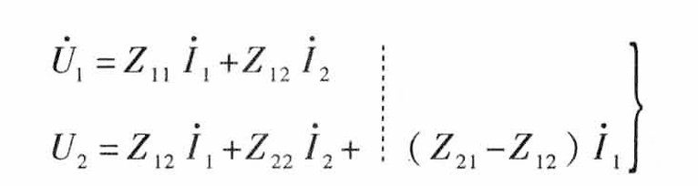

    - 虚线左边仍是互易二端口的表达式，可用 $T$ 形电路代替
    - 虚线右侧则是一个电流控制电压源

    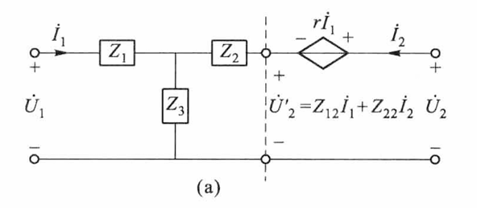

    - 其中：$r=Z_{21}-Z_{12}$

  - 若给定二端口的 $Y$ 参数

    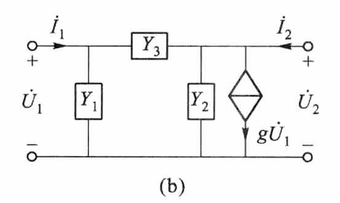
    $$
    g=Y_{21}-Y_{12}
    $$
    

## 4、二端口网络与电源和负载的连接

- 二端口网络工作时要接电源（输入端口）和负载（输出端口）

- 约束端口电压、电流的方程有

  - 二端口的方程：$\dot U_1=A_{11}\dot U_2 + A_{12}(-\dot I_2)、\dot I_1=A_{21}\dot U_2+A_{22}(-\dot I_2)$
  - 电源支路方程：$\dot U_1=\dot U_S-Z_S\dot I_1$
  - 负载支路方程：$\dot U_2=-Z_L\dot I_2$

- 输入阻抗
  $$
  Z_i=\frac{\dot U_1}{\dot I_1}=\frac{A_{11}Z_L+A_{12}}{A_{21}Z_L+A_{22}}
  $$

  - 二端口具有变换阻抗的作用
    - 若给定 $Z_L$，通过改变二端口的参数便可得到不同的输入阻抗 $Z_i$

- 输出阻抗
  $$
  \dot U_2=\dot U_{oc}+Z_o\dot I_2
  $$

  $$
  Z_o=\frac{\dot U_2}{\dot I_2}=\frac{A_{22}Z_S+A_{12}}{A_{21}Z_S+A_{11}}\\
  \dot U_{oc}=\frac{\dot U_S}{A_{21}Z_S+A_{11}}
  $$

## 5、二端口网络级联

- 一个二端口网络的输出端与另一个网络的输入端相连

- 级联后的复合二端口网络
  $$
  A=A_aA_b...\\
  \left[\begin{matrix}
  A_{11}&A_{12}\\
  A_{21}&A_{22}
  \end{matrix}\right]
  =
  \left[\begin{matrix}
  A^a_{11}&A^a_{12}\\
  A^a_{21}&A^a_{22}
  \end{matrix}\right]
  \left[\begin{matrix}
  A^b_{11}&A^b_{12}\\
  A^b_{21}&A^b_{22}
  \end{matrix}\right]...
  $$
  

