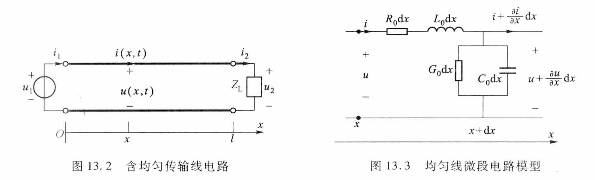
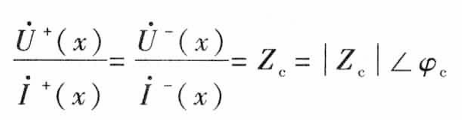
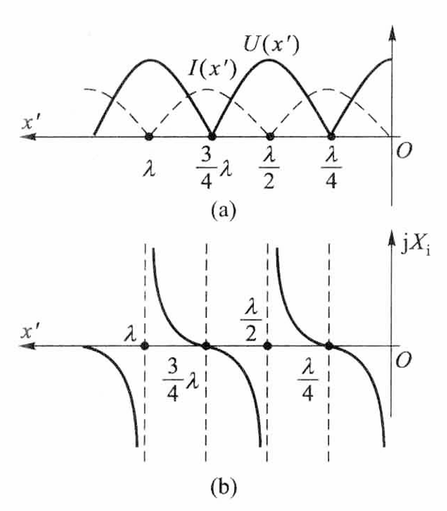
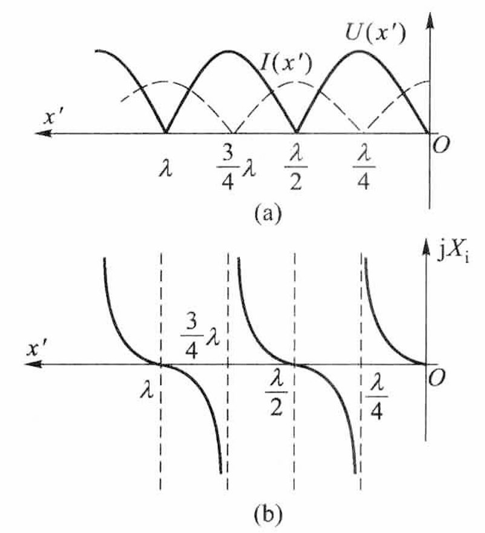
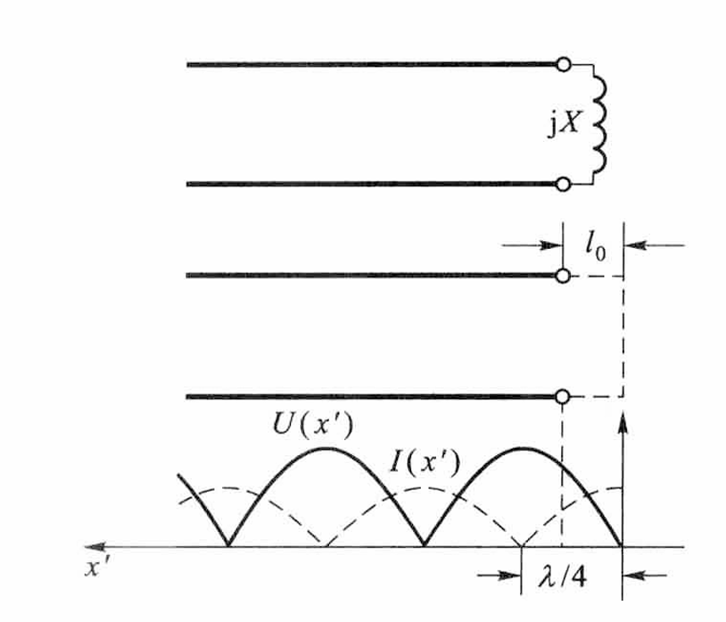

# 电路（十一）：均匀传输线

## 1、均匀传输线及其方程

- 由于线路长度很长（如 $500km$），和波长相比不是很小，所以需要考虑参数的分布性
- 分布参数：
  - 单位长度（往返）电阻 $R_0$ 
  - 单位长度（往返）电感 $L_0$
  - 单位长度两导体间电导 $G_0$
  - 单位长度两导体间电容 $C_0$

- 电报方程

  
  $$
  -\frac{\partial u}{\partial x}=R_0i+L_0\frac{\partial i}{\partial t}\\
  -\frac{\partial i}{\partial x}=G_0u+C_0\frac{\partial u}{\partial t}\\
  $$

  - 转换为相量并求导
    $$
    -\frac{d\dot U(x)}{dx}=(R_0+j\omega L_0)\dot I(x)=Z_0\dot I(x)\\
    -\frac{d\dot I(x)}{dx}=(G_0+j\omega C_0)\dot U(x)=Y_0\dot U(x)\\
    $$
    

    其中：
    
    - $Z_0$ ：单位长度的阻抗
    - $G_0$ ：单位长度的导纳

    
    
  - 再求导
    $$
    \frac{d^2\dot U(x)}{dx^2}=Z_0Y_0\dot U(x)=\gamma^2\dot U(x)\\
    \frac{d^2\dot I(x)}{dx^2}=Z_0Y_0\dot I(x)=\gamma^2\dot I(x)\\
    $$
    其中：
    $$
    \gamma=\sqrt{(R_0+j\omega L_0)(G_0+j\omega C_0)}=\alpha+j\beta
    $$

    - $\gamma$ ：传播常数（ $1/m$ ）
    - $\alpha$ ：衰减常数（ $Np/m$ )
    - $\beta$ ：相位常数（ $rad/m$ ）

  - 求解
    $$
    \dot U(x)=A_1e^{-\gamma x}+A_2e^{\gamma x}\\
    \dot I(x)=B_1e^{-\gamma x}+B_2e^{\gamma x}\\
    $$

    - 由一次导方程有

    $$
    \dot I(x)=-\frac {1}{Z_0}\frac{d\dot U(x)}{dx}=\frac{A_1}{Z_c}e^{-\gamma x}-\frac{A_2}{Z_c}e^{\gamma x}
    $$

    - 其中：
      $$
      Z_c=\frac{Z_0}{\gamma}=\sqrt{\frac{R_0+j\omega L_0}{G_0+j\omega C_0}}
      $$

      - 称为特性阻抗或波阻抗

    - 若根据始端 $x=0$ 处，$\dot U=\dot U_1$  $\dot I=\dot I_1$
      $$
      \left[
      \begin{matrix}
      \dot U(x)\\
      \dot I(x)
      \end{matrix}
      \right]
      =
      \left[
      \begin{matrix}
      \ \ \ \ \ \ \ \cosh{\gamma x}\ \ \ \ \ \ \ \  \ -Z_c\sinh{\gamma x}\\
      -\frac 1{Z_c}\sinh{\gamma x}\ \ \ \ \ \ \ \ \ \cosh{\gamma x}
      \end{matrix}
      \right]
      \left[
      \begin{matrix}
      \dot U_1\\
      \dot I_1
      \end{matrix}
      \right]
      $$

    - 若根据终端 $x=l$ 处，$\dot U=\dot U_2$  $\dot I=\dot I_2$
      $$
      \left[
      \begin{matrix}
      \dot U(x')\\
      \dot I(x')
      \end{matrix}
      \right]
      =
      \left[
      \begin{matrix}
      \ \ \ \ \cosh{\gamma x'}\ \ \ \ \ \ \ \  \ Z_c\sinh{\gamma x'}\\
      \frac 1{Z_c}\sinh{\gamma x'}\ \ \ \ \ \ \ \ \ \cosh{\gamma x'}
      \end{matrix}
      \right]
      \left[
      \begin{matrix}
      \dot U_2\\
      \dot I_2
      \end{matrix}
      \right]
      $$
      

## 2、均匀传输线上的行波

- 波的叠加
  $$
  \dot U(x)=A_1e^{-\gamma x}+A_2e^{\gamma x}=\dot U^++\dot U^-\\
  \dot I(x)=B_1e^{-\gamma x}+B_2e^{\gamma x}=\dot I^+-\dot I^-\\
  $$

  - 正向行波

    - 瞬时值
      $$
      u^+(x,t)=\sqrt 2 U'e^{\alpha x}\cos{(\omega t-\beta x+\Psi')}
      $$

    - 相位
      $$
      \theta=\omega t-\beta x+\Psi'
      $$

    - 相速
      $$
      v_p=\frac{dx}{dt}=\frac{\omega}{\beta}
      $$

    - 波长
      $$
      \lambda=v_pT=\frac{\omega}{\beta}\frac{2\pi}{\omega}=\frac{2\pi}{\beta}
      $$

  - 反向行波

    - 瞬时值
      $$
      u^-(x,t)=\sqrt 2 U''e^{\alpha x}\cos{(\omega t+\beta x+\Psi')}
      $$

    - 相位
      $$
      \theta=\omega t+\beta x+\Psi'
      $$

    - 相速
      $$
      v_p=-\frac{dx}{dt}=\frac{\omega}{\beta}
      $$

    - 波长
      $$
      \lambda=v_pT=\frac{\omega}{\beta}\frac{2\pi}{\omega}=\frac{2\pi}{\beta}
      $$

  - $波阻抗 = \frac{电压正向行波}{电流正向行波} = \frac{电压反向行波}{电流反向行波} \\$​

    

    

  - 线路上的电压、电流可认为是两个行进方向相反的电压波的叠加
    - 电压：正向 + 反向
    - 电流：正向 - 反向 （由于参考方向不同）

- 波的反射与终端匹配

  - 在线路终端：
    $$
    \dot U_2=\dot U^+_2+\dot U^-_2\\
    \dot I_2=\dot I^+_2-\dot I^-_2
    $$

    $$
    Z_L=\frac{\dot U_2}{\dot I_2}=\frac{Z_c\dot I^+_2 + Z_c\dot I^-_2}{\dot I^+_2-\dot I_2^-}\\
    N_2=\frac{\dot I^-_2}{\dot I^+_2}=\frac{Z_L- Z_c}{Z_L+ Z_c}
    $$

  - 当负载电阻 $Z_L=Z_c$ 时， $N_2=0$
    $$
    \dot I^-_2=N_2\dot I_2^+=0\\
    \dot U^-_2=N_2\dot U_2^+=0\\
    $$

    - 即电压电流的反向行波均为 $0$
    
    - 称为负载与传输线匹配
    
    - 此时终端负载吸收的功率称为均匀传输线的自然功率
      $$
      P_2=U_2I_2\cos\phi_c=\frac{U_2^2}{|Z_c|}\cos\phi_c
      $$
      
    
  - 当 $Z_L\rarr\infty$ 时， $N_2=1$ 全反射
  
  - 当  $Z_L\neq Z_c$ 时，传输线上同时有正向行波和反向行波
  
    - 因此可认为：反向行波是由正向行波在传输线终端受到与线路波阻抗不匹配的负载引起的

- 实验测试波阻抗与传播常数

  - 终端短路和开路时，测量始端的电压和电流
    $$
    Z_{is}=\frac{\dot U_1}{\dot I_1}|_{|Z_L|=0}=Z_c\tanh{\gamma l}\\
    Z_{io}=\frac{\dot U_1}{\dot I_1}|_{|Z_L|\rarr\infty}=\frac{Z_c}{\tanh{\gamma l}}\\
    Z_c=\sqrt{Z_{io}Z_{is}}\\
    \tanh\gamma l=\sqrt{\frac{Z_{is}}{Z_{io}}}
  $$

## 3、无损耗线和驻波

- $R_0=0、G_0=0$ ，线路没有损耗

- 对于高频电路：$\omega L_0 \gg R_0、\omega C_0\gg G_0$，可以视为无损线
  $$
  \gamma=\sqrt{j\omega L_0·j\omega C_0}=j\omega\sqrt{L_0C_0}=j\beta=j\frac{2\pi}{\lambda}\\
  \alpha=0\\
  \beta=\omega\sqrt{L_0C_0}
  $$

- 无损线上行波传播时是不衰减的
  $$
  v_p=\frac {\omega}{\beta}=\frac1{\sqrt{L_0C_0}}\\
  Z_c=\sqrt{\frac{j\omega L_0}{j\omega C_0}}=\sqrt{\frac{L_0}{C_0}}
  $$

  - 由于波阻抗为实数

    - 故同方向上的电压和电流的行波在同一位置处是同相位的，且可用 $\gamma = j\beta$ 化简通解

    - 若根据始端 $x=0$ 处，$\dot U=\dot U_1$  $\dot I=\dot I_1$，可用 $\gamma = j\beta$ 化简原式
      $$
      \left[
      \begin{matrix}
      \dot U(x)\\
      \dot I(x)
      \end{matrix}
      \right]
      =
      \left[
      \begin{matrix}
      \ \ \ \ \ \ \ \cos{\beta x}\ \ \ \ \ \ \ \  \ -jZ_c\sin{\beta x}\\
      -\frac j{Z_c}\sin{\beta x}\ \ \ \ \ \ \ \ \ \cos{\beta x}
      \end{matrix}
      \right]
      \left[
      \begin{matrix}
      \dot U_1\\
      \dot I_1
      \end{matrix}
      \right]
      $$

    - 若根据终端 $x=l$ 处，$\dot U=\dot U_2$  $\dot I=\dot I_2$，可用 $\gamma = j\beta$ 化简原式
      $$
      \left[
      \begin{matrix}
      \dot U(x')\\
      \dot I(x')
      \end{matrix}
      \right]
      =
      \left[
      \begin{matrix}
      \ \ \ \ \cos{\beta x'}\ \ \ \ \ \ \ \  \ jZ_c\sin{\beta x'}\\
      \frac j{Z_c}\sin{\beta x'}\ \ \ \ \ \ \ \ \ \cos{\beta x'}
      \end{matrix}
      \right]
      \left[
      \begin{matrix}
      \dot U_2\\
      \dot I_2
      \end{matrix}
      \right]
      $$

- 输入阻抗
  $$
  Z_i(x')=\frac{\dot U(x')}{\dot I(x')}=Z_c\frac{Z_L\cos \beta x'+jZ_c\sin \beta x'}{jZ_L\sin \beta x'+Z_c\cos \beta x'}
  $$

  - 设 $x'=\frac{\lambda}4、\beta x'=\frac{\pi}2\\$，则
    $$
    Z_i=\frac{Z_c^2}{Z_L}
    $$

    - 即实现了阻抗变换

    - 负载阻抗经过四分之一波长无损耗线，变换到输入端后，等于其倒数与特性阻抗平方的乘积

    - 可作为四分之一阻抗变换器，以达到传输线阻抗匹配

    - 欲将负载阻抗 $Z_L$ 变换为所需要的等效阻抗 $Z_i$​ 时，无损线的波阻抗应为
      $$
      Z_c=\sqrt{Z_iZ_L}
      $$

- 驻波：

  - 波腹和波节的位置不随时间变化的波

  - 形成条件：

    - 行波沿线传播没有衰减：$\alpha = 0$ （衰减系数）
      - 只有无损线满足
    - 反射波的幅度与入射波的幅度相等：$|N_2|=1$ （终端反射系数）
      - 终端开路
      - 终端短路
      - 接纯电抗负载

  - 满足以上条件时，正向行波和反向行波的叠加就形成了驻波

    

    - 此时 $A$ 点为波腹、 $B$ 点为波节
    - 二者相距 $\frac{\lambda}4\\$

- 无损线在终端阻抗不匹配时的几种特殊工作状态（能形成驻波）

  ① 终端开路：$|Z_L|\rarr\infty，\dot I_2=0$​
  $$
  \dot U(x')=\dot U_2\cos\beta x'\\
  \dot I(x')=j\frac{\dot U_2}{Z_c}\sin \beta x'
  $$

  - 有效值
    $$
    U(x')=U_2|\cos\beta x'|\\
    I(x')=\frac{U_2}{Z_c}|\sin \beta x'|
    $$

  - 在 $x'=0、\frac{\lambda}2、\lambda\\$ 处，电压有效值最大（波腹），电流有效值为 $0$ （波节）

  - 在 $x'=\frac{\lambda}4、\frac{3\lambda}4\\$ 处，电压有效值为 $0$ （波节），电流有效值为最大 （波腹）

    

    - 等效阻抗
      $$
      Z_i(x')=-jZ_c\cot\beta x'=-jZ_c\cot\frac{2\pi}{\lambda}x'=jX_i
      $$

      - $x'<\frac{\lambda}4\\$：终端开路的无损线相当于电容

        

      - $x'=\frac{\lambda}4\\$：终端开路的无损线相当于短路

        

      - $\frac{\lambda}4<x'<\frac{\lambda}2\\$：终端开路的无损线相当于电感

        

      - $x'=\frac{\lambda}2\\$：终端开路的无损线相当于开路

  

  ② 终端短路：$|Z_L|=0，\dot U_2=0$
  $$
  \dot U(x')=j{Z_c}{\dot I_2}\sin \beta x'\\
  \dot I(x')=\dot I_2\cos\beta x'
  $$

  - 有效值
    $$
    U(x')={Z_c}{I_2}|\sin \beta x'|\\
    I(x')=I_2|\cos\beta x'|
    $$

  - 在 $x'=0、\frac{\lambda}2、\lambda\\$ 处，电压有效值为 $0$ （波节），电流有效值为最大 （波腹）

  - 在 $x'=\frac{\lambda}4、\frac{3\lambda}4\\$ 处，电压有效值最大（波腹），电流有效值为 $0$ （波节）

    

    - 等效阻抗
      $$
      Z_i(x')=jZ_c\tan\beta x'=jX_i
      $$

      - $x'<\frac{\lambda}4\\$：终端开路的无损线相当于电感

        

      - $x'=\frac{\lambda}4\\$：终端开路的无损线相当于开路

        

      - $\frac{\lambda}4<x'<\frac{\lambda}2\\$：终端开路的无损线相当于电容

        

      - $x'=\frac{\lambda}2\\$：终端开路的无损线相当于短路

  

  ③ 终端接纯电抗负载：$Z_L=jX，\dot U_2=jX\dot I_2$

  - 终端反射系数 $|N_2| = 1$

  - 一个纯电抗元件可以用一个终端短路或终端开路的无损线来等效代替

    - 若负载是电感，则可以用一段长度 $l_0$ 小于 $\frac{\lambda}4\\$ 的终端短路的无损线等效
      $$
      jZ_c\tan(\frac{2\pi l_0}{\lambda})=jX
      $$
      

## 4、无损均匀线的波过程

- 均匀线方程及其通解

  - 电报方程
    $$
    -\frac{\partial u}{\partial x}=R_0i+L_0\frac{\partial i}{\partial t}\\
    -\frac{\partial i}{\partial x}=G_0u+C_0\frac{\partial u}{\partial t}\\
    $$

  - 取拉普拉斯变换解得
    $$
    U(x,s)=U'(s)e^{-\gamma(s)x}+U''(S)e^{\gamma(s)x}\\
    I(x,s)=\frac{U'(s)}{Z_c(s)}e^{-\gamma(s)x}-\frac{U''(s)}{Z_c(s)}e^{\gamma(s)x}\\
    Z_c(s)=\sqrt{\frac{R_0+sL_0}{G_0+sC_0}}
    $$

  - 对于无损线，$Z_c(s)=\sqrt{\frac{L_0}{C_0}}，\gamma(s)=s\sqrt{L_0C_0}=\frac sv\\$ ，求逆变换得
    $$
    u(x,t)=u'(\frac{t-x}v)\epsilon(\frac{t-x}v)+u''(\frac{t+x}v)\epsilon(\frac{t+x}v)\\
    i(x,t)=\frac{u}{Z_c}(\frac{t-x}v)\epsilon(\frac{t-x}v)-\frac{u''}{Z_c}(\frac{t+x}v)\epsilon(\frac{t+x}v)\\
    $$
    

- 无损线上波的发出
  - 设始端接阶跃电压源
  - 开始时线路上只有正向行波电压、电流
  - 说明波从电源发出之际，无损均匀线对电源来说相当于一个纯电阻，阻值为波阻抗值
- 无损线上波的反射
  - 正向行波的波前到达无损线终端时，引起反向行波
  - 反向行波与正向行波之比为负载反射系数