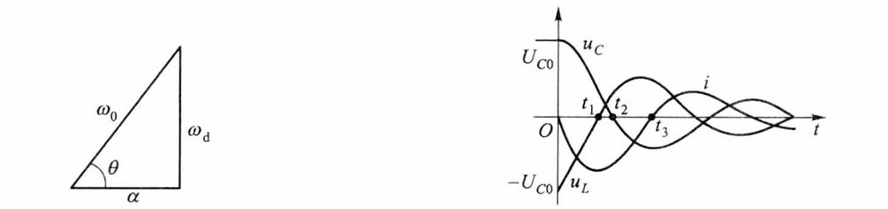
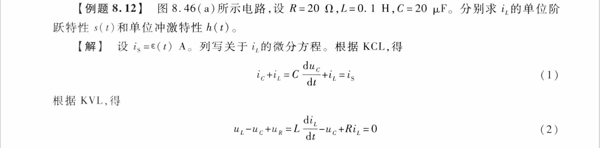
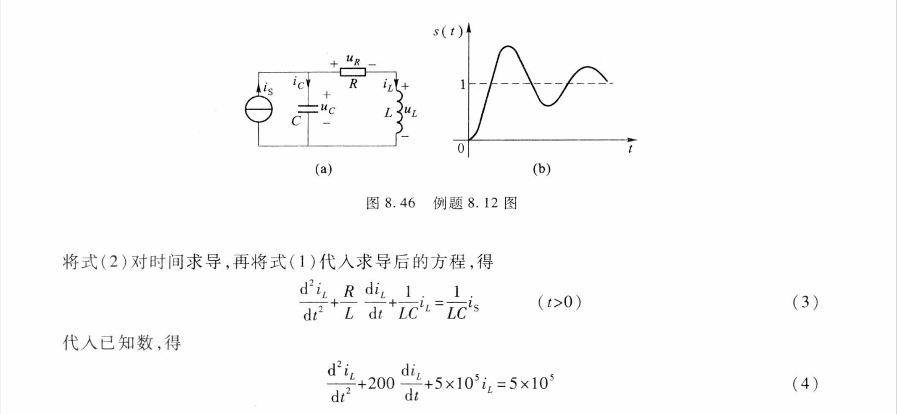
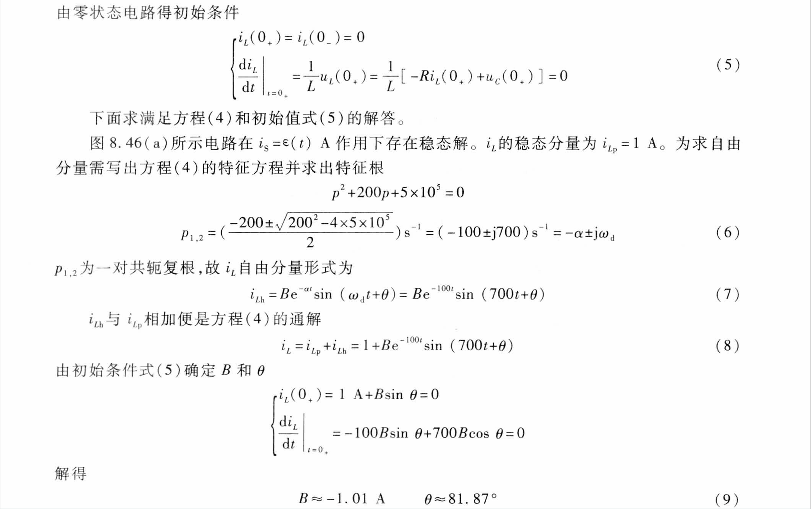
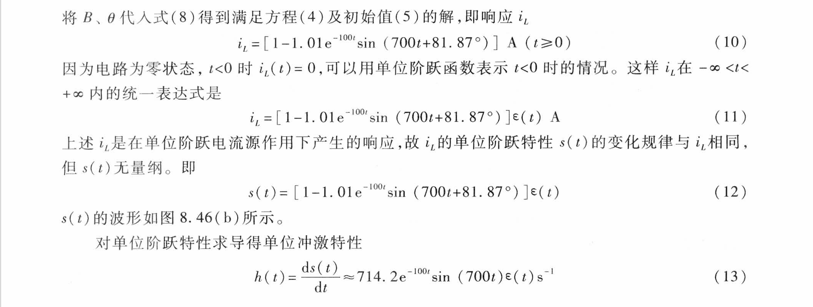

# 电路（八）：线性动态电路暂态过程的时域分析

## ①动态电路的暂态过程

- **换路**
  - 如闭合开关、断开开关、电源值突变、元件参数变动等
  - $t=0$ ：换路
  - $t=0_-$ ：换路**前**瞬间
  - $t=0_+$ ：换路**后**瞬间

- 含有**动态元件**的电路（动态电路）在**换路**时会有**暂态过程**
  - 动态元件：电感、电容（**储能元件**）
  - 暂态过程：因为能量不能突变，故有过渡过程，从原稳态**逐渐**切换到新稳态
  - 只含有电阻的电路（电阻电路）：在换路时由原稳态**跃变**为新稳态，**无过渡过程**

- 时域分析法
  - 以时间 $t$ 为主变量列写电路的微分方程
  - 确定初始条件：$u_C(0_+)、i_L(0_+)、q_C(0_+)、\Psi_L(0_+)$
  - 解微分方程

## ②电路变量的初值

### 1、换路定律

- 内容

  - 条件：换路瞬间 $i_C$​ 有界（非冲激函数）
    $$
    &q(0_+)&=&q(0_-)\\
    即：&u_C(0_+)&=&u_C(0_-)
    $$
    
  - 条件：换路瞬间 $u_L$​ 有界（非冲激函数）
    $$
    &\Psi(0_+)&=&\Psi(0_-)\\
    即：&i_L(0_+)&=&i_L(0_-)
    $$
    
  
- 本质是能量不能突变

  

  - 故 $i_C、u_L$ 可以跃变

### 2、其它初值的确定

- 步骤

  1. 由换路定律获得 $t=0_+$ 时的 $u_C、i_L$ 

  2. 将电容、电感等效为直流电压源、直流电流源

     

     

  3. 再根据 $KCL、KVL$ 求得其余各元件的 $f(0_+)$

- 例题：

  - 如图电路，在 $t<0$ 处于稳态，$t=0$ 开关接通。求 $i_L(0_+)、u_C(0_+)、u_1(0_+)、u_L(0_+)、i_C(0_+)$

    

    -  $t<0$ 时处于稳态，电感短路、电容开路，等效电路图如下：

      
      $$
      i_L(0_+)=i_L(0_-)=\frac{12V}{(4+6)\ohm}=1.2A\\
      u_C(0_+)=u_C(0_-)=6\ohm*i_L(0_-)=7.2V
      $$

    -  $t>0$ 时，等效电路图如下：

      

      - 解得

    $$
    u_1(0_+)=2.4V\\
    u_L(0_+)=-4.8V\\
    i_C(0_+)=0
    $$

## ③一阶电路的零输入响应

### 1、概念

- 一阶电路
  - 只含有（或可化为一个）动态元件的电路
  - 可用一阶常微分方程描述
- 零输入响应
  - 换路后无独立源作用
    - 仅由储能元件的初始储能引起响应

### 2、RC电路的零输入响应

$$
u_C=u_c(0_+)e^{-\frac t{RC}}=U_0e^{-\frac t{RC}}\\
(t>0\  或\  t\geq0_+)
$$

- 时间常数
  $$
  \tau=RC
  $$

  - 决定 $u_c、i_c$ 的衰减速率，$\tau$ 越大，电容放电时间越长
  - 单位为 $s$

### 3、RL电路的零输入响应

$$
i_L=i_L(0_+)e^{-\frac {Rt}{L}}=I_0e^{-\frac {Rt}{L}}\\
(t>0\  或\  t\geq0_+)
$$

- 时间常数
  $$
  \tau=\frac LR
  $$
  

## ④阶跃函数和冲激函数

### 1、单位阶跃函数

$$
\epsilon(t)=
\begin{cases}
0&(t<0)\\
1&(t>0)
\end{cases}
$$

- 延迟单位阶跃函数
  $$
  \epsilon(t-t_0)=
  \begin{cases}
  0&(t<t_0)\\
  1&(t>t_0)
  \end{cases}
  $$
  

### 2、单位脉冲函数

$$
G(t)=\epsilon(t)-\epsilon(t-t_0)
$$

- 参数
  - 脉冲幅度
  - 脉冲宽度
  - 脉冲强度（面积）
    - 单位脉冲：脉冲强度为 $1$

- 可用 $G(t)$ 与某函数的乘积表示各种波形的脉冲

  

  

### 3、单位冲激函数

- 即脉冲宽度趋于零的单位脉冲函数

- 参数

  - 冲激强度：单位 $s^{-1}$

- 单位冲激函数与常量 $K$ 的乘积可代表一般冲激函数，其中 $K$ 即冲激强度

  - 函数单位为 $A$ 时：$K$ 的单位为 $A·s$ ，即库伦 $C$
  - 函数单位为 $V$ 时：$K$ 的单位为 $V·s$ ，即韦伯 $Wb$

- 延迟单位冲激函数
  $$
  \delta(t-t_0)
  $$

- 单位冲激函数的性质

  1. 
  2. 
     - **重要**
  3. 
  4. 
  5. 
     - **重要**

## ⑤一阶电路的阶跃响应

### 1、概念

- 零状态响应
  - 储能元件的原始储能为零
  - 仅由独立电源作用引起响应

- 阶跃响应
  - 在阶跃电源作用下的零状态响应

- 单位阶跃特性
  - 线性电路的阶跃响应与阶跃电源的幅值之比 $s(t)$
  - 可能无量纲，也可能是电阻、电导的量纲

### 2、RC电路的阶跃响应

- 阶跃响应
  $$
  u_c=U_S(1-e^{-\frac t\tau})&(t>0)\\
  u_c=U_S(1-e^{-\frac t\tau})\epsilon(t)&(-\infty<t<+\infty)
  $$

  - 特解：$u_{cp}=U_S$ 称为 $u_c$ 的稳态分量

  - 通解：$u_{ch}=-U_Se^{-\frac t\tau}$ 称为 $u_c$ 的暂态分量

    

  - 电流
    $$
    i_c=C\frac{du_c}{dt}=\frac C\tau U_Se^{-\frac t\tau}\epsilon(t)+CU_S(1-e^{-\frac t\tau})\delta(t)=\frac {U_S}Re^{-\frac t\tau}\epsilon(t)\\
    i_c=\frac{U_S-u_c(t)}R=\frac {U_S}Re^{-\frac t\tau}\epsilon(t)
    $$

  - 延迟阶跃响应
  
    - 当电压源延迟至 $t_0$ 作用时，只需要将 $t$ 换元为 $t-t_0$
  
      
  
- 单位阶跃特性
  $$
  s(t)=\frac{u_C(t)}{U_S}=(1-e^{-\frac t\tau})\epsilon(t)
  $$

### 3、RL电路的阶跃响应

- 阶跃响应
  $$
  i_L(t)=I_S(1-e^{-\frac t\tau})\epsilon(t)&(-\infty<t<+\infty)\\
  $$

- 单位阶跃特性
  $$
  s_L(t)=\frac{i_L(t)}{I_S}=(1-e^{-\frac t\tau})\epsilon(t)
  $$

### 4、脉冲响应

- 将 $RC$ 电路的 $u_S$ 换成矩形脉冲电压源
  $$
  u_S=U_S[\epsilon(t)-\epsilon(t-t_0)]
  $$

  - 则脉冲响应为
    $$
    u_C(t)=U_S(1-e^{-\frac t\tau})\epsilon(t)-U_S(1-e^{-\frac {t-t_0}\tau})\epsilon(t-t_0)
    $$

    - 分段形式：

      

    - 波形

      

  - 可视为先发生零状态响应、再发生零输入响应

## ⑥一阶电路的冲激响应

### 1、概念

- 冲激响应
  - 电路在冲激电源作用下的零状态响应
- 单位冲激特性
  - $h(t)=\frac{冲激响应}{冲激强度}\\$
  - 单位可能是 $s^{-1}、\ohm ·s^{-1}、S·s^{-1}$

- 结论
  - 激励导数（积分）的响应 $=$ 激励响应的导数（积分）
  - $h(t) = \frac{ds(t)}{dt}\ \ \ s(t)=\int_0^th(\xi)d\xi\\$
    - 即一阶电路单位冲激特性 $=$ 单位阶跃特性的导数

- 计算冲激响应：

  1. 计算单位阶跃特性 $s(t)$​
     $$
     s(t)=(1-e^{-\frac t\tau})\epsilon(t)
     $$
     
  2.  $s(t)$ 求导得到单位冲激特性 $h(t)$
     $$
     h(t)=\frac 1\tau e^{-\frac t\tau}\epsilon(t)
     $$
     
  3.  $h(t)$ 与冲激强度相乘得到冲激激励的零状态响应

### 2、RC、RL电路的冲激响应

- $RC$ 电路

  - 先当作脉冲响应：$u_S$ 的宽度为 $\Delta\xi$ ，幅度为 $\frac{\Psi}{\Delta\xi}\\$，即冲激强度为 $\Psi$

  $$
  u_C(t) =\frac{\Psi}{\Delta\xi}[s(t)-s(t-\Delta\xi)]\\
  s(t)=(1-e^{-\frac t\tau})\epsilon(t)\\
  $$

  - 再取极限得到冲激响应
    $$
    u_C=\lim_{\Delta\xi\rarr0}\frac{\Psi}{\Delta\xi}[s(t)-s(t-\Delta\xi)]=\Psi\frac{ds(t)}{dt}=\frac\Psi{RC}e^{-\frac t\tau}\epsilon(t)=\frac QCe^{-\frac t\tau}\epsilon(t)=Ue^{-\frac t\tau}\epsilon(t)
    $$

    - 一个代换：$QR=\Psi$

    - 相当于零输入响应

      - 因为 $u_C$ 发生跃变，电容直接开始给电阻放电

    - 电流的冲激响应
      $$
      i_C(t)=C\frac{du_C}{dt}=Q\delta(t)-\frac URe^{-\frac t\tau}\epsilon(t)
      $$
      

- $RL$​ 电路同理
  $$
  i_L(t)=\frac{RQ}Le^{-\frac t\tau}=\frac{\Psi}Le^{-\frac t\tau}
  $$
  

## ⑦正弦电源作用下的一阶电路

- 正弦电压源
  $$
  u_S=U_m\cos{(\omega t+\Psi_u)}
  $$

  - 接入角：$\Psi_u$

- 非齐次微分方程解
  $$
  i_L(t)=i_{Lp}(t)+i_{Lh}(t)=I_{mLp}\cos(\omega t + \Psi_i)-(I_{mLp}\cos\Psi_i)e^{-\frac t\tau}
  $$

  - 特解称为强制分量（稳态分量）
  - 齐次通解称为自由分量（暂态分量）$=$ 强制分量在 $t=0_+$ 的值

- 例题

  - 如图所示电路，原电路达到稳态，$t=0$ 时开关断开，已知 $u_S=10\sqrt2 \cos (100t)V$，求 $t>0$ 的 $u_C$

    

    - 由换路定律
      $$
      u_C(0_+)=u_C(0_-)=0
      $$

    -  $t>0$ 时

      
      $$
      u_{OC}=u_S=10\sqrt2 \cos (100t)V\\
      R_{eq}=1\ohm\\
      \tau=R_{eq}C=0.01s
      $$

    - 用相量法计算强制分量 $u_{Cp}$ 和自由分量 $u_{Cp}(0_+)$

      
      $$
      u_{Cp}(t)=10\cos(100t-45\degree)V\\
      u_{Cp}(0_+)=5\sqrt2V
      $$

    - 代入通解
      $$
      u_C(t)=u_{Cp}(t)-u_{Cp}(0_+)e^{-\frac t\tau}=[10\cos(100t-45\degree)-5\sqrt2e^{-100t}]V
      $$

## ⑧一阶电路的全响应

$$
全响应&=&零输入响应+零状态响应\\
&=&强制分量+自由分量\\
&=&稳态分量+暂态分量
$$

- 由独立源和储能元件的原始储能共同作用引起的响应
- 零输入响应中只含有自由分量
- 零状态响应一般既包含强制分量，又包含自由分量

- 例题

  - 图示电路 $t<0$ 时稳态，$t=0$ 时的电容电压 $u_C$

    

    -  $t<0$ 时

      

    -  $t>0$​ 时，换路定律
      $$
      u_C(0_+)=u_C(0_-)=6V
      $$

    - 零输入
      $$
      u'(t)=u_C(0_+)e^{-\frac t\tau}=6e^{-5t}V
      $$

    - 零状态
      $$
      u''(t)=u_C(\infty)-u_C(\infty)e^{-\frac t\tau}=(-12+12e^{-5t})V
      $$

    - 全响应
      $$
      u_C(t)=u'(t)+u''(t)=u_C(0_+)e^{-\frac t\tau}=(-12+18e^{-5t})V
      $$
      

## ⑨一阶电路暂态响应的一般形式

- 三要素公式
  $$
  f(t)=f_p(t)+[f(0_+)-f_p(0_+)]e^{-\frac t\tau}
  $$

  - 参数解释

    - 初始值 $f(0_+)$
    - 时间常数 $\tau$
    - 特解 $f_p(t)$

  - 如果外加激励是直流或阶跃电源，则响应的稳态解或强制分量是常量
    $$
    f_p(t)=f_p(0_+)=f(\infty)
    $$

    - 即有三要素公式变化为
      $$
      f(t)=f(\infty)+[f(0_+)-f(\infty)]e^{-\frac t\tau}
      $$

  - 强制分量 $f_p(t)$ 的形式决定于独立电源 $g(t)$

    

    - 常用第一条与最后一条

- 例题

  - 例1：（同上）图示电路 $t<0$ 时稳态，$t=0$ 时的电容电压 $u_C$

    

    - $t<0$ 时

      

    - $t>0$​ 时，换路定律
      $$
      u_C(0_+)=u_C(0_-)=6V
      $$

    - 求后稳态值
      $$
      u_c(\infty)=-18V*\frac{6\ohm}{3\ohm+6\ohm}=-12V
      $$

    - 时间常数
      $$
      \tau=R_{eq}C=(8\ohm+2\ohm)*0.02F=0.2s
      $$
      
    - 由三要素公式
      $$
      u_c(t)=u_c(\infty)+(u_C(0_+)-u_C(\infty))e^{-\frac t\tau}=-12+18e^{-5t}\ V
      $$
    
  - 例2：电路如图所示，$C=0.001F$ ， $u_S$ 为正弦电压源，幅值为 $90V$，角频率为 $50rad/s$，当 $u_S$ 为正的最大值时，将开关接通，开关接通前电容电压为 $10V$。求开关接通后电压 $u_C$ 的变化规律
  
    
  
    - 设开关接通时刻 $t=0$
      $$
      u_S=90\cos(50t)\ V
      $$
  
    - 由换路定律
      $$
      u_C(0_-)=10V=u_C(0_+)
      $$
  
    - 当 $t\rarr\infty$ 时，正弦稳态相量模型如下图
  
      
  
      - 列写节点电压方程
  
        
  
        
  
        则有
        $$
        u_{Cp}(t)=30\sqrt2\cos(50t-45\degree)\ V
        $$
  
    - 时间常数
      $$
      \tau=20\ohm *0.001F=0.02s
      $$
  
    - 由三要素公式
      $$
      u_C(t)&=&u_{Cp}(t)+(u_C(0_+)-u_{Cp}(t))e^{-\frac t\tau}\\
      &=&30\sqrt2\cos(50t-45\degree)+(10-30\sqrt2\cos(-45\degree))e^{-50t}\\
      &=&30\sqrt2\cos(50t-45\degree)-20e^{-50t}
      $$

## ⑩求解暂态响应的卷积积分法

- 线性电路对任意激励 $x(t)$ 的零状态响应 $y(t)$ 等于 $x(t)$ 与单位冲激特性 $h(t)$ 的卷积
  $$
  y(t)=x(t)*h(t)=\int_{0}^{t}x(\xi)h(t-\xi)d\xi
  $$

  - 满足交换律： $y(t)=h(t)*x(t)$
  - 若 $x(t)$ 在 $0$ 或 $t$ 时刻存在冲激分量：$y(t)=\int_{0_-}^{t_+}x(\xi)h(t-\xi)d\xi\\$

- 例题

  - 例1：如图所示电路中，$u_S=15e^{-0.25t}\epsilon(t)\ V$，计算 $u_C$

    

    - 以 $u_C$ 为响应，求单位冲激特性 $h(t)$。为此令 $u_S=\epsilon(t) \ V$，求得三个要素
      $$
      u_C(0_+)=u_C(0_-)=0\\
      u_C(\infty)=\frac{40\ohm}{(40+40)\ohm}*1V=0.5V\\
      \tau=RC=\frac{40*40}{40+40}\ohm*0.05F=1s\\
      $$

    - 根据三要素公式，求得单位阶跃响应为
      $$
      u_C(t)=u_C(\infty)+[u_C(0_+)-u_C(\infty)]e^{-\frac t\tau}=0.5(1-e^{-t})V\ \ \ \ (t>0)
      $$

    - 响应和激励均为电压，故单位阶跃特性是无量纲量，其变化规律与单位阶跃响应相同
      $$
      s(t)=0.5(1-e^{-t})\ \ \ \ \ \ \ \ (t>0)
      $$

    - 对时间求导得单位冲激特性
      $$
      h(t)=\frac{ds(t)}{dt}=0.5e^{-t}s^{-1}\ \ \ \ \ \ (t>0)
      $$

    - 根据卷积积分式
      $$
      u_C(t)=\int_0^tu_S(\xi)h(t-\xi)d\xi=\int_0^t15e^{-0.25t}*0.5e^{-(t-\xi)}d\xi=10(e^{-0.25t}-e^{-t})\ \ \ V
      $$

  - 例2：如图所示电路，$R=10\ohm，L=1H$，激励 $u_S$ 波形如图，求零状态响应 $i$

    

    - 以电流 $i$ 为响应，单位阶跃特性为
      $$
      s(t)=\frac1R(1-e^{-\frac RLt})=0.1(1-e^{-10t})\ohm^{-1}\ \ \ \ \ (t>0)
      $$

    - 单位冲激特性为
      $$
      h(t)=\frac{ds(t)}{dt}=e^{-10t}(\ohm·s)^{-1}\ \ \ \ \ (t>0)
      $$

    - 当 $0\leq t<1s$ 时，$u_S(t)=10t$， 电流为
      $$
      i=\int_0^{t}u_S(\xi)h(t-\xi)d\xi=\int_0^t10\xi e^{-10(t-\xi)}d\xi=(t-0.1+0.1e^{-10t}) A
      $$

    - 当 $t\geq 1s$ 时，$u_S(t)=0$​， 电流为
      $$
      i&=&\int_0^tu_S(\xi)h(t-\xi)d\xi\\
      &=&\int_1^tu_S(\xi)h(t-\xi)d\xi+\int_0^tu_S(\xi)h(t-\xi)d\xi\\
      &=&\int_0^110\xi e^{-10(t-\xi)}d\xi+0=(0.9+0.1e^{-10})e^{-10(t-1)}A
      $$
      

## ⑪二阶电路的暂态过程

- 二阶电路

  - 含有两个储能元件
  - 用二阶微分方程描述的电路

- 对于 $RLC$ 串联电路
  $$
  u_R+u_L+u_C=0\\
  \begin{cases}
  u_R=Ri\\
  u_L=L\frac{di}{dt}\\
  i=C\frac{du_C}{dt}
  \end{cases}\\
  \frac{d^2u_C}{dt^2}+\frac RL\frac{du_C}{dt}+\frac1{LC}u_C=0
  $$

  - 特征方程
    $$
    p^2+\frac RLp+\frac1{LC}=0\\
    p=-\frac R{2L}\pm\sqrt{(\frac R{2L})^2-\frac1{LC}}
    $$

    - 令 $\alpha=\frac R{2L}（衰减系数），\omega_0=\frac 1{\sqrt {LC}}（谐振角频率）\\$
      $$
      p_1=-\alpha+\sqrt{\alpha^2-\omega_0^2}\\
      p_2=-\alpha-\sqrt{\alpha^2-\omega_0^2}
      $$

### 1、$\alpha>\omega_0$ 

- 即电路参数满足  $R>2\sqrt{\frac LC}\\$  、$R>2\rho$ 、$Q<\frac 12\\$

- $p_1、p_2$ 为两个互异负实根

- 电流、电压无正负交替变化：非振荡过程、过阻尼过程

  
  $$
  t_m=\frac 1{p_1-p_2}\ln\frac {p_2}{p_1}
  $$

  - $u_L$ 水平切线的横坐标为 $2t_m$

- 通解形式
  $$
  u_C=A_1e^{p_1t}+A_2e^{p_2t}
  $$

  $$
  A_1=\frac {p_2}{p_2-p_1}U_{C0}\ \ \ \ \ \ \ \ A_2=-\frac {p_1}{p_2-p_1}U_{C0}
  $$

  - $p_1<0，p_2<0，且|p_1|<|p_2|$
  - $A_1>0，A_2<0，且|A_1|>|A_2|$

### 2、$\alpha<\omega_0$ 

- 即电路参数满足  $R<2\sqrt{\frac LC}\\$  、$R<2\rho$ 、$Q>\frac 12\\$

- $p_1、p_2$ 为两个共轭复根

- 电流、电压按照相同的角频率 $\omega_d$ 正负交替变化：振荡过程、欠阻尼过程

  

- 通解形式
  $$
  u_C=Ae^{-\alpha t}\sin(\omega_dt+\theta)
  $$

  $$
  A=\frac{\omega_0}{\omega_d}U_{C0}\ \ \ \ \ \ \ \theta=\arctan\frac{\omega_d}\alpha
  $$

### 3、$\alpha=\omega_0$ 

- 即电路参数满足  $R=2\sqrt{\frac LC}\\$  、$R=2\rho$ 、$Q=\frac 12\\$

- $p_1、p_2$ 为两个相等负实根

- 介于振荡与非振荡之间：临界状态

- 通解形式
  $$
  u_C=(A_1+A_2t)e^{-\alpha t}
  $$

  $$
  A_1=U_{C0}\ \ \ \ \ \ \ A_2=\alpha U_{C0}\ \ \ \ \ \ \ \alpha=p_1=p_2
  $$

- 以 $i_L$ 为未知数列写
  $$
  \frac{d^2i_L}{dt^2}+\frac RL\frac{di_L}{dt}+\frac1{LC}i_L=0
  $$

- 例题

