# 电路（九）：线性动态电路暂态过程的复频域分析

## 1、拉普拉斯变换

- 拉普拉斯变换
  $$
  \scr{L} \rm \{f(t)\}=F(s)=\int_{0_-}^{\infty}f(t)e^{-st}dt
  $$

  - 称为拉氏变换或象函数

  - 电压电流
    $$
    U(s)=\scr L \rm\{u(t)\}\ \ \ \ \ \ \ u(t) = \scr L\rm^{-1}\{U(s)\}\\
    I(s)=\scr L \rm\{i(t)\}\ \ \ \ \ \ \ i(t) = \scr L\rm^{-1}\{I(s)\}
    $$

    - 电压象函数的单位：$V·s$ （$Wb$ 韦伯）
    - 电流象函数的单位：$A·s$ （$C$ 库伦）

  

  - 常见拉氏变换
  
    - 单位阶跃函数
      $$
      F(s)=\scr L \rm\{\epsilon(t)\}=\frac 1s
      $$
  
    - 指数函数
      $$
      F(s)=\scr L \rm\{e^{at}\}=\frac 1{s-a}
      $$
  
    - 单位冲激函数
      $$
      F(s)=\scr L \rm\{\delta(t)\}=1
      $$

    

    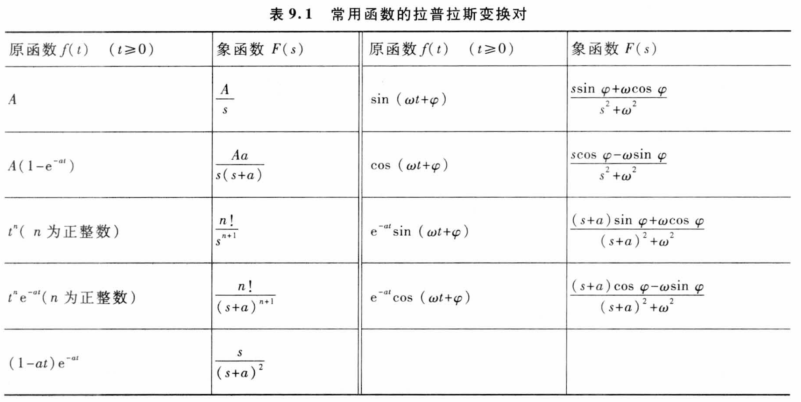

- 基本性质

  - 唯一性质
    $$
    \scr{L} \rm \{f_1(t)\} = F_1(s)\\
    \scr{L} \rm \{f_2(t)\}=F_2(s)
    $$

  - 线性性质

    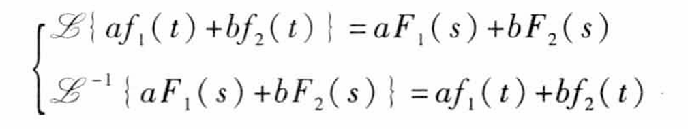

  - 微分性质

    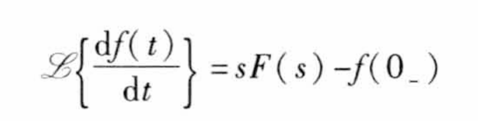

  - 积分性质

    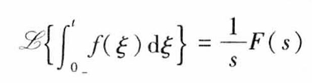

  - 延迟性质

    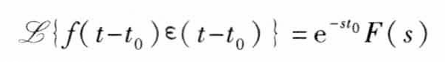

  - 位移性质

    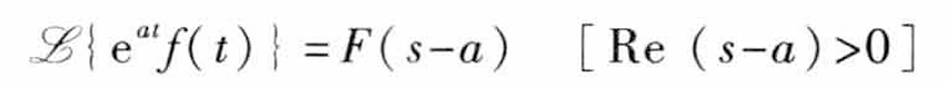

  - 初值定理

    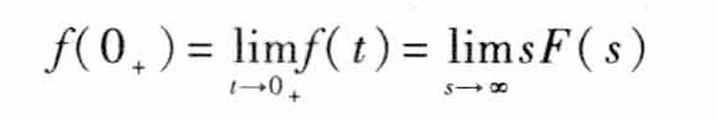

  - 终值定理

    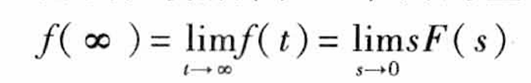

  - 卷积定理

    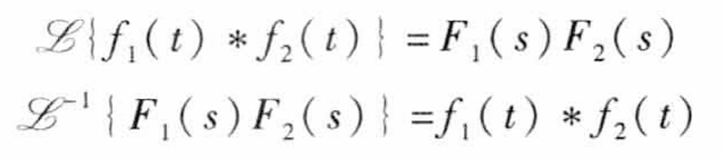

    

- 拉普拉斯逆变换（展开部分分式之和法）
  $$
  F(s)=\frac{F_1(s)}{F_2(s)}=\frac{b_ms^m+b_{m-1}s^{m-1}...}{a_ns^n+a_{n-1}s^{n-1}...}
  $$

  

  

  - $n\leq m$​ 情况：通过大除法，化为$F_3(s)+\frac{F'_1(s)}{F_2(s)}\\$​，其中 $\frac{F'_1(s)}{F_2(s)}\\$​ 为真分式
  
    - $F_3(s)$ 部分按以下方式化简
  
    $$
    \scr L\rm^{-1}\{s^k\}=\frac {d^k\delta(t)}{dt^k}\\
    \scr L\rm^{-1}\{1\}=\delta(t)\\
    $$
  
    
  
  - $n > m $ 情况：
    - $F_2(s)=0$ 只有单根

      - 将原式展开为

        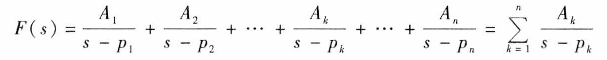
  
        - $p_1、p_2、··· 、p_k$ 称为 $F(s)$ 的极点
  
        - 求 $A_k$
          $$
          A_k=\lim_{s\rarr p_k}\frac{F_1(s)(s-p_k)}{F_2(p_k)}=\frac{F_1(p_k)}{F'_2(p_k)}
          $$
  
        - 取拉普拉斯逆变换
          $$
          f(t)=\scr L^{-1}\{\rm F(s)\}=\scr L^{-1}\{\rm \sum_{k=1}^n\frac{A_k}{s-p_k}\}=\sum_{k=1}^n{A_k}{e^{p_kt}}
          $$
  
      - 对于单复根情况可简化计算
        $$
        F(s)=\frac A{s-p}+\frac{\dot A}{s-\dot p}
        $$
  
        $$
        p=\alpha+j\beta\ \ \ A=|A|\angle\theta\\
        \dot p=\alpha-j\beta\ \ \ \dot A=|A|\angle-\theta
        $$

        $$
        f(t)=\scr L^{-1}\{\rm F(s)\}=Ae^{pt}+\dot Ae^{\dot pt}=2|A|e^{\alpha t}\cos(\beta t+ \theta)
        $$

    - $F_2(s)=0$ 含有重根

      - 将原式展开为

        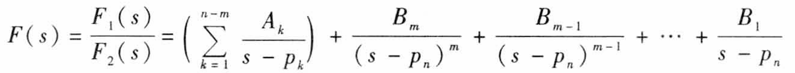

        - $A_k$ 求法同上

        - 求 $B_m$
  
          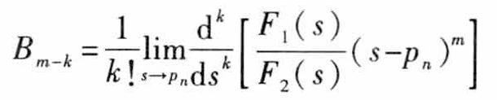
  
          

## 2、复频域中的电路定律与电路模型

- 基尔霍夫定律
  $$
  \sum I_k(s)=0\\
  \sum U_k(s)=0
  $$

- 电路模型

|                  |                             电阻                             |                             电感                             |                             电容                             |
| :--------------: | :----------------------------------------------------------: | :----------------------------------------------------------: | :----------------------------------------------------------: |
|     时域模型     | 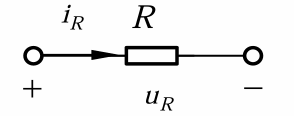 | 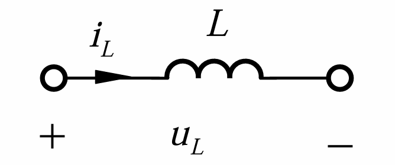 | 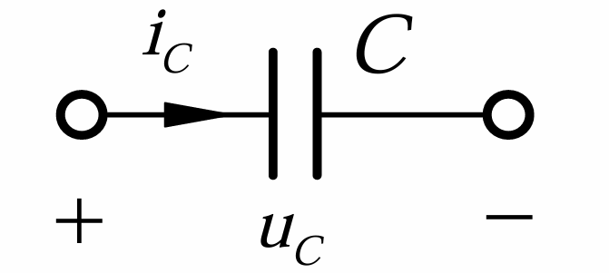 |
|  时域模型$ VCR$  |                          $u_R=Ri_R$                          |                    $u_L=L\frac{di}{dt}\\$                    |                  $i_C=C\frac {du_C}{dt}\\$                   |
|    复频域模型    | 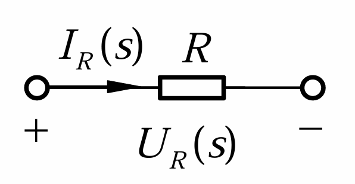 |  | 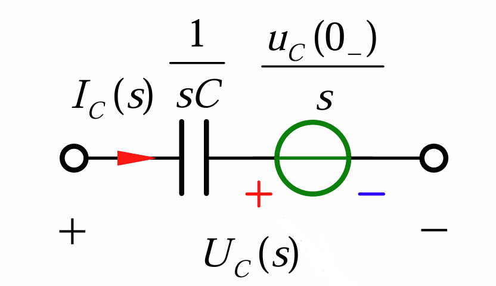 |
| 复频域模型 $VCR$ |                       $U_R(s)=RI_R(s)$                       |                 $U_L(s)=sLI_L(s)-Li_L(0_-)$                  |         $U_C(s)=\frac1{sC}I_C(s)+\frac{u_C(0_-)}s\\$         |

- 电感的附加电压源方向为：电感续流方向

- 电容的附加电压源方向为：电容放电方向

- 对于互感元件

  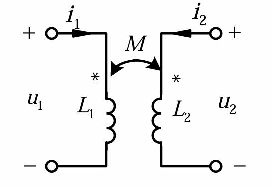

  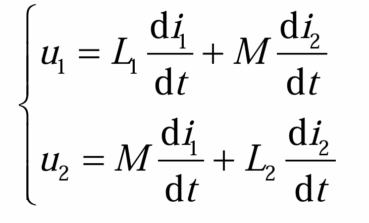

  - 复频域模型为

    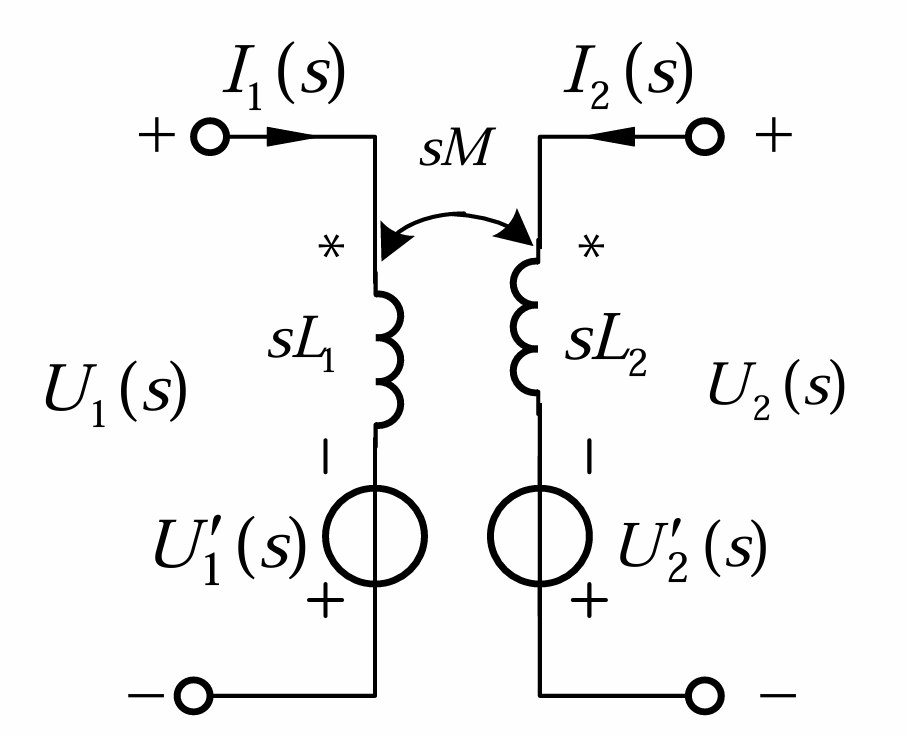

    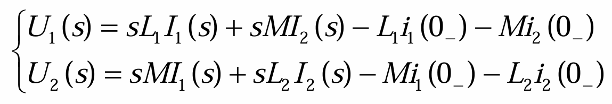

    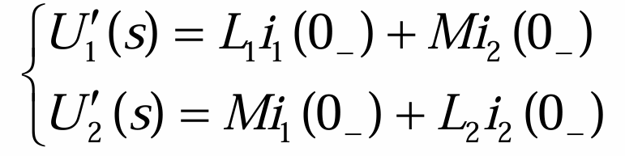

    

## 3、用拉普拉斯变换分析线性动态电路暂态过程

- 步骤
  1. 确定换路前电路全部电容电压和电感电流 $u_C(0_-)、i_L(0_-)$，并将激励的时域函数变换成象函数
  2. 根据换路后的电路画出运算电路
     -  $u_C(0_-)$ 和 $i_L(0_-)$ 的作用用附加电压源表示
     - 参数$R、L、C$ 均用运算阻抗表示
     - 已知的和待求的电压电流均用象函数表示
  3. 用各种计算方法求解响应的象函数
     - 节点电压
     - 回路电流
  4. 将响应的象函数变换为时域原函数
     - 部分分式展开法
     - 积分变换表

- 例题
  - 图示电路在开关断开前处于稳态，求开关断开后电路中的 $i_1、u_1、u_2$
  
    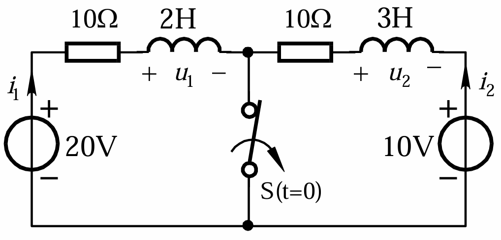
  
    - 求初值
      $$
      i_1(0_-)=\frac{20V}{10\ohm}=2A\\
      i_2(0_-)=\frac{10V}{10\ohm}=1A
      $$
      
  
    - 画出运算电路
  
      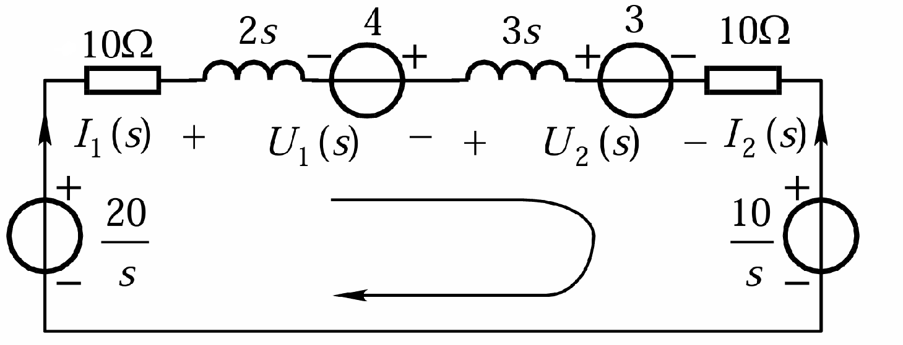
      $$
      (10+2s+3s+10)I_1(s)=\frac{20}s+4-3-\frac {10}s\\
      I_1(s)=\frac{2+0.2s}{s(s+4)}=\frac{0.5}s-\frac{0.3}{s+4}\\
      U_1(s)=2sI_1(s)-4=-3.6+\frac{2.4}{s+4}\\
      U_2(s)=3sI_1(s)+3=3.6+\frac{3.6}{s+4}\\
      $$
  
    - 将象函数转换为时域原函数
      $$
      i_1(t)=0.5-0.3e^{-4t}\ \ A\\
      u_1(t)=-3.6\times\delta(t)+2.4e^{-4t}\epsilon(t)\ \ \ V\\
      u_2(t)=3.6\times\delta(t)+3.6e^{-4t}\epsilon(t)\ \ \ V\\
      $$

## 4、网络函数

- 在只有一个独立电源作用的线性零状态电路中，响应象函数 $Y(s)$ 与激励象函数 $X(s)$成正比，比值为（复频域中的）网络函数，用符号 $H(s)$ 表示

  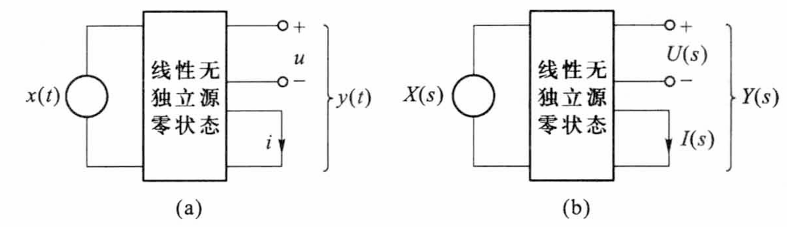
  $$
  H(s)=\frac{Y(s)}{X(s)}
  $$

  - 当 $x(t)=K\delta (t)$ 时，零状态响应 $y(t)=Kh(t)$

    - 故当 $X(s)=K$ 时，$Y(s)=K\scr L\rm \{h(t)\}$，即：
      $$
      H(s)=\scr L\rm \{h(t)\}
      $$

      - 故网络函数就是网络单位冲激特性的象函数
        $$
        H(s)=\scr L\rm \{h(t)\}\\
        h(s)=\scr L^{-1}\rm \{H(t)\}
        $$

      - 二者反映的都是网络的固有性质

        - 只与网络结构、参数有关
        - 与激励大小、函数形式无关
        - 反映的是网络暂态过程的特征函数

  - 若已知网络函数 $H(s)$ 和外加激励的象函数 $X(s)$，则零状态响应象函数为
    $$
    Y(s)=H(s)X(s)=\frac{N(s)}{D(s)}·\frac{P(s)}{Q(s)}=\frac{F_1(s)}{F_2(s)}
    $$

    - $F_2(s)=0$ 的根将包括 $D(s)=0$ 及 $Q(s)=0$ 的根
      -  $D(s)=0$ 的根属于强制分量
      -  $Q(s)=0$ 的根属于自由分量

- $H(s)$ 的极点位置与单位冲激特性的关系

  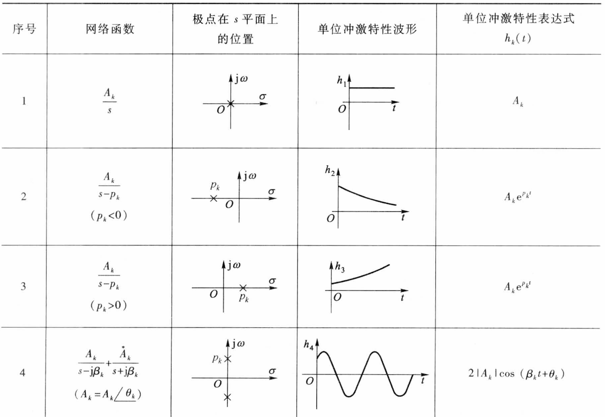

  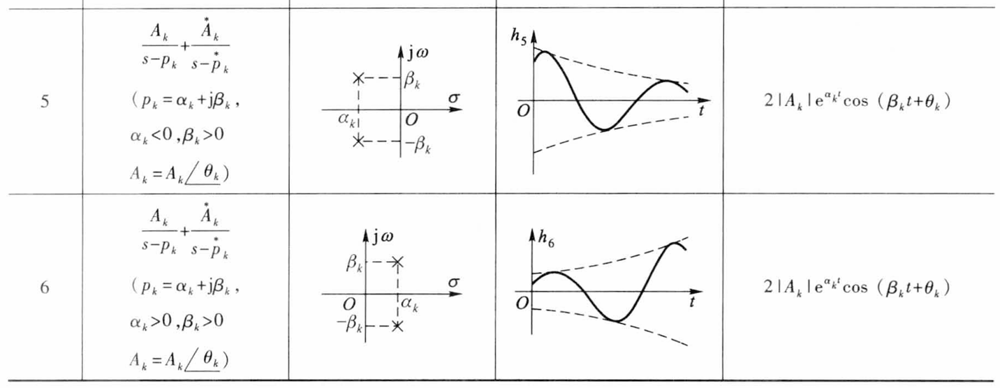

- 复频域网络函数与复数网络函数的关系
  $$
  H(j\omega)=H(s)|_{s=j\omega}\\
  H(s)=H(j\omega)|_{j\omega=s}
  $$

- 例题

  - 图示电路网络函数为 $H(s)=\frac{U_o(s)}{U_i(s)}=\frac1{(s+1)(s+2)}\\$，若输入正弦电压相量为 $\dot U_1=(-28+j24)V$ ，角频率为 $\omega = 4\ rad/s$，右已知 $u_O(0_+)=0，\frac{du_O}{dt}|_{t=0_+}=0\\$，求全响应 $u_O$ 

    
    $$
    u_O=u_{op}+u_{oh}=u_{op}+Ae^{-t}+Be^{-2t}
    $$

    - $u_{op}$ 由外加激励决定

    - $u_{oh}$ 取决于网络函数极点性质
      $$
      \dot U_{op}=H(j\omega)\dot U_i=\frac1{(j4+1)(j4+2)}\times (-28+j24)V=2V\\
      u_{op}=2\sqrt2\cos(4t)
      $$

      $$
      u_O(t)=2\sqrt2\cos(4t)+Ae^{-t}+Be^{-2t}\\
      \begin{cases}
      u_O(0_+)=2\sqrt2+A+B=0\\
      \frac{du_O}{dt}|_{t=0_+}=-A-2B=0\\
      \end{cases}\\
      \begin{cases}
      A=-4\sqrt2\\
      B=2\sqrt2\\
      \end{cases}
      $$

    - 故全响应
      $$
      u_O(t)=2\sqrt2\cos(4t)-4\sqrt2e^{-t}+2\sqrt2e^{-2t}\ \ V
      $$
      

